# System Design: GCP Translation Helpers Consolidation & Algorithmic Optimization

## 1. Executive Summary & Problem Context

Following the migration to **Google Cloud Document Translation API (Cloud Translation - Advanced v3)**, PhenomenalLayout operates as a high-throughput, serverless translation engine for full-length philosophical German treatises (50–1,000+ pages).

During rapid phase migration, several core patterns and algorithms were independently introduced across multiple micro-services, alongside remaining legacy morphological and choice-resolution routines. These redundant patterns create maintenance drag, code drift, and CPU/memory inefficiencies:

1. **Duplicated Cloud & Storage Operations**:
   - GCS URI parsing (`_parse_gcs_uri` and inlined string splits) is reimplemented across `GCPBatchTranslationService`, `GlossarySyncManager`, and `SessionGlossaryLifecycleManager`.
   - GCS blob deletion with error suppression is duplicated between `GlossarySyncManager` and `SessionGlossaryLifecycleManager`.
   - Exponential backoff retry loops with transient HTTP 429/503 and gRPC error handling are implemented in four slightly different ways across `BYOKCredentialsManager`, `GCPBatchTranslationService`, `GlossarySyncManager`, and `GoogleDriveExporter`.
2. **Duplicated RFC 4180 TSV Escaping & Serialization**:
   - `_escape_rfc4180_field` and TSV formatting loops are identical copies in `GlossaryCompiler` and `UserVocabularyStore`.
3. **Redundant PDF Stream Normalization & Descriptor Management**:
   - `_open_source` is independently implemented across `CostEstimator`, `FrakturClassifier`, `FallbackPageTranslator`, and `DualPaneViewerController`. Minor variations introduce bugs (e.g. `FrakturClassifier` forgets `source.seek(0)`) and risk file handle exhaustion under serverless scale-down (violating AGENTS.md §2.10).
4. **Repeated Heavy Binary TTF Table Parsing**:
   - In `FallbackPageTranslator`, `_parse_ttf_metrics_and_cmap` is invoked on every single failed page, repeatedly reading font bytes, unpacking binary tables, and building dictionary maps from scratch ($O(P \cdot \text{TTF\_size})$).
5. **Algorithmic Complexity Bottlenecks**:
   - `FrakturClassifier.classify_script` runs nested linear substring scans over font descriptors ($O(K \cdot L)$) and allocates 7 Python regex match lists per page via `pattern.findall(text)`.
   - `_is_compound_word` is implemented in 3 separate services (`ConfidenceScorer`, `MorphologicalAnalyzer`, `NeologismDetector`), recompiling regex patterns on every invocation.
   - `detect_choice_conflicts` in `UserChoiceModels` executes an unindexed $O(N^2)$ all-pairs scan across all choices, comparing mismatched terms pointlessly.
   - State files in `SessionGlossaryLifecycleManager` are written non-atomically via raw `write_text`, while `BatchJobRecoveryManager` implemented atomic temporary file swapping.

This system design consolidates these disparate algorithms into high-cohesion, single-responsibility helper modules in `utils/`, optimized for time and space complexity with zero breaking changes to existing service callers.

---

## 2. Architecture & Component Decomposition

```mermaid
flowchart TB
    subgraph Caller_Services["Domain & GCP Migration Services"]
        GCP_BATCH["GCPBatchTranslationService\n(services/gcp_batch_translation_service.py)"]
        GLOSS_SYNC["GlossarySyncManager\n(services/glossary_sync_manager.py)"]
        SESS_LIFE["SessionGlossaryLifecycleManager\n(services/session_glossary_lifecycle.py)"]
        BYOK_MGR["BYOKCredentialsManager\n(services/byok_credentials_manager.py)"]
        DRIVE_EXP["GoogleDriveExporter\n(services/google_drive_exporter.py)"]
        GLOSS_COMP["GlossaryCompiler\n(services/glossary_compiler.py)"]
        VOCAB_STORE["UserVocabularyStore\n(services/user_vocabulary_store.py)"]
        COST_EST["GCPCostEstimator\n(services/cost_estimator.py)"]
        FRAK_CLASS["FrakturClassifier\n(services/fraktur_classifier.py)"]
        FALLBACK["FallbackPageTranslator\n(services/fallback_translator.py)"]
        DUAL_PANE["DualPaneViewerController\n(services/dual_pane_viewer.py)"]
        CHOICE_MODELS["UserChoiceModels\n(models/user_choice_models.py)"]
        CHOICE_MGR["UserChoiceManager\n(services/user_choice_manager.py)"]
        CONF_SCORER["ConfidenceScorer\n(services/confidence_scorer.py)"]
        MORPH_ANALYZER["MorphologicalAnalyzer\n(services/morphological_analyzer.py)"]
        NEO_DETECTOR["NeologismDetector\n(services/neologism_detector.py)"]
    end

    subgraph Consolidated_Helpers["Consolidated Reusable Helper Modules (utils/)"]
        GCP_HELPERS["utils/gcp_helpers.py\n• parse_gcs_uri\n• delete_gcs_blob\n• format_gcp_glossary_name\n• retry_gcp_call / @retry_gcp_operation"]
        TSV_UTILS["utils/tsv_utils.py\n• escape_rfc4180_field\n• format_tsv_bytes"]
        PDF_STREAM["utils/pdf_stream.py\n• @contextmanager open_pdf_stream\n(Safe rewind, size calculation, auto-close)"]
        FILE_HANDLER["utils/file_handler.py\n• atomic_write_json\n• atomic_write_text\n(Tempfile + fsync + os.replace)"]
        LANG_UTILS["utils/language_utils.py\n• is_german_compound_word\n(Pre-compiled regexes & fast DFA)"]
        FONT_CACHE["services/fallback_translator.py (Internal Cache)\n• @lru_cache get_parsed_font_metrics"]
    end

    GCP_BATCH --> GCP_HELPERS
    GLOSS_SYNC --> GCP_HELPERS
    SESS_LIFE --> GCP_HELPERS
    SESS_LIFE --> FILE_HANDLER
    BYOK_MGR --> GCP_HELPERS
    DRIVE_EXP --> GCP_HELPERS

    GLOSS_COMP --> TSV_UTILS
    VOCAB_STORE --> TSV_UTILS

    COST_EST --> PDF_STREAM
    FRAK_CLASS --> PDF_STREAM
    FALLBACK --> PDF_STREAM
    FALLBACK --> FONT_CACHE
    DUAL_PANE --> PDF_STREAM

    CHOICE_MODELS --> CHOICE_MODELS
    CHOICE_MGR --> CHOICE_MODELS
    CONF_SCORER --> LANG_UTILS
    MORPH_ANALYZER --> LANG_UTILS
    NEO_DETECTOR --> LANG_UTILS
```

---

## 3. Subsystem Specifications

### 3.1 GCP Cloud & Storage Helpers (`utils/gcp_helpers.py`)

#### Responsibilities
1. **GCS URI Normalization & Parsing**:
   - `parse_gcs_uri(gcs_uri: str) -> tuple[str, str]`: Validates `gs://bucket/blob` format and extracts `(bucket_name, blob_name)`. Raises `ValueError` for invalid scheme or missing blob path.
2. **Safe Blob Deletion**:
   - `delete_gcs_blob(storage_client: StorageClient, gcs_uri: str) -> bool`: Parses URI, obtains blob reference, executes delete, suppresses `NotFound` exceptions safely, and returns success boolean.
3. **Glossary Resource Name Formatting**:
   - `format_gcp_glossary_name(project_id: str, location: str, glossary_id: str) -> str`: Produces `projects/{project_id}/locations/{location}/glossaries/{glossary_id}`. Normalizes inputs already carrying `projects/` prefixes.
4. **Unified Exponential Backoff & Retry**:
   - `is_transient_gcp_error(exc: Exception) -> bool`: Checks for Google API errors (`ResourceExhausted` / HTTP 429, `ServiceUnavailable` / HTTP 503, gRPC status codes 8 and 14).
   - `compute_backoff_delay(attempt: int, base_delay: float = 1.0, max_delay: float = 30.0, jitter_factor: float = 0.2) -> float`: Computes truncated exponential backoff with $\pm 20\%$ jitter.
   - `retry_gcp_call(fn: Callable[..., T], *args, max_retries: int = 5, base_delay: float = 1.0, max_delay: float = 30.0, **kwargs) -> T`: Executes callable with exponential backoff on transient errors.
   - `@retry_gcp_operation(max_retries=5, base_delay=1.0, max_delay=30.0)`: Decorator form for synchronizing retry behavior.

### 3.2 RFC 4180 TSV Compiler (`utils/tsv_utils.py`)

#### Responsibilities
1. **Zero-Copy Field Escaping**:
   - `escape_rfc4180_field(val: str) -> str`: Checks if delimiter characters (`\t`, `\n`, `\r`, `"`) exist. If none, returns original `val` with zero allocation. If present, replaces `"` with `""` and wraps in double quotes.
2. **High-Throughput TSV Byte Serialization**:
   - `format_tsv_bytes(entries: Mapping[str, str], header: tuple[str, str] = ("de", "en")) -> bytes`: Sorts keys for deterministic binary hashing, applies field escaping, and encodes to UTF-8 in a single buffer join.

### 3.3 Deterministic PDF Stream Normalization (`utils/pdf_stream.py`)

#### Responsibilities
1. **Context Manager Stream Handling**:
   - `@contextmanager open_pdf_stream(source: Path | str | bytes | BinaryIO, label: str = "PDF") -> Iterator[tuple[BinaryIO, float]]`:
     - Normalizes `Path` or `str` by opening file in `"rb"` mode and calculating file size via `os.path.getsize(source)` without memory overhead. Closes file in `finally`.
     - Normalizes `bytes` into `io.BytesIO(source)` with length `len(source)`. Closes stream in `finally`.
     - Normalizes seekable `BinaryIO` by rewinding (`source.seek(0)`), measuring size via `source.seek(0, 2)` then rewinding back to 0. Does NOT close user-owned external stream in `finally`.
     - Ensures complete descriptor safety across all callers and prevents leaks (AGENTS.md §2.10).

### 3.4 TrueType Font Metrics Caching (`services/fallback_translator.py`)

#### Responsibilities
1. **LRU-Cached TrueType Table Parser**:
   - `@functools.lru_cache(maxsize=4)` caching on parsed TrueType metrics `(units_per_em, gid_widths, char_to_gid)`.
   - When multiple failed pages trigger fallback translation, `Vera.ttf` is parsed exactly once in memory, avoiding redundant disk reads and thousands of binary table unpack operations.

### 3.5 Fraktur Script Classifier Optimization (`services/fraktur_classifier.py`)

#### Responsibilities
1. **Pre-Compiled Font Keyword DFA**:
   - `_FRAKTUR_FONT_RE = re.compile(r"(?i)(" + "|".join(_FRAKTUR_FONT_KEYWORDS) + ")")`.
   - Evaluates fonts in $O(M)$ time using compiled regular expression search rather than nested linear string scans.
2. **Allocation-Free Ligature & Character Counting**:
   - Uses `text.count("ſ")`, `text.count("st")`, and `text.count("st")` directly, utilizing CPython's Boyer-Moore string search fast path instead of allocating Python match lists via `len(pattern.findall(text))`.

### 3.6 German Compound Word Detection (`utils/language_utils.py`)

#### Responsibilities
1. **Consolidated Compound Detection**:
   - `is_german_compound_word(word: str) -> bool`:
     - Early length filter (`len(word) < 7`).
     - Fast upper-case count check for German noun compounds (`sum(1 for c in word if c.isupper()) >= 2`).
     - Set-based exclusion for common false-positive root nouns.
     - Module-level pre-compiled regex patterns for linking morphemes (`s`, `n`, `es`, `en`, `er`, etc.) and philosophical noun stems (`bewusstsein`, `wirklichkeit`, `erkenntnis`, `wahrnehmung`).

### 3.7 Choice Conflict Detection Optimization (`models/user_choice_models.py`)

#### Responsibilities
1. **Hash-Bucket Pair Comparison**:
   - `detect_choice_conflicts(choices: list[UserChoice], similarity_threshold: float = 0.8) -> list[ChoiceConflict]`:
     - Pass 1: Bucket choices by `choice.neologism_term.lower()` into `defaultdict(list)` in $O(N)$ time.
     - Pass 2: Iterate only over buckets with `len(bucket) > 1`. Compute pairwise similarity only between choices with matching terms.
     - Reduces comparison complexity from $O(N^2)$ to $O(N + \sum K_i^2)$ where $K_i \ll N$.

### 3.8 Crash-Safe Atomic Persistence (`utils/file_handler.py`)

#### Responsibilities
1. **Atomic File Replacement**:
   - `atomic_write_json(target_path: Path, data: Any, indent: int = 2) -> None`
   - `atomic_write_text(target_path: Path, text: str, encoding: str = "utf-8") -> None`
   - Uses `tempfile.NamedTemporaryFile` in target parent directory, writes content, flushes, calls `os.fsync(tmp.fileno())`, and executes atomic `os.replace`.

---

## 4. Algorithmic Time & Space Complexity Benchmark Matrix

| Algorithm / Helper | Current Time Complexity | Optimized Time Complexity | Current Space Complexity | Optimized Space Complexity | Primary Bottleneck Eliminated |
| :--- | :--- | :--- | :--- | :--- | :--- |
| **`detect_choice_conflicts`** | $O(N^2)$ all-pairs loop | $O(N + \sum K_i^2)$ bucketed | $O(1)$ auxiliary | $O(N)$ hash bucket | 500k comparisons reduced to <100 for $N=1,000$ |
| **`_parse_ttf_metrics_and_cmap`** | $O(P \cdot \text{TTF\_size})$ per page | $O(\text{TTF\_size})$ once, $O(1)$ page | $O(P \cdot G)$ repeated dicts | $O(G)$ single cache | Re-parsing 65KB TTF tables per fallback page |
| **`FrakturClassifier.classify_script`** | $O(P \cdot (K \cdot L + 7 \cdot \text{len}(T)))$ | $O(P \cdot (L + \text{len}(T)))$ | $O(M)$ allocated match lists | $O(1)$ integer counts | Nested keyword loops & 7 `findall` lists/page |
| **`is_german_compound_word`** | $O(W \cdot P)$ with `re.compile` | $O(W)$ pre-compiled DFA | $O(P)$ pattern lists | $O(1)$ static patterns | Regex re-compilation per word in confidence scorer |
| **`open_pdf_stream`** | $O(1)$ manual close | $O(1)$ deterministic context | $O(\text{File})$ in some paths | $O(1)$ streaming without buffer | File descriptor exhaustion on serverless scale-down |
| **`escape_rfc4180_field`** | $O(M)$ repeated copies | $O(M)$ with early return | $O(M)$ allocated strings | $O(1)$ for unescaped tokens | Copy-pasted function across 2 services |
| **`retry_gcp_call`** | $O(\text{retries})$ duplicate loops | $O(\text{retries})$ standardized | $O(1)$ scattered constants | $O(1)$ unified module | 4 inconsistent backoff implementations |
| **`atomic_write_json`** | $O(N)$ non-atomic in lifecycle | $O(N)$ fsync atomic | $O(N)$ buffer | $O(N)$ temp file | JSON corruption on container scale-to-zero |

---

## 5. Architectural Invariants & Guardrails

1. **Deterministic File Handle Cleanup (AGENTS.md §2.10)**:
   All services interacting with PDF sources MUST route through `open_pdf_stream` context manager or strictly handle descriptors with `try...finally`.
2. **Zero Breaking Changes / Backward Compatibility**:
   Existing service private methods (`_open_source`, `_parse_gcs_uri`, `_escape_rfc4180_field`) MUST be preserved as thin delegates to the consolidated helpers with docstrings indicating canonical locations, preventing existing unit tests from breaking.
3. **No External SaaS Dependencies**:
   All consolidated helpers rely strictly on standard library (`contextlib`, `io`, `pathlib`, `os`, `re`, `json`, `math`, `random`, `functools`) and core project dependencies (`pypdf`, `google-cloud-translate`, `google-cloud-storage`).
