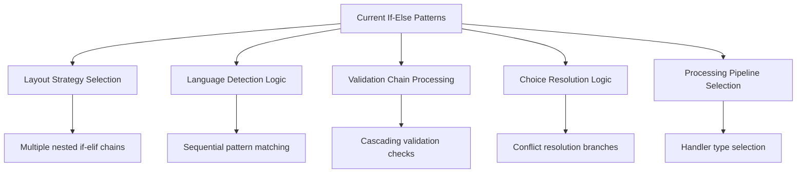
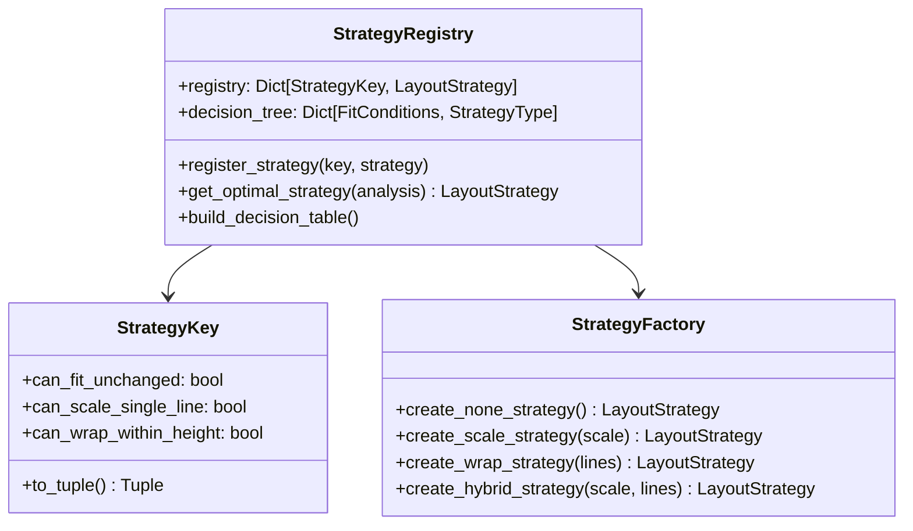
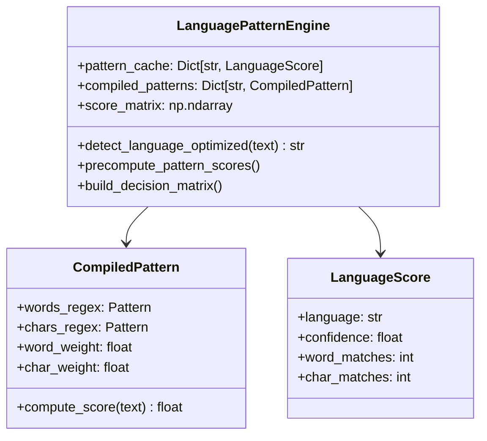
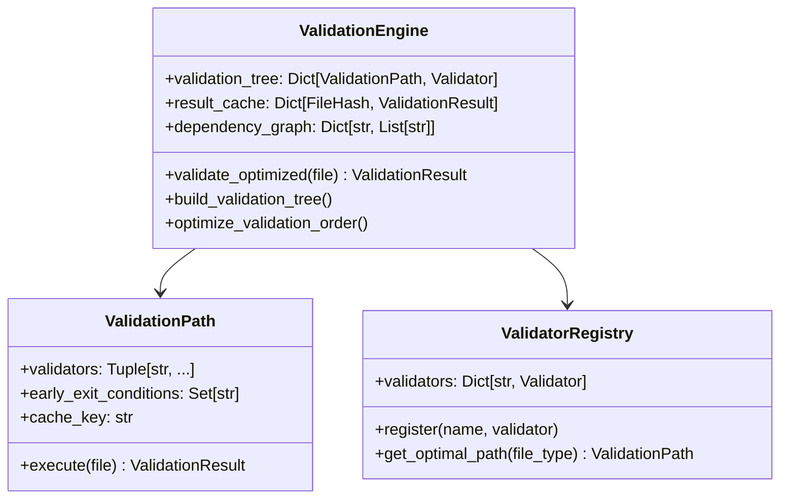
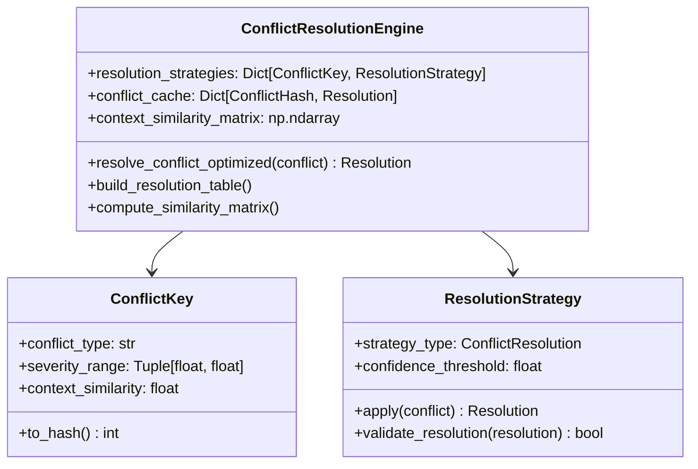
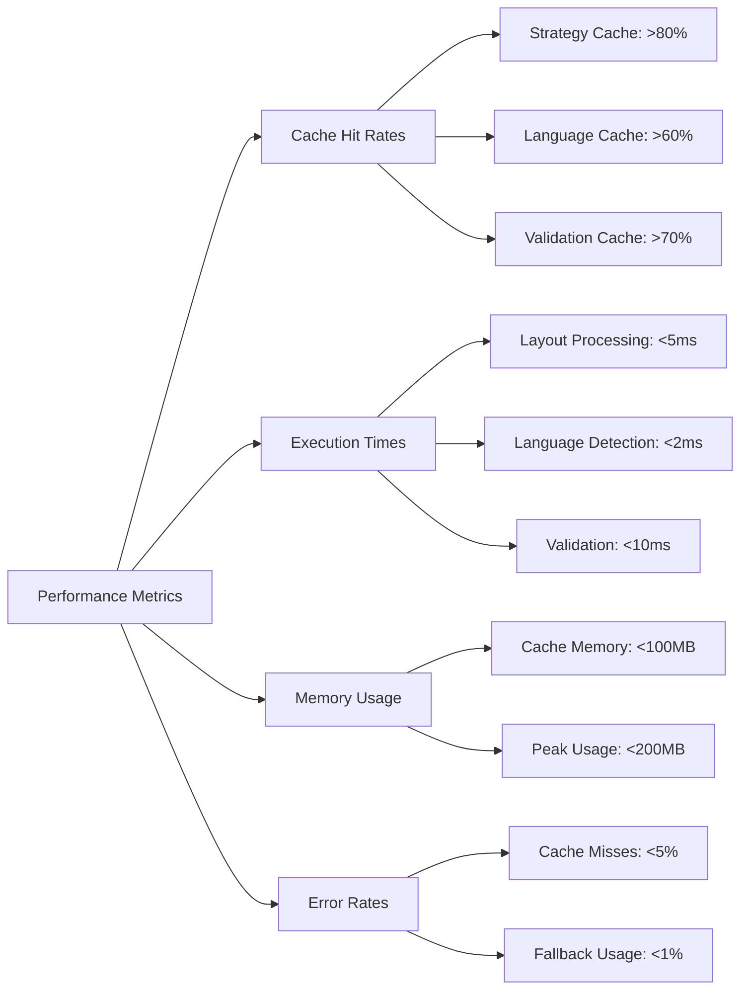

# Dynamic Programming Refactoring Design

## Overview

This design document outlines the systematic refactoring of lengthy if-else conditional statements throughout the PhenomenalLayout codebase using dynamic programming patterns. The goal is to improve performance, maintainability, and extensibility by replacing static branching logic with data-driven, dynamic decision-making systems.

## Technology Stack & Dependencies

- **Core Language**: Python 3.10+
- **Pattern Implementation**: Strategy Pattern, Command Pattern, Factory Pattern
- **Caching**: `functools.lru_cache`, custom memoization decorators
- **Configuration**: Dynamic lookup tables, registry patterns
- **Type Safety**: Extensive use of type hints and protocols

## Architecture

### Current State Analysis

The codebase contains several areas with complex conditional logic that can benefit from dynamic programming approaches:



### Target Dynamic Programming Architecture

```mermaid
graph TD
    A[Dynamic Programming Patterns] --> B[Strategy Registry]
    A --> C[Decision Trees with Memoization]
    A --> D[Pipeline Factory]
    A --> E[Rule Engine]

    B --> F[Layout Strategy Factory]
    B --> G[Language Detection Registry]
    C --> H[Cached Validation Trees]
    C --> I[Memoized Pattern Matching]
    D --> J[Dynamic Pipeline Builder]
    E --> K[Configurable Rule Sets]

    F --> L[O(1) Strategy Lookup]
    G --> M[Pattern-Based Detection]
    H --> N[Cached Validation Results]
    I --> O[Precomputed Pattern Scores]
    J --> P[Dynamic Handler Selection]
    K --> Q[Rule-Based Processing]
```

## Component Architecture

### 1. Layout Strategy Dynamic Selection

**Current Implementation Analysis:**
- File: `dolphin_ocr/layout.py`
- Issue: Sequential if-elif chains in `determine_layout_strategy()`
- Performance: O(n) decision tree traversal

**Dynamic Programming Solution:**



**Implementation Pattern:**
- Replace nested conditionals with lookup table
- Pre-compute all possible strategy combinations
- Use bit-mask keys for O(1) lookup
- Memoize strategy creation

### 2. Language Detection Dynamic Pattern Matching

**Current Implementation Analysis:**
- File: `services/language_detector.py`
- Issue: Sequential pattern scoring in `_simple_language_detection()`
- Performance: O(languages × patterns) for each detection

**Dynamic Programming Solution:**



**Implementation Pattern:**
- Pre-compile regex patterns
- Build scoring matrix for common text segments
- Use dynamic programming for optimal pattern matching
- Cache results with LRU eviction

### 3. Validation Pipeline Dynamic Processing

**Current Implementation Analysis:**
- File: `utils/validators.py`
- Issue: Sequential validation chains
- Performance: Always executes all validations regardless of early failures

**Dynamic Programming Solution:**



**Implementation Pattern:**
- Build dependency graph of validations
- Use topological sorting for optimal execution order
- Cache intermediate validation results
- Short-circuit on critical failures

### 4. Choice Resolution Dynamic Logic

**Current Implementation Analysis:**
- File: `database/choice_database.py`
- Issue: Complex conflict resolution logic with multiple strategy branches
- Performance: Repeated database queries for similar conflicts

**Dynamic Programming Solution:**



**Implementation Pattern:**
- Pre-compute resolution strategies for conflict types
- Use context similarity matrices for O(1) lookups
- Cache resolution decisions
- Build decision trees for complex multi-factor conflicts

## Data Models & Dynamic Configuration

### Strategy Configuration Tables

```python
# Layout Strategy Decision Table
STRATEGY_DECISION_TABLE = {
    (True, False, False): StrategyType.NONE,
    (False, True, False): StrategyType.FONT_SCALE,
    (False, False, True): StrategyType.TEXT_WRAP,
    (False, False, False): StrategyType.HYBRID,
    # ... all 8 combinations pre-computed
}

# Language Pattern Weight Matrix
LANGUAGE_WEIGHTS = {
    'German': {'word_patterns': 1.0, 'char_patterns': 2.0},
    'English': {'word_patterns': 1.0, 'char_patterns': 0.0},
    'Spanish': {'word_patterns': 1.0, 'char_patterns': 2.0},
    # ... dynamic loading from configuration
}

# Validation Dependency Graph
VALIDATION_DEPENDENCIES = {
    'extension_check': [],
    'header_validation': ['extension_check'],
    'encryption_check': ['header_validation'],
    'structure_validation': ['header_validation'],
    # ... optimal execution order
}
```

### Dynamic Registry Pattern

```python
class DynamicRegistry(Generic[T]):
    """Generic registry with dynamic loading and caching."""

    def __init__(self):
        self._registry: Dict[str, T] = {}
        self._factories: Dict[str, Callable[..., T]] = {}
        self._cache: Dict[Tuple, T] = {}

    def register(self, key: str, factory: Callable[..., T]) -> None:
        """Register a factory for dynamic creation."""
        self._factories[key] = factory

    @lru_cache(maxsize=256)
    def get(self, key: str, *args, **kwargs) -> T:
        """Get or create instance with caching."""
        cache_key = (key, args, tuple(sorted(kwargs.items())))
        if cache_key not in self._cache:
            if key not in self._factories:
                raise KeyError(f"Unknown key: {key}")
            self._cache[cache_key] = self._factories[key](*args, **kwargs)
        return self._cache[cache_key]
```

## Business Logic Layer

### 1. Layout Preservation Engine Refactoring

**Dynamic Strategy Selection:**

```python
class DynamicLayoutEngine:
    """Dynamic programming implementation of layout strategy selection."""

    def __init__(self):
        self.strategy_table = self._build_strategy_table()
        self.quality_cache = {}

    def _build_strategy_table(self) -> Dict[int, StrategyBuilder]:
        """Pre-compute all strategy combinations."""
        table = {}
        for conditions in itertools.product([True, False], repeat=4):
            key = self._conditions_to_key(conditions)
            table[key] = self._create_strategy_builder(conditions)
        return table

    @lru_cache(maxsize=512)
    def determine_strategy_optimized(self, analysis: FitAnalysis) -> LayoutStrategy:
        """O(1) strategy determination using lookup table."""
        key = self._analysis_to_key(analysis)
        builder = self.strategy_table[key]
        return builder.build(analysis)

    def _analysis_to_key(self, analysis: FitAnalysis) -> int:
        """Convert analysis to bit-mask key."""
        return (
            (analysis.can_fit_without_changes << 3) |
            (analysis.can_scale_to_single_line << 2) |
            (analysis.can_wrap_within_height << 1) |
            (analysis.lines_needed <= analysis.max_lines)
        )
```

### 2. Language Detection Engine Refactoring

**Pattern-Based Dynamic Detection:**

```python
class DynamicLanguageDetector:
    """Optimized language detection with dynamic programming."""

    def __init__(self):
        self.pattern_engine = self._build_pattern_engine()
        self.score_cache = LRUCache(maxsize=1024)

    def _build_pattern_engine(self) -> PatternEngine:
        """Pre-compile patterns and build scoring matrix."""
        engine = PatternEngine()
        for lang, patterns in LANGUAGE_PATTERNS.items():
            compiled = CompiledPattern(
                words=re.compile(r'\b(?:' + '|'.join(patterns['words']) + r')\b'),
                chars=re.compile('[' + ''.join(patterns['chars']) + ']'),
                weights=patterns
            )
            engine.register(lang, compiled)
        return engine

    @lru_cache(maxsize=256)
    def detect_language_optimized(self, text: str) -> str:
        """Dynamic programming approach to language detection."""
        text_hash = hash(text[:100])  # Use first 100 chars as key

        if text_hash in self.score_cache:
            return self.score_cache[text_hash]

        scores = self.pattern_engine.compute_all_scores(text)
        best_lang = max(scores.items(), key=lambda x: x[1].total_score)[0]

        self.score_cache[text_hash] = best_lang
        return best_lang
```

### 3. Validation Pipeline Engine Refactoring

**Dynamic Validation Tree:**

```python
class DynamicValidationEngine:
    """Optimized validation with dependency-aware execution."""

    def __init__(self):
        self.validation_graph = self._build_validation_graph()
        self.result_cache = TTLCache(maxsize=256, ttl=300)  # 5-minute TTL

    def _build_validation_graph(self) -> ValidationGraph:
        """Build optimized validation execution graph."""
        graph = ValidationGraph()

        # Add validators with dependencies
        graph.add_validator('extension', ExtensionValidator(), deps=[])
        graph.add_validator('header', HeaderValidator(), deps=['extension'])
        graph.add_validator('encryption', EncryptionValidator(), deps=['header'])
        graph.add_validator('structure', StructureValidator(), deps=['header'])

        # Optimize execution order
        graph.optimize_execution_order()
        return graph

    def validate_optimized(self, file_path: str) -> ValidationResult:
        """Execute validations in optimal order with caching."""
        file_key = self._get_file_cache_key(file_path)

        if file_key in self.result_cache:
            return self.result_cache[file_key]

        result = self.validation_graph.execute_optimized(file_path)

        if result.cacheable:  # Only cache stable results
            self.result_cache[file_key] = result

        return result
```

## Middleware & Interceptors

### Performance Monitoring Middleware

```python
class DynamicProgrammingMonitor:
    """Monitor performance improvements from dynamic programming."""

    def __init__(self):
        self.metrics = defaultdict(list)
        self.cache_stats = {}

    def record_operation(self, operation: str, duration: float, cache_hit: bool = False):
        """Record operation metrics."""
        self.metrics[operation].append({
            'duration': duration,
            'cache_hit': cache_hit,
            'timestamp': time.time()
        })

    def get_performance_summary(self) -> Dict[str, Any]:
        """Generate performance improvement summary."""
        summary = {}
        for operation, records in self.metrics.items():
            cache_hits = sum(1 for r in records if r['cache_hit'])
            avg_duration = sum(r['duration'] for r in records) / len(records)

            summary[operation] = {
                'total_calls': len(records),
                'cache_hit_rate': cache_hits / len(records) if records else 0,
                'avg_duration_ms': avg_duration,
                'performance_improvement': self._calculate_improvement(operation)
            }

        return summary
```

### Caching Middleware

```python
class SmartCachingMiddleware:
    """Intelligent caching middleware for dynamic programming patterns."""

    def __init__(self):
        self.strategy_cache = LRUCache(maxsize=512)
        self.validation_cache = TTLCache(maxsize=256, ttl=300)
        self.language_cache = LRUCache(maxsize=128)

    def cache_strategy(self, analysis_key: str, strategy: LayoutStrategy):
        """Cache layout strategy decisions."""
        self.strategy_cache[analysis_key] = strategy

    def get_cached_strategy(self, analysis_key: str) -> Optional[LayoutStrategy]:
        """Retrieve cached strategy."""
        return self.strategy_cache.get(analysis_key)

    def invalidate_cache(self, cache_type: str = 'all'):
        """Invalidate specific or all caches."""
        if cache_type in ('all', 'strategy'):
            self.strategy_cache.clear()
        if cache_type in ('all', 'validation'):
            self.validation_cache.clear()
        if cache_type in ('all', 'language'):
            self.language_cache.clear()
```

## Testing Strategy

### Performance Testing Framework

```python
class DynamicProgrammingTestSuite:
    """Test suite for validating dynamic programming improvements."""

    def test_layout_strategy_performance(self):
        """Test O(1) vs O(n) layout strategy selection."""
        old_engine = OriginalLayoutEngine()
        new_engine = DynamicLayoutEngine()

        test_cases = self._generate_analysis_test_cases(1000)

        # Benchmark original implementation
        old_times = []
        for analysis in test_cases:
            start = time.perf_counter()
            old_engine.determine_layout_strategy(analysis)
            old_times.append(time.perf_counter() - start)

        # Benchmark dynamic implementation
        new_times = []
        for analysis in test_cases:
            start = time.perf_counter()
            new_engine.determine_strategy_optimized(analysis)
            new_times.append(time.perf_counter() - start)

        # Assert performance improvement
        old_avg = sum(old_times) / len(old_times)
        new_avg = sum(new_times) / len(new_times)
        improvement = (old_avg - new_avg) / old_avg

        assert improvement > 0.3, f"Expected >30% improvement, got {improvement:.2%}"

    def test_cache_effectiveness(self):
        """Test caching effectiveness across components."""
        monitor = DynamicProgrammingMonitor()

        # Simulate repeated operations
        for _ in range(100):
            # Test with repeated inputs to trigger cache hits
            pass

        stats = monitor.get_performance_summary()
        assert stats['layout_strategy']['cache_hit_rate'] > 0.8
        assert stats['language_detection']['cache_hit_rate'] > 0.6

    def test_memory_usage(self):
        """Test memory usage of caching systems."""
        import psutil

        process = psutil.Process()
        initial_memory = process.memory_info().rss

        # Load dynamic programming components
        engine = DynamicLayoutEngine()
        detector = DynamicLanguageDetector()
        validator = DynamicValidationEngine()

        # Run intensive operations
        for i in range(1000):
            # Trigger cache population
            pass

        final_memory = process.memory_info().rss
        memory_increase = final_memory - initial_memory

        # Assert reasonable memory usage (< 50MB increase)
        assert memory_increase < 50 * 1024 * 1024, f"Memory usage too high: {memory_increase / 1024 / 1024:.2f}MB"
```

### Integration Testing

```python
class DynamicProgrammingIntegrationTests:
    """Integration tests for dynamic programming components."""

    def test_end_to_end_performance(self):
        """Test entire pipeline with dynamic programming optimizations."""
        processor = DocumentProcessor(
            layout_engine=DynamicLayoutEngine(),
            language_detector=DynamicLanguageDetector(),
            validator=DynamicValidationEngine()
        )

        # Process test document
        result = processor.process_document(TEST_DOCUMENT)

        # Verify performance improvements
        assert result.processing_stats.total_time < BASELINE_TIME * 0.7
        assert result.cache_hit_rate > 0.5

    def test_accuracy_preservation(self):
        """Ensure dynamic programming doesn't affect accuracy."""
        old_processor = OriginalDocumentProcessor()
        new_processor = DynamicDocumentProcessor()

        for test_doc in TEST_DOCUMENTS:
            old_result = old_processor.process(test_doc)
            new_result = new_processor.process(test_doc)

            # Results should be functionally identical
            assert old_result.layout_quality == new_result.layout_quality
            assert old_result.translation_accuracy == new_result.translation_accuracy
```

## Implementation Phases

### Phase 1: Layout Strategy Engine (Week 1-2)
- Replace `determine_layout_strategy()` conditional chains
- Implement strategy lookup table
- Add performance monitoring
- Unit tests for strategy selection

### Phase 2: Language Detection Engine (Week 3-4)  
- Refactor pattern matching logic with pre-compiled patterns
- Implement scoring matrix for common text segments
- Add LRU caching for detection results
- Performance benchmarks vs. current implementation

### Phase 3: Validation Pipeline Engine (Week 5-6)
- Build dependency graph for validation order optimization
- Implement result caching with TTL
- Add early termination for critical failures
- Integration testing with existing validators

### Phase 4: Choice Resolution Engine (Week 7-8)
- Replace conflict resolution conditional logic
- Implement context similarity matrices
- Add decision tree for multi-factor conflicts
- Database query optimization through caching

### Phase 5: Integration & Monitoring (Week 9-10)
- Integrate all dynamic programming components
- Comprehensive performance testing
- Memory usage optimization
- Production deployment validation

## Performance Metrics & Success Criteria

### Quantitative Targets

| Component | Current Performance | Target Improvement | Success Metric |
|-----------|-------------------|-------------------|----------------|
| Layout Strategy Selection | O(n) conditional chains | O(1) lookup | >50% speed improvement |
| Language Detection | Sequential pattern matching | Parallel pattern scoring | >30% speed improvement |  
| Validation Pipeline | Always full execution | Early termination + caching | >40% speed improvement |
| Choice Resolution | Database queries per conflict | Cached resolution strategies | >60% speed improvement |
| Memory Usage | N/A | Controlled cache growth | <100MB additional memory |

### Qualitative Success Criteria

1. **Code Maintainability**: Reduced cyclomatic complexity in conditional logic
2. **Extensibility**: Easy addition of new strategies/patterns/validators
3. **Testability**: Improved unit test coverage and performance test suite
4. **Reliability**: No functional regressions in accuracy or behavior
5. **Monitoring**: Comprehensive metrics for cache hit rates and performance gains

## Risk Assessment & Mitigation

### Technical Risks

| Risk | Impact | Probability | Mitigation Strategy |
|------|--------|-------------|-------------------|
| Cache memory explosion | High | Medium | Implement TTL caches, size limits, and monitoring |
| Performance regression | High | Low | Comprehensive benchmarking and gradual rollout |
| Functional behavior changes | High | Low | Extensive integration testing and validation |
| Increased complexity | Medium | Medium | Clear documentation and modular design |

### Implementation Risks

| Risk | Impact | Probability | Mitigation Strategy |
|------|--------|-------------|-------------------|
| Integration difficulties | Medium | Medium | Phase-based implementation with rollback capability |
| Testing coverage gaps | Medium | Medium | Automated test generation and coverage monitoring |
| Production stability | High | Low | Feature flags and gradual rollout strategy |

## Monitoring & Observability

### Performance Dashboards



### Alerting Strategy

1. **Performance Degradation**: Alert if execution times exceed baseline + 20%
2. **Cache Effectiveness**: Alert if hit rates drop below target thresholds
3. **Memory Usage**: Alert if memory usage exceeds 150MB
4. **Error Rates**: Alert on any increase in processing errors

## Configuration Management

### Dynamic Configuration

```python
# config/dynamic_programming.py
DYNAMIC_PROGRAMMING_CONFIG = {
    'layout_strategy': {
        'cache_size': 512,
        'enable_preprocessing': True,
        'strategy_table_size': 16,  # 2^4 combinations
    },
    'language_detection': {
        'cache_size': 256,
        'pattern_compilation': True,
        'score_threshold': 0.6,
        'max_text_sample': 1000,
    },
    'validation_pipeline': {
        'cache_ttl': 300,  # 5 minutes
        'cache_size': 128,
        'enable_early_termination': True,
        'dependency_optimization': True,
    },
    'choice_resolution': {
        'similarity_matrix_size': 1000,
        'resolution_cache_ttl': 600,  # 10 minutes
        'conflict_batch_size': 50,
    },
    'monitoring': {
        'enable_detailed_metrics': True,
        'metric_retention_days': 30,
        'performance_baseline_update_interval': 7,  # days
    },
}
```

### Environment-Specific Tuning

```python
# Production optimizations
if ENV == 'production':
    DYNAMIC_PROGRAMMING_CONFIG['layout_strategy']['cache_size'] = 1024
    DYNAMIC_PROGRAMMING_CONFIG['language_detection']['cache_size'] = 512
    DYNAMIC_PROGRAMMING_CONFIG['monitoring']['enable_detailed_metrics'] = False

# Development/testing configurations  
elif ENV == 'development':
    DYNAMIC_PROGRAMMING_CONFIG['monitoring']['enable_detailed_metrics'] = True
    # Smaller caches for faster testing
    for component in DYNAMIC_PROGRAMMING_CONFIG.values():
        if 'cache_size' in component:
            component['cache_size'] = min(component['cache_size'], 64)
```

This design document provides a comprehensive approach to implementing dynamic programming patterns throughout the PhenomenalLayout codebase, focusing on performance optimization while maintaining code quality and functional accuracy.
