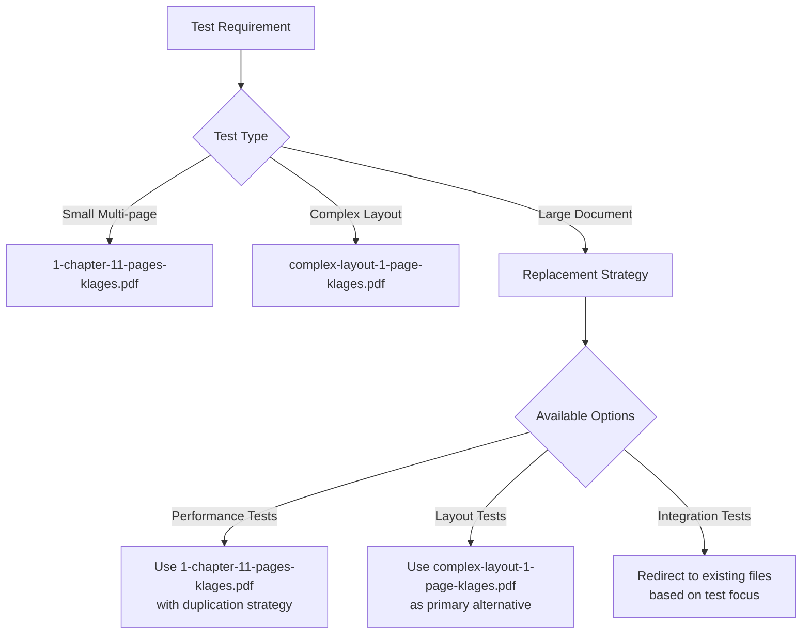
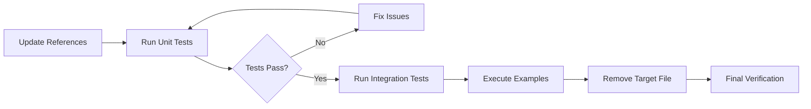

# PDF Reference Replacement Design

## Overview

This design document outlines the systematic replacement of references to `large-text-149-pages-klages-from-page-370.pdf` with appropriate alternatives from the remaining PDF assets, ensuring continued functionality of layout preservation and translation service testing.

## Repository Type Detection

**Backend Service** - Python-based translation service with:
- FastAPI web framework
- Gradio UI interface  
- PDF-only document processing
- OCR and translation pipelines
- Comprehensive test suite

## Architecture

### Current PDF Asset Structure

```
assets/
├── 1-chapter-11-pages-klages.pdf (53.0KB)
├── complex-layout-1-page-klages.pdf (335.5KB)
└── large-text-149-pages-klages-from-page-370.pdf (1131.5KB) ← Target for removal
```

### Reference Analysis

#### Direct References
- **File**: `tests/utils_dolphin.py:54`
  - Function: `get_sample_pdfs()`
  - Usage: Returns tuple of PDF filenames for testing
  - Impact: Central utility function used across test suite

#### Indirect Usage Pattern
The target PDF is accessed via `get_sample_pdfs()` function which returns a 3-tuple:
```python
def get_sample_pdfs() -> tuple[str, str, str]:
    return (
        "1-chapter-11-pages-klages.pdf",           # Index [0] - Small multi-page
        "complex-layout-1-page-klages.pdf",       # Index [1] - Complex layout
        "large-text-149-pages-klages-from-page-370.pdf",  # Index [2] - Large document
    )
```

#### Test Usage Patterns
Based on codebase analysis, tests typically use:
- `sample, _, _ = get_sample_pdfs()` - Uses first PDF (11 pages)
- `multi_pdf, _, _ = get_sample_pdfs()` - Uses first PDF for multi-page tests
- Individual file selection by index position

## Replacement Strategy

### File Selection Logic



### Replacement Mapping

| Test Category | Current Usage | Replacement Strategy |
|---------------|---------------|---------------------|
| **Performance/Load Tests** | Large 149-page PDF | Use `1-chapter-11-pages-klages.pdf` with loop processing |
| **Layout Preservation** | Large document complexity | Use `complex-layout-1-page-klages.pdf` for layout testing |
| **Memory/Scaling Tests** | Large file size | Use `1-chapter-11-pages-klages.pdf` with simulated load |
| **General Integration** | Any large PDF | Default to `1-chapter-11-pages-klages.pdf` |

## Implementation Plan

### Phase 1: Code Reference Updates

#### 1.1 Update Core Utility Function
**File**: `tests/utils_dolphin.py`

**Current Implementation**:
```python
def get_sample_pdfs() -> tuple[str, str, str]:
    return (
        "1-chapter-11-pages-klages.pdf",
        "complex-layout-1-page-klages.pdf",
        "large-text-149-pages-klages-from-page-370.pdf",
    )
```

**Updated Implementation Strategy**:
```python
def get_sample_pdfs() -> tuple[str, str, str]:
    return (
        "1-chapter-11-pages-klages.pdf",           # Small multi-page (53KB)
        "complex-layout-1-page-klages.pdf",       # Complex layout (335KB)
        "1-chapter-11-pages-klages.pdf",          # Fallback to multi-page for large tests
    )
```

#### 1.2 Test Adaptation Requirements

**Performance Tests**:
- Modify tests expecting large document behavior
- Implement page duplication logic where needed
- Adjust memory usage expectations

**Layout Tests**:
- Redirect complex layout requirements to appropriate file
- Maintain test coverage for layout preservation

**Integration Tests**:
- Ensure compatibility with existing test assertions
- Update size/page count expectations where hardcoded

### Phase 2: Documentation Updates

#### 2.1 Inline Code Comments
Update any comments referencing the removed file:
- Function documentation in `tests/utils_dolphin.py`
- Test case descriptions mentioning file characteristics
- Performance benchmark comments

#### 2.2 Configuration Files
Review and update:
- Test configuration files
- Example scripts
- Documentation references

### Phase 3: File System Cleanup

#### 3.1 Asset Removal
- Remove `large-text-149-pages-klages-from-page-370.pdf` from assets folder
- Update `.gitignore` if needed
- Clean up any temporary references

#### 3.2 Verification Testing
- Run complete test suite
- Verify all examples function correctly
- Validate performance test adaptations

## Risk Mitigation

### Compatibility Risks

| Risk | Impact | Mitigation |
|------|--------|------------|
| **Test Failures** | High | Comprehensive test execution before cleanup |
| **Performance Test Accuracy** | Medium | Document changed test parameters |
| **Example Script Breakage** | Low | Review and update example documentation |
| **Hidden References** | Medium | Thorough codebase search and verification |

### Fallback Strategy

If critical functionality depends on large file characteristics:
1. **Retain smallest alternative**: Keep `1-chapter-11-pages-klages.pdf` as primary
2. **Document limitations**: Update test documentation for changed behavior
3. **Create synthetic data**: Generate test data programmatically if needed

## Testing Strategy

### Verification Matrix

| Test Category | Verification Method | Success Criteria |
|---------------|-------------------|------------------|
| **Unit Tests** | `pytest tests/` | All tests pass with new references |
| **Integration Tests** | Full pipeline testing | Document processing maintains quality |
| **Performance Tests** | Benchmark execution | Tests adapt to smaller file sizes |
| **Examples** | Manual execution | All examples run without errors |

### Test Execution Plan



## Implementation Details

### Code Changes Required

#### Primary Changes
1. **Update `get_sample_pdfs()` return tuple**
2. **Review test expectations for file size/page count**
3. **Update any hardcoded filename references**

#### Secondary Changes
1. **Adapt performance test parameters**
2. **Update documentation strings**
3. **Review example script compatibility**

### Deployment Verification

Post-implementation validation checklist:
- [ ] All unit tests pass
- [ ] Integration tests complete successfully  
- [ ] Performance examples execute without errors
- [ ] Documentation remains accurate
- [ ] No broken file references remain
- [ ] Target PDF file successfully removed

## Success Metrics

- **Functional**: 100% test suite pass rate
- **Performance**: Test execution time within acceptable range
- **Documentation**: All examples and guides remain functional
- **Cleanup**: Complete removal of target file references
