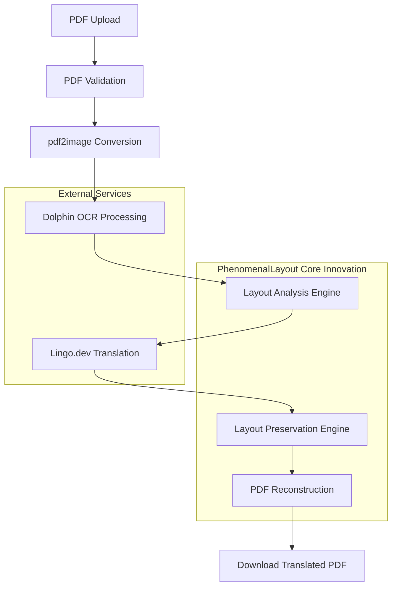
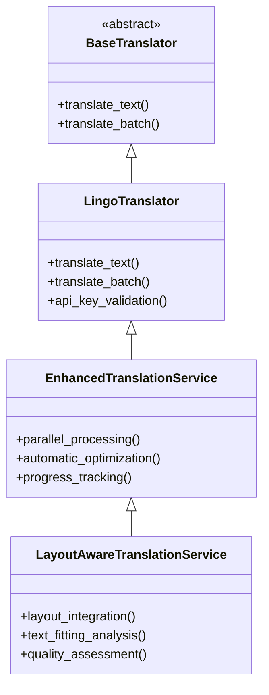

# PhenomenalLayout Project Rebranding Design

## Overview

This design document outlines the comprehensive rebranding of the document translation project from "deeplx-translate-format-intact" to "PhenomenalLayout". The new name emphasizes the core innovation: preserving document layout integrity during translation, which is the primary technical contribution of this project beyond the foundational services provided by Lingo.dev and ByteDance's Dolphin OCR.

## Technology Stack & Dependencies

**Backend Architecture:**
- FastAPI with Gradio interface
- Python 3.8-3.12 (3.11/3.12 recommended)
- PDF processing: pdf2image, pypdf, reportlab
- Image processing: Pillow 11.3.0

**External Services Integration:**
- Lingo.dev API for translation services
- ByteDance Dolphin OCR via HuggingFace Spaces
- Poppler runtime for PDF conversion

## Architecture

### Core Processing Pipeline



### Component Architecture

**Layout Preservation Engine** (`dolphin_ocr/layout.py`)
- Font scaling algorithms (0.6-1.2x range)
- Text wrapping optimization
- Bounding box analysis and fitting
- Quality scoring for layout decisions

**Layout-Aware Translation Service** (`services/layout_aware_translation_service.py`)
- Integration between Lingo.dev translation and layout preservation
- Batch processing with layout context
- Confidence-aware optimization
- Length-aware text compression

**Document Reconstruction** (`services/pdf_document_reconstructor.py`)
- Image-text overlay technique
- Pixel-perfect text positioning
- Font and styling preservation
- Background image integration

## Layout Preservation Strategy

### Text Fitting Analysis

| Strategy Type | Trigger Condition | Implementation |
|---------------|------------------|----------------|
| NONE | Translation fits original bounds | No adjustments needed |
| FONT_SCALE | Minor size increase | Scale font down (0.6-1.2x) |
| TEXT_WRAP | Significant overflow | Multi-line wrapping |
| BBOX_EXPAND | Cannot fit with scaling/wrapping | Expand bounding box |

### Quality Metrics

**Layout Preservation Quality Score:**
- Font scaling factor impact: (1.0 - |1.0 - scale_factor|)
- Text wrapping penalty: 0.1 per additional line
- Bounding box expansion penalty: 0.2 per expansion
- Overall score: weighted combination (0.0-1.0)

## API Endpoints Reference

### Translation Processing

**POST `/api/translate`**
```json
{
  "file": "multipart/form-data",
  "source_lang": "string",
  "target_lang": "string",
  "max_pages": "integer",
  "philosophy_mode": "boolean"
}
```

**Response Schema:**
```json
{
  "job_id": "string",
  "status": "processing|completed|failed",
  "progress": "integer",
  "download_url": "string"
}
```

### Status Monitoring

**GET `/api/status/{job_id}`**
```json
{
  "status": "string",
  "progress": "integer",
  "processing_time": "float",
  "layout_metrics": {
    "total_elements": "integer",
    "elements_scaled": "integer",
    "elements_wrapped": "integer",
    "avg_quality_score": "float"
  }
}
```

## Data Models & Processing

### Layout Context Model

```python
@dataclass
class LayoutContext:
    bbox: BoundingBox
    font: FontInfo  
    ocr_confidence: float

@dataclass  
class TextBlock:
    text: str
    layout: LayoutContext
```

### Translation Quality Assessment

**TranslationQualityValidator:**
- Base confidence threshold: 0.8
- Layout preservation impact scoring
- Combined quality assessment for translation decisions

### Processing Metrics

**DocumentMetadata:**
- File type and size analysis
- Total pages and text elements
- Processing time tracking
- DPI and quality settings

## Business Logic Layer

### Parallel Translation Architecture

**High-Performance Processing:**
- 5-10x speed improvement for large documents
- Configurable concurrency (up to 10 concurrent requests)
- Intelligent rate limiting (5 requests/second default)
- Exponential backoff retry mechanisms

**Batch Processing Strategy:**
- Configurable chunk sizes (50 texts per batch)
- Memory-efficient streaming for large documents
- Automatic optimization based on workload size

### Translation Service Hierarchy



## Middleware & Configuration

### Environment Configuration

**Core Settings:**
- `PDF_DPI`: 300 (rendering resolution)
- `PRESERVE_IMAGES`: true (background preservation)
- `MEMORY_THRESHOLD_MB`: 500 (processing limits)

**Translation API:**
- `LINGO_API_KEY`: Required for translation functionality
- `DOLPHIN_ENDPOINT`: HuggingFace Spaces endpoint

**Performance Tuning:**
- `MAX_CONCURRENT_REQUESTS`: 10 (parallel processing)
- `MAX_REQUESTS_PER_SECOND`: 5.0 (rate limiting)
- `TRANSLATION_BATCH_SIZE`: 50 (batch optimization)

### Error Handling Strategy

**PDF Validation:**
- Structural integrity checks
- Encryption detection (DOLPHIN_005/DOLPHIN_014 error codes)
- File size and format validation

**OCR Resilience:**
- Graceful degradation on OCR failures
- Fallback to empty layout structure
- Comprehensive error logging

**Translation Fallbacks:**
- Original text preservation on translation failure
- Retry mechanisms with exponential backoff
- API rate limit respect and recovery

## Testing Strategy

### Unit Testing Coverage

**Core Components:**
- Layout preservation engine algorithms
- Translation service integration
- Document processing pipeline
- PDF reconstruction accuracy

**Integration Testing:**
- End-to-end document processing
- External API integration (Lingo.dev, Dolphin)
- Performance benchmarking
- Error scenario handling

### Performance Testing

**Benchmarks:**
- Large document processing (2,000+ pages)
- Parallel vs sequential performance comparison
- Memory usage optimization validation
- API rate limit compliance

## File Structure Changes

### Repository Rebranding Updates

| File | Current Reference | Updated Reference |
|------|------------------|------------------|
| `pyproject.toml` | `name = "deeplx-translate-format-intact"` | `name = "PhenomenalLayout"` |

### Documentation Updates

**README.md Enhancements:**
- Emphasize layout preservation as core innovation
- Highlight integration between Lingo.dev and Dolphin OCR
- Position PhenomenalLayout as the orchestration layer

**Technical Documentation:**
- Update project title throughout codebase
- Enhance layout preservation algorithm documentation
- Clarify the role of external services vs. internal innovation

## Deployment Strategy

### Environment Setup

**Development:**
```bash
pip install -r requirements.txt
export LINGO_API_KEY="your_api_key"
export DOLPHIN_ENDPOINT="https://your-modal-domain.example/api/dolphin"
python app.py
```

**Production:**
```bash
uvicorn app:app --host 0.0.0.0 --port $PORT
```

### Dependency Management

**Critical Dependencies:**
- Poppler runtime installation required
- Python version compatibility (3.8-3.12)
- External service API key management

## Migration Considerations

### Breaking Changes

**Legacy System Removal:**
- Complete PyMuPDF/fitz engine removal
- DOCX/TXT processing discontinued (PDF-only focus)
- Updated error codes for invalid/encrypted PDFs

**Configuration Updates:**
- Remove: `USE_PYMUPDF`, `PDF_TEXT_EXTRACTION_MODE`
- Add: `PDF_DPI`, `DOLPHIN_ENDPOINT`, parallel processing settings

### Data Migration

**Layout Metadata:**
- Regenerate layout backups using new engine
- Update metadata extraction with enhanced metrics
- Preserve existing translation quality data

## Quality Assurance

### Layout Preservation Metrics

**Quality Indicators:**
- Font scaling distribution analysis
- Text wrapping frequency tracking
- Bounding box expansion monitoring
- Overall layout preservation scoring

**Performance Monitoring:**
- Processing time per page
- Memory usage optimization
- API response time tracking
- Error rate analysis

### Success Criteria

**Technical Objectives:**
- 95%+ layout preservation quality score
- 5-10x performance improvement for large documents
- <2% translation error rate
- Robust handling of complex document structures

**User Experience Goals:**
- Real-time progress tracking
- Comprehensive error reporting
- Intuitive web interface
- Reliable download functionality
