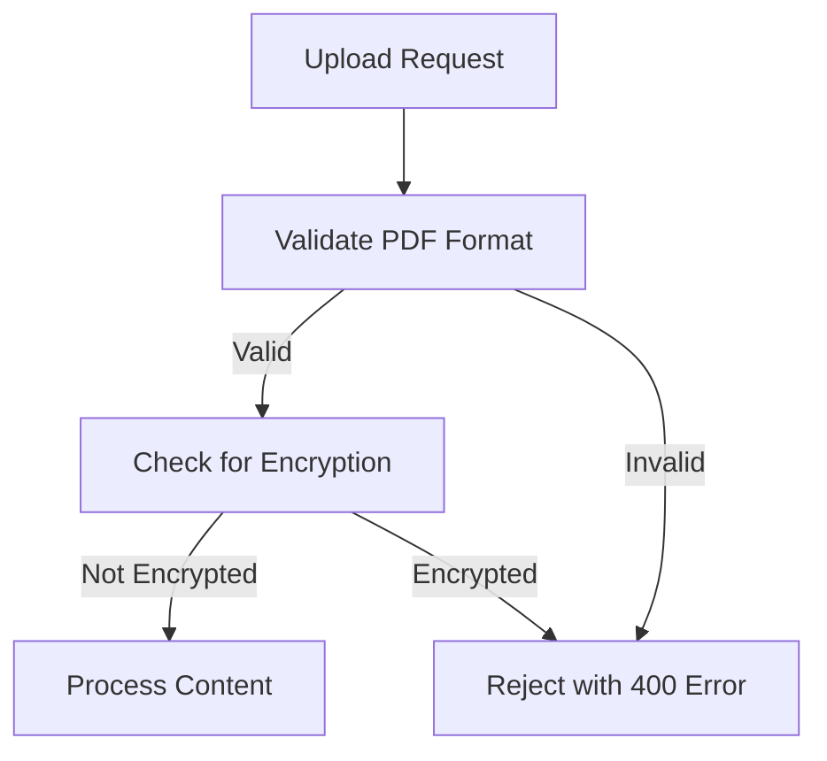
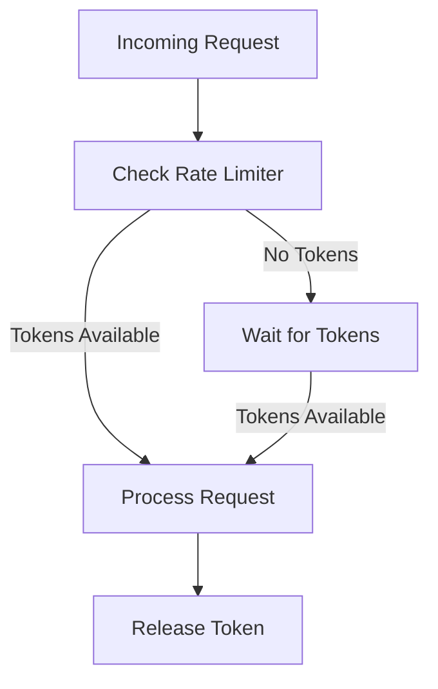
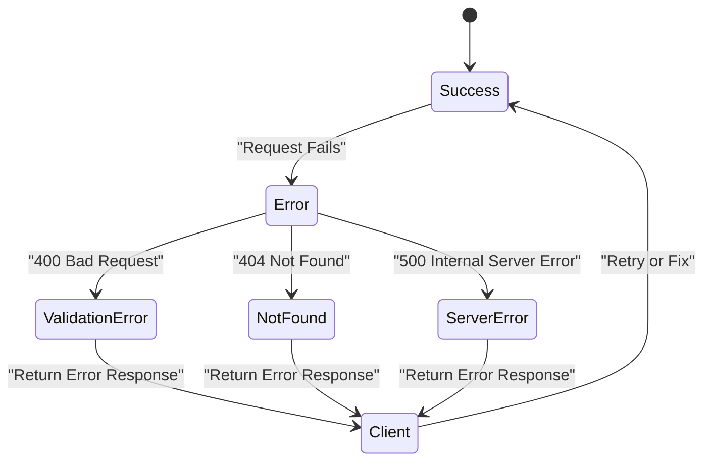
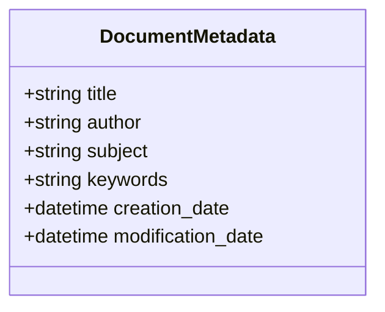
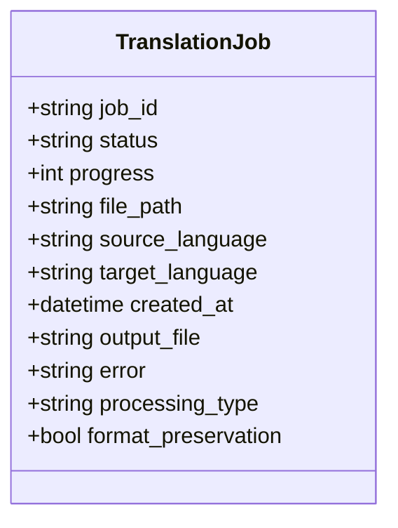
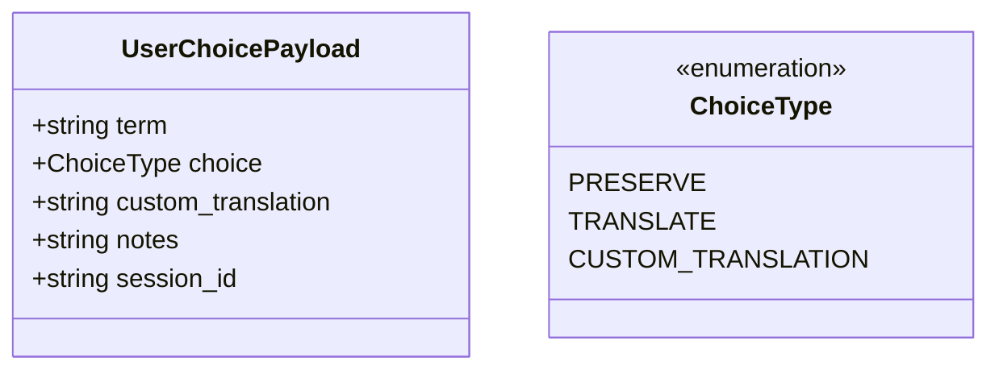
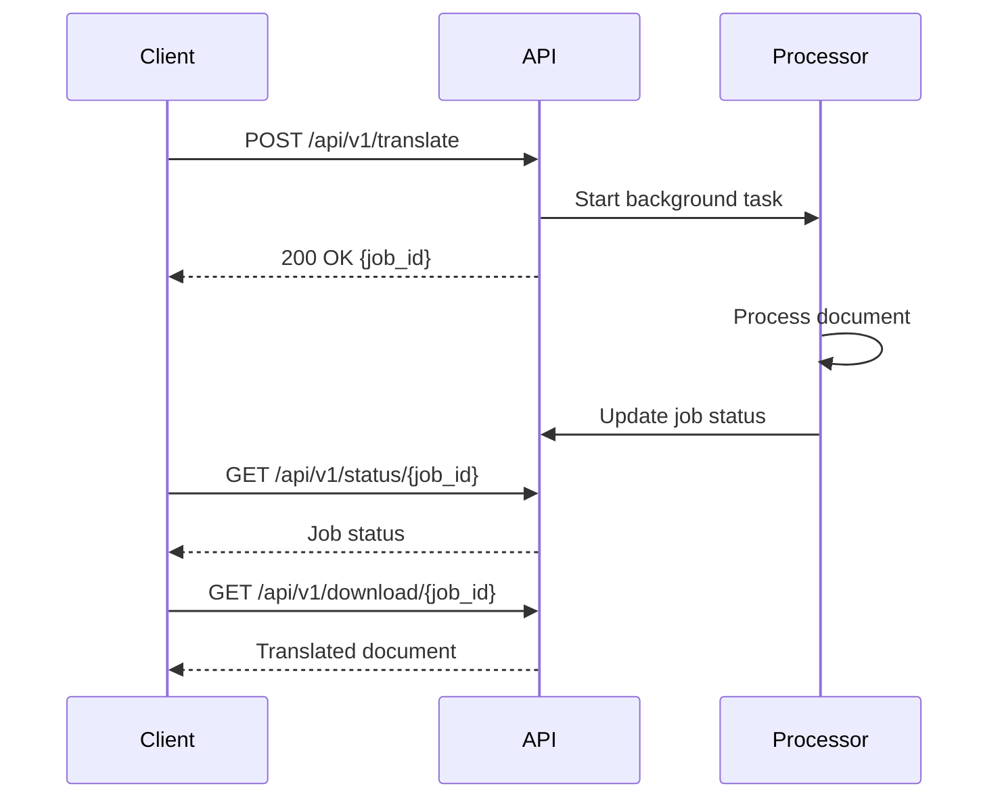

# API Endpoints Reference

<cite>
**Referenced Files in This Document**  
- [app.py](file://app.py)
- [api/routes.py](file://api/routes.py)
- [models/user_choice_models.py](file://models/user_choice_models.py)
- [models/neologism_models.py](file://models/neologism_models.py)
- [services/async_document_processor.py](file://services/async_document_processor.py)
- [services/main_document_processor.py](file://services/main_document_processor.py)
- [services/enhanced_translation_service.py](file://services/enhanced_translation_service.py)
- [services/parallel_translation_service.py](file://services/parallel_translation_service.py)
- [services/dolphin_ocr_service.py](file://services/dolphin_ocr_service.py)
- [services/layout_aware_translation_service.py](file://services/layout_aware_translation_service.py)
</cite>

## Table of Contents
1. [Introduction](#introduction)
2. [Versioning and Compatibility](#versioning-and-compatibility)
3. [Authentication and Security](#authentication-and-security)
4. [Rate Limiting](#rate-limiting)
5. [Error Handling](#error-handling)
6. [Core Endpoints](#core-endpoints)
7. [Philosophy-Enhanced Endpoints](#philosophy-enhanced-endpoints)
8. [Request/Response Schemas](#requestresponse-schemas)
9. [Asynchronous Processing Model](#asynchronous-processing-model)
10. [Integration Patterns](#integration-patterns)

## Introduction
The PhenomenalLayout API provides advanced document translation services with a focus on preserving the original layout, formatting, and philosophical context of the source document. The API is built on FastAPI and follows RESTful principles, offering a set of endpoints for uploading documents, initiating translations, checking job status, and downloading results. It also features a unique philosophy-enhanced translation system that allows users to make informed choices about the translation of neologisms and philosophical terms.

The core workflow is asynchronous, allowing clients to submit a translation job and then poll for its status until completion. This design ensures that the server can handle large documents and complex processing tasks without blocking client requests. The API is designed to be robust, with comprehensive error handling, input validation, and security measures in place.

This documentation covers all public endpoints, detailing their HTTP methods, URL patterns, request parameters, request body schemas, and response formats. It also explains the asynchronous processing model, error codes, and integration patterns with the frontend.

**Section sources**
- [app.py](file://app.py#L1-L120)
- [api/routes.py](file://api/routes.py#L1-L520)

## Versioning and Compatibility
The PhenomenalLayout API uses a versioned endpoint strategy to ensure backward compatibility and support for future enhancements. All API endpoints are prefixed with `/api/v1`, indicating the current major version of the API.

```mermaid
graph TD
Client[Client Application] --> |POST /api/v1/upload| API[PhenomenalLayout API]
API --> |POST /api/v1/translate| Processor[Document Processor]
Processor --> |GET /api/v1/status/{job_id}| Client
Client --> |GET /api/v1/download/{job_id}| API
API --> |File Response| Client
```

**Diagram sources **
- [app.py](file://app.py#L1-L120)
- [api/routes.py](file://api/routes.py#L1-L520)

The versioning strategy is designed to be stable and predictable. Breaking changes to the API will result in a new major version (e.g., v2), while non-breaking changes such as new endpoints or additional fields in responses will be added to the current version. Clients are encouraged to pin their requests to a specific version to avoid unexpected changes in behavior.

The current API version is v1, and it is considered stable. Future versions will be introduced with a new prefix (e.g., `/api/v2`) and will coexist with the previous version for a deprecation period. During this period, both versions will be supported, allowing clients time to migrate.

**Section sources**
- [app.py](file://app.py#L1-L120)
- [api/routes.py](file://api/routes.py#L1-L520)

## Authentication and Security
The PhenomenalLayout API does not require authentication for its core document translation endpoints. This design decision was made to facilitate easy integration and testing. However, the API implements several security measures to protect against common vulnerabilities.

For file uploads, the API performs strict validation to ensure that only PDF files are accepted. This is done by checking both the file extension and the file header. Additionally, the API checks for encrypted PDFs, which are not supported, to prevent potential security issues.



**Diagram sources **
- [api/routes.py](file://api/routes.py#L1-L520)
- [utils/pdf_validator.py](file://utils/pdf_validator.py#L1-L50)

The philosophy-enhanced endpoints, which deal with user choices and neologism management, are designed with security in mind. While they do not require authentication, they sanitize all metadata to prevent the exposure of server filesystem paths. This is achieved by removing any keys or values that resemble filesystem paths from the metadata before it is returned to the client.

The API also uses CORS (Cross-Origin Resource Sharing) to allow requests from any origin, which is suitable for development and testing. In a production environment, this should be restricted to specific domains.

**Section sources**
- [api/routes.py](file://api/routes.py#L1-L520)
- [utils/pdf_validator.py](file://utils/pdf_validator.py#L1-L50)

## Rate Limiting
The PhenomenalLayout API implements rate limiting at the service level to prevent abuse and ensure fair usage of resources. The rate limiting is applied to the OCR service, which is the most resource-intensive part of the processing pipeline.

The rate limiting is implemented using a token bucket algorithm, which allows for a burst of requests up to a certain limit, followed by a steady rate of requests. The configuration for the rate limiter is loaded from environment variables, allowing for easy adjustment without code changes.



**Diagram sources **
- [services/parallel_translation_service.py](file://services/parallel_translation_service.py#L1-L709)
- [services/dolphin_ocr_service.py](file://services/dolphin_ocr_service.py#L1-L375)

The rate limiting parameters are as follows:
- **Max Requests per Second**: The maximum number of requests that can be made per second. This is configurable via the `MAX_REQUESTS_PER_SECOND` environment variable.
- **Burst Allowance**: The number of requests that can be made in a burst. This is configurable via the `TRANSLATION_BURST_ALLOWANCE` environment variable.
- **Max Concurrent Requests**: The maximum number of requests that can be processed concurrently. This is configurable via the `MAX_CONCURRENT_REQUESTS` environment variable.

These settings are designed to balance performance and resource usage, ensuring that the API can handle a high volume of requests without overwhelming the server.

**Section sources**
- [services/parallel_translation_service.py](file://services/parallel_translation_service.py#L1-L709)
- [services/dolphin_ocr_service.py](file://services/dolphin_ocr_service.py#L1-L375)

## Error Handling
The PhenomenalLayout API uses a standardized error handling system to provide clear and consistent error messages to clients. Errors are returned with appropriate HTTP status codes and a JSON response body that includes an error code, a human-readable message, a timestamp, and additional context.



**Diagram sources **
- [api/routes.py](file://api/routes.py#L1-L520)
- [dolphin_ocr/errors.py](file://dolphin_ocr/errors.py#L1-L50)

The API defines a set of error codes that are used to identify specific types of errors. These codes are prefixed with `DOLPHIN_` to indicate that they are specific to the Dolphin OCR service. For example, `DOLPHIN_005` indicates that a file format is not supported, and `DOLPHIN_014` indicates that a PDF is encrypted.

When an error occurs, the API logs the error with additional context, such as the file path or the request parameters, to aid in debugging. However, sensitive information is not logged to prevent data leakage.

The error response format is as follows:
```json
{
  "error_code": "DOLPHIN_005",
  "message": "Only PDF format supported",
  "timestamp": "2023-10-01T12:00:00Z",
  "context": {
    "path": "document.pdf"
  }
}
```

This format allows clients to programmatically handle errors based on the error code and context.

**Section sources**
- [api/routes.py](file://api/routes.py#L1-L520)
- [dolphin_ocr/errors.py](file://dolphin_ocr/errors.py#L1-L50)

## Core Endpoints
The core endpoints of the PhenomenalLayout API are designed to handle the document translation workflow. They include endpoints for uploading documents, initiating translations, checking job status, and downloading results.

### /upload Endpoint
The `/upload` endpoint is used to upload a document for translation. It accepts a PDF file and returns metadata about the document, including the detected language and sanitized metadata.

**HTTP Method**: POST  
**URL Pattern**: `/api/v1/upload`  
**Authentication**: None  
**Rate Limiting**: Yes (via OCR service)  

**Request Parameters**:
- `file`: The PDF file to upload (multipart/form-data)

**Request Body Schema**:
The request body is a multipart form with a single field `file` containing the PDF file.

**Response Format**:
```json
{
  "message": "File processed with advanced extraction",
  "filename": "document.pdf",
  "detected_language": "en",
  "upload_id": "document.pdf",
  "content_type": "document",
  "metadata": {
    "title": "Sample Document",
    "author": "John Doe"
  }
}
```

**Error Codes**:
- `400`: Invalid file format or encrypted PDF
- `500`: Internal server error

**curl Example**:
```bash
curl -X POST -F "file=@document.pdf" http://localhost:8000/api/v1/upload
```

**Section sources**
- [api/routes.py](file://api/routes.py#L1-L520)

### /translate Endpoint
The `/translate` endpoint is used to initiate a translation job for a previously uploaded document. It runs asynchronously and returns a job ID that can be used to check the status of the job.

**HTTP Method**: POST  
**URL Pattern**: `/api/v1/translate`  
**Authentication**: None  
**Rate Limiting**: Yes (via OCR service)  

**Request Parameters**:
- `file_path`: The path to the uploaded file
- `source_language`: The language code of the source document
- `target_language`: The language code of the target language

**Request Body Schema**:
```json
{
  "file_path": "uploads/document.pdf",
  "source_language": "en",
  "target_language": "fr"
}
```

**Response Format**:
```json
{
  "job_id": "550e8400-e29b-41d4-a716-446655440000",
  "status": "started",
  "type": "advanced"
}
```

**Error Codes**:
- `500`: Internal server error

**curl Example**:
```bash
curl -X POST -H "Content-Type: application/json" -d '{"file_path": "uploads/document.pdf", "source_language": "en", "target_language": "fr"}' http://localhost:8000/api/v1/translate
```

**Section sources**
- [api/routes.py](file://api/routes.py#L1-L520)

### /status/{job_id} Endpoint
The `/status/{job_id}` endpoint is used to check the status of a translation job. It returns the current status of the job, including progress and any errors.

**HTTP Method**: GET  
**URL Pattern**: `/api/v1/status/{job_id}`  
**Authentication**: None  
**Rate Limiting**: No  

**Request Parameters**:
- `job_id`: The ID of the job to check

**Response Format**:
```json
{
  "status": "completed",
  "progress": 100,
  "file_path": "uploads/document.pdf",
  "source_language": "en",
  "target_language": "fr",
  "created_at": "2023-10-01T12:00:00Z",
  "output_file": "downloads/document_fr.pdf",
  "error": null,
  "processing_type": "advanced",
  "format_preservation": true
}
```

**Error Codes**:
- `404`: Job not found

**curl Example**:
```bash
curl http://localhost:8000/api/v1/status/550e8400-e29b-41d4-a716-446655440000
```

**Section sources**
- [api/routes.py](file://api/routes.py#L1-L520)

### /download/{job_id} Endpoint
The `/download/{job_id}` endpoint is used to download the translated document once the job is complete. It returns the translated file as a binary stream.

**HTTP Method**: GET  
**URL Pattern**: `/api/v1/download/{job_id}`  
**Authentication**: None  
**Rate Limiting**: No  

**Request Parameters**:
- `job_id`: The ID of the job to download

**Response Format**:
The response is a binary stream of the translated PDF file, with the following headers:
- `Content-Type`: `application/octet-stream`
- `X-Processing-Type`: `advanced`
- `X-Format-Preserved`: `true`

**Error Codes**:
- `404`: Job not found or output file not found
- `400`: Translation not completed

**curl Example**:
```bash
curl -O http://localhost:8000/api/v1/download/550e8400-e29b-41d4-a716-446655440000
```

**Section sources**
- [api/routes.py](file://api/routes.py#L1-L520)

## Philosophy-Enhanced Endpoints
The philosophy-enhanced endpoints provide a unique feature of the PhenomenalLayout API, allowing users to interact with the translation of neologisms and philosophical terms. These endpoints enable users to save their choices, retrieve detected neologisms, and manage their preferences.

### /philosophy-choice Endpoint
The `/philosophy/choice` endpoint is used to save a user's choice for a neologism. It allows the user to specify whether to preserve the original term, translate it, or provide a custom translation.

**HTTP Method**: POST  
**URL Pattern**: `/api/v1/philosophy/choice`  
**Authentication**: None  
**Rate Limiting**: No  

**Request Parameters**:
- `term`: The neologism term
- `choice`: The user's choice (preserve, translate, custom)
- `custom_translation`: The custom translation (if choice is custom)
- `notes`: Any notes from the user
- `session_id`: The session ID (optional)

**Request Body Schema**:
```json
{
  "term": "Dasein",
  "choice": "preserve",
  "custom_translation": "",
  "notes": "Heidegger's concept of being",
  "session_id": "session_123"
}
```

**Response Format**:
```json
{
  "success": true,
  "choice_id": "choice_456",
  "message": "Choice saved successfully"
}
```

**Error Codes**:
- `400`: Invalid term or choice
- `500`: Internal server error

**curl Example**:
```bash
curl -X POST -H "Content-Type: application/json" -d '{"term": "Dasein", "choice": "preserve", "notes": "Heidegger's concept of being"}' http://localhost:8000/api/v1/philosophy/choice
```

**Section sources**
- [api/routes.py](file://api/routes.py#L1-L520)
- [models/user_choice_models.py](file://models/user_choice_models.py#L1-L685)

## Request/Response Schemas
The PhenomenalLayout API uses Pydantic models to define the structure of request and response data. These models ensure that the data is validated and consistent across the API.

### Document Metadata Schema
The document metadata schema is used to represent the metadata of a document. It includes fields such as the title, author, and creation date.



**Diagram sources **
- [api/routes.py](file://api/routes.py#L1-L520)

### Translation Job Schema
The translation job schema is used to represent a translation job. It includes fields such as the job ID, status, and file paths.



**Diagram sources **
- [api/routes.py](file://api/routes.py#L1-L520)

### User Choice Payload Schema
The user choice payload schema is used to represent a user's choice for a neologism. It includes fields such as the term, choice type, and custom translation.



**Diagram sources **
- [models/user_choice_models.py](file://models/user_choice_models.py#L1-L685)

## Asynchronous Processing Model
The PhenomenalLayout API uses an asynchronous processing model to handle document translation. This model allows the API to accept a translation job and return a job ID immediately, while the actual processing happens in the background.



**Diagram sources **
- [api/routes.py](file://api/routes.py#L1-L520)
- [services/async_document_processor.py](file://services/async_document_processor.py#L1-L390)

The asynchronous processing model is implemented using FastAPI's `BackgroundTasks`. When a translation job is initiated, a background task is created to process the document. The task updates the job status in a shared state, which can be queried by the client using the `/status/{job_id}` endpoint.

This model ensures that the API remains responsive and can handle multiple translation jobs concurrently. It also allows for better resource utilization, as the server can process multiple jobs in parallel.

**Section sources**
- [api/routes.py](file://api/routes.py#L1-L520)
- [services/async_document_processor.py](file://services/async_document_processor.py#L1-L390)

## Integration Patterns
The PhenomenalLayout API is designed to be easily integrated with frontend applications. The following patterns are recommended for integrating with the API.

### Frontend Integration
The frontend should use the `/upload` endpoint to upload a document, then use the `/translate` endpoint to start a translation job. The job ID returned by the `/translate` endpoint should be used to poll the `/status/{job_id}` endpoint for updates. Once the job is complete, the frontend can use the `/download/{job_id}` endpoint to download the translated document.

```mermaid
flowchart TD
Frontend[Frontend Application] --> |Upload Document| Upload[/api/v1/upload]
Upload --> |Upload ID| Translate[/api/v1/translate]
Translate --> |Job ID| Status[/api/v1/status/{job_id}]
Status --> |Status Updates| Frontend
Status --> |Completed| Download[/api/v1/download/{job_id}]
Download --> |Translated Document| Frontend
```

**Diagram sources **
- [api/routes.py](file://api/routes.py#L1-L520)

### Error Handling in Frontend
The frontend should handle errors gracefully by displaying user-friendly messages based on the error codes returned by the API. For example, if a `400` error is returned with the code `DOLPHIN_005`, the frontend should display a message indicating that only PDF files are supported.

**Section sources**
- [api/routes.py](file://api/routes.py#L1-L520)
