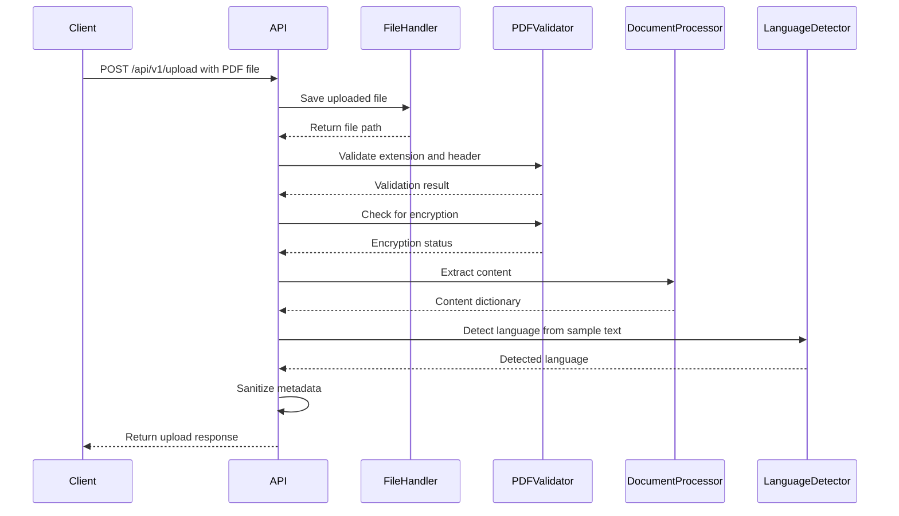
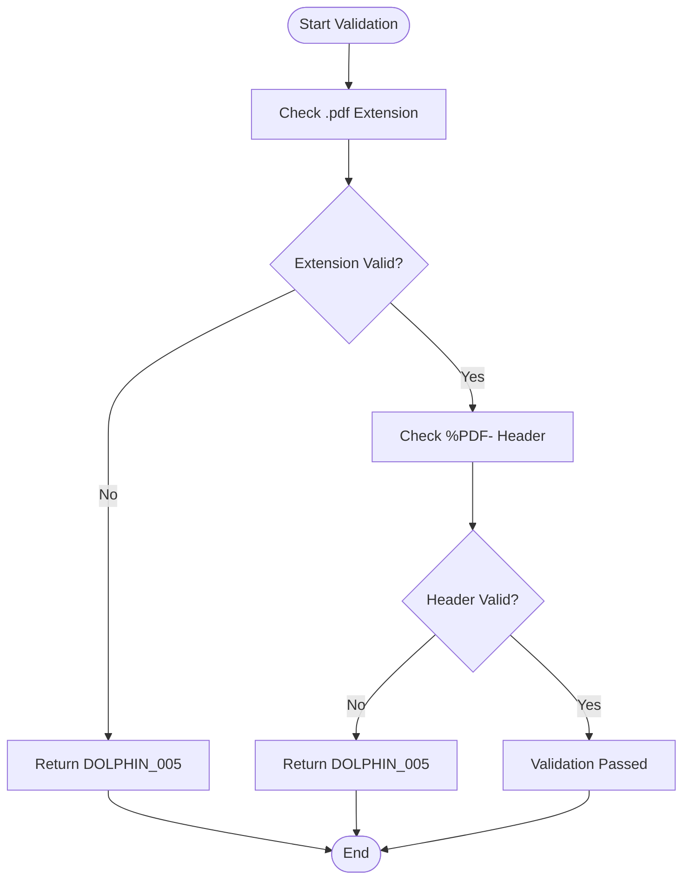
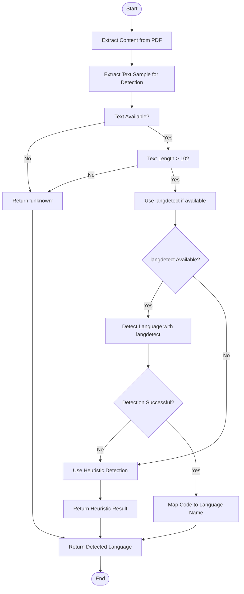

# Document Upload Endpoint

<cite>
**Referenced Files in This Document**  
- [api/routes.py](file://api/routes.py)
- [utils/file_handler.py](file://utils/file_handler.py)
- [utils/pdf_validator.py](file://utils/pdf_validator.py)
- [services/main_document_processor.py](file://services/main_document_processor.py)
- [services/language_detector.py](file://services/language_detector.py)
- [utils/language_utils.py](file://utils/language_utils.py)
</cite>

## Table of Contents
1. [Introduction](#introduction)
2. [Endpoint Overview](#endpoint-overview)
3. [Request Requirements](#request-requirements)
4. [Validation Pipeline](#validation-pipeline)
5. [Response Schema](#response-schema)
6. [Error Handling](#error-handling)
7. [Content Extraction and Language Detection](#content-extraction-and-language-detection)
8. [Integration with Translation Workflow](#integration-with-translation-workflow)
9. [Usage Example](#usage-example)

## Introduction
This document provides comprehensive API documentation for the POST /api/v1/upload endpoint in the Advanced Document Translator API. The endpoint handles document uploads with advanced processing capabilities, including PDF validation, content extraction, and language detection. The system is designed to process PDF documents with high fidelity, preserving layout and formatting while enabling subsequent translation workflows.

**Section sources**
- [api/routes.py](file://api/routes.py#L1-L50)

## Endpoint Overview
The POST /api/v1/upload endpoint accepts PDF documents for processing through an advanced document translation pipeline. The endpoint orchestrates multiple validation and processing steps to ensure document integrity and prepare content for translation. Upon successful processing, the endpoint returns metadata about the uploaded document, including a unique upload identifier, detected language, and sanitized document metadata.

The endpoint is implemented as an asynchronous FastAPI route that coordinates file handling, validation, content extraction, and language detection services. It follows a structured processing workflow that ensures security, data integrity, and privacy by sanitizing metadata to prevent path leakage.



**Diagram sources**
- [api/routes.py](file://api/routes.py#L200-L250)
- [utils/file_handler.py](file://utils/file_handler.py#L50-L100)
- [utils/pdf_validator.py](file://utils/pdf_validator.py#L50-L100)
- [services/main_document_processor.py](file://services/main_document_processor.py#L50-L100)
- [services/language_detector.py](file://services/language_detector.py#L50-L100)

## Request Requirements
The POST /api/v1/upload endpoint requires a multipart form data request with a file upload field. The endpoint specifically accepts PDF documents through FastAPI's UploadFile parameter type, which handles the file upload process efficiently and securely.

### Request Format
The request must use the multipart/form-data content type with the following parameter:

- **file**: The PDF document to upload, provided as an UploadFile object. This parameter is required and must contain a valid PDF file.

### Multipart Form Data Structure
The endpoint expects a standard multipart form data structure where the file is transmitted as a binary attachment. FastAPI automatically parses this format and provides the file as an UploadFile object to the route handler.

### File Requirements
- **Format**: Only PDF files (.pdf extension) are supported
- **Size**: Subject to server configuration limits (default: 10MB maximum)
- **Encoding**: Must be standard PDF encoding (no encryption)
- **Structure**: Must have valid PDF headers and structure

The file upload mechanism uses FastAPI's built-in UploadFile class, which provides streaming capabilities to handle large files efficiently without loading them entirely into memory.

**Section sources**
- [api/routes.py](file://api/routes.py#L200-L205)
- [utils/file_handler.py](file://utils/file_handler.py#L50-L100)

## Validation Pipeline
The document upload endpoint implements a comprehensive validation pipeline that ensures only valid, unencrypted PDF files are processed. The validation process consists of three sequential checks that must all pass for successful upload processing.

### File Extension and Header Validation
The first validation step checks both the file extension and the PDF header to confirm the document is a valid PDF. This dual-check approach prevents extension spoofing attacks where a non-PDF file is given a .pdf extension.

The validation is performed by the `validate_pdf_extension_and_header` function in pdf_validator.py, which:
1. Checks if the file path ends with a .pdf extension (case-insensitive)
2. Reads the first 5 bytes of the file to verify the presence of the %PDF- header
3. Returns a structured validation result indicating success or failure



**Diagram sources**
- [utils/pdf_validator.py](file://utils/pdf_validator.py#L100-L150)

### PDF Header Validation
Beyond the basic header check, the system performs additional structural validation to ensure the PDF is well-formed. This includes verifying the presence of essential PDF markers such as the %%EOF (end-of-file) marker and cross-reference (xref) tables. These structural elements are critical for proper PDF parsing and indicate whether the document has a valid internal structure.

The header validation uses a streaming approach to read only the necessary portions of the file, making it efficient even for large PDFs. The system checks the beginning of the file for the %PDF- signature and the end of the file for the %%EOF marker, ensuring the document has proper start and end markers.

### Encryption Detection
The final validation step detects whether the PDF is encrypted, which would prevent content extraction and processing. Encryption detection is critical because encrypted PDFs cannot be reliably processed by the OCR and content extraction systems.

The encryption check uses the pypdf library to attempt to open the PDF and inspect its encryption status. If the PDFReader indicates the document is encrypted (is_encrypted property is true), the validation fails and returns an appropriate error response.

This validation prevents the system from attempting to process documents that would ultimately fail during content extraction, providing immediate feedback to the client about the encryption issue.

**Section sources**
- [utils/pdf_validator.py](file://utils/pdf_validator.py#L150-L250)
- [api/routes.py](file://api/routes.py#L220-L230)

## Response Schema
Upon successful processing, the upload endpoint returns a JSON response containing information about the uploaded document. The response includes metadata, processing results, and identifiers needed for subsequent operations in the translation workflow.

### Response Structure
The response follows a standardized schema with the following fields:

| Field | Type | Description |
|-------|------|-------------|
| message | string | Status message indicating successful processing |
| filename | string | Original filename provided by the client |
| detected_language | string | Language detected in the document content |
| upload_id | string | Unique identifier for the uploaded document |
| content_type | string | Type of content processed (e.g., "document") |
| metadata | object | Sanitized document metadata without path information |

### Upload ID Generation
The upload_id is generated as the basename of the saved file path, which contains a UUID to ensure uniqueness. This approach provides a stable identifier for the document throughout its processing lifecycle while avoiding exposure of server filesystem paths.

### Metadata Sanitization
To prevent path leakage and protect server infrastructure details, the response metadata is sanitized before inclusion in the response. The sanitization process removes any fields or values that resemble filesystem paths, including common path-related keys like "path", "file_path", "filepath", "full_path", and "directory".

The sanitization function recursively processes the metadata object, removing any values that appear to be filesystem paths based on heuristics such as the presence of path separators or common path patterns. This ensures that no sensitive server path information is exposed in the API response.

**Section sources**
- [api/routes.py](file://api/routes.py#L235-L290)

## Error Handling
The upload endpoint implements comprehensive error handling with standardized error responses for various failure scenarios. Errors are returned with appropriate HTTP status codes and structured JSON bodies that provide detailed information about the failure.

### Error Response Structure
All error responses follow a consistent structure:
```json
{
  "error_code": "DOLPHIN_XXX",
  "message": "Descriptive error message",
  "timestamp": "ISO 8601 timestamp",
  "context": {
    "path": "Filename"
  }
}
```

### DOLPHIN_005 - Format Unsupported
This error code is returned when the uploaded file does not meet the PDF format requirements. The validation fails if either the file extension is not .pdf or the file header does not contain the %PDF- signature.

**Error Response Example:**
```json
{
  "error_code": "DOLPHIN_005",
  "message": "Only PDF format supported",
  "timestamp": "2023-11-20T10:30:00Z",
  "context": {
    "path": "document.docx"
  }
}
```

The error is triggered during the initial validation phase when `validate_pdf_extension_and_header` returns a non-ok result. This prevents further processing of invalid file formats and provides immediate feedback to the client.

### DOLPHIN_014 - Encrypted PDF
This error code is returned when the system detects that the uploaded PDF is encrypted and cannot be processed. Encryption prevents the content extraction necessary for translation, so encrypted documents are rejected during validation.

**Error Response Example:**
```json
{
  "error_code": "DOLPHIN_014",
  "message": "Encrypted PDFs are not supported",
  "timestamp": "2023-11-20T10:30:00Z",
  "context": {
    "path": "protected.pdf"
  }
}
```

The error is triggered when `detect_pdf_encryption` returns a result with is_encrypted set to true. This check occurs after the basic format validation, ensuring that only valid PDFs are checked for encryption.

### General Error Handling
For unexpected errors during processing, the endpoint returns a generic DOLPHIN_002 error with a 500 HTTP status code. This catch-all error handler ensures that clients receive meaningful error information even for unforeseen issues, while preventing the exposure of sensitive system details.

**Section sources**
- [api/routes.py](file://api/routes.py#L210-L230)
- [utils/pdf_validator.py](file://utils/pdf_validator.py#L50-L100)

## Content Extraction and Language Detection
After successful validation, the upload endpoint processes the document through content extraction and language detection workflows to prepare it for translation.

### Content Extraction Process
The content extraction is performed by the `document_processor.extract_content` method, which orchestrates the conversion of the PDF to images, OCR processing, and layout analysis. The process involves:

1. Converting the PDF pages to high-resolution images
2. Applying OCR to extract text and bounding box information
3. Analyzing the document layout to preserve formatting
4. Structuring the extracted content into a comprehensive data model

The extracted content includes text elements, their positions on the page, font information, and other layout details necessary for accurate translation with format preservation.

### Language Detection Workflow
Language detection is performed using a two-stage approach that combines heuristic analysis with machine learning when available. The process begins by extracting a text sample from the document content using the `extract_text_sample_for_language_detection` utility function.

The language detection workflow:
1. Extracts text from the first page of the document
2. Uses the extracted text sample for language analysis
3. Applies heuristic detection based on common words and characters
4. Optionally uses the langdetect library for more accurate detection when available

The detection system is designed to fail closed, returning "unknown" when confidence is low rather than providing potentially incorrect language identification. This conservative approach ensures downstream translation processes receive reliable language information.



**Diagram sources**
- [services/main_document_processor.py](file://services/main_document_processor.py#L50-L100)
- [services/language_detector.py](file://services/language_detector.py#L50-L100)
- [utils/language_utils.py](file://utils/language_utils.py#L10-L50)

## Integration with Translation Workflow
The upload endpoint serves as the entry point to the broader document translation workflow, providing the necessary processing and metadata for subsequent translation operations.

### Workflow Integration
After a successful upload, the returned upload_id and detected_language are used to initiate the translation process through the /api/v1/translate endpoint. The translation workflow uses the processed document content and detected language to perform accurate translation while preserving the original document layout.

The state management system stores the processed document content and metadata, making it available for the translation service. This architecture enables a clean separation between upload/processing and translation phases while maintaining the necessary context for format-preserving translation.

### State Management
The system uses a state manager to maintain context between the upload and translation phases. When a document is successfully uploaded and processed, its content is stored in the application state with the upload_id as a reference. This allows subsequent translation requests to access the pre-processed content without reprocessing the original PDF.

The state management approach optimizes performance by avoiding redundant processing and enables features like translation progress tracking and resumable operations.

**Section sources**
- [core/translation_handler.py](file://core/translation_handler.py#L50-L100)
- [api/routes.py](file://api/routes.py#L250-L300)

## Usage Example
The following example demonstrates how to use the POST /api/v1/upload endpoint to upload a PDF document for processing.

### cURL Command
```bash
curl -X POST "http://localhost:7860/api/v1/upload" \
  -H "accept: application/json" \
  -H "Content-Type: multipart/form-data" \
  -F "file=@/path/to/document.pdf"
```

### Expected Successful Response
```json
{
  "message": "File processed with advanced extraction",
  "filename": "document.pdf",
  "detected_language": "German",
  "upload_id": "a1b2c3d4-e5f6-7890-g1h2-i3j4k5l6m7n8.pdf",
  "content_type": "document",
  "metadata": {
    "total_pages": 5,
    "total_text_elements": 124,
    "file_size_mb": 2.45,
    "processing_time": 3.21,
    "dpi": 300
  }
}
```

### Error Response Example
```json
{
  "detail": {
    "error_code": "DOLPHIN_005",
    "message": "Only PDF format supported",
    "timestamp": "2023-11-20T10:30:00Z",
    "context": {
      "path": "document.docx"
    }
  }
}
```

The cURL example shows the standard way to call the upload endpoint using the multipart form data format. Clients should include the file parameter with the @ symbol to indicate file upload, followed by the path to the local PDF file.

**Section sources**
- [api/routes.py](file://api/routes.py#L200-L300)
