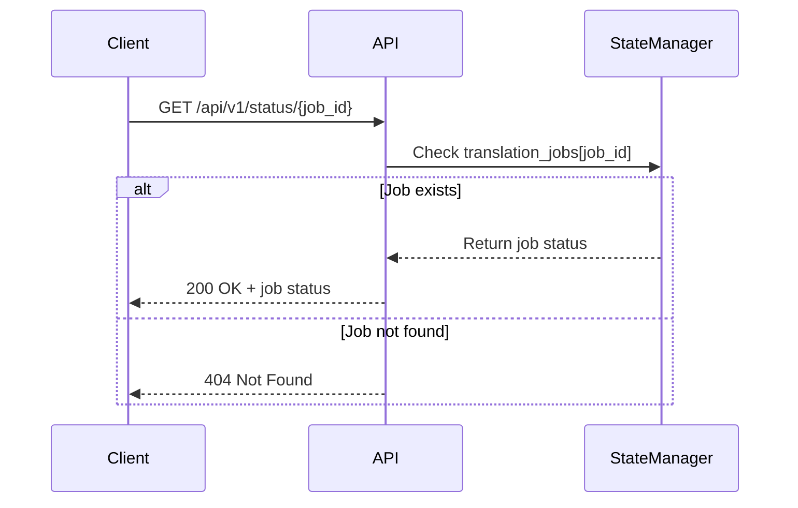
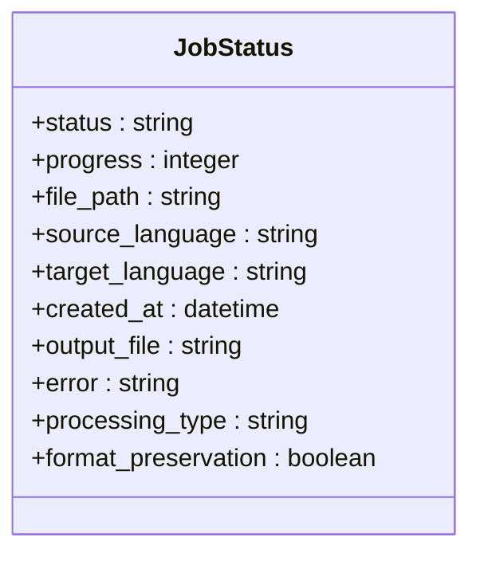
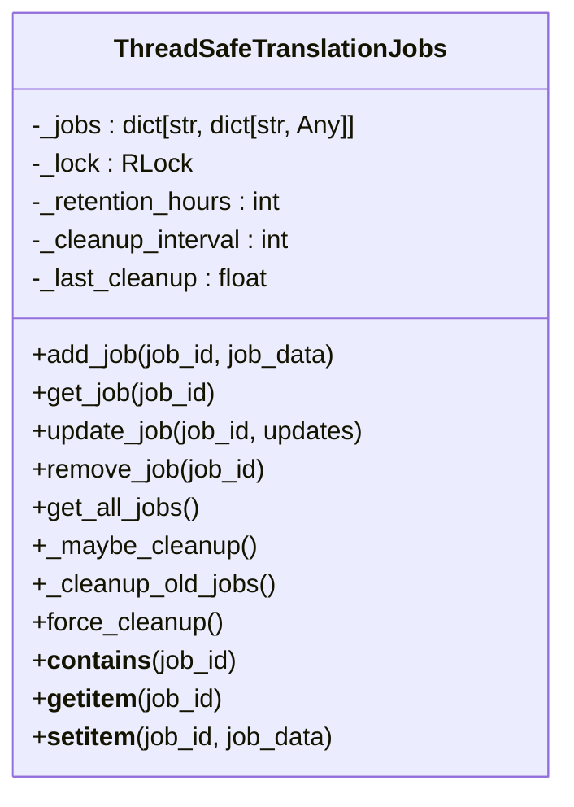

# Job Status Endpoint

<cite>
**Referenced Files in This Document**  
- [api/routes.py](file://api/routes.py)
- [core/state_manager.py](file://core/state_manager.py)
- [core/translation_handler.py](file://core/translation_handler.py)
</cite>

## Table of Contents
1. [Introduction](#introduction)
2. [Endpoint Details](#endpoint-details)
3. [Path Parameter Validation](#path-parameter-validation)
4. [Response Schema](#response-schema)
5. [Error Responses](#error-responses)
6. [Job Status Object Structure](#job-status-object-structure)
7. [Polling Strategy](#polling-strategy)
8. [Integration with Download Endpoint](#integration-with-download-endpoint)
9. [Usage Example](#usage-example)
10. [State Management Implementation](#state-management-implementation)

## Introduction
The GET /api/v1/status/{job_id} endpoint provides clients with the ability to monitor the status of translation jobs in the system. This documentation details the endpoint's functionality, response structure, error handling, and recommended usage patterns for effective integration into client applications.

**Section sources**
- [api/routes.py](file://api/routes.py#L450-L519)

## Endpoint Details
The GET /api/v1/status/{job_id} endpoint retrieves the current status of a translation job identified by its unique job_id. This endpoint is designed to be polled by clients to track the progress of asynchronous translation operations.



**Diagram sources**
- [api/routes.py](file://api/routes.py#L450-L519)
- [core/state_manager.py](file://core/state_manager.py#L0-L199)

**Section sources**
- [api/routes.py](file://api/routes.py#L450-L519)

## Path Parameter Validation
The endpoint validates the job_id path parameter by checking its existence in the global translation_jobs dictionary. If the job_id does not exist in the dictionary, the endpoint returns a 404 Not Found response.

The job_id is a string parameter that represents the unique identifier of a translation job. No additional format validation is performed on the job_id itself, as the validation is based solely on the existence of the job in the system's state.

**Section sources**
- [api/routes.py](file://api/routes.py#L450-L519)

## Response Schema
The response schema mirrors the translation job state stored in the global translation_jobs dictionary. The response includes the following fields:

- **status**: Current status of the job (e.g., "started", "processing", "completed", "failed")
- **progress**: Integer percentage (0-100) indicating the completion progress
- **processing_type**: Type of processing being performed (e.g., "advanced")
- **error**: Error message if the job has failed, otherwise null

The response also includes additional metadata such as file_path, source_language, target_language, created_at, output_file, and format_preservation.



**Diagram sources**
- [api/routes.py](file://api/routes.py#L450-L519)
- [core/state_manager.py](file://core/state_manager.py#L0-L199)

**Section sources**
- [api/routes.py](file://api/routes.py#L450-L519)

## Error Responses
The endpoint returns a 404 Not Found response when a job with the specified job_id does not exist in the system. This occurs when:

- The job_id was never created
- The job has already been cleaned up due to retention policies
- A typo or incorrect job_id is provided

The 404 response includes a JSON body with the detail "Job not found" to inform the client that the requested resource does not exist.

**Section sources**
- [api/routes.py](file://api/routes.py#L450-L519)

## Job Status Object Structure
The job status object contains comprehensive information about the translation job's state. The structure is defined by the job entry created in the translation_jobs dictionary when a new translation job is initiated.

The object includes:
- **status**: Current state of the job (started, processing, completed, failed)
- **progress**: Percentage completion (0-100)
- **file_path**: Path to the source file being translated
- **source_language** and **target_language**: Language codes for translation
- **created_at**: Timestamp when the job was created
- **output_file**: Path to the translated output file (when completed)
- **error**: Error message if job failed
- **processing_type**: Indicates the processing mode (e.g., "advanced")
- **format_preservation**: Boolean indicating if format preservation is enabled

**Section sources**
- [api/routes.py](file://api/routes.py#L450-L519)
- [core/state_manager.py](file://core/state_manager.py#L0-L199)

## Polling Strategy
Clients should poll the GET /api/v1/status/{job_id} endpoint to monitor translation progress. The recommended polling interval is 1-2 seconds, which provides timely updates without overwhelming the server with requests.

When polling, clients should:
1. Make periodic requests to the status endpoint
2. Check the "status" field to determine if the job is still running
3. Monitor the "progress" field to display progress to users
4. Stop polling when status becomes "completed" or "failed"
5. Handle 404 responses appropriately (job not found)

The progress field is updated during job processing, starting at 0, moving to 20 when content extraction is complete, scaling to 80 during translation, and reaching 100 when the output file is created.

**Section sources**
- [core/translation_handler.py](file://core/translation_handler.py#L616-L754)

## Integration with Download Endpoint
Once a job reaches "completed" status, clients can retrieve the translated file using the download endpoint at GET /api/v1/download/{job_id}. The integration flow is:

1. Submit a translation job via the translate endpoint
2. Receive a job_id in the response
3. Poll the status endpoint with the job_id
4. When status is "completed", call the download endpoint with the same job_id
5. Receive the translated file as a response

The download endpoint validates that the job exists, has completed successfully, and that the output file is available before serving the file to the client.

**Section sources**
- [api/routes.py](file://api/routes.py#L450-L519)

## Usage Example
Here is a curl example demonstrating how to check the status of a translation job:

```bash
curl -X GET "http://localhost:8000/api/v1/status/123e4567-e89b-12d3-a456-426614174000" \
  -H "Content-Type: application/json"
```

Expected response for an active job:
```json
{
  "status": "processing",
  "progress": 45,
  "file_path": "/tmp/uploads/document.pdf",
  "source_language": "en",
  "target_language": "de",
  "created_at": "2023-11-20T15:30:45Z",
  "output_file": null,
  "error": null,
  "processing_type": "advanced",
  "format_preservation": true
}
```

Recommended polling interval: 1-2 seconds. Clients should implement exponential backoff if the server indicates rate limiting, though the current implementation does not enforce rate limits on this endpoint.

**Section sources**
- [api/routes.py](file://api/routes.py#L450-L519)

## State Management Implementation
The job status tracking is implemented through the ThreadSafeTranslationJobs class in state_manager.py. This class provides thread-safe access to the translation_jobs dictionary, which stores all active and recently completed jobs.

The ThreadSafeTranslationJobs class uses a threading.RLock to ensure that concurrent access to the job dictionary is properly synchronized. Jobs are automatically cleaned up after 24 hours if they are in a completed, failed, or error state, preventing memory leaks from abandoned jobs.

The state manager also handles job creation, updates, and retrieval operations with proper locking mechanisms to maintain data consistency in a multi-threaded environment.



**Diagram sources**
- [core/state_manager.py](file://core/state_manager.py#L0-L199)

**Section sources**
- [core/state_manager.py](file://core/state_manager.py#L0-L199)
