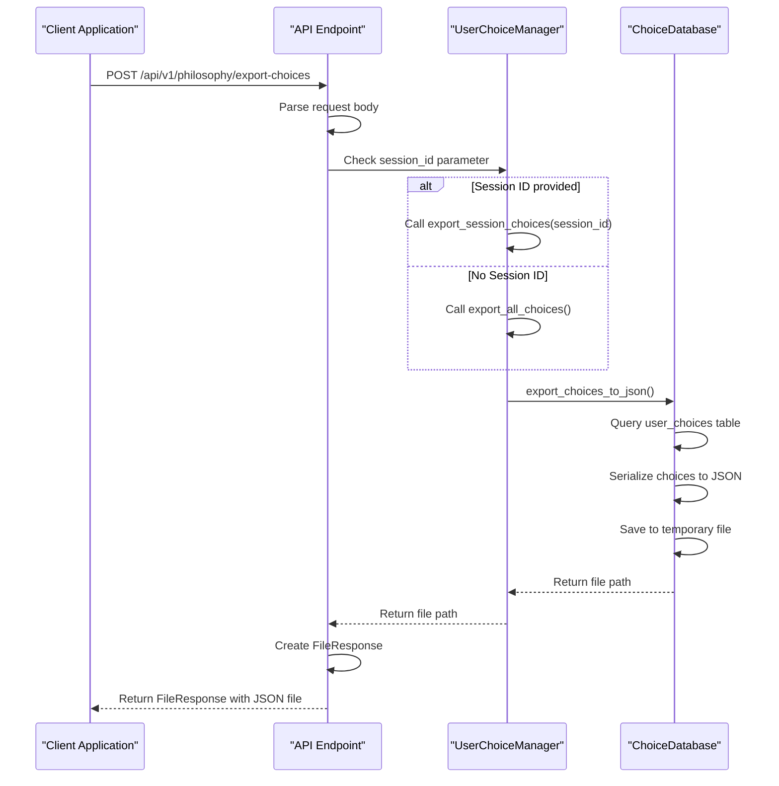

# Export User Choices Endpoint

<cite>
**Referenced Files in This Document**  
- [routes.py](file://api/routes.py)
- [user_choice_manager.py](file://services/user_choice_manager.py)
- [choice_database.py](file://database/choice_database.py)
- [user_choice_models.py](file://models/user_choice_models.py)
</cite>

## Table of Contents
1. [Introduction](#introduction)
2. [Request Schema and Parameters](#request-schema-and-parameters)
3. [Export Process Flow](#export-process-flow)
4. [User Choice Manager Integration](#user-choice-manager-integration)
5. [File Generation and Temporary Storage](#file-generation-and-temporary-storage)
6. [FileResponse Implementation](#fileresponse-implementation)
7. [Exported JSON Structure](#exported-json-structure)
8. [Example Exported JSON](#example-exported-json)
9. [Use Cases for Exported Data](#use-cases-for-exported-data)
10. [Error Handling](#error-handling)
11. [Sequence Diagram](#sequence-diagram)

## Introduction
The POST /api/v1/philosophy/export-choices endpoint provides functionality to export user translation choices either for a specific session or all sessions. This endpoint serves as a critical feature for data backup, migration, and analysis of user translation preferences within the philosophical translation system. The export process integrates with the UserChoiceManager service to retrieve choice data, generates JSON files with comprehensive metadata, and delivers them as downloadable responses. The system supports both session-specific exports (when a session_id is provided) and complete system exports (when no session_id is specified), making it flexible for various use cases including user data portability and system migration.

**Section sources**
- [routes.py](file://api/routes.py#L228-L248)

## Request Schema and Parameters
The endpoint accepts a JSON payload with an optional session_id parameter that determines the scope of the export operation. When the session_id is provided, the system exports only the choices associated with that specific session. When the session_id is omitted or null, the system exports all user choices across all sessions. The request payload follows a simple structure with the session_id as the only optional parameter. This design allows clients to easily control the export scope based on their needs. The endpoint is designed to be flexible, accepting the session_id as a string value that corresponds to an existing choice session in the system. The absence of the session_id parameter triggers the comprehensive export mode, which is particularly useful for system administrators performing full backups or users who want to preserve their complete translation history.

**Section sources**
- [routes.py](file://api/routes.py#L228-L248)

## Export Process Flow
The export process begins when a POST request is received at the /api/v1/philosophy/export-choices endpoint. The system first extracts the session_id parameter from the request payload. Based on the presence or absence of this parameter, the system determines whether to export choices for a specific session or all choices. The request is then routed to the UserChoiceManager service, which acts as the primary interface for export operations. If a session_id is provided, the export_session_choices method is invoked; otherwise, the export_all_choices method is called. These methods delegate to the underlying ChoiceDatabase layer to retrieve the appropriate choice records. The database layer queries the user_choices table with the appropriate filters and converts the results into a structured JSON format. The generated JSON file is temporarily stored on the server before being served to the client through the FileResponse mechanism.

```mermaid
flowchart TD
A[POST /api/v1/philosophy/export-choices] --> B{session_id provided?}
B --> |Yes| C[Call export_session_choices(session_id)]
B --> |No| D[Call export_all_choices()]
C --> E[Query database for session-specific choices]
D --> F[Query database for all choices]
E --> G[Generate JSON structure]
F --> G
G --> H[Save to temporary file]
H --> I[Return FileResponse]
I --> J[Client downloads file]
```

**Diagram sources**
- [routes.py](file://api/routes.py#L228-L248)
- [user_choice_manager.py](file://services/user_choice_manager.py#L511-L517)

## User Choice Manager Integration
The UserChoiceManager service provides the primary interface for export operations through two key methods: export_session_choices and export_all_choices. These methods serve as wrappers around the database layer's export functionality, providing a clean API for the web interface. The export_session_choices method takes a session_id parameter and returns the path to the generated JSON file containing all choices associated with that session. The export_all_choices method performs a comprehensive export of all user choices regardless of session affiliation. Both methods delegate the actual export logic to the ChoiceDatabase layer, specifically the export_choices_to_json method. The UserChoiceManager acts as a coordinator, handling the business logic of determining which data should be exported while relying on the database layer for the technical implementation of data retrieval and file generation. This separation of concerns ensures that the export functionality is both maintainable and extensible.

**Section sources**
- [user_choice_manager.py](file://services/user_choice_manager.py#L511-L524)

## File Generation and Temporary Storage
The file generation process is handled by the ChoiceDatabase layer, which implements the export_choices_to_json method. When exporting choices, the system creates a temporary JSON file containing the serialized choice data. The file is generated with UTF-8 encoding and ensures ASCII characters are preserved appropriately based on the database configuration. The export process converts UserChoice and ChoiceSession objects into their dictionary representations using the to_dict methods defined in the data models. For session-specific exports, the query filters choices by the provided session_id. For complete exports, all choices are retrieved without filtering. The generated JSON structure includes all relevant fields from the UserChoice and ChoiceSession models, preserving the complete state of the translation choices. The temporary file is stored in the system's temporary directory with a unique name, ensuring that concurrent export operations do not interfere with each other. The file remains available until the client downloads it or the system's temporary file cleanup process removes it.

**Section sources**
- [choice_database.py](file://database/choice_database.py#L1200-L1250)

## FileResponse Implementation
The endpoint returns a FileResponse object that delivers the generated JSON file to the client. The FileResponse is configured with the media type "application/json" to ensure proper content type handling by the client. The filename is dynamically generated using the current UTC timestamp in the format "philosophy-choices-YYYYMMDD_HHMMSS.json", providing a unique and time-stamped identifier for each export. This naming convention helps users organize their exported files chronologically and avoid naming conflicts. The FileResponse handles the streaming of the file content to the client, managing memory efficiently by not loading the entire file into memory at once. The response includes appropriate HTTP headers for file downloads, triggering the browser's download dialog. After the file is successfully delivered, the temporary file on the server may be cleaned up according to the system's file management policies, ensuring that disk space is not unnecessarily consumed by completed export operations.

**Section sources**
- [routes.py](file://api/routes.py#L236-L245)

## Exported JSON Structure
The exported JSON contains a comprehensive representation of user choices and their associated metadata. The structure includes arrays of UserChoice objects, each containing detailed information about individual translation decisions. Each UserChoice object includes the choice_id, neologism_term, choice_type, translation_result, and a complete TranslationContext object that captures the semantic, philosophical, and positional context of the choice. The context includes fields such as semantic_field, philosophical_domain, author, source_language, target_language, page_number, surrounding_terms, and related_concepts. Additionally, each choice contains metadata about its scope (ChoiceScope), confidence_level, user_notes, temporal information (created_at, updated_at, last_used_at), and usage statistics (usage_count, success_rate). If the export includes session data, the JSON also contains ChoiceSession objects with session_id, session_name, status, user_id, language information, and session statistics. The structure is designed to be both human-readable and machine-parsable, facilitating easy import and analysis of the exported data.

**Section sources**
- [user_choice_models.py](file://models/user_choice_models.py#L100-L400)

## Example Exported JSON
```json
{
  "choices": [
    {
      "choice_id": "c1a2b3c4-d5e6-7890-f1a2-b3c4d5e6f789",
      "neologism_term": "Daseinsanalyse",
      "choice_type": "translate",
      "translation_result": "existential analysis",
      "context": {
        "sentence_context": "Die Daseinsanalyse bietet einen tiefen Einblick in menschliche Existenz.",
        "paragraph_context": "In der modernen Philosophie hat die Daseinsanalyse an Bedeutung gewonnen. Diese Methode untersucht die fundamentale Struktur der menschlichen Existenz und ihr Verhältnis zur Welt. Die Daseinsanalyse bietet einen tiefen Einblick in menschliche Existenz.",
        "semantic_field": "existential_philosophy",
        "philosophical_domain": "phenomenology",
        "author": "Heidegger",
        "source_language": "de",
        "target_language": "en",
        "page_number": 42,
        "surrounding_terms": ["Existenz", "Phänomenologie", "Sein", "Welt"],
        "related_concepts": ["Phenomenology", "Existentialism", "Being-in-the-world"],
        "confidence_score": 0.95
      },
      "choice_scope": "contextual",
      "confidence_level": 0.9,
      "user_notes": "Preferred translation based on Heidegger's terminology",
      "created_at": "2024-01-15T10:30:45.123456",
      "updated_at": "2024-01-15T10:30:45.123456",
      "last_used_at": "2024-01-16T14:22:10.789012",
      "usage_count": 15,
      "success_rate": 0.93,
      "session_id": "s1a2b3c4-d5e6-7890-f1a2-b3c4d5e6f789",
      "is_validated": true,
      "validation_source": "expert_review",
      "quality_score": 0.97
    }
  ],
  "sessions": [
    {
      "session_id": "s1a2b3c4-d5e6-7890-f1a2-b3c4d5e6f789",
      "session_name": "Heidegger Translation Project",
      "status": "completed",
      "document_id": "doc_001",
      "document_name": "Being_and_Time.pdf",
      "user_id": "user_123",
      "source_language": "de",
      "target_language": "en",
      "created_at": "2024-01-15T09:15:30.123456",
      "updated_at": "2024-01-15T11:45:20.789012",
      "completed_at": "2024-01-15T11:45:20.789012",
      "total_choices": 25,
      "translate_count": 18,
      "preserve_count": 2,
      "custom_count": 4,
      "skip_count": 1,
      "average_confidence": 0.85,
      "consistency_score": 0.92
    }
  ],
  "export_metadata": {
    "export_timestamp": "2024-01-15T12:00:00.000000",
    "export_type": "session",
    "session_id": "s1a2b3c4-d5e6-7890-f1a2-b3c4d5e6f789",
    "total_choices_exported": 1,
    "total_sessions_exported": 1
  }
}
```

**Section sources**
- [user_choice_models.py](file://models/user_choice_models.py#L100-L400)

## Use Cases for Exported Data
The exported JSON data serves multiple important use cases for users and system administrators. For backup purposes, users can preserve their translation choices and session history, protecting against data loss due to system failures or account issues. The export functionality enables seamless migration of user preferences between different instances of the system, such as moving from a development environment to production or transferring data between organizational systems. Researchers and linguists can analyze the exported data to study translation patterns, consistency, and decision-making processes in philosophical text translation. The structured JSON format allows for easy integration with external tools for data visualization, statistical analysis, or machine learning applications. Additionally, the exported data can be used for auditing and compliance purposes, providing a complete record of translation decisions and their contexts. The comprehensive nature of the export, including confidence scores, usage statistics, and contextual information, makes it valuable for quality assurance and continuous improvement of the translation system.

**Section sources**
- [user_choice_models.py](file://models/user_choice_models.py#L100-L400)

## Error Handling
The endpoint implements comprehensive error handling to manage various failure scenarios during the export process. If the export operation fails at any stage, the system raises an HTTPException with status code 500 and an appropriate error message. Potential failure points include database connectivity issues, file system errors during temporary file creation, serialization problems when converting objects to JSON, and permission issues when accessing the file system. The error handling is implemented at multiple levels: the API route catches exceptions and converts them to appropriate HTTP responses, the UserChoiceManager propagates errors from the database layer, and the ChoiceDatabase handles database-specific exceptions. When an export fails, the system logs detailed error information for debugging purposes while returning a generic error message to the client to avoid exposing sensitive system information. The FileResponse is only returned when the export process completes successfully, ensuring that clients receive either a complete file or a clear error indication. This robust error handling ensures that the system remains stable and provides meaningful feedback when issues occur.

**Section sources**
- [routes.py](file://api/routes.py#L246-L248)

## Sequence Diagram


**Diagram sources**
- [routes.py](file://api/routes.py#L228-L248)
- [user_choice_manager.py](file://services/user_choice_manager.py#L511-L524)
- [choice_database.py](file://database/choice_database.py#L1200-L1250)
