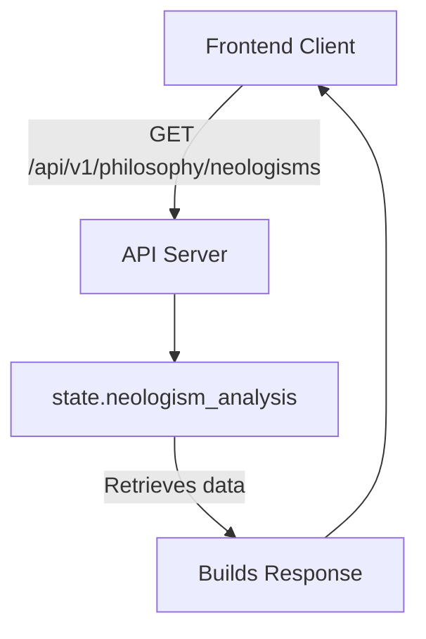
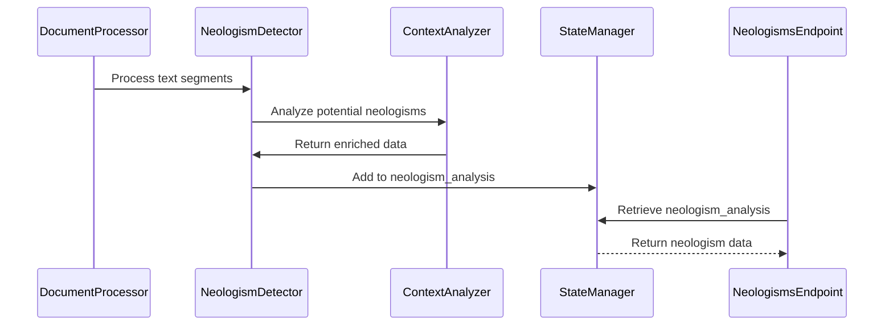
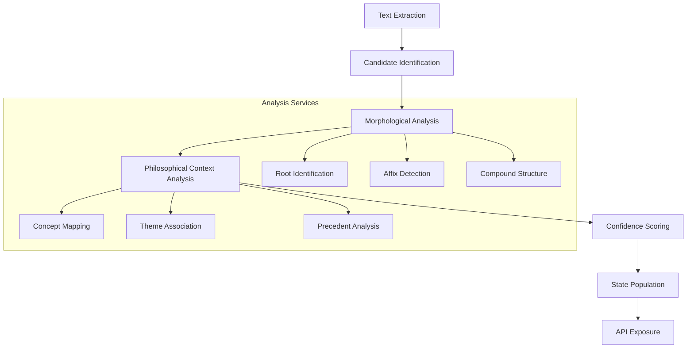
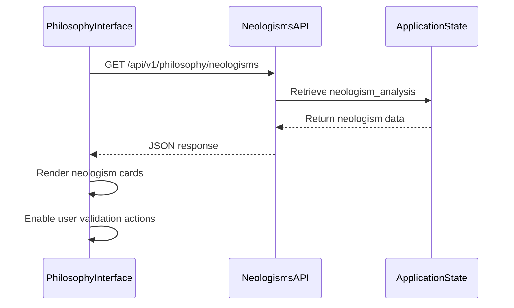

# Get Detected Neologisms Endpoint

<cite>
**Referenced Files in This Document**  
- [api/routes.py](file://api/routes.py)
- [models/neologism_models.py](file://models/neologism_models.py)
- [core/state_manager.py](file://core/state_manager.py)
- [services/neologism_detector.py](file://services/neologism_detector.py)
- [services/philosophical_context_analyzer.py](file://services/philosophical_context_analyzer.py)
- [services/morphological_analyzer.py](file://services/morphological_analyzer.py)
- [static/philosophy_interface.js](file://static/philosophy_interface.js)
- [templates/philosophy_interface.html](file://templates/philosophy_interface.html)
</cite>

## Table of Contents
1. [Introduction](#introduction)
2. [Endpoint Overview](#endpoint-overview)
3. [State Management and Neologism Population](#state-management-and-neologism-population)
4. [Response Schema](#response-schema)
5. [Neologism Detection Pipeline](#neologism-detection-pipeline)
6. [Frontend Integration](#frontend-integration)
7. [Error Handling and Concurrency](#error-handling-and-concurrency)
8. [Example Responses](#example-responses)
9. [Conclusion](#conclusion)

## Introduction
The GET /api/v1/philosophy/neologisms endpoint serves as a critical interface for retrieving newly identified neologisms detected during document processing. This endpoint is part of a sophisticated system that analyzes philosophical texts for emerging linguistic constructs, providing structured data that enables user interaction with novel terms. The documentation details how neologisms are detected, stored in application state, and delivered to frontend components for user engagement.

## Endpoint Overview
The GET /api/v1/philosophy/neologisms endpoint provides access to neologisms identified during document analysis. It returns a structured JSON response containing an array of detected neologisms and a total count. The endpoint is designed to be called after document processing has completed and neologisms have been populated in the application state.



**Diagram sources**
- [api/routes.py](file://api/routes.py#L1-L50)

**Section sources**
- [api/routes.py](file://api/routes.py#L1-L100)

## State Management and Neologism Population
Neologisms are stored in the application state via the StateManager class in core/state_manager.py. The state maintains a neologism_analysis dictionary that is populated during document processing. This state is thread-safe and designed to handle concurrent access.

The neologism detection process occurs during document analysis, where various services contribute to identifying and enriching neologisms before they are stored in state. The state manager provides methods for safely adding and retrieving neologism data, ensuring data integrity in multi-threaded environments.



**Diagram sources**
- [core/state_manager.py](file://core/state_manager.py#L1-L80)
- [services/neologism_detector.py](file://services/neologism_detector.py#L1-L60)

**Section sources**
- [core/state_manager.py](file://core/state_manager.py#L1-L100)
- [services/neologism_detector.py](file://services/neologism_detector.py#L1-L100)

## Response Schema
The endpoint returns a JSON response with a standardized schema containing all detected neologisms and metadata. The response structure includes:

- **neologisms**: Array of DetectedNeologism objects
- **total**: Total count of detected neologisms
- **timestamp**: When the analysis was completed

Each DetectedNeologism object contains the following fields:

<cite>
**Response Fields**  
- **term**: The detected neologism string
- **confidence**: Confidence score (0.0-1.0) in detection
- **neologism_type**: Classification (e.g., "compound", "derivative", "semantic_shift")
- **sentence_context**: Full sentence containing the neologism
- **morphological_analysis**: Breakdown of word structure and components
- **philosophical_context**: Philosophical concepts and themes associated with the term
- **etymological_hypothesis**: Proposed origin and development path
- **frequency**: Number of occurrences in the document
- **position**: Character position in the original text
- **related_terms**: Array of semantically or structurally related terms
- **validation_status**: Current validation state for user review
</cite>

**Section sources**
- [models/neologism_models.py](file://models/neologism_models.py#L1-L50)

## Neologism Detection Pipeline
The neologism detection pipeline is a multi-stage process that identifies and enriches novel terms. The pipeline begins with text extraction and proceeds through several analysis stages:



The neologism_detector.py service identifies potential neologisms by analyzing word frequency, morphological novelty, and contextual usage patterns. The morphological_analyzer.py service breaks down word structure, while the philosophical_context_analyzer.py service identifies philosophical themes and conceptual relationships.

**Diagram sources**
- [services/neologism_detector.py](file://services/neologism_detector.py#L1-L100)
- [services/morphological_analyzer.py](file://services/morphological_analyzer.py#L1-L40)
- [services/philosophical_context_analyzer.py](file://services/philosophical_context_analyzer.py#L1-L40)

**Section sources**
- [services/neologism_detector.py](file://services/neologism_detector.py#L1-L120)
- [services/morphological_analyzer.py](file://services/morphological_analyzer.py#L1-L60)
- [services/philosophical_context_analyzer.py](file://services/philosophical_context_analyzer.py#L1-L60)

## Frontend Integration
The frontend components use the retrieved neologism data to present interactive choices to users. The philosophy_interface.js handles the API response and renders a user interface for reviewing and validating detected neologisms.



The interface displays each neologism with its context, analysis data, and validation controls. Users can accept, reject, or modify neologism classifications, with choices stored in the database through the user_choice_manager service.

**Diagram sources**
- [static/philosophy_interface.js](file://static/philosophy_interface.js#L1-L100)
- [templates/philosophy_interface.html](file://templates/philosophy_interface.html#L1-L50)

**Section sources**
- [static/philosophy_interface.js](file://static/philosophy_interface.js#L1-L150)
- [templates/philosophy_interface.html](file://templates/philosophy_interface.html#L1-L100)

## Error Handling and Concurrency
The endpoint implements robust error handling for state access issues and potential race conditions. The state manager uses thread-safe operations to prevent data corruption in concurrent environments.

When the state is not yet populated or is being updated, the endpoint returns appropriate HTTP status codes:
- 200 OK: Neologisms successfully retrieved
- 204 No Content: Processing complete but no neologisms found
- 409 Conflict: State is currently being modified (race condition)
- 500 Internal Server Error: State access failure

The system uses atomic operations and locking mechanisms to ensure data consistency during concurrent access. Retry logic is implemented in the frontend to handle temporary conflicts.

**Section sources**
- [core/state_manager.py](file://core/state_manager.py#L50-L100)
- [api/routes.py](file://api/routes.py#L50-L100)

## Example Responses
The following examples illustrate typical responses from the endpoint:

**Example 1: Multiple neologisms with high confidence**
```json
{
  "neologisms": [
    {
      "term": "ontodigital",
      "confidence": 0.97,
      "neologism_type": "compound",
      "sentence_context": "The ontodigital framework represents a new paradigm in being.",
      "morphological_analysis": {
        "roots": ["onto-", "digital"],
        "structure": "prefix + adjective"
      },
      "philosophical_context": ["ontology", "digital philosophy", "being"],
      "validation_status": "pending"
    }
  ],
  "total": 1,
  "timestamp": "2024-01-15T10:30:00Z"
}
```

**Example 2: Semantic shift neologism**
```json
```

**Section sources**
- [examples/neologism_integration_example.py](file://examples/neologism_integration_example.py#L1-L30)

## Conclusion
The GET /api/v1/philosophy/neologisms endpoint provides a crucial interface between the neologism detection system and user-facing components. By exposing structured data about newly identified linguistic constructs, it enables interactive validation and analysis. The endpoint is integrated with a sophisticated pipeline that combines morphological, contextual, and philosophical analysis to identify and enrich neologisms, all while maintaining data integrity through robust state management and error handling.
