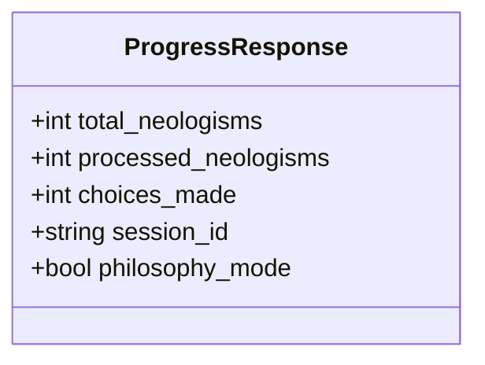
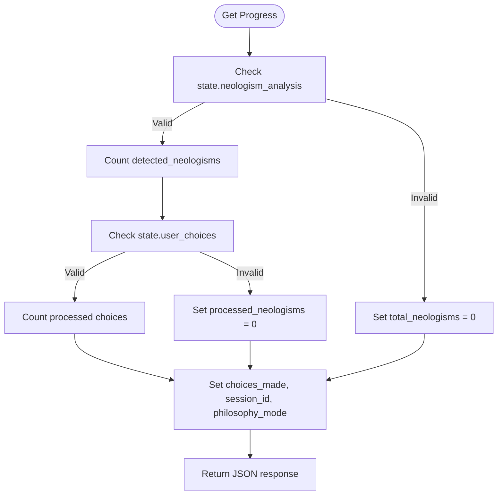
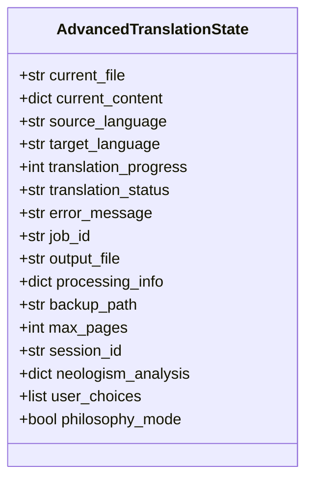
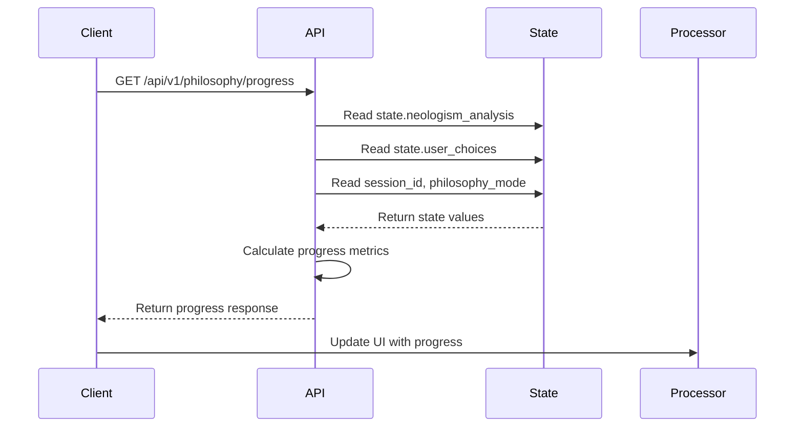
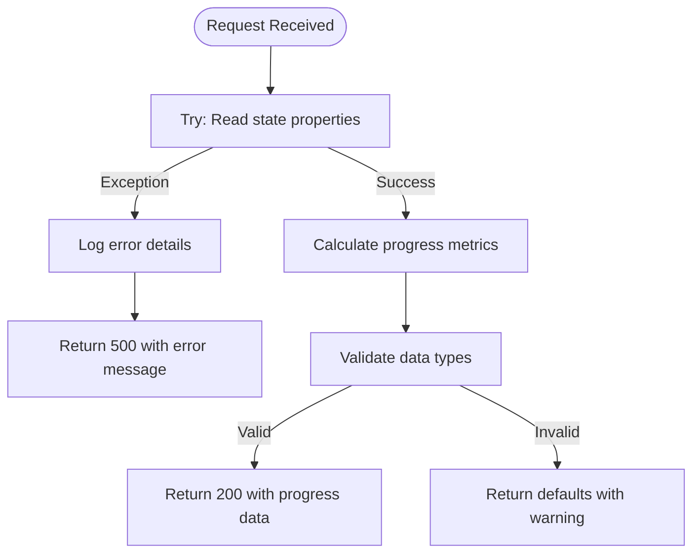

# Get Processing Progress Endpoint

<cite>
**Referenced Files in This Document**  
- [routes.py](file://api/routes.py)
- [state_manager.py](file://core/state_manager.py)
- [user_choice_manager.py](file://services/user_choice_manager.py)
- [neologism_models.py](file://models/neologism_models.py)
- [philosophy_enhanced_document_processor.py](file://services/philosophy_enhanced_document_processor.py)
</cite>

## Table of Contents
1. [Introduction](#introduction)
2. [Response Schema](#response-schema)
3. [Progress Calculation Logic](#progress-calculation-logic)
4. [State Integration](#state-integration)
5. [Translation Workflow Integration](#translation-workflow-integration)
6. [Example Responses](#example-responses)
7. [Error Handling](#error-handling)
8. [Usage Examples](#usage-examples)
9. [Conclusion](#conclusion)

## Introduction
The GET /api/v1/philosophy/progress endpoint provides real-time tracking of document processing progress in the philosophy interface. This endpoint is a critical component of the philosophy-enhanced translation system, enabling clients to monitor the status of neologism analysis and user choice application during document processing. The endpoint returns comprehensive metrics about the processing state, including the total number of neologisms detected, the number processed, choices made, session information, and whether philosophy mode is active.

**Section sources**
- [routes.py](file://api/routes.py#L200-L225)

## Response Schema
The endpoint returns a JSON response with the following schema:

- **total_neologisms**: Integer representing the total number of neologisms detected in the document
- **processed_neologisms**: Integer representing the number of neologisms that have been processed
- **choices_made**: Integer representing the total number of user choices made
- **session_id**: String identifier for the current processing session
- **philosophy_mode**: Boolean indicating whether philosophy mode is active



**Diagram sources**
- [routes.py](file://api/routes.py#L200-L225)

**Section sources**
- [routes.py](file://api/routes.py#L200-L225)

## Progress Calculation Logic
The progress calculation is performed by accessing the global state object and analyzing its properties. The endpoint calculates progress by:

1. **Total Neologisms**: Counting the number of detected neologisms in the state's neologism_analysis object
2. **Processed Neologisms**: Counting user choices that have been marked as processed in the state's user_choices list
3. **Choices Made**: Counting the total number of entries in the state's user_choices list

The calculation is implemented in the get_philosophy_progress function, which safely handles potential null or invalid states through type checking and default values.



**Diagram sources**
- [routes.py](file://api/routes.py#L200-L225)
- [state_manager.py](file://core/state_manager.py#L50-L70)

**Section sources**
- [routes.py](file://api/routes.py#L200-L225)

## State Integration
The endpoint integrates with the application state through the global state object, which maintains processing information across requests. The state object contains several key properties used by this endpoint:

- **neologism_analysis**: Dictionary containing detected neologisms and their analysis
- **user_choices**: List of user choices made during processing
- **session_id**: Identifier for the current processing session
- **philosophy_mode**: Boolean flag indicating if philosophy mode is active

The state is managed by the AdvancedTranslationState class, which provides thread-safe access to these properties. The endpoint accesses these properties directly from the global state instance.



**Diagram sources**
- [state_manager.py](file://core/state_manager.py#L50-L70)

**Section sources**
- [state_manager.py](file://core/state_manager.py#L50-L70)

## Translation Workflow Integration
The endpoint enables real-time progress tracking in the philosophy interface by providing metrics that reflect the current state of document processing. It integrates with the translation workflow by:

1. Reflecting the progress of neologism detection performed by the NeologismDetector service
2. Tracking user choices applied through the UserChoiceManager service
3. Providing feedback on the overall processing status to the PhilosophyEnhancedDocumentProcessor

The progress information is used by the client interface to update progress bars, display processing statistics, and inform users about the current state of document translation.



**Diagram sources**
- [routes.py](file://api/routes.py#L200-L225)
- [philosophy_enhanced_document_processor.py](file://services/philosophy_enhanced_document_processor.py#L197-L197)

**Section sources**
- [routes.py](file://api/routes.py#L200-L225)
- [philosophy_enhanced_document_processor.py](file://services/philosophy_enhanced_document_processor.py#L197-L197)

## Example Responses
The endpoint returns different responses depending on the processing stage:

**Initial Processing Stage**
```json
{
    "total_neologisms": 15,
    "processed_neologisms": 0,
    "choices_made": 0,
    "session_id": "session_123",
    "philosophy_mode": true
}
```

**Mid-Processing Stage**
```json
{
    "total_neologisms": 15,
    "processed_neologisms": 8,
    "choices_made": 5,
    "session_id": "session_123",
    "philosophy_mode": true
}
```

**Near-Completion Stage**
```json
{
    "total_neologisms": 15,
    "processed_neologisms": 14,
    "choices_made": 12,
    "session_id": "session_123",
    "philosophy_mode": true
}
```

**Completed Processing**
```json
{
    "total_neologisms": 15,
    "processed_neologisms": 15,
    "choices_made": 15,
    "session_id": "session_123",
    "philosophy_mode": true
}
```

Clients should interpret these metrics as follows:
- **total_neologisms**: Total work to be done in terms of neologism processing
- **processed_neologisms**: Progress toward completing neologism processing
- **choices_made**: Number of user decisions made, which may be less than processed neologisms if some choices are auto-applied
- **philosophy_mode**: Indicates whether philosophy-enhanced processing is active

**Section sources**
- [routes.py](file://api/routes.py#L200-L225)
- [examples/philosophy_interface_usage_example.py](file://examples/philosophy_interface_usage_example.py#L310-L330)

## Error Handling
The endpoint includes comprehensive error handling for state access issues and edge cases:

- **Uninitialized State**: If the state object is not properly initialized, the endpoint returns default values (0 for counts, null for session_id)
- **Type Errors**: The endpoint performs type checking on state properties to prevent crashes from unexpected data types
- **Missing Properties**: If expected properties are missing from the state, the endpoint handles this gracefully with default values
- **Exception Handling**: All operations are wrapped in try-catch blocks to prevent server errors from propagating to the client

The error handling ensures that the endpoint always returns a valid response, even when the underlying state is incomplete or corrupted.



**Diagram sources**
- [routes.py](file://api/routes.py#L200-L225)

**Section sources**
- [routes.py](file://api/routes.py#L200-L225)

## Usage Examples
Clients should poll this endpoint periodically during document processing to track progress:

```python
import requests
import time

def poll_progress(session_id):
    """Poll the progress endpoint until processing is complete."""
    url = f"http://localhost:8000/api/v1/philosophy/progress"

    while True:
        response = requests.get(url)
        if response.status_code == 200:
            progress = response.json()

            # Display progress
            print(f"Progress: {progress['processed_neologisms']}/{progress['total_neologisms']} neologisms processed")
            print(f"Choices made: {progress['choices_made']}")

            # Check if complete
            if (progress['processed_neologisms'] == progress['total_neologisms']
                and progress['total_neologisms'] > 0):
                print("Processing complete!")
                break

        # Wait before next poll
        time.sleep(2)
```

Best practices for using this endpoint:
- Poll every 1-2 seconds during active processing
- Implement exponential backoff if the server is under heavy load
- Handle 500 errors gracefully by retrying after a delay
- Cache the session_id from the first response for correlation with other API calls
- Display both processed_neologisms and choices_made to give users insight into both automated and manual progress

**Section sources**
- [routes.py](file://api/routes.py#L200-L225)
- [examples/philosophy_interface_usage_example.py](file://examples/philosophy_interface_usage_example.py#L310-L330)

## Conclusion
The GET /api/v1/philosophy/progress endpoint provides essential real-time progress tracking for the philosophy-enhanced document processing system. By exposing key metrics about neologism processing and user choices, it enables clients to provide meaningful feedback to users during what can be a lengthy translation process. The endpoint's robust error handling and clear response schema make it reliable and easy to integrate into client applications. Its integration with the global state system ensures that progress information is always up-to-date and consistent with the actual processing state.
