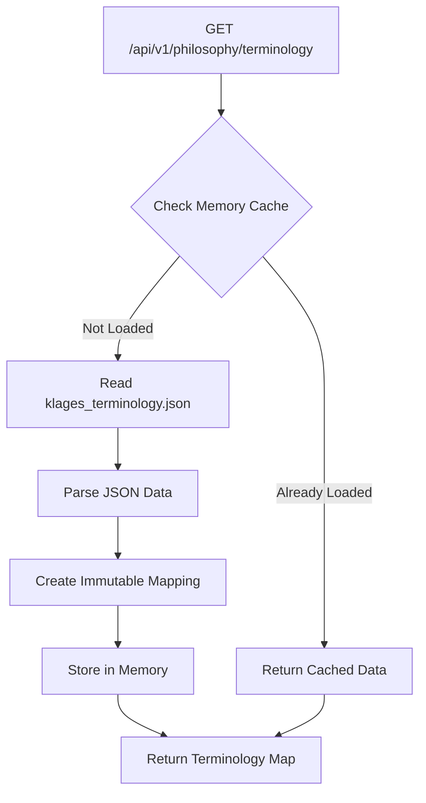

# Get Terminology Database Endpoint

<cite>
**Referenced Files in This Document**  
- [routes.py](file://api/routes.py#L388-L398)
- [neologism_detector.py](file://services/neologism_detector.py#L120-L132)
- [klages_terminology.json](file://config/klages_terminology.json#L1-L47)
- [main.py](file://config/main.py#L350-L365)
- [philosophy_interface.js](file://static/philosophy_interface.js#L480-L495)
</cite>

## Table of Contents
1. [Introduction](#introduction)
2. [Endpoint Overview](#endpoint-overview)
3. [Response Format](#response-format)
4. [Terminology Integration](#terminology-integration)
5. [Configuration and Data Loading](#configuration-and-data-loading)
6. [Example Responses](#example-responses)
7. [Use Cases](#use-cases)
8. [Error Handling](#error-handling)
9. [Caching Considerations](#caching-considerations)

## Introduction
The GET /api/v1/philosophy/terminology endpoint provides access to the current terminology database used by the neologism detection system. This documentation explains how the endpoint exposes philosophical term translations, its integration with the translation system, and its role in maintaining consistency across philosophical text processing.

## Endpoint Overview

The GET /api/v1/philosophy/terminology endpoint exposes the current terminology database by returning the neologism_detector.terminology_map as a dictionary of term-translation pairs. This endpoint serves as the primary interface for accessing standardized philosophical term translations used throughout the system.

The endpoint is implemented in the API routes module and directly accesses the terminology mapping from the neologism detection service. When called, it returns all available term-translation pairs in a simple key-value format, enabling clients to retrieve the complete terminology database in a single request.

**Section sources**
- [routes.py](file://api/routes.py#L388-L398)

## Response Format

The endpoint returns a JSON response formatted as a simple key-value mapping, where each key represents a German philosophical term and its corresponding value represents the English translation. The response structure is a flat dictionary without nested objects or additional metadata.

The format follows a straightforward pattern:
```json
{
  "GermanTerm": "EnglishTranslation",
  "AnotherTerm": "AnotherTranslation"
}
```

This simple structure enables easy integration with client applications, allowing for direct lookup of term translations without requiring additional parsing or transformation. The key-value format supports efficient searching and retrieval operations, making it ideal for both display purposes and validation workflows.

**Section sources**
- [routes.py](file://api/routes.py#L388-L398)

## Terminology Integration

The terminology data is tightly integrated with the neologism detection system, serving as a reference database for identifying and translating philosophical terms. The terminology_map is accessed by the NeologismDetector class during text analysis to determine whether a detected term is already known and standardized.

When processing text, the system checks each candidate term against the terminology_map. If a match is found, the system uses the predefined translation rather than generating a new one, ensuring consistency in how philosophical concepts are rendered across different documents and sessions.

This integration prevents the system from treating established philosophical terms as neologisms, allowing the detection engine to focus on truly novel or context-specific terms that require user input or special handling. The terminology database thus acts as a foundation for maintaining terminological consistency while still enabling flexibility for new or disputed translations.

**Section sources**
- [neologism_detector.py](file://services/neologism_detector.py#L120-L132)

## Configuration and Data Loading

The terminology entries are loaded from configuration files, with klages_terminology.json serving as the primary source. The system implements a lazy loading mechanism that reads the terminology data from the JSON file when first accessed, storing it in memory for subsequent requests.

The loading process is managed by the Config class in the main configuration module, which reads the klages_terminology.json file and creates an immutable mapping of term-translation pairs. This approach ensures data integrity while providing efficient access to the terminology database.

The configuration system includes error handling for cases where the terminology file is missing or contains invalid JSON, logging appropriate warnings while allowing the application to continue with an empty terminology map. This graceful degradation ensures system stability even when configuration resources are temporarily unavailable.



**Diagram sources**
- [main.py](file://config/main.py#L350-L365)
- [neologism_detector.py](file://services/neologism_detector.py#L120-L132)

**Section sources**
- [main.py](file://config/main.py#L350-L365)
- [klages_terminology.json](file://config/klages_terminology.json#L1-L47)

## Example Responses

The endpoint returns a JSON object containing term-translation pairs. Here is an example response showing philosophical terms and their translations:

```json
{
  "Geist": "Spirit",
  "Seele": "Soul",
  "Widersacher": "Adversary",
  "Lebensfeindlichkeit": "Life-hostility",
  "Bewußtsein": "Consciousness",
  "Wille": "Will",
  "Trieb": "Drive",
  "Rhythmus": "Rhythm",
  "Ausdruck": "Expression",
  "Erscheinung": "Appearance",
  "Wirklichkeit": "Reality"
}
```

Another example response might include:

```json
{
  "Logos": "Logos",
  "Eros": "Eros",
  "Bild": "Image",
  "Symbol": "Symbol",
  "Charakter": "Character",
  "Persönlichkeit": "Personality",
  "Lebenswirklichkeit": "Life-reality",
  "Weltanschauung": "Worldview",
  "Dasein": "Being-there",
  "Ursprung": "Origin"
}
```

These responses demonstrate the consistent format and the type of philosophical terminology maintained in the database.

**Section sources**
- [klages_terminology.json](file://config/klages_terminology.json#L1-L47)

## Use Cases

The terminology endpoint serves several important use cases within the application ecosystem. One primary use case is frontend display of terminology, where the philosophy interface uses the endpoint to populate a terminology management panel. This allows users to view, search, and understand the standardized translations used by the system.

Another critical use case is client-side validation, where applications can use the terminology database to verify that translations adhere to established standards before submitting content for processing. This helps maintain consistency across different users and sessions.

The data is also used for educational purposes, providing users with a reference guide to philosophical terms and their accepted translations. Additionally, the terminology database supports batch operations and export/import functionality, enabling users to work with the terminology data offline or share it across different instances of the application.

The frontend JavaScript implementation demonstrates how the endpoint is used to dynamically load and render the terminology list in the user interface, supporting search and filtering capabilities to help users navigate the database efficiently.

**Section sources**
- [philosophy_interface.js](file://static/philosophy_interface.js#L480-L495)

## Error Handling

The endpoint includes comprehensive error handling for cases where terminology data might be unavailable. If an exception occurs while accessing the terminology_map, the system catches the error, logs it with appropriate severity, and returns a 500 Internal Server Error response with a descriptive message.

The error handling mechanism ensures that issues with terminology retrieval do not cascade into other parts of the application. The system is designed to fail gracefully, providing meaningful error information to clients while maintaining overall application stability.

In cases where the underlying terminology file is missing or contains invalid data, the configuration system handles these scenarios during the initial loading phase, preventing them from causing runtime errors when the endpoint is accessed. This layered approach to error handling provides robustness against both configuration issues and runtime exceptions.

**Section sources**
- [routes.py](file://api/routes.py#L388-L398)

## Caching Considerations

The terminology data is cached in memory after the first access, leveraging Python's property decorator pattern to implement lazy loading. This approach minimizes file I/O operations and ensures fast response times for subsequent requests.

The caching mechanism is implemented within the NeologismDetector class, where the terminology_map property checks whether the data has already been loaded and only reads from disk if necessary. Once loaded, the terminology data remains in memory for the duration of the application lifecycle.

This caching strategy provides several benefits: it reduces latency for repeated access to the terminology database, decreases disk I/O overhead, and improves overall system performance. Since the terminology data is relatively static and does not change frequently during application runtime, in-memory caching is an appropriate and efficient solution.

The system does not implement cache invalidation or refresh mechanisms, as terminology updates are expected to occur through configuration changes that require application restart. This simplifies the implementation while meeting the operational requirements of the system.

**Section sources**
- [neologism_detector.py](file://services/neologism_detector.py#L120-L132)
