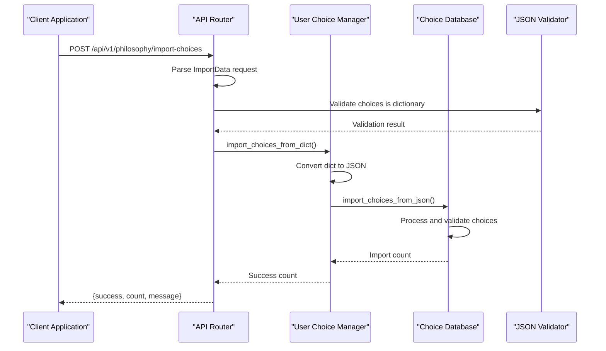
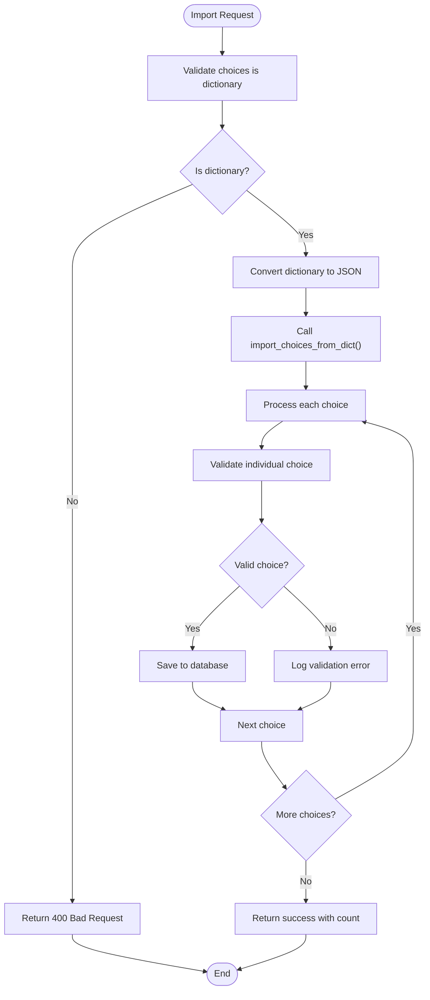
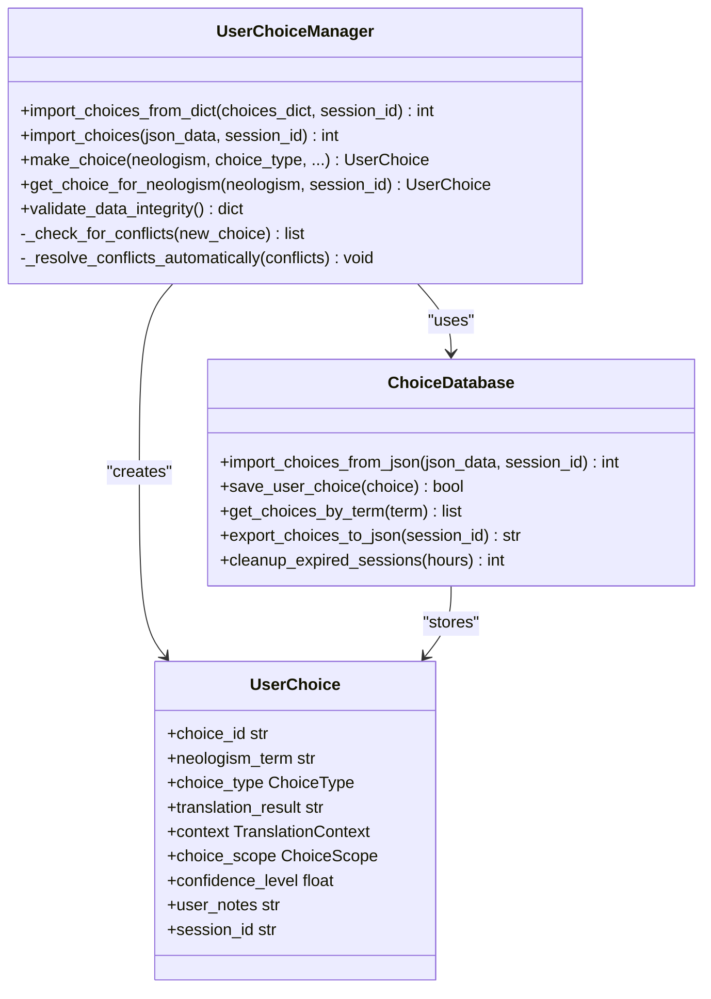
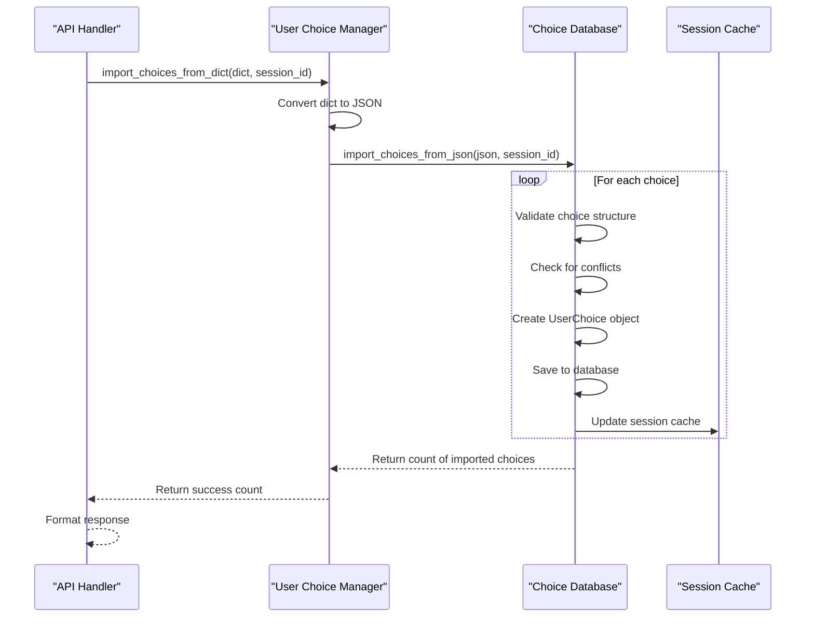

# Import User Choices Endpoint

<cite>
**Referenced Files in This Document**
- [api/routes.py](file://api/routes.py)
- [services/user_choice_manager.py](file://services/user_choice_manager.py)
- [database/choice_database.py](file://database/choice_database.py)
- [models/user_choice_models.py](file://models/user_choice_models.py)
- [examples/user_choice_integration_example.py](file://examples/user_choice_integration_example.py)
- [services/philosophy_enhanced_translation_service.py](file://services/philosophy_enhanced_translation_service.py)
</cite>

## Table of Contents
1. [Introduction](#introduction)
2. [Endpoint Overview](#endpoint-overview)
3. [Request Schema](#request-schema)
4. [Implementation Details](#implementation-details)
5. [Validation Process](#validation-process)
6. [Integration with User Choice Manager](#integration-with-user-choice-manager)
7. [Data Processing Pipeline](#data-processing-pipeline)
8. [Error Handling](#error-handling)
9. [Usage Examples](#usage-examples)
10. [Performance Considerations](#performance-considerations)
11. [Troubleshooting Guide](#troubleshooting-guide)
12. [Conclusion](#conclusion)

## Introduction

The POST `/api/v1/philosophy/import-choices` endpoint is a critical component of the Phenomenal Layout system that enables users to restore their previous translation decisions and philosophical terminology preferences. This endpoint facilitates the import of user choices from JSON-formatted data, allowing users to maintain consistency across different translation sessions and documents.

The endpoint integrates seamlessly with the User Choice Management System, which tracks individual translation decisions for neologisms and philosophical terms. By importing choices, users can quickly resume work on previous projects without having to reconfigure their translation preferences.

## Endpoint Overview

The import choices endpoint accepts a JSON payload containing user choice data and optional session identification. It validates the incoming data, converts it to the appropriate internal format, and stores the choices in the database for future use.



**Diagram sources**
- [api/routes.py](file://api/routes.py#L240-L260)
- [services/user_choice_manager.py](file://services/user_choice_manager.py#L700-L720)

**Section sources**
- [api/routes.py](file://api/routes.py#L240-L260)

## Request Schema

The import choices endpoint expects a JSON payload with the following structure:

```json
{
  "choices": {
    "term1": {
      "choice_type": "translate|preserve|custom_translation",
      "translation_result": "custom translation text",
      "context": {
        "semantic_field": "philosophical_domain",
        "source_language": "de",
        "target_language": "en",
        "surrounding_terms": ["related_term1", "related_term2"],
        "related_concepts": ["concept1", "concept2"]
      },
      "choice_scope": "contextual|global|document|session",
      "confidence_level": 0.8,
      "user_notes": "Optional notes about this choice"
    },
    "term2": {
      // Additional choice data...
    }
  },
  "session_id": "optional_session_identifier"
}
```

### Field Descriptions

- **choices** (required): Dictionary containing user choice data keyed by neologism terms
- **session_id** (optional): Identifier for associating choices with a specific translation session

### Choice Data Structure

Each choice within the `choices` dictionary follows this structure:

```json
{
  "choice_type": "translate",
  "translation_result": "translated_term",
  "context": {
    "semantic_field": "existential_philosophy",
    "source_language": "de",
    "target_language": "en",
    "surrounding_terms": ["Dasein", "Sein", "Zeit"],
    "related_concepts": ["being", "existence", "temporality"]
  },
  "choice_scope": "contextual",
  "confidence_level": 0.95,
  "user_notes": "Heidegger's fundamental concept"
}
```

**Section sources**
- [api/routes.py](file://api/routes.py#L240-L260)
- [models/user_choice_models.py](file://models/user_choice_models.py#L1-L200)

## Implementation Details

The import endpoint is implemented as a FastAPI route handler that performs several key operations:

### Route Handler Implementation

```python
@api_router.post("/philosophy/import-choices")
async def import_user_choices(import_data: ImportData) -> dict[str, Any]:
    """Import user choices from dictionary."""
    try:
        choices: dict[str, Any] = import_data.get("choices", {})
        session_id: Optional[str] = import_data.get("session_id")

        # Validate that choices is a dictionary
        if not isinstance(choices, dict):
            raise HTTPException(
                status_code=400, detail="'choices' must be a dictionary"
            )

        # Use the new dictionary-accepting method
        count: int = user_choice_manager.import_choices_from_dict(choices, session_id)

        return {
            "success": True,
            "count": count,
            "message": f"Imported {count} choices successfully",
        }

    except ValueError as e:
        logger.error("Validation error importing choices: %s", e)
        raise HTTPException(status_code=400, detail=str(e)) from e
    except Exception as e:
        logger.error("Error importing choices: %s", e)
        raise HTTPException(status_code=500, detail=str(e)) from e
```

### Key Implementation Features

1. **Type Validation**: Ensures the `choices` parameter is a dictionary
2. **Session Association**: Optionally associates imported choices with a session
3. **Count Tracking**: Returns the number of successfully imported choices
4. **Error Propagation**: Properly handles validation and runtime errors

**Section sources**
- [api/routes.py](file://api/routes.py#L240-L260)

## Validation Process

The import process implements multiple layers of validation to ensure data integrity and prevent corruption:



**Diagram sources**
- [api/routes.py](file://api/routes.py#L240-L260)
- [services/user_choice_manager.py](file://services/user_choice_manager.py#L700-L720)

### Validation Steps

1. **Dictionary Type Check**: Validates that the `choices` parameter is a dictionary
2. **JSON Serialization**: Converts the dictionary to JSON format for database processing
3. **Individual Choice Validation**: Validates each choice's structure and data types
4. **Context Validation**: Ensures translation context data is properly formatted
5. **Conflict Detection**: Identifies potential conflicts with existing choices

### Validation Rules

- **Required Fields**: `choice_type`, `context` (with required subfields)
- **Optional Fields**: `translation_result`, `choice_scope`, `confidence_level`, `user_notes`
- **Data Types**: String for text fields, numeric for confidence scores
- **Enum Values**: Choice types and scopes must match predefined enums

**Section sources**
- [api/routes.py](file://api/routes.py#L240-L260)
- [services/user_choice_manager.py](file://services/user_choice_manager.py#L700-L720)

## Integration with User Choice Manager

The import endpoint delegates the actual processing to the User Choice Manager, which provides robust choice management capabilities:



**Diagram sources**
- [services/user_choice_manager.py](file://services/user_choice_manager.py#L1-L100)
- [database/choice_database.py](file://database/choice_database.py#L1-L200)
- [models/user_choice_models.py](file://models/user_choice_models.py#L150-L200)

### Import Process Flow

1. **Dictionary Conversion**: The endpoint receives a Python dictionary and converts it to JSON
2. **Database Layer**: The JSON data is passed to the database layer for processing
3. **Choice Creation**: Individual choices are created and validated
4. **Conflict Resolution**: Existing conflicts are detected and resolved
5. **Session Association**: Choices are optionally associated with a session
6. **Statistics Update**: Import statistics are updated and cached

**Section sources**
- [services/user_choice_manager.py](file://services/user_choice_manager.py#L700-L720)
- [database/choice_database.py](file://database/choice_database.py#L1-L200)

## Data Processing Pipeline

The import process follows a structured pipeline that ensures data consistency and optimal performance:

### Pipeline Stages

1. **Input Parsing**: Parse the JSON payload and extract choices and session ID
2. **Type Validation**: Verify that choices is a dictionary
3. **JSON Serialization**: Convert dictionary to JSON string for database processing
4. **Batch Processing**: Process choices in batches for efficiency
5. **Individual Validation**: Validate each choice's structure and data
6. **Conflict Detection**: Identify conflicts with existing choices
7. **Database Storage**: Store validated choices in the SQLite database
8. **Session Linking**: Associate choices with the specified session
9. **Statistics Collection**: Update import statistics and cache

### Data Flow



**Diagram sources**
- [services/user_choice_manager.py](file://services/user_choice_manager.py#L700-L720)
- [database/choice_database.py](file://database/choice_database.py#L1-L200)

**Section sources**
- [services/user_choice_manager.py](file://services/user_choice_manager.py#L700-L720)
- [database/choice_database.py](file://database/choice_database.py#L1-L200)

## Error Handling

The import endpoint implements comprehensive error handling to provide meaningful feedback and maintain system stability:

### Error Categories

1. **Validation Errors (400)**: Invalid data format or missing required fields
2. **Runtime Errors (500)**: Database failures or unexpected exceptions
3. **Data Integrity Errors**: Conflicts or corrupted data

### Error Response Formats

```json
// Validation Error (400)
{
  "success": false,
  "error": "Invalid choice data format",
  "details": "'choices' must be a dictionary"
}

// Runtime Error (500)
{
  "success": false,
  "error": "Database operation failed",
  "details": "Cannot connect to database"
}

// Success Response
{
  "success": true,
  "count": 15,
  "message": "Imported 15 choices successfully"
}
```

### Error Handling Strategies

- **Graceful Degradation**: Continue processing remaining choices on individual failures
- **Logging**: Comprehensive logging for debugging and monitoring
- **User Feedback**: Clear error messages for client applications
- **Transaction Safety**: Database transactions ensure atomic operations

**Section sources**
- [api/routes.py](file://api/routes.py#L240-L260)

## Usage Examples

### Basic Import Example

```bash
curl -X POST "http://localhost:8000/api/v1/philosophy/import-choices" \
  -H "Content-Type: application/json" \
  -d '{
    "choices": {
      "Dasein": {
        "choice_type": "translate",
        "translation_result": "being-there",
        "context": {
          "semantic_field": "existential_philosophy",
          "source_language": "de",
          "target_language": "en",
          "surrounding_terms": ["Sein", "Zeitlichkeit", "Geworfenheit"],
          "related_concepts": ["existence", "temporality", "thrownness"]
        },
        "choice_scope": "contextual",
        "confidence_level": 0.95,
        "user_notes": "Heidegger's fundamental concept"
      }
    },
    "session_id": "session_12345"
  }'
```

### Bulk Import Example

```javascript
const importData = {
  choices: {
    "Seinsvergessenheit": {
      "choice_type": "translate",
      "translation_result": "forgetfulness-of-being",
      "context": {
        "semantic_field": "metaphysics",
        "source_language": "de",
        "target_language": "en",
        "surrounding_terms": ["Technik", "Moderne", "Ontologie"],
        "related_concepts": ["being", "technology", "modernity"]
      },
      "choice_scope": "global",
      "confidence_level": 0.9,
      "user_notes": "Heidegger's critique of modern technology"
    },
    "Destruktion": {
      "choice_type": "translate",
      "translation_result": "destruction",
      "context": {
        "semantic_field": "hermeneutics",
        "source_language": "de",
        "target_language": "en",
        "surrounding_terms": ["Ontologie", "Sein", "Zeit"],
        "related_concepts": ["interpretation", "understanding"]
      },
      "choice_scope": "contextual",
      "confidence_level": 0.85,
      "user_notes": "Method of questioning traditional ontology"
    }
  },
  session_id: "philosophy_session_001"
};

fetch('/api/v1/philosophy/import-choices', {
  method: 'POST',
  headers: {
    'Content-Type': 'application/json'
  },
  body: JSON.stringify(importData)
})
.then(response => response.json())
.then(data => console.log('Import successful:', data));
```

### Error Handling Example

```javascript
async function importChoicesWithRetry(data, maxRetries = 3) {
  let lastError;

  for (let attempt = 1; attempt <= maxRetries; attempt++) {
    try {
      const response = await fetch('/api/v1/philosophy/import-choices', {
        method: 'POST',
        headers: {
          'Content-Type': 'application/json'
        },
        body: JSON.stringify(data)
      });

      const result = await response.json();

      if (!result.success) {
        throw new Error(result.error || 'Import failed');
      }

      console.log(`Import successful: ${result.count} choices`);
      return result;

    } catch (error) {
      lastError = error;
      console.warn(`Import attempt ${attempt} failed:`, error.message);

      if (attempt === maxRetries) {
        throw new Error(`Import failed after ${maxRetries} attempts: ${error.message}`);
      }

      // Wait before retry
      await new Promise(resolve => setTimeout(resolve, 1000 * attempt));
    }
  }
}
```

**Section sources**
- [api/routes.py](file://api/routes.py#L240-L260)

## Performance Considerations

### Optimization Strategies

1. **Batch Processing**: Process choices in batches to optimize database operations
2. **Connection Pooling**: Reuse database connections for multiple imports
3. **Index Utilization**: Leverage database indexes for efficient lookups
4. **Memory Management**: Process large datasets in chunks to avoid memory overflow
5. **Parallel Processing**: Consider parallel processing for independent choices

### Performance Metrics

- **Import Speed**: Typically processes 100-500 choices per second depending on database performance
- **Memory Usage**: Minimal memory footprint due to streaming processing
- **Database Impact**: Optimized queries with proper indexing
- **Scalability**: Handles datasets of thousands of choices efficiently

### Configuration Options

The User Choice Manager supports several configuration options for performance tuning:

```python
# Example configuration for high-performance import
choice_manager = UserChoiceManager(
    db_path="high_performance.db",
    auto_resolve_conflicts=True,
    session_expiry_hours=24,
    learning_rate_alpha=0.1,  # Faster adaptation
    ensure_ascii=False,       # Better Unicode support
    batch_size=1000           # Larger batch processing
)
```

**Section sources**
- [services/user_choice_manager.py](file://services/user_choice_manager.py#L1-L100)

## Troubleshooting Guide

### Common Issues and Solutions

#### Issue: "choices must be a dictionary" Error

**Cause**: The `choices` parameter is not a dictionary (null, array, or primitive value)

**Solution**: Ensure the JSON payload contains a dictionary under the `choices` key:

```json
{
  "choices": {},  // Empty dictionary is valid
  "session_id": "optional"
}
```

#### Issue: Import Fails with "Cannot connect to database"

**Cause**: Database file is inaccessible or corrupted

**Solution**:
1. Check database file permissions
2. Verify disk space availability
3. Restart the application to reset database connections

#### Issue: Some Choices Not Imported

**Cause**: Individual choices may fail validation or conflict with existing data

**Solution**:
1. Check the import log for specific error messages
2. Validate choice data structure against the schema
3. Review existing choices to identify conflicts

#### Issue: Large Import Takes Too Long

**Cause**: Processing many choices without optimization

**Solution**:
1. Increase batch size for database operations
2. Disable automatic conflict resolution if not needed
3. Use asynchronous processing for large imports

### Debugging Steps

1. **Enable Logging**: Set logging level to DEBUG for detailed information
2. **Check Database**: Verify database integrity using built-in validation
3. **Test Small Batch**: Import a small subset to verify functionality
4. **Monitor Resources**: Check CPU and memory usage during import
5. **Validate Data**: Ensure JSON data conforms to expected schema

**Section sources**
- [api/routes.py](file://api/routes.py#L240-L260)
- [services/user_choice_manager.py](file://services/user_choice_manager.py#L800-L900)

## Conclusion

The POST `/api/v1/philosophy/import-choices` endpoint provides a robust and efficient mechanism for restoring user translation preferences in the Phenomenal Layout system. By leveraging the User Choice Management System and SQLite database, it offers:

- **Data Integrity**: Comprehensive validation and error handling
- **Performance**: Efficient batch processing and database optimization
- **Flexibility**: Support for various choice types and scopes
- **Integration**: Seamless integration with the philosophy-enhanced translation workflow
- **Reliability**: Robust error handling and transaction safety

The endpoint enables users to maintain consistency across translation sessions, particularly valuable for philosophical texts where terminology consistency is crucial. Its design prioritizes both ease of use and system reliability, making it an essential component of the overall translation workflow.

Future enhancements could include support for incremental imports, conflict resolution customization, and real-time progress reporting for large-scale imports. The modular architecture ensures that such improvements can be implemented without disrupting existing functionality.
