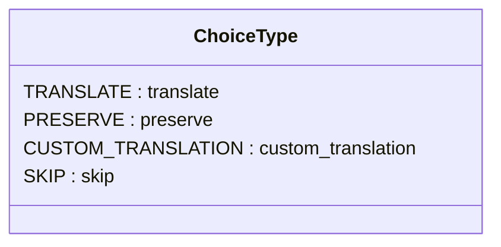
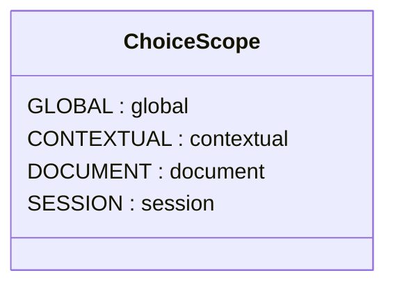
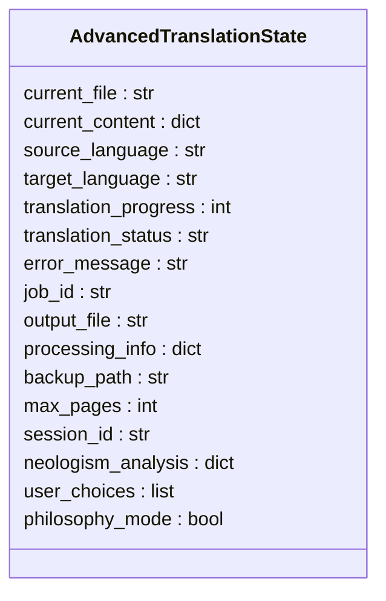
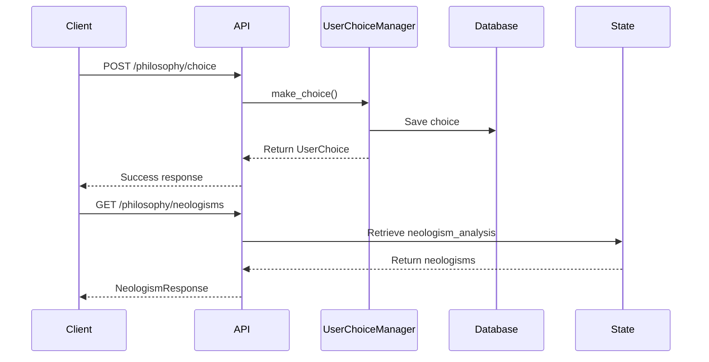
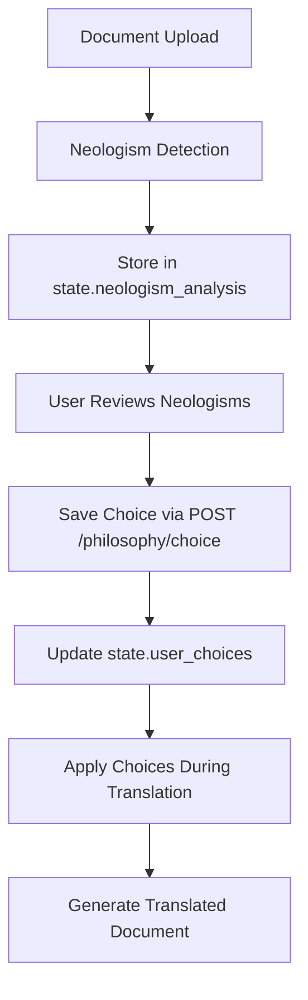

# Philosophy Choice Management Endpoints

<cite>
**Referenced Files in This Document**  
- [routes.py](file://api/routes.py)
- [user_choice_models.py](file://models/user_choice_models.py)
- [user_choice_manager.py](file://services/user_choice_manager.py)
- [state_manager.py](file://core/state_manager.py)
- [philosophy_interface.html](file://templates/philosophy_interface.html)
</cite>

## Table of Contents
1. [Introduction](#introduction)
2. [Core Endpoints](#core-endpoints)
3. [Choice Type and Scope Management](#choice-type-and-scope-management)
4. [State and Session Management](#state-and-session-management)
5. [Export and Import Functionality](#export-and-import-functionality)
6. [Interactive Workflow Integration](#interactive-workflow-integration)
7. [Error Handling and Validation](#error-handling-and-validation)
8. [Examples](#examples)

## Introduction
The Philosophy Choice Management system provides a comprehensive API for handling neologism translation decisions in philosophical texts. This documentation covers the endpoints that enable users to save, retrieve, and manage their translation choices for detected neologisms. The system integrates with the user_choice_manager service and maintains state through the state_manager, enabling a seamless interactive translation workflow for complex philosophical terminology.

## Core Endpoints

### POST /api/v1/philosophy/choice
Saves a user's translation decision for a detected neologism. This endpoint captures the user's preference on how to handle a specific term in the philosophical text.

**Request Schema**
- `term`: string (required) - The neologism term to make a choice about
- `choice`: string (required) - The choice type: "preserve", "translate", or "custom"
- `custom_translation`: string (optional) - The custom translation when choice is "custom"
- `notes`: string (optional) - User-provided notes about the choice
- `session_id`: string (optional) - The session identifier for scoping the choice

**Response**
```json
{
  "success": true,
  "choice_id": "string",
  "message": "Choice saved successfully"
}
```

**Section sources**
- [routes.py](file://api/routes.py#L100-L150)
- [user_choice_models.py](file://models/user_choice_models.py#L20-L50)

### GET /api/v1/philosophy/neologisms
Retrieves all detected neologisms from the current analysis state.

**Response Schema**
```json
{
  "neologisms": [
    {
      "term": "string",
      "confidence": 0.0,
      "neologism_type": "string",
      "start_pos": 0,
      "end_pos": 0,
      "sentence_context": "string",
      "morphological_analysis": {},
      "philosophical_context": {},
      "confidence_factors": {}
    }
  ],
  "total": 0
}
```

**Section sources**
- [routes.py](file://api/routes.py#L152-L170)
- [neologism_models.py](file://models/neologism_models.py#L20-L50)

### GET /api/v1/philosophy/progress
Returns processing metrics and progress information for the philosophy-enhanced translation.

**Response Schema**
```json
{
  "total_neologisms": 0,
  "processed_neologisms": 0,
  "choices_made": 0,
  "session_id": "string",
  "philosophy_mode": true
}
```

**Section sources**
- [routes.py](file://api/routes.py#L172-L195)
- [state_manager.py](file://core/state_manager.py#L50-L70)

## Choice Type and Scope Management

### ChoiceType Mapping
The system supports three primary choice types for handling neologisms:

- **preserve**: Keep the original term unchanged in translation
- **translate**: Apply standard translation to the term
- **custom_translation**: Use a user-provided custom translation

These types are defined in the ChoiceType enum and are used to determine how neologisms should be processed during translation.



**Diagram sources**
- [user_choice_models.py](file://models/user_choice_models.py#L20-L35)

### ChoiceScope Application
Choices can be applied with different scopes, determining their applicability across texts:

- **GLOBAL**: Apply to all occurrences of the term
- **CONTEXTUAL**: Apply to similar contexts
- **DOCUMENT**: Apply within the current document
- **SESSION**: Apply within the current session only



**Diagram sources**
- [user_choice_models.py](file://models/user_choice_models.py#L37-L52)

## State and Session Management

### State Structure
The system maintains state for philosophy-enhanced translation through the AdvancedTranslationState class, which tracks:

- Current neologism analysis
- User choices made during the session
- Session identifier
- Philosophy mode status



**Diagram sources**
- [state_manager.py](file://core/state_manager.py#L20-L50)

### Session Integration
The user choice system integrates with session management to maintain context across interactions. Each choice can be associated with a session_id, allowing users to maintain their translation preferences throughout a translation session.

**Section sources**
- [state_manager.py](file://core/state_manager.py#L150-L200)
- [user_choice_manager.py](file://services/user_choice_manager.py#L50-L100)

## Export and Import Functionality

### POST /api/v1/philosophy/export-choices
Exports user choices to a JSON file for backup or transfer between sessions.

**Request Schema**
```json
{
  "session_id": "string"
}
```

**Response**
- FileResponse with JSON content
- Media type: application/json
- Filename pattern: philosophy-choices-{timestamp}.json

The endpoint returns a FileResponse implementation that delivers the exported choices as a downloadable JSON file.

**Section sources**
- [routes.py](file://api/routes.py#L197-L220)

### POST /api/v1/philosophy/import-choices
Imports user choices from a dictionary, validating the structure before integration.

**Request Schema**
```json
{
  "choices": {
    "term1": {
      "choice_type": "string",
      "translation_result": "string",
      "context": {},
      "choice_scope": "string"
    }
  },
  "session_id": "string"
}
```

**Validation Rules**
- 'choices' must be a dictionary
- Each choice must have valid choice_type
- Context data must conform to TranslationContext structure
- Session ID must be valid if provided

The import process validates the choice dictionaries before integrating them into the current session.

**Section sources**
- [routes.py](file://api/routes.py#L222-L250)
- [user_choice_manager.py](file://services/user_choice_manager.py#L500-L550)

## Interactive Workflow Integration

### User Choice Manager Integration
The API endpoints integrate with the UserChoiceManager service, which handles the business logic for choice management:



**Diagram sources**
- [routes.py](file://api/routes.py#L100-L250)
- [user_choice_manager.py](file://services/user_choice_manager.py#L200-L300)

### State Management Flow
The system maintains neologism analysis and user choices in memory through the state manager, providing real-time access to translation decisions:



**Diagram sources**
- [state_manager.py](file://core/state_manager.py#L20-L200)
- [routes.py](file://api/routes.py#L100-L250)

## Error Handling and Validation

### Request Validation
All endpoints implement comprehensive validation:

- **POST /philosophy/choice**: Validates term is non-empty string, choice is valid type
- **POST /philosophy/import-choices**: Validates choices is dictionary structure
- **General**: Validates session_id format if provided

### Error Responses
The system returns appropriate HTTP status codes:

- 400 Bad Request: Invalid request data
- 404 Not Found: Resource not found
- 500 Internal Server Error: Processing failures

Error details are provided in the response body with descriptive messages.

**Section sources**
- [routes.py](file://api/routes.py#L110-L140)
- [routes.py](file://api/routes.py#L230-L240)

## Examples

### Saving a User Choice
```json
POST /api/v1/philosophy/choice
{
  "term": "Dasein",
  "choice": "preserve",
  "notes": "Heideggerian term, preserve original",
  "session_id": "sess_12345"
}
```

### Retrieving Detected Neologisms
```json
GET /api/v1/philosophy/neologisms
Response:
{
  "neologisms": [
    {
      "term": "Dasein",
      "confidence": 0.95,
      "neologism_type": "philosophical_term",
      "sentence_context": "The concept of Dasein is central to existential analysis."
    }
  ],
  "total": 1
}
```

### Exporting User Choices
```json
POST /api/v1/philosophy/export-choices
{
  "session_id": "sess_12345"
}
```

### Importing User Choices
```json
POST /api/v1/philosophy/import-choices
{
  "choices": {
    "Dasein": {
      "choice_type": "preserve",
      "translation_result": "",
      "choice_scope": "global"
    },
    "Zeitgeist": {
      "choice_type": "custom_translation",
      "translation_result": "spirit of the times",
      "choice_scope": "contextual"
    }
  },
  "session_id": "sess_12345"
}
```

**Section sources**
- [routes.py](file://api/routes.py#L100-L250)
- [user_choice_models.py](file://models/user_choice_models.py#L20-L200)
- [philosophy_interface.html](file://templates/philosophy_interface.html#L50-L150)
