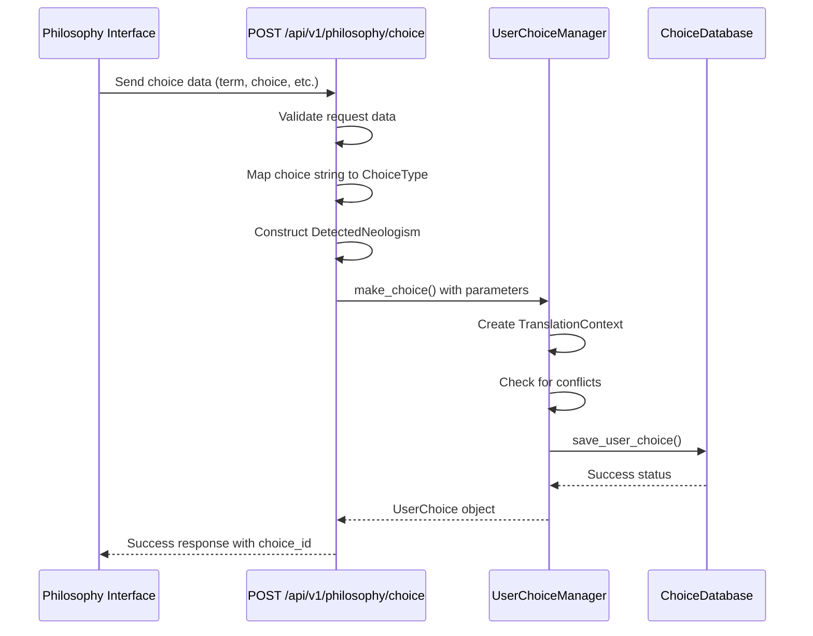

# Save User Choice Endpoint

<cite>
**Referenced Files in This Document**  
- [api/routes.py](file://api/routes.py)
- [models/user_choice_models.py](file://models/user_choice_models.py)
- [services/user_choice_manager.py](file://services/user_choice_manager.py)
- [models/neologism_models.py](file://models/neologism_models.py)
</cite>

## Table of Contents
1. [Introduction](#introduction)
2. [Request Schema](#request-schema)
3. [Validation Rules](#validation-rules)
4. [Choice Type Mapping](#choice-type-mapping)
5. [Integration with User Choice Manager](#integration-with-user-choice-manager)
6. [DetectedNeologism Construction](#detectedneologism-construction)
7. [Example Requests](#example-requests)
8. [Success Response](#success-response)
9. [Error Handling](#error-handling)
10. [Logging Strategy](#logging-strategy)
11. [Role in Interactive Philosophy Translation Workflow](#role-in-interactive-philosophy-translation-workflow)

## Introduction
The POST /api/v1/philosophy/choice endpoint enables users to save their translation decisions for philosophical neologisms detected during document processing. This endpoint is a critical component of the interactive philosophy translation workflow, allowing users to preserve, translate, or provide custom translations for specialized philosophical terms. The endpoint validates input data, maps user choices to appropriate enum values, constructs neologism objects, and persists choices through the user choice management system.

**Section sources**
- [api/routes.py](file://api/routes.py#L120-L180)

## Request Schema
The endpoint accepts a JSON payload with the following fields:

- **term**: string - The philosophical term being addressed
- **choice**: ChoiceType - The user's decision regarding the term (preserve, translate, custom)
- **custom_translation**: string - Custom translation when choice is "custom"
- **session_id**: optional string - Identifier for the current user session
- **notes**: string - Additional user notes about the choice

The request body must be properly formatted JSON with appropriate data types for each field.

**Section sources**
- [api/routes.py](file://api/routes.py#L120-L180)
- [models/user_choice_models.py](file://models/user_choice_models.py#L25-L35)

## Validation Rules
The endpoint implements strict validation for all incoming data:

- **term**: Must be a non-empty string; validated using `isinstance(term_raw, str)` and `term_raw.strip()` checks
- **choice**: Must be one of the valid string values ("preserve", "translate", "custom"); defaults to "preserve" if invalid or missing
- **custom_translation**: Converted to string using `str()` function; empty string if not provided
- **session_id**: Optional string parameter; no validation beyond type conversion
- **notes**: Converted to string using `str()` function; empty string if not provided

Invalid input for required fields triggers a 400 Bad Request response with descriptive error messages.

**Section sources**
- [api/routes.py](file://api/routes.py#L125-L135)

## Choice Type Mapping
The endpoint maps string values from the request to ChoiceType enum values using a dictionary mapping:

```python
choice_type_mapping: dict[str, ChoiceType] = {
    "preserve": ChoiceType.PRESERVE,
    "translate": ChoiceType.TRANSLATE,
    "custom": ChoiceType.CUSTOM_TRANSLATION,
}
```

The mapping converts the incoming choice string to its corresponding ChoiceType enum value. If the provided choice value is not in the mapping, it defaults to ChoiceType.PRESERVE. This ensures that all choices are represented consistently within the system regardless of input variations.

**Section sources**
- [api/routes.py](file://api/routes.py#L155-L165)
- [models/user_choice_models.py](file://models/user_choice_models.py#L25-L35)

## Integration with User Choice Manager
The endpoint integrates with the user_choice_manager.make_choice() method to persist user decisions. After validating input and constructing the necessary objects, the endpoint calls:

```python
user_choice = user_choice_manager.make_choice(
    neologism=neologism,
    choice_type=choice_type,
    translation_result=custom_translation,
    session_id=session_id,
    choice_scope=ChoiceScope.CONTEXTUAL,
    user_notes=notes,
)
```

The make_choice() method handles the complete workflow of creating a UserChoice object, checking for conflicts with existing choices, saving the choice to the database, and updating session statistics. This integration ensures that user choices are properly managed, stored, and available for future translation tasks.

**Section sources**
- [api/routes.py](file://api/routes.py#L170-L178)
- [services/user_choice_manager.py](file://services/user_choice_manager.py#L250-L300)

## DetectedNeologism Construction
The endpoint constructs a DetectedNeologism object from the request data to represent the philosophical term being addressed. The construction process:

```python
neologism: DetectedNeologism = DetectedNeologism(
    term=term,
    confidence=0.8,
    neologism_type=NeologismType.PHILOSOPHICAL_TERM,
    start_pos=0,
    end_pos=len(term),
    sentence_context="Context sentence",
    morphological_analysis=MorphologicalAnalysis(),
    philosophical_context=PhilosophicalContext(),
    confidence_factors=ConfidenceFactors(),
)
```

While some fields use placeholder values (like sentence_context), the essential information (term, type, position) is accurately captured. The constructed object provides the necessary context for the choice management system to properly categorize and apply the user's decision.

**Section sources**
- [api/routes.py](file://api/routes.py#L140-L150)
- [models/neologism_models.py](file://models/neologism_models.py#L15-L45)

## Example Requests
### Preserve Choice
```json
{
  "term": "Dasein",
  "choice": "preserve",
  "custom_translation": "",
  "session_id": "sess_12345",
  "notes": "Heideggerian concept, should remain in German"
}
```

### Translate Choice
```json
{
  "term": "Geist",
  "choice": "translate",
  "custom_translation": "",
  "session_id": "sess_12345",
  "notes": "Standard translation to 'spirit' is appropriate"
}
```

### Custom Translation Choice
```json
{
  "term": "Übermensch",
  "choice": "custom",
  "custom_translation": "Overhuman",
  "session_id": "sess_12345",
  "notes": "Prefer 'Overhuman' to avoid Nietzsche misinterpretations"
}
```

**Section sources**
- [api/routes.py](file://api/routes.py#L120-L180)

## Success Response
Upon successful processing, the endpoint returns a 200 OK response with the following JSON structure:

```json
{
  "success": true,
  "choice_id": "choice_abc123",
  "message": "Choice saved successfully"
}
```

The response includes:
- **success**: Boolean indicating the operation was successful
- **choice_id**: Unique identifier for the saved choice, generated by the system
- **message**: Descriptive success message

The choice_id can be used for future reference, updates, or deletion of the choice.

**Section sources**
- [api/routes.py](file://api/routes.py#L175-L180)

## Error Handling
The endpoint implements comprehensive error handling for various failure scenarios:

### Client Errors (400 Bad Request)
- Invalid or empty term
- Malformed JSON payload
- Missing required fields

Handled by raising HTTPException with status_code=400 and descriptive detail messages.

### Server Errors (500 Internal Server Error)
- Database connection failures
- Unexpected exceptions during processing
- Choice persistence failures

Caught by the general exception handler, logged with full traceback, and returned as 500 responses with generic error messages to avoid exposing sensitive information.

The error handling preserves client-facing HTTP errors while ensuring all exceptions are properly logged for debugging purposes.

**Section sources**
- [api/routes.py](file://api/routes.py#L165-L180)

## Logging Strategy
The endpoint implements a comprehensive logging strategy for monitoring and debugging:

- **Warning logs**: Generated for client-facing HTTP errors (400) using logger.warning(), including error codes when available
- **Error logs**: Generated for server errors (500) using logger.error(), capturing the full exception
- **Info logs**: Generated by the user choice manager for successful operations
- **Debug logs**: Generated for detailed operational information like cache hits

The logging strategy balances operational visibility with security considerations, avoiding the logging of potentially sensitive user-provided data while capturing sufficient information for troubleshooting.

**Section sources**
- [api/routes.py](file://api/routes.py#L165-L180)
- [services/user_choice_manager.py](file://services/user_choice_manager.py#L250-L300)

## Role in Interactive Philosophy Translation Workflow
The POST /api/v1/philosophy/choice endpoint plays a pivotal role in the interactive philosophy translation workflow by enabling user-in-the-loop decision making for philosophical neologisms. When the system detects specialized philosophical terms, it presents them to the user through the philosophy interface. The user can then make informed decisions about how each term should be handled in translation.

This endpoint captures those decisions and stores them in a persistent database, allowing the choices to be:
- Applied consistently throughout the current document
- Reused in future translation tasks with similar contexts
- Shared across sessions when appropriate
- Analyzed for patterns in philosophical translation preferences

By integrating user expertise with automated translation, this endpoint enhances the accuracy and philosophical fidelity of translated texts, particularly for complex philosophical concepts that require nuanced handling.



**Diagram sources **
- [api/routes.py](file://api/routes.py#L120-L180)
- [services/user_choice_manager.py](file://services/user_choice_manager.py#L250-L300)
- [database/choice_database.py](file://database/choice_database.py#L200-L250)

**Section sources**
- [api/routes.py](file://api/routes.py#L120-L180)
- [services/user_choice_manager.py](file://services/user_choice_manager.py#L250-L300)
