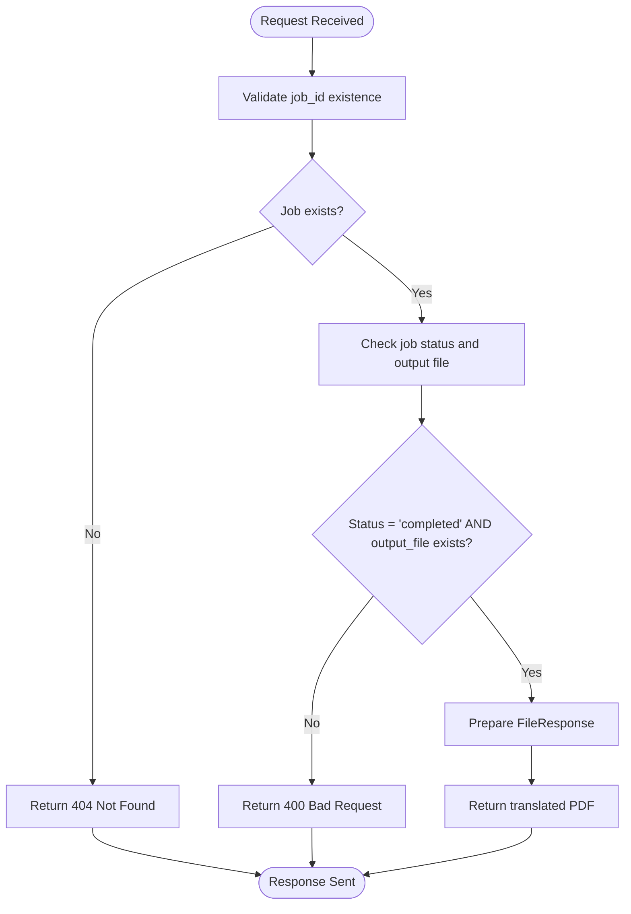
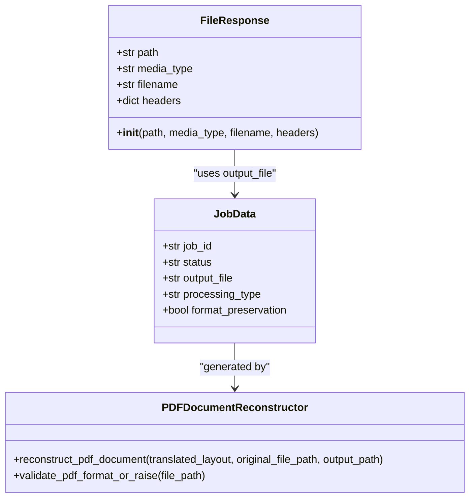
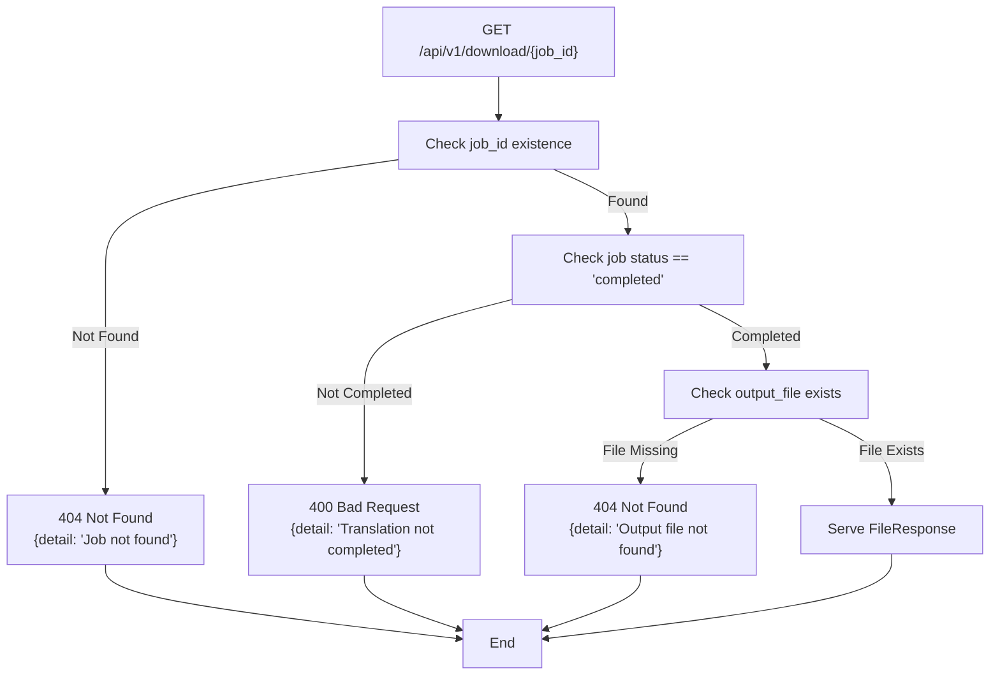
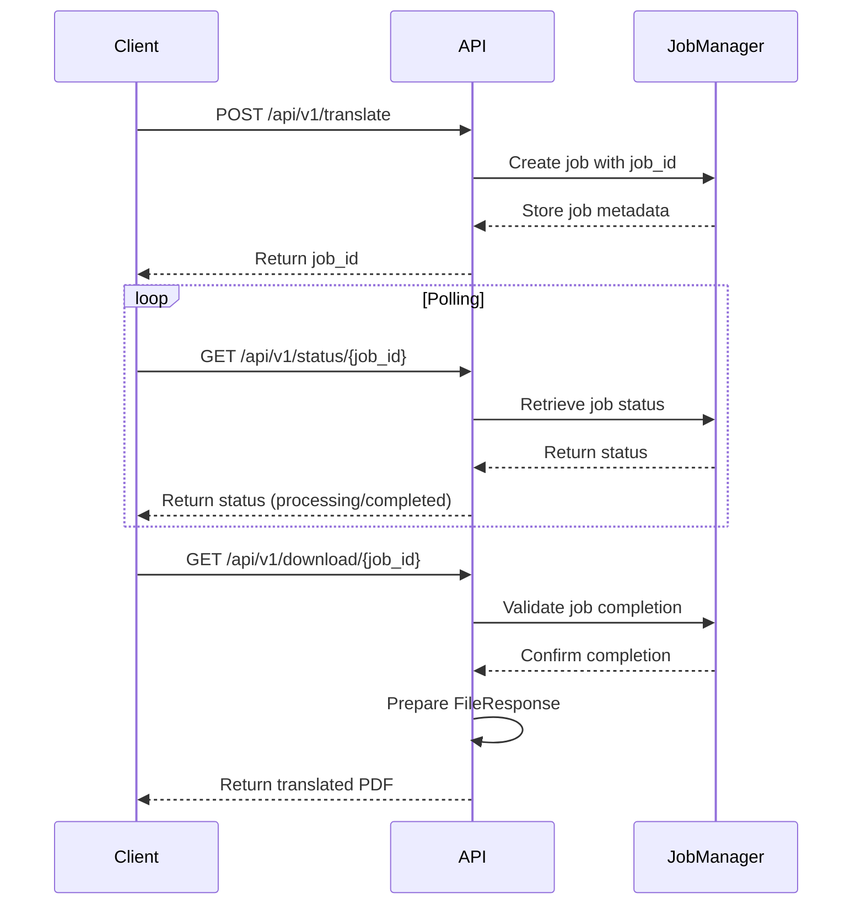

# Result Download Endpoint

<cite>
**Referenced Files in This Document**  
- [api/routes.py](file://api/routes.py)
- [core/state_manager.py](file://core/state_manager.py)
- [utils/file_handler.py](file://utils/file_handler.py)
- [services/pdf_document_reconstructor.py](file://services/pdf_document_reconstructor.py)
</cite>

## Table of Contents
1. [Introduction](#introduction)
2. [Endpoint Overview](#endpoint-overview)
3. [Path Parameter](#path-parameter)
4. [Validation Workflow](#validation-workflow)
5. [File Response Implementation](#file-response-implementation)
6. [Custom Headers](#custom-headers)
7. [Error Responses](#error-responses)
8. [File Cleanup Responsibilities](#file-cleanup-responsibilities)
9. [Integration with Status Polling](#integration-with-status-polling)
10. [Usage Example](#usage-example)

## Introduction
This document provides comprehensive API documentation for the GET /api/v1/download/{job_id} endpoint in the PhenomenalLayout system. The endpoint enables users to download translated PDF documents after successful processing, with advanced format preservation and metadata enrichment. The documentation covers the complete workflow from job validation to file delivery, including error handling and integration with the overall translation system.

## Endpoint Overview
The GET /api/v1/download/{job_id} endpoint provides access to completed translation results in PDF format. This endpoint is part of the v1 API and follows RESTful principles for resource retrieval. It implements a robust validation process to ensure that only successfully completed translation jobs can be downloaded, with appropriate error responses for invalid or incomplete requests.

The endpoint returns a FileResponse object containing the translated PDF with appropriate media type and filename metadata. It also includes custom headers that indicate the processing quality and format preservation capabilities of the translation system.

**Section sources**
- [api/routes.py](file://api/routes.py#L495-L519)

## Path Parameter
The endpoint accepts a single path parameter:

**job_id**: A string identifier that uniquely identifies a translation job within the system. This UUID is generated when a translation job is initiated and serves as the primary key for accessing job status and results.

The job_id parameter is required and must correspond to an existing translation job in the system's job registry. The parameter is validated against the global translation_jobs dictionary, which maintains the state of all active and completed translation jobs.

**Section sources**
- [api/routes.py](file://api/routes.py#L495-L496)
- [core/state_manager.py](file://core/state_manager.py#L150-L155)

## Validation Workflow
The endpoint implements a two-step validation process to ensure that only valid, completed translation results can be downloaded:

1. **Job Existence Check**: The system first verifies that the provided job_id exists in the translation_jobs registry. This check prevents access to non-existent or expired jobs.

2. **Completion Status Check**: For existing jobs, the system validates that the job has completed successfully by checking two conditions:
   - The job status must be "completed"
   - The job must have a valid output_file path

The validation workflow ensures data integrity by preventing premature access to translation results and handling edge cases such as failed or canceled jobs.



**Diagram sources**
- [api/routes.py](file://api/routes.py#L497-L505)

**Section sources**
- [api/routes.py](file://api/routes.py#L497-L505)
- [core/state_manager.py](file://core/state_manager.py#L150-L155)

## File Response Implementation
The endpoint returns a FileResponse object that serves the translated PDF document with appropriate metadata:

- **Media Type**: The response uses "application/octet-stream" as the media type, which is appropriate for binary file downloads
- **Filename**: The filename is extracted from the output_file path using Path(job["output_file"]).name, preserving the original filename structure
- **File Path**: The response serves the file directly from the path stored in job["output_file"]

The FileResponse implementation leverages FastAPI's built-in file serving capabilities to efficiently stream the PDF content to the client without loading the entire file into memory.

The output file is generated by the PDFDocumentReconstructor service, which creates a translated document with preserved formatting, fonts, and layout from the original PDF. The reconstruction process maintains text positioning, font styles, and document structure to ensure pixel-perfect format preservation.



**Diagram sources**
- [api/routes.py](file://api/routes.py#L506-L515)
- [services/pdf_document_reconstructor.py](file://services/pdf_document_reconstructor.py#L100-L150)

**Section sources**
- [api/routes.py](file://api/routes.py#L506-L515)
- [services/pdf_document_reconstructor.py](file://services/pdf_document_reconstructor.py#L1-L50)

## Custom Headers
The endpoint includes two custom headers in the response to indicate processing quality and capabilities:

**X-Processing-Type**: Set to "advanced" to indicate that the translation was processed using the advanced translation pipeline with enhanced features such as layout preservation, font matching, and style retention.

**X-Format-Preserved**: Set to "true" to confirm that the output document maintains the original formatting, layout, and visual characteristics of the source document.

These custom headers provide clients with metadata about the processing quality, enabling them to make informed decisions about how to handle the downloaded file. For example, client applications can use these headers to display processing quality indicators or to apply different handling logic based on the format preservation status.

**Section sources**
- [api/routes.py](file://api/routes.py#L512-L514)

## Error Responses
The endpoint implements comprehensive error handling with specific HTTP status codes for different failure scenarios:

**404 Not Found**: Returned in two scenarios:
- When the provided job_id does not exist in the system
- When the output file has been deleted or cannot be found

The 404 response indicates that the requested resource is not available, either because the job never existed or because the output file is missing.

**400 Bad Request**: Returned when the job exists but is not in a downloadable state:
- The job status is not "completed" (e.g., "processing", "failed", "canceled")
- The job's output_file field is null or empty

The 400 response indicates that the request is invalid due to the job's current state, guiding clients to check the job status before attempting download.



**Diagram sources**
- [api/routes.py](file://api/routes.py#L497-L518)

**Section sources**
- [api/routes.py](file://api/routes.py#L497-L518)

## File Cleanup Responsibilities
The system implements automated file cleanup to manage disk space and maintain system performance:

1. **Job Registry Cleanup**: The ThreadSafeTranslationJobs class automatically removes completed jobs after 24 hours of retention. This cleanup occurs hourly and targets jobs with "completed", "failed", or "error" statuses.

2. **File System Cleanup**: The FileHandler class provides mechanisms for cleaning up old files from upload, download, and temporary directories. Files older than 24 hours are automatically removed during periodic cleanup operations.

3. **Error Handling**: When an output file cannot be found during download, the system raises a 404 error. This can occur if the file was deleted by cleanup processes or if there was an error during file creation.

4. **Resource Management**: The system ensures that file handles are properly closed and temporary resources are released, preventing resource leaks during the translation and download processes.

The cleanup responsibilities are distributed across the system, with the state manager handling job metadata cleanup and the file handler managing physical file cleanup.

**Section sources**
- [core/state_manager.py](file://core/state_manager.py#L180-L200)
- [utils/file_handler.py](file://utils/file_handler.py#L150-L190)

## Integration with Status Polling
The download endpoint is designed to work in conjunction with the status polling workflow:

1. **Job Initiation**: Clients start a translation job through the appropriate endpoint, receiving a job_id in response.

2. **Status Polling**: Clients periodically poll the GET /api/v1/status/{job_id} endpoint to check the job's progress and completion status.

3. **Download Readiness**: When the status endpoint returns a "completed" status with an output_file path, the client knows the result is ready for download.

4. **Result Retrieval**: The client makes a request to the download endpoint with the job_id to retrieve the translated PDF.

This workflow enables asynchronous processing, allowing clients to initiate long-running translation tasks and check their status at their convenience. The separation of status checking and file download allows for efficient resource utilization and better user experience.



**Diagram sources**
- [api/routes.py](file://api/routes.py#L495-L519)
- [core/state_manager.py](file://core/state_manager.py#L150-L155)

**Section sources**
- [api/routes.py](file://api/routes.py#L495-L519)
- [core/state_manager.py](file://core/state_manager.py#L150-L155)

## Usage Example
The following example demonstrates how to download a completed translation result using curl:

```bash
curl -X GET "http://localhost:8000/api/v1/download/123e4567-e89b-12d3-a456-426614174000" \
  -H "accept: application/octet-stream" \
  -o translated_document.pdf
```

This command downloads the translated PDF file and saves it as "translated_document.pdf" in the current directory. The response will include the custom headers X-Processing-Type: advanced and X-Format-Preserved: true, indicating the advanced processing quality.

Clients should first verify the job status using the status endpoint before attempting download:

```bash
# First, check job status
curl -X GET "http://localhost:8000/api/v1/status/123e4567-e89b-12d3-a456-426614174000"

# Once status shows "completed", download the result
curl -X GET "http://localhost:8000/api/v1/download/123e4567-e89b-12d3-a456-426614174000" -o result.pdf
```

**Section sources**
- [api/routes.py](file://api/routes.py#L495-L519)
