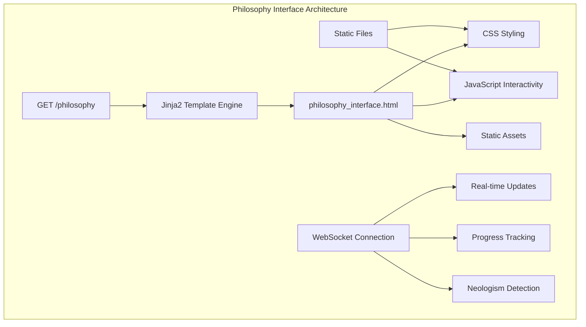
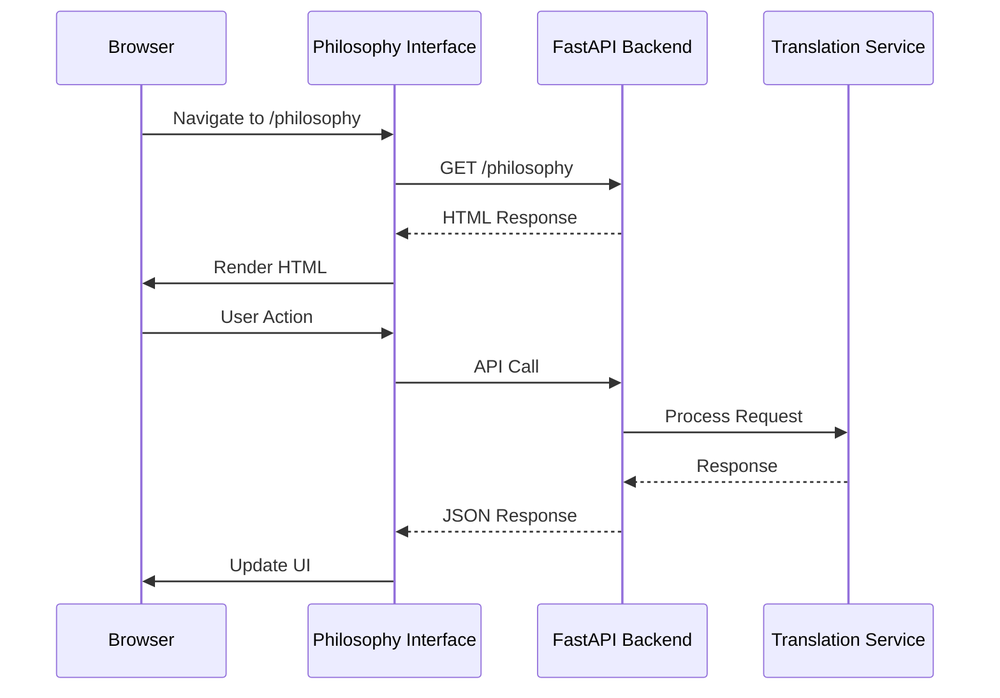

# Root and UI Endpoints

<cite>
**Referenced Files in This Document**
- [app.py](file://app.py)
- [api/routes.py](file://api/routes.py)
- [templates/philosophy_interface.html](file://templates/philosophy_interface.html)
- [static/philosophy_interface.css](file://static/philosophy_interface.css)
- [static/philosophy_interface.js](file://static/philosophy_interface.js)
- [README.md](file://README.md)
- [examples/philosophy_interface_usage_example.py](file://examples/philosophy_interface_usage_example.py)
</cite>

## Table of Contents
1. [Introduction](#introduction)
2. [Root Endpoint Documentation](#root-endpoint-documentation)
3. [Philosophy Interface Endpoint](#philosophy-interface-endpoint)
4. [Static Asset Handling](#static-asset-handling)
5. [API Integration](#api-integration)
6. [Usage Examples](#usage-examples)
7. [Troubleshooting](#troubleshooting)

## Introduction

The PhenomenalLayout application provides two primary endpoints for client discovery and user interface access. These endpoints serve as entry points for clients to understand the API capabilities and access the philosophy-enhanced translation interface. The root endpoint provides metadata about the API, while the philosophy interface offers an interactive HTML-based user experience for managing philosophical translations.

## Root Endpoint Documentation

### GET /

The root endpoint serves as the primary discovery mechanism for clients, providing essential metadata about the API and available interfaces.

#### Endpoint Details
- **URL**: `/`
- **Method**: GET
- **Response Type**: JSON
- **Purpose**: API metadata and client discovery

#### Response Structure

```json
{
    "message": "Advanced Document Translator API",
    "ui_url": "/ui",
    "philosophy_ui_url": "/philosophy",
    "version": "2.0.0",
    "features": [
        "Advanced PDF processing",
        "Image-text overlay preservation",
        "High-resolution rendering",
        "Comprehensive format support",
        "Philosophy-enhanced neologism detection",
        "User choice management for translations"
    ]
}
```

#### Response Fields

| Field | Type | Description |
|-------|------|-------------|
| `message` | string | General description of the API |
| `ui_url` | string | Path to the main Gradio interface |
| `philosophy_ui_url` | string | Path to the philosophy-enhanced interface |
| `version` | string | API version number |
| `features` | array[string] | List of available features |

#### Purpose and Usage

The root endpoint serves several critical functions:

1. **Client Discovery**: Provides clients with essential information about the API structure
2. **Navigation Guidance**: Points clients to appropriate interfaces for different use cases
3. **Version Information**: Helps clients verify compatibility with the API version
4. **Feature Awareness**: Lists available capabilities for intelligent client behavior

#### Example Response Analysis

The response includes:
- **Human-readable message** for easy identification
- **UI URLs** for different interface types
- **Version tracking** for backward compatibility
- **Feature enumeration** for capability negotiation

**Section sources**
- [api/routes.py](file://api/routes.py#L58-L72)

## Philosophy Interface Endpoint

### GET /philosophy

The philosophy interface endpoint serves an interactive HTML interface designed specifically for philosophy-enhanced translation workflows. This endpoint utilizes FastAPI's HTMLResponse type and Jinja2 templating to render a sophisticated user interface.

#### Endpoint Details
- **URL**: `/philosophy`
- **Method**: GET
- **Response Type**: HTMLResponse
- **Template Engine**: Jinja2
- **Template File**: `templates/philosophy_interface.html`

#### Template Rendering Mechanism

The philosophy interface uses a structured approach to template rendering:

```python
@app_router.get("/philosophy", response_class=HTMLResponse)
async def philosophy_interface(request: Request) -> HTMLResponse:
    """Philosophy-enhanced translation interface."""
    return templates.TemplateResponse(
        "philosophy_interface.html",
        {"request": request},
    )
```

#### Interface Architecture

The philosophy interface consists of several key components:



**Diagram sources**
- [api/routes.py](file://api/routes.py#L74-L79)
- [templates/philosophy_interface.html](file://templates/philosophy_interface.html#L1-L50)

#### Interface Features

The philosophy interface provides comprehensive functionality for philosophical text translation:

1. **Neologism Detection**: Real-time identification of philosophical terms requiring special handling
2. **User Choice Management**: Interactive interface for deciding how to handle detected neologisms
3. **Terminology Management**: Tools for managing philosophical terminology databases
4. **Session Analytics**: Detailed statistics and progress tracking
5. **Batch Operations**: Efficient handling of multiple neologisms
6. **Export/Import**: Data portability for terminology and user choices

#### Interface Sections

The philosophy interface is organized into four main sections:

1. **Neologism Review Tab**: Interactive review and choice-making for detected philosophical terms
2. **Terminology Management Tab**: Tools for managing philosophical terminology databases
3. **Settings Tab**: Configuration options for philosophy mode
4. **Analytics Tab**: Comprehensive session statistics and progress tracking

**Section sources**
- [api/routes.py](file://api/routes.py#L74-L79)
- [templates/philosophy_interface.html](file://templates/philosophy_interface.html#L1-L100)

## Static Asset Handling

### Static Files Mount

The application mounts static files at the `/static` endpoint, providing access to CSS, JavaScript, and other assets required by the philosophy interface.

#### Mount Configuration

```python
# Static files mount
app.mount("/static", StaticFiles(directory="static"), name="static")
```

#### Asset Organization

The static directory contains:

```
static/
├── philosophy_interface.css
├── philosophy_interface.js
└── demos/
    ├── demo.css
    └── demo.html
```

#### Asset Types and Purposes

1. **philosophy_interface.css**: Modern academic styling for the philosophy interface
2. **philosophy_interface.js**: Interactive functionality for neologism management
3. **demo.css/demo.html**: Example demonstrations for web evaluation

#### Asset Loading Strategy

The philosophy interface loads assets using standard web conventions:

```html
<!-- CSS Loading -->
<link rel="stylesheet" href="/static/philosophy_interface.css">

<!-- JavaScript Loading -->
<script src="/static/philosophy_interface.js"></script>
```

#### Design Principles

The static assets follow modern web design principles:

- **Responsive Design**: Adapts to various screen sizes
- **Academic Aesthetic**: Reflects the philosophical theme
- **Performance Optimization**: Minimized loading times
- **Accessibility**: Proper semantic markup and keyboard navigation

**Section sources**
- [app.py](file://app.py#L67-L69)
- [static/philosophy_interface.css](file://static/philosophy_interface.css#L1-L50)
- [static/philosophy_interface.js](file://static/philosophy_interface.js#L1-L50)

## API Integration

### Philosophy API Endpoints

The philosophy interface integrates with several API endpoints for comprehensive functionality:

#### Core API Endpoints

1. **POST /api/philosophy/choice**
   - Purpose: Save user choices for neologisms
   - Input: Choice data including term, choice type, and session ID
   - Output: Confirmation with choice ID

2. **GET /api/philosophy/neologisms**
   - Purpose: Retrieve detected neologisms for a session
   - Input: Optional session ID
   - Output: Neologism list with metadata

3. **GET /api/philosophy/progress**
   - Purpose: Get current processing progress
   - Output: Progress statistics and session information

4. **POST /api/philosophy/export-choices**
   - Purpose: Export user choices to JSON
   - Input: Session ID
   - Output: JSON file download

5. **POST /api/philosophy/import-choices**
   - Purpose: Import user choices from JSON
   - Input: Choices dictionary and session ID
   - Output: Import confirmation

6. **GET /api/philosophy/terminology**
   - Purpose: Get current terminology database
   - Output: Dictionary of terms and translations

#### Integration Patterns

The philosophy interface follows these integration patterns:



**Diagram sources**
- [api/routes.py](file://api/routes.py#L81-L120)

**Section sources**
- [api/routes.py](file://api/routes.py#L81-L120)

## Usage Examples

### Accessing Endpoints

#### Root Endpoint Access

```bash
# Using curl
curl -X GET http://localhost:8000/

# Expected response
{
    "message": "Advanced Document Translator API",
    "ui_url": "/ui",
    "philosophy_ui_url": "/philosophy",
    "version": "2.0.0",
    "features": [
        "Advanced PDF processing",
        "Image-text overlay preservation",
        "High-resolution rendering",
        "Comprehensive format support",
        "Philosophy-enhanced neologism detection",
        "User choice management for translations"
    ]
}
```

#### Philosophy Interface Access

```bash
# Direct browser access
http://localhost:8000/philosophy

# Using curl with HTML response
curl -X GET http://localhost:8000/philosophy -H "Accept: text/html"
```

### Client Integration Patterns

#### Discovery Pattern

```python
import requests

# Step 1: Discover API capabilities
response = requests.get("http://localhost:8000/")
api_info = response.json()

print(f"API Version: {api_info['version']}")
print(f"Available Interfaces: {api_info['features']}")

# Step 2: Navigate to appropriate interface
if "Philosophy-enhanced neologism detection" in api_info["features"]:
    philosophy_url = api_info["philosophy_ui_url"]
    print(f"Access philosophy interface at: {philosophy_url}")
```

#### Philosophy Interface Workflow

```python
# 1. Start translation with philosophy mode
translation_response = requests.post(
    "http://localhost:8000/api/upload",
    files={"file": open("document.pdf", "rb")}
)

# 2. Enable philosophy mode in main interface
# (Assuming main interface has a checkbox for philosophy mode)

# 3. Switch to philosophy interface for detailed management
philosophy_page = requests.get("http://localhost:8000/philosophy")

# 4. Review and manage neologisms
# Interface provides interactive tools for:
# - Viewing detected neologisms
# - Making choices (preserve, translate, custom)
# - Managing terminology
# - Exporting/importing choices
```

### Philosophy API Usage Examples

#### Saving User Choices

```bash
curl -X POST http://localhost:8000/api/philosophy/choice \
-H "Content-Type: application/json" \
-d '{
    "term": "Bewusstseinsphänomen",
    "choice": "preserve",
    "custom_translation": "",
    "notes": "Important philosophical concept",
    "session_id": "session_123"
}'
```

#### Getting Neologism Progress

```bash
curl -X GET http://localhost:8000/api/philosophy/progress
```

#### Exporting User Choices

```bash
curl -X POST http://localhost:8000/api/philosophy/export-choices \
-H "Content-Type: application/json" \
-d '{"session_id": "session_123"}'
```

**Section sources**
- [examples/philosophy_interface_usage_example.py](file://examples/philosophy_interface_usage_example.py#L300-L388)

## Troubleshooting

### Common Issues and Solutions

#### 1. Root Endpoint Not Accessible

**Symptoms**: 404 error when accessing `/`
**Causes**:
- Application not running
- Incorrect host/port configuration
- Middleware blocking requests

**Solutions**:
```bash
# Verify application is running
ps aux | grep app.py

# Check if application is listening on correct port
netstat -an | grep 8000

# Verify CORS settings in app.py
# Ensure allow_origins=["*"] is configured
```

#### 2. Philosophy Interface Not Loading

**Symptoms**: Blank page or 404 when accessing `/philosophy`
**Causes**:
- Template file not found
- Static assets not served
- Jinja2 configuration issue

**Solutions**:
```bash
# Verify template directory exists
ls -la templates/

# Check static files mount
curl -I http://localhost:8000/static/philosophy_interface.css

# Verify template rendering
python -c "from fastapi.templating import Jinja2Templates; templates = Jinja2Templates(directory='templates'); print('Template directory accessible')"
```

#### 3. Static Assets Not Loading

**Symptoms**: CSS/JS not applied, broken interface
**Causes**:
- Static files mount misconfigured
- File permissions issue
- Network connectivity problems

**Solutions**:
```bash
# Verify static directory permissions
ls -la static/

# Check static file accessibility
curl http://localhost:8000/static/philosophy_interface.css

# Verify mount configuration in app.py
# Ensure app.mount("/static", StaticFiles(directory="static"), name="static")
```

#### 4. API Integration Issues

**Symptoms**: Philosophy interface works but API calls fail
**Causes**:
- API router not included
- Route conflicts
- Middleware interference

**Solutions**:
```python
# Verify router inclusion in app.py
# Ensure both routers are included:
app.include_router(app_router)  # Root and philosophy routes
app.include_router(api_router, prefix="/api/v1")  # API routes with versioning
```

### Debugging Tips

1. **Enable Logging**: Set logging level to DEBUG for detailed information
2. **Check Network Requests**: Use browser developer tools to monitor API calls
3. **Verify Dependencies**: Ensure all required packages are installed
4. **Test Endpoints Individually**: Verify each endpoint separately
5. **Check File Paths**: Ensure template and static file paths are correct

### Performance Considerations

- **Asset Caching**: Browsers should cache static assets for improved performance
- **Template Compilation**: Jinja2 templates are compiled once and cached
- **Memory Usage**: Large document processing may consume significant memory
- **Network Latency**: API response times depend on network conditions

**Section sources**
- [app.py](file://app.py#L1-L121)
- [api/routes.py](file://api/routes.py#L1-L50)
