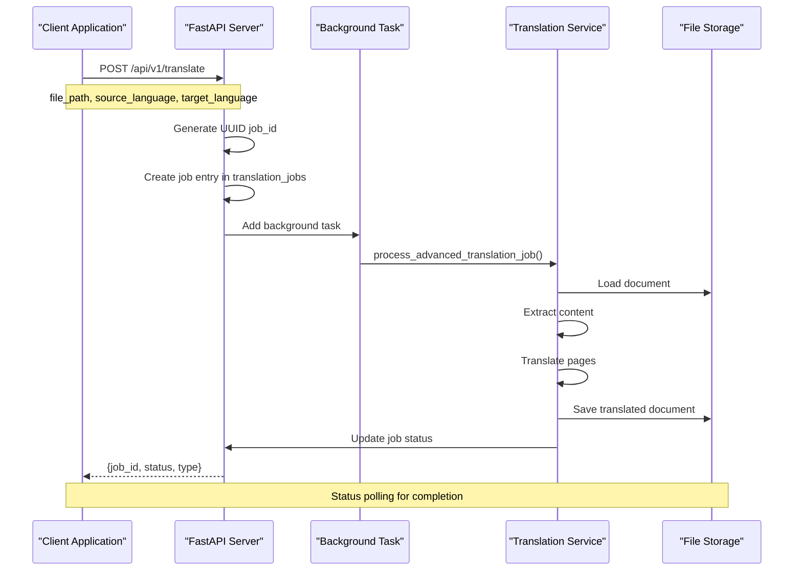
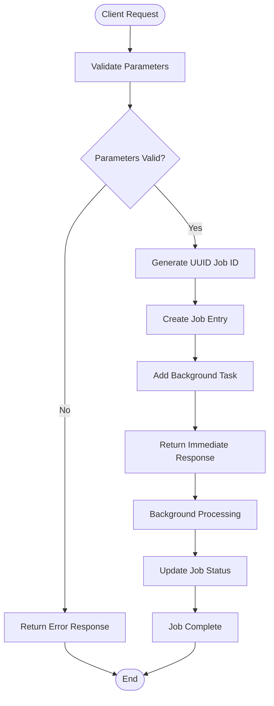
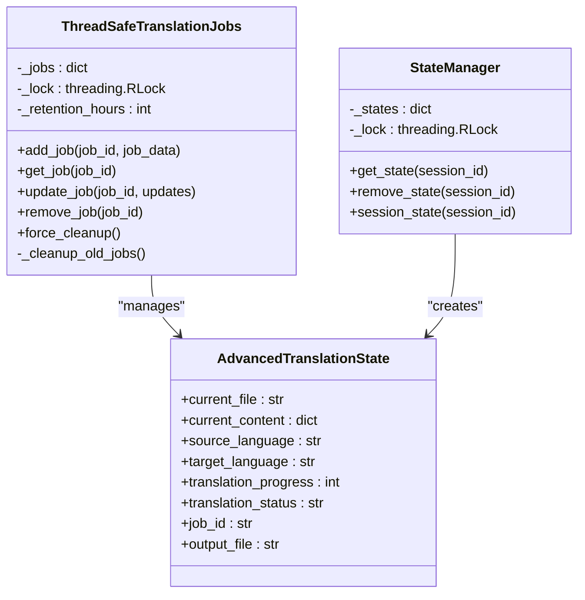
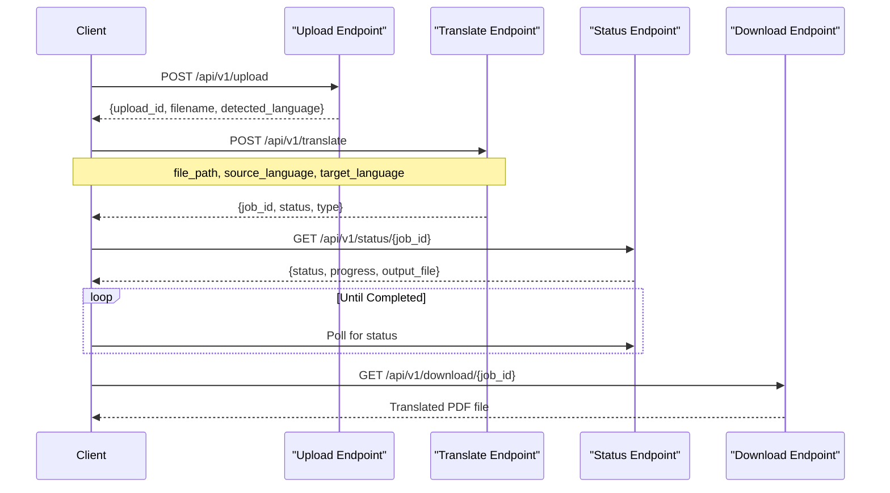

# Translation Processing Endpoint

<cite>
**Referenced Files in This Document**
- [api/routes.py](file://api/routes.py)
- [core/state_manager.py](file://core/state_manager.py)
- [core/translation_handler.py](file://core/translation_handler.py)
- [utils/file_handler.py](file://utils/file_handler.py)
- [config/settings.py](file://config/settings.py)
- [services/translation_service.py](file://services/translation_service.py)
- [app.py](file://app.py)
</cite>

## Table of Contents
1. [Introduction](#introduction)
2. [Endpoint Overview](#endpoint-overview)
3. [Request Parameters](#request-parameters)
4. [Response Structure](#response-structure)
5. [Asynchronous Processing Model](#asynchronous-processing-model)
6. [Job Management System](#job-management-system)
7. [Security Considerations](#security-considerations)
8. [Workflow Integration](#workflow-integration)
9. [Error Handling](#error-handling)
10. [Usage Examples](#usage-examples)
11. [Performance Considerations](#performance-considerations)
12. [Troubleshooting Guide](#troubleshooting-guide)

## Introduction

The POST `/api/v1/translate` endpoint is a core component of the PhenomenalLayout system, designed to handle document translation requests asynchronously using FastAPI's BackgroundTasks. This endpoint serves as the primary interface for initiating advanced translation jobs while maintaining format preservation and layout integrity throughout the process.

The endpoint implements a sophisticated job-based architecture that separates the initiation of translation tasks from their actual execution, allowing for long-running processes without blocking the API response. This design enables seamless integration with upload and status checking endpoints, providing a robust workflow for document translation services.

## Endpoint Overview

The `/api/v1/translate` endpoint accepts translation requests with three mandatory parameters and returns an immediate response indicating job creation success. The actual translation processing occurs in the background, with job status updates tracked through a global state management system.



**Diagram sources**
- [api/routes.py](file://api/routes.py#L420-L440)
- [core/translation_handler.py](file://core/translation_handler.py#L700-L755)

**Section sources**
- [api/routes.py](file://api/routes.py#L420-L440)

## Request Parameters

The endpoint requires three essential parameters to initiate a translation job:

### file_path (string)
- **Description**: Server-side file path from the upload endpoint
- **Format**: Absolute or relative path to the uploaded PDF file
- **Validation**: Must correspond to a valid file in the uploads directory
- **Security**: Path validation prevents directory traversal attacks
- **Required**: Yes

### source_language (string)
- **Description**: ISO 639-1 language code of the source document
- **Format**: Two-letter lowercase language code (e.g., "de", "fr", "es")
- **Validation**: Must be a valid language code from the predefined set
- **Required**: Yes

### target_language (string)
- **Description**: ISO 639-1 language code for the translation output
- **Format**: Two-letter lowercase language code
- **Validation**: Must differ from source language and be valid
- **Required**: Yes

**Section sources**
- [api/routes.py](file://api/routes.py#L420-L440)
- [config/settings.py](file://config/settings.py#L15-L50)

## Response Structure

The endpoint returns a structured JSON response immediately upon successful job creation:

```json
{
  "job_id": "uuid-string",
  "status": "started",
  "type": "advanced"
}
```

### Response Fields

- **job_id** (string): Unique identifier for the translation job generated using UUID
- **status** (string): Current job status, always "started" for new jobs
- **type** (string): Processing type, always "advanced" for this endpoint

**Section sources**
- [api/routes.py](file://api/routes.py#L420-L440)

## Asynchronous Processing Model

The translation endpoint utilizes FastAPI's BackgroundTasks to implement an asynchronous processing model that separates job initiation from actual execution. This design provides several advantages:

### Background Task Implementation

```python
background_tasks.add_task(
    process_advanced_translation_job,
    job_id,
    file_path,
    source_language,
    target_language,
)
```

### Processing Workflow

1. **Immediate Response**: Client receives job creation confirmation instantly
2. **Background Execution**: Translation processing occurs independently
3. **State Updates**: Job status is updated throughout the process
4. **Completion Notification**: Client polls for completion status



**Diagram sources**
- [api/routes.py](file://api/routes.py#L420-L440)
- [core/translation_handler.py](file://core/translation_handler.py#L700-L755)

**Section sources**
- [api/routes.py](file://api/routes.py#L420-L440)
- [core/translation_handler.py](file://core/translation_handler.py#L700-L755)

## Job Management System

The translation job system is managed through a sophisticated state management architecture that tracks job lifecycle and provides thread-safe operations.

### Global Job Dictionary

The `translation_jobs` dictionary serves as the central registry for all translation jobs:

```python
translation_jobs = ThreadSafeTranslationJobs(retention_hours=24)
```

### Job Entry Structure

Each job entry contains comprehensive metadata:

```python
{
    "status": "started",
    "progress": 0,
    "file_path": "/path/to/document.pdf",
    "source_language": "de",
    "target_language": "en",
    "created_at": datetime.now(UTC),
    "output_file": None,
    "error": None,
    "processing_type": "advanced",
    "format_preservation": True
}
```

### State Manager Architecture



**Diagram sources**
- [core/state_manager.py](file://core/state_manager.py#L30-L120)
- [core/state_manager.py](file://core/state_manager.py#L15-L30)

### Automatic Cleanup

The job management system implements automatic cleanup to prevent memory leaks:

- **Retention Period**: 24 hours for completed jobs
- **Cleanup Interval**: Runs every hour
- **Trigger Conditions**: Automatic cleanup or manual forced cleanup
- **Cleanup Criteria**: Only removes completed, failed, or errored jobs

**Section sources**
- [core/state_manager.py](file://core/state_manager.py#L30-L120)
- [core/state_manager.py](file://core/state_manager.py#L15-L30)

## Security Considerations

The translation endpoint implements multiple security measures to protect against common vulnerabilities:

### File Path Validation

```python
# Prevent directory traversal attacks
def _is_valid_file_type(self, filename: str) -> bool:
    allowed_extensions = {".pdf"}
    file_ext = Path(filename).suffix.lower()
    return file_ext in allowed_extensions
```

### Parameter Sanitization

- **Path Validation**: Ensures file paths are valid and accessible
- **Extension Filtering**: Restricts uploads to PDF format only
- **Size Limits**: Enforces maximum file size limits
- **Metadata Sanitization**: Removes potentially sensitive path information

### Access Control

- **API Key Authentication**: Requires valid LINGO_API_KEY for translation services
- **Rate Limiting**: Configurable delays between translation requests
- **Resource Isolation**: Separate directories for uploads, downloads, and temp files

**Section sources**
- [utils/file_handler.py](file://utils/file_handler.py#L40-L50)
- [config/settings.py](file://config/settings.py#L200-L250)

## Workflow Integration

The translation endpoint integrates seamlessly with other API endpoints to provide a complete document translation workflow:

### Complete Workflow Sequence



**Diagram sources**
- [api/routes.py](file://api/routes.py#L350-L420)
- [api/routes.py](file://api/routes.py#L440-L480)

### Integration Points

1. **Upload Endpoint**: Provides file_path parameter for translation
2. **Status Endpoint**: Allows monitoring of translation progress
3. **Download Endpoint**: Retrieves completed translation results
4. **Language Detection**: Automatically detects source language during upload

**Section sources**
- [api/routes.py](file://api/routes.py#L350-L480)

## Error Handling

The endpoint implements comprehensive error handling to manage various failure scenarios:

### Job Creation Failures

```python
try:
    job_id: str = str(uuid.uuid4())
    translation_jobs[job_id] = {
        "status": "started",
        "progress": 0,
        # ... other job data
    }
    background_tasks.add_task(...)
    return {...}
except Exception as e:
    logger.error(f"Enhanced translation start error: {e!s}")
    raise HTTPException(status_code=500, detail=str(e)) from e
```

### Common Error Scenarios

- **Invalid Parameters**: Malformed or missing required parameters
- **File Not Found**: Specified file_path does not exist
- **Translation Service Failure**: Issues with external translation APIs
- **Internal Server Errors**: Unexpected exceptions during processing
- **Rate Limiting**: Excessive request rates triggering service throttling

### Error Response Format

```json
{
  "error_code": "TRANSLATION_ERROR_CODE",
  "message": "Descriptive error message",
  "timestamp": "ISO 8601 timestamp",
  "context": {
    "job_id": "specific_job_id_if_applicable"
  }
}
```

**Section sources**
- [api/routes.py](file://api/routes.py#L420-L440)

## Usage Examples

### Basic Translation Request

```bash
curl -X POST "http://localhost:8000/api/v1/translate" \
  -H "Content-Type: application/json" \
  -d '{
    "file_path": "/path/to/document.pdf",
    "source_language": "de",
    "target_language": "en"
  }'
```

### Response Example

```json
{
  "job_id": "550e8400-e29b-41d4-a716-446655440000",
  "status": "started",
  "type": "advanced"
}
```

### Status Polling Example

```bash
curl -X GET "http://localhost:8000/api/v1/status/550e8400-e29b-41d4-a716-446655440000"
```

### Download Completed Translation

```bash
curl -X GET "http://localhost:8000/api/v1/download/550e8400-e29b-41d4-a716-446655440000" \
  -o "translated_document.pdf"
```

**Section sources**
- [api/routes.py](file://api/routes.py#L420-L440)

## Performance Considerations

### Concurrency Management

The translation system implements configurable concurrency limits to optimize resource utilization:

```python
TRANSLATION_CONCURRENCY_LIMIT: int = _parse_int_env(
    "TRANSLATION_CONCURRENCY_LIMIT", default=8, min_value=1
)
```

### Memory Management

- **Batch Processing**: Text elements are processed in configurable batches
- **Memory Thresholds**: Automatic cleanup when memory usage exceeds thresholds
- **Temporary File Management**: Proper cleanup of intermediate files

### Scalability Features

- **Horizontal Scaling**: Stateless design allows multiple server instances
- **Load Balancing**: Background tasks distribute work across available resources
- **Resource Monitoring**: Built-in metrics for tracking system performance

**Section sources**
- [config/settings.py](file://config/settings.py#L100-L120)
- [services/translation_service.py](file://services/translation_service.py#L400-L450)

## Troubleshooting Guide

### Common Issues and Solutions

#### Job Creation Failures

**Symptoms**: HTTP 500 errors when calling the translate endpoint
**Causes**:
- Invalid file_path parameter
- Missing or invalid LINGO_API_KEY
- Insufficient system resources

**Solutions**:
1. Verify file_path corresponds to existing uploaded file
2. Check LINGO_API_KEY environment variable
3. Monitor system resource usage and increase limits if needed

#### Translation Service Unavailable

**Symptoms**: Jobs stuck in "started" status indefinitely
**Causes**:
- Lingo.dev API service interruption
- Network connectivity issues
- Rate limiting exceeded

**Solutions**:
1. Check external service status
2. Implement retry logic with exponential backoff
3. Monitor API usage quotas

#### File Access Permissions

**Symptoms**: "File not found" errors despite valid file_path
**Causes**:
- Incorrect file permissions
- Temporary file cleanup
- Cross-platform path issues

**Solutions**:
1. Verify file permissions in uploads directory
2. Check file existence before translation
3. Use absolute paths consistently

### Debugging Tools

#### Enable Debug Logging

```python
import logging
logging.getLogger("core.translation_handler").setLevel(logging.DEBUG)
```

#### Monitor Job Status

```bash
# Check all active jobs
curl -X GET "http://localhost:8000/api/v1/status/{job_id}"

# Force cleanup of old jobs
python -c "from core.state_manager import translation_jobs; print(translation_jobs.force_cleanup())"
```

#### Validate Configuration

```python
from config.settings import Settings
settings = Settings()
print(f"API Key configured: {bool(settings.LINGO_API_KEY)}")
print(f"Concurrency limit: {settings.TRANSLATION_CONCURRENCY_LIMIT}")
```

**Section sources**
- [config/settings.py](file://config/settings.py#L200-L250)
- [core/state_manager.py](file://core/state_manager.py#L120-L150)
