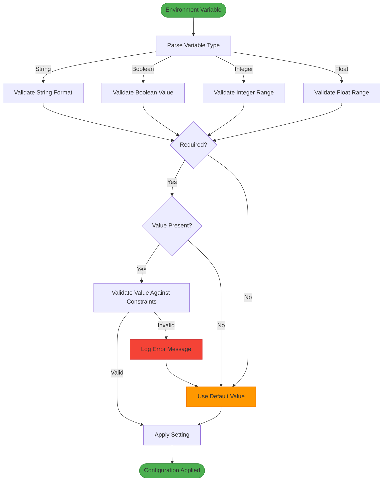
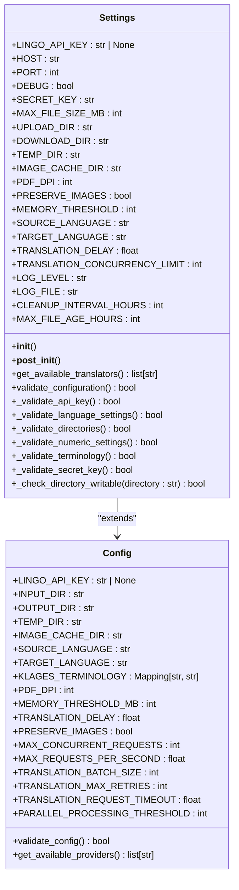
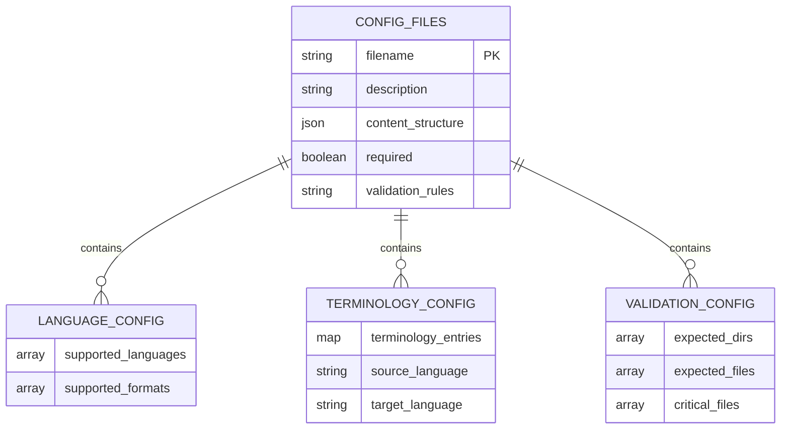
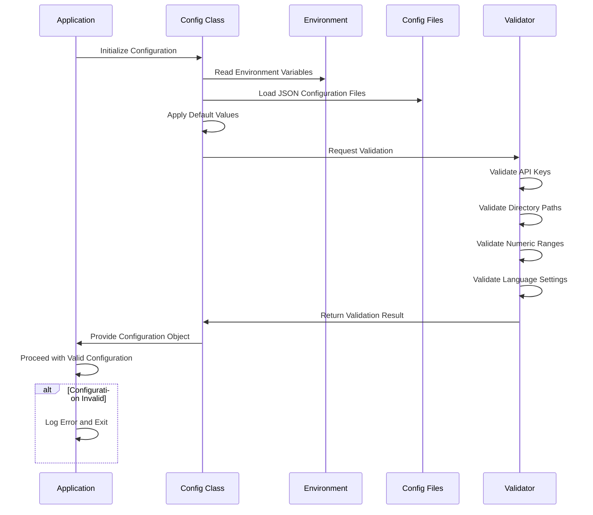
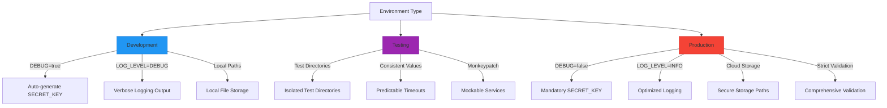
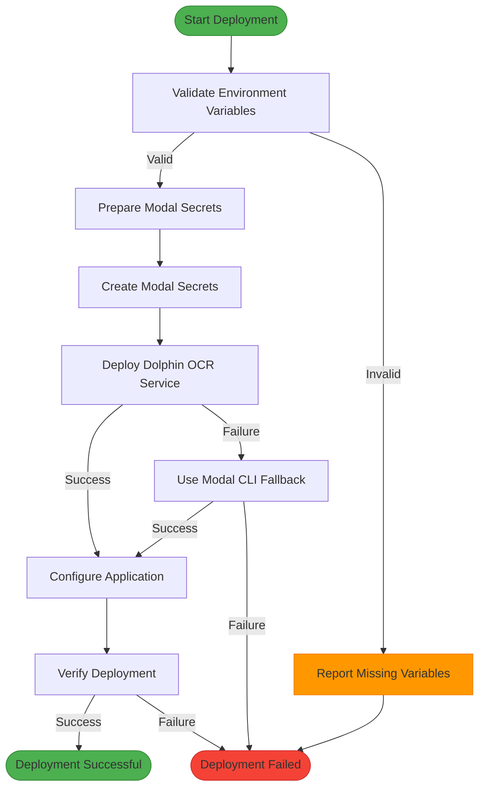
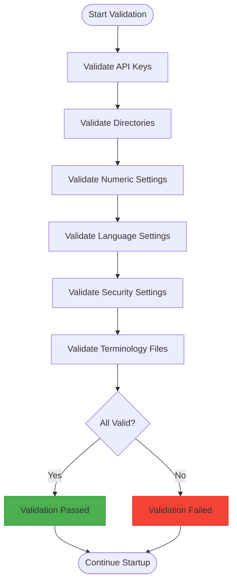

# Configuration Management

<cite>
**Referenced Files in This Document**  
- [settings.py](file://config/settings.py)
- [main.py](file://config/main.py)
- [languages.json](file://config/languages.json)
- [deploy_modal.py](file://scripts/deploy_modal.py)
- [project_validation_config.json](file://scripts/project_validation_config.json)
- [config.py](file://dolphin_ocr/config.py)
</cite>

## Table of Contents
1. [Configuration System Overview](#configuration-system-overview)
2. [Settings Validation and Environment Handling](#settings-validation-and-environment-handling)
3. [Application Configuration Structure](#application-configuration-structure)
4. [JSON Configuration Files](#json-configuration-files)
5. [Configuration Loading and Orchestration](#configuration-loading-and-orchestration)
6. [Environment-Specific Configurations](#environment-specific-configurations)
7. [Deployment Configuration](#deployment-configuration)
8. [Customization Examples](#customization-examples)
9. [Security Considerations](#security-considerations)
10. [Troubleshooting Configuration Issues](#troubleshooting-configuration-issues)
11. [Validation Process](#validation-process)

## Configuration System Overview

The configuration system in the PhenomenalLayout application provides a robust framework for managing application settings through environment variables, JSON configuration files, and programmatic defaults. The system is designed to support flexible deployment across different environments while ensuring validation and security.

The core configuration components include:
- **Pydantic-based settings validation** in `settings.py` for type safety and validation
- **Environment variable overrides** that allow runtime configuration without code changes
- **JSON configuration files** for structured data like language definitions and terminology
- **Hierarchical configuration loading** that combines defaults, environment variables, and file-based settings

The system follows the principle of "convention over configuration" with sensible defaults while allowing extensive customization for different deployment scenarios and use cases.

**Section sources**
- [settings.py](file://config/settings.py#L1-L549)
- [main.py](file://config/main.py#L1-L394)

## Settings Validation and Environment Handling

The configuration system implements comprehensive validation for all settings to ensure application stability and security. The validation process includes type checking, range validation, and business logic validation.

### Environment Variable Parsing

The system uses custom parsing functions to handle environment variables with proper error handling and default values:

```python
def _parse_bool_env(env_var: str, default: str = "false") -> bool:
    """Parse boolean environment variable with error handling."""
    try:
        value: str = os.getenv(env_var, default).lower().strip()
        if value in ("true", "1", "yes", "on"):
            return True
        elif value in ("false", "0", "no", "off"):
            return False
        else:
            logger.error(
                "Invalid boolean value '%s' for %s. Valid values: true/false, 1/0, yes/no, on/off",
                value,
                env_var,
            )
            raise ValueError(f"Invalid boolean value for {env_var}: {value}")
    except AttributeError as e:
        logger.exception("Error parsing boolean environment variable %s", env_var)
        raise ValueError(f"Error parsing {env_var}: {e}") from e
```

This approach ensures that invalid boolean values are properly handled and logged, preventing silent failures.

### Numeric Validation with Clamping

For numeric settings, the system implements range validation with optional clamping to prevent values outside acceptable ranges:

```python
def _parse_int_env(
    env_var: str,
    default: int,
    min_value: int | None = None,
    max_value: int | None = None,
) -> int:
    """Parse integer environment variable with error handling and value clamping."""
    try:
        value_str: str = os.getenv(env_var, str(default))
        result: int = int(value_str)

        # Apply clamping if specified
        if min_value is not None and result < min_value:
            logger.warning(
                "Environment variable %s value %d is below minimum %d, clamping to %d",
                env_var,
                result,
                min_value,
                min_value,
            )
            return min_value

        if max_value is not None and result > max_value:
            logger.warning(
                "Environment variable %s value %d is above maximum %d, clamping to %d",
                env_var,
                result,
                max_value,
                max_value,
            )
            return max_value

        return result

    except (ValueError, TypeError) as e:
        logger.error(
            "Invalid integer value '%s' for %s, using default %d: %s",
            os.getenv(env_var, str(default)),
            env_var,
            default,
            str(e),
        )
        return default
```

This implementation provides both validation and graceful degradation when values are outside acceptable ranges.



**Diagram sources**
- [settings.py](file://config/settings.py#L50-L250)

**Section sources**
- [settings.py](file://config/settings.py#L50-L250)

## Application Configuration Structure

The application configuration is organized into several key categories, each addressing specific aspects of the system's behavior and performance.

### API Keys and Authentication

The system requires API keys for external services, with validation to ensure security:

- **LINGO_API_KEY**: Required API key for the Lingo.dev translation service
- **SECRET_KEY**: Security key for session management and cryptographic operations
- **HF_TOKEN**: HuggingFace token for model downloads (optional)

The configuration validates that API keys are present and of sufficient length for production use, with specific validation rules for different environments.

### Service Endpoints

Service endpoints are configured with validation to ensure they are properly formatted:

- **DOLPHIN_MODAL_ENDPOINT**: URL for the Dolphin OCR service endpoint
- **Modal deployment endpoints**: Configuration for Modal platform deployment

The system validates that endpoints are valid HTTP/HTTPS URLs and properly formatted.

### Timeout Values

The configuration includes several timeout settings to prevent hanging operations:

- **TRANSLATION_REQUEST_TIMEOUT**: Timeout for translation requests (default: 30.0 seconds)
- **DOLPHIN_TIMEOUT_SECONDS**: Timeout for Dolphin OCR operations (default: 300 seconds)
- **PROCESSING_TIMEOUT**: General processing timeout (default: 300 seconds)

These values are validated to ensure they fall within reasonable ranges (1-300 seconds for most operations).

### Processing Thresholds

The system includes various processing thresholds to optimize performance:

- **MEMORY_THRESHOLD_MB**: Memory usage threshold in MB (default: 500MB)
- **MAX_CONCURRENT_REQUESTS**: Maximum concurrent requests (default: 10)
- **TRANSLATION_BATCH_SIZE**: Batch size for translation operations (default: 50)
- **PARALLEL_PROCESSING_THRESHOLD**: Minimum items for parallel processing (default: 5)

These thresholds are validated to ensure they fall within acceptable ranges for system stability.



**Diagram sources**
- [settings.py](file://config/settings.py#L150-L500)
- [main.py](file://config/main.py#L150-L350)

**Section sources**
- [settings.py](file://config/settings.py#L150-L500)
- [main.py](file://config/main.py#L150-L350)

## JSON Configuration Files

The system uses JSON configuration files to define structured data that would be cumbersome to manage through environment variables alone.

### Languages Configuration

The `languages.json` file defines the supported languages and document formats:

```json
{
  "supported_languages": [
    "English",
    "Spanish",
    "French",
    "German",
    "Italian",
    "Portuguese",
    "Russian",
    "Chinese",
    "Japanese",
    "Korean",
    "Arabic",
    "Hindi",
    "Dutch",
    "Swedish",
    "Norwegian"
  ],
  "supported_formats": ["PDF"]
}
```

This configuration is used to validate language selections in the user interface and ensure that only supported languages are offered to users.

### Terminology Configuration

The `klages_terminology.json` file contains specialized terminology mappings for accurate translation of philosophical and technical terms:

- Key-value pairs mapping source terms to their preferred translations
- Loaded into a `MappingProxyType` to ensure immutability
- Provides domain-specific translation accuracy for specialized content

The system validates the structure of this file on load and logs appropriate messages if the file is missing or malformed.

### Validation Configuration

The `project_validation_config.json` file defines the expected project structure for validation purposes:

```json
{
  "expected_dirs": [
    "services",
    "models",
    "scripts",
    "database",
    "config",
    "tests"
  ],
  "expected_files": [
    "app.py",
    "requirements.txt",
    "README.md",
    "pyproject.toml"
  ],
  "critical_files": [
    "services/neologism_detector.py",
    "services/philosophy_enhanced_translation_service.py",
    "models/neologism_models.py"
  ]
}
```

This configuration is used by validation scripts to verify the integrity of the project structure during deployment and testing.



**Diagram sources**
- [languages.json](file://config/languages.json#L1-L21)
- [klages_terminology.json](file://config/klages_terminology.json)
- [project_validation_config.json](file://scripts/project_validation_config.json#L1-L22)

**Section sources**
- [languages.json](file://config/languages.json#L1-L21)
- [klages_terminology.json](file://config/klages_terminology.json)
- [project_validation_config.json](file://scripts/project_validation_config.json#L1-L22)

## Configuration Loading and Orchestration

The main configuration orchestration is handled through the `main.py` file in the config directory, which serves as the central point for loading and validating all configuration settings.

### Configuration Class Structure

The `Config` class in `main.py` provides a centralized interface for accessing all configuration settings:

```python
class Config:
    """Central configuration class for Dolphin OCR Translate application."""

    # Translation API settings
    LINGO_API_KEY: str | None = os.getenv("LINGO_API_KEY")

    # File paths
    INPUT_DIR: str = os.getenv("INPUT_DIR", "input")
    OUTPUT_DIR: str = os.getenv("OUTPUT_DIR", "output")
    TEMP_DIR: str = os.getenv("TEMP_DIR", "temp")
    IMAGE_CACHE_DIR: str = os.getenv("IMAGE_CACHE_DIR", "temp/images")

    # Translation settings
    SOURCE_LANGUAGE: str = os.getenv("SOURCE_LANGUAGE", "DE")
    TARGET_LANGUAGE: str = os.getenv("TARGET_LANGUAGE", "EN")

    # PDF processing settings
    PDF_DPI: int = _parse_env("PDF_DPI", 300, int, 72)
    MEMORY_THRESHOLD_MB: int = _parse_env("MEMORY_THRESHOLD_MB", 500, int, 100)
    TRANSLATION_DELAY: float = _parse_env("TRANSLATION_DELAY", 0.1, float, 0.0)

    PRESERVE_IMAGES: bool = _parse_bool_env("PRESERVE_IMAGES", True)

    # Parallel processing settings
    MAX_CONCURRENT_REQUESTS: int = _parse_env("MAX_CONCURRENT_REQUESTS", 10, int, 1)
    MAX_REQUESTS_PER_SECOND: float = _parse_env("MAX_REQUESTS_PER_SECOND", 5.0, float, 0.1)
    TRANSLATION_BATCH_SIZE: int = _parse_env("TRANSLATION_BATCH_SIZE", 50, int, 1)
    TRANSLATION_MAX_RETRIES: int = _parse_env("TRANSLATION_MAX_RETRIES", 3, int, 0)
    TRANSLATION_REQUEST_TIMEOUT: float = _parse_env("TRANSLATION_REQUEST_TIMEOUT", 30.0, float, 1.0)
    PARALLEL_PROCESSING_THRESHOLD: int = _parse_env("PARALLEL_PROCESSING_THRESHOLD", 5, int, 1)
```

### Validation Process

The configuration validation process ensures that all required settings are present and valid:

```python
@classmethod
def validate_config(cls) -> bool:
    """Validate that required configuration is present and valid."""
    validation_passed: bool = True

    # Validate API key
    if not cls.LINGO_API_KEY:
        logger.error("LINGO_API_KEY is required but not configured")
        validation_passed = False
    elif len(cls.LINGO_API_KEY.strip()) < 10:
        logger.error("LINGO_API_KEY appears to be invalid (too short)")
        validation_passed = False

    # Validate directory paths
    required_dirs: dict[str, str] = {
        "INPUT_DIR": cls.INPUT_DIR,
        "OUTPUT_DIR": cls.OUTPUT_DIR,
        "TEMP_DIR": cls.TEMP_DIR,
        "IMAGE_CACHE_DIR": cls.IMAGE_CACHE_DIR,
    }

    for dir_name, dir_path in required_dirs.items():
        if not dir_path:
            logger.error(f"{dir_name} is required but not configured")
            validation_passed = False
        elif not isinstance(dir_path, str):
            logger.error(f"{dir_name} must be a string, got {type(dir_path)}")
            validation_passed = False
        else:
            try:
                Path(dir_path).mkdir(parents=True, exist_ok=True)
            except (OSError, PermissionError, ValueError) as e:
                logger.error(
                    "Cannot create or access %s '%s': %s",
                    dir_name,
                    dir_path,
                    e,
                )
                validation_passed = False

    # Validate numeric settings with ranges
    numeric_validations: dict[
        str, tuple[int | float, int | float, int | float, str]
    ] = {
        "PDF_DPI": (cls.PDF_DPI, 72, 600, "DPI must be between 72 and 600"),
        "MEMORY_THRESHOLD_MB": (
            cls.MEMORY_THRESHOLD_MB,
            100,
            10000,
            "Memory threshold must be between 100MB and 10GB",
        ),
        # ... additional validations
    }

    for setting_name, (
        value,
        min_val,
        max_val,
        error_msg,
    ) in numeric_validations.items():
        if not isinstance(value, (int, float)):
            logger.error(f"{setting_name} must be numeric, got {type(value)}")
            validation_passed = False
        elif not (min_val <= value <= max_val):
            logger.error(
                f"{setting_name} validation failed: {error_msg}. Got: {value}"
            )
            validation_passed = False

    return validation_passed
```



**Diagram sources**
- [main.py](file://config/main.py#L150-L350)
- [settings.py](file://config/settings.py#L300-L500)

**Section sources**
- [main.py](file://config/main.py#L150-L350)

## Environment-Specific Configurations

The system supports different configuration profiles for development, testing, and production environments through environment variable overrides and conditional logic.

### Development Environment

In development mode, the system provides more lenient configuration requirements:

- **Auto-generated SECRET_KEY**: When DEBUG=True and no SECRET_KEY is provided
- **Verbose logging**: Detailed logging output for debugging
- **Local file storage**: Configuration for local development directories
- **Reduced security requirements**: Less stringent validation for convenience

The DEBUG setting controls this behavior, with different validation rules applied based on its value.

### Testing Environment

The testing configuration is optimized for automated testing:

- **Isolated test directories**: Separate input/output directories for test runs
- **Predictable timeouts**: Consistent timeout values for reliable test execution
- **Mockable services**: Configuration points that can be overridden in tests
- **Validation bypass options**: Mechanisms to skip certain validations during testing

The system uses pytest fixtures and monkeypatch to modify configuration during testing, as shown in the test files.

### Production Environment

Production configuration enforces strict security and performance requirements:

- **Mandatory SECRET_KEY**: Required for security in non-DEBUG mode
- **Strong SECRET_KEY requirements**: Minimum 32 characters for production use
- **Optimized performance settings**: Configuration tuned for production workloads
- **Strict validation**: Comprehensive validation of all settings
- **Secure defaults**: Security-focused default values

The validation process is more rigorous in production, with additional checks for security and performance.



**Diagram sources**
- [settings.py](file://config/settings.py#L400-L500)
- [main.py](file://config/main.py#L300-L350)

**Section sources**
- [settings.py](file://config/settings.py#L400-L500)

## Deployment Configuration

The deployment configuration is managed through the `deploy_modal.py` script, which handles deployment to the Modal platform.

### Environment Variable Validation

The deployment script validates required environment variables before proceeding:

```python
def validate_environment_variables() -> tuple[list[str], list[str], list[str], list[str]]:
    """Validate environment variables and return validation results."""
    required_vars: list[str] = [
        "MODAL_TOKEN_ID",
        "MODAL_TOKEN_SECRET",
        "LINGO_API_KEY",
    ]
    optional_vars: list[str] = [v for v in OPTIONAL_ENV_VARS if v not in required_vars]

    missing_required: list[str] = []
    empty_required: list[str] = []
    missing_optional: list[str] = []
    empty_optional: list[str] = []

    # Validate required variables
    for var in required_vars:
        value: str | None = os.getenv(var)
        if value is None:
            missing_required.append(var)
        elif not value.strip():
            empty_required.append(var)

    # Validate optional variables
    for var in optional_vars:
        value = os.getenv(var)
        if value is None:
            missing_optional.append(var)
        elif not value.strip():
            empty_optional.append(var)

    return missing_required, empty_required, missing_optional, empty_optional
```

### Modal Secret Management

The script prepares Modal secrets for secure configuration:

```python
def prepare_modal_secrets() -> str:
    """Prepare Modal secret creation commands for the application."""
    print("🔐 Creating Modal secrets...")

    # Create translation API secret
    translation_secret_data: dict[str, str | None] = {
        "LINGO_API_KEY": os.getenv("LINGO_API_KEY"),
    }

    # Add HuggingFace token if available
    if os.getenv("HF_TOKEN"):
        translation_secret_data["HF_TOKEN"] = os.getenv("HF_TOKEN")

    # Create the secret using Modal CLI
    print("📝 Translation API secret data prepared")
    print("   Run this command to create the secret:")
    secret_cmd: str = build_secret_command(translation_secret_data)
    print(f"   {secret_cmd}")
    return secret_cmd
```

### Deployment Process

The deployment process follows these steps:
1. Validate all required environment variables
2. Prepare Modal secrets for secure configuration
3. Deploy the Dolphin OCR service via Modal SDK or CLI
4. Configure environment variables and secrets
5. Verify deployment success

The script provides detailed feedback at each step, including success indicators and error messages.



**Diagram sources**
- [deploy_modal.py](file://scripts/deploy_modal.py#L50-L200)

**Section sources**
- [deploy_modal.py](file://scripts/deploy_modal.py#L50-L200)

## Customization Examples

The configuration system supports various customization scenarios for different use cases.

### High-Volume Translation Setup

For high-volume translation workloads, adjust these settings:

```bash
# Increase concurrency for higher throughput
MAX_CONCURRENT_REQUESTS=50
MAX_REQUESTS_PER_SECOND=20.0
TRANSLATION_BATCH_SIZE=100

# Adjust memory and processing settings
MEMORY_THRESHOLD_MB=2000
PROCESSING_TIMEOUT=600

# Optimize for speed
TRANSLATION_DELAY=0.01
PARALLEL_PROCESSING_THRESHOLD=2
```

### Quality-Focused Configuration

For maximum translation quality, use these settings:

```bash
# Prioritize quality over speed
TRANSLATION_DELAY=0.5
TRANSLATION_MAX_RETRIES=5
TRANSLATION_REQUEST_TIMEOUT=60.0

# Higher quality thresholds
MIN_OCR_CONFIDENCE=0.9
MIN_TRANSLATION_CONFIDENCE=0.85
MIN_LAYOUT_PRESERVATION_SCORE=0.85

# Conservative concurrency
MAX_CONCURRENT_REQUESTS=5
MAX_REQUESTS_PER_SECOND=2.0
```

### Resource-Constrained Environment

For systems with limited resources:

```bash
# Reduce memory usage
MEMORY_THRESHOLD_MB=250
MEMORY_LIMIT_MB=1024

# Conservative processing
MAX_CONCURRENT_REQUESTS=3
PARALLEL_PROCESSING_THRESHOLD=10

# Lower resolution for faster processing
PDF_DPI=150

# Shorter timeouts
PROCESSING_TIMEOUT=120
TRANSLATION_REQUEST_TIMEOUT=15.0
```

### Specialized Language Configuration

For specialized language pairs:

```bash
# German to English (source of the application)
SOURCE_LANGUAGE=DE
TARGET_LANGUAGE=EN

# Or other language pairs
SOURCE_LANGUAGE=FR
TARGET_LANGUAGE=ES

# With specialized terminology
KLAGES_TERMINOLOGY_FILE=custom_terminology.json
```

These examples demonstrate how the configuration system can be tailored to specific requirements and constraints.

**Section sources**
- [settings.py](file://config/settings.py)
- [main.py](file://config/main.py)
- [config.py](file://dolphin_ocr/config.py)

## Security Considerations

The configuration system implements several security measures to protect sensitive information and prevent common vulnerabilities.

### Sensitive Credential Handling

The system follows best practices for handling sensitive credentials:

- **Environment variables for secrets**: API keys and tokens are loaded from environment variables rather than hardcoded values
- **SECRET_KEY validation**: In production mode (DEBUG=False), a strong SECRET_KEY is required
- **Minimum length requirements**: SECRET_KEY must be at least 32 characters in production
- **Secure defaults**: Auto-generated SECRET_KEY in development mode only

### Configuration Validation

Comprehensive validation prevents configuration-related security issues:

- **Directory validation**: Ensures writable directories exist and are accessible
- **Input validation**: Validates all configuration values before use
- **Range checking**: Prevents extreme values that could cause denial of service
- **Type checking**: Ensures configuration values are of the expected type

### Secure Deployment Practices

The deployment configuration emphasizes security:

- **Modal secrets**: Sensitive values are stored as Modal secrets rather than environment variables
- **Token protection**: MODAL_TOKEN_ID and MODAL_TOKEN_SECRET are required and validated
- **Environment isolation**: Development, testing, and production environments have different security requirements

### Error Handling

The system implements secure error handling:

- **Specific error messages**: Provides clear error messages without exposing sensitive information
- **Graceful degradation**: Falls back to safe defaults when configuration is invalid
- **Comprehensive logging**: Logs configuration issues for troubleshooting without exposing secrets

These security considerations ensure that the application remains secure across different deployment scenarios.

**Section sources**
- [settings.py](file://config/settings.py#L400-L500)
- [deploy_modal.py](file://scripts/deploy_modal.py#L1-L50)

## Troubleshooting Configuration Issues

This section provides guidance for diagnosing and resolving common configuration-related issues.

### Missing Required Settings

When required settings are missing, the system provides specific error messages:

```log
ERROR: Configuration validation failed
ERROR: LINGO_API_KEY is required but not configured
ERROR: SECRET_KEY is required but not configured when DEBUG=False
```

To resolve:
1. Ensure all required environment variables are set
2. Check the `.env` file or deployment environment
3. Verify the variable names match exactly (case-sensitive)
4. Restart the application after making changes

### Invalid Values

When configuration values are invalid, the system logs specific validation errors:

```log
ERROR: Invalid PORT: 70000. Must be between 1-65535
ERROR: Invalid PDF_DPI: 50. Recommended range: 72-600
ERROR: Invalid boolean value 'yesplease' for DEBUG. Valid values: true/false, 1/0, yes/no, on/off
```

To resolve:
1. Check the value against the expected range or format
2. Correct the environment variable value
3. Refer to the documentation for valid values
4. Restart the application

### Directory Access Issues

When directory permissions prevent operation:

```log
ERROR: Directory not writable: 'uploads'
ERROR: Permission denied when creating directory '/app/uploads': [Errno 13] Permission denied
```

To resolve:
1. Ensure the application has write permissions to the directory
2. Check directory ownership and permissions
3. Verify the directory path is correct
4. Create the directory manually if needed
5. Ensure sufficient disk space is available

### API Key Issues

Common API key problems and solutions:

```log
ERROR: LINGO_API_KEY is required but not configured
ERROR: LINGO_API_KEY appears to be invalid (too short)
```

To resolve:
1. Obtain a valid LINGO_API_KEY from the service provider
2. Set the environment variable with the correct value
3. Ensure the key is at least 10 characters long
4. Restart the application

### Debugging Tips

General troubleshooting approach:
1. Check the application logs for specific error messages
2. Verify all required environment variables are set
3. Test with minimal configuration first, then add complexity
4. Use the validation functions to check configuration
5. Consult the example configurations for correct syntax

Following these guidelines will help resolve most configuration issues efficiently.

**Section sources**
- [settings.py](file://config/settings.py#L300-L500)
- [main.py](file://config/main.py#L300-L350)
- [deploy_modal.py](file://scripts/deploy_modal.py#L50-L100)

## Validation Process

The configuration validation process ensures that all settings are correct before the application starts processing requests.

### Configuration Validation Flow

The validation process follows these steps:

1. **API Key Validation**: Check that required API keys are present and valid
2. **Directory Validation**: Verify that all required directories exist and are writable
3. **Numeric Validation**: Ensure all numeric settings are within acceptable ranges
4. **Language Validation**: Confirm that language codes are valid and different
5. **Security Validation**: Verify that security settings meet production requirements

### Validation Methods

The system implements several validation methods:

```python
def validate_configuration(self) -> bool:
    """Validate that required configuration is present and all settings are valid."""
    validation_results: list[bool] = [
        self._validate_api_key(),
        self._validate_secret_key(),
        self._validate_language_settings(),
        self._validate_directories(),
        self._validate_numeric_settings(),
        self._validate_terminology(),
    ]

    overall_valid: bool = all(validation_results)

    if overall_valid:
        logger.info("Configuration validation passed")
    else:
        logger.error("Configuration validation failed")

    return overall_valid
```

Each validation method focuses on a specific aspect of the configuration:

- `_validate_api_key()`: Ensures API keys are present
- `_validate_secret_key()`: Validates security keys for production use
- `_validate_language_settings()`: Checks language code validity
- `_validate_directories()`: Verifies directory accessibility
- `_validate_numeric_settings()`: Confirms numeric values are in range
- `_validate_terminology()`: Ensures terminology files are properly loaded

### Project Structure Validation

In addition to runtime configuration, the system includes project structure validation:

```python
def validate_project_structure():
    """Validate that the project structure matches expected configuration."""
    config = load_json("scripts/project_validation_config.json")

    # Check required directories
    for directory in config["expected_dirs"]:
        if not os.path.exists(directory):
            logger.error(f"Required directory missing: {directory}")

    # Check required files
    for file in config["expected_files"]:
        if not os.path.exists(file):
            logger.error(f"Required file missing: {file}")

    # Check critical files
    for file in config["critical_files"]:
        if not os.path.exists(file):
            logger.critical(f"Critical file missing: {file}")
            return False

    return True
```

This comprehensive validation process ensures that both the runtime configuration and project structure are correct before deployment.



**Diagram sources**
- [settings.py](file://config/settings.py#L300-L500)
- [project_validation_config.json](file://scripts/project_validation_config.json#L1-L22)

**Section sources**
- [settings.py](file://config/settings.py#L300-L500)
- [project_validation_config.json](file://scripts/project_validation_config.json#L1-L22)
