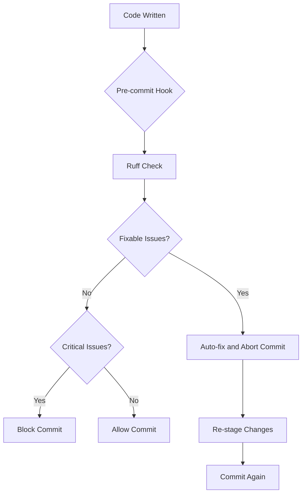
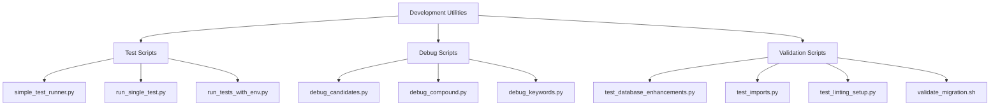

# Contributing Guide

<cite>
**Referenced Files in This Document**  
- [CONTRIBUTING.md](file://CONTRIBUTING.md)
- [pyproject.toml](file://pyproject.toml)
- [requirements-dev.txt](file://requirements-dev.txt)
- [scripts/README.md](file://scripts/README.md)
- [pytest.ini](file://pytest.ini)
- [conftest.py](file://conftest.py)
</cite>

## Table of Contents
1. [Development Environment Setup](#development-environment-setup)
2. [Contribution Process](#contribution-process)
3. [Code Style and Linting Guidelines](#code-style-and-linting-guidelines)
4. [Testing Requirements](#testing-requirements)
5. [Documentation and Examples](#documentation-and-examples)
6. [Branching Strategy and Versioning](#branching-strategy-and-versioning)
7. [Bug Reporting and Feature Requests](#bug-reporting-and-feature-requests)
8. [Code Review and Maintainability Standards](#code-review-and-maintainability-standards)
9. [License and Contributor Agreements](#license-and-contributor-agreements)
10. [Development Utilities](#development-utilities)

## Development Environment Setup

To contribute to PhenomenalLayout, you'll need to set up a proper development environment with all necessary tools and dependencies. The project requires Python 3.11 or 3.12 to match the CI environment.

First, create a virtual environment and install the required dependencies:

```bash
python3 -m venv .venv
source .venv/bin/activate
python -m pip install -U pip
python -m pip install -r requirements-dev.txt
```

The development environment includes essential tools for testing, linting, and type checking. After setting up the virtual environment, install the pre-commit hooks to ensure code quality:

```bash
pre-commit install
pre-commit autoupdate
```

These hooks will automatically handle formatting and catch critical issues before commits. The pre-commit configuration includes auto-fixing for trailing whitespace, line endings (LF), Python code formatting with Black, end-of-file newlines, and many style violations with Ruff.

**Section sources**
- [CONTRIBUTING.md](file://CONTRIBUTING.md#L18-L45)
- [requirements-dev.txt](file://requirements-dev.txt#L1-L18)

## Contribution Process

The contribution process for PhenomenalLayout follows standard open-source practices with a focus on maintaining code quality and project stability. Contributors should follow these steps:

1. Fork the repository on GitHub
2. Create a feature branch from the main branch
3. Make your changes following the project's coding standards
4. Ensure all tests pass and code is properly formatted
5. Commit your changes with clear, descriptive messages
6. Push your branch to your fork
7. Submit a pull request to the main repository

When making changes, keep edits small and focused with a clear rationale in the commit message. Before opening a pull request, ensure that `ruff`, `mypy`, and all tests pass locally. The project uses pre-commit hooks to automatically format code and catch common issues, which helps maintain consistency across contributions.

**Section sources**
- [CONTRIBUTING.md](file://CONTRIBUTING.md#L165-L170)

## Code Style and Linting Guidelines

PhenomenalLayout enforces strict code style guidelines through automated tools configured in `pyproject.toml`. The project uses Ruff and mypy for linting and type checking, with rules shared between local development and CI environments.

The code style is configured to match Black formatting standards with an 88-character line length and Python 3.12 as the target version. Ruff is configured to enable a comprehensive set of rules including pycodestyle errors and warnings (E, W), pyflakes (F), isort (I), pep8-naming (N), pydocstyle (D), flake8-bugbear (B), and several other quality checks.



**Diagram sources**
- [pyproject.toml](file://pyproject.toml#L45-L100)
- [CONTRIBUTING.md](file://CONTRIBUTING.md#L50-L85)

**Section sources**
- [pyproject.toml](file://pyproject.toml#L45-L100)
- [CONTRIBUTING.md](file://CONTRIBUTING.md#L50-L85)

## Testing Requirements

The testing framework for PhenomenalLayout is built on pytest with comprehensive coverage requirements. The project maintains a high test coverage threshold of 85% or higher, enforced by the coverage configuration in `pytest.ini`.

To run the test suite, use the following command with the required environment variables:

```bash
export GRADIO_SCHEMA_PATCH=true GRADIO_SHARE=true CI=true
pytest -q
```

The test suite includes various markers to categorize tests by their characteristics:
- `slow`: Marks tests as slower-running integration tests
- `load`: Marks tests as load/soak tests

You can exclude these tests during development with: `pytest -q -m "not slow and not load"`.

The project also includes a focused testing mode that disables coverage gates by setting `FOCUSED=1`, which is useful for debugging specific issues without the overhead of full coverage analysis.

**Section sources**
- [pytest.ini](file://pytest.ini#L1-L12)
- [CONTRIBUTING.md](file://CONTRIBUTING.md#L30-L35)
- [conftest.py](file://conftest.py#L1-L27)

## Documentation and Examples

Contributors are expected to maintain comprehensive documentation for new features and significant changes. The project includes several example files in the `examples/` directory that demonstrate various use cases and functionality.

When adding new features, contributors should:
1. Update relevant documentation in docstrings using Google-style formatting
2. Add or update examples in the `examples/` directory when appropriate
3. Ensure API documentation is complete and accurate
4. Include usage examples for complex functionality

The project follows Google-style docstring conventions as specified in the pyproject.toml configuration. Documentation should be clear, concise, and provide sufficient context for users to understand and utilize the functionality.

**Section sources**
- [pyproject.toml](file://pyproject.toml#L95-L97)
- [examples/README.md](file://examples/README.md)

## Branching Strategy and Versioning

PhenomenalLayout follows a standard Git branching model with a main branch that represents the latest stable code. Feature development occurs on separate branches that are created from main and merged back via pull requests.

The project uses semantic versioning (MAJOR.MINOR.PATCH) for releases:
- MAJOR version increments for incompatible API changes
- MINOR version increments for backward-compatible functionality additions
- PATCH version increments for backward-compatible bug fixes

Version information is maintained in `pyproject.toml` under the `[project]` section. The project is currently in beta development status, indicating that the API may still evolve before a stable 1.0 release.

**Section sources**
- [pyproject.toml](file://pyproject.toml#L4-L10)

## Bug Reporting and Feature Requests

For bug reporting and feature requests, contributors should use the GitHub issue tracker. When reporting bugs, please include:
- A clear description of the issue
- Steps to reproduce the problem
- Expected behavior vs. actual behavior
- Environment information (Python version, OS, etc.)
- Any relevant error messages or stack traces

For feature requests, provide a detailed explanation of the proposed functionality, its use cases, and any potential implementation approaches. The development team will review all issues and prioritize them based on impact, complexity, and alignment with the project roadmap.

**Section sources**
- [CONTRIBUTING.md](file://CONTRIBUTING.md)

## Code Review and Maintainability Standards

Code reviews are an essential part of the contribution process, ensuring code quality, maintainability, and alignment with project goals. Pull requests will be reviewed for:

1. **Code Quality**: Adherence to style guidelines, proper formatting, and clean code practices
2. **Functionality**: Correct implementation of the intended feature or fix
3. **Testing**: Adequate test coverage and passing tests
4. **Documentation**: Clear documentation and appropriate comments
5. **Performance**: Efficient algorithms and consideration of performance implications
6. **Security**: Absence of security vulnerabilities

Maintainability standards include writing modular, well-structured code with clear separation of concerns. Functions and methods should have single responsibilities and be kept at a reasonable length. Complex logic should be broken down into smaller, testable components.

**Section sources**
- [CONTRIBUTING.md](file://CONTRIBUTING.md)

## License and Contributor Agreements

PhenomenalLayout is released under the MIT License, as specified in `pyproject.toml`. This permissive open-source license allows for free use, modification, and distribution of the software with minimal restrictions.

The project does not currently require a formal Contributor License Agreement (CLA). By contributing to the project, contributors agree to license their contributions under the same MIT License terms as the rest of the codebase.

The license information is maintained in `pyproject.toml` and applies to all code in the repository unless otherwise specified in individual files.

**Section sources**
- [pyproject.toml](file://pyproject.toml#L7-L8)

## Development Utilities

The project includes a comprehensive set of development utilities in the `scripts/` directory to assist with testing, debugging, and maintenance tasks.

Key development scripts include:
- `simple_test_runner.py`: Lightweight test runner for basic functionality tests
- `run_single_test.py`: Validates core module imports and basic functionality
- `run_tests_with_env.py`: Test runner that sets up environment variables
- `debug_candidates.py`: Debug script for neologism candidate detection
- `debug_compound.py`: Comprehensive debug script for compound word analysis
- `test_database_enhancements.py`: Tests database functionality and enhancements
- `test_imports.py`: Verifies all project imports work correctly
- `test_linting_setup.py`: Tests the linting configuration with intentional issues
- `validate_migration.sh`: Shell script to validate file migrations and structure changes

These utilities help maintain code quality, simplify debugging, and ensure the project remains stable during development.



**Diagram sources**
- [scripts/README.md](file://scripts/README.md#L1-L252)

**Section sources**
- [scripts/README.md](file://scripts/README.md#L1-L252)
