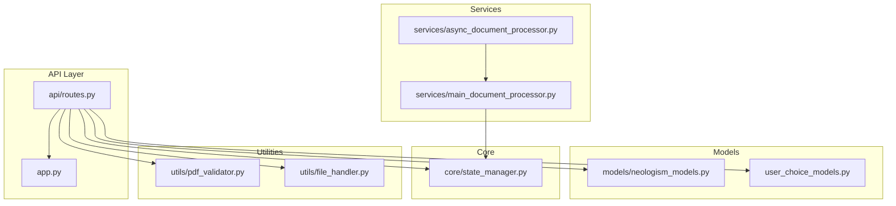
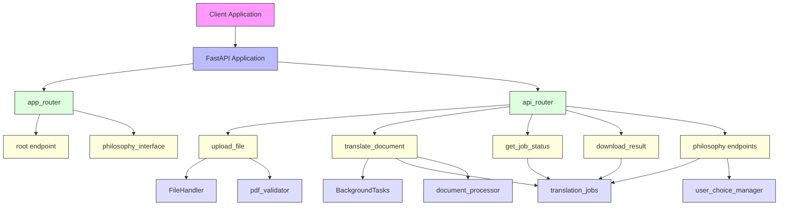
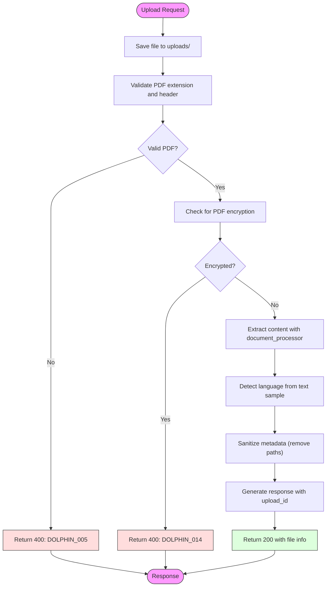
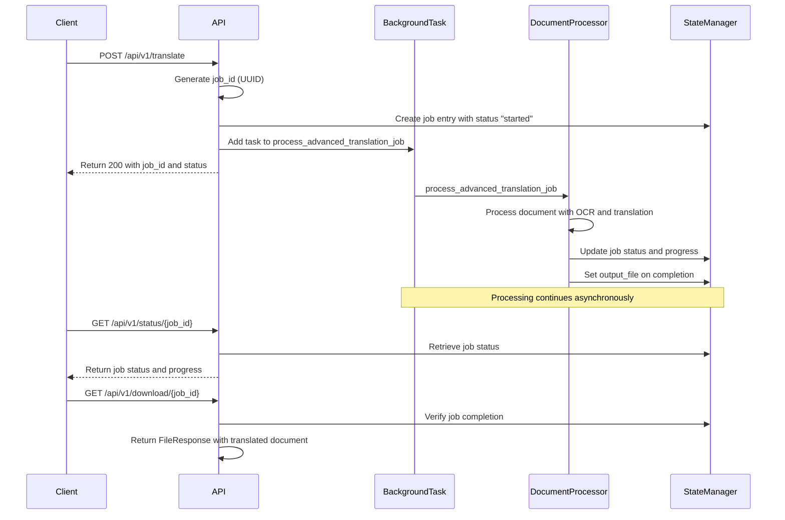
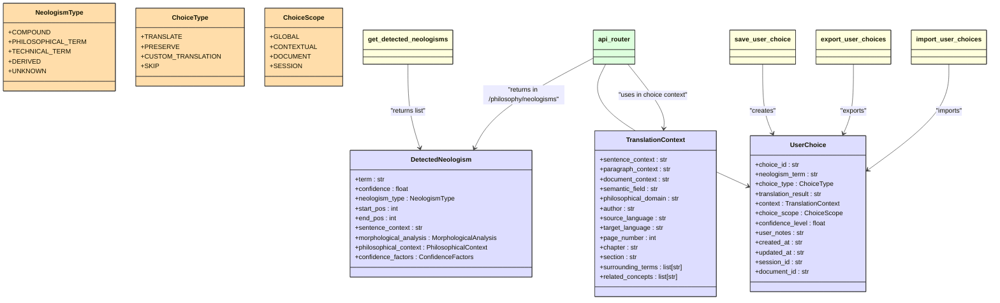
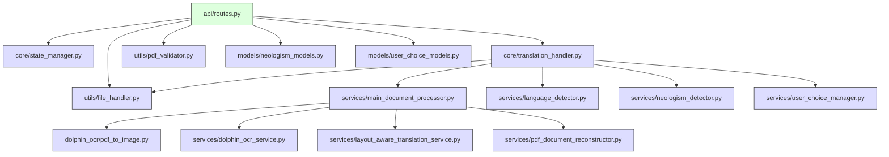

# API Routing Mechanism

<cite>
**Referenced Files in This Document**  
- [routes.py](file://api/routes.py)
- [app.py](file://app.py)
- [neologism_models.py](file://models/neologism_models.py)
- [user_choice_models.py](file://models/user_choice_models.py)
- [async_document_processor.py](file://services/async_document_processor.py)
- [main_document_processor.py](file://services/main_document_processor.py)
- [state_manager.py](file://core/state_manager.py)
- [pdf_validator.py](file://utils/pdf_validator.py)
- [file_handler.py](file://utils/file_handler.py)
- [test_api_routes.py](file://tests/test_api_routes.py)
</cite>

## Table of Contents
1. [Introduction](#introduction)
2. [Project Structure](#project-structure)
3. [Core Components](#core-components)
4. [Architecture Overview](#architecture-overview)
5. [Detailed Component Analysis](#detailed-component-analysis)
6. [Dependency Analysis](#dependency-analysis)
7. [Performance Considerations](#performance-considerations)
8. [Troubleshooting Guide](#troubleshooting-guide)
9. [Conclusion](#conclusion)

## Introduction
The PhenomenalLayout API provides a comprehensive routing mechanism for document translation services, built on FastAPI. The system enables users to upload documents, initiate translation jobs, monitor processing status, and retrieve translated results through a well-structured RESTful interface. The architecture follows a modular design with clear separation of concerns, where route handlers delegate business logic to specialized service classes rather than containing implementation details directly. The API supports advanced features including philosophy-enhanced neologism detection, user choice management for translations, and layout-preserving document processing. This documentation details the routing architecture, endpoint functionality, data validation mechanisms, error handling patterns, and the asynchronous job processing workflow that enables efficient handling of long-running document translation tasks.

## Project Structure
The API routing system is organized in a modular structure with clear separation between routing definitions, business logic, and supporting utilities. The main routing configuration is located in the `api/routes.py` file, which defines all RESTful endpoints using FastAPI's router system. The application entry point in `app.py` mounts these routers to the main FastAPI application with appropriate prefixes. The project follows a domain-driven organization with dedicated directories for models, services, core functionality, and utilities. The `models` directory contains Pydantic-compatible data classes for neologism detection and user choice management. The `services` directory houses the business logic for document processing, OCR, translation, and PDF reconstruction. Core state management is implemented in the `core` directory, while file handling and validation utilities are located in the `utils` directory. This structure enables maintainable, testable code with clear boundaries between components.

**Diagram sources**
- [routes.py](file://api/routes.py)
- [app.py](file://app.py)
- [neologism_models.py](file://models/neologism_models.py)
- [user_choice_models.py](file://models/user_choice_models.py)
- [async_document_processor.py](file://services/async_document_processor.py)
- [main_document_processor.py](file://services/main_document_processor.py)
- [state_manager.py](file://core/state_manager.py)
- [pdf_validator.py](file://utils/pdf_validator.py)
- [file_handler.py](file://utils/file_handler.py)

**Section sources**
- [routes.py](file://api/routes.py)
- [app.py](file://app.py)

## Core Components
The API routing architecture in PhenomenalLayout is built around several core components that work together to provide document translation services. The system uses FastAPI's router system to modularize endpoint definitions, with `api_router` handling API endpoints under the `/api/v1` prefix and `app_router` managing root and application-level routes. Route handlers delegate business logic to service classes, maintaining a clean separation between HTTP interface concerns and domain logic. The architecture incorporates comprehensive error handling through custom HTTPException subclasses and structured error responses with standardized error codes. Parameter validation is performed using Pydantic models and FastAPI's built-in validation capabilities. The system implements an asynchronous job pattern for long-running document processing tasks, allowing immediate response to clients while processing continues in the background. State management is handled through a thread-safe state manager that tracks translation jobs and user choices across sessions.

**Section sources**
- [routes.py](file://api/routes.py#L1-L50)
- [state_manager.py](file://core/state_manager.py#L1-L50)
- [file_handler.py](file://utils/file_handler.py#L1-L50)

## Architecture Overview
The API routing architecture follows a layered design pattern with clear separation between the presentation layer (routes), business logic layer (services), and data access/state management layer. The system uses FastAPI's dependency injection and middleware capabilities to apply consistent cross-cutting concerns such as CORS, logging, and error handling across all endpoints. The routing system is organized into two main routers: `app_router` for application-level routes like the root endpoint and philosophy interface, and `api_router` for the RESTful API endpoints that handle document processing workflows. This modular approach allows for versioning of the API (via the `/api/v1` prefix) while keeping application-level routes stable. The architecture implements a stateless HTTP interface that interacts with a stateful backend through job identifiers, enabling horizontal scaling of the API layer while maintaining processing state in memory or persistent storage. The system uses background tasks for long-running operations, preventing request timeouts and improving responsiveness.

**Diagram sources**
- [routes.py](file://api/routes.py#L1-L50)
- [app.py](file://app.py#L1-L50)
- [state_manager.py](file://core/state_manager.py#L1-L50)
- [file_handler.py](file://utils/file_handler.py#L1-L50)
- [pdf_validator.py](file://utils/pdf_validator.py#L1-L50)

## Detailed Component Analysis

### Document Upload Endpoint
The document upload endpoint provides comprehensive processing of uploaded PDF files with multiple validation steps and metadata extraction. The endpoint accepts multipart form data containing the file to be uploaded and processes it through a series of validation and extraction steps before returning information about the processed document. The implementation follows a defensive programming approach with thorough input validation and error handling.

**Diagram sources**
- [routes.py](file://api/routes.py#L150-L250)
- [file_handler.py](file://utils/file_handler.py#L1-L50)
- [pdf_validator.py](file://utils/pdf_validator.py#L1-L50)

**Section sources**
- [routes.py](file://api/routes.py#L150-L250)
- [file_handler.py](file://utils/file_handler.py#L1-L100)
- [pdf_validator.py](file://utils/pdf_validator.py#L1-L100)

### Translation Job Processing
The translation job processing system implements an asynchronous pattern that allows the API to accept translation requests and return immediately while processing occurs in the background. This approach prevents request timeouts for long-running document processing tasks and improves system responsiveness. The architecture uses FastAPI's BackgroundTasks to execute the translation workflow without blocking the main request thread.

**Diagram sources**
- [routes.py](file://api/routes.py#L250-L350)
- [state_manager.py](file://core/state_manager.py#L1-L50)
- [async_document_processor.py](file://services/async_document_processor.py#L1-L50)

**Section sources**
- [routes.py](file://api/routes.py#L250-L350)
- [state_manager.py](file://core/state_manager.py#L50-L100)
- [async_document_processor.py](file://services/async_document_processor.py#L1-L100)

### Philosophy-Enhanced Neologism Management
The philosophy-enhanced neologism management system provides specialized endpoints for handling philosophical terminology and user choices during translation. This component extends the basic translation functionality with features for preserving or customizing the translation of specialized philosophical terms. The system maintains state for detected neologisms and user choices, allowing for consistent handling of terminology across a translation session.

**Diagram sources**
- [routes.py](file://api/routes.py#L50-L150)
- [neologism_models.py](file://models/neologism_models.py#L1-L50)
- [user_choice_models.py](file://models/user_choice_models.py#L1-L50)

**Section sources**
- [routes.py](file://api/routes.py#L50-L150)
- [neologism_models.py](file://models/neologism_models.py#L1-L200)
- [user_choice_models.py](file://models/user_choice_models.py#L1-L200)

## Dependency Analysis
The API routing system has a well-defined dependency structure that follows the dependency inversion principle, with higher-level modules depending on abstractions rather than concrete implementations. The routes module depends on several core components including the state manager for job tracking, the document processor for content extraction, the file handler for file operations, and the PDF validator for format checking. These dependencies are imported directly at the module level, making them available to all route handlers. The system uses a layered architecture where the API layer (routes) depends on the service layer (document processing, OCR, translation), which in turn depends on lower-level utilities and external libraries. The dependency graph shows a clear flow of control from the API endpoints through the service layer to the data access and external service integration layers. This structure enables loose coupling between components, making the system more maintainable and testable.

**Diagram sources**
- [routes.py](file://api/routes.py#L1-L50)
- [state_manager.py](file://core/state_manager.py#L1-L50)
- [translation_handler.py](file://core/translation_handler.py#L1-L50)
- [pdf_validator.py](file://utils/pdf_validator.py#L1-L50)
- [file_handler.py](file://utils/file_handler.py#L1-L50)
- [neologism_models.py](file://models/neologism_models.py#L1-L50)
- [user_choice_models.py](file://models/user_choice_models.py#L1-L50)

**Section sources**
- [routes.py](file://api/routes.py#L1-L50)
- [state_manager.py](file://core/state_manager.py#L1-L50)
- [translation_handler.py](file://core/translation_handler.py#L1-L50)

## Performance Considerations
The API routing architecture incorporates several performance optimizations to handle document processing efficiently. The system uses asynchronous processing for long-running tasks, allowing the API to respond quickly to client requests while processing continues in the background. For CPU-intensive operations like PDF to image conversion, the system leverages process pools to avoid blocking the event loop. The document processing pipeline implements batching for translation operations, reducing the number of API calls to external translation services and improving throughput. The architecture includes rate limiting for OCR services through a token bucket algorithm, preventing overloading of external dependencies. File operations are optimized by using streaming for large file uploads and downloads, minimizing memory usage. The system implements caching at multiple levels, including PDF structure validation results and language detection outcomes, to avoid redundant processing. State management is designed to be thread-safe with minimal locking overhead, enabling high concurrency. The API also includes automatic cleanup of old translation jobs and temporary files to prevent resource exhaustion over time.

**Section sources**
- [async_document_processor.py](file://services/async_document_processor.py#L1-L50)
- [main_document_processor.py](file://services/main_document_processor.py#L1-L50)
- [state_manager.py](file://core/state_manager.py#L1-L50)
- [file_handler.py](file://utils/file_handler.py#L1-L50)

## Troubleshooting Guide
The API routing system includes comprehensive error handling and diagnostic capabilities to assist with troubleshooting. All endpoints follow a consistent error response pattern with structured JSON payloads that include error codes, descriptive messages, timestamps, and contextual information. The system uses standardized error codes (e.g., DOLPHIN_005 for invalid format, DOLPHIN_014 for encrypted PDFs) that can be used for programmatic error handling and monitoring. The logging system captures detailed information about request processing, including validation failures, processing errors, and performance metrics. The architecture includes health check endpoints and monitoring capabilities to detect and diagnose issues. For file upload problems, the system performs multiple validation steps (extension, header, encryption, structure) and returns specific error messages for each failure mode. The asynchronous job processing system provides detailed status information that can be used to track the progress of long-running operations and identify bottlenecks. The test suite includes comprehensive API tests that validate error handling behavior for various failure scenarios, providing a reference for expected error responses.

**Section sources**
- [routes.py](file://api/routes.py#L1-L50)
- [pdf_validator.py](file://utils/pdf_validator.py#L1-L50)
- [test_api_routes.py](file://tests/test_api_routes.py#L1-L50)

## Conclusion
The API routing mechanism in PhenomenalLayout provides a robust, scalable foundation for document translation services with advanced features for layout preservation and philosophical terminology handling. The architecture follows best practices for RESTful API design with clear separation of concerns, modular organization, and consistent error handling. The system effectively handles the challenges of processing large documents through asynchronous job processing and background task execution. The routing system is well-integrated with the underlying document processing pipeline, providing a clean interface between the HTTP layer and the complex document analysis and translation logic. Security considerations are addressed through comprehensive input validation, file type restrictions, and protection against common vulnerabilities like path traversal. The API design supports extensibility, as evidenced by the philosophy-enhanced neologism management features that extend the core translation functionality. Overall, the routing architecture demonstrates a thoughtful balance between functionality, performance, and maintainability, providing a solid foundation for the document translation platform.
