# Core Architecture

<cite>
**Referenced Files in This Document**  
- [app.py](file://app.py)
- [api/routes.py](file://api/routes.py)
- [core/state_manager.py](file://core/state_manager.py)
- [core/translation_handler.py](file://core/translation_handler.py)
- [services/main_document_processor.py](file://services/main_document_processor.py)
- [services/dolphin_ocr_service.py](file://services/dolphin_ocr_service.py)
- [services/layout_aware_translation_service.py](file://services/layout_aware_translation_service.py)
- [services/pdf_document_reconstructor.py](file://services/pdf_document_reconstructor.py)
- [ui/gradio_interface.py](file://ui/gradio_interface.py)
</cite>

## Table of Contents
1. [Introduction](#introduction)
2. [Project Structure](#project-structure)
3. [Core Components](#core-components)
4. [Architecture Overview](#architecture-overview)
5. [Detailed Component Analysis](#detailed-component-analysis)
6. [Dependency Analysis](#dependency-analysis)
7. [Performance Considerations](#performance-considerations)
8. [Troubleshooting Guide](#troubleshooting-guide)
9. [Conclusion](#conclusion)

## Introduction
The PhenomenalLayout application is a sophisticated document translation system designed to preserve the original layout and formatting of PDF documents during translation. The system integrates OCR processing, advanced translation services, and precise layout reconstruction to deliver pixel-perfect translated documents. This architectural documentation provides a comprehensive overview of the system's modular service-oriented architecture, detailing the interactions between components, the service pattern implementation, dependency injection mechanisms, and the complete data flow from document upload to final PDF reconstruction.

## Project Structure
The PhenomenalLayout application follows a well-organized directory structure that separates concerns into distinct modules. The architecture is divided into several key components: API endpoints, configuration management, core business logic, database interactions, OCR processing, example implementations, machine learning models, service implementations, static assets, templates, testing utilities, user interface components, and utility functions. This modular organization enables clear separation of concerns and facilitates maintainability and scalability.

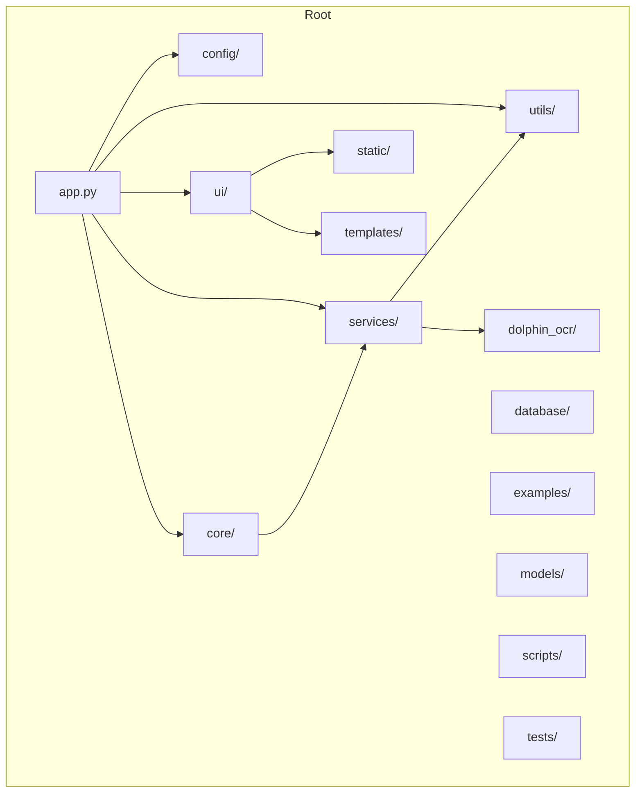

**Diagram sources**
- [app.py](file://app.py#L1-L121)
- [api/routes.py](file://api/routes.py#L1-L520)

**Section sources**
- [app.py](file://app.py#L1-L121)

## Core Components
The PhenomenalLayout application is built around several core components that work together to process and translate documents while preserving their original layout. The system follows a service-oriented architecture where each business capability is encapsulated in dedicated service classes. The main components include the FastAPI application entry point, API routes for handling document processing requests, state management for maintaining processing context, document processing services for coordinating the translation workflow, OCR services for text extraction, layout-aware translation services for preserving formatting, and PDF reconstruction services for generating the final translated document.

**Section sources**
- [app.py](file://app.py#L1-L121)
- [api/routes.py](file://api/routes.py#L1-L520)
- [core/state_manager.py](file://core/state_manager.py#L1-L229)
- [services/main_document_processor.py](file://services/main_document_processor.py#L1-L323)

## Architecture Overview
The PhenomenalLayout application implements a modular service-oriented architecture with clear separation between API, services, core logic, and utilities. The system is designed to handle document translation with precise layout preservation, integrating OCR processing, translation services, and PDF reconstruction. The architecture follows the service pattern, where each business capability is encapsulated in dedicated service classes that can be easily tested and maintained.

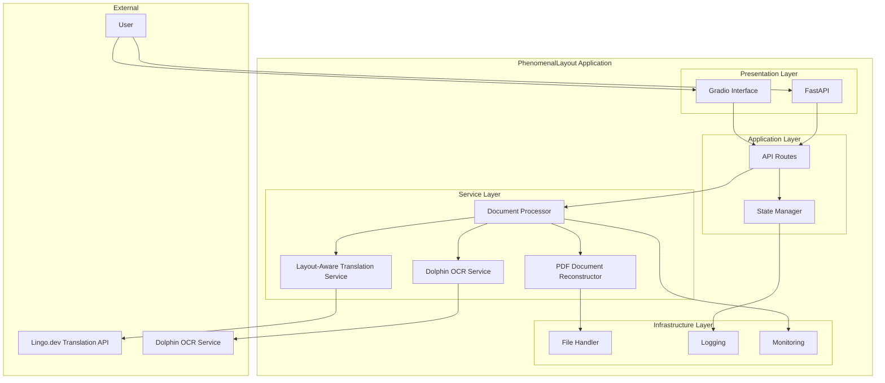

**Diagram sources**
- [app.py](file://app.py#L1-L121)
- [api/routes.py](file://api/routes.py#L1-L520)
- [core/state_manager.py](file://core/state_manager.py#L1-L229)
- [services/main_document_processor.py](file://services/main_document_processor.py#L1-L323)
- [services/dolphin_ocr_service.py](file://services/dolphin_ocr_service.py#L1-L375)
- [services/layout_aware_translation_service.py](file://services/layout_aware_translation_service.py#L1-L311)
- [services/pdf_document_reconstructor.py](file://services/pdf_document_reconstructor.py#L1-L487)

## Detailed Component Analysis

### Application Initialization and Routing
The application entry point in `app.py` initializes both FastAPI and Gradio interfaces, creating a comprehensive user experience for document translation. The FastAPI application is configured with CORS middleware to allow cross-origin requests and includes routers for API endpoints and application routes. The Gradio interface is mounted on the FastAPI application, providing a user-friendly web interface for document translation. The system ensures required directories exist before configuring logging, preventing file handler failures due to missing paths.

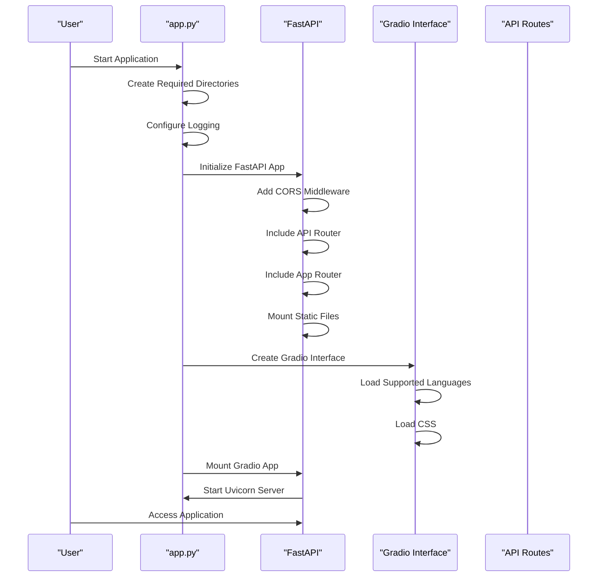

**Diagram sources**
- [app.py](file://app.py#L1-L121)

**Section sources**
- [app.py](file://app.py#L1-L121)

### API Routes and Request Handling
The API routes defined in `routes.py` handle document translation requests, providing endpoints for file upload, translation processing, and result retrieval. The routes delegate to service classes for business logic, maintaining a clean separation between request handling and processing. The system includes endpoints for both standard document translation and philosophy-enhanced translation with neologism detection. The routes validate file formats, detect encryption, and sanitize metadata to prevent information leakage.

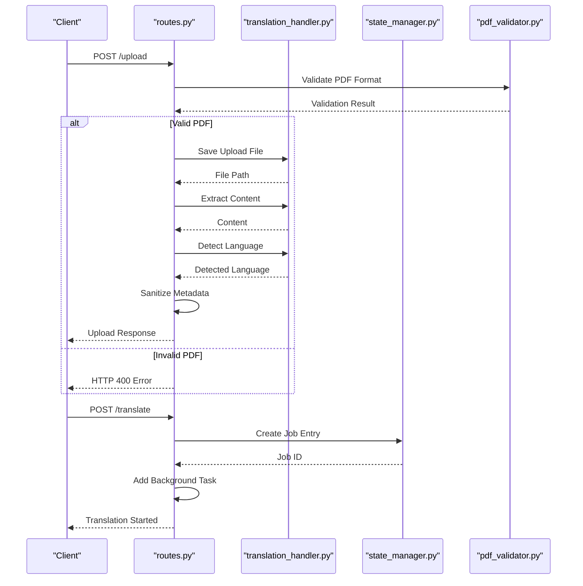

**Diagram sources**
- [api/routes.py](file://api/routes.py#L1-L520)

**Section sources**
- [api/routes.py](file://api/routes.py#L1-L520)

### State Management
The state management system in `state_manager.py` provides thread-safe state management for document translation operations. The system uses a `ThreadSafeTranslationJobs` class to manage translation jobs with automatic cleanup of completed jobs after a retention period. The `StateManager` class manages request-scoped states, allowing multiple concurrent translation operations to maintain their own state without interference. The state includes information about the current file, processing progress, error messages, and user choices for philosophy-enhanced translation.

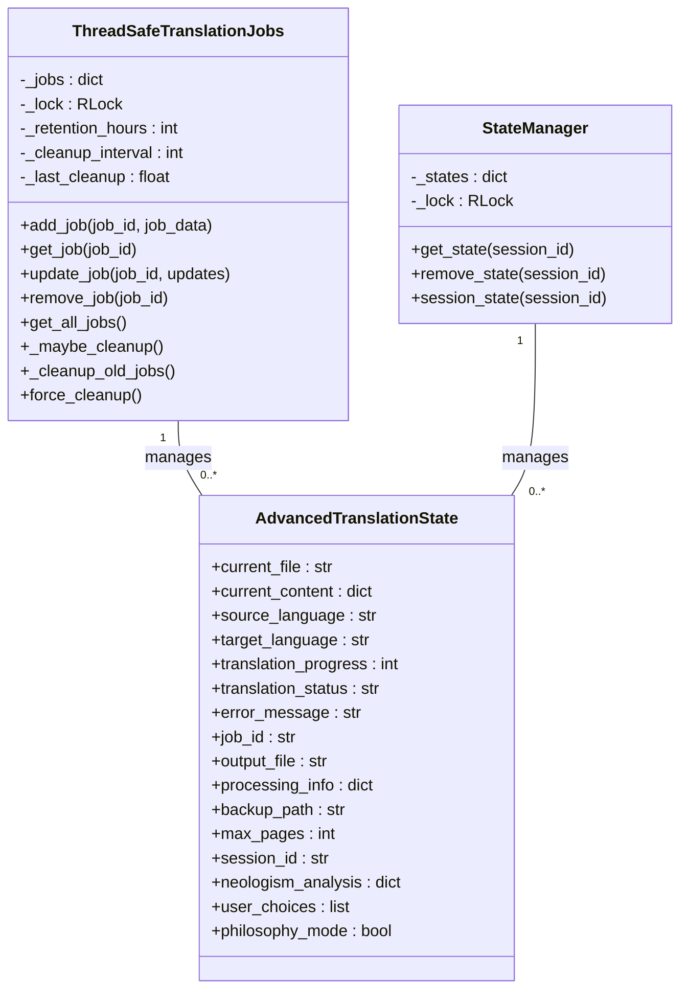

**Diagram sources**
- [core/state_manager.py](file://core/state_manager.py#L1-L229)

**Section sources**
- [core/state_manager.py](file://core/state_manager.py#L1-L229)

### Document Processing Workflow
The document processing workflow is orchestrated by the `DocumentProcessor` class in `main_document_processor.py`, which coordinates the complete translation pipeline. The processor follows a sequential workflow: validation, PDF-to-image conversion, OCR processing, translation, and PDF reconstruction. Each step is handled by specialized services that are injected into the processor, enabling loose coupling and easy testing. The processor emits progress events throughout the workflow, allowing clients to track processing status.

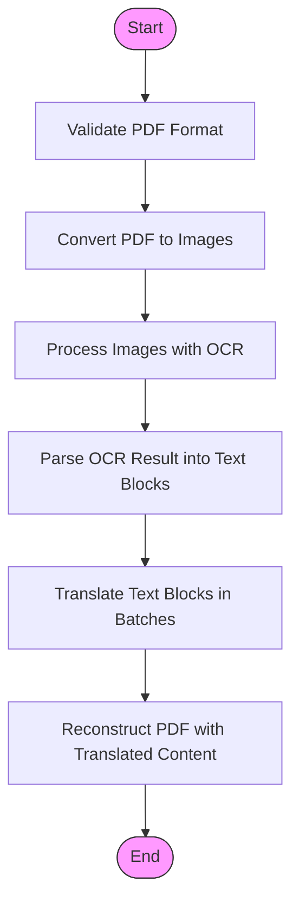

**Diagram sources**
- [services/main_document_processor.py](file://services/main_document_processor.py#L1-L323)

**Section sources**
- [services/main_document_processor.py](file://services/main_document_processor.py#L1-L323)

### Service Pattern Implementation
The PhenomenalLayout application implements the Service Pattern, where each business capability is encapsulated in dedicated service classes. This design promotes separation of concerns, testability, and reusability. The main service classes include the `DolphinOCRService` for OCR processing, the `LayoutAwareTranslationService` for translation with layout preservation, and the `PDFDocumentReconstructor` for PDF reconstruction. Each service has a well-defined interface and can be easily replaced or extended.

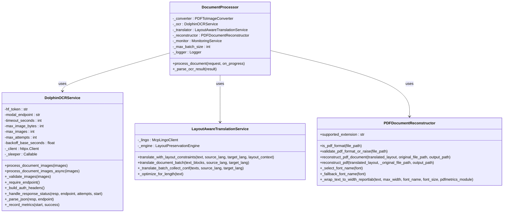

**Diagram sources**
- [services/main_document_processor.py](file://services/main_document_processor.py#L1-L323)
- [services/dolphin_ocr_service.py](file://services/dolphin_ocr_service.py#L1-L375)
- [services/layout_aware_translation_service.py](file://services/layout_aware_translation_service.py#L1-L311)
- [services/pdf_document_reconstructor.py](file://services/pdf_document_reconstructor.py#L1-L487)

**Section sources**
- [services/main_document_processor.py](file://services/main_document_processor.py#L1-L323)
- [services/dolphin_ocr_service.py](file://services/dolphin_ocr_service.py#L1-L375)
- [services/layout_aware_translation_service.py](file://services/layout_aware_translation_service.py#L1-L311)
- [services/pdf_document_reconstructor.py](file://services/pdf_document_reconstructor.py#L1-L487)

### Dependency Injection Pattern
The PhenomenalLayout application uses the Dependency Injection pattern to pass services between components, promoting loose coupling and testability. Services are injected into classes through their constructors, allowing for easy replacement with mock implementations during testing. The `DocumentProcessor` class, for example, receives instances of the OCR service, translation service, and PDF reconstructor through its constructor, rather than creating them internally. This design enables flexible configuration and makes the system more maintainable.

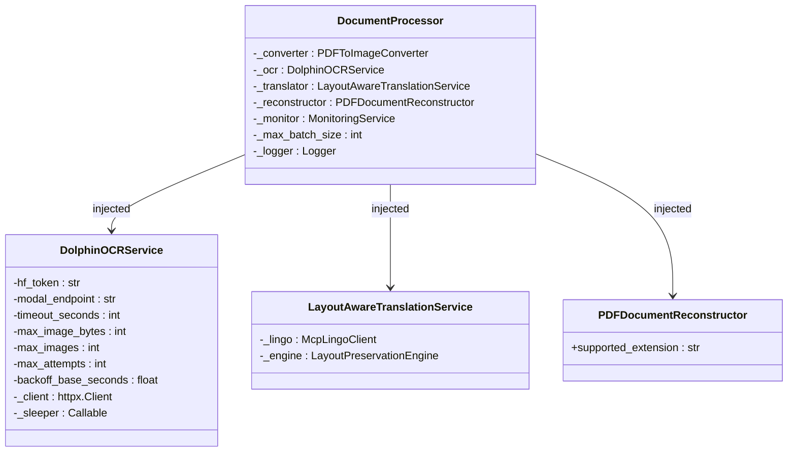

**Diagram sources**
- [services/main_document_processor.py](file://services/main_document_processor.py#L1-L323)
- [services/dolphin_ocr_service.py](file://services/dolphin_ocr_service.py#L1-L375)
- [services/layout_aware_translation_service.py](file://services/layout_aware_translation_service.py#L1-L311)
- [services/pdf_document_reconstructor.py](file://services/pdf_document_reconstructor.py#L1-L487)

**Section sources**
- [services/main_document_processor.py](file://services/main_document_processor.py#L1-L323)
- [services/dolphin_ocr_service.py](file://services/dolphin_ocr_service.py#L1-L375)
- [services/layout_aware_translation_service.py](file://services/layout_aware_translation_service.py#L1-L311)
- [services/pdf_document_reconstructor.py](file://services/pdf_document_reconstructor.py#L1-L487)

### Data Flow Analysis
The data flow in the PhenomenalLayout application begins with document upload and progresses through validation, OCR analysis, translation, layout preservation, and PDF reconstruction. The system maintains processing context across stages using the state manager, ensuring that information is preserved throughout the workflow. The data flow is designed to handle large documents efficiently by processing content in batches and using asynchronous operations where appropriate.

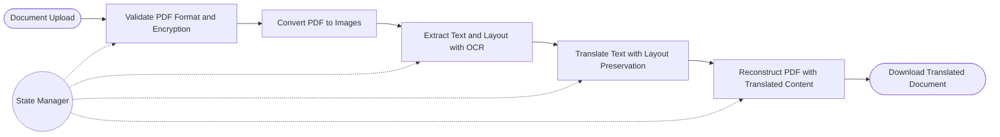

**Diagram sources**
- [api/routes.py](file://api/routes.py#L1-L520)
- [core/translation_handler.py](file://core/translation_handler.py#L1-L755)
- [services/main_document_processor.py](file://services/main_document_processor.py#L1-L323)

**Section sources**
- [api/routes.py](file://api/routes.py#L1-L520)
- [core/translation_handler.py](file://core/translation_handler.py#L1-L755)
- [services/main_document_processor.py](file://services/main_document_processor.py#L1-L323)

### User Interface Integration
The user interface is implemented using Gradio, providing a user-friendly web interface for document translation. The `gradio_interface.py` file defines the interface layout, including file upload, language selection, translation controls, and download functionality. The interface is integrated with the FastAPI application, allowing users to access both the API endpoints and the web interface through the same server. The UI components are designed to provide real-time feedback on processing status and quality metrics.

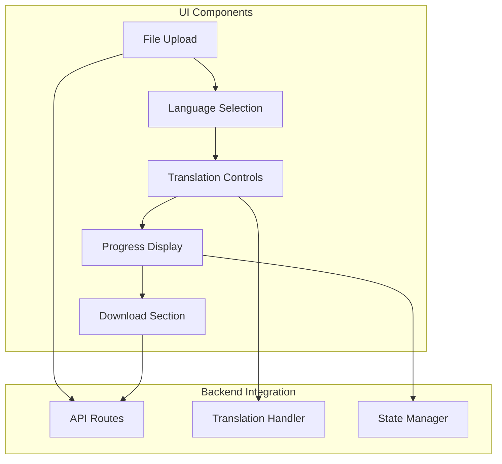

**Diagram sources**
- [ui/gradio_interface.py](file://ui/gradio_interface.py#L1-L464)

**Section sources**
- [ui/gradio_interface.py](file://ui/gradio_interface.py#L1-L464)

## Dependency Analysis
The PhenomenalLayout application has a well-defined dependency structure that promotes modularity and maintainability. The core dependencies include FastAPI for the web framework, Gradio for the user interface, httpx for HTTP requests, and various PDF processing libraries. The application follows a layered architecture where higher-level components depend on lower-level services, but not vice versa. This dependency structure enables easy testing and replacement of components.

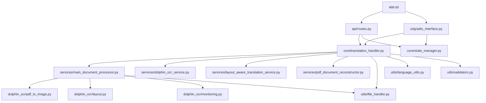

**Diagram sources**
- [app.py](file://app.py#L1-L121)
- [api/routes.py](file://api/routes.py#L1-L520)
- [core/translation_handler.py](file://core/translation_handler.py#L1-L755)
- [core/state_manager.py](file://core/state_manager.py#L1-L229)
- [services/main_document_processor.py](file://services/main_document_processor.py#L1-L323)
- [services/dolphin_ocr_service.py](file://services/dolphin_ocr_service.py#L1-L375)
- [services/layout_aware_translation_service.py](file://services/layout_aware_translation_service.py#L1-L311)
- [services/pdf_document_reconstructor.py](file://services/pdf_document_reconstructor.py#L1-L487)
- [ui/gradio_interface.py](file://ui/gradio_interface.py#L1-L464)

**Section sources**
- [app.py](file://app.py#L1-L121)
- [api/routes.py](file://api/routes.py#L1-L520)
- [core/translation_handler.py](file://core/translation_handler.py#L1-L755)
- [core/state_manager.py](file://core/state_manager.py#L1-L229)
- [services/main_document_processor.py](file://services/main_document_processor.py#L1-L323)
- [services/dolphin_ocr_service.py](file://services/dolphin_ocr_service.py#L1-L375)
- [services/layout_aware_translation_service.py](file://services/layout_aware_translation_service.py#L1-L311)
- [services/pdf_document_reconstructor.py](file://services/pdf_document_reconstructor.py#L1-L487)
- [ui/gradio_interface.py](file://ui/gradio_interface.py#L1-L464)

## Performance Considerations
The PhenomenalLayout application is designed with performance in mind, particularly for handling large documents and high throughput scenarios. The system uses batch processing for translation operations to minimize API calls and improve efficiency. The document processor processes content in fixed-size batches to avoid memory limitations and API rate limits. The application also includes monitoring and performance metrics to track processing times and identify bottlenecks.

The system's performance characteristics include:
- **Memory Efficiency**: Processing large documents in batches to avoid excessive memory usage
- **Network Efficiency**: Minimizing API calls through batch processing
- **CPU Utilization**: Parallel processing of document pages where possible
- **I/O Optimization**: Efficient file handling and caching strategies

For high throughput scenarios, the application can be deployed in a distributed environment with load balancing and horizontal scaling. The state manager is designed to handle multiple concurrent translation operations, making the system suitable for multi-user environments.

**Section sources**
- [services/main_document_processor.py](file://services/main_document_processor.py#L1-L323)
- [services/dolphin_ocr_service.py](file://services/dolphin_ocr_service.py#L1-L375)
- [services/layout_aware_translation_service.py](file://services/layout_aware_translation_service.py#L1-L311)

## Troubleshooting Guide
The PhenomenalLayout application includes comprehensive error handling and logging to facilitate troubleshooting. Common issues and their solutions include:

1. **File Upload Errors**: Ensure the uploaded file is a valid PDF and not encrypted. The system rejects encrypted PDFs to prevent processing failures.

2. **Translation API Errors**: Verify that the LINGO_API_KEY environment variable is set correctly. Check the API key's validity and ensure it has the necessary permissions.

3. **OCR Service Connectivity**: Ensure the DOLPHIN_MODAL_ENDPOINT environment variable is set to the correct URL for the OCR service. Verify network connectivity to the endpoint.

4. **Memory Issues**: For large documents, adjust the PDF_DPI setting to a lower value to reduce memory usage. The default DPI is 300, but 150 may be sufficient for many use cases.

5. **Font Rendering Issues**: If translated text overflows its bounding box, the system will log warnings. This can be mitigated by adjusting the translation service's layout preservation strategies.

6. **Concurrent Processing Limits**: The TRANSLATION_CONCURRENCY_LIMIT setting controls the maximum number of concurrent translation tasks. Adjust this value based on system resources and performance requirements.

The application logs detailed information about each processing step, making it easier to diagnose and resolve issues. Logs are written to both the console and a file (logs/app.log), providing persistent records for debugging.

**Section sources**
- [api/routes.py](file://api/routes.py#L1-L520)
- [core/translation_handler.py](file://core/translation_handler.py#L1-L755)
- [services/dolphin_ocr_service.py](file://services/dolphin_ocr_service.py#L1-L375)
- [services/pdf_document_reconstructor.py](file://services/pdf_document_reconstructor.py#L1-L487)

## Conclusion
The PhenomenalLayout application demonstrates a well-architected service-oriented design that effectively separates concerns and promotes maintainability. The system's modular structure, with clear separation between API, services, core logic, and utilities, enables easy extension and testing. The implementation of the Service Pattern and Dependency Injection promotes loose coupling and reusability, while the comprehensive state management system ensures processing context is maintained across stages.

The application successfully addresses the challenge of preserving document layout during translation by integrating OCR processing, layout-aware translation, and precise PDF reconstruction. The data flow from document upload through validation, OCR analysis, translation, layout preservation, and PDF reconstruction is well-defined and efficient, handling large documents and high throughput scenarios effectively.

Key architectural strengths include:
- Clear separation of concerns through modular design
- Effective use of design patterns (Service Pattern, Dependency Injection)
- Comprehensive error handling and logging
- Support for both synchronous and asynchronous operations
- Scalable architecture suitable for high-throughput environments

The system could be further enhanced by implementing a microservices architecture for even greater scalability, adding more sophisticated caching mechanisms, and incorporating machine learning models for improved translation quality and layout prediction.
