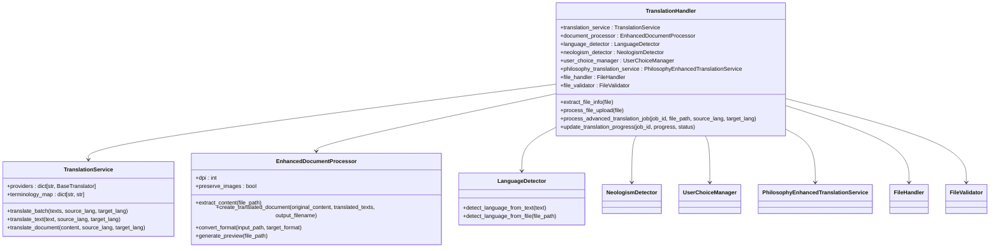

# Core Logic Components

<cite>
**Referenced Files in This Document**  
- [app.py](file://app.py)
- [core/state_manager.py](file://core/state_manager.py)
- [core/translation_handler.py](file://core/translation_handler.py)
- [api/routes.py](file://api/routes.py)
- [ui/gradio_interface.py](file://ui/gradio_interface.py)
- [config/settings.py](file://config/settings.py)
</cite>

## Table of Contents
1. [Introduction](#introduction)
2. [State Management System](#state-management-system)
3. [Translation Handler](#translation-handler)
4. [Application Bootstrapping](#application-bootstrapping)
5. [Integration Architecture](#integration-architecture)
6. [State Flow and Coordination](#state-flow-and-coordination)
7. [Memory Management and Concurrency](#memory-management-and-concurrency)

## Introduction
The PhenomenalLayout application is an advanced document translation system that combines OCR technology with translation services to preserve document layout during translation. The core logic components include a sophisticated state management system, a translation handler that abstracts provider interactions, and an application bootstrap process that integrates FastAPI with Gradio UI. This documentation details how these components work together to manage document translation workflows, coordinate state across asynchronous operations, and provide a seamless user experience.

## State Management System

The state management system in PhenomenalLayout is designed to handle document translation state across asynchronous processing stages while ensuring thread safety and proper state isolation. The system consists of three main components: `AdvancedTranslationState`, `ThreadSafeTranslationJobs`, and `StateManager`.

The `AdvancedTranslationState` class serves as a container for all translation-related state, including document metadata, processing information, and intermediate results. It maintains properties such as `current_file`, `current_content`, `source_language`, `target_language`, `translation_progress`, and `processing_info`. This class provides a comprehensive representation of the translation process state, allowing the system to track progress and maintain context throughout the translation workflow.

The `ThreadSafeTranslationJobs` class implements a thread-safe job management system that stores translation jobs with automatic cleanup of completed jobs. It uses a `threading.RLock` to ensure thread safety when accessing the job dictionary, preventing race conditions in multi-threaded environments. The class includes methods for adding, retrieving, updating, and removing jobs, all protected by the lock. Jobs are automatically cleaned up after a configurable retention period (default 24 hours), with cleanup occurring every hour to prevent memory leaks from completed translation jobs.

The `StateManager` class manages request-scoped state instances, providing isolation between different user sessions. It uses a dictionary to store state objects keyed by session ID, with a thread lock ensuring thread-safe access. The `get_state` method retrieves or creates a state object for a given session ID, while `remove_state` removes state when no longer needed. The class also provides a context manager (`session_state`) for convenient state management in code blocks.

A global instance of `ThreadSafeTranslationJobs` named `translation_jobs` is created with a 24-hour retention period, serving as the central repository for translation job metadata. Similarly, a global `state_manager` instance handles session-specific state. For backward compatibility, a global `state` instance exists but is not thread-safe and should be avoided in favor of session-scoped state.

The state management system addresses memory management by automatically cleaning up old jobs and provides thread safety through proper locking mechanisms. However, potential race conditions could occur if multiple requests attempt to update the same job simultaneously, though the use of locks minimizes this risk.

**Diagram sources**
- [core/state_manager.py](file://core/state_manager.py#L15-L228)

**Section sources**
- [core/state_manager.py](file://core/state_manager.py#L1-L228)

## Translation Handler

The translation handler component abstracts interactions with translation providers and manages the translation workflow. It serves as a bridge between the application's core logic and external translation services, providing a consistent interface regardless of the underlying provider.

The handler initializes several key services at module level, including the `TranslationService`, `EnhancedDocumentProcessor`, `LanguageDetector`, `NeologismDetector`, `UserChoiceManager`, and `PhilosophyEnhancedTranslationService`. These services are configured with settings from the application configuration and are made available for use throughout the translation process.

The `TranslationService` is responsible for communicating with external translation providers, currently supporting Lingo.dev through both REST API and MCP (Message Channel Protocol) interfaces. It implements a provider selection mechanism that chooses the appropriate translation backend based on configuration. The service handles batch translation requests, applying optional terminology preprocessing and post-processing to strip non-translate tags from results.

The `EnhancedDocumentProcessor` handles PDF document processing, converting PDFs to images at a specified DPI (default 300) and using Dolphin OCR to extract text and layout information. It preserves images in the document when configured to do so and manages the reconstruction of translated documents while maintaining the original formatting.

The translation handler provides several key functions for processing translation workflows. The `extract_file_info` function handles file objects from various sources (string paths, Gradio FileData objects, or file-like objects), extracting file path, name, and size information. This abstraction allows the system to work with files from different input sources consistently.

The `process_file_upload` function orchestrates the initial processing of uploaded PDF files. It validates the file, extracts content using the document processor, detects the source language using text sample analysis, and updates the application state with processing information. This function returns detailed status information including detected language, page count, text elements, file size, and processing time.

The handler also includes functions for managing translation jobs, updating progress, and handling errors. It integrates with the state management system to track translation progress and store intermediate results. The system supports philosophy-enhanced translation through the `PhilosophyEnhancedTranslationService`, which incorporates neologism detection and user choice management for specialized translation scenarios.

**Diagram sources**
- [core/translation_handler.py](file://core/translation_handler.py#L1-L200)

**Section sources**
- [core/translation_handler.py](file://core/translation_handler.py#L1-L755)

## Application Bootstrapping

The application bootstrapping process in app.py initializes the FastAPI application, configures Gradio integration, loads settings, and wires dependencies to create a fully functional document translation system. The bootstrap process ensures that all required directories exist before configuring logging, preventing file handler failures due to missing paths.

The application begins by defining a list of required directories (`_REQUIRED_DIRECTORIES`) including static, uploads, downloads, .layout_backups, templates, and logs. The `_ensure_required_dirs` function creates these directories if they don't exist, ensuring the application has the necessary file system structure before proceeding. This early directory creation is critical for the subsequent logging configuration to work properly.

After ensuring directory existence, the application configures logging with both file and console handlers. The logging configuration includes a detailed format with timestamp, logger name, log level, and message. The logger is used throughout the bootstrap process to report directory creation and other initialization steps.

The FastAPI application is created with metadata including title, description, and version. CORS middleware is added to allow cross-origin requests from any origin, with credentials, methods, and headers permitted. This configuration enables the Gradio UI to communicate with the API endpoints seamlessly.

The application includes two routers: `app_router` for root and philosophy routes without a prefix, and `api_router` for API routes with the "/api/v1" prefix. This routing structure separates user interface endpoints from API endpoints while maintaining versioning for the API.

Static files are mounted at the "/static" path, allowing the application to serve CSS, JavaScript, and other static assets. This is essential for the Gradio interface and any custom styling or client-side functionality.

The startup event handler (`startup_event`) verifies that all required directories exist when the application starts, creating any that are missing. This provides a second check to ensure the file system structure is correct, even if the early directory creation failed for some reason.

The main function (`main`) serves as the entry point for the application. It creates the Gradio interface by calling `create_gradio_interface()` and mounts it to the FastAPI application using `gr.mount_gradio_app()`. This integration allows the Gradio UI to be served alongside the FastAPI endpoints, creating a unified application.

The application is started with Uvicorn, with host and port configurable through environment variables (HOST and PORT), defaulting to localhost on port 8000. This configuration allows for flexible deployment options while providing sensible defaults for development.

**Diagram sources**
- [app.py](file://app.py#L1-L120)

**Section sources**
- [app.py](file://app.py#L1-L120)

## Integration Architecture

The integration architecture of PhenomenalLayout combines FastAPI endpoints with a Gradio UI to create a comprehensive document translation system. The architecture is designed to provide both a programmatic API for developers and a user-friendly web interface for end users.

The FastAPI endpoints are defined in api/routes.py and organized into two routers: `api_router` for API endpoints and `app_router` for application routes. The API endpoints follow REST conventions with clear, descriptive paths and return structured JSON responses. Key endpoints include:

- `/upload`: Handles file uploads, processes PDFs with advanced extraction, and returns metadata about the uploaded document
- `/translate`: Initiates translation jobs and returns a job ID for tracking progress
- `/status/{job_id}`: Returns the current status of a translation job
- `/download/{job_id}`: Provides the translated document for download

The Gradio UI, defined in ui/gradio_interface.py, provides a visual interface for users to upload documents, view processing information, select target languages, and monitor translation progress. The interface is created using Gradio's Blocks API, allowing for flexible layout and event handling.

The integration between FastAPI and Gradio is achieved by mounting the Gradio interface to the FastAPI application using `gr.mount_gradio_app()`. This allows both systems to run on the same server and share state, with the Gradio interface making requests to the FastAPI endpoints for file processing and translation.

The UI components include file upload, document preview, language detection, translation controls, progress monitoring, and download functionality. The interface uses event handlers to respond to user actions, such as file uploads and translation requests. When a user uploads a file, the `on_file_upload` function is called, which processes the file and updates the UI components with the results.

The translation workflow is coordinated through the state management system. When a user initiates a translation, the Gradio interface calls the `/translate` endpoint, which creates a job in the `translation_jobs` manager and returns a job ID. The Gradio interface then uses this job ID to poll the `/status/{job_id}` endpoint for progress updates, displaying the current status to the user.

The integration also includes error handling and validation. The API endpoints validate input and return appropriate HTTP status codes and error messages. The Gradio interface handles these errors gracefully, displaying user-friendly messages instead of raw error responses.

**Diagram sources**
- [app.py](file://app.py#L1-L120)
- [api/routes.py](file://api/routes.py#L1-L519)
- [ui/gradio_interface.py](file://ui/gradio_interface.py#L1-L463)

**Section sources**
- [app.py](file://app.py#L1-L120)
- [api/routes.py](file://api/routes.py#L1-L519)
- [ui/gradio_interface.py](file://ui/gradio_interface.py#L1-L463)

## State Flow and Coordination

The state flow in PhenomenalLayout follows a coordinated sequence from API routes through services while being tracked by the state manager. This flow ensures that document translation state is preserved across asynchronous processing stages and is accessible to both the API and UI components.

When a user uploads a document through the Gradio interface, the following sequence occurs:

1. The Gradio UI calls the `/upload` endpoint in api/routes.py
2. The endpoint saves the uploaded file and performs basic validation
3. The `process_file_upload` function in core/translation_handler.py is called to process the file
4. The document processor extracts content from the PDF, including text and layout information
5. The language detector analyzes a text sample to determine the source language
6. The processing information is stored in the global state object
7. The endpoint returns metadata about the processed document to the UI

When a user initiates a translation, the following sequence occurs:

1. The Gradio UI calls the `/translate` endpoint with the file path, source language, and target language
2. The endpoint generates a unique job ID and creates a job entry in the `translation_jobs` manager
3. A background task is started to process the translation job
4. The `process_advanced_translation_job` function is called with the job ID and translation parameters
5. The translation handler retrieves the current state and updates the job status
6. The document processor extracts content from the original document
7. The translation service processes the text in batches, translating each page
8. The translated content is used to create a new document with preserved layout
9. The job status is updated with progress and the final output file path
10. The UI polls the `/status/{job_id}` endpoint to display progress to the user

Throughout this flow, the state manager coordinates state persistence. The `get_request_state` function is used to retrieve the appropriate state object, either for a specific session or the global state for backward compatibility. The `AdvancedTranslationState` object stores document metadata, processing information, and intermediate results, ensuring that this information is available throughout the translation process.

The `ThreadSafeTranslationJobs` manager tracks the status of translation jobs, storing job metadata including status, progress, file paths, and timestamps. This allows multiple translation jobs to be processed concurrently while maintaining isolation between them.

The integration between the API routes and the Gradio UI is facilitated by this state coordination. The API endpoints update the state and job managers, while the Gradio UI reads from these managers to display the current status to the user. This separation of concerns allows the API to focus on processing while the UI focuses on presentation.

**Diagram sources**
- [app.py](file://app.py#L1-L120)
- [core/state_manager.py](file://core/state_manager.py#L1-L228)
- [core/translation_handler.py](file://core/translation_handler.py#L1-L755)
- [api/routes.py](file://api/routes.py#L1-L519)

**Section sources**
- [app.py](file://app.py#L1-L120)
- [core/state_manager.py](file://core/state_manager.py#L1-L228)
- [core/translation_handler.py](file://core/translation_handler.py#L1-L755)
- [api/routes.py](file://api/routes.py#L1-L519)

## Memory Management and Concurrency

The PhenomenalLayout application employs several strategies for memory management and concurrency to handle large documents and prevent race conditions in state updates.

For memory management, the application uses a multi-layered approach. The `ThreadSafeTranslationJobs` class automatically cleans up completed jobs after a configurable retention period (default 24 hours), preventing memory leaks from accumulated job data. This cleanup occurs every hour, ensuring that old jobs are removed in a timely manner without excessive overhead.

The application also manages memory during document processing by processing documents in batches. The `EnhancedDocumentProcessor` extracts content page by page, and the `TranslationService` processes text in configurable batch sizes (default 20). This batching prevents excessive memory usage when processing large documents with many pages or large amounts of text.

The `MEMORY_THRESHOLD` setting in config/settings.py (default 500 MB) provides a configurable limit for memory usage, allowing the system to be tuned for different deployment environments. While the current implementation doesn't actively monitor memory usage against this threshold, it serves as a configuration point for potential future memory management features.

For concurrency, the application uses thread-safe data structures and proper locking mechanisms. The `ThreadSafeTranslationJobs` class uses a `threading.RLock` to protect access to the job dictionary, preventing race conditions when multiple threads attempt to read or modify job data simultaneously. Similarly, the `StateManager` class uses a thread lock to ensure thread-safe access to session state.

The application handles asynchronous operations through FastAPI's background tasks, allowing long-running translation processes to execute without blocking the main request thread. This enables the system to handle multiple concurrent translation requests efficiently.

Potential race conditions could occur in the following scenarios:

1. Multiple requests attempting to update the same job simultaneously
2. Concurrent access to the global state object (though this is mitigated by the thread lock)
3. Race conditions during directory creation in the startup event handler

However, the use of locks in the state management system minimizes these risks. The `AdvancedTranslationState` class is designed to be accessed through the `StateManager`, which provides thread-safe access via its internal lock.

The application could further improve memory management by implementing more aggressive cleanup of temporary files, monitoring actual memory usage against the configured threshold, and providing more granular control over batch sizes and processing concurrency. Additionally, using weak references for cached data could help prevent memory leaks in long-running applications.

**Diagram sources**
- [core/state_manager.py](file://core/state_manager.py#L1-L228)
- [core/translation_handler.py](file://core/translation_handler.py#L1-L755)
- [config/settings.py](file://config/settings.py#L1-L548)

**Section sources**
- [core/state_manager.py](file://core/state_manager.py#L1-L228)
- [core/translation_handler.py](file://core/translation_handler.py#L1-L755)
- [config/settings.py](file://config/settings.py#L1-L548)
