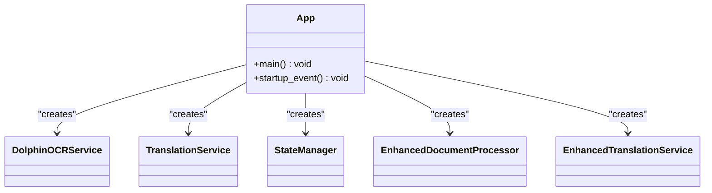
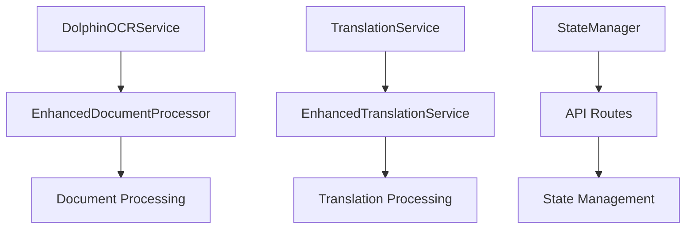
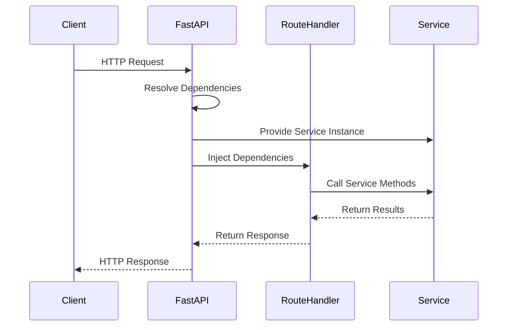
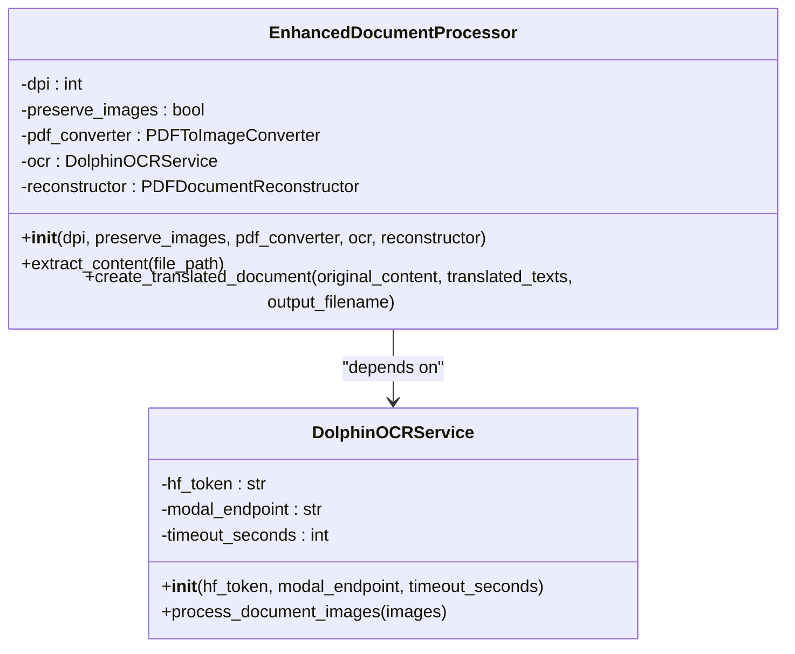
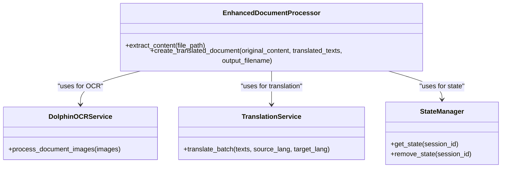

# Dependency Injection Implementation

<cite>
**Referenced Files in This Document**  
- [app.py](file://app.py)
- [api/routes.py](file://api/routes.py)
- [services/enhanced_document_processor.py](file://services/enhanced_document_processor.py)
- [services/dolphin_ocr_service.py](file://services/dolphin_ocr_service.py)
- [services/translation_service.py](file://services/translation_service.py)
- [core/state_manager.py](file://core/state_manager.py)
- [services/enhanced_translation_service.py](file://services/enhanced_translation_service.py)
- [services/parallel_translation_service.py](file://services/parallel_translation_service.py)
</cite>

## Table of Contents
1. [Introduction](#introduction)
2. [Composition Root in app.py](#composition-root-in-apppy)
3. [Service Instantiation and Dependency Graph](#service-instantiation-and-dependency-graph)
4. [FastAPI Dependency Injection with Depends()](#fastapi-dependency-injection-with-depends)
5. [Constructor-Based Dependency Declaration](#constructor-based-dependency-declaration)
6. [EnhancedDocumentProcessor Dependency Chain](#enhanceddocumentprocessor-dependency-chain)
7. [Benefits for Testing and Configuration](#benefits-for-testing-and-configuration)
8. [Circular Dependency Prevention](#circular-dependency-prevention)
9. [Manual DI vs Framework-Based DI](#manual-di-vs-framework-based-di)
10. [Service Registration Guidelines](#service-registration-guidelines)

## Introduction
The PhenomenalLayout application implements a manual dependency injection pattern to manage service instantiation and dependencies across the system. This approach centers around app.py as the composition root, where all core services are instantiated and their dependencies are explicitly wired together. The system leverages FastAPI's Depends() functionality to inject service instances into route handlers, promoting loose coupling between components. Services declare their dependencies through constructor parameters, enabling clear dependency contracts and enhancing testability. This documentation details how the dependency injection pattern is implemented, focusing on the instantiation of core services like DolphinOCRService, TranslationService, and StateManager, and how they are injected into components like EnhancedDocumentProcessor.

**Section sources**
- [app.py](file://app.py#L1-L121)
- [api/routes.py](file://api/routes.py#L1-L520)

## Composition Root in app.py
The app.py file serves as the composition root for the entire application, responsible for instantiating all core services and establishing the dependency graph. During application startup, app.py creates instances of essential services including DolphinOCRService, TranslationService, StateManager, and various document processors. These service instances are then passed to other components that depend on them, establishing the complete object graph. The composition root pattern ensures that dependency resolution occurs in a single, centralized location, making the application's structure transparent and easier to understand. This approach also enables centralized configuration of services, as all service instances are created with their required configuration parameters in one place. The app.py file orchestrates the entire application startup sequence, ensuring that all dependencies are properly resolved before the application begins handling requests.

**Diagram sources **
- [app.py](file://app.py#L1-L121)

**Section sources**
- [app.py](file://app.py#L1-L121)

## Service Instantiation and Dependency Graph
The dependency graph in PhenomenalLayout is established through explicit service instantiation in the composition root. Core services are created with their dependencies injected through constructor parameters, forming a directed acyclic graph of dependencies. The DolphinOCRService is instantiated with configuration parameters like HF_TOKEN and DOLPHIN_MODAL_ENDPOINT, while the TranslationService receives the LINGO_API_KEY for authentication with the translation provider. The StateManager is created to handle request-scoped state, and this instance is shared across components that require state management. The dependency graph is carefully designed to avoid circular dependencies by ensuring that dependencies flow in one direction. Service instances are created in the proper order to satisfy all dependency requirements, with lower-level services (like OCR and translation) instantiated before higher-level services (like document processors) that depend on them.

**Diagram sources **
- [app.py](file://app.py#L1-L121)
- [services/dolphin_ocr_service.py](file://services/dolphin_ocr_service.py#L1-L375)
- [services/translation_service.py](file://services/translation_service.py#L1-L487)
- [core/state_manager.py](file://core/state_manager.py#L1-L229)

**Section sources**
- [app.py](file://app.py#L1-L121)
- [services/dolphin_ocr_service.py](file://services/dolphin_ocr_service.py#L1-L375)
- [services/translation_service.py](file://services/translation_service.py#L1-L487)
- [core/state_manager.py](file://core/state_manager.py#L1-L229)

## FastAPI Dependency Injection with Depends()
FastAPI's Depends() functionality is used throughout the application to inject service instances into route handlers. This allows route functions to declare their dependencies explicitly, without needing to know how to instantiate the required services. In api/routes.py, route handlers use Depends() to request instances of services like document_processor, language_detector, and user_choice_manager. FastAPI's dependency injection system resolves these dependencies by providing the pre-instantiated service instances created in the composition root. This approach promotes loose coupling between route handlers and service implementations, as the routes only depend on the service interfaces rather than their concrete implementations. The dependency injection also enables automatic cleanup of resources through FastAPI's dependency scopes, ensuring that resources are properly managed throughout the request lifecycle.

**Diagram sources **
- [api/routes.py](file://api/routes.py#L1-L520)

**Section sources**
- [api/routes.py](file://api/routes.py#L1-L520)

## Constructor-Based Dependency Declaration
Services in PhenomenalLayout declare their dependencies through constructor parameters, promoting explicit dependency contracts and enhancing testability. The EnhancedDocumentProcessor class, for example, declares dependencies on DolphinOCRService, PDFDocumentReconstructor, and configuration parameters like DPI through its constructor. This approach makes dependencies immediately visible to anyone reading the code, as they are explicitly listed in the constructor signature. It also enables easy substitution of dependencies for testing purposes, as mock objects can be passed to the constructor during unit tests. The constructor-based approach ensures that all required dependencies are provided when an object is created, preventing the object from being in an invalid state. This pattern also facilitates immutability, as dependencies can be stored in private fields and treated as immutable throughout the object's lifetime.

**Diagram sources **
- [services/enhanced_document_processor.py](file://services/enhanced_document_processor.py#L1-L398)
- [services/dolphin_ocr_service.py](file://services/dolphin_ocr_service.py#L1-L375)

**Section sources**
- [services/enhanced_document_processor.py](file://services/enhanced_document_processor.py#L1-L398)
- [services/dolphin_ocr_service.py](file://services/dolphin_ocr_service.py#L1-L375)

## EnhancedDocumentProcessor Dependency Chain
The EnhancedDocumentProcessor demonstrates a clear dependency chain, receiving instances of DolphinOCRService, TranslationService, and StateManager through its constructor. This service acts as a coordinator, integrating OCR processing, document reconstruction, and state management to provide comprehensive document processing capabilities. The DolphinOCRService dependency enables the processor to extract text and layout information from PDF documents using OCR technology. The TranslationService dependency allows the processor to translate extracted text while preserving the original document structure. The StateManager dependency provides access to request-scoped state, enabling the processor to maintain context across multiple processing steps. This dependency chain illustrates how higher-level services compose lower-level services to provide enhanced functionality while maintaining loose coupling between components.

**Diagram sources **
- [services/enhanced_document_processor.py](file://services/enhanced_document_processor.py#L1-L398)
- [services/dolphin_ocr_service.py](file://services/dolphin_ocr_service.py#L1-L375)
- [services/translation_service.py](file://services/translation_service.py#L1-L487)
- [core/state_manager.py](file://core/state_manager.py#L1-L229)

**Section sources**
- [services/enhanced_document_processor.py](file://services/enhanced_document_processor.py#L1-L398)

## Benefits for Testing and Configuration
The manual dependency injection approach in PhenomenalLayout provides significant benefits for testing and configuration. For testing, the pattern enables easy substitution of mock objects for dependencies, allowing unit tests to isolate specific components and verify their behavior independently. Test suites can inject mock implementations of services like DolphinOCRService or TranslationService to simulate various scenarios without making actual API calls. This approach also facilitates integration testing by allowing selective replacement of specific services while keeping others as real implementations. For configuration, the centralized service instantiation in the composition root enables consistent configuration of all services with their required parameters. Configuration values like API keys, timeouts, and retry policies are applied uniformly across all service instances, reducing the risk of configuration inconsistencies. The explicit dependency declaration also makes it easier to identify configuration requirements for each service.

**Section sources**
- [app.py](file://app.py#L1-L121)
- [services/enhanced_document_processor.py](file://services/enhanced_document_processor.py#L1-L398)
- [tests/test_dolphin_ocr_service.py](file://tests/test_dolphin_ocr_service.py#L1-L50)
- [tests/test_translation_service.py](file://tests/test_translation_service.py#L1-L50)

## Circular Dependency Prevention
The application avoids circular dependencies through careful design of the dependency graph and the use of interface segregation. Circular dependencies are prevented by ensuring that dependencies flow in one direction, from higher-level components to lower-level components. The composition root in app.py instantiates all services in the correct order to satisfy dependency requirements without creating circular references. When bidirectional communication is required, the application uses event-driven patterns or callback mechanisms rather than direct dependencies. For example, instead of having the TranslationService depend directly on the StateManager, it provides callback functions that the StateManager can invoke to update progress. This approach breaks the circular dependency while still enabling the required functionality. The application also uses dependency inversion, where high-level modules depend on abstractions rather than concrete implementations, further reducing the risk of circular dependencies.

**Section sources**
- [app.py](file://app.py#L1-L121)
- [services/enhanced_document_processor.py](file://services/enhanced_document_processor.py#L1-L398)
- [services/translation_service.py](file://services/translation_service.py#L1-L487)
- [core/state_manager.py](file://core/state_manager.py#L1-L229)

## Manual DI vs Framework-Based DI
PhenomenalLayout implements a manual dependency injection approach rather than using a dedicated DI framework, offering several trade-offs. The manual approach provides greater transparency and control over the dependency graph, as all service instantiation and wiring occurs in a single, readable location (app.py). This makes it easier to understand the application's structure and debug dependency-related issues. The manual approach also has minimal overhead, as it doesn't require additional framework code or reflection mechanisms. However, it requires more boilerplate code for service instantiation and wiring, especially as the application grows. A DI framework could automate much of this wiring based on type hints or annotations, reducing the amount of manual configuration required. The manual approach also makes it easier to customize the instantiation logic for specific services, such as applying different configuration parameters or implementing custom creation patterns. Ultimately, the choice of manual DI aligns with the application's architecture, prioritizing clarity and control over automation.

**Section sources**
- [app.py](file://app.py#L1-L121)
- [services/enhanced_document_processor.py](file://services/enhanced_document_processor.py#L1-L398)
- [services/dolphin_ocr_service.py](file://services/dolphin_ocr_service.py#L1-L375)

## Service Registration Guidelines
When adding new services to the PhenomenalLayout application, developers should follow specific guidelines to maintain consistency with the dependency injection pattern. New services should be instantiated in the app.py composition root, with their dependencies explicitly injected through constructor parameters. Service classes should declare their dependencies in their constructors, making the dependency contract clear and enabling easy testing with mock objects. Configuration parameters should be passed to services through the constructor rather than being accessed directly from environment variables within the service, promoting testability and configuration flexibility. When a new service depends on existing services, it should receive those dependencies through its constructor rather than creating them internally. This ensures that all services participate in the same dependency graph and can be properly managed by the composition root. Finally, new services should be added to the appropriate module based on their functionality, following the existing package structure.

**Section sources**
- [app.py](file://app.py#L1-L121)
- [services/enhanced_document_processor.py](file://services/enhanced_document_processor.py#L1-L398)
- [services/dolphin_ocr_service.py](file://services/dolphin_ocr_service.py#L1-L375)
- [services/translation_service.py](file://services/translation_service.py#L1-L487)
