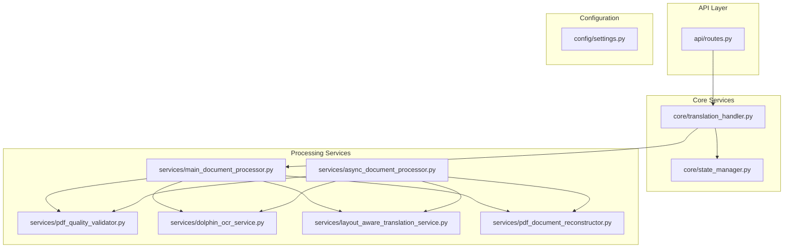
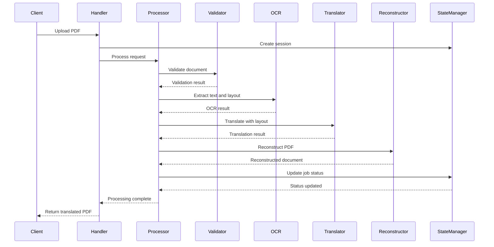
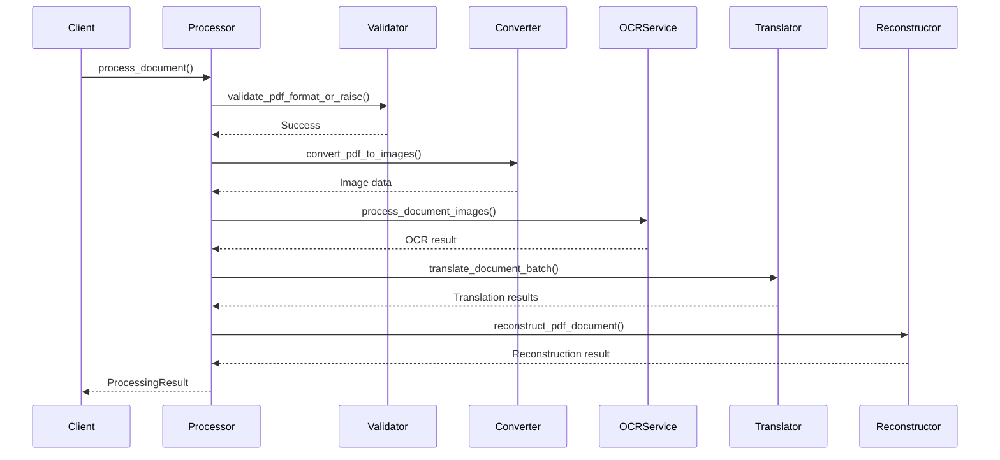
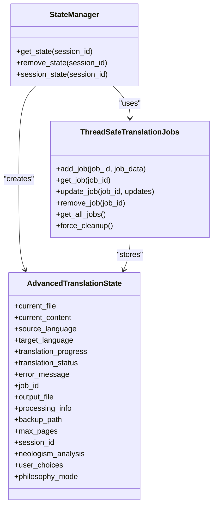
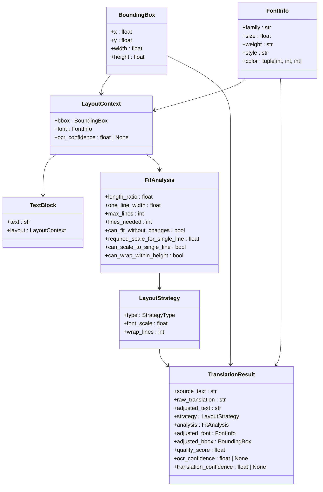
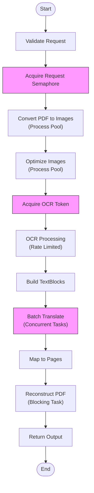
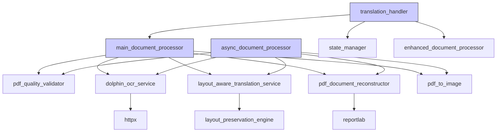

# End-to-End Data Flow

<cite>
**Referenced Files in This Document**  
- [pdf_quality_validator.py](file://services/pdf_quality_validator.py)
- [dolphin_ocr_service.py](file://services/dolphin_ocr_service.py)
- [layout_aware_translation_service.py](file://services/layout_aware_translation_service.py)
- [pdf_document_reconstructor.py](file://services/pdf_document_reconstructor.py)
- [state_manager.py](file://core/state_manager.py)
- [main_document_processor.py](file://services/main_document_processor.py)
- [async_document_processor.py](file://services/async_document_processor.py)
- [layout.py](file://dolphin_ocr/layout.py)
- [translation_handler.py](file://core/translation_handler.py)
</cite>

## Table of Contents
1. [Introduction](#introduction)
2. [Project Structure](#project-structure)
3. [Core Components](#core-components)
4. [Architecture Overview](#architecture-overview)
5. [Detailed Component Analysis](#detailed-component-analysis)
6. [Dependency Analysis](#dependency-analysis)
7. [Performance Considerations](#performance-considerations)
8. [Troubleshooting Guide](#troubleshooting-guide)
9. [Conclusion](#conclusion)

## Introduction
This document provides a comprehensive analysis of the end-to-end data flow pipeline for document processing, from initial upload to final output. The system processes PDF documents through a series of stages: validation, OCR analysis, content extraction, translation with layout awareness, and final PDF reconstruction. The pipeline maintains state across processing stages and supports both synchronous and asynchronous execution models. This documentation details the journey of a PDF document through each processing stage, including error handling, performance characteristics, and optimization opportunities.

## Project Structure
The project follows a modular structure with clearly defined components organized by functionality. The core processing pipeline is distributed across multiple services, with supporting utilities and configuration modules.

**Diagram sources**
- [services/main_document_processor.py](file://services/main_document_processor.py#L1-L323)
- [core/translation_handler.py](file://core/translation_handler.py#L1-L755)

**Section sources**
- [services/main_document_processor.py](file://services/main_document_processor.py#L1-L323)
- [core/translation_handler.py](file://core/translation_handler.py#L1-L755)

## Core Components
The document processing pipeline consists of several core components that work together to transform an input PDF document into a translated output while preserving layout and formatting. The pipeline begins with document validation, proceeds through OCR analysis to extract text and layout information, performs content segmentation, applies layout-aware translation with font scaling considerations, and concludes with PDF reconstruction. The state_manager maintains context across these stages, storing intermediate results like TextBlock objects and LayoutContext. Both synchronous and asynchronous processing models are supported, with job status tracking throughout the pipeline.

**Section sources**
- [pdf_quality_validator.py](file://services/pdf_quality_validator.py#L1-L668)
- [dolphin_ocr_service.py](file://services/dolphin_ocr_service.py#L1-L374)
- [layout_aware_translation_service.py](file://services/layout_aware_translation_service.py#L1-L310)
- [pdf_document_reconstructor.py](file://services/pdf_document_reconstructor.py#L1-L486)

## Architecture Overview
The document processing system follows a modular, service-oriented architecture with clear separation of concerns. The pipeline is orchestrated by document processor classes that coordinate the execution of specialized services for each processing stage. State management is handled separately to maintain context across asynchronous operations, and error handling is implemented consistently throughout the pipeline.

**Diagram sources**
- [main_document_processor.py](file://services/main_document_processor.py#L1-L323)
- [translation_handler.py](file://core/translation_handler.py#L1-L755)
- [state_manager.py](file://core/state_manager.py#L1-L229)

## Detailed Component Analysis

### Document Processing Pipeline
The document processing pipeline follows a sequential workflow with validation, OCR, translation, and reconstruction stages. Each stage processes the document and passes intermediate results to the next stage, with the state manager maintaining context throughout.

#### Processing Sequence Diagram

**Diagram sources**
- [main_document_processor.py](file://services/main_document_processor.py#L1-L323)
- [pdf_quality_validator.py](file://services/pdf_quality_validator.py#L1-L668)
- [dolphin_ocr_service.py](file://services/dolphin_ocr_service.py#L1-L374)
- [layout_aware_translation_service.py](file://services/layout_aware_translation_service.py#L1-L310)
- [pdf_document_reconstructor.py](file://services/pdf_document_reconstructor.py#L1-L486)

**Section sources**
- [main_document_processor.py](file://services/main_document_processor.py#L1-L323)

### State Management System
The state management system provides thread-safe storage for document processing state, allowing multiple concurrent processing jobs while maintaining isolation between sessions.

#### State Management Class Diagram

**Diagram sources**
- [state_manager.py](file://core/state_manager.py#L1-L229)

**Section sources**
- [state_manager.py](file://core/state_manager.py#L1-L229)

### Layout Preservation Engine
The layout preservation engine analyzes text fit within bounding boxes and determines appropriate strategies for maintaining document layout during translation, considering font scaling and text wrapping.

#### Layout Preservation Data Model

**Diagram sources**
- [dolphin_ocr/layout.py](file://dolphin_ocr/layout.py#L1-L410)

**Section sources**
- [dolphin_ocr/layout.py](file://dolphin_ocr/layout.py#L1-L410)

### Asynchronous Processing Model
The asynchronous processing model enables concurrent document processing with rate limiting and resource management, improving throughput for multiple simultaneous requests.

#### Async Processing Flowchart

**Diagram sources**
- [async_document_processor.py](file://services/async_document_processor.py#L1-L390)

**Section sources**
- [async_document_processor.py](file://services/async_document_processor.py#L1-L390)

## Dependency Analysis
The document processing system has a well-defined dependency structure with clear separation between components. The core processing services depend on utility modules for specific functionality, while the orchestrator components depend on the processing services.

**Diagram sources**
- [main_document_processor.py](file://services/main_document_processor.py#L1-L323)
- [async_document_processor.py](file://services/async_document_processor.py#L1-L390)
- [translation_handler.py](file://core/translation_handler.py#L1-L755)

**Section sources**
- [main_document_processor.py](file://services/main_document_processor.py#L1-L323)
- [async_document_processor.py](file://services/async_document_processor.py#L1-L390)

## Performance Considerations
The document processing pipeline has several performance characteristics and optimization opportunities. The system is designed to handle large documents efficiently while maintaining responsiveness.

### Processing Stage Performance
| Stage | Performance Characteristics | Optimization Opportunities |
|-------|-----------------------------|----------------------------|
| **Validation** | Fast, lightweight checks using direct PDF parsing | Cache validation results for repeated processing of same document |
| **OCR** | I/O bound, network-dependent, rate-limited | Implement request batching, connection pooling, and local caching of OCR results |
| **Translation** | I/O bound, benefits from batching | Optimize batch size based on document complexity and network conditions |
| **Reconstruction** | CPU bound, memory intensive for large documents | Implement streaming reconstruction and memory-efficient data structures |
| **Image Conversion** | CPU bound, parallelizable | Use process pools and optimize image quality/compression settings |

The asynchronous processor implements several performance optimizations:
- Rate limiting via token bucket algorithm to prevent service overloading
- Concurrent processing with configurable limits on concurrent requests
- Process pools for CPU-intensive operations like image conversion
- Batching of translation requests to minimize network overhead
- Memory-efficient data structures to handle large documents

**Section sources**
- [main_document_processor.py](file://services/main_document_processor.py#L1-L323)
- [async_document_processor.py](file://services/async_document_processor.py#L1-L390)
- [pdf_document_reconstructor.py](file://services/pdf_document_reconstructor.py#L1-L486)

## Troubleshooting Guide
The document processing pipeline includes comprehensive error handling and recovery mechanisms at each stage. Understanding these mechanisms is essential for diagnosing and resolving issues.

### Error Propagation and Recovery
The system implements a layered error handling approach:
1. **Validation Stage**: Rejects invalid or unsupported documents early
2. **Processing Stages**: Handles transient errors with retry mechanisms
3. **Translation Stage**: Provides fallback mechanisms for failed translations
4. **Reconstruction Stage**: Validates output quality and provides warnings

Common error scenarios and recovery strategies:
- **Document Validation Errors**: Check file format, extension, and encryption status
- **OCR Service Unavailable**: Retry with exponential backoff, check network connectivity
- **Translation Failures**: Fall back to alternative translation services or smaller batches
- **Font Issues**: Use fallback fonts when original fonts are unavailable
- **Memory Issues**: Process large documents in smaller chunks or increase system resources

Logging is implemented throughout the pipeline to facilitate tracing document flow and diagnosing issues. Key log entries include:
- Document validation results
- OCR processing status and warnings
- Translation quality scores
- Reconstruction metrics and warnings
- Job status updates and completion notifications

**Section sources**
- [pdf_quality_validator.py](file://services/pdf_quality_validator.py#L1-L668)
- [dolphin_ocr_service.py](file://services/dolphin_ocr_service.py#L1-L374)
- [layout_aware_translation_service.py](file://services/layout_aware_translation_service.py#L1-L310)
- [pdf_document_reconstructor.py](file://services/pdf_document_reconstructor.py#L1-L486)

## Conclusion
The document processing pipeline provides a robust, scalable solution for translating PDF documents while preserving layout and formatting. The system's modular architecture allows for independent optimization of each processing stage, while the state management system ensures reliable tracking of processing jobs. The implementation supports both synchronous and asynchronous processing models, making it suitable for a wide range of use cases from interactive applications to batch processing systems. Key strengths include comprehensive error handling, detailed logging for troubleshooting, and flexible configuration options for performance tuning. Future enhancements could include improved caching mechanisms, adaptive batching strategies, and enhanced layout preservation algorithms.
