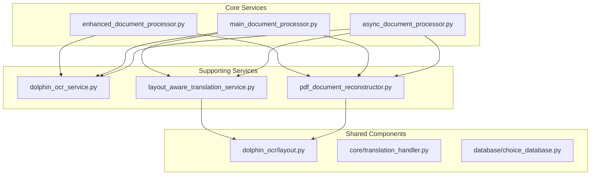
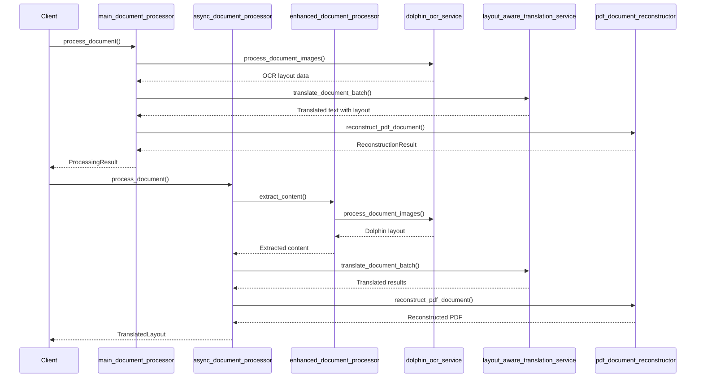
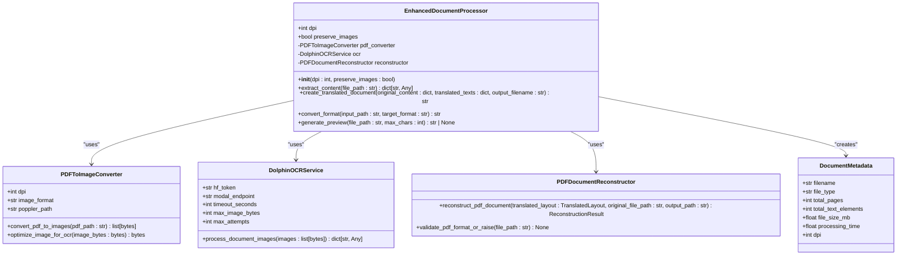
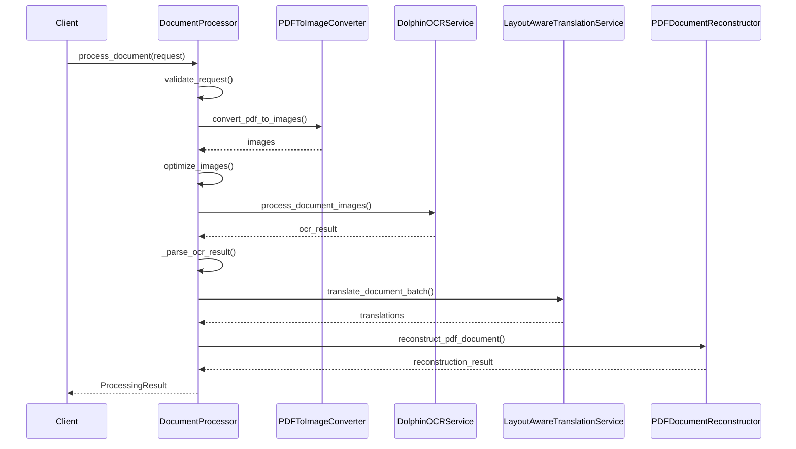
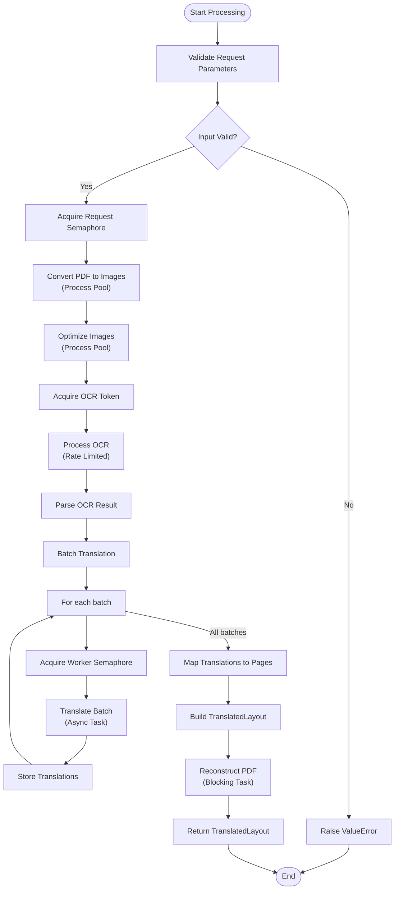
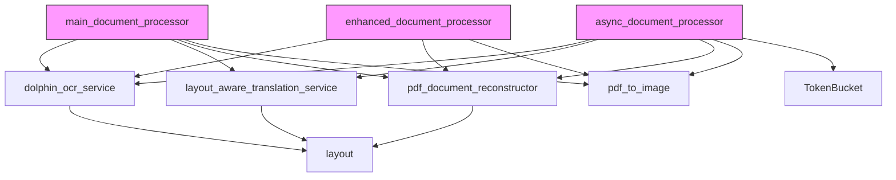

# Document Processing Service

<cite>
**Referenced Files in This Document**  
- [services/enhanced_document_processor.py](file://services/enhanced_document_processor.py)
- [services/main_document_processor.py](file://services/main_document_processor.py)
- [services/async_document_processor.py](file://services/async_document_processor.py)
- [services/dolphin_ocr_service.py](file://services/dolphin_ocr_service.py)
- [services/layout_aware_translation_service.py](file://services/layout_aware_translation_service.py)
- [services/pdf_document_reconstructor.py](file://services/pdf_document_reconstructor.py)
- [dolphin_ocr/layout.py](file://dolphin_ocr/layout.py)
</cite>

## Table of Contents
1. [Introduction](#introduction)
2. [Project Structure](#project-structure)
3. [Core Components](#core-components)
4. [Architecture Overview](#architecture-overview)
5. [Detailed Component Analysis](#detailed-component-analysis)
6. [Dependency Analysis](#dependency-analysis)
7. [Performance Considerations](#performance-considerations)
8. [Troubleshooting Guide](#troubleshooting-guide)
9. [Conclusion](#conclusion)

## Introduction
The Document Processing Service is a comprehensive system designed to handle end-to-end document translation with advanced layout preservation. This service orchestrates multiple components including OCR processing, layout analysis, translation, and PDF reconstruction to deliver high-fidelity translated documents that maintain the original formatting and visual structure. The system is built around three main processor types: the enhanced document processor for PDF-specific workflows, the main document processor as the primary entry point, and the async document processor for non-blocking concurrent operations.

## Project Structure
The project follows a modular architecture with clearly defined components organized in dedicated directories. The core functionality resides in the services directory, while supporting utilities and configurations are organized in separate modules.

**Diagram sources**
- [services/enhanced_document_processor.py](file://services/enhanced_document_processor.py)
- [services/main_document_processor.py](file://services/main_document_processor.py)
- [services/async_document_processor.py](file://services/async_document_processor.py)

**Section sources**
- [services/enhanced_document_processor.py](file://services/enhanced_document_processor.py)
- [services/main_document_processor.py](file://services/main_document_processor.py)
- [services/async_document_processor.py](file://services/async_document_processor.py)

## Core Components
The document processing service comprises three primary processor components that handle different aspects of the document translation pipeline. The enhanced_document_processor.py focuses on PDF-specific processing with advanced layout preservation, the main_document_processor.py serves as the central orchestrator for synchronous workflows, and the async_document_processor.py enables non-blocking, concurrent document handling. These components work together with specialized services for OCR, translation, and reconstruction to deliver a comprehensive document processing solution.

**Section sources**
- [services/enhanced_document_processor.py](file://services/enhanced_document_processor.py#L1-L398)
- [services/main_document_processor.py](file://services/main_document_processor.py#L1-L323)
- [services/async_document_processor.py](file://services/async_document_processor.py#L1-L390)

## Architecture Overview
The document processing service follows a modular, layered architecture that coordinates multiple specialized components to achieve end-to-end document translation with layout preservation. The system is designed to handle PDF documents through a pipeline that includes conversion to images, OCR processing, layout-aware translation, and PDF reconstruction.

**Diagram sources**
- [services/main_document_processor.py](file://services/main_document_processor.py#L1-L323)
- [services/async_document_processor.py](file://services/async_document_processor.py#L1-L390)
- [services/enhanced_document_processor.py](file://services/enhanced_document_processor.py#L1-L398)

## Detailed Component Analysis

### Enhanced Document Processor Analysis
The enhanced_document_processor.py component provides specialized PDF processing capabilities with comprehensive formatting preservation. It serves as the foundation for PDF-specific workflows, handling content extraction and document reconstruction while maintaining the original layout structure.

#### For Object-Oriented Components:

**Diagram sources**
- [services/enhanced_document_processor.py](file://services/enhanced_document_processor.py#L1-L398)

**Section sources**
- [services/enhanced_document_processor.py](file://services/enhanced_document_processor.py#L1-L398)

### Main Document Processor Analysis
The main_document_processor.py serves as the primary entry point for document processing workflows, orchestrating the complete pipeline from PDF conversion to final document reconstruction. It coordinates multiple services to deliver a seamless translation experience with comprehensive progress tracking and error handling.

#### For API/Service Components:

**Diagram sources**
- [services/main_document_processor.py](file://services/main_document_processor.py#L1-L323)

**Section sources**
- [services/main_document_processor.py](file://services/main_document_processor.py#L1-L323)

### Async Document Processor Analysis
The async_document_processor.py component enables non-blocking, concurrent document handling through asynchronous processing. It implements a sophisticated concurrency model that optimizes resource utilization while maintaining rate limits and handling various processing bottlenecks.

#### For Complex Logic Components:

**Diagram sources**
- [services/async_document_processor.py](file://services/async_document_processor.py#L1-L390)

**Section sources**
- [services/async_document_processor.py](file://services/async_document_processor.py#L1-L390)

## Dependency Analysis
The document processing service components have well-defined dependencies that enable their specialized functionality. The enhanced document processor depends on OCR, translation, and reconstruction services to handle PDF-specific workflows. The main document processor serves as the central orchestrator, coordinating all major components in a synchronous workflow. The async document processor builds upon these components while adding concurrency controls and rate limiting.

**Diagram sources**
- [services/enhanced_document_processor.py](file://services/enhanced_document_processor.py)
- [services/main_document_processor.py](file://services/main_document_processor.py)
- [services/async_document_processor.py](file://services/async_document_processor.py)

**Section sources**
- [services/enhanced_document_processor.py](file://services/enhanced_document_processor.py)
- [services/main_document_processor.py](file://services/main_document_processor.py)
- [services/async_document_processor.py](file://services/async_document_processor.py)

## Performance Considerations
The document processing service incorporates several performance optimization techniques to ensure efficient processing of documents. The async_document_processor.py implements concurrent processing using a process pool for CPU-bound tasks like PDF conversion and image optimization, while utilizing asyncio for IO-bound operations such as OCR requests and translation calls. The system employs batching strategies to minimize API calls and reduce overhead, with configurable batch sizes for translation operations.

The enhanced_document_processor.py and main_document_processor.py components implement lazy loading patterns, only processing document elements when necessary and caching intermediate results where appropriate. The OCR service includes rate limiting through a token bucket algorithm to prevent overwhelming external services while maintaining optimal throughput. Memory usage is controlled through streaming processing of large documents and timely cleanup of temporary resources.

For PDF reconstruction, the system uses ReportLab for rendering, which provides efficient text layout and font handling. The layout preservation engine employs heuristic-based text fitting algorithms that balance accuracy with performance, avoiding expensive font metric calculations while maintaining acceptable layout fidelity. Error handling is designed to be resilient, with graceful degradation when optional components are unavailable, ensuring that core functionality remains operational even when ancillary services fail.

## Troubleshooting Guide
When encountering issues with the document processing service, consider the following common problems and solutions:

**Section sources**
- [services/enhanced_document_processor.py](file://services/enhanced_document_processor.py#L1-L398)
- [services/main_document_processor.py](file://services/main_document_processor.py#L1-L323)
- [services/async_document_processor.py](file://services/async_document_processor.py#L1-L390)
- [services/dolphin_ocr_service.py](file://services/dolphin_ocr_service.py#L1-L375)

## Conclusion
The Document Processing Service provides a robust, scalable solution for end-to-end document translation with advanced layout preservation. By coordinating specialized components for OCR, translation, and PDF reconstruction, the system delivers high-fidelity translated documents that maintain the original formatting and visual structure. The architecture supports both synchronous and asynchronous processing models, enabling flexible deployment options from simple workflows to high-throughput server environments. With comprehensive error handling, performance optimization, and extensible design, the service offers a reliable foundation for document translation needs.
