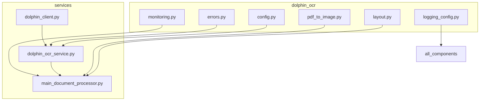
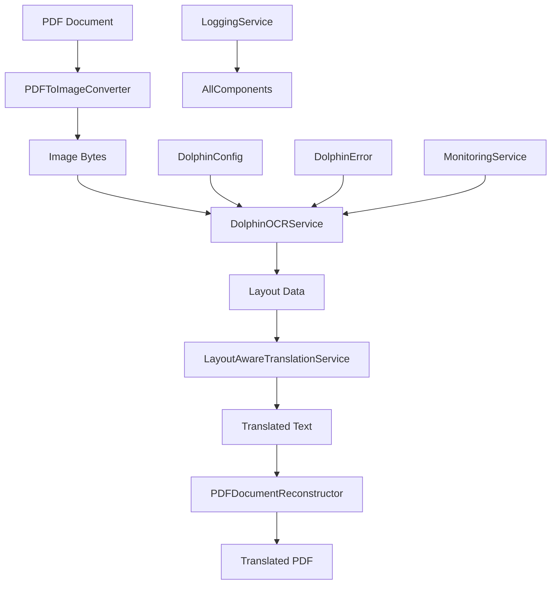
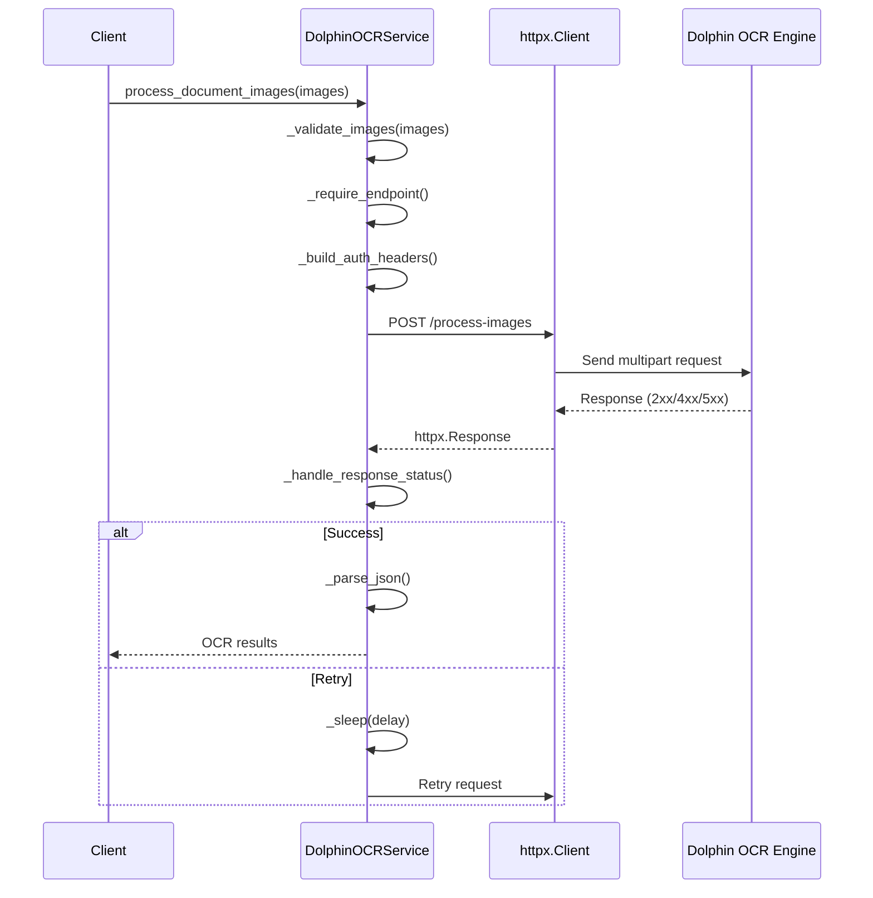
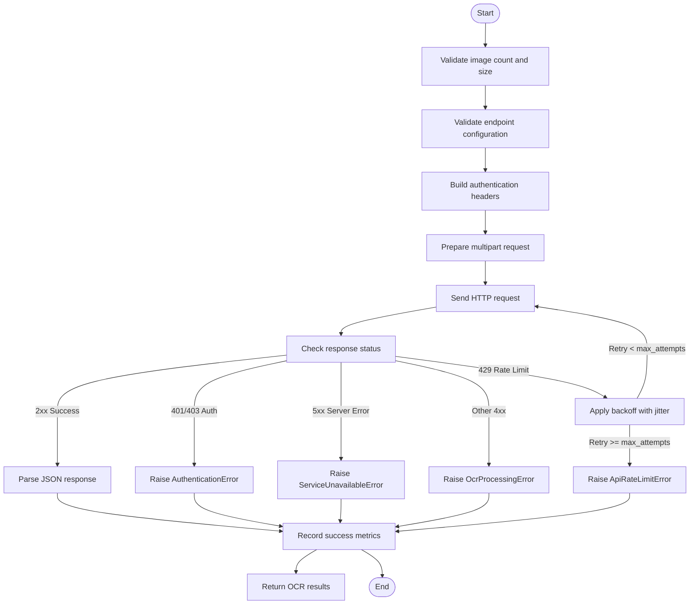
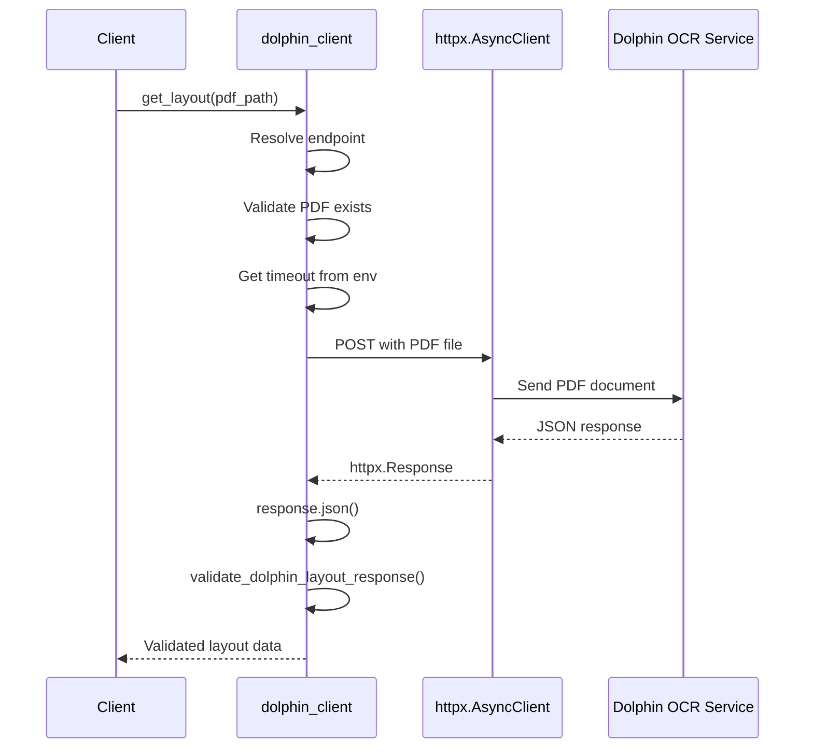
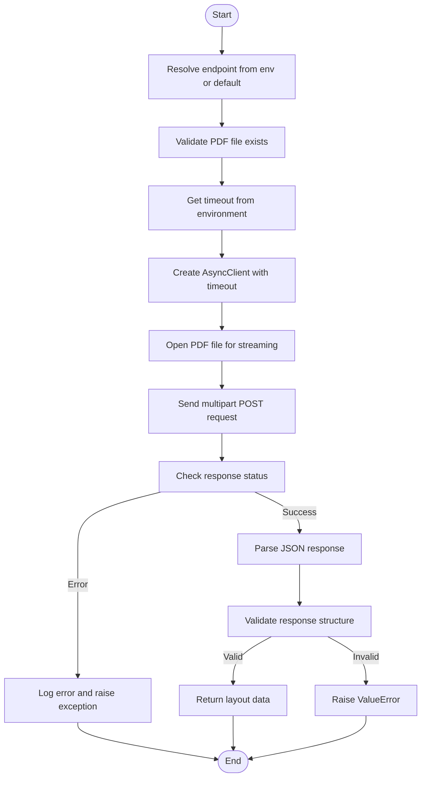
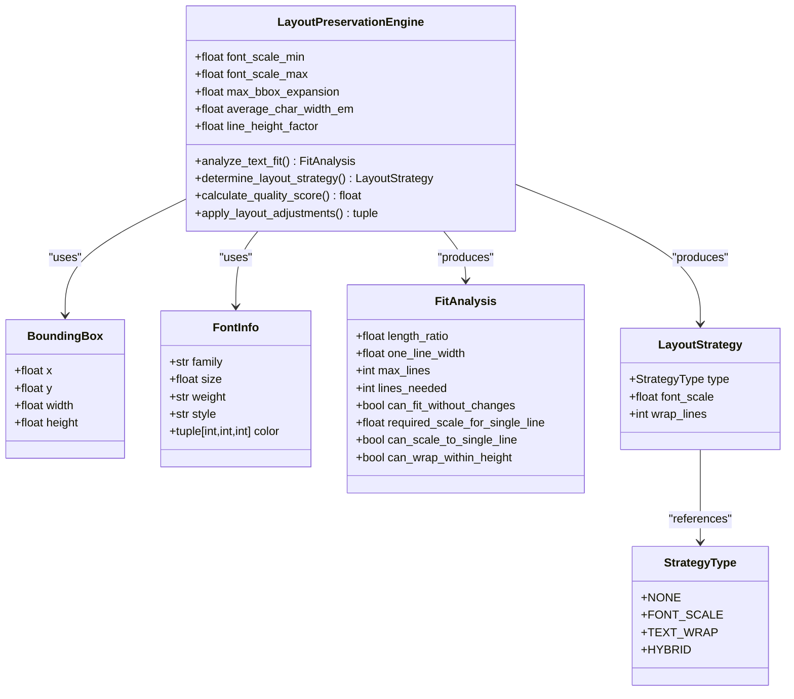
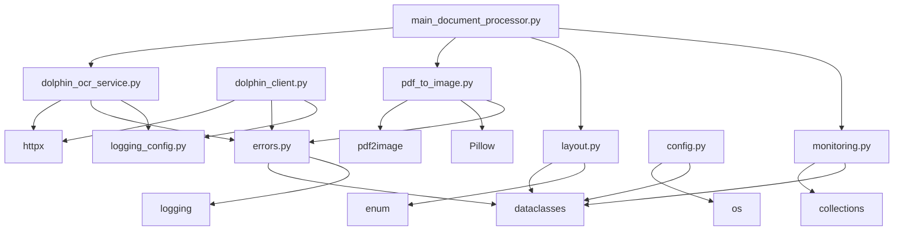

# OCR Integration Service

<cite>
**Referenced Files in This Document**  
- [dolphin_ocr_service.py](file://services/dolphin_ocr_service.py)
- [dolphin_client.py](file://services/dolphin_client.py)
- [layout.py](file://dolphin_ocr/layout.py)
- [config.py](file://dolphin_ocr/config.py)
- [errors.py](file://dolphin_ocr/errors.py)
- [pdf_to_image.py](file://dolphin_ocr/pdf_to_image.py)
- [main_document_processor.py](file://services/main_document_processor.py)
- [logging_config.py](file://dolphin_ocr/logging_config.py)
- [monitoring.py](file://dolphin_ocr/monitoring.py)
</cite>

## Table of Contents
1. [Introduction](#introduction)
2. [Project Structure](#project-structure)
3. [Core Components](#core-components)
4. [Architecture Overview](#architecture-overview)
5. [Detailed Component Analysis](#detailed-component-analysis)
6. [Dependency Analysis](#dependency-analysis)
7. [Performance Considerations](#performance-considerations)
8. [Troubleshooting Guide](#troubleshooting-guide)
9. [Conclusion](#conclusion)

## Introduction
The OCR Integration Service provides a robust interface between the application and the external Dolphin OCR system for extracting text and layout information from PDF documents. This documentation details the architecture, communication protocols, error handling, and performance characteristics of the OCR integration components. The service is designed to handle document processing workflows including PDF-to-image conversion, OCR text extraction, layout analysis, and downstream translation with layout preservation.

## Project Structure
The OCR integration components are organized across multiple directories with clear separation of concerns. The core OCR functionality resides in the `dolphin_ocr` package, while service integrations are located in the `services` directory. Configuration, error handling, logging, and monitoring components support the OCR workflow.

**Diagram sources**
- [dolphin_ocr](file://dolphin_ocr)
- [services](file://services)

**Section sources**
- [dolphin_ocr](file://dolphin_ocr)
- [services](file://services)

## Core Components
The OCR integration service consists of several key components that work together to process PDF documents and extract text with layout information. The DolphinOCRService handles communication with the external OCR engine, while supporting components manage configuration, error handling, image conversion, and layout analysis. The service abstracts low-level API interactions and provides a clean interface for document processing workflows.

**Section sources**
- [dolphin_ocr_service.py](file://services/dolphin_ocr_service.py)
- [dolphin_client.py](file://services/dolphin_client.py)
- [layout.py](file://dolphin_ocr/layout.py)

## Architecture Overview
The OCR integration architecture follows a layered approach with clear separation between service interfaces, processing logic, and supporting utilities. The system coordinates PDF conversion, OCR processing, translation, and document reconstruction through a well-defined pipeline.

**Diagram sources**
- [main_document_processor.py](file://services/main_document_processor.py)
- [dolphin_ocr_service.py](file://services/dolphin_ocr_service.py)
- [pdf_to_image.py](file://dolphin_ocr/pdf_to_image.py)

## Detailed Component Analysis

### Dolphin OCR Service Analysis
The DolphinOCRService provides a thin HTTP client interface to the Dolphin OCR Modal service, handling authentication, request formatting, response parsing, and error management. The service is designed to be endpoint-agnostic and safe to initialize without a configured endpoint, with validation performed at call time.

#### For API/Service Components:

**Diagram sources**
- [dolphin_ocr_service.py](file://services/dolphin_ocr_service.py#L150-L250)

#### For Complex Logic Components:

**Diagram sources**
- [dolphin_ocr_service.py](file://services/dolphin_ocr_service.py#L250-L350)

**Section sources**
- [dolphin_ocr_service.py](file://services/dolphin_ocr_service.py#L1-L375)

### Dolphin Client Analysis
The dolphin_client.py module provides an asynchronous client for the Dolphin PDF layout microservice, abstracting low-level API interactions and handling authentication, rate limiting, and retry logic. The client supports both local microservice and Modal Labs deployment endpoints.

#### For API/Service Components:

**Diagram sources**
- [dolphin_client.py](file://services/dolphin_client.py#L150-L200)

#### For Complex Logic Components:

**Diagram sources**
- [dolphin_client.py](file://services/dolphin_client.py#L50-L150)

**Section sources**
- [dolphin_client.py](file://services/dolphin_client.py#L1-L249)

### Layout Analysis Component
The layout.py module implements the layout preservation engine and supporting data models for text fit analysis, strategy determination, and quality scoring. It provides the foundation for maintaining document formatting during translation.

#### For Object-Oriented Components:

**Diagram sources**
- [layout.py](file://dolphin_ocr/layout.py#L50-L200)

**Section sources**
- [layout.py](file://dolphin_ocr/layout.py#L1-L410)

## Dependency Analysis
The OCR integration service has a well-defined dependency structure with clear separation between core functionality and supporting utilities. The components are designed to be loosely coupled while maintaining cohesive functionality.

**Diagram sources**
- [dolphin_ocr_service.py](file://services/dolphin_ocr_service.py)
- [dolphin_client.py](file://services/dolphin_client.py)
- [pdf_to_image.py](file://dolphin_ocr/pdf_to_image.py)
- [layout.py](file://dolphin_ocr/layout.py)
- [config.py](file://dolphin_ocr/config.py)
- [errors.py](file://dolphin_ocr/errors.py)
- [monitoring.py](file://dolphin_ocr/monitoring.py)

**Section sources**
- [dolphin_ocr_service.py](file://services/dolphin_ocr_service.py)
- [dolphin_client.py](file://services/dolphin_client.py)
- [pdf_to_image.py](file://dolphin_ocr/pdf_to_image.py)

## Performance Considerations
The OCR integration service includes several performance optimization strategies to handle large documents and maintain throughput. The system implements configurable batch processing, connection pooling, and memory-efficient PDF conversion to optimize resource utilization.

The DolphinOCRService includes performance counters for monitoring request metrics including total requests, successful requests, failed requests, and last duration. These metrics are recorded with structured logging to enable performance analysis and monitoring.

For large document processing, the system uses streaming PDF conversion with temporary files to reduce peak memory usage. The PDFToImageConverter renders pages to temporary files and streams them back as bytes rather than keeping entire documents in memory.

Configuration options allow tuning of performance parameters including:
- Maximum concurrent requests
- Processing timeout
- PDF DPI resolution
- Memory limits
- Batch size for document processing

The monitoring service tracks operation metrics and maintains a rolling window of recent events to compute error rates and percentile latencies, enabling proactive performance management.

**Section sources**
- [dolphin_ocr_service.py](file://services/dolphin_ocr_service.py#L20-L30)
- [config.py](file://dolphin_ocr/config.py#L50-L100)
- [monitoring.py](file://dolphin_ocr/monitoring.py)
- [pdf_to_image.py](file://dolphin_ocr/pdf_to_image.py#L50-L100)

## Troubleshooting Guide
The OCR integration service implements comprehensive error handling and validation to assist with troubleshooting common issues. The system maps low-level exceptions to standardized error codes with descriptive messages and context information.

Common issues and their solutions:

**Authentication Errors (DOLPHIN_003)**
- Ensure HF_TOKEN environment variable is set
- Verify the token has appropriate permissions
- Check for token expiration

**Rate Limiting (DOLPHIN_001)**
- Implement exponential backoff with jitter
- Monitor usage against quota limits
- Consider upgrading service tier if limits are consistently reached

**Service Unavailability (DOLPHIN_002)**
- Check endpoint URL configuration
- Verify network connectivity
- Monitor service health status
- Implement retry logic with appropriate delays

**Processing Timeout (DOLPHIN_004)**
- Increase DOLPHIN_TIMEOUT_SECONDS configuration
- Optimize document complexity
- Split large documents into smaller sections
- Verify sufficient system resources

**Invalid Document Format (DOLPHIN_005)**
- Ensure file is a valid PDF with %PDF- header
- Convert unsupported formats to PDF
- Check file integrity and corruption

**Encrypted PDFs (DOLPHIN_014)**
- Decrypt PDF before processing
- Use PDF tools to remove encryption
- Verify document is not password-protected

The error handling strategy includes context redaction to prevent sensitive information leakage while maintaining diagnostic value. Error responses include recoverability hints, retry recommendations, and estimated recovery times to facilitate automated recovery.

**Section sources**
- [errors.py](file://dolphin_ocr/errors.py)
- [dolphin_ocr_service.py](file://services/dolphin_ocr_service.py#L250-L350)
- [pdf_to_image.py](file://dolphin_ocr/pdf_to_image.py#L200-L250)

## Conclusion
The OCR Integration Service provides a robust and scalable solution for extracting text and layout information from PDF documents through the Dolphin OCR system. The architecture emphasizes reliability, performance, and maintainability through well-defined components, comprehensive error handling, and extensible design.

Key strengths of the implementation include:
- Clear separation of concerns between service interfaces and processing logic
- Comprehensive error handling with standardized error codes
- Memory-efficient processing of large documents
- Configurable performance parameters
- Extensive monitoring and logging capabilities
- Support for both synchronous and asynchronous operations

The service successfully abstracts the complexities of OCR engine communication while providing rich functionality for layout preservation and document reconstruction. The modular design allows for easy maintenance and future enhancements to support additional OCR engines or processing requirements.
