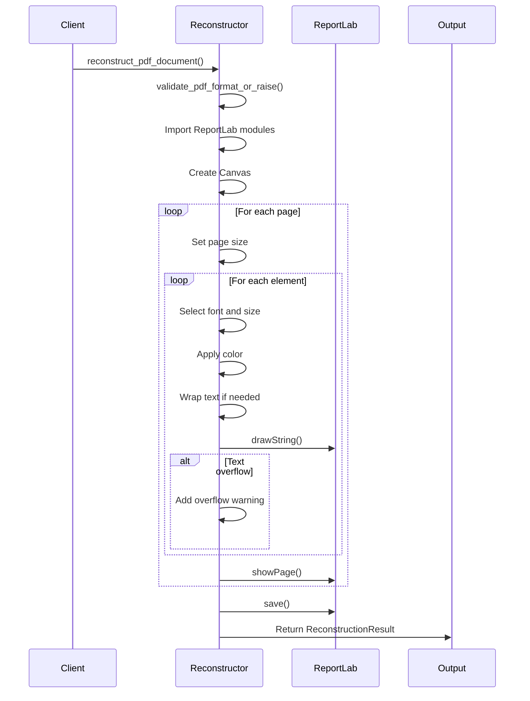
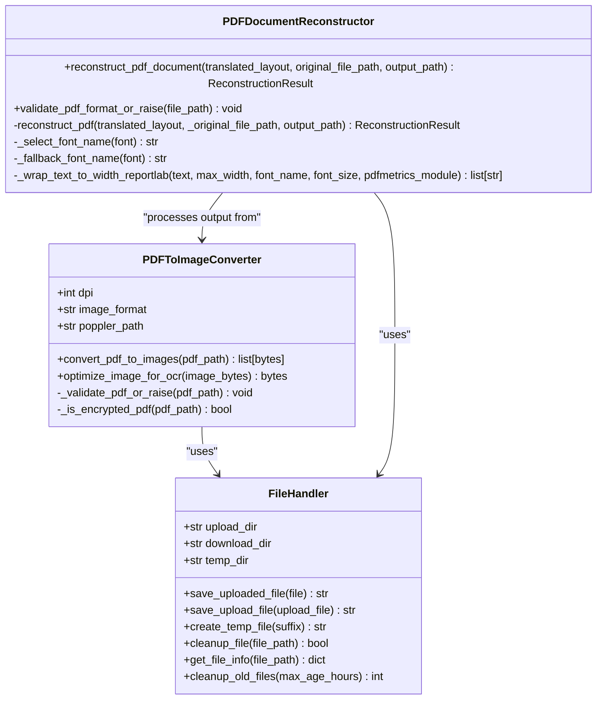
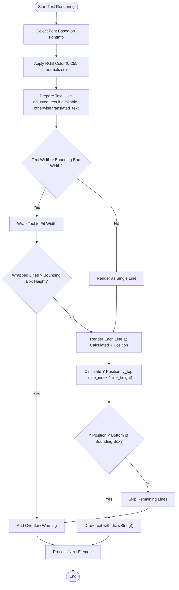
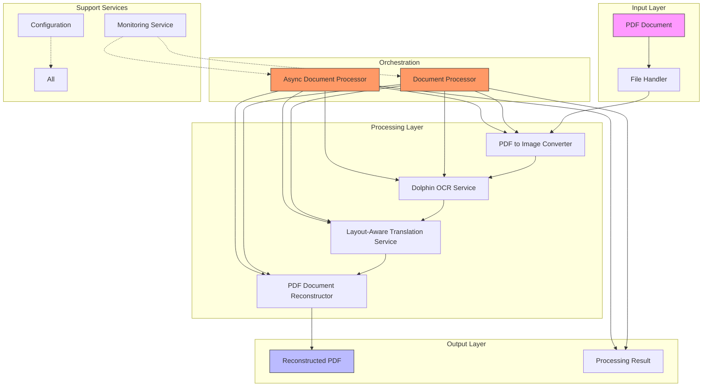

# PDF Reconstruction Service

<cite>
**Referenced Files in This Document**  
- [pdf_document_reconstructor.py](file://services/pdf_document_reconstructor.py)
- [pdf_to_image.py](file://dolphin_ocr/pdf_to_image.py)
- [file_handler.py](file://utils/file_handler.py)
- [layout.py](file://dolphin_ocr/layout.py)
- [main_document_processor.py](file://services/main_document_processor.py)
- [async_document_processor.py](file://services/async_document_processor.py)
- [enhanced_document_processor.py](file://services/enhanced_document_processor.py)
</cite>

## Table of Contents
1. [Introduction](#introduction)
2. [Core Components](#core-components)
3. [PDF Reconstruction Process](#pdf-reconstruction-process)
4. [Integration with PDF to Image Conversion](#integration-with-pdf-to-image-conversion)
5. [File Management and Temporary Assets](#file-management-and-temporary-assets)
6. [Text Alignment and Visual Fidelity](#text-alignment-and-visual-fidelity)
7. [Font Handling and Text Rendering](#font-handling-and-text-rendering)
8. [Performance Optimization](#performance-optimization)
9. [Error Handling and Quality Metrics](#error-handling-and-quality-metrics)
10. [Architecture Overview](#architecture-overview)

## Introduction
The PDF Reconstruction Service is a critical component of the document processing pipeline that generates output PDFs with precise overlay of translated text on original document images. This service uses ReportLab to render text with exact positioning, font matching, and color preservation to maintain the visual fidelity of the original document. The reconstruction process is designed to handle complex layout scenarios while ensuring high-quality output with minimal file size. The service integrates with other components for image generation, file management, and layout analysis to provide a comprehensive solution for document translation and reconstruction.

## Core Components

The PDF reconstruction service consists of several key components that work together to transform translated text into properly formatted PDF documents. The main component is the PDFDocumentReconstructor class, which handles the actual PDF generation using ReportLab. This class works in conjunction with supporting components for layout analysis, image conversion, and file management. The service processes translated text elements with their associated bounding boxes, font information, and styling to recreate the original document's appearance. It also includes comprehensive error handling and quality metrics to ensure reliable operation and output quality assessment.

**Section sources**
- [pdf_document_reconstructor.py](file://services/pdf_document_reconstructor.py#L1-L486)
- [layout.py](file://dolphin_ocr/layout.py#L1-L410)

## PDF Reconstruction Process

The PDF reconstruction process begins with the validation of the input PDF format to ensure it is a readable, non-encrypted document. The PDFDocumentReconstructor class performs basic format checks including extension validation, file existence verification, and header validation to confirm the file begins with the %PDF- signature. For encrypted PDF detection, the service attempts to use pypdf when available, with graceful degradation to a warning if the library is not installed. Once validation passes, the reconstruction process creates a ReportLab canvas and processes each page of the translated layout.

For each page, the service determines the appropriate page size based on either explicit dimensions provided in the TranslatedPage object or by calculating the maximum bounding box coordinates from the elements on the page. The rendering process iterates through each TranslatedElement, setting the appropriate font, size, and color before drawing the text at the specified coordinates. Text wrapping is handled internally when the content exceeds the width of its bounding box, with overflow detection to identify content that doesn't fit within the height constraints.



**Diagram sources**
- [pdf_document_reconstructor.py](file://services/pdf_document_reconstructor.py#L150-L350)

**Section sources**
- [pdf_document_reconstructor.py](file://services/pdf_document_reconstructor.py#L150-L486)

## Integration with PDF to Image Conversion

The PDF reconstruction service integrates with the PDF to image conversion component to create the background for the reconstructed document. The PDFToImageConverter class converts PDF pages into high-resolution images suitable for OCR processing and as backgrounds for the reconstructed PDF. This converter uses pdf2image with Poppler to render pages at configurable DPI (default 300) and image format (default PNG). The conversion process is memory-efficient, using temporary files to avoid keeping entire documents in memory during processing.

The integration between these components is orchestrated through the main document processing pipeline, where the PDFToImageConverter generates images that are processed by OCR services to extract text and layout information. This information is then translated and passed to the PDFDocumentReconstructor for the final output generation. The converter also includes optimization features such as grayscale conversion, pixel normalization, and mild sharpening to enhance OCR accuracy while maintaining visual quality.



**Diagram sources**
- [pdf_to_image.py](file://dolphin_ocr/pdf_to_image.py#L1-L284)
- [pdf_document_reconstructor.py](file://services/pdf_document_reconstructor.py#L1-L486)
- [file_handler.py](file://utils/file_handler.py#L1-L205)

**Section sources**
- [pdf_to_image.py](file://dolphin_ocr/pdf_to_image.py#L1-L284)
- [pdf_document_reconstructor.py](file://services/pdf_document_reconstructor.py#L1-L486)

## File Management and Temporary Assets

The file management system handles all aspects of file operations for the document processing pipeline. The FileHandler class manages three primary directories: uploads for incoming documents, downloads for processed outputs, and temp for temporary assets. During the reconstruction process, temporary files are created for intermediate processing steps, such as image conversion and OCR processing. The file handler ensures proper cleanup of these temporary assets to prevent disk space exhaustion.

The service includes automated cleanup functionality through the cleanup_old_files method, which removes files older than a specified age threshold (default 24 hours). This prevents the accumulation of stale files while allowing sufficient time for users to access their processed documents. The file handler also provides utilities for saving uploaded files, creating temporary files with unique identifiers, and retrieving file information for monitoring and debugging purposes.

**Section sources**
- [file_handler.py](file://utils/file_handler.py#L1-L205)

## Text Alignment and Visual Fidelity

The PDF reconstruction service maintains visual fidelity by precisely aligning translated text with the original document's bounding boxes. The TranslatedElement class contains BoundingBox objects that define the exact position, width, and height for each text element. During rendering, the service uses these coordinates to position text at the correct location on the page, ensuring that the layout matches the original document as closely as possible.

The service handles text alignment through a combination of font scaling, text wrapping, and overflow detection. When translated text is longer than the original, the service first attempts to scale the font size down within acceptable limits (default 0.6-1.2x) to fit the content. If scaling is insufficient, the text is wrapped to multiple lines within the bounding box height. The LayoutPreservationEngine analyzes the fit of translated text and determines the optimal strategy to maintain visual consistency while preserving readability.



**Diagram sources**
- [pdf_document_reconstructor.py](file://services/pdf_document_reconstructor.py#L250-L350)
- [layout.py](file://dolphin_ocr/layout.py#L1-L410)

**Section sources**
- [pdf_document_reconstructor.py](file://services/pdf_document_reconstructor.py#L250-L350)
- [layout.py](file://dolphin_ocr/layout.py#L1-L410)

## Font Handling and Text Rendering

Font handling is a critical aspect of maintaining visual fidelity in the reconstructed PDF. The PDFDocumentReconstructor includes sophisticated font mapping logic that converts font family, weight, and style information into the appropriate ReportLab font names. The _select_font_name method handles common font families like Times, Courier, and Helvetica, mapping combinations of bold and italic styles to the correct PostScript font names.

When a specified font is not available in ReportLab, the service implements a fallback mechanism through the _fallback_font_name method. This ensures that text is always rendered, even if the exact font is unavailable. The service also handles font size validation, ensuring that sizes are at least 1.0 point to prevent rendering issues. Text rendering supports RGB color preservation by converting 0-255 color values to the 0.0-1.0 range used by ReportLab.

The text wrapping algorithm uses ReportLab's stringWidth method to accurately measure text dimensions and perform greedy wrapping. When a word exceeds the bounding box width, the algorithm performs character-level wrapping to prevent horizontal overflow. Line height is calculated as 1.2 times the font size to maintain proper vertical spacing, with overflow detection to identify content that exceeds the bounding box height.

**Section sources**
- [pdf_document_reconstructor.py](file://services/pdf_document_reconstructor.py#L350-L450)

## Performance Optimization

The PDF reconstruction service includes several performance optimizations for efficient processing of multi-page documents. The main_document_processor.py and async_document_processor.py modules implement different approaches to optimize throughput. The synchronous processor uses batch processing for translation tasks to minimize API calls, while the asynchronous processor leverages asyncio and ProcessPoolExecutor for concurrent processing of CPU-bound and I/O-bound operations.

For large documents, the service processes pages sequentially but optimizes memory usage by not keeping all page data in memory simultaneously. The PDFToImageConverter uses temporary files and streaming to minimize memory footprint during image conversion. The reconstruction process itself is optimized by using ReportLab's efficient text rendering methods and minimizing expensive operations like font loading.

The async_document_processor.py implements a token bucket algorithm for rate limiting OCR requests, preventing overwhelming external services. It also uses semaphores to limit concurrent requests and process pools to parallelize CPU-intensive operations like PDF to image conversion. These optimizations enable the service to handle multiple documents concurrently while maintaining system stability.

```mermaid
graph TD
subgraph "Processing Pipeline"
A[PDF Input] --> B[PDF to Image Conversion]
B --> C[OCR Processing]
C --> D[Translation]
D --> E[PDF Reconstruction]
end
subgraph "Optimization Strategies"
F[Batch Processing] --> D
G[Async Operations] --> C
H[Process Pool] --> B
I[Token Bucket] --> C
J[Memory Streaming] --> B
end
subgraph "Performance Metrics"
K[Processing Time] --> E
L[Element Count] --> E
M[Overflow Rate] --> E
N[Font Fallback Rate] --> E
end
Optimization Strategies --> Processing Pipeline
Performance Metrics --> E
```

**Diagram sources**
- [main_document_processor.py](file://services/main_document_processor.py#L1-L323)
- [async_document_processor.py](file://services/async_document_processor.py#L1-L390)

**Section sources**
- [main_document_processor.py](file://services/main_document_processor.py#L1-L323)
- [async_document_processor.py](file://services/async_document_processor.py#L1-L390)

## Error Handling and Quality Metrics

The PDF reconstruction service implements comprehensive error handling and quality assessment. The service defines specific exception types like UnsupportedFormatError and DocumentReconstructionError to provide clear error messages for different failure scenarios. Warnings are used for non-critical issues like font unavailability or encryption check failures, allowing the process to continue while informing users of potential quality impacts.

The ReconstructionResult object includes detailed quality metrics that assess the success of the reconstruction process. These metrics include the overflow rate (percentage of text elements that exceeded their bounding box height) and font fallback rate (percentage of elements that required font substitution). These metrics help identify documents that may require manual review due to potential layout issues.

The service also includes validation at multiple levels, from basic file format checks to detailed content validation. The PDFToImageConverter performs its own validation of PDF files before conversion, and the PDFDocumentReconstructor validates the input PDF before reconstruction. This layered validation approach ensures that errors are caught early in the process, preventing unnecessary processing of invalid documents.

**Section sources**
- [pdf_document_reconstructor.py](file://services/pdf_document_reconstructor.py#L1-L150)
- [pdf_to_image.py](file://dolphin_ocr/pdf_to_image.py#L1-L100)

## Architecture Overview

The PDF reconstruction service is part of a comprehensive document processing architecture that integrates multiple components for end-to-end document translation. The architecture follows a pipeline model where documents flow through sequential processing stages: PDF to image conversion, OCR extraction, layout-aware translation, and PDF reconstruction. Each stage is implemented as a separate, reusable component with well-defined interfaces.

The core of the architecture is the document processor classes (DocumentProcessor, AsyncDocumentProcessor, and EnhancedDocumentProcessor) that orchestrate the workflow by coordinating the various services. These processors handle the sequencing of operations, error propagation, progress reporting, and result aggregation. The modular design allows different processor implementations to share the same underlying services while providing different concurrency models and feature sets.

The service dependencies are carefully managed to minimize coupling between components. Heavy dependencies like ReportLab and pdf2image are imported lazily to reduce startup time and memory usage. Configuration is externalized through parameters and settings files, allowing easy customization of processing behavior without code changes. The architecture supports both synchronous and asynchronous processing models, enabling deployment in different environments with varying performance requirements.



**Diagram sources**
- [main_document_processor.py](file://services/main_document_processor.py#L1-L323)
- [async_document_processor.py](file://services/async_document_processor.py#L1-L390)
- [enhanced_document_processor.py](file://services/enhanced_document_processor.py#L1-L398)

**Section sources**
- [main_document_processor.py](file://services/main_document_processor.py#L1-L323)
- [async_document_processor.py](file://services/async_document_processor.py#L1-L390)
- [enhanced_document_processor.py](file://services/enhanced_document_processor.py#L1-L398)
