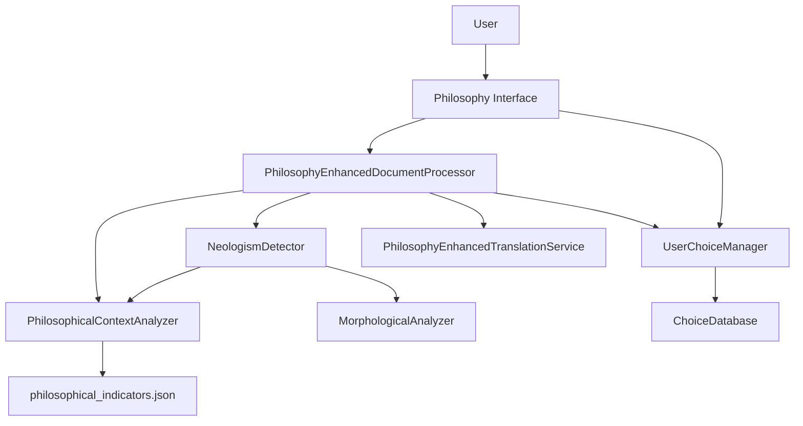
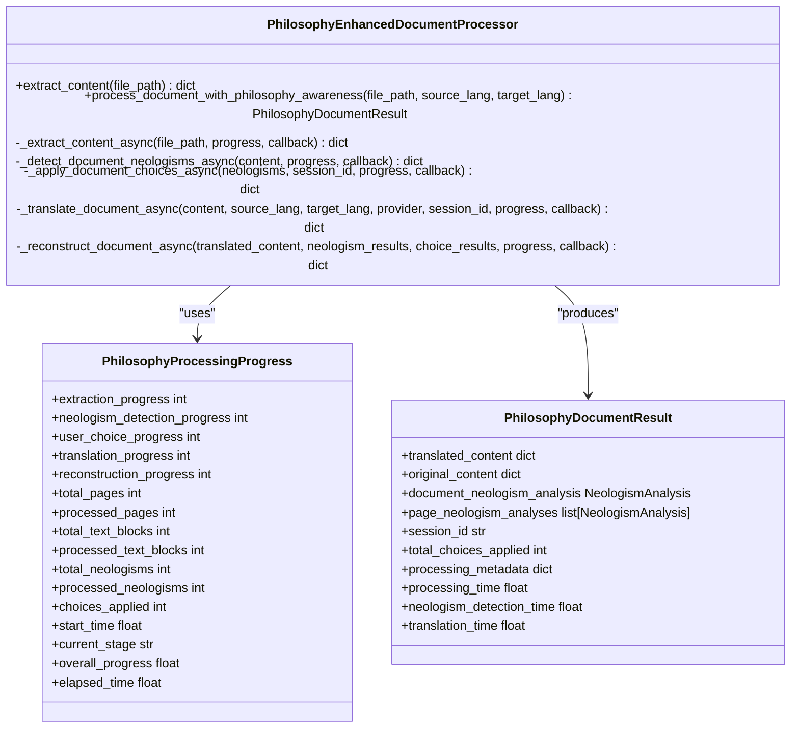
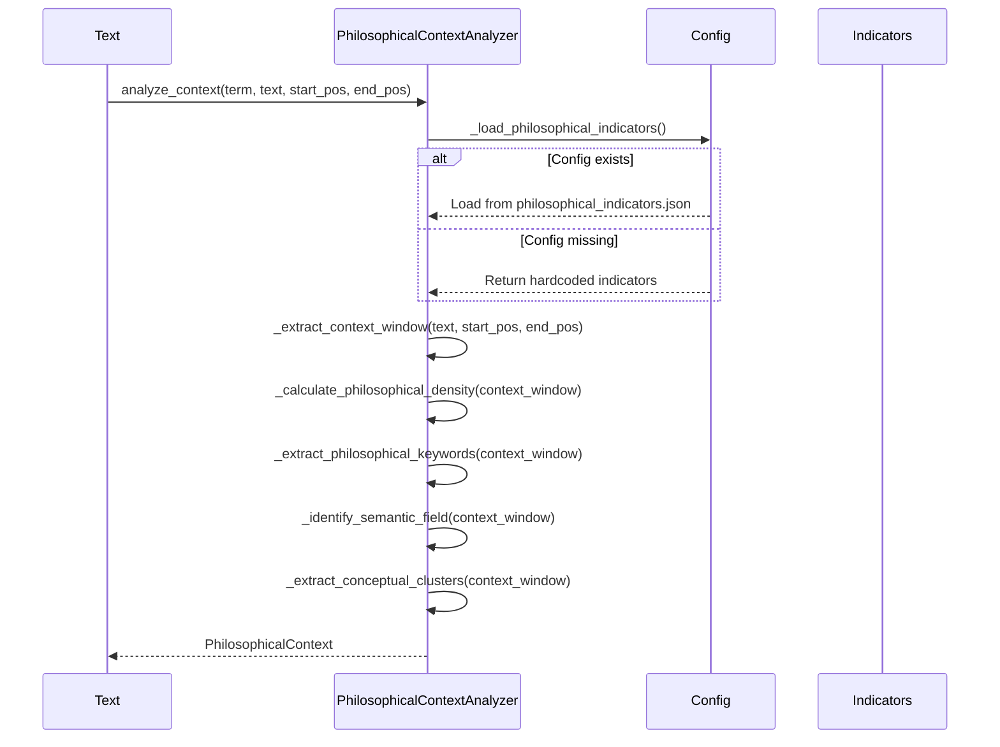
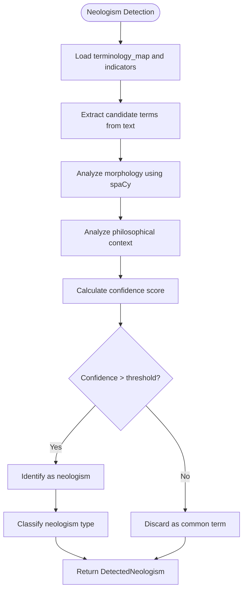
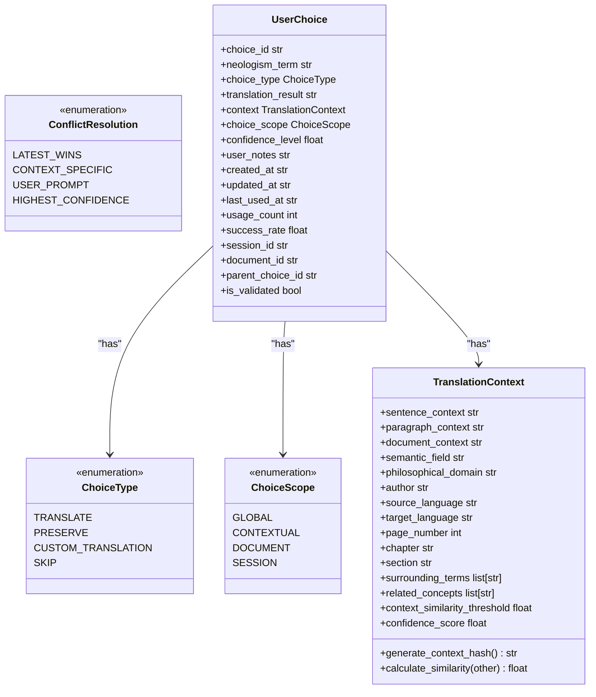
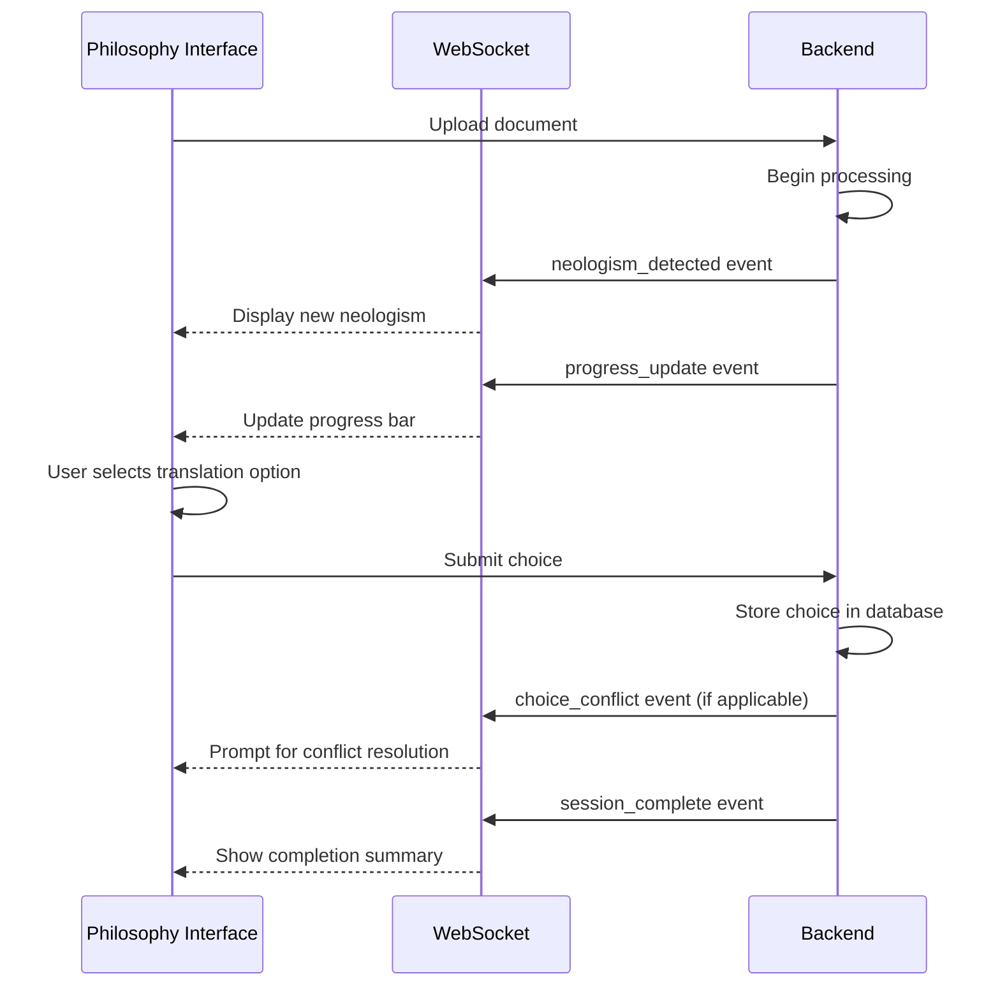
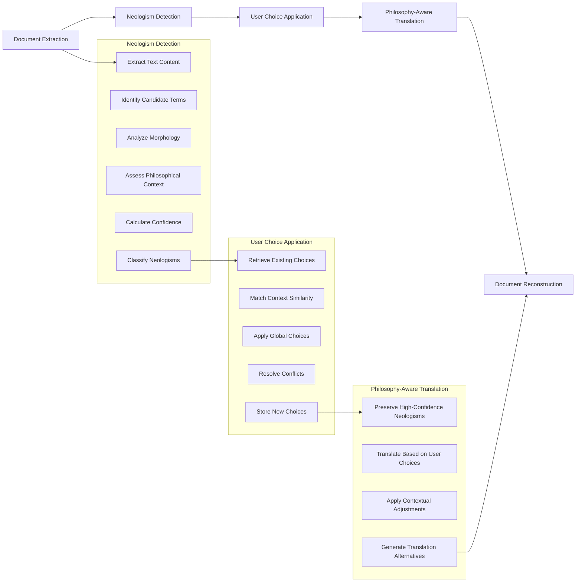

# Philosophy-Enhanced Processing

<cite>
**Referenced Files in This Document**  
- [philosophy_enhanced_document_processor.py](file://services/philosophy_enhanced_document_processor.py)
- [philosophical_context_analyzer.py](file://services/philosophical_context_analyzer.py)
- [neologism_detector.py](file://services/neologism_detector.py)
- [user_choice_models.py](file://models/user_choice_models.py)
- [philosophy_interface.html](file://templates/philosophy_interface.html)
- [philosophy_interface.js](file://static/philosophy_interface.js)
</cite>

## Table of Contents
1. [Introduction](#introduction)
2. [Core Architecture](#core-architecture)
3. [Philosophy-Enhanced Document Processor](#philosophy-enhanced-document-processor)
4. [Philosophical Context Analysis](#philosophical-context-analysis)
5. [Neologism Detection System](#neologism-detection-system)
6. [User Choice Management](#user-choice-management)
7. [Philosophy Interface Workflow](#philosophy-interface-workflow)
8. [Processing Workflow](#processing-workflow)
9. [Context-Aware Translation Examples](#context-aware-translation-examples)
10. [Challenges in Philosophical Translation](#challenges-in-philosophical-translation)

## Introduction
The Philosophy-Enhanced Processing system is designed to handle the translation of complex philosophical texts with specialized capabilities for neologism detection, context-aware analysis, and user-driven decision making. This system extends the core document processing pipeline with advanced features specifically tailored for philosophical discourse, where literal translation often fails to capture nuanced meanings and newly coined terms are common. The architecture integrates linguistic analysis, philosophical domain knowledge, and persistent user preferences to deliver semantically accurate translations that preserve the integrity of philosophical concepts.

## Core Architecture
The philosophy-enhanced processing system follows a modular architecture with clearly defined components that work together to analyze and translate philosophical texts. The system is built around a central document processor that coordinates between specialized analysis engines, user choice management, and translation services.

**Diagram sources**
- [philosophy_enhanced_document_processor.py](file://services/philosophy_enhanced_document_processor.py#L1-L50)
- [neologism_detector.py](file://services/neologism_detector.py#L1-L30)
- [philosophical_context_analyzer.py](file://services/philosophical_context_analyzer.py#L1-L20)

**Section sources**
- [philosophy_enhanced_document_processor.py](file://services/philosophy_enhanced_document_processor.py#L1-L100)
- [neologism_detector.py](file://services/neologism_detector.py#L1-L50)

## Philosophy-Enhanced Document Processor
The PhilosophyEnhancedDocumentProcessor extends the core document processing functionality with specialized handling for philosophical texts. It orchestrates the entire processing pipeline, from document extraction to final reconstruction, while maintaining comprehensive progress tracking and integration with specialized analysis components.

The processor implements a multi-stage workflow that begins with content extraction and proceeds through neologism detection, user choice application, philosophy-aware translation, and document reconstruction. Each stage is designed to handle the unique challenges of philosophical texts, including complex conceptual relationships and newly coined terminology.

**Diagram sources**
- [philosophy_enhanced_document_processor.py](file://services/philosophy_enhanced_document_processor.py#L60-L200)
- [philosophy_enhanced_document_processor.py](file://services/philosophy_enhanced_document_processor.py#L200-L300)

**Section sources**
- [philosophy_enhanced_document_processor.py](file://services/philosophy_enhanced_document_processor.py#L1-L400)

## Philosophical Context Analysis
The PhilosophicalContextAnalyzer plays a crucial role in identifying key philosophical concepts and terminology within texts. It uses a combination of configuration-driven indicators and linguistic analysis to detect philosophical content and assess its contextual significance.

The analyzer loads philosophical indicators from config/philosophical_indicators.json, which contains a comprehensive list of philosophical terms organized by category. When the configuration file is unavailable, the system falls back to a hardcoded set of indicators covering core philosophical domains such as metaphysics, epistemology, ethics, and phenomenology.

**Diagram sources**
- [philosophical_context_analyzer.py](file://services/philosophical_context_analyzer.py#L1-L100)
- [config/philosophical_indicators.json](file://config/philosophical_indicators.json)

**Section sources**
- [philosophical_context_analyzer.py](file://services/philosophical_context_analyzer.py#L1-L200)

## Neologism Detection System
The NeologismDetector is responsible for identifying and managing newly coined terms in philosophical texts. It integrates multiple analysis techniques, including morphological analysis, philosophical context assessment, and confidence scoring, to accurately detect potential neologisms.

The detector uses lazy loading for its components, initializing spaCy models and other resources only when needed. This approach optimizes resource usage while maintaining the ability to perform sophisticated linguistic analysis. The system can fall back to basic analysis when spaCy is unavailable, ensuring robustness across different deployment environments.

**Diagram sources**
- [neologism_detector.py](file://services/neologism_detector.py#L1-L150)
- [models/neologism_models.py](file://models/neologism_models.py#L1-L50)

**Section sources**
- [neologism_detector.py](file://services/neologism_detector.py#L1-L300)

## User Choice Management
The user choice system enables persistent storage and application of user decisions regarding neologism translation. The ChoiceType enum defines the available options: TRANSLATE, PRESERVE, CUSTOM_TRANSLATION, and SKIP. Users can specify the scope of their choices through the ChoiceScope enum, which includes GLOBAL, CONTEXTUAL, DOCUMENT, and SESSION levels.

The TranslationContext class captures rich contextual information about each neologism, including semantic fields, philosophical domains, author information, and surrounding terms. This context enables the system to apply user choices intelligently across similar situations, maintaining consistency in translation approaches.

**Diagram sources**
- [user_choice_models.py](file://models/user_choice_models.py#L1-L150)
- [user_choice_models.py](file://models/user_choice_models.py#L150-L300)

**Section sources**
- [user_choice_models.py](file://models/user_choice_models.py#L1-L400)

## Philosophy Interface Workflow
The philosophy interface provides a user-friendly environment for reviewing detected neologisms and making translation decisions. Built with HTML, CSS, and JavaScript, the interface connects to the backend through WebSocket for real-time updates during document processing.

The interface features multiple tabs for neologism review, terminology management, philosophy settings, and session analytics. Users can search, filter, and perform batch operations on detected neologisms, making the review process efficient even for documents with numerous specialized terms.

**Diagram sources**
- [philosophy_interface.html](file://templates/philosophy_interface.html#L1-L100)
- [philosophy_interface.js](file://static/philosophy_interface.js#L1-L50)

**Section sources**
- [philosophy_interface.html](file://templates/philosophy_interface.html#L1-L400)
- [philosophy_interface.js](file://static/philosophy_interface.js#L1-L300)

## Processing Workflow
The philosophy-enhanced document processing workflow follows a systematic approach to ensure comprehensive analysis and accurate translation of philosophical texts. The process begins with document extraction and proceeds through multiple specialized stages before final reconstruction.

**Diagram sources**
- [philosophy_enhanced_document_processor.py](file://services/philosophy_enhanced_document_processor.py#L400-L700)

**Section sources**
- [philosophy_enhanced_document_processor.py](file://services/philosophy_enhanced_document_processor.py#L400-L730)

## Context-Aware Translation Examples
The system's context-aware translation capabilities enable more accurate handling of philosophical constructs by considering the surrounding text, authorial intent, and conceptual relationships. For example, when processing a text by Ludwig Klages, the system can recognize his specific terminology and apply appropriate translation strategies based on user preferences and historical choices.

In cases where a term appears in multiple contexts with different meanings, the system presents translation alternatives through the philosophy interface, allowing users to select the most appropriate rendering for each occurrence. This approach preserves the nuance of philosophical discourse while providing users with control over the translation process.

The integration with user_choice_models.py ensures that decisions made during one session can inform future translations, creating a personalized translation profile that evolves with the user's preferences and expertise.

**Section sources**
- [philosophy_enhanced_document_processor.py](file://services/philosophy_enhanced_document_processor.py#L400-L730)
- [user_choice_models.py](file://models/user_choice_models.py#L1-L400)

## Challenges in Philosophical Translation
Balancing literal translation with interpretive accuracy presents significant challenges in philosophical discourse. The system addresses these challenges through a multi-faceted approach that combines automated analysis with user guidance.

One key challenge is the preservation of neologisms that carry specific philosophical meanings. The system uses confidence scoring and philosophical context analysis to determine when a term should be preserved in its original form versus translated. High-confidence neologisms in strong philosophical contexts are typically preserved, while terms with lower confidence or weaker philosophical associations may be translated.

Another challenge involves handling terms that have multiple valid translations depending on context. The system's contextual analysis and user choice management enable nuanced decision-making, allowing different translations for the same term in different philosophical contexts. This approach respects the complexity of philosophical language while providing users with transparent control over the translation process.

**Section sources**
- [philosophy_enhanced_document_processor.py](file://services/philosophy_enhanced_document_processor.py#L1-L730)
- [philosophical_context_analyzer.py](file://services/philosophical_context_analyzer.py#L1-L390)
- [neologism_detector.py](file://services/neologism_detector.py#L1-L1090)
