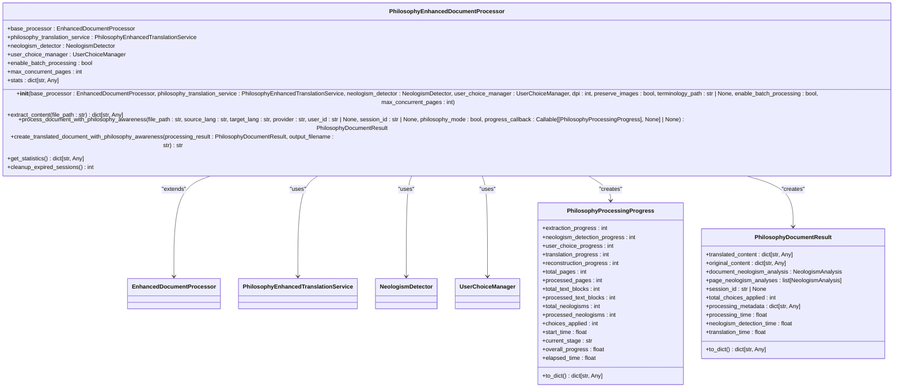

# Service Architecture

<cite>
**Referenced Files in This Document**  
- [services/enhanced_document_processor.py](file://services/enhanced_document_processor.py)
- [services/dolphin_ocr_service.py](file://services/dolphin_ocr_service.py)
- [services/layout_aware_translation_service.py](file://services/layout_aware_translation_service.py)
- [services/pdf_document_reconstructor.py](file://services/pdf_document_reconstructor.py)
- [services/philosophy_enhanced_document_processor.py](file://services/philosophy_enhanced_document_processor.py)
- [services/main_document_processor.py](file://services/main_document_processor.py)
- [config/settings.py](file://config/settings.py)
- [api/routes.py](file://api/routes.py)
</cite>

## Table of Contents
1. [Introduction](#introduction)
2. [Service Layer Overview](#service-layer-overview)
3. [Core Service Components](#core-service-components)
4. [Enhanced Document Processor](#enhanced-document-processor)
5. [Dolphin OCR Service](#dolphin-ocr-service)
6. [Layout-Aware Translation Service](#layout-aware-translation-service)
7. [PDF Document Reconstructor](#pdf-document-reconstructor)
8. [Philosophy-Enhanced Document Processor](#philosophy-enhanced-document-processor)
9. [Service Dependencies and Injection](#service-dependencies-and-injection)
10. [Service Interaction Patterns](#service-interaction-patterns)
11. [Error Handling and Retry Mechanisms](#error-handling-and-retry-mechanisms)
12. [Performance Considerations](#performance-considerations)

## Introduction
The PhenomenalLayout service layer implements a modular architecture where each service encapsulates a specific business capability following the Service Pattern. This documentation details the core services responsible for document processing, from OCR extraction to layout-preserving translation and PDF reconstruction. The architecture emphasizes dependency injection, with services being instantiated and passed to orchestrators that coordinate complex workflows. The system supports both synchronous and asynchronous processing patterns, with comprehensive error handling and retry mechanisms for external service calls.

## Service Layer Overview
The service layer of PhenomenalLayout consists of specialized services that handle distinct aspects of document processing. The architecture follows a clear separation of concerns, with each service responsible for a specific domain: OCR processing, layout-aware translation, PDF reconstruction, and philosophy-enhanced document processing. Services are designed to be stateless and reusable, with dependencies injected through constructor parameters. The main orchestrator, `DocumentProcessor`, coordinates the workflow by chaining service calls in a pipeline that converts PDFs to images, extracts text with layout information, translates content while preserving formatting, and reconstructs the final document.

**Diagram sources**
- [services/main_document_processor.py](file://services/main_document_processor.py#L1-L323)
- [services/philosophy_enhanced_document_processor.py](file://services/philosophy_enhanced_document_processor.py#L1-L730)

## Core Service Components
The service layer comprises several key components that work together to process documents. The `EnhancedDocumentProcessor` serves as the central orchestrator, coordinating OCR, translation, and reconstruction services. The `DolphinOCRService` interfaces with the Dolphin OCR engine for layout analysis and text extraction. The `LayoutAwareTranslationService` ensures translated text fits within original layout constraints by adjusting font size and text wrapping. The `PDFDocumentReconstructor` uses ReportLab to generate output PDFs with precise text-image overlay. Finally, the `PhilosophyEnhancedDocumentProcessor` extends core functionality with philosophical context awareness and neologism detection.

**Section sources**
- [services/enhanced_document_processor.py](file://services/enhanced_document_processor.py#L1-L398)
- [services/dolphin_ocr_service.py](file://services/dolphin_ocr_service.py#L1-L375)
- [services/layout_aware_translation_service.py](file://services/layout_aware_translation_service.py#L1-L311)
- [services/pdf_document_reconstructor.py](file://services/pdf_document_reconstructor.py#L1-L487)

## Enhanced Document Processor
The `EnhancedDocumentProcessor` is the central orchestrator of document processing, coordinating OCR, translation, and layout preservation. It initializes with dependencies on `PDFToImageConverter`, `DolphinOCRService`, and `PDFDocumentReconstructor`, which are injected through dependency injection. The processor extracts content from PDFs by converting them to images and calling Dolphin OCR to obtain layout information. It then creates translated documents by using the reconstructor to preserve original formatting. The service validates Dolphin layout structure and handles errors gracefully, continuing processing even when OCR fails. It supports PDF-only processing with advanced layout preservation, using DPI settings to control image quality.

**Diagram sources**
- [services/enhanced_document_processor.py](file://services/enhanced_document_processor.py#L1-L398)

**Section sources**
- [services/enhanced_document_processor.py](file://services/enhanced_document_processor.py#L1-L398)

## Dolphin OCR Service
The `DolphinOCRService` provides a thin HTTP client interface to the Dolphin OCR Modal service for layout analysis and text extraction. It handles authentication via HF token and endpoint configuration through environment variables. The service implements comprehensive error handling and retry mechanisms, mapping HTTP status codes to standardized error types. It supports both synchronous and asynchronous processing, with retry logic for rate limiting (429) and service unavailability (5xx) errors. The service includes performance metrics tracking and validates image size and count before making requests. Configuration can be supplied directly or sourced from environment variables, with validation performed at call time to allow local development without a configured endpoint.

**Diagram sources**
- [services/dolphin_ocr_service.py](file://services/dolphin_ocr_service.py#L1-L375)

**Section sources**
- [services/dolphin_ocr_service.py](file://services/dolphin_ocr_service.py#L1-L375)

## Layout-Aware Translation Service
The `LayoutAwareTranslationService` coordinates translation with layout preservation decisions, ensuring translated text fits within original layout constraints. It integrates a translation client via the `McpLingoClient` protocol and uses the `LayoutPreservationEngine` to analyze fit and apply adjustments. The service provides both single-item and batch translation APIs, preserving layout context per element. For each text block, it first translates the content, then performs length-aware optimization to reduce unnecessary growth, analyzes layout fit, and applies adjustments such as font scaling and text wrapping. The service returns detailed `TranslationResult` objects containing raw and adjusted text, layout strategy, and quality scores. It supports confidence-aware translation when available from the underlying client.

**Diagram sources**
- [services/layout_aware_translation_service.py](file://services/layout_aware_translation_service.py#L1-L311)

**Section sources**
- [services/layout_aware_translation_service.py](file://services/layout_aware_translation_service.py#L1-L311)

## PDF Document Reconstructor
The `PDFDocumentReconstructor` uses ReportLab to generate output PDFs with precise text-image overlay, preserving the original document's layout. It validates PDF format before reconstruction, checking for proper extension, file existence, %PDF- header, and encryption. The service reconstructs PDFs by creating a ReportLab canvas and rendering each translated element with its specified font, size, color, and position. It handles font selection and fallback, automatically substituting unavailable fonts with appropriate alternatives. The reconstructor implements text wrapping to fit content within bounding boxes and tracks overflow when text exceeds available space. It returns detailed `ReconstructionResult` objects containing output path, success status, processing time, warnings, and quality metrics. The service supports dynamic page sizing based on element positions when explicit dimensions are not provided.

**Diagram sources**
- [services/pdf_document_reconstructor.py](file://services/pdf_document_reconstructor.py#L1-L487)

**Section sources**
- [services/pdf_document_reconstructor.py](file://services/pdf_document_reconstructor.py#L1-L487)

## Philosophy-Enhanced Document Processor
The `PhilosophyEnhancedDocumentProcessor` extends core document processing functionality with philosophical context awareness and neologism detection. It builds upon the `EnhancedDocumentProcessor` while adding integrated neologism detection, user choice management, and enhanced progress tracking. The processor coordinates multiple services including `NeologismDetector`, `UserChoiceManager`, and `PhilosophyEnhancedTranslationService` to provide comprehensive philosophy-aware processing. It implements asynchronous processing with detailed progress tracking through `PhilosophyProcessingProgress` and returns rich `PhilosophyDocumentResult` objects containing neologism analyses, user choices, and processing metadata. The service manages user sessions for choice persistence and provides statistics on neologism detection and choice application rates. It supports both batch and concurrent processing with configurable limits.

**Diagram sources**
- [services/philosophy_enhanced_document_processor.py](file://services/philosophy_enhanced_document_processor.py#L1-L730)

**Section sources**
- [services/philosophy_enhanced_document_processor.py](file://services/philosophy_enhanced_document_processor.py#L1-L730)

## Service Dependencies and Injection
Services in PhenomenalLayout are instantiated and passed via dependency injection, promoting loose coupling and testability. The main orchestrator `DocumentProcessor` receives its dependencies through constructor parameters, including `PDFToImageConverter`, `DolphinOCRService`, `LayoutAwareTranslationService`, and `PDFDocumentReconstructor`. Similarly, the `PhilosophyEnhancedDocumentProcessor` injects its dependencies including the base processor, translation service, neologism detector, and user choice manager. This pattern allows for easy substitution of implementations, particularly for testing where mock services can be injected. The dependency injection approach also enables configuration of service parameters such as DPI, timeout settings, and retry limits at instantiation time, making the system highly configurable.

**Diagram sources**
- [services/main_document_processor.py](file://services/main_document_processor.py#L1-L323)
- [services/philosophy_enhanced_document_processor.py](file://services/philosophy_enhanced_document_processor.py#L1-L730)
- [services/enhanced_document_processor.py](file://services/enhanced_document_processor.py#L1-L398)

**Section sources**
- [services/main_document_processor.py](file://services/main_document_processor.py#L1-L323)
- [services/philosophy_enhanced_document_processor.py](file://services/philosophy_enhanced_document_processor.py#L1-L730)

## Service Interaction Patterns
The service interaction patterns in PhenomenalLayout follow a coordinated workflow where services are invoked in a specific sequence to process documents. The main document processing workflow begins with PDF conversion to images, followed by OCR processing to extract text and layout information, batch translation with layout preservation, and finally PDF reconstruction. The `DocumentProcessor` orchestrates this workflow, emitting progress events at each stage. The system supports both synchronous and asynchronous patterns, with the philosophy-enhanced processor using async/await for non-blocking operations. Batch processing is implemented to handle multiple text blocks efficiently, with configurable batch sizes to balance memory usage and API call frequency.

**Diagram sources**
- [services/main_document_processor.py](file://services/main_document_processor.py#L1-L323)

**Section sources**
- [services/main_document_processor.py](file://services/main_document_processor.py#L1-L323)

## Error Handling and Retry Mechanisms
The service layer implements comprehensive error handling and retry mechanisms to ensure robust document processing. The `DolphinOCRService` includes sophisticated retry logic for transient failures, with exponential backoff and jitter for rate limiting (429) and service unavailability (5xx) errors. It maps HTTP status codes to standardized error types such as `ApiRateLimitError`, `ServiceUnavailableError`, and `AuthenticationError`. The `PDFDocumentReconstructor` validates input format and handles encryption detection, raising `UnsupportedFormatError` with standardized error codes like DOLPHIN_014 for encrypted PDFs. Services use defensive programming with input validation and graceful degradation, continuing processing even when non-critical components fail. Error handling is consistent across services, with meaningful error messages and context information to aid debugging.

**Section sources**
- [services/dolphin_ocr_service.py](file://services/dolphin_ocr_service.py#L1-L375)
- [services/pdf_document_reconstructor.py](file://services/pdf_document_reconstructor.py#L1-L487)
- [api/routes.py](file://api/routes.py#L1-L520)

## Performance Considerations
The service architecture considers performance implications of synchronous vs. asynchronous service calls, with different patterns used for different scenarios. The main document processing workflow uses synchronous calls for simplicity and deterministic behavior, while the philosophy-enhanced processor leverages asynchronous processing for improved throughput with large documents. The system implements batching for translation operations to reduce API call overhead, with configurable batch sizes to balance memory usage and performance. PDF processing uses optimized image conversion with configurable DPI settings to balance quality and processing time. The architecture includes performance monitoring with detailed timing metrics for each processing stage, allowing for identification of bottlenecks. Configuration settings in `settings.py` allow tuning of performance-related parameters such as concurrency limits, memory thresholds, and cleanup intervals.

**Section sources**
- [config/settings.py](file://config/settings.py#L1-L549)
- [services/main_document_processor.py](file://services/main_document_processor.py#L1-L323)
- [services/philosophy_enhanced_document_processor.py](file://services/philosophy_enhanced_document_processor.py#L1-L730)
