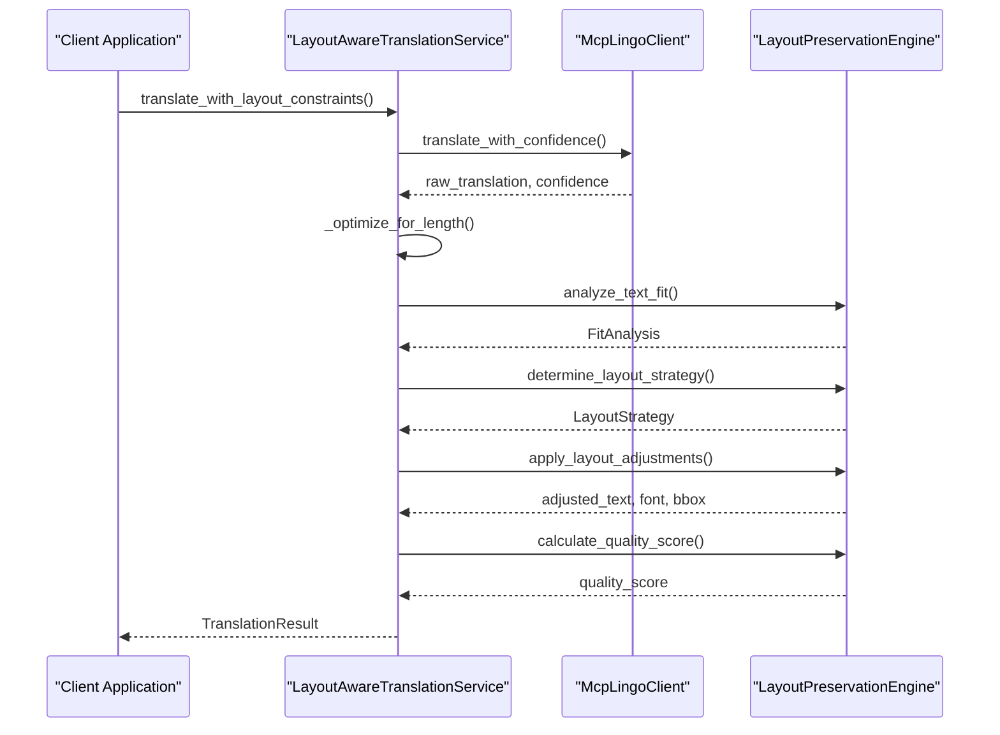
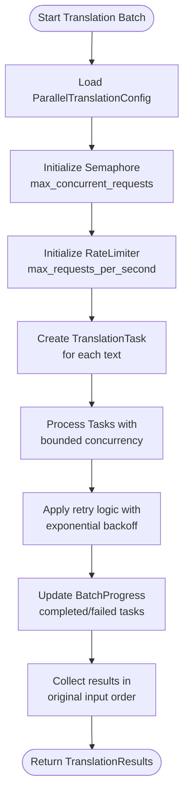
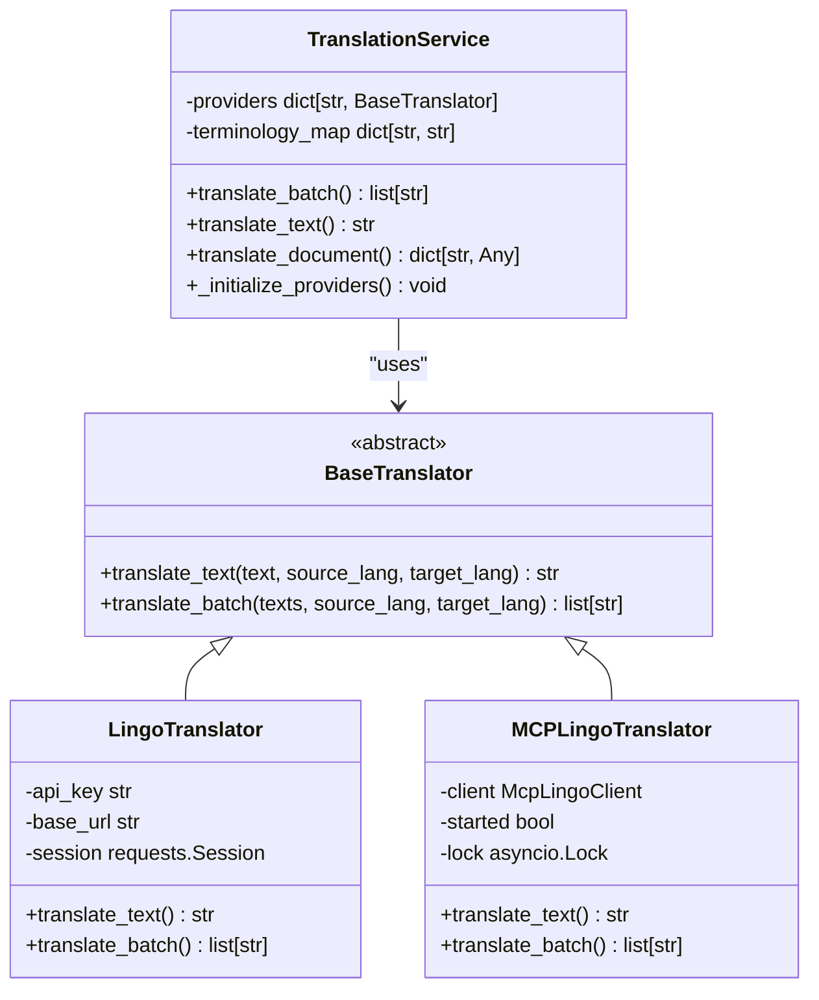
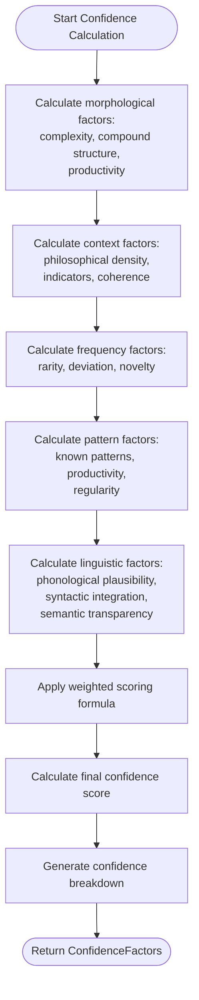
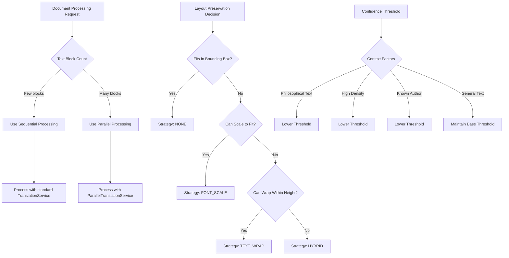

# Translation Coordination Service

<cite>
**Referenced Files in This Document**  
- [layout_aware_translation_service.py](file://services/layout_aware_translation_service.py)
- [parallel_translation_service.py](file://services/parallel_translation_service.py)
- [translation_service.py](file://services/translation_service.py)
- [mcp_lingo_client.py](file://services/mcp_lingo_client.py)
- [confidence_scorer.py](file://services/confidence_scorer.py)
- [language_detector.py](file://services/language_detector.py)
- [dolphin_ocr/layout.py](file://dolphin_ocr/layout.py)
</cite>

## Table of Contents
1. [Introduction](#introduction)
2. [Layout-Aware Translation Service](#layout-aware-translation-service)
3. [Parallel Translation Service](#parallel-translation-service)
4. [Base Translation Service and Provider Contract](#base-translation-service-and-provider-contract)
5. [Confidence Scoring and Language Detection Integration](#confidence-scoring-and-language-detection-integration)
6. [Strategy Pattern for Translation Method Selection](#strategy-pattern-for-translation-method-selection)
7. [Challenges in Text Fidelity and Layout Preservation](#challenges-in-text-fidelity-and-layout-preservation)
8. [Configuration of Quality vs. Speed Trade-offs](#configuration-of-quality-vs-speed-trade-offs)

## Introduction
The Translation Coordination Service provides a comprehensive framework for translating document content while preserving original layout constraints and optimizing processing performance. The system integrates multiple specialized services to handle layout-aware adjustments, parallel processing, confidence scoring, and language detection. This document explains the architecture and implementation of these components, focusing on how they work together to maintain text fidelity while respecting spatial constraints in translated documents.

## Layout-Aware Translation Service
The layout_aware_translation_service.py module implements a service that ensures translated text fits within original layout constraints by dynamically adjusting font size, line breaks, and positioning. This service coordinates with the LayoutPreservationEngine to analyze text fit and apply appropriate adjustments based on the content's spatial requirements.

The service operates through two primary methods: `translate_with_layout_constraints` for single text elements and `translate_document_batch` for processing multiple text blocks simultaneously. For each translation operation, the service first obtains the raw translation from the Lingo.dev client, then performs length optimization by collapsing whitespace, and finally applies layout adjustments based on the fit analysis.

**Diagram sources**
- [layout_aware_translation_service.py](file://services/layout_aware_translation_service.py#L150-L200)
- [dolphin_ocr/layout.py](file://dolphin_ocr/layout.py#L200-L300)

The service evaluates four possible layout strategies through the StrategyType enum: NONE (no changes needed), FONT_SCALE (adjust font size), TEXT_WRAP (add line breaks), and HYBRID (combine scaling with wrapping). The decision process prioritizes preserving the original appearance, first checking if the text fits without changes, then considering font scaling to maintain a single line, followed by text wrapping if it fits within the height constraints, and finally combining both approaches when necessary.

**Section sources**
- [layout_aware_translation_service.py](file://services/layout_aware_translation_service.py#L1-L310)
- [dolphin_ocr/layout.py](file://dolphin_ocr/layout.py#L1-L410)

## Parallel Translation Service
The parallel_translation_service.py module implements concurrent processing of translation requests to improve overall processing speed, particularly for large documents with numerous text elements. This service employs bounded concurrency through an asyncio.Semaphore to limit in-flight requests while using a token-bucket RateLimiter to smooth request bursts and enforce per-second caps.

The implementation features robust error handling with exponential backoff retry mechanisms for transient failures such as timeouts, 5xx errors, and rate limit responses (429). Each translation task is wrapped in individual error handling to ensure that a failure in one request does not affect the entire batch operation. The service maintains order preservation by using stable indices stored in task metadata, ensuring that results are returned in the same order as the input texts.

**Diagram sources**
- [parallel_translation_service.py](file://services/parallel_translation_service.py#L1-L200)
- [enhanced_translation_service.py](file://services/enhanced_translation_service.py#L100-L150)

The service configuration is controlled through the ParallelTranslationConfig dataclass, which defines parameters for concurrency, rate limiting, retries, and timeouts. These settings can be customized through environment variables, allowing operators to tune performance characteristics based on their specific requirements and API provider limitations.

**Section sources**
- [parallel_translation_service.py](file://services/parallel_translation_service.py#L1-L709)
- [enhanced_translation_service.py](file://services/enhanced_translation_service.py#L50-L200)

## Base Translation Service and Provider Contract
The translation_service.py module defines the base interface and implementation for translation providers, establishing a contract with external services like Lingo.dev. The architecture follows a provider pattern with the BaseTranslator abstract class defining the required methods `translate_text` and `translate_batch`, which must be implemented by concrete provider classes.

The service supports multiple provider implementations, currently including LingoTranslator for direct REST API access and MCPLingoTranslator for communication via the MCP (Model Context Protocol) server. The provider selection is handled automatically through the `_select_best_provider` method, which currently defaults to the Lingo.dev provider when available.

**Diagram sources**
- [translation_service.py](file://services/translation_service.py#L50-L150)
- [mcp_lingo_client.py](file://services/mcp_lingo_client.py#L1-L100)

The service also incorporates terminology management through preprocessing that wraps specified terms in `` tags to preserve them during translation. This feature allows organizations to maintain consistent terminology across translated documents by preventing certain terms from being translated.

**Section sources**
- [translation_service.py](file://services/translation_service.py#L1-L487)
- [mcp_lingo_client.py](file://services/mcp_lingo_client.py#L1-L673)

## Confidence Scoring and Language Detection Integration
The translation workflow integrates confidence scoring and language detection to enhance translation quality and accuracy. The confidence_scorer.py module implements a ConfidenceScorer class that evaluates multiple factors to determine the reliability of neologism detection and translation decisions.

The confidence scoring system analyzes morphological complexity, contextual density, frequency deviation, pattern recognition, and linguistic plausibility to generate a comprehensive confidence score. Each factor is weighted and combined to produce a final score between 0 and 1, with higher scores indicating greater confidence in the translation decision. The system also provides a detailed breakdown of confidence calculation across five categories: morphological, context, frequency, pattern, and linguistic.

**Diagram sources**
- [confidence_scorer.py](file://services/confidence_scorer.py#L150-L300)

Language detection is handled by the language_detector.py module, which provides a LanguageDetector class with multiple detection strategies. The service first attempts to use the optional langdetect library when available, falling back to heuristic-based detection when the library is not present or when text samples are too short. The heuristic approach analyzes common function words and distinctive characters for various languages, assigning weighted scores to determine the most likely language.

The language detection process is designed to fail closed, returning "Unknown" when the language cannot be determined rather than raising exceptions. This resilient design ensures that translation workflows can continue even when language detection fails, allowing operators to manually specify the source language if needed.

**Section sources**
- [confidence_scorer.py](file://services/confidence_scorer.py#L1-L498)
- [language_detector.py](file://services/language_detector.py#L1-L495)

## Strategy Pattern for Translation Method Selection
The system employs a strategy pattern to select appropriate translation methods based on document complexity and user preferences. This pattern is implemented through multiple layers of decision-making that consider both technical constraints and quality requirements.

At the highest level, the EnhancedTranslationService determines whether to use parallel or sequential processing based on the number of text blocks in a document. The `_should_use_parallel_processing` method compares the text count against a configurable threshold (default: 5 or 10% of batch size) to decide which processing strategy to employ. This adaptive approach ensures that the overhead of parallel processing is only incurred when it will provide meaningful performance benefits.

For layout preservation, the LayoutPreservationEngine implements a strategy selection process that evaluates four distinct approaches: no changes, font scaling, text wrapping, and hybrid adjustment. The decision tree prioritizes visual fidelity, first checking if the translated text fits without modifications, then considering font scaling to maintain single-line presentation, followed by text wrapping when height constraints allow, and finally combining both techniques when necessary.

The confidence scoring system also incorporates adaptive threshold adjustment through the `adjust_confidence_threshold` method, which modifies the base threshold based on contextual factors such as text genre, philosophical density, and author context. This dynamic thresholding allows the system to be more permissive in domains where neologisms are expected and more conservative in general texts.

**Diagram sources**
- [enhanced_translation_service.py](file://services/enhanced_translation_service.py#L50-L100)
- [layout_aware_translation_service.py](file://services/layout_aware_translation_service.py#L250-L300)
- [confidence_scorer.py](file://services/confidence_scorer.py#L400-L450)

**Section sources**
- [enhanced_translation_service.py](file://services/enhanced_translation_service.py#L1-L242)
- [layout_aware_translation_service.py](file://services/layout_aware_translation_service.py#L1-L310)
- [confidence_scorer.py](file://services/confidence_scorer.py#L1-L498)

## Challenges in Text Fidelity and Layout Preservation
The system addresses several key challenges in maintaining text fidelity while preserving layout, particularly when dealing with text expansion and special characters. One primary challenge is handling the natural expansion that occurs when translating between languages, such as German compounds becoming longer phrases in English. The layout preservation engine mitigates this through its multi-strategy approach, combining font scaling and text wrapping to accommodate longer translations within constrained spaces.

Special characters and Unicode text present additional challenges, particularly in maintaining proper rendering and alignment. The system handles these through careful font size calculations and bounding box adjustments that account for character width variations. The LayoutPreservationEngine uses an average character width heuristic (configurable via average_char_width_em) to estimate text dimensions, allowing it to make informed decisions about wrapping and scaling even without access to detailed font metrics.

Text fidelity is further challenged by the need to preserve formatting and structural elements within translated content. The system addresses this through the use of `` tags that protect specific terms and formatting from translation. This mechanism allows for selective preservation of terminology, proper nouns, and code snippets within otherwise translatable text.

Another challenge arises from the potential for text overflow when none of the adjustment strategies can fully contain the translated content within the original layout constraints. In such cases, the system implements a best-effort approach by prioritizing content preservation over strict layout adherence, allowing controlled overflow rather than truncating meaningful content.

**Section sources**
- [layout_aware_translation_service.py](file://services/layout_aware_translation_service.py#L1-L310)
- [dolphin_ocr/layout.py](file://dolphin_ocr/layout.py#L1-L410)

## Configuration of Quality vs. Speed Trade-offs
The system provides extensive configuration options to balance translation quality against processing speed, allowing users to optimize for their specific requirements. These trade-offs are controlled through multiple configuration points that affect different aspects of the translation pipeline.

The ParallelTranslationConfig class defines parameters that directly impact processing speed, including max_concurrent_requests (concurrency level), max_requests_per_second (rate limiting), and batch_size (batch processing efficiency). These settings can be adjusted based on the capabilities of the translation provider API and network conditions, with higher concurrency generally improving throughput at the cost of increased resource utilization.

For layout preservation quality, the LayoutPreservationEngine exposes several tunable parameters: font_scale_limits (acceptable font size variation), average_char_width_em (text width estimation accuracy), and line_height_factor (line spacing calculation). Adjusting these values allows fine-tuning of the visual fidelity of translated documents, with more restrictive scaling limits preserving the original appearance but potentially requiring more text wrapping.

Quality settings also include confidence threshold configuration, which determines how aggressively the system identifies and handles neologisms. Lower thresholds increase sensitivity to potential new terms at the risk of false positives, while higher thresholds provide more conservative identification. The system supports dynamic threshold adjustment based on document context, automatically lowering the threshold for philosophical texts where neologisms are more common.

These configuration options are accessible through environment variables, allowing runtime adjustments without code changes. For example, TRANSLATION_DELAY controls the delay between batch requests to avoid rate limiting, while LINGO_MCP_STARTUP_TIMEOUT and LINGO_MCP_CALL_TIMEOUT configure timeout behavior for the MCP client connections.

**Section sources**
- [parallel_translation_service.py](file://services/parallel_translation_service.py#L50-L150)
- [dolphin_ocr/layout.py](file://dolphin_ocr/layout.py#L50-L150)
- [confidence_scorer.py](file://services/confidence_scorer.py#L50-L150)
