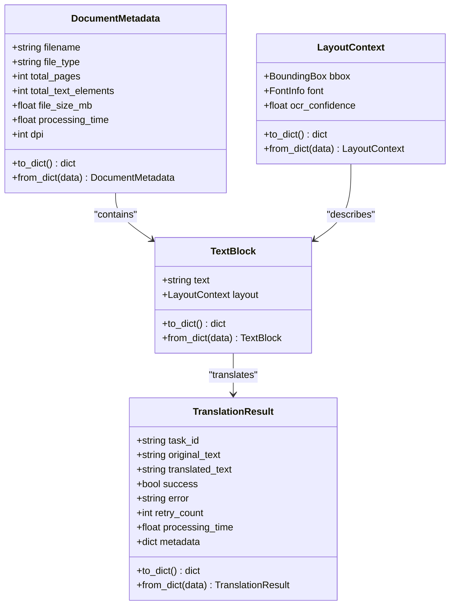
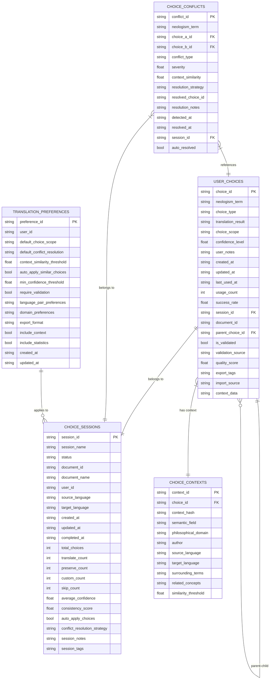
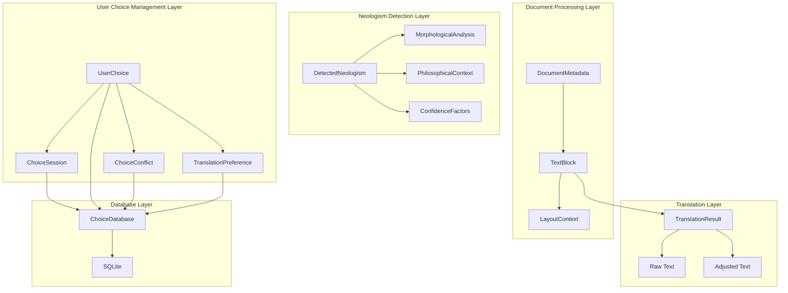
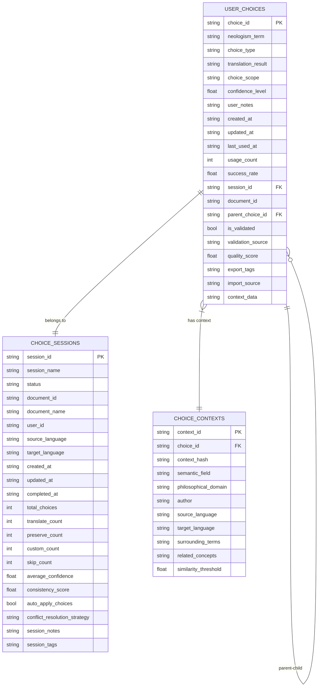

Now I have enough information to create comprehensive documentation. Let me create the data models documentation:

<docs>
# Data Models

<cite>
**Referenced Files in This Document**
- [models/neologism_models.py](file://models/neologism_models.py)
- [models/user_choice_models.py](file://models/user_choice_models.py)
- [services/enhanced_document_processor.py](file://services/enhanced_document_processor.py)
- [services/layout_aware_translation_service.py](file://services/layout_aware_translation_service.py)
- [services/parallel_translation_service.py](file://services/parallel_translation_service.py)
- [database/choice_database.py](file://database/choice_database.py)
- [config/settings.py](file://config/settings.py)
</cite>

## Table of Contents
1. [Introduction](#introduction)
2. [Core Entity Models](#core-entity-models)
3. [Document Metadata Model](#document-metadata-model)
4. [Layout Context Model](#layout-context-model)
5. [Text Block Model](#text-block-model)
6. [Translation Result Model](#translation-result-model)
7. [Neologism Detection Models](#neologism-detection-models)
8. [User Choice Management Models](#user-choice-management-models)
9. [Database Integration](#database-integration)
10. [Model Relationships](#model-relationships)
11. [Data Validation and Constraints](#data-validation-and-constraints)
12. [Usage Examples](#usage-examples)
13. [Performance Considerations](#performance-considerations)

## Introduction

PhenomenalLayout employs a comprehensive data modeling system built around Pydantic dataclasses and SQLAlchemy for robust data persistence. The system encompasses several core entity models that work together to manage document translation workflows, neologism detection, and user choice management. These models provide structured data representation, validation, and seamless integration with the application's services and database layer.

The data model architecture follows modern Python patterns with type hints, data validation, and serialization capabilities. Each model is designed to handle specific aspects of the translation pipeline while maintaining clear separation of concerns and extensibility for future enhancements.

## Core Entity Models

The PhenomenalLayout data model system consists of several interconnected models that represent different aspects of the translation and processing pipeline. These models are organized into logical groupings based on their functional responsibilities.



**Diagram sources**
- [services/enhanced_document_processor.py](file://services/enhanced_document_processor.py#L63-L72)
- [services/layout_aware_translation_service.py](file://services/layout_aware_translation_service.py#L57-L94)

**Section sources**
- [services/enhanced_document_processor.py](file://services/enhanced_document_processor.py#L63-L72)
- [services/layout_aware_translation_service.py](file://services/layout_aware_translation_service.py#L57-L94)

## Document Metadata Model

The `DocumentMetadata` class serves as the primary container for document information throughout the processing pipeline. It captures essential metadata about processed documents, enabling efficient tracking and management of translation workflows.

### Field Specifications

```python
class DocumentMetadata:
    """Metadata for processed documents."""

    filename: str                    # Original filename
    file_type: str                  # Document format (PDF, DOCX, TXT)
    total_pages: int               # Total page count
    total_text_elements: int       # Number of text blocks identified
    file_size_mb: float            # File size in megabytes
    processing_time: float         # Total processing duration in seconds
    dpi: int = 300                 # Image resolution for processing
```

### Key Features

- **Comprehensive Tracking**: Captures complete lifecycle information for each document
- **Format Flexibility**: Supports multiple document formats with appropriate metadata
- **Performance Metrics**: Tracks processing time and resource utilization
- **Quality Indicators**: Includes DPI settings that affect translation accuracy

### Usage Patterns

The DocumentMetadata model is instantiated during the initial document processing phase and propagated through subsequent stages. It serves as a central registry for document-specific information, enabling:

- **Progress Tracking**: Monitoring translation progress across multiple text blocks
- **Resource Management**: Optimizing processing parameters based on document characteristics
- **Quality Assessment**: Evaluating processing effectiveness based on metadata metrics

**Section sources**
- [services/enhanced_document_processor.py](file://services/enhanced_document_processor.py#L63-L72)

## Layout Context Model

The `LayoutContext` model encapsulates spatial and typographic information for text elements within documents. This model is crucial for maintaining layout integrity during translation by preserving the original positioning and formatting characteristics.

### Structural Components

```python
class LayoutContext:
    """Layout context for a single text element."""

    bbox: BoundingBox           # Spatial coordinates and dimensions
    font: FontInfo             # Typography information
    ocr_confidence: float | None = None  # OCR reliability score
```

### BoundingBox Details

The BoundingBox class defines the spatial boundaries of text elements:

- **x, y**: Top-left corner coordinates
- **width, height**: Dimensions of the text block
- **confidence**: OCR reliability measurement (0.0-1.0)

### FontInfo Attributes

Font information includes:

- **family**: Font family name (e.g., Helvetica, Times New Roman)
- **size**: Point size for the text
- **weight**: Font weight (normal, bold, etc.)
- **style**: Font style (normal, italic, etc.)
- **color**: RGB color tuple for text rendering

### Layout Preservation Benefits

The LayoutContext model enables sophisticated layout preservation strategies:

- **Positional Accuracy**: Maintains exact text placement across translations
- **Typography Consistency**: Preserves font characteristics for visual continuity
- **Quality Assessment**: Uses OCR confidence scores to evaluate translation reliability
- **Adaptive Processing**: Adjusts translation strategies based on layout complexity

**Section sources**
- [services/layout_aware_translation_service.py](file://services/layout_aware_translation_service.py#L57-L66)

## Text Block Model

The `TextBlock` model represents individual text elements within documents, serving as the fundamental unit for translation processing. It combines textual content with layout context to enable intelligent translation while preserving document structure.

### Model Structure

```python
class TextBlock:
    """Minimal text block model for batch translation."""

    text: str                   # Raw text content
    layout: LayoutContext       # Spatial and typographic context
```

### Processing Workflow

The TextBlock model integrates seamlessly with the translation pipeline:

1. **Content Extraction**: Text blocks are created from OCR results
2. **Context Preservation**: Layout information is maintained alongside text
3. **Batch Processing**: Multiple text blocks are processed efficiently
4. **Result Mapping**: Translated content is mapped back to original positions

### Serialization Support

Each TextBlock provides comprehensive serialization capabilities:

```python
def to_dict(self) -> dict[str, Any]:
    """Convert to dictionary representation."""
    return {
        "text": self.text,
        "layout": self.layout.to_dict()
    }

@classmethod
def from_dict(cls, data: dict[str, Any]) -> TextBlock:
    """Create TextBlock instance from dictionary data."""
    layout = LayoutContext.from_dict(data["layout"])
    return cls(text=data["text"], layout=layout)
```

### Integration Points

TextBlocks serve as the primary interface between OCR processing and translation services:

- **OCR Integration**: Directly constructed from Dolphin OCR results
- **Translation Coordination**: Batched for efficient processing
- **Layout Reconstruction**: Provides positional data for PDF reconstruction
- **Quality Control**: Links translation results to original layout context

**Section sources**
- [services/layout_aware_translation_service.py](file://services/layout_aware_translation_service.py#L70-L78)

## Translation Result Model

The `TranslationResult` model captures the outcome of translation operations, providing comprehensive information about the translation process and results. This model supports both simple text translation and layout-aware translation scenarios.

### Basic Translation Result

```python
class TranslationResult:
    """Result of a translation task."""

    task_id: str                    # Unique identifier for the translation task
    original_text: str             # Source text before translation
    translated_text: str           # Translated text result
    success: bool                  # Translation completion status
    error: Optional[str] = None    # Error message if translation failed
    retry_count: int = 0           # Number of retry attempts
    processing_time: float = 0.0   # Translation duration in seconds
    metadata: dict[str, Any] = field(default_factory=dict)  # Additional metadata
```

### Layout-Aware Translation Result

For layout-preserving translations, an extended model provides additional context:

```python
class TranslationResult:
    """Result of a layout-aware translation operation for a single block."""

    source_text: str               # Original text content
    raw_translation: str           # Direct translation result
    adjusted_text: str             # Translation with layout adjustments
    strategy: LayoutStrategy       # Applied layout preservation strategy
    analysis: FitAnalysis         # Text fitting analysis results
    adjusted_font: FontInfo       # Modified font information
    adjusted_bbox: BoundingBox    # Modified spatial coordinates
    quality_score: float          # Translation quality assessment (0.0-1.0)
    ocr_confidence: float | None = None  # Original OCR reliability
    translation_confidence: float | None = None  # Translation reliability
```

### Quality Assessment

The model incorporates sophisticated quality scoring mechanisms:

- **Quality Score**: Numerical assessment of translation effectiveness
- **Confidence Levels**: Reliability measurements for both OCR and translation
- **Strategy Evaluation**: Assessment of layout preservation effectiveness
- **Success Metrics**: Tracking of successful vs failed translations

### Error Handling

Comprehensive error tracking enables robust failure recovery:

- **Error Classification**: Structured error categorization
- **Retry Management**: Automatic retry logic with exponential backoff
- **Fallback Strategies**: Graceful degradation to original text when needed
- **Diagnostic Information**: Detailed error context for troubleshooting

**Section sources**
- [services/parallel_translation_service.py](file://services/parallel_translation_service.py#L130-L140)
- [services/layout_aware_translation_service.py](file://services/layout_aware_translation_service.py#L82-L94)

## Neologism Detection Models

PhenomenalLayout includes sophisticated neologism detection models that identify newly coined terms, philosophical concepts, and technical terminology within documents. These models provide comprehensive analysis and confidence scoring for detected neologisms.

### DetectedNeologism Model

The core neologism detection model captures detailed information about identified terms:

```python
@dataclass
class DetectedNeologism:
    """Represents a detected neologism with analysis data."""

    # Core identification
    term: str                      # The detected neologism
    confidence: float             # Confidence score (0.0-1.0)
    neologism_type: NeologismType  # Type classification

    # Position information
    start_pos: int                # Starting character position
    end_pos: int                  # Ending character position
    sentence_context: str         # Sentence containing the term
    paragraph_context: str = ""   # Paragraph context

    # Analysis results
    morphological_analysis: MorphologicalAnalysis = field(default_factory=MorphologicalAnalysis)
    philosophical_context: PhilosophicalContext = field(default_factory=PhilosophicalContext)
    confidence_factors: ConfidenceFactors = field(default_factory=ConfidenceFactors)

    # Metadata
    detection_timestamp: Optional[str] = None
    source_text_id: Optional[str] = None
    page_number: Optional[int] = None

    # Additional properties
    translation_suggestions: list[str] = field(default_factory=list)
    glossary_candidates: list[str] = field(default_factory=list)
    related_terms: list[str] = field(default_factory=list)
```

### Neologism Type Classification

The system supports multiple neologism categories:

```python
class NeologismType(Enum):
    """Types of detected neologisms."""
    COMPOUND = "compound"                    # Compound words
    PHILOSOPHICAL_TERM = "philosophical_term"  # Philosophical concepts
    TECHNICAL_TERM = "technical_term"        # Technical terminology
    DERIVED = "derived"                      # Derived forms
    UNKNOWN = "unknown"                      # Unclassified terms
```

### Confidence Level System

Confidence levels provide granular assessment of detection reliability:

```python
class ConfidenceLevel(Enum):
    """Confidence levels for neologism detection."""
    HIGH = "high"        # 0.8+ confidence
    MEDIUM = "medium"    # 0.6-0.8 confidence
    LOW = "low"          # 0.4-0.6 confidence
    UNCERTAIN = "uncertain"  # <0.4 confidence
```

### Morphological Analysis

The MorphologicalAnalysis class provides detailed linguistic breakdown:

```python
@dataclass
class MorphologicalAnalysis:
    """Analysis of word morphology and structure."""

    # Core morphological components
    root_words: list[str] = field(default_factory=list)
    prefixes: list[str] = field(default_factory=list)
    suffixes: list[str] = field(default_factory=list)

    # Compound analysis
    is_compound: bool = False
    compound_parts: list[str] = field(default_factory=list)
    compound_pattern: Optional[str] = None

    # Linguistic features
    word_length: int = 0
    syllable_count: int = 0
    morpheme_count: int = 0

    # Complexity metrics
    structural_complexity: float = 0.0
    morphological_productivity: float = 0.0
```

### Philosophical Context Analysis

PhilosophicalContext captures semantic and contextual information:

```python
@dataclass
class PhilosophicalContext:
    """Analysis of philosophical context and semantic field."""

    # Context indicators
    philosophical_density: float = 0.0
    semantic_field: str = ""
    domain_indicators: list[str] = field(default_factory=list)

    # Contextual elements
    surrounding_terms: list[str] = field(default_factory=list)
    philosophical_keywords: list[str] = field(default_factory=list)
    conceptual_clusters: list[str] = field(default_factory=list)

    # Authorial context
    author_terminology: list[str] = field(default_factory=list)
    text_genre: str = ""
    historical_period: str = ""

    # Semantic relationships
    related_concepts: list[str] = field(default_factory=list)
    semantic_network: dict[str, list[str]] = field(default_factory=dict)
```

### Confidence Factors Calculation

The ConfidenceFactors model calculates weighted confidence scores:

```python
@dataclass
class ConfidenceFactors:
    """Individual factors contributing to confidence scoring."""

    # Morphological factors
    morphological_complexity: float = 0.0
    compound_structure_score: float = 0.0
    morphological_productivity: float = 0.0

    # Context factors
    context_density: float = 0.0
    philosophical_indicators: float = 0.0
    semantic_coherence: float = 0.0

    # Frequency factors
    rarity_score: float = 0.0
    frequency_deviation: float = 0.0
    corpus_novelty: float = 0.0

    # Pattern factors
    known_patterns: float = 0.0
    pattern_productivity: float = 0.0
    structural_regularity: float = 0.0

    # Linguistic factors
    phonological_plausibility: float = 0.0
    syntactic_integration: float = 0.0
    semantic_transparency: float = 0.0

    def calculate_weighted_score(self) -> float:
        """Calculate weighted confidence score from individual factors."""
        # Weighted calculation with configurable weights
        # Returns normalized score between 0.0 and 1.0
```

### NeologismAnalysis Model

The NeologismAnalysis class aggregates multiple detections into comprehensive reports:

```python
@dataclass
class NeologismAnalysis:
    """Comprehensive analysis results for a text or document."""

    # Analysis metadata
    text_id: str
    analysis_timestamp: str
    total_tokens: int
    analyzed_chunks: int

    # Detection results
    detected_neologisms: list[DetectedNeologism] = field(default_factory=list)
    total_detections: int = 0

    # Statistical summary
    confidence_distribution: dict[str, int] = field(default_factory=dict)
    type_distribution: dict[str, int] = field(default_factory=dict)

    # Context analysis
    philosophical_density_avg: float = 0.0
    semantic_fields: list[str] = field(default_factory=list)
    dominant_concepts: list[str] = field(default_factory=list)

    # Performance metrics
    processing_time: float = 0.0
    memory_usage: Optional[float] = None
    cache_hits: int = 0

    # Quality indicators
    analysis_quality: float = 0.0
    coverage_ratio: float = 0.0
```

**Section sources**
- [models/neologism_models.py](file://models/neologism_models.py#L29-L558)

## User Choice Management Models

PhenomenalLayout's user choice management system provides sophisticated mechanisms for capturing, storing, and applying user preferences for neologism translations. This system enables personalized translation workflows and maintains consistency across translation sessions.

### UserChoice Model

The UserChoice model represents individual user decisions for neologism handling:

```python
@dataclass
class UserChoice:
    """Individual user choice for neologism translation."""

    # Core choice data
    choice_id: str                    # Unique identifier
    neologism_term: str              # Target neologism
    choice_type: ChoiceType           # Translation action type
    translation_result: str = ""      # Applied translation

    # Context information
    context: TranslationContext = field(default_factory=TranslationContext)

    # Choice metadata
    choice_scope: ChoiceScope = ChoiceScope.CONTEXTUAL  # Scope of application
    confidence_level: float = 1.0                    # User confidence
    user_notes: str = ""                             # User comments

    # Temporal information
    created_at: str = field(default_factory=lambda: datetime.now().isoformat())
    updated_at: str = field(default_factory=lambda: datetime.now().isoformat())
    last_used_at: Optional[str] = None

    # Usage tracking
    usage_count: int = 0
    success_rate: float = 1.0

    # Relationship data
    session_id: Optional[str] = None
    document_id: Optional[str] = None
    parent_choice_id: Optional[str] = None

    # Validation and quality
    is_validated: bool = False
    validation_source: str = ""
    quality_score: float = 0.0

    # Export/import metadata
    export_tags: set[str] = field(default_factory=set)
    import_source: str = ""
```

### Choice Types

The system supports multiple choice types for neologism handling:

```python
class ChoiceType(Enum):
    """Types of user choices for neologism handling."""
    TRANSLATE = "translate"                    # Translate the term
    PRESERVE = "preserve"                      # Keep original term
    CUSTOM_TRANSLATION = "custom_translation"  # User-defined translation
    SKIP = "skip"                              # Skip translation
```

### Choice Scope System

Choice scopes define the applicability of user choices:

```python
class ChoiceScope(Enum):
    """Scope of user choice application."""
    GLOBAL = "global"        # Apply to all occurrences
    CONTEXTUAL = "contextual"  # Apply to similar contexts
    DOCUMENT = "document"    # Apply within current document
    SESSION = "session"      # Apply within current session only
```

### TranslationContext Model

TranslationContext provides comprehensive context information for choice matching:

```python
@dataclass
class TranslationContext:
    """Context information for translation choices."""

    # Text context
    sentence_context: str = ""
    paragraph_context: str = ""
    document_context: str = ""

    # Semantic context
    semantic_field: str = ""
    philosophical_domain: str = ""
    author: str = ""
    source_language: str = ""
    target_language: str = ""

    # Positional context
    page_number: Optional[int] = None
    chapter: Optional[str] = None
    section: Optional[str] = None

    # Related terms
    surrounding_terms: list[str] = field(default_factory=list)
    related_concepts: list[str] = field(default_factory=list)

    # Quality metrics
    context_similarity_threshold: float = 0.8
    confidence_score: float = 0.0
```

### ChoiceSession Model

ChoiceSession tracks user activities across translation sessions:

```python
@dataclass
class ChoiceSession:
    """Session for tracking user choices during translation."""

    # Session identification
    session_id: str
    session_name: str = ""

    # Session metadata
    status: SessionStatus = SessionStatus.ACTIVE
    document_id: Optional[str] = None
    document_name: str = ""

    # User and context
    user_id: Optional[str] = None
    source_language: str = ""
    target_language: str = ""

    # Temporal information
    created_at: str = field(default_factory=lambda: datetime.now().isoformat())
    updated_at: str = field(default_factory=lambda: datetime.now().isoformat())
    completed_at: Optional[str] = None

    # Session statistics
    total_choices: int = 0
    translate_count: int = 0
    preserve_count: int = 0
    custom_count: int = 0
    skip_count: int = 0

    # Quality metrics
    average_confidence: float = 0.0
    consistency_score: float = 0.0

    # Configuration
    auto_apply_choices: bool = True
    conflict_resolution_strategy: ConflictResolution = ConflictResolution.CONTEXT_SPECIFIC

    # Session notes and tags
    session_notes: str = ""
    session_tags: set[str] = field(default_factory=set)
```

### Conflict Resolution System

The system includes sophisticated conflict detection and resolution:

```python
@dataclass
class ChoiceConflict:
    """Represents a conflict between user choices."""

    # Conflict identification
    conflict_id: str
    neologism_term: str

    # Conflicting choices
    choice_a: UserChoice
    choice_b: UserChoice

    # Conflict analysis
    conflict_type: str = "translation_mismatch"
    severity: float = 0.5
    context_similarity: float = 0.0

    # Resolution information
    resolution_strategy: ConflictResolution = ConflictResolution.LATEST_WINS
    resolved_choice_id: Optional[str] = None
    resolution_notes: str = ""

    # Temporal information
    detected_at: str = field(default_factory=lambda: datetime.now().isoformat())
    resolved_at: Optional[str] = None

    # Metadata
    session_id: Optional[str] = None
    auto_resolved: bool = False
```

### Conflict Resolution Strategies

Multiple strategies handle choice conflicts:

```python
class ConflictResolution(Enum):
    """Strategies for resolving choice conflicts."""
    LATEST_WINS = "latest_wins"              # Most recent choice wins
    CONTEXT_SPECIFIC = "context_specific"    # Context-aware resolution
    USER_PROMPT = "user_prompt"              # User intervention required
    HIGHEST_CONFIDENCE = "highest_confidence"  # Highest confidence wins
```

### TranslationPreference Model

TranslationPreferences capture user-specific translation behavior settings:

```python
@dataclass
class TranslationPreference:
    """User preferences for translation behavior."""

    # Identification
    preference_id: str
    user_id: Optional[str] = None

    # Translation preferences
    default_choice_scope: ChoiceScope = ChoiceScope.CONTEXTUAL
    default_conflict_resolution: ConflictResolution = ConflictResolution.CONTEXT_SPECIFIC

    # Matching preferences
    context_similarity_threshold: float = 0.8
    auto_apply_similar_choices: bool = True

    # Quality preferences
    min_confidence_threshold: float = 0.5
    require_validation: bool = False

    # Language pair preferences
    language_pair_preferences: dict[str, dict[str, Any]] = field(default_factory=dict)

    # Domain preferences
    domain_preferences: dict[str, dict[str, Any]] = field(default_factory=dict)

    # Export/import preferences
    export_format: str = "json"
    include_context: bool = True
    include_statistics: bool = True

    # Temporal information
    created_at: str = field(default_factory=lambda: datetime.now().isoformat())
    updated_at: str = field(default_factory=lambda: datetime.now().isoformat())
```

**Section sources**
- [models/user_choice_models.py](file://models/user_choice_models.py#L48-L685)

## Database Integration

PhenomenalLayout integrates data models with a SQLite-based database system through the ChoiceDatabase class, providing robust persistence and retrieval capabilities for user choices and translation preferences.

### Database Schema Design

The database schema is designed for efficient storage and retrieval of user choice data:



**Diagram sources**
- [database/choice_database.py](file://database/choice_database.py#L150-L350)

### Database Operations

The ChoiceDatabase class provides comprehensive CRUD operations:

```python
class ChoiceDatabase:
    """SQLite database manager for user choices."""

    def save_user_choice(self, choice: UserChoice) -> bool:
        """Save a user choice to the database."""

    def get_user_choice(self, choice_id: str) -> Optional[UserChoice]:
        """Get a user choice by ID."""

    def get_choices_by_term(self, neologism_term: str, limit: int = 100) -> list[UserChoice]:
        """Get all choices for a specific neologism term."""

    def get_choices_by_session(self, session_id: str) -> list[UserChoice]:
        """Get all choices for a specific session."""

    def search_similar_choices(self, context: TranslationContext, limit: int = 10) -> list[UserChoice]:
        """Search for choices with similar contexts."""

    def update_choice_usage(self, choice_id: str, success: bool = True) -> bool:
        """Update choice usage statistics."""

    def delete_user_choice(self, choice_id: str) -> bool:
        """Delete a user choice."""
```

### Context Matching System

The database includes specialized context matching for efficient choice retrieval:

```python
def search_similar_choices(self, context: TranslationContext, limit: int = 10) -> list[UserChoice]:
    """Search for choices with similar contexts."""
    # Search by context components
    cursor = conn.execute("""
        SELECT uc.* FROM user_choices uc
        JOIN choice_contexts cc ON uc.choice_id = cc.choice_id
        WHERE cc.semantic_field = ? OR cc.philosophical_domain = ?
        OR cc.author = ? OR (cc.source_language = ? AND cc.target_language = ?)
        ORDER BY uc.updated_at DESC
        LIMIT ?
    """, (
        context.semantic_field,
        context.philosophical_domain,
        context.author,
        context.source_language,
        context.target_language,
        limit,
    ))
```

### Performance Optimization

The database includes several performance optimizations:

- **Index Creation**: Strategic indexes on frequently queried fields
- **Batch Operations**: Efficient bulk insert/update operations
- **Connection Pooling**: Proper connection management with context managers
- **Foreign Key Constraints**: Maintains referential integrity
- **JSON Storage**: Flexible storage of complex data structures

### Data Validation

The database layer includes validation mechanisms:

```python
def _validate_alpha(self, alpha: float) -> float:
    """Validate learning rate alpha parameter."""
    if not (0.001 <= alpha <= 1.0):
        raise ValueError(f"Learning rate alpha must be between 0.001 and 1.0, got {alpha}")
    return float(alpha)

def _validate_batch_size(self, batch_size: int) -> int:
    """Validate batch size parameter."""
    if not (1 <= batch_size <= 10000):
        raise ValueError(f"Batch size must be between 1 and 10000, got {batch_size}")
    return batch_size
```

**Section sources**
- [database/choice_database.py](file://database/choice_database.py#L1-L799)

## Model Relationships

The PhenomenalLayout data models exhibit sophisticated interconnections that enable comprehensive translation workflows and user choice management. These relationships facilitate data flow, validation, and integration across the application architecture.

### Hierarchical Model Structure



**Diagram sources**
- [services/enhanced_document_processor.py](file://services/enhanced_document_processor.py#L63-L72)
- [services/layout_aware_translation_service.py](file://services/layout_aware_translation_service.py#L57-L94)
- [models/neologism_models.py](file://models/neologism_models.py#L29-L558)
- [models/user_choice_models.py](file://models/user_choice_models.py#L48-L685)

### Document Processing Relationships

The DocumentMetadata model serves as the central coordinator for document processing workflows:

```python
# DocumentMetadata coordinates multiple TextBlocks
class DocumentMetadata:
    filename: str
    file_type: str
    total_pages: int
    total_text_elements: int
    file_size_mb: float
    processing_time: float
    dpi: int = 300

# TextBlock inherits layout context from LayoutContext
class TextBlock:
    text: str
    layout: LayoutContext

# LayoutContext provides spatial and typographic information
class LayoutContext:
    bbox: BoundingBox
    font: FontInfo
    ocr_confidence: float | None = None
```

### Translation Workflow Integration

Translation results maintain strong ties to their source data:

```python
# TranslationResult links to original text and layout
class TranslationResult:
    source_text: str               # Reference to original text
    raw_translation: str           # Direct translation
    adjusted_text: str             # Layout-adjusted translation
    strategy: LayoutStrategy       # Preservation strategy
    analysis: FitAnalysis         # Analysis results
    adjusted_font: FontInfo       # Modified font info
    adjusted_bbox: BoundingBox    # Modified spatial coords
    quality_score: float          # Translation quality
```

### Neologism Detection Integration

Detected neologisms integrate with multiple analysis systems:

```python
# DetectedNeologism combines multiple analysis types
class DetectedNeologism:
    term: str                           # The neologism
    confidence: float                   # Overall confidence
    neologism_type: NeologismType      # Classification
    start_pos: int                     # Position in text
    end_pos: int                       # End position
    sentence_context: str              # Sentence context
    paragraph_context: str             # Paragraph context

    # Analysis components
    morphological_analysis: MorphologicalAnalysis
    philosophical_context: PhilosophicalContext
    confidence_factors: ConfidenceFactors

    # Additional metadata
    detection_timestamp: Optional[str]
    source_text_id: Optional[str]
    page_number: Optional[int]
```

### User Choice Management Relationships

User choices form a complex network of relationships:

```python
# UserChoice connects to various systems
class UserChoice:
    choice_id: str
    neologism_term: str
    choice_type: ChoiceType
    translation_result: str
    context: TranslationContext
    choice_scope: ChoiceScope
    confidence_level: float
    user_notes: str
    created_at: str
    updated_at: str
    last_used_at: Optional[str]
    usage_count: int
    success_rate: float
    session_id: Optional[str]
    document_id: Optional[str]
    parent_choice_id: Optional[str]
    is_validated: bool
    validation_source: str
    quality_score: float
    export_tags: set[str]
    import_source: str
```

### Database Persistence Relationships

The database layer maintains referential integrity through carefully designed relationships:



**Diagram sources**
- [database/choice_database.py](file://database/choice_database.py#L150-L350)

### Cross-Model Integration Points

Several integration points enable seamless data flow:

1. **Context Hash Generation**: UserChoice generates context hashes for efficient matching
2. **Session Tracking**: Choices are tracked within sessions for consistency
3. **Validation Chains**: Choices inherit validation from their parent sessions
4. **Usage Statistics**: Automatic tracking of choice effectiveness
5. **Conflict Resolution**: Systematic handling of conflicting user choices

**Section sources**
- [models/neologism_models.py](file://models/neologism_models.py#L29-L558)
- [models/user_choice_models.py](file://models/user_choice_models.py#L48-L685)
- [database/choice_database.py](file://database/choice_database.py#L1-L799)

## Data Validation and Constraints

PhenomenalLayout implements comprehensive data validation and constraint enforcement across all model layers. The validation system ensures data integrity, prevents invalid operations, and provides meaningful error messages for debugging and user feedback.

### Type Constraints and Validation

Each model enforces strict type constraints and validation rules:

```python
# DocumentMetadata validation
class DocumentMetadata:
    filename: str                    # Non-empty string
    file_type: str                  # Valid format identifier
    total_pages: int               # Positive integer
    total_text_elements: int       # Non-negative integer
    file_size_mb: float            # Positive float
    processing_time: float         # Non-negative float
    dpi: int = 300                 # Range: 72-600

# LayoutContext validation
class LayoutContext:
    bbox: BoundingBox              # Must be valid bounding box
    font: FontInfo                 # Must be valid font specification
    ocr_confidence: float | None   # Range: 0.0-1.0 or None

# TranslationResult validation
class TranslationResult:
    task_id: str                   # UUID-like identifier
    original_text: str             # Non-empty string
    translated_text: str           # String (can be empty)
    success: bool                  # Boolean value
    error: Optional[str] = None    # String or None
    retry_count: int = 0           # Non-negative integer
    processing_time: float = 0.0   # Non-negative float
    metadata: dict[str, Any] = field(default_factory=dict)  # Dict
