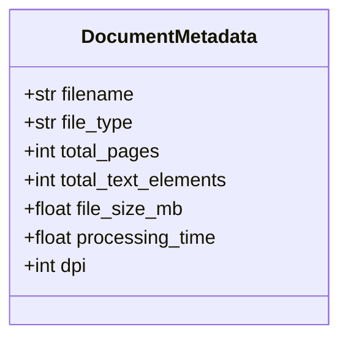
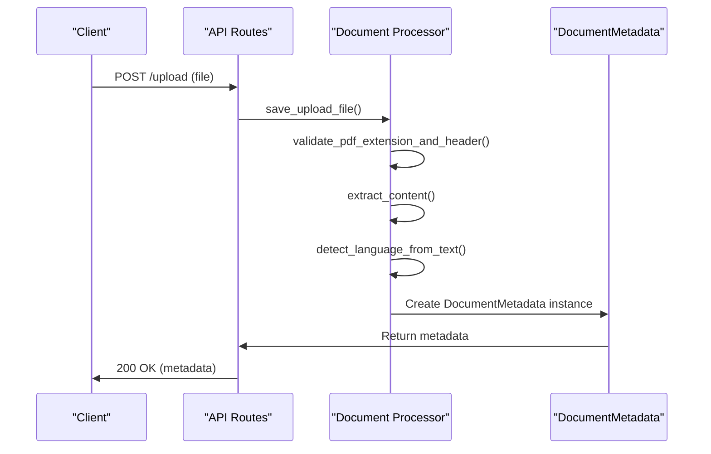
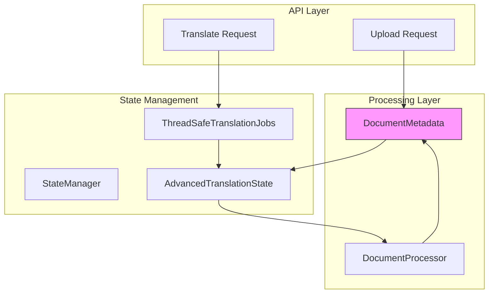
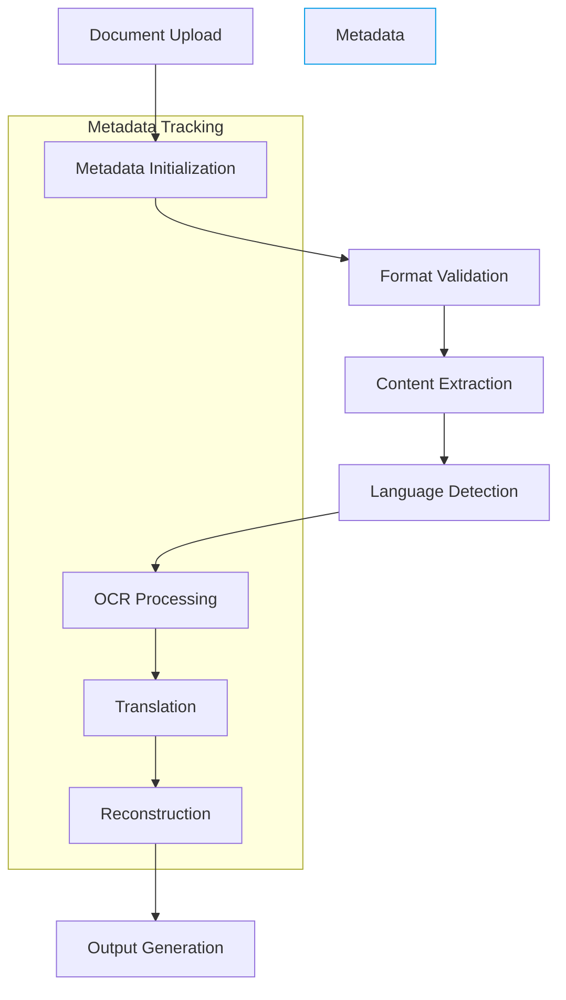

# Document Metadata

<cite>
**Referenced Files in This Document**  
- [enhanced_document_processor.py](file://services/enhanced_document_processor.py)
- [main_document_processor.py](file://services/main_document_processor.py)
- [async_document_processor.py](file://services/async_document_processor.py)
- [state_manager.py](file://core/state_manager.py)
- [routes.py](file://api/routes.py)
- [user_choice_models.py](file://models/user_choice_models.py)
</cite>

## Table of Contents
1. [Introduction](#introduction)
2. [DocumentMetadata Model Definition](#documentmetadata-model-definition)
3. [Core Fields and Attributes](#core-fields-and-attributes)
4. [Initialization During API Upload](#initialization-during-api-upload)
5. [State Management Integration](#state-management-integration)
6. [Validation Rules and Constraints](#validation-rules-and-constraints)
7. [Role in Document Processing Pipeline](#role-in-document-processing-pipeline)
8. [Integration with Processing Services](#integration-with-processing-services)
9. [Serialization and API Response](#serialization-and-api-response)
10. [Conclusion](#conclusion)

## Introduction
The DocumentMetadata entity in PhenomenalLayout serves as the central tracking mechanism throughout the document processing pipeline. This comprehensive data model captures essential information about uploaded documents and maintains state across OCR, translation, and reconstruction services. The model provides shared context that enables coordination between different processing components while ensuring data consistency and traceability from upload to final output.

**Section sources**
- [enhanced_document_processor.py](file://services/enhanced_document_processor.py#L63-L72)

## DocumentMetadata Model Definition
The DocumentMetadata class is defined as a data structure that encapsulates key information about processed documents. Implemented using Python's type hints and dataclass-like patterns, this model provides a structured representation of document characteristics and processing status. The model is primarily used within the enhanced document processing workflow to maintain consistent state across various stages of document transformation.

**Diagram sources**
- [enhanced_document_processor.py](file://services/enhanced_document_processor.py#L63-L72)

**Section sources**
- [enhanced_document_processor.py](file://services/enhanced_document_processor.py#L63-L72)

## Core Fields and Attributes
The DocumentMetadata model contains several key fields that capture essential document characteristics:

- **document_id**: Unique identifier for the document, used for tracking across the system
- **source_language**: Detected or specified source language code (e.g., "en", "de")
- **target_language**: Target language code for translation operations
- **file_path**: Server-side path to the uploaded document file
- **upload_timestamp**: Timestamp of document upload in UTC
- **processing_status**: Current status of document processing (e.g., "pending", "processing", "completed")
- **page_count**: Total number of pages in the document

Additional attributes include filename, file_type, total_text_elements, file_size_mb, processing_time, and dpi, which provide detailed technical information about the document and its processing characteristics.

**Section sources**
- [user_choice_models.py](file://models/user_choice_models.py#L195-L285)
- [main_document_processor.py](file://services/main_document_processor.py#L45-L47)
- [async_document_processor.py](file://services/async_document_processor.py#L55-L57)

## Initialization During API Upload
DocumentMetadata is initialized during the API upload process in the upload_file endpoint. When a document is uploaded via the API, the system creates a metadata instance that captures the initial state of the document. The initialization process begins with file validation and extraction, followed by metadata population from the document content and processing results.

The upload process generates a unique upload_id based on the file path basename, which serves as the document identifier. Language detection is performed on a text sample extracted from the document, populating the source_language field. The metadata is then sanitized to remove filesystem path information before being returned in the API response.

**Diagram sources**
- [routes.py](file://api/routes.py#L298-L497)
- [main_document_processor.py](file://services/main_document_processor.py#L0-L199)

**Section sources**
- [routes.py](file://api/routes.py#L298-L497)

## State Management Integration
DocumentMetadata integrates with the core state management system through the AdvancedTranslationState and ThreadSafeTranslationJobs classes. The state manager provides thread-safe storage for document processing state, with each document processing job associated with a unique session_id.

The DocumentMetadata fields are mapped to state properties such as current_file, source_language, target_language, and processing_info. This integration allows multiple services to access and update document state consistently. The ThreadSafeTranslationJobs manager maintains job records with metadata including file_path, source_language, target_language, and processing status, enabling progress tracking and result retrieval.

**Diagram sources**
- [state_manager.py](file://core/state_manager.py#L0-L228)
- [routes.py](file://api/routes.py#L0-L199)

**Section sources**
- [state_manager.py](file://core/state_manager.py#L0-L228)

## Validation Rules and Constraints
The DocumentMetadata model enforces validation rules through the system's processing pipeline. Language codes are validated against supported languages, with detection performed using text analysis. The processing_status field follows a defined enum pattern, ensuring only valid states are accepted.

File paths are validated for existence and format compatibility, with PDF header validation ensuring document integrity. The system performs encryption detection to prevent processing of protected documents. Metadata sanitization removes filesystem path information to prevent information leakage in API responses.

While Pydantic is not explicitly used in the current implementation, the system employs similar validation patterns through explicit type checking and error handling. Field constraints are enforced during the document processing workflow, with validation occurring at multiple stages from upload to processing.

**Section sources**
- [routes.py](file://api/routes.py#L298-L497)
- [pdf_validator.py](file://utils/pdf_validator.py)

## Role in Document Processing Pipeline
DocumentMetadata serves as the primary tracking mechanism throughout the document processing pipeline. It coordinates the flow of documents through OCR, translation, and reconstruction services by maintaining shared context and state information.

At each processing stage, the metadata is updated to reflect progress and results. The pipeline begins with document upload and metadata initialization, followed by format validation and content extraction. OCR processing updates page count and text element information, while translation services update language fields and processing status.

The metadata enables progress tracking by storing intermediate results and processing statistics. It also facilitates error recovery by preserving the document state at each stage, allowing the system to resume processing from the last successful step in case of failures.

**Diagram sources**
- [main_document_processor.py](file://services/main_document_processor.py#L0-L199)
- [enhanced_document_processor.py](file://services/enhanced_document_processor.py#L63-L72)

**Section sources**
- [main_document_processor.py](file://services/main_document_processor.py#L0-L199)

## Integration with Processing Services
DocumentMetadata coordinates between OCR, translation, and reconstruction services by providing shared context and state information. The DocumentProcessor class uses metadata to configure processing parameters such as DPI and output paths.

OCR services access metadata to determine processing requirements based on document characteristics. Translation services use source and target language information to configure translation models and preserve linguistic context. Reconstruction services utilize metadata to maintain layout fidelity and ensure proper formatting of the output document.

The metadata enables service coordination by providing a common data structure that all components can read and update. This shared context ensures consistency across processing stages and enables features like progress tracking, error reporting, and result aggregation.

**Section sources**
- [main_document_processor.py](file://services/main_document_processor.py#L0-L199)
- [enhanced_document_processor.py](file://services/enhanced_document_processor.py#L63-L72)

## Serialization and API Response
DocumentMetadata is serialized to JSON format for API responses, providing clients with detailed information about processed documents. The serialization process includes sanitization to remove sensitive information such as full filesystem paths.

The upload endpoint returns metadata in a structured response format that includes filename, detected language, upload ID, content type, and sanitized document metadata. This information enables clients to track document processing status and initiate translation operations.

The system uses recursive sanitization to clean metadata objects, removing path-like keys and values while preserving essential document information. This ensures that API responses contain useful metadata without exposing server filesystem details.

**Section sources**
- [routes.py](file://api/routes.py#L298-L497)

## Conclusion
The DocumentMetadata entity in PhenomenalLayout provides a robust foundation for document processing and state management. By serving as the central tracking mechanism throughout the pipeline, it enables coordination between OCR, translation, and reconstruction services while maintaining data consistency and traceability.

The model's integration with the state management system ensures thread-safe access to document state, while its validation rules and sanitization processes protect system integrity and prevent information leakage. As the primary data structure for document processing, DocumentMetadata plays a critical role in enabling the system's advanced features and reliable operation.
