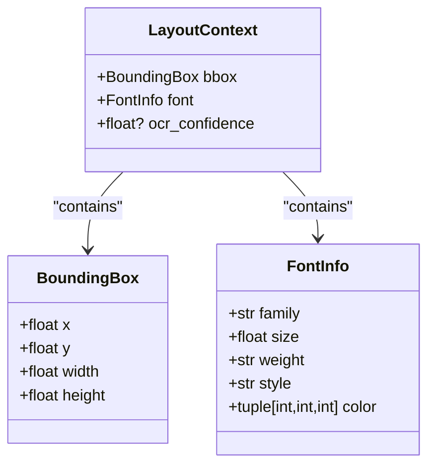
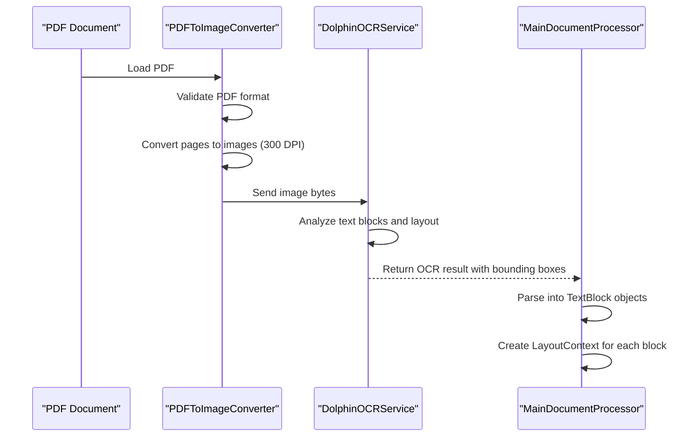
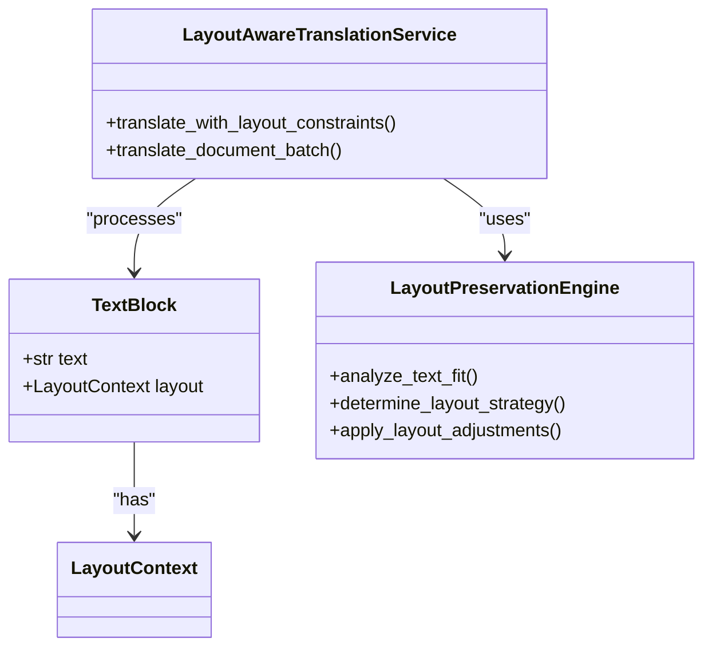
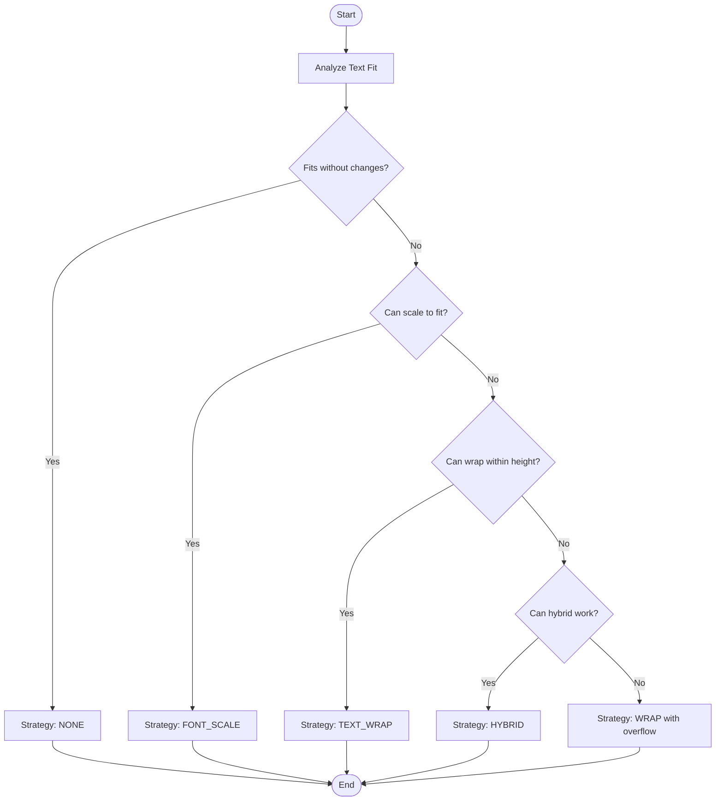

# Layout Context

<cite>
**Referenced Files in This Document**  
- [layout.py](file://dolphin_ocr/layout.py)
- [layout_aware_translation_service.py](file://services/layout_aware_translation_service.py)
- [main_document_processor.py](file://services/main_document_processor.py)
- [pdf_to_image.py](file://dolphin_ocr/pdf_to_image.py)
</cite>

## Table of Contents
1. [Introduction](#introduction)
2. [LayoutContext Model Structure](#layoutcontext-model-structure)
3. [Coordinate System and Measurement Units](#coordinate-system-and-measurement-units)
4. [LayoutContext Extraction from PDFs](#layoutcontext-extraction-from-pdfs)
5. [Usage in Layout-Aware Translation](#usage-in-layout-aware-translation)
6. [Font Scaling and Bounding Box Adjustments](#font-scaling-and-bounding-box-adjustments)
7. [Performance Considerations for Multi-Page Documents](#performance-considerations-for-multi-page-documents)
8. [Memory Optimization Strategies](#memory-optimization-strategies)

## Introduction
The LayoutContext model is a core component of PhenomenalLayout's layout preservation engine, designed to maintain spatial relationships during document translation. It captures essential layout metadata including page dimensions, DPI settings, and text block positioning, enabling accurate reconstruction of translated documents while preserving original formatting. This document details the structure, extraction, and application of LayoutContext throughout the document processing pipeline.

## LayoutContext Model Structure
The LayoutContext model encapsulates the spatial and typographic properties of text elements within a document. It consists of a bounding box, font information, and optional OCR confidence metrics.

**Diagram sources**
- [layout.py](file://dolphin_ocr/layout.py#L20-L40)
- [layout_aware_translation_service.py](file://services/layout_aware_translation_service.py#L57-L66)

**Section sources**
- [layout_aware_translation_service.py](file://services/layout_aware_translation_service.py#L57-L66)
- [layout.py](file://dolphin_ocr/layout.py#L20-L40)

## Coordinate System and Measurement Units
The LayoutContext uses a PDF-like coordinate system where the origin (0,0) is located at the bottom-left corner of the page. All measurements are expressed in points (1/72 inch), which aligns with standard PDF specifications and ensures consistency across different DPI settings.

The coordinate system follows these principles:
- X-axis: Increases from left to right
- Y-axis: Increases from bottom to top
- Width and height: Represent the dimensions of the bounding box in points
- Font size: Expressed in points, directly corresponding to typographic point size

This coordinate system enables precise positioning of text elements and maintains compatibility with PDF rendering engines during document reconstruction.

**Section sources**
- [layout.py](file://dolphin_ocr/layout.py#L20-L30)

## LayoutContext Extraction from PDFs
LayoutContext is extracted from PDFs through a multi-stage OCR analysis process implemented in the dolphin_ocr module. The extraction workflow begins with PDF-to-image conversion at configurable DPI settings, followed by OCR analysis that identifies text elements and their spatial properties.

The extraction process follows these steps:
1. PDF pages are converted to high-resolution images using the PDFToImageConverter
2. OCR analysis detects text blocks and their bounding boxes
3. Font properties are inferred from text rendering characteristics
4. LayoutContext objects are created for each text block
5. The structured data is organized into a hierarchical format for translation processing

**Diagram sources**
- [pdf_to_image.py](file://dolphin_ocr/pdf_to_image.py#L50-L100)
- [main_document_processor.py](file://services/main_document_processor.py#L150-L200)

**Section sources**
- [pdf_to_image.py](file://dolphin_ocr/pdf_to_image.py#L50-L100)
- [main_document_processor.py](file://services/main_document_processor.py#L150-L200)

## Usage in Layout-Aware Translation
The LayoutContext is integral to the layout-aware translation service, which uses it to preserve spatial relationships during translation. When text length changes due to translation, the service analyzes the LayoutContext to determine appropriate adjustments.

The translation workflow with layout preservation:
1. Text blocks with their LayoutContext are batched for translation
2. The LayoutPreservationEngine analyzes fit requirements
3. Appropriate strategies (font scaling, text wrapping, or hybrid) are determined
4. Adjustments are applied while respecting the original layout constraints
5. Translated content is reconstructed with modified font sizes and bounding boxes

The TextBlock model serves as the container for both text content and its associated LayoutContext, ensuring that layout information is preserved throughout the translation pipeline.

**Diagram sources**
- [layout_aware_translation_service.py](file://services/layout_aware_translation_service.py#L70-L78)
- [layout.py](file://dolphin_ocr/layout.py#L100-L150)

**Section sources**
- [layout_aware_translation_service.py](file://services/layout_aware_translation_service.py#L70-L78)
- [layout.py](file://dolphin_ocr/layout.py#L100-L150)

## Font Scaling and Bounding Box Adjustments
Font scaling operations are calculated relative to the LayoutContext to ensure text fits within its original bounding box. The LayoutPreservationEngine determines the appropriate scaling factor based on the length ratio between original and translated text.

The adjustment calculation process:
1. The engine analyzes the text fit using the original LayoutContext
2. It calculates the required scale factor to fit the translated text
3. The scale factor is constrained within predefined limits (default: 0.6-1.2)
4. The adjusted font size is calculated as: original_size × scale_factor
5. If text wrapping is required, the bounding box height may be expanded up to 30% beyond its original size

Bounding box adjustments are calculated using the following formula:
- New width = original_width × scale_factor
- New height = original_height × expansion_factor (if wrapping exceeds capacity)

The engine prioritizes font scaling for minor length differences and text wrapping for significant expansions, with a hybrid approach used when neither method alone suffices.

**Diagram sources**
- [layout.py](file://dolphin_ocr/layout.py#L150-L300)

**Section sources**
- [layout.py](file://dolphin_ocr/layout.py#L150-L300)

## Performance Considerations for Multi-Page Documents
Handling multi-page documents requires careful performance optimization to manage memory usage and processing time. The system implements several strategies to maintain efficiency:

- **Batch processing**: Text blocks are processed in configurable batches (default: 100 blocks) to prevent memory exhaustion
- **Page-wise conversion**: PDF pages are converted to images sequentially, with temporary files used to minimize memory footprint
- **Streamed processing**: Each stage of the pipeline processes data as it becomes available, rather than loading entire documents into memory
- **Parallel execution**: CPU-bound tasks (PDF conversion) and I/O-bound tasks (OCR requests) are handled concurrently using appropriate executors

For large documents, the processing time scales linearly with page count, with OCR and translation being the most time-consuming stages. The system monitors performance metrics for each operation, allowing for identification of bottlenecks and optimization opportunities.

**Section sources**
- [main_document_processor.py](file://services/main_document_processor.py#L100-L150)
- [pdf_to_image.py](file://dolphin_ocr/pdf_to_image.py#L100-L150)

## Memory Optimization Strategies
The LayoutContext implementation incorporates several memory optimization strategies to handle large layouts efficiently:

- **Immutable data structures**: LayoutContext and related models use frozen dataclasses, enabling memory sharing and reducing duplication
- **Temporary file usage**: PDF-to-image conversion writes intermediate images to temporary files rather than keeping them in memory
- **Generator-based processing**: Large data collections are processed using generators to minimize memory footprint
- **Memory-mapped file access**: PDF validation uses memory mapping for efficient file scanning without loading entire files
- **Object pooling**: Frequently used objects are cached and reused where appropriate

The system also implements configurable batch sizes for translation operations, preventing excessive memory consumption when processing documents with thousands of text blocks. Additionally, the LayoutPreservationEngine uses simplified text width estimation (based on average character width) rather than complex font metrics, reducing computational overhead while maintaining acceptable accuracy.

**Section sources**
- [pdf_to_image.py](file://dolphin_ocr/pdf_to_image.py#L200-L250)
- [main_document_processor.py](file://services/main_document_processor.py#L250-L300)
