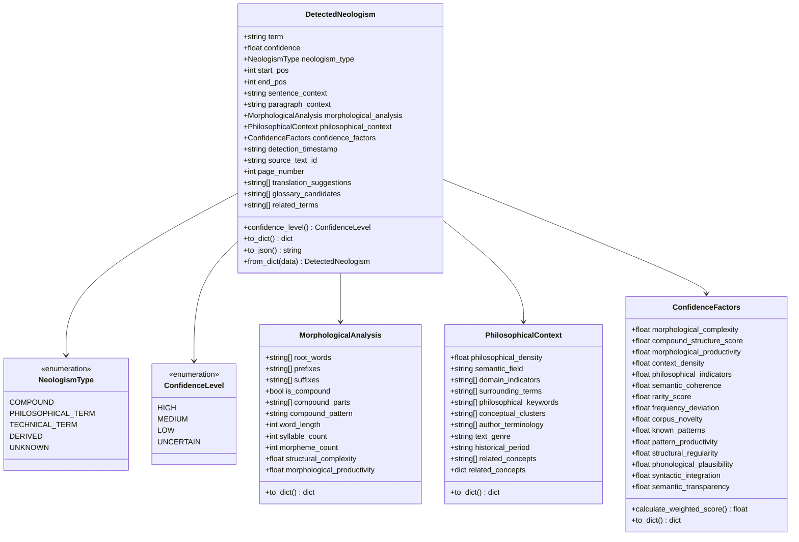
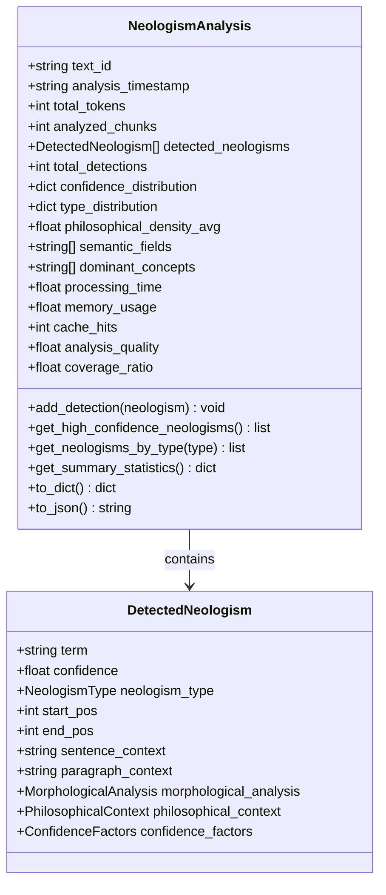
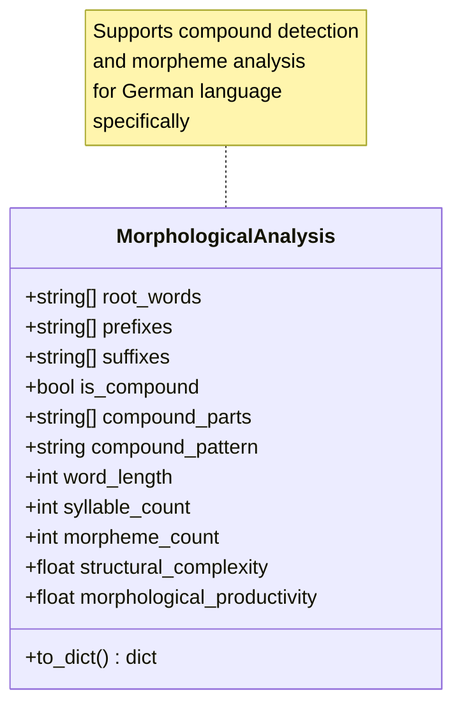
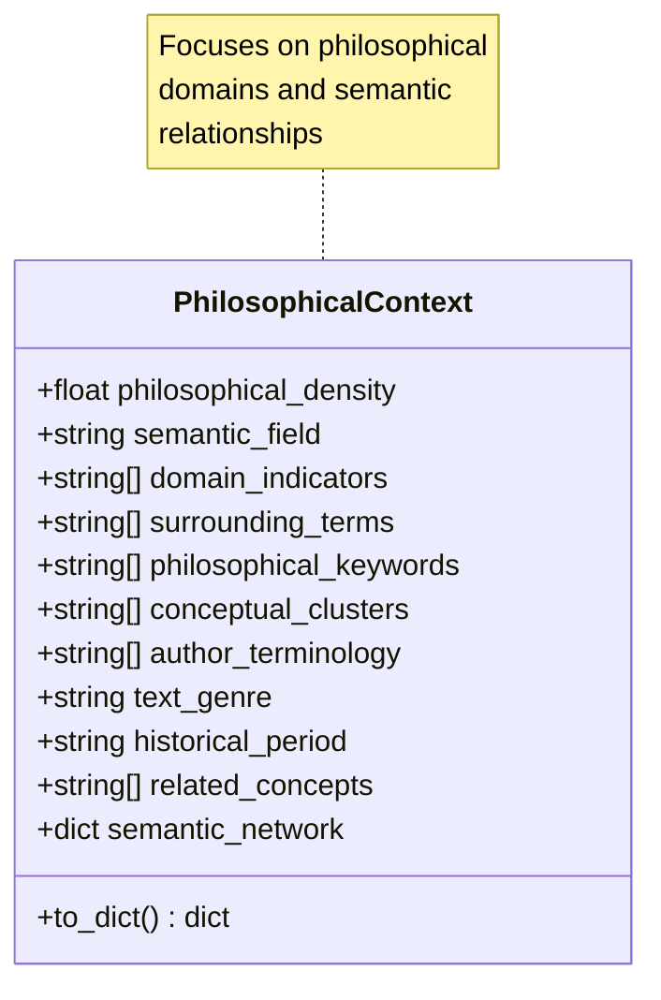
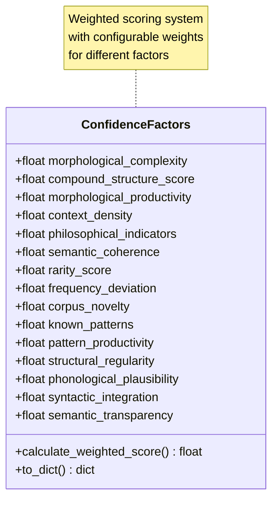
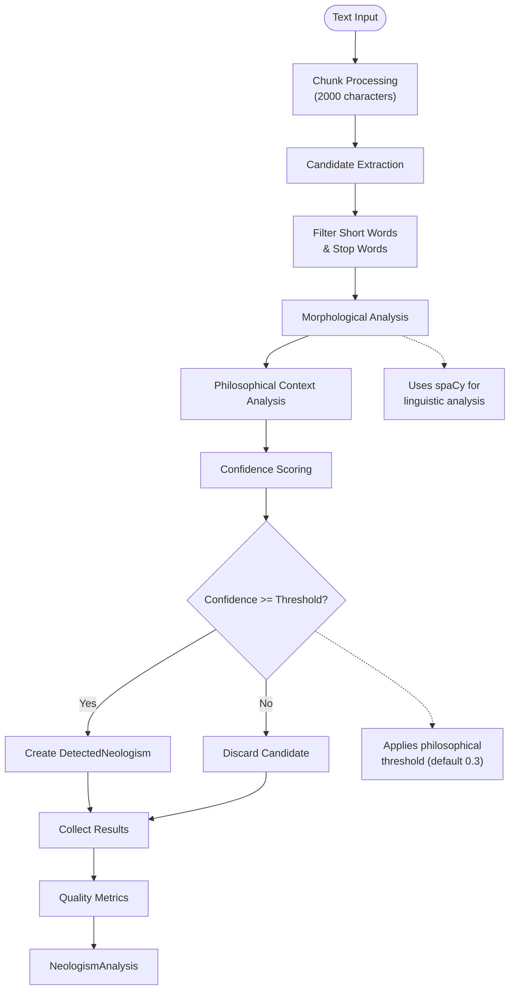
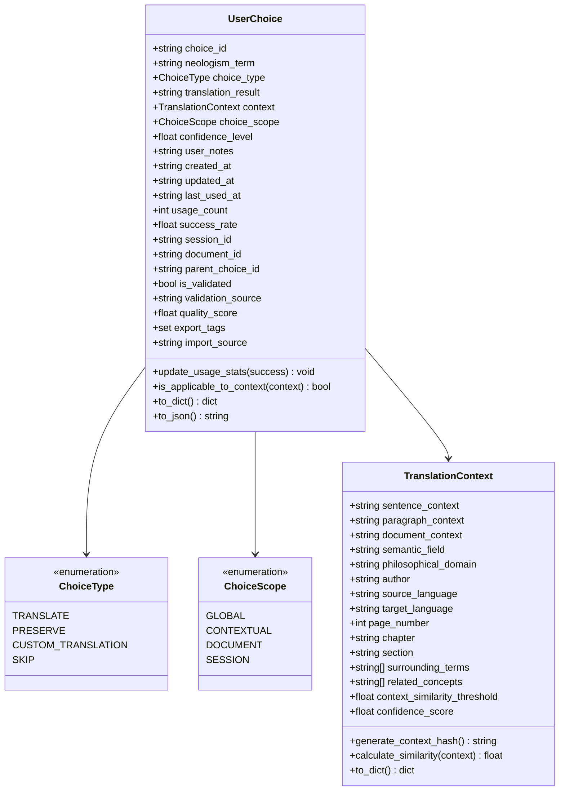
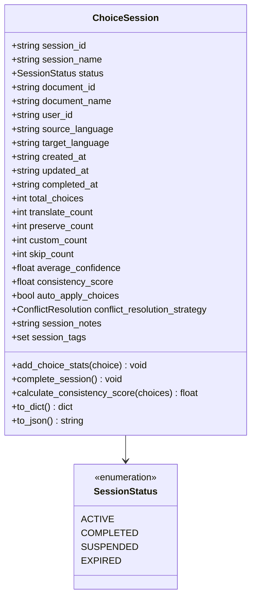
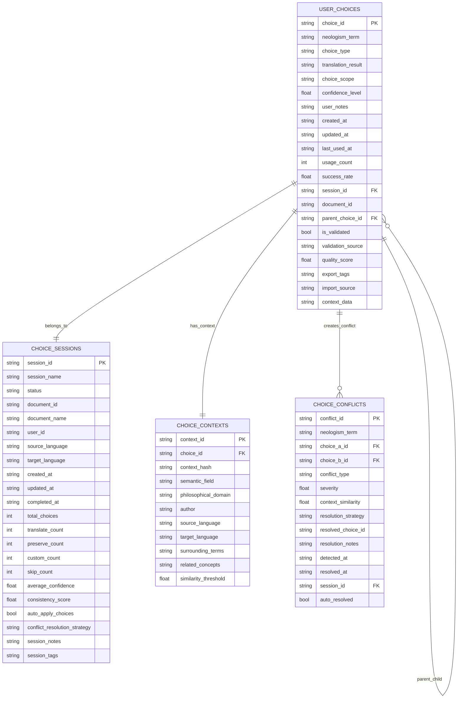
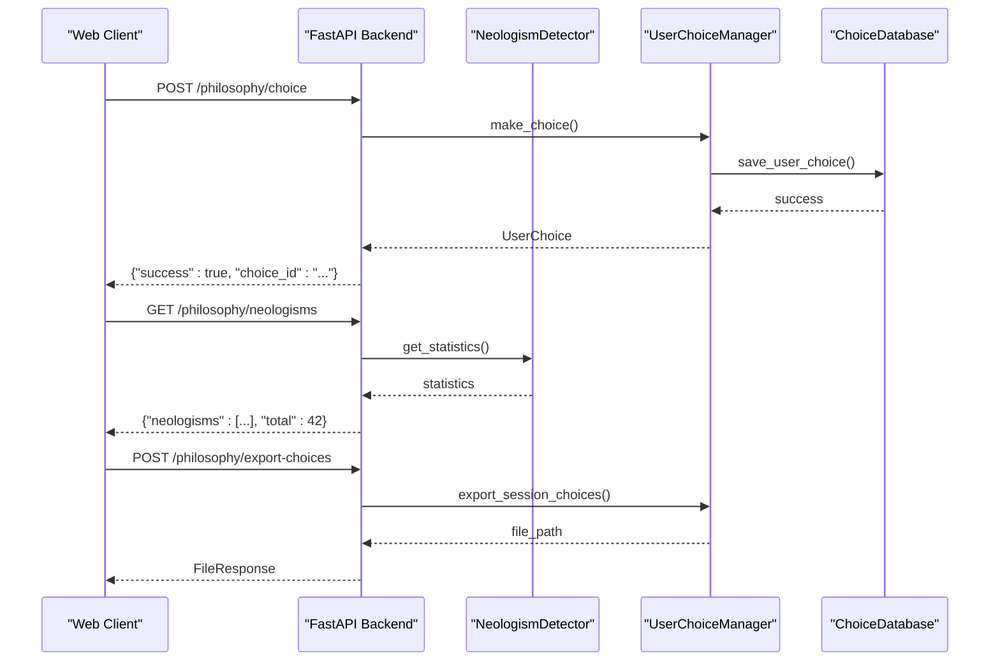

# Neologism Models

<cite>
**Referenced Files in This Document**
- [models/neologism_models.py](file://models/neologism_models.py)
- [services/neologism_detector.py](file://services/neologism_detector.py)
- [services/philosophical_context_analyzer.py](file://services/philosophical_context_analyzer.py)
- [services/confidence_scorer.py](file://services/confidence_scorer.py)
- [services/user_choice_manager.py](file://services/user_choice_manager.py)
- [models/user_choice_models.py](file://models/user_choice_models.py)
- [database/choice_database.py](file://database/choice_database.py)
- [examples/neologism_integration_example.py](file://examples/neologism_integration_example.py)
- [static/philosophy_interface.js](file://static/philosophy_interface.js)
- [api/routes.py](file://api/routes.py)
</cite>

## Table of Contents
1. [Introduction](#introduction)
2. [Core Neologism Models](#core-neologism-models)
3. [Model Architecture](#model-architecture)
4. [Detection and Analysis Pipeline](#detection-and-analysis-pipeline)
5. [User Choice Management](#user-choice-management)
6. [Database Integration](#database-integration)
7. [API Integration](#api-integration)
8. [Validation and Serialization](#validation-and-serialization)
9. [Performance Considerations](#performance-considerations)
10. [Troubleshooting Guide](#troubleshooting-guide)
11. [Conclusion](#conclusion)

## Introduction

The PhenomenalLayout neologism detection system provides sophisticated tools for identifying, analyzing, and managing novel terminology in philosophical texts. The system consists of three primary data models that work together to detect neologisms, analyze their characteristics, and manage user choices for their translation or preservation.

The neologism detection system is specifically designed for philosophy-focused translation, with capabilities to identify philosophical terms, compound words, and technical terminology that may not exist in standard dictionaries. The system integrates seamlessly with the broader translation infrastructure while maintaining flexibility for various use cases.

## Core Neologism Models

### DetectedNeologism Model

The `DetectedNeologism` model serves as the primary representation of identified neologisms, containing comprehensive information about each detected term along with detailed analysis data.



**Diagram sources**
- [models/neologism_models.py](file://models/neologism_models.py#L1-L558)

#### Key Fields and Properties

**Identification Fields:**
- `term`: The detected neologism as a string
- `confidence`: Numeric confidence score (0.0-1.0)
- `neologism_type`: Classification of the neologism type
- `start_pos`, `end_pos`: Character positions in the source text

**Context Information:**
- `sentence_context`: Full sentence containing the neologism
- `paragraph_context`: Paragraph containing the neologism
- `page_number`: Page number if applicable (PDF documents)

**Analysis Components:**
- `morphological_analysis`: Detailed morphological breakdown
- `philosophical_context`: Philosophical and semantic analysis
- `confidence_factors`: Individual confidence calculation components

**Section sources**
- [models/neologism_models.py](file://models/neologism_models.py#L250-L350)

### NeologismAnalysis Model

The `NeologismAnalysis` model aggregates comprehensive results from neologism detection across an entire document or text chunk.



**Diagram sources**
- [models/neologism_models.py](file://models/neologism_models.py#L400-L500)

#### Statistical Analysis Features

The `NeologismAnalysis` model provides comprehensive statistical analysis:

- **Distribution Tracking**: Confidence and type distributions
- **Quality Metrics**: Analysis quality and coverage ratios
- **Performance Data**: Processing time and memory usage
- **Semantic Analysis**: Dominant concepts and semantic fields

**Section sources**
- [models/neologism_models.py](file://models/neologism_models.py#L400-L558)

## Model Architecture

### Morphological Analysis

The morphological analysis component provides detailed linguistic breakdown of neologisms, essential for understanding their structure and potential meanings.



**Diagram sources**
- [models/neologism_models.py](file://models/neologism_models.py#L25-L80)

#### Morphological Features

- **Root Words**: Base components of the neologism
- **Prefixes/Suffixes**: Affixes attached to the root
- **Compound Detection**: Identification of compound structures
- **Complexity Metrics**: Structural and productivity scores

**Section sources**
- [models/neologism_models.py](file://models/neologism_models.py#L25-L80)

### Philosophical Context Analysis

The philosophical context model captures semantic and contextual information crucial for understanding the philosophical significance of neologisms.



**Diagram sources**
- [models/neologism_models.py](file://models/neologism_models.py#L85-L150)

#### Contextual Elements

- **Philosophical Density**: Measure of philosophical content in context
- **Semantic Field**: Domain classification (consciousness, existence, etc.)
- **Author Terminology**: Specific terms used by the author
- **Related Concepts**: Conceptual network connections

**Section sources**
- [models/neologism_models.py](file://models/neologism_models.py#L85-L150)

### Confidence Factors

The confidence factors model calculates weighted confidence scores based on multiple linguistic and contextual factors.



**Diagram sources**
- [models/neologism_models.py](file://models/neologism_models.py#L155-L240)

#### Factor Categories

- **Morphological Factors**: Structural complexity and productivity
- **Context Factors**: Philosophical density and semantic coherence
- **Frequency Factors**: Rarity and corpus novelty
- **Pattern Factors**: Known patterns and structural regularity
- **Linguistic Factors**: Phonological plausibility and syntactic integration

**Section sources**
- [models/neologism_models.py](file://models/neologism_models.py#L155-L240)

## Detection and Analysis Pipeline

### Neologism Detection Process

The neologism detection follows a sophisticated pipeline that combines linguistic analysis, contextual evaluation, and confidence scoring.



**Diagram sources**
- [services/neologism_detector.py](file://services/neologism_detector.py#L200-L400)

### Detection Components

The detection system consists of several specialized components:

1. **Candidate Extraction**: Identifies potential neologisms based on word length, POS tagging, and compound patterns
2. **Morphological Analysis**: Uses spaCy models to analyze word structure and identify compounds
3. **Philosophical Context Analysis**: Evaluates the philosophical significance and semantic field
4. **Confidence Scoring**: Calculates weighted confidence scores using multiple factors
5. **Threshold Filtering**: Applies configurable confidence thresholds for detection

**Section sources**
- [services/neologism_detector.py](file://services/neologism_detector.py#L200-L400)

### Confidence Calculation

The confidence scoring system uses a sophisticated weighted approach:

```python
# Weighted confidence calculation
weights = {
    "morphological": 0.25,
    "context": 0.30,
    "frequency": 0.20,
    "pattern": 0.15,
    "linguistic": 0.10,
}
```

Each factor category contributes to the final confidence score with different weights, allowing for nuanced assessment of neologism likelihood.

**Section sources**
- [services/confidence_scorer.py](file://services/confidence_scorer.py#L150-L200)

## User Choice Management

### UserChoice Model

The user choice management system allows users to make decisions about how detected neologisms should be handled during translation.



**Diagram sources**
- [models/user_choice_models.py](file://models/user_choice_models.py#L1-L300)

#### Choice Types and Scopes

**Choice Types:**
- `TRANSLATE`: Translate the neologism normally
- `PRESERVE`: Keep the original term unchanged
- `CUSTOM_TRANSLATION`: Use a custom translation provided by the user
- `SKIP`: Skip the term entirely

**Choice Scopes:**
- `GLOBAL`: Apply to all occurrences across all documents
- `CONTEXTUAL`: Apply to similar contexts
- `DOCUMENT`: Apply within the current document only
- `SESSION`: Apply within the current session only

**Section sources**
- [models/user_choice_models.py](file://models/user_choice_models.py#L10-L50)

### Choice Session Management

Sessions provide a way to group related choices and track translation projects.



**Diagram sources**
- [models/user_choice_models.py](file://models/user_choice_models.py#L350-L450)

**Section sources**
- [models/user_choice_models.py](file://models/user_choice_models.py#L350-L500)

## Database Integration

### Database Schema

The choice database uses SQLite with a normalized schema for efficient storage and retrieval of user choices and neologism data.



**Diagram sources**
- [database/choice_database.py](file://database/choice_database.py#L100-L200)

### Database Operations

The database layer provides comprehensive CRUD operations for all neologism-related data:

- **User Choices**: Save, retrieve, update, and delete individual choices
- **Sessions**: Manage translation sessions with statistics and progress tracking
- **Context Matching**: Efficient context-based choice retrieval
- **Conflict Resolution**: Track and resolve conflicting user choices
- **Batch Operations**: Bulk import/export of choices and terminologies

**Section sources**
- [database/choice_database.py](file://database/choice_database.py#L300-L500)

## API Integration

### Philosophy Interface API

The philosophy interface provides RESTful endpoints for neologism management and user interaction.



**Diagram sources**
- [api/routes.py](file://api/routes.py#L50-L150)

### API Endpoints

The system provides several key endpoints:

- `/philosophy/choice`: Save user choices for neologisms
- `/philosophy/neologisms`: Retrieve detected neologisms
- `/philosophy/progress`: Get processing progress
- `/philosophy/export-choices`: Export user choices to JSON
- `/philosophy/import-choices`: Import choices from JSON
- `/philosophy/terminology`: Get current terminology database

**Section sources**
- [api/routes.py](file://api/routes.py#L50-L200)

## Validation and Serialization

### Data Validation

The neologism models include comprehensive validation and serialization capabilities:

```python
# Example validation in DetectedNeologism.from_dict()
def from_dict(cls, data: dict[str, Any]) -> DetectedNeologism:
    # Validate neologism type
    neologism_type = NeologismType.UNKNOWN
    if "neologism_type" in data:
        if isinstance(data["neologism_type"], str):
            try:
                neologism_type = NeologismType(data["neologism_type"])
            except ValueError:
                neologism_type = NeologismType.UNKNOWN

    # Validate confidence score
    confidence = float(data.get("confidence", 0.0))
    if not 0.0 <= confidence <= 1.0:
        raise ValueError("Confidence must be between 0.0 and 1.0")

    return cls(...)
```

### Serialization Formats

All models support JSON serialization with the following methods:

- `to_dict()`: Convert to Python dictionary
- `to_json()`: Convert to formatted JSON string
- `from_dict()`: Create instance from dictionary data

**Section sources**
- [models/neologism_models.py](file://models/neologism_models.py#L350-L450)

## Performance Considerations

### Caching Strategy

The neologism detection system implements intelligent caching to improve performance:

- **Morphological Analysis Cache**: LRU cache for morphological analysis results
- **Context Hashing**: Efficient context matching using SHA-256 hashes
- **Session Caching**: Active sessions cached in memory for quick access
- **Batch Processing**: Chunked text processing to manage memory usage

### Memory Management

- **Lazy Loading**: Components loaded only when needed
- **Streaming Processing**: Large texts processed in chunks
- **Efficient Data Structures**: Optimized for frequent lookups and updates
- **Garbage Collection**: Automatic cleanup of expired sessions and unused data

**Section sources**
- [services/neologism_detector.py](file://services/neologism_detector.py#L100-L200)

## Troubleshooting Guide

### Common Issues and Solutions

**Issue**: Low neologism detection rates
- **Solution**: Adjust philosophical threshold, check terminology database completeness, verify spaCy model availability

**Issue**: High false positive rates
- **Solution**: Increase confidence threshold, review morphological analysis patterns, refine philosophical indicators

**Issue**: Performance problems with large documents
- **Solution**: Reduce chunk size, enable caching, optimize database indexes

**Issue**: User choices not persisting
- **Solution**: Check database connectivity, verify session validity, review transaction commits

### Debugging Tools

The system provides several debugging capabilities:

- `debug_compound_detection()`: Test compound word detection
- `debug_extract_candidates()`: Analyze candidate extraction
- `get_statistics()`: Comprehensive system statistics
- `validate_data_integrity()`: Check database consistency

**Section sources**
- [services/neologism_detector.py](file://services/neologism_detector.py#L700-L800)

## Conclusion

The PhenomenalLayout neologism detection system provides a comprehensive solution for identifying and managing novel terminology in philosophical texts. The three-tier model architecture—comprising DetectedNeologism, NeologismAnalysis, and user choice management—offers flexibility, scalability, and robustness for various translation scenarios.

Key strengths of the system include:

- **Sophisticated Analysis**: Multi-faceted analysis combining morphological, contextual, and confidence factors
- **Flexible Choice Management**: Comprehensive user choice system with conflict resolution
- **Robust Database Integration**: Efficient storage and retrieval with normalization
- **Web Interface**: Interactive philosophy interface for user engagement
- **API Integration**: RESTful APIs for seamless integration with larger systems

The system is particularly well-suited for philosophy-focused translation projects where understanding the semantic and philosophical context of neologisms is crucial. Its modular design allows for easy extension and customization while maintaining backward compatibility and data integrity.

Future enhancements could include machine learning-based confidence scoring, expanded language support, and enhanced collaborative features for academic translation projects.
