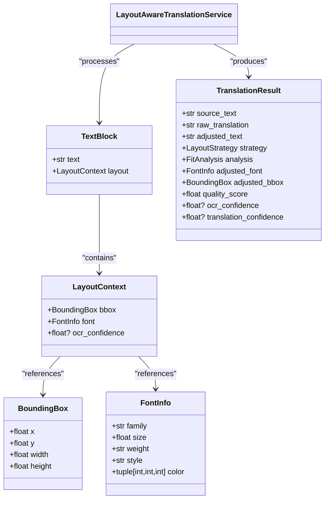
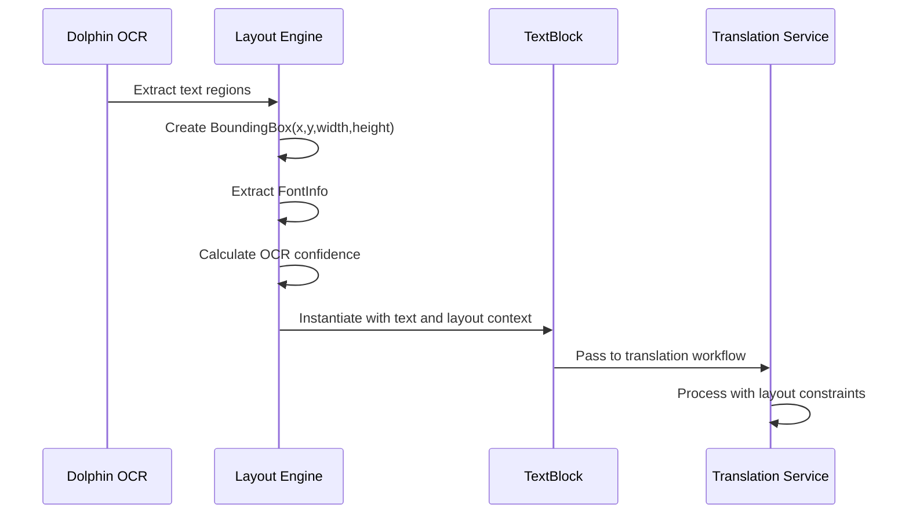
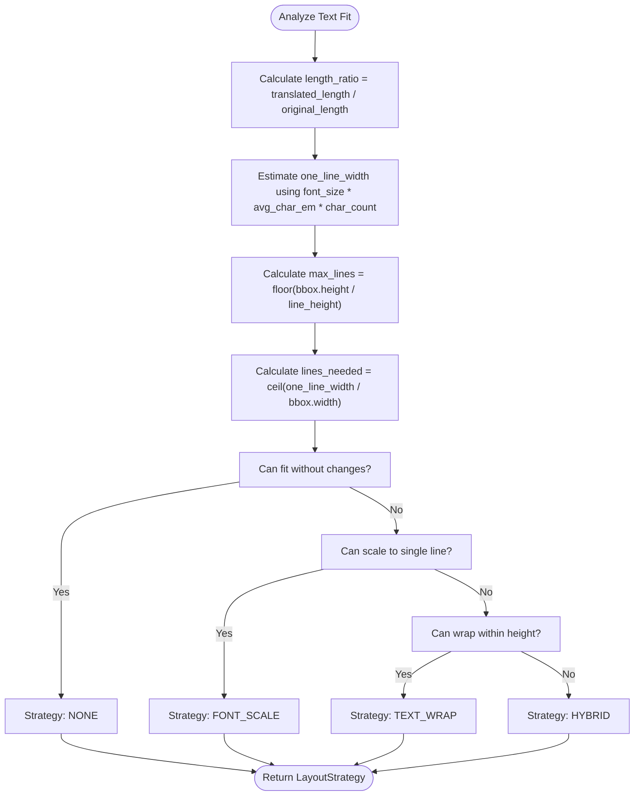
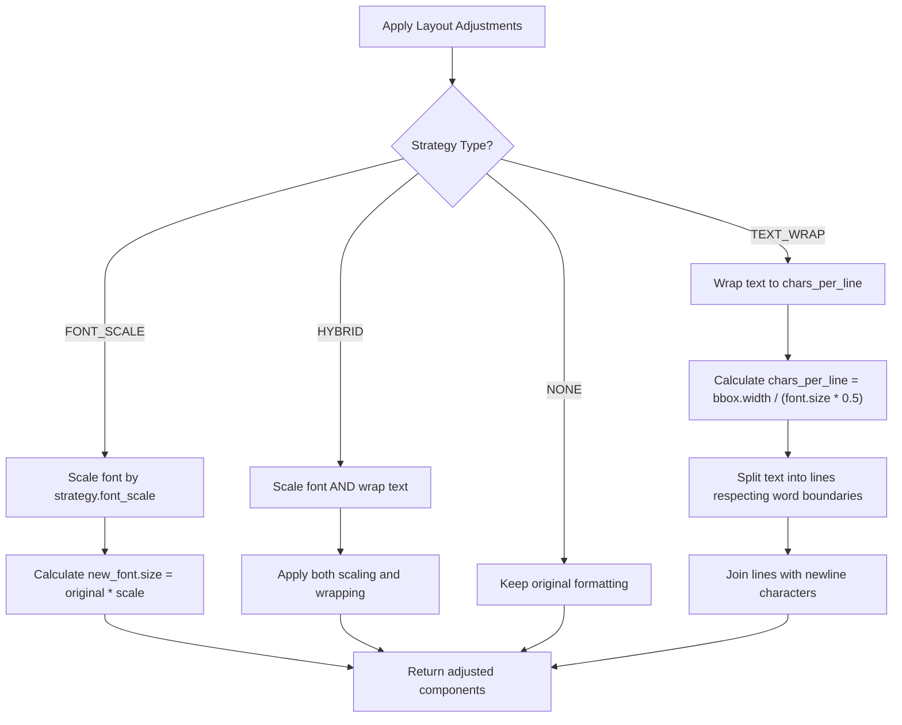
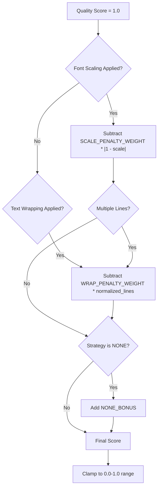

# Text Block

<cite>
**Referenced Files in This Document**  
- [dolphin_ocr/layout.py](file://dolphin_ocr/layout.py#L0-L410)
- [services/layout_aware_translation_service.py](file://services/layout_aware_translation_service.py#L70-L270)
- [services/pdf_document_reconstructor.py](file://services/pdf_document_reconstructor.py#L41-L45)
- [models/user_choice_models.py](file://models/user_choice_models.py#L75-L76)
</cite>

## Table of Contents
1. [Introduction](#introduction)
2. [TextBlock Data Model](#textblock-data-model)
3. [Field Definitions](#field-definitions)
4. [Creation from OCR Results](#creation-from-ocr-results)
5. [Layout Preservation Engine](#layout-preservation-engine)
6. [Text Wrapping and Font Scaling](#text-wrapping-and-font-scaling)
7. [Translation Workflow Integration](#translation-workflow-integration)
8. [Challenges and Solutions](#challenges-and-solutions)
9. [Philosophy-Enhanced Translation Integration](#philosophy-enhanced-translation-integration)
10. [Quality Assessment](#quality-assessment)

## Introduction
The TextBlock entity in PhenomenalLayout represents individual text elements within a document's layout structure. It serves as a fundamental unit for preserving formatting during translation workflows, ensuring that translated content maintains the visual integrity of the original document. TextBlocks are created from OCR results and undergo various transformations during translation to accommodate length variations while preserving layout aesthetics.

**Section sources**
- [dolphin_ocr/layout.py](file://dolphin_ocr/layout.py#L0-L410)
- [services/layout_aware_translation_service.py](file://services/layout_aware_translation_service.py#L70-L270)

## TextBlock Data Model
The TextBlock model is designed to capture both textual content and its spatial characteristics within a document. While the core representation is minimal, it integrates with rich context objects to provide comprehensive layout information. The model enables layout-aware translation by preserving critical formatting details through the translation process.

**Diagram sources**
- [services/layout_aware_translation_service.py](file://services/layout_aware_translation_service.py#L70-L95)
- [dolphin_ocr/layout.py](file://dolphin_ocr/layout.py#L20-L35)

## Field Definitions
The TextBlock entity comprises several key fields that capture both content and presentation attributes:

**Position (x, y coordinates)**: Represented by the BoundingBox class, these coordinates define the origin point of the text block within the document's coordinate space, using a PDF-like system where (x,y) denotes the bottom-left corner.

**Dimensions (width, height)**: Also part of BoundingBox, these values specify the spatial boundaries available for the text content, measured in points (same units as font sizes).

**original_text**: The source text extracted via OCR, preserved as a reference for length comparison and context preservation during translation.

**translated_text**: The target language output that undergoes layout adjustments to fit within the original constraints.

**font_properties**: Captured in the FontInfo class, including family, size, weight, style, and color, which are critical for maintaining visual consistency.

**confidence_score**: An optional field that quantifies the reliability of the OCR extraction, used in quality assessment and decision-making processes.

**Section sources**
- [dolphin_ocr/layout.py](file://dolphin_ocr/layout.py#L20-L35)
- [services/layout_aware_translation_service.py](file://services/layout_aware_translation_service.py#L70-L95)
- [services/pdf_document_reconstructor.py](file://services/pdf_document_reconstructor.py#L41-L45)
- [models/user_choice_models.py](file://models/user_choice_models.py#L75-L76)

## Creation from OCR Results
TextBlock instances are created from OCR processing in the dolphin_ocr module. The OCR system extracts text regions from document images and constructs BoundingBox objects with precise positional and dimensional data. Each detected text element becomes a TextBlock with its associated LayoutContext, preserving the spatial relationship between text elements. The creation process captures the original_text and assigns an ocr_confidence score based on recognition certainty.

**Diagram sources**
- [dolphin_ocr/layout.py](file://dolphin_ocr/layout.py#L0-L410)
- [services/layout_aware_translation_service.py](file://services/layout_aware_translation_service.py#L70-L270)

## Layout Preservation Engine
The LayoutPreservationEngine analyzes how translated text fits within the original bounding box and determines appropriate adjustment strategies. It evaluates multiple factors including length ratio, single-line width, maximum lines that fit vertically, and required lines for wrapping. The engine implements four strategies: NONE (no changes), FONT_SCALE (adjust font size), TEXT_WRAP (wrap text to multiple lines), and HYBRID (combine scaling with wrapping).

**Diagram sources**
- [dolphin_ocr/layout.py](file://dolphin_ocr/layout.py#L150-L300)

## Text Wrapping and Font Scaling
The system implements sophisticated text wrapping calculations based on block dimensions and font properties. The _wrap_text_to_width method performs greedy wrapping while respecting word boundaries, with hard-breaking for exceptionally long words. Font scaling logic adjusts the font size within configurable limits (default 0.6-1.2x) to optimize space utilization. The average character width heuristic (0.5em) estimates text width for layout decisions, ensuring deterministic behavior across processing runs.

**Diagram sources**
- [dolphin_ocr/layout.py](file://dolphin_ocr/layout.py#L300-L410)

## Translation Workflow Integration
TextBlocks integrate with translation services through the LayoutAwareTranslationService, which processes batches of text blocks while preserving individual layout contexts. The workflow begins with translation via McpLingoClient, followed by whitespace optimization to minimize length expansion. The LayoutPreservationEngine then analyzes fit requirements and applies appropriate adjustments. The result is a TranslationResult object containing both the raw translation and layout-adjusted version.

**Section sources**
- [services/layout_aware_translation_service.py](file://services/layout_aware_translation_service.py#L100-L270)

## Challenges and Solutions
Several challenges arise in text block processing:

**Overlapping blocks**: Addressed through the OCR preprocessing stage which ensures non-overlapping bounding boxes by design.

**Line breaking in constrained spaces**: Solved by the hybrid strategy that combines modest font scaling with intelligent text wrapping, prioritizing readability while maintaining layout integrity.

**Special characters**: Handled by preserving Unicode characters through the entire pipeline and adjusting character width estimates for non-Latin scripts in future enhancements.

**Variable confidence scores**: Managed by incorporating ocr_confidence into quality assessment, allowing downstream processes to weight results appropriately.

## Philosophy-Enhanced Translation Integration
TextBlock objects integrate with philosophy-enhanced translation to maintain contextual integrity during text flow adjustments. The system preserves semantic relationships between text elements while modifying presentation. When font scaling or text wrapping occurs, the philosophical context analyzer ensures that conceptual connections between adjacent blocks are maintained. This integration allows for dynamic text flow adjustments without compromising the document's intellectual structure.

**Section sources**
- [services/philosophy_enhanced_translation_service.py](file://services/philosophy_enhanced_translation_service.py#L124-L125)

## Quality Assessment
The system calculates a layout preservation quality score between 0 and 1, combining penalties for font scaling and text wrapping. Scaling penalty (weight 0.35) is proportional to |1 - scale|, while wrapping penalty (weight 0.25) accounts for additional lines beyond the original single line. A minor bonus (0.05) is awarded for the NONE strategy when applicable. This scoring system enables objective comparison of layout preservation effectiveness across different documents and translation scenarios.

**Diagram sources**
- [dolphin_ocr/layout.py](file://dolphin_ocr/layout.py#L250-L270)
