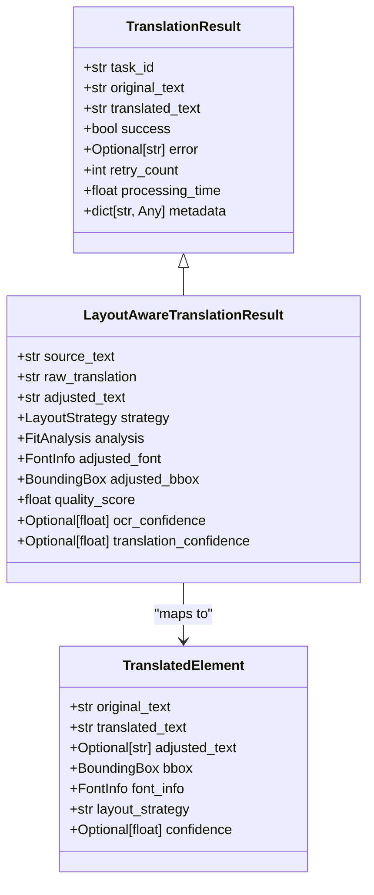
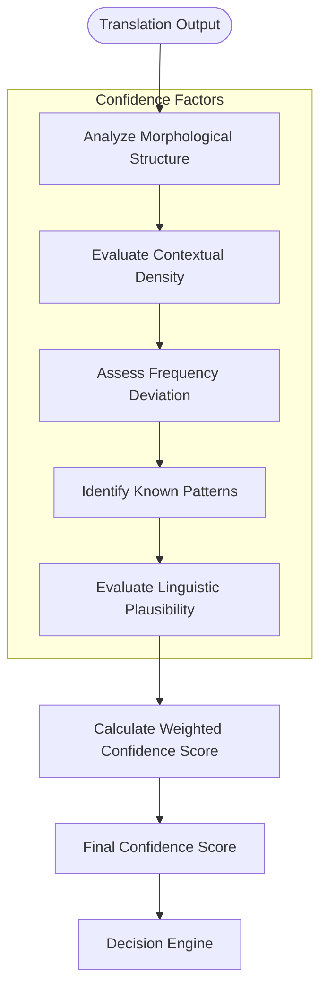
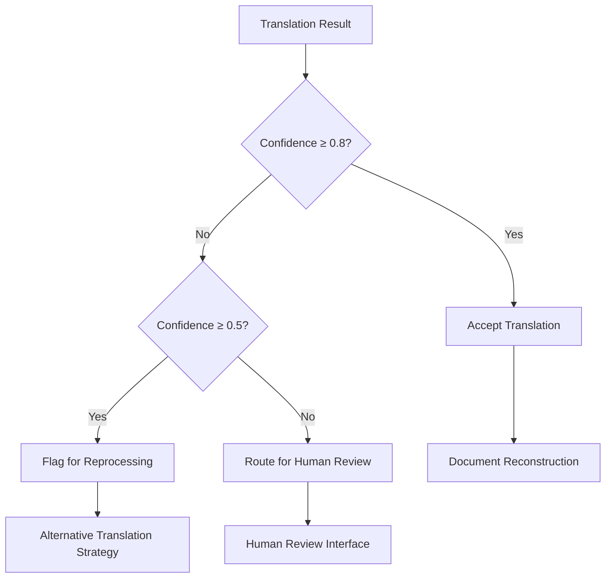
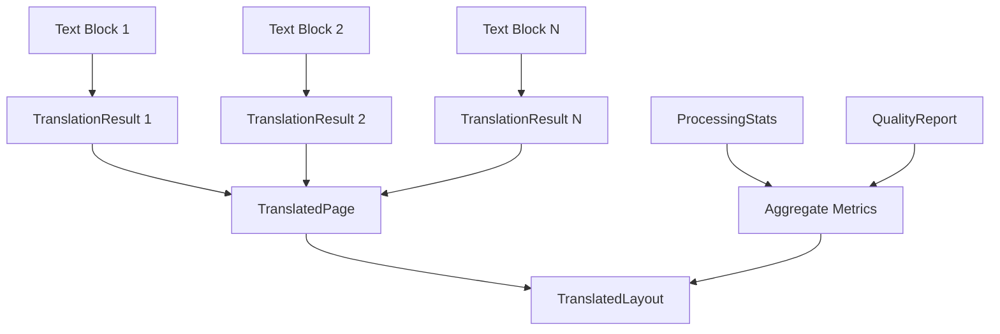
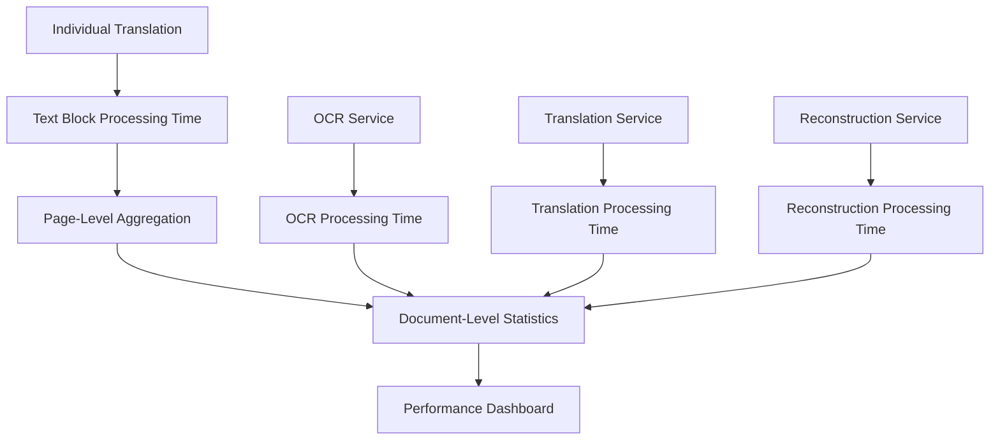
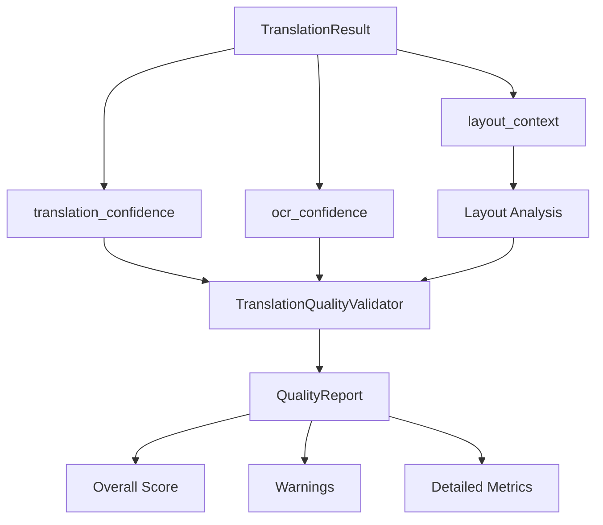

# Translation Result

<cite>
**Referenced Files in This Document**  
- [parallel_translation_service.py](file://services/parallel_translation_service.py)
- [layout_aware_translation_service.py](file://services/layout_aware_translation_service.py)
- [main_document_processor.py](file://services/main_document_processor.py)
- [pdf_document_reconstructor.py](file://services/pdf_document_reconstructor.py)
- [confidence_scorer.py](file://services/confidence_scorer.py)
- [translation_quality.py](file://services/translation_quality.py)
- [user_choice_models.py](file://models/user_choice_models.py)
- [neologism_models.py](file://models/neologism_models.py)
</cite>

## Table of Contents
1. [Introduction](#introduction)
2. [TranslationResult Model Structure](#translationresult-model-structure)
3. [Core Fields and Their Purpose](#core-fields-and-their-purpose)
4. [Confidence Scoring and Quality Assessment](#confidence-scoring-and-quality-assessment)
5. [Decision-Making for Reprocessing and Review](#decision-making-for-reprocessing-and-review)
6. [Result Aggregation Across Text Blocks and Pages](#result-aggregation-across-text-blocks-and-pages)
7. [Performance Monitoring with Processing Time](#performance-monitoring-with-processing-time)
8. [Integration with Translation Quality Evaluation](#integration-with-translation-quality-evaluation)
9. [Serialization for API and UI](#serialization-for-api-and-ui)
10. [Conclusion](#conclusion)

## Introduction
The TranslationResult model in PhenomenalLayout serves as the central data structure for encapsulating the output of translation services. It provides a comprehensive representation of translation outcomes, including both linguistic content and quality metrics. This model plays a critical role in enabling confidence-based decision making, performance monitoring, and quality assurance across the document translation pipeline. By standardizing the representation of translation outputs, it facilitates consistent processing, aggregation, and evaluation throughout the system.

## TranslationResult Model Structure
The TranslationResult model exists in multiple specialized forms across different services, each tailored to specific translation contexts while maintaining core consistency in key fields. The model captures both the direct output of translation operations and associated metadata that enables downstream processing and quality assessment.

**Diagram sources**
- [parallel_translation_service.py](file://services/parallel_translation_service.py#L130-L140)
- [layout_aware_translation_service.py](file://services/layout_aware_translation_service.py#L82-L94)
- [pdf_document_reconstructor.py](file://services/pdf_document_reconstructor.py#L55-L75)

**Section sources**
- [parallel_translation_service.py](file://services/parallel_translation_service.py#L125-L140)
- [layout_aware_translation_service.py](file://services/layout_aware_translation_service.py#L80-L94)

## Core Fields and Their Purpose
The TranslationResult model contains several key fields that capture essential information about the translation process and its outcome. These fields enable comprehensive tracking, quality assessment, and decision-making throughout the translation pipeline.

### Primary Content Fields
The model's core content fields capture the fundamental linguistic transformation performed by the translation service:

- **translated_text**: Contains the final translated text output, representing the primary result of the translation operation. This field may contain raw or adjusted text depending on the specific implementation context.
- **source_language**: Specifies the original language of the text being translated, enabling language pair validation and context-aware processing.
- **target_language**: Specifies the target language for the translation, ensuring consistency across translation operations and enabling language-specific processing rules.

### Quality and Metadata Fields
Additional fields provide critical metadata and quality indicators that support advanced processing and evaluation:

- **confidence_score**: Represents the system's confidence in the accuracy and quality of the translation, typically ranging from 0.0 to 1.0. This score is used for decision-making regarding reprocessing or human review.
- **processing_time**: Captures the duration of the translation operation in seconds, enabling performance monitoring and optimization across the system.
- **error_details**: Contains detailed information about any errors that occurred during translation, facilitating troubleshooting and error recovery.

**Section sources**
- [parallel_translation_service.py](file://services/parallel_translation_service.py#L130-L140)
- [user_choice_models.py](file://models/user_choice_models.py#L75-L85)
- [neologism_models.py](file://models/neologism_models.py#L402-L405)

## Confidence Scoring and Quality Assessment
The confidence scoring system in PhenomenalLayout provides a sophisticated mechanism for evaluating the reliability of translation results. This system integrates multiple factors to produce a comprehensive confidence assessment that informs downstream decision-making.

### Confidence Scoring Architecture
The confidence scoring process is implemented in the ConfidenceScorer class, which analyzes various linguistic and contextual factors to determine the reliability of translation outputs. The system evaluates multiple dimensions including morphological complexity, contextual density, frequency deviation, and pattern recognition to produce a weighted confidence score.

**Diagram sources**
- [confidence_scorer.py](file://services/confidence_scorer.py#L100-L150)
- [translation_quality.py](file://services/translation_quality.py#L20-L40)

**Section sources**
- [confidence_scorer.py](file://services/confidence_scorer.py#L1-L498)

## Decision-Making for Reprocessing and Review
The TranslationResult model plays a crucial role in determining whether translations require reprocessing or human review. The confidence score and other quality indicators serve as inputs to decision logic that determines the appropriate next steps in the translation workflow.

### Automated Decision Logic
The system implements threshold-based decision rules that use the confidence score to determine whether a translation is acceptable or requires additional processing:

- **High confidence (≥ 0.8)**: Translations are accepted without further review and proceed directly to document reconstruction.
- **Medium confidence (0.5-0.79)**: Translations are flagged for potential reprocessing with alternative strategies or parameters.
- **Low confidence (< 0.5)**: Translations are routed for human review or alternative processing paths.

This tiered approach ensures that resources are focused on translations that require the most attention while allowing high-quality outputs to proceed efficiently through the pipeline.

**Diagram sources**
- [confidence_scorer.py](file://services/confidence_scorer.py#L300-L350)
- [translation_quality.py](file://services/translation_quality.py#L50-L100)

**Section sources**
- [confidence_scorer.py](file://services/confidence_scorer.py#L300-L400)
- [translation_quality.py](file://services/translation_quality.py#L50-L100)

## Result Aggregation Across Text Blocks and Pages
The TranslationResult model supports aggregation of translation outcomes across multiple text blocks and pages, enabling comprehensive evaluation of document-level translation quality and performance.

### Batch Processing and Aggregation
When processing multi-page documents, the system collects TranslationResult objects for each text block and aggregates them into page-level and document-level summaries. This hierarchical aggregation allows for both granular analysis of individual translation units and holistic assessment of overall document quality.

The aggregation process follows a structured approach:
1. Individual text blocks are translated and their results captured in TranslationResult objects
2. Results are grouped by page and combined into TranslatedPage objects
3. All pages are assembled into a TranslatedLayout object representing the complete document
4. Summary statistics are calculated across all results for performance and quality metrics

**Diagram sources**
- [main_document_processor.py](file://services/main_document_processor.py#L40-L239)
- [pdf_document_reconstructor.py](file://services/pdf_document_reconstructor.py#L40-L239)

**Section sources**
- [main_document_processor.py](file://services/main_document_processor.py#L40-L239)
- [pdf_document_reconstructor.py](file://services/pdf_document_reconstructor.py#L40-L239)

## Performance Monitoring with Processing Time
The processing_time field in the TranslationResult model serves as a critical metric for performance monitoring and optimization across the translation pipeline. This metadata enables detailed analysis of system performance and identification of optimization opportunities.

### Performance Tracking Implementation
The system captures processing time at multiple levels of granularity:
- Individual text block translation
- Page-level processing
- Document-wide operations
- Specific service components (OCR, translation, reconstruction)

This multi-level timing data allows for comprehensive performance analysis and bottleneck identification. The processing_time values are aggregated into ProcessingStats objects that provide an overview of the time distribution across different stages of the translation workflow.

**Diagram sources**
- [main_document_processor.py](file://services/main_document_processor.py#L40-L60)
- [neologism_models.py](file://models/neologism_models.py#L400-L405)

**Section sources**
- [main_document_processor.py](file://services/main_document_processor.py#L40-L60)
- [neologism_models.py](file://models/neologism_models.py#L400-L405)

## Integration with Translation Quality Evaluation
The TranslationResult model integrates closely with the translation quality evaluation system, providing the foundational data for comprehensive quality assessment. The translation_quality.py module consumes TranslationResult objects to generate detailed quality reports that inform system optimization and user feedback.

### Quality Assessment Workflow
The quality evaluation process combines translation confidence with layout quality metrics to produce a holistic assessment of translation quality:

1. Translation confidence scores from TranslationResult are combined with layout analysis data
2. A weighted quality score is calculated based on both linguistic and layout factors
3. Warnings are generated for potential quality issues such as text overflow or font scaling
4. Comprehensive QualityReport objects are produced for each translation unit

The integration between TranslationResult and quality evaluation ensures that both linguistic accuracy and visual presentation are considered in the overall quality assessment.

**Diagram sources**
- [translation_quality.py](file://services/translation_quality.py#L0-L145)
- [layout_aware_translation_service.py](file://services/layout_aware_translation_service.py#L80-L94)

**Section sources**
- [translation_quality.py](file://services/translation_quality.py#L0-L145)

## Serialization for API and UI
The TranslationResult model is designed to support seamless serialization for both API responses and UI display. The data structure is optimized for conversion to JSON format, enabling efficient transmission and rendering in web interfaces.

### API Response Structure
When exposed through the API, TranslationResult objects are serialized into JSON format with consistent field naming and type handling. The serialization process includes:
- Conversion of dataclass fields to JSON-compatible types
- Inclusion of all relevant metadata and quality indicators
- Proper handling of optional fields and null values
- Consistent formatting for timestamps and numerical values

The resulting JSON structure provides a comprehensive representation of the translation outcome that can be consumed by client applications and displayed in user interfaces.

### UI Display Integration
In the user interface, TranslationResult data is used to provide detailed feedback on translation quality and processing status. The confidence score and processing time metrics are visualized to help users understand the reliability and performance of the translation system. Error details are presented in a user-friendly format to facilitate troubleshooting when issues occur.

**Section sources**
- [main_document_processor.py](file://services/main_document_processor.py#L40-L239)
- [pdf_document_reconstructor.py](file://services/pdf_document_reconstructor.py#L40-L239)

## Conclusion
The TranslationResult model in PhenomenalLayout serves as a comprehensive container for translation outputs, integrating linguistic content with quality metrics and performance data. By standardizing the representation of translation outcomes, it enables consistent processing, aggregation, and evaluation across the document translation pipeline. The model's design supports critical functionality including confidence-based decision making, performance monitoring, and quality assessment, making it a foundational component of the system's architecture. Through its integration with confidence scoring, quality evaluation, and serialization mechanisms, the TranslationResult model ensures that translation outcomes are not only linguistically accurate but also reliable, performant, and transparent to users.
