# User Choice Models

<cite>
**Referenced Files in This Document**  
- [user_choice_models.py](file://models/user_choice_models.py)
- [user_choice_manager.py](file://services/user_choice_manager.py)
- [choice_database.py](file://database/choice_database.py)
- [philosophy_interface.html](file://templates/philosophy_interface.html)
- [philosophy_interface.js](file://static/philosophy_interface.js)
- [user_choice_integration_example.py](file://examples/user_choice_integration_example.py)
</cite>

## Table of Contents
1. [Introduction](#introduction)
2. [UserChoice Model](#userchoice-model)
3. [ChoiceContext Model](#choicecontext-model)
4. [BatchChoiceOperation Model](#batchchoiceoperation-model)
5. [User Choice Management Service](#user-choice-management-service)
6. [Philosophy Interface Integration](#philosophy-interface-integration)
7. [Data Integrity and Validation](#data-integrity-and-validation)
8. [Conflict Resolution Strategies](#conflict-resolution-strategies)
9. [Conclusion](#conclusion)

## Introduction
The User Choice Models in PhenomenalLayout provide a comprehensive system for managing user decisions in neologism translation. This documentation details the data models and services that enable personalized translation preferences, particularly in philosophical text processing. The system captures user choices, contextual metadata, and bulk operations while maintaining referential integrity between components. The models support sophisticated validation, conflict resolution, and persistence mechanisms to ensure consistent and reliable translation decisions across documents.

## UserChoice Model
The UserChoice model represents individual user decisions regarding neologism translation. It captures essential information about the choice, including the neologism term, choice type, translation result, and contextual metadata.

### Core Fields
The UserChoice model contains the following core fields:

| Field | Type | Description |
|-------|------|-------------|
| choice_id | str | Unique identifier for the choice |
| neologism_term | str | The neologism term being translated |
| choice_type | ChoiceType | Type of choice (translate, preserve, custom_translation, skip) |
| translation_result | str | The resulting translation when applicable |
| context | TranslationContext | Contextual information for the choice |
| choice_scope | ChoiceScope | Scope of choice application |
| confidence_level | float | User's confidence in the choice (0.0-1.0) |
| user_notes | str | Optional user notes about the choice |

### Choice Types and Scopes
The model utilizes two enumeration classes to define choice characteristics:

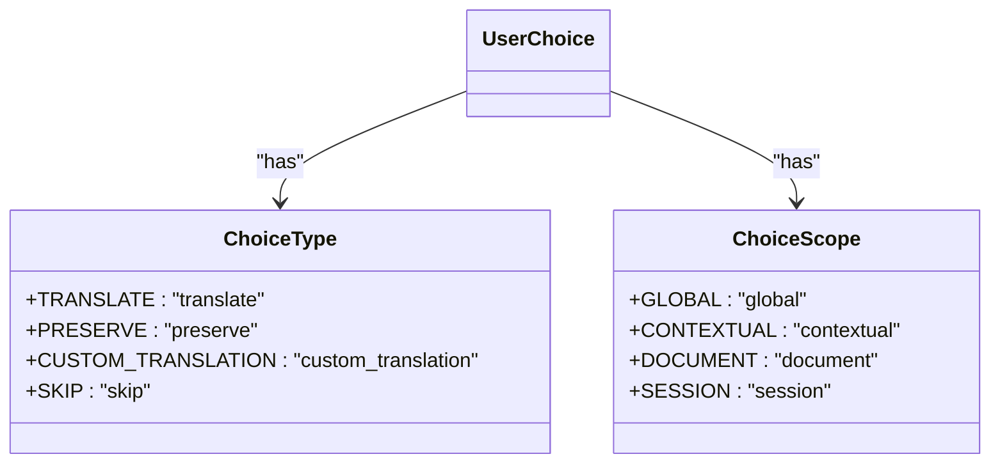

**Diagram sources**
- [user_choice_models.py](file://models/user_choice_models.py#L15-L35)

The ChoiceType enumeration defines four possible actions for handling neologisms:
- TRANSLATE: Apply a standard translation
- PRESERVE: Keep the original term without translation
- CUSTOM_TRANSLATION: Use a user-defined translation
- SKIP: Skip processing this neologism

The ChoiceScope enumeration determines where the choice applies:
- GLOBAL: Applies to all occurrences of the term
- CONTEXTUAL: Applies to similar contexts based on similarity threshold
- DOCUMENT: Applies only within the current document
- SESSION: Applies only within the current user session

### Temporal and Usage Tracking
The model includes comprehensive temporal and usage tracking fields:

| Field | Type | Description |
|-------|------|-------------|
| created_at | str | ISO timestamp when choice was created |
| updated_at | str | ISO timestamp when choice was last updated |
| last_used_at | Optional[str] | ISO timestamp of last usage |
| usage_count | int | Number of times the choice has been applied |
| success_rate | float | Exponential moving average of successful applications |

The model provides methods to update usage statistics, which helps in determining the reliability of a choice over time. The success rate is updated using an exponential moving average with a configurable learning rate.

### Relationship and Validation Fields
The UserChoice model maintains relationships with other entities and includes validation metadata:

| Field | Type | Description |
|-------|------|-------------|
| session_id | Optional[str] | ID of the associated choice session |
| document_id | Optional[str] | ID of the associated document |
| parent_choice_id | Optional[str] | ID of parent choice in inheritance chain |
| is_validated | bool | Whether the choice has been validated |
| validation_source | str | Source of validation |
| quality_score | float | Quality assessment of the choice |
| export_tags | set[str] | Tags for export filtering |
| import_source | str | Source of imported choices |

**Section sources**
- [user_choice_models.py](file://models/user_choice_models.py#L100-L300)

## ChoiceContext Model
The ChoiceContext model captures situational metadata that provides context for translation decisions. This context enables the system to apply choices appropriately based on similarity to previous contexts.

### Context Components
The TranslationContext class contains multiple dimensions of contextual information:

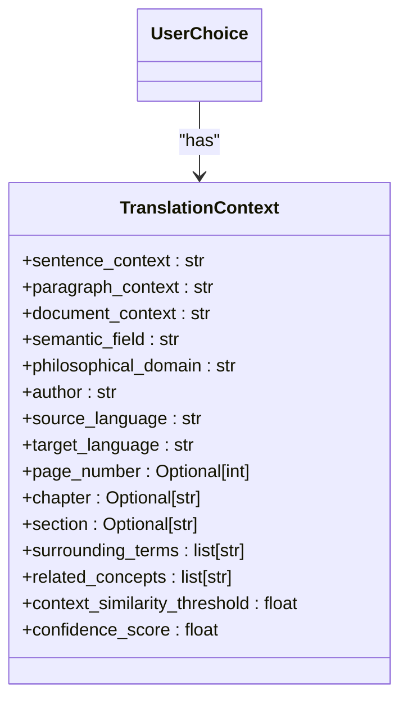

**Diagram sources**
- [user_choice_models.py](file://models/user_choice_models.py#L40-L100)

The context is organized into several categories:

**Textual Context**
- sentence_context: The sentence containing the neologism
- paragraph_context: The paragraph containing the neologism
- document_context: Broader document-level context

**Semantic Context**
- semantic_field: The semantic field or domain (e.g., "existentialism")
- philosophical_domain: The philosophical domain (e.g., "ontology")
- author: The author of the text
- source_language: Source language code
- target_language: Target language code

**Positional Context**
- page_number: Page number where the neologism appears
- chapter: Chapter identifier
- section: Section identifier

**Relational Context**
- surrounding_terms: Terms that frequently appear near the neologism
- related_concepts: Philosophical concepts related to the neologism

### Context Hashing and Similarity
The model includes methods for generating context hashes and calculating similarity between contexts:

```python
def generate_context_hash(self) -> str:
    """Generate hash for context matching."""
    context_data = {
        "semantic_field": self.semantic_field,
        "philosophical_domain": self.philosophical_domain,
        "author": self.author,
        "source_language": self.source_language,
        "target_language": self.target_language,
        "surrounding_terms": sorted(self.surrounding_terms),
        "related_concepts": sorted(self.related_concepts),
    }

    context_str = json.dumps(context_data, sort_keys=True)
    return hashlib.sha256(context_str.encode()).hexdigest()
```

The calculate_similarity method compares two contexts across multiple dimensions, including semantic field, philosophical domain, author, language pair, surrounding terms overlap, and related concepts overlap. The similarity score is a weighted average of these factors, enabling the system to determine whether a previously made choice should apply to a new occurrence of a neologism.

**Section sources**
- [user_choice_models.py](file://models/user_choice_models.py#L80-L150)

## BatchChoiceOperation Model
While not explicitly defined as a separate model, the system supports batch operations through the user choice manager service and philosophy interface. These operations enable bulk import, export, and processing of user choices.

### Batch Processing Methods
The UserChoiceManager service provides several methods for batch operations:

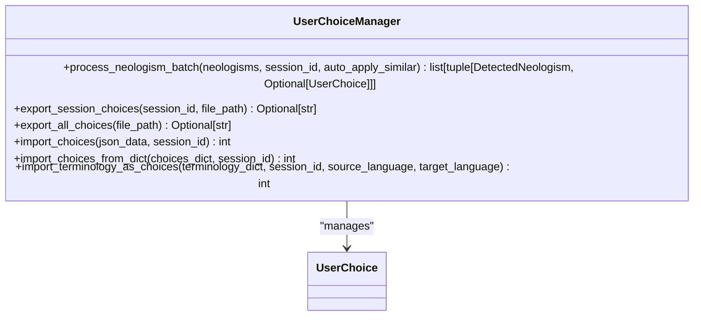

**Diagram sources**
- [user_choice_manager.py](file://services/user_choice_manager.py#L500-L600)

The key batch operations include:

**Neologism Batch Processing**
The process_neologism_batch method processes multiple neologisms at once, returning suggested choices for each. It can automatically apply similar choices based on confidence thresholds and scope.

**Export Operations**
The export_session_choices and export_all_choices methods export user choices to JSON format, preserving all metadata and context information. These exports can be used for backup, sharing, or migration.

**Import Operations**
The import_choices and related methods allow importing choices from JSON data. The import_terminology_as_choices method specifically converts terminology dictionaries into user choices with appropriate metadata.

### Philosophy Interface Batch Operations
The philosophy interface provides a user-friendly interface for batch operations:

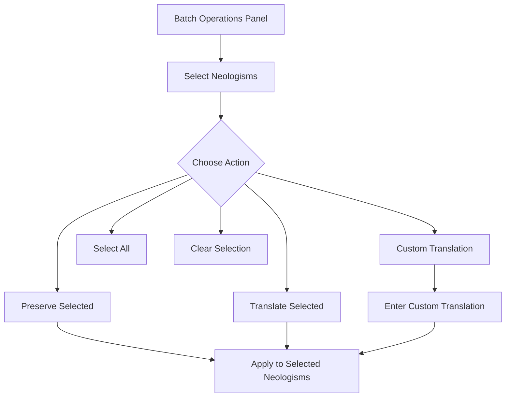

**Diagram sources**
- [philosophy_interface.html](file://templates/philosophy_interface.html#L60-L80)
- [philosophy_interface.js](file://static/philosophy_interface.js#L200-L250)

The interface allows users to select multiple neologisms and apply a single action to all selected items, significantly improving efficiency when dealing with large documents containing many neologisms.

**Section sources**
- [user_choice_manager.py](file://services/user_choice_manager.py#L500-L600)
- [philosophy_interface.html](file://templates/philosophy_interface.html#L60-L80)

## User Choice Management Service
The UserChoiceManager service orchestrates the creation, retrieval, and management of user choices, providing a comprehensive API for interacting with the user choice models.

### Service Architecture
The service follows a layered architecture with clear separation of concerns:

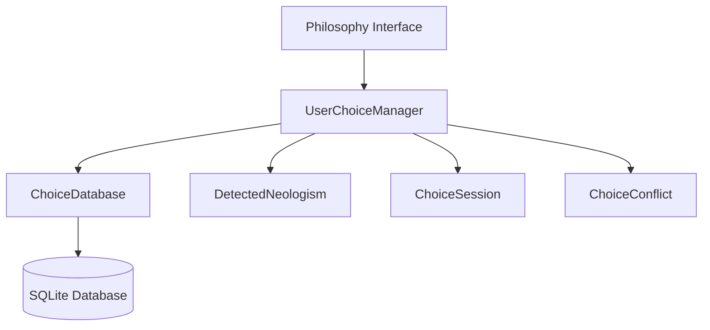

**Diagram sources**
- [user_choice_manager.py](file://services/user_choice_manager.py#L1-L50)
- [choice_database.py](file://database/choice_database.py#L1-L50)

### Core Methods
The service provides several key methods for managing user choices:

**Session Management**
- create_session: Creates a new choice session with metadata
- get_session: Retrieves a session by ID
- complete_session: Completes a session and calculates final statistics
- get_active_sessions: Retrieves all active sessions
- get_user_sessions: Retrieves sessions for a specific user

**Choice Management**
- make_choice: Records a user choice for a detected neologism
- get_choice_for_neologism: Retrieves the best matching choice for a neologism
- get_choices_by_term: Retrieves all choices for a specific term
- get_session_choices: Retrieves all choices for a session
- update_choice: Updates an existing choice
- delete_choice: Deletes a choice

**Conflict Management**
- _check_for_conflicts: Detects conflicts with existing choices
- _resolve_conflicts_automatically: Automatically resolves conflicts based on strategy
- get_unresolved_conflicts: Retrieves all unresolved conflicts
- resolve_conflict: Manually resolves a conflict

### Configuration and Statistics
The service is configurable with parameters that affect its behavior:

| Parameter | Default | Description |
|---------|--------|-------------|
| db_path | "database/user_choices.db" | Path to SQLite database file |
| auto_resolve_conflicts | True | Whether to automatically resolve conflicts |
| session_expiry_hours | 24 | Hours before sessions expire |

The service maintains comprehensive statistics through its stats dictionary:
- total_choices_made: Total number of choices made
- conflicts_resolved: Number of conflicts resolved
- sessions_created: Number of sessions created
- cache_hits: Number of times existing choices were reused
- context_matches: Number of times contextually similar choices were applied

**Section sources**
- [user_choice_manager.py](file://services/user_choice_manager.py#L50-L200)

## Philosophy Interface Integration
The philosophy interface provides a user-friendly frontend for interacting with the user choice models, enabling users to make and manage translation decisions.

### Interface Components
The interface consists of several key components that integrate with the user choice models:

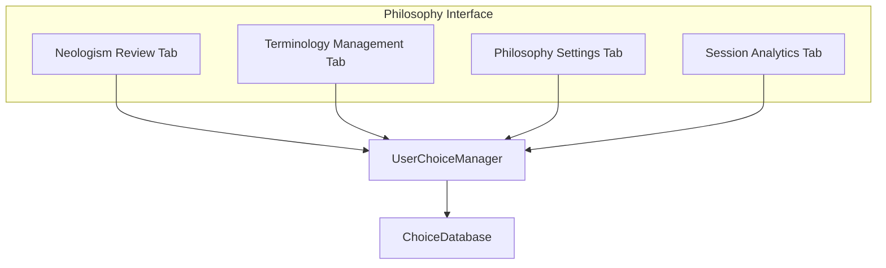

**Diagram sources**
- [philosophy_interface.html](file://templates/philosophy_interface.html#L1-L50)
- [philosophy_interface.js](file://static/philosophy_interface.js#L1-L50)

### Neologism Review Workflow
The primary workflow for capturing user decisions occurs in the Neologism Review tab:

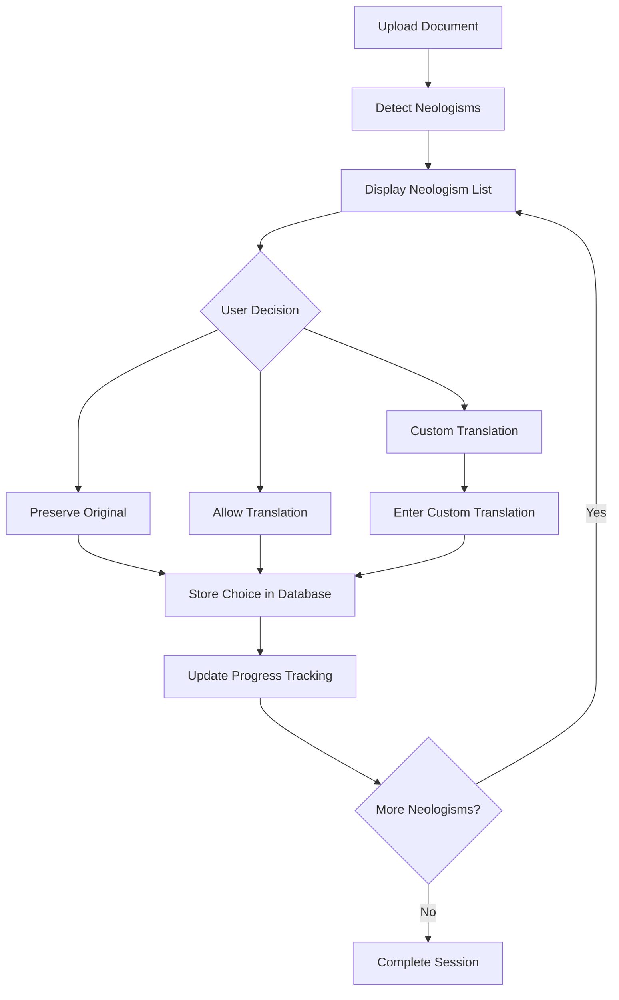

**Diagram sources**
- [philosophy_interface.html](file://templates/philosophy_interface.html#L85-L120)
- [philosophy_interface.js](file://static/philosophy_interface.js#L300-L400)

When a user uploads a document, the system detects neologisms and displays them in a list. For each neologism, the user can choose to preserve the original term, allow translation, or provide a custom translation. These choices are immediately sent to the backend and stored in the database.

### Real-time Updates and WebSocket Integration
The interface uses WebSocket connections for real-time updates:

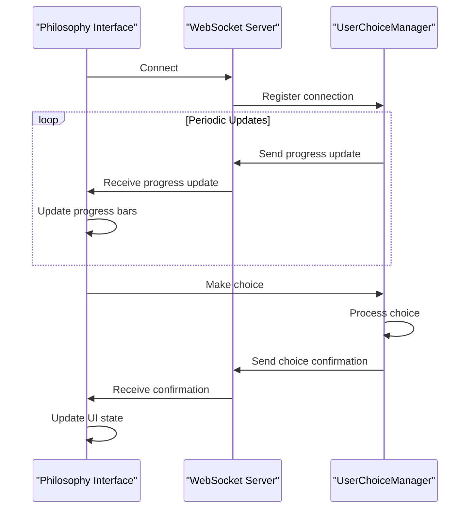

**Diagram sources**
- [philosophy_interface.js](file://static/philosophy_interface.js#L50-L100)

The WebSocket connection enables real-time progress tracking, choice confirmation, and conflict notifications without requiring page refreshes. This creates a responsive user experience, particularly important when processing large documents.

### Terminology Management
The Terminology Management tab allows users to import, export, and manage terminology:

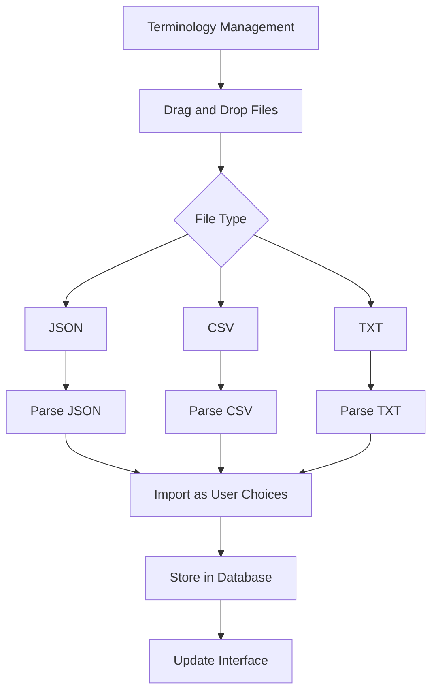

**Diagram sources**
- [philosophy_interface.html](file://templates/philosophy_interface.html#L125-L150)
- [philosophy_interface.js](file://static/philosophy_interface.js#L400-L450)

Users can drag and drop terminology files in various formats, which are then parsed and imported as user choices. This feature facilitates the integration of existing terminology databases into the system.

**Section sources**
- [philosophy_interface.html](file://templates/philosophy_interface.html#L1-L200)
- [philosophy_interface.js](file://static/philosophy_interface.js#L1-L500)

## Data Integrity and Validation
The system implements comprehensive data integrity and validation mechanisms to ensure the reliability and consistency of user choices.

### Referential Integrity
The database schema enforces referential integrity through foreign key constraints:

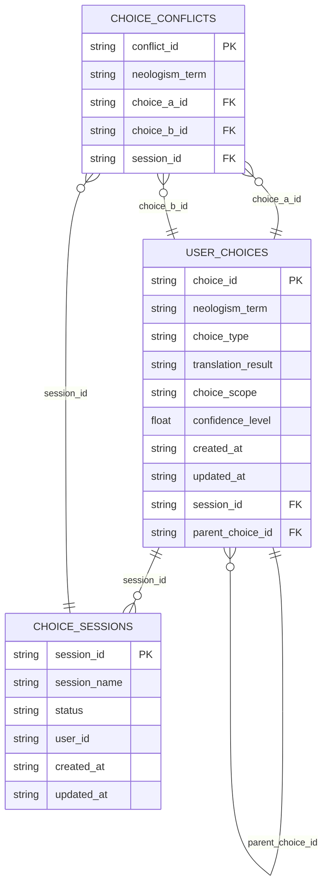

**Diagram sources**
- [choice_database.py](file://database/choice_database.py#L200-L400)

The database schema includes foreign key constraints that ensure:
- User choices reference valid sessions
- Parent choices reference existing choices
- Conflicts reference valid choices and sessions

### Validation Constraints
The system implements multiple layers of validation:

**Field-Level Validation**
- choice_type must be a valid ChoiceType enum value
- choice_scope must be a valid ChoiceScope enum value
- confidence_level must be between 0.0 and 1.0
- created_at and updated_at must be valid ISO timestamps

**Contextual Validation**
- Choices must have valid context information
- Session status transitions follow valid paths (active → completed)
- Conflict resolution strategies are validated before application

**Database-Level Validation**
The ChoiceDatabase class includes validation methods for configurable parameters:

```python
def _validate_alpha(self, alpha: float) -> float:
    """Validate learning rate alpha parameter."""
    if not isinstance(alpha, (int, float)):
        raise ValueError(f"Learning rate alpha must be a number, got {type(alpha)}")

    if not (0.001 <= alpha <= 1.0):
        raise ValueError(f"Learning rate alpha must be between 0.001 and 1.0, got {alpha}")

    return float(alpha)
```

**Data Integrity Validation**
The UserChoiceManager provides a comprehensive data integrity validation method that checks for:
- Orphaned contexts (contexts without corresponding choices)
- Missing choice references (choices referencing non-existent sessions)
- Invalid session states
- Duplicate choices (same term + context hash)
- Conflicting choices (same term, different translations)
- Expired sessions ready for cleanup

The validation returns a detailed report with recommendations for resolving any issues found.

**Section sources**
- [choice_database.py](file://database/choice_database.py#L100-L200)
- [user_choice_manager.py](file://services/user_choice_manager.py#L800-L1000)

## Conflict Resolution Strategies
The system provides sophisticated conflict resolution mechanisms to handle situations where multiple choices exist for the same neologism.

### Conflict Detection
The system automatically detects conflicts when a new choice is made for a neologism that already has existing choices:

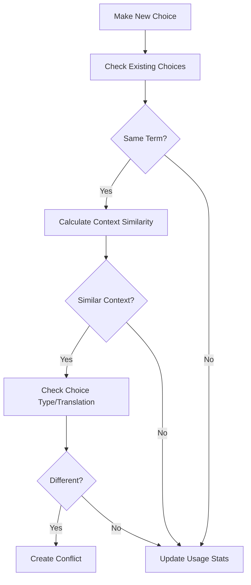

**Diagram sources**
- [user_choice_manager.py](file://services/user_choice_manager.py#L300-L350)

Conflicts are detected based on:
- Same neologism term (case-insensitive)
- Similar context (above similarity threshold)
- Different choice type or translation result

### Conflict Resolution Strategies
The system supports multiple conflict resolution strategies through the ConflictResolution enum:

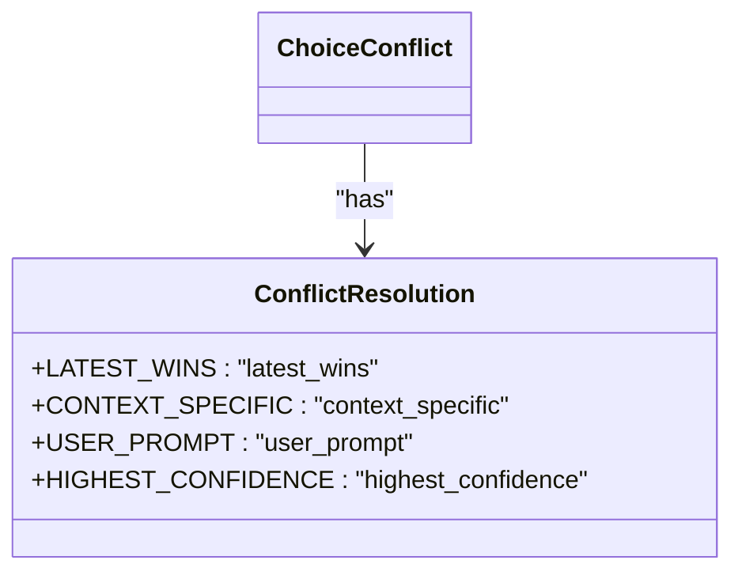

**Diagram sources**
- [user_choice_models.py](file://models/user_choice_models.py#L35-L45)

The available strategies are:
- LATEST_WINS: The most recent choice takes precedence
- CONTEXT_SPECIFIC: Both choices are kept and applied based on context similarity
- USER_PROMPT: The user is prompted to resolve the conflict
- HIGHEST_CONFIDENCE: The choice with the highest confidence level wins

### Automatic Conflict Resolution
The system can automatically resolve conflicts based on configurable rules:

```python
def _resolve_conflicts_automatically(self, conflicts: list[ChoiceConflict]) -> None:
    """Automatically resolve conflicts based on strategy."""
    for conflict in conflicts:
        # Analyze the conflict
        conflict.analyze_conflict()

        # Determine resolution strategy
        if conflict.context_similarity > 0.9:
            # Very similar contexts - use latest or highest confidence
            strategy = ConflictResolution.HIGHEST_CONFIDENCE
        elif conflict.context_similarity > 0.5:
            # Somewhat similar - keep both for context-specific use
            strategy = ConflictResolution.CONTEXT_SPECIFIC
        else:
            # Different contexts - latest wins
            strategy = ConflictResolution.LATEST_WINS

        # Resolve the conflict
        _ = conflict.resolve_conflict(strategy)
```

The automatic resolution strategy is determined by the context similarity:
- High similarity (>0.9): Use highest confidence choice
- Medium similarity (0.5-0.9): Keep both choices for context-specific application
- Low similarity (<0.5): Use latest choice

### Manual Conflict Resolution
Users can also manually resolve conflicts through the philosophy interface:

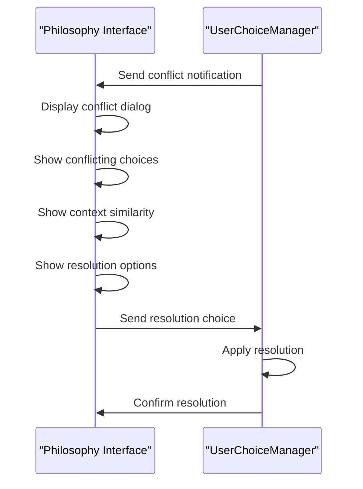

**Diagram sources**
- [philosophy_interface.js](file://static/philosophy_interface.js#L150-L200)

The interface displays the conflicting choices, their contexts, and similarity score, allowing users to make informed decisions about which choice to keep or whether to keep both for context-specific application.

**Section sources**
- [user_choice_models.py](file://models/user_choice_models.py#L300-L400)
- [user_choice_manager.py](file://services/user_choice_manager.py#L350-L400)

## Conclusion
The User Choice Models in PhenomenalLayout provide a robust and flexible system for managing translation decisions in philosophical texts. The models capture not only the basic choice information but also rich contextual metadata that enables intelligent application of choices across similar contexts. The integration between the data models, user choice manager service, and philosophy interface creates a seamless experience for users to make, manage, and reuse translation decisions.

Key strengths of the system include:
- Comprehensive context tracking for intelligent choice application
- Flexible scope options for choice application
- Sophisticated conflict detection and resolution
- Efficient batch operations for terminology management
- Strong data integrity and validation mechanisms
- Responsive user interface with real-time updates

The system effectively balances automation with user control, allowing for both automatic application of high-confidence choices and manual intervention when needed. This makes it particularly well-suited for the nuanced requirements of philosophical text translation, where consistency and precision are paramount.
