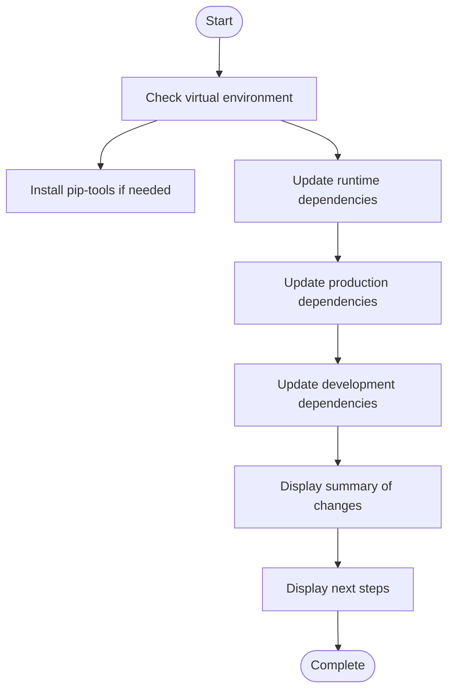

# Deployment Guide

<cite>
**Referenced Files in This Document**  
- [deploy_modal.py](file://scripts/deploy_modal.py)
- [settings.py](file://config/settings.py)
- [logging_config.py](file://dolphin_ocr/logging_config.py)
- [monitoring.py](file://dolphin_ocr/monitoring.py)
- [update-deps.sh](file://scripts/update-deps.sh)
- [requirements-prod.txt](file://requirements-prod.txt)
</cite>

## Table of Contents
1. [Modal Deployment](#modal-deployment)
2. [Production Configuration](#production-configuration)
3. [Security Considerations](#security-considerations)
4. [Performance Optimization](#performance-optimization)
5. [Monitoring and Logging](#monitoring-and-logging)
6. [Backup and Disaster Recovery](#backup-and-disaster-recovery)
7. [Maintenance Procedures](#maintenance-procedures)

## Modal Deployment

This section provides step-by-step instructions for deploying PhenomenalLayout to Modal, a serverless platform for machine learning applications. The deployment process is automated through the `deploy_modal.py` script located in the `scripts/` directory.

### Authentication and Environment Setup

Before deploying to Modal, ensure you have the required authentication credentials and environment variables configured:

1. **Modal Authentication**: Set up your Modal account and obtain the `MODAL_TOKEN_ID` and `MODAL_TOKEN_SECRET` credentials. These are required for authenticating with the Modal platform.

2. **Lingo API Key**: Obtain an API key from Lingo.dev, which is used for translation services. This key must be set as the `LINGO_API_KEY` environment variable.

3. **Optional Environment Variables**: The following optional variables can be configured:
   - `HF_TOKEN`: HuggingFace token for model downloads
   - `PDF_DPI`: DPI setting for PDF processing (default: 300)
   - `MAX_CONCURRENT_REQUESTS`: Maximum number of concurrent requests
   - `MAX_REQUESTS_PER_SECOND`: Rate limiting for API requests
   - `TRANSLATION_BATCH_SIZE`: Batch size for translation operations
   - `GRADIO_SHARE`: Enable Gradio sharing interface

4. **Environment Validation**: The deployment script validates required environment variables before proceeding. Run the deployment script to check your configuration:
   ```bash
   python scripts/deploy_modal.py
   ```

The script will report any missing or invalid environment variables and provide guidance on how to set them.

### Resource Configuration

The Modal deployment script configures resources based on environment variables and default settings. Key resource configurations include:

- **Dolphin OCR Service**: This microservice handles OCR processing and is deployed as a separate Modal application. The service uses the `dolphin_modal_service.py` module.

- **Main Application**: The primary translation application that orchestrates the workflow between OCR processing and translation services.

- **Secret Management**: The script creates Modal secrets for sensitive information like API keys. The `LINGO_API_KEY` is automatically included in the secret configuration.

### Scaling Settings

Modal automatically handles scaling based on request load. The deployment script configures the following scaling parameters:

- **Concurrency Limits**: The `TRANSLATION_CONCURRENCY_LIMIT` environment variable controls the maximum number of concurrent translation tasks (default: 8).

- **Memory Management**: The `MEMORY_THRESHOLD` setting (default: 500MB) determines when to trigger cleanup operations to prevent memory exhaustion.

- **Request Rate Limiting**: The `MAX_REQUESTS_PER_SECOND` variable (if set) limits the rate of incoming requests to prevent overwhelming the system.

To deploy to Modal:

1. Ensure all required environment variables are set
2. Run the deployment script: `python scripts/deploy_modal.py`
3. Follow the on-screen instructions to create the Modal secret
4. Deploy the Dolphin OCR service using the Modal CLI: `modal deploy services/dolphin_modal_service.py`
5. Test the deployment using the provided test script

**Section sources**
- [deploy_modal.py](file://scripts/deploy_modal.py#L1-L313)

## Production Configuration

Proper configuration is essential for running PhenomenalLayout in production environments. The primary configuration file is `config/settings.py`, which contains settings for various aspects of the application.

### Environment Variables

The application uses environment variables to configure behavior in different environments. Key environment variables include:

- **Server Configuration**:
  - `HOST`: Server host address (default: 127.0.0.1)
  - `PORT`: Server port (default: 7860, range: 1-65535)
  - `DEBUG`: Debug mode flag (default: false)

- **File Handling**:
  - `MAX_FILE_SIZE_MB`: Maximum upload file size in MB (default: 10)
  - `UPLOAD_DIR`: Directory for uploaded files (default: uploads)
  - `DOWNLOAD_DIR`: Directory for downloaded files (default: downloads)
  - `TEMP_DIR`: Temporary file directory (default: temp)
  - `IMAGE_CACHE_DIR`: Image cache directory (default: temp/images)

- **PDF Processing**:
  - `PDF_DPI`: DPI for PDF rendering (default: 300, range: 72-600)
  - `PRESERVE_IMAGES`: Whether to preserve images in PDFs (default: true)
  - `MEMORY_THRESHOLD`: Memory threshold in MB for cleanup (default: 500)

- **Translation Settings**:
  - `SOURCE_LANGUAGE`: Source language code (default: DE)
  - `TARGET_LANGUAGE`: Target language code (default: EN)
  - `TRANSLATION_DELAY`: Delay between translation requests in seconds (default: 0.1)
  - `TRANSLATION_CONCURRENCY_LIMIT`: Maximum concurrent translation tasks (default: 8)

- **Logging**:
  - `LOG_LEVEL`: Logging level (default: INFO)
  - `LOG_FILE`: Log file path (default: app.log)

- **Cleanup Settings**:
  - `CLEANUP_INTERVAL_HOURS`: Interval for cleanup operations in hours (default: 24)
  - `MAX_FILE_AGE_HOURS`: Maximum age of files before deletion in hours (default: 48)

### Configuration Validation

The `Settings` class in `settings.py` includes validation methods to ensure configuration integrity:

- **API Key Validation**: Verifies that `LINGO_API_KEY` is set
- **Language Code Validation**: Ensures source and target language codes are valid ISO 639-1 codes
- **Directory Validation**: Checks that required directories are writable
- **Numeric Settings Validation**: Validates ranges for numeric settings like port numbers and file sizes
- **Security Validation**: Ensures `SECRET_KEY` is set and sufficiently strong when `DEBUG=False`

The configuration is automatically validated on application startup, and any validation errors are logged.

**Section sources**
- [settings.py](file://config/settings.py#L1-L549)

## Security Considerations

Security is paramount when deploying PhenomenalLayout to production environments. The following security measures should be implemented:

### API Key Management

- **LINGO_API_KEY**: This sensitive credential must be stored securely and never committed to version control. Use environment variables or secret management systems to store this key.

- **SECRET_KEY**: When running in production mode (`DEBUG=False`), a strong `SECRET_KEY` must be set. The key should be at least 32 characters long and generated using a cryptographically secure random number generator.

- **Environment Variables**: All sensitive configuration should be passed through environment variables rather than hardcoded values.

### Input Validation

The application implements several layers of input validation to prevent common security vulnerabilities:

- **File Type Validation**: Only PDF files are accepted for processing, preventing execution of malicious file types.

- **File Size Limits**: The `MAX_FILE_SIZE_MB` setting prevents denial-of-service attacks through large file uploads.

- **PDF Format Validation**: The PDF to image converter validates that input files are valid PDFs by checking for the `%PDF-` header and rejecting encrypted PDFs.

- **Path Validation**: File paths are normalized and validated to prevent directory traversal attacks.

### Attack Surface Reduction

- **Minimal Dependencies**: The application uses a focused set of dependencies to reduce the attack surface.

- **Regular Updates**: Dependencies should be regularly updated to incorporate security patches.

- **Rate Limiting**: Implement rate limiting on API endpoints to prevent abuse and denial-of-service attacks.

- **CORS Configuration**: The application uses permissive CORS settings (`allow_origins=["*"]`) which should be restricted to specific domains in production.

- **Error Handling**: Detailed error messages are suppressed in production mode to prevent information leakage.

**Section sources**
- [settings.py](file://config/settings.py#L1-L549)
- [pdf_to_image.py](file://dolphin_ocr/pdf_to_image.py#L1-L284)

## Performance Optimization

Optimizing performance is critical for handling high-concurrency scenarios in production environments. The following strategies are recommended:

### Worker Scaling

- **Concurrency Control**: The `TRANSLATION_CONCURRENCY_LIMIT` setting controls the maximum number of concurrent translation tasks. This should be tuned based on available system resources and expected load.

- **Asynchronous Processing**: The application uses asynchronous processing for OCR and translation tasks, allowing efficient handling of multiple requests.

- **Resource Monitoring**: Monitor CPU, memory, and network usage to identify bottlenecks and adjust scaling parameters accordingly.

### Caching Strategies

- **Image Caching**: Processed images are cached in the `IMAGE_CACHE_DIR` directory to avoid reprocessing the same PDF pages.

- **Translation Caching**: Consider implementing a caching layer for frequently translated content to reduce API calls and improve response times.

- **Memory Management**: The application automatically cleans up temporary files based on the `CLEANUP_INTERVAL_HOURS` and `MAX_FILE_AGE_HOURS` settings.

### High-Concurrency Optimization

- **Connection Pooling**: Use connection pooling for database and external API connections to reduce connection overhead.

- **Load Balancing**: For high-traffic applications, consider deploying multiple instances behind a load balancer.

- **Database Optimization**: Optimize database queries and indexes for frequently accessed data.

- **Content Delivery Network (CDN)**: For static assets, consider using a CDN to reduce server load and improve response times.

- **Compression**: Enable compression for HTTP responses to reduce bandwidth usage and improve load times.

**Section sources**
- [settings.py](file://config/settings.py#L1-L549)
- [layout.py](file://dolphin_ocr/layout.py#L1-L410)

## Monitoring and Logging

Effective monitoring and logging are essential for maintaining production systems. PhenomenalLayout includes built-in monitoring and logging capabilities.

### Monitoring Setup

The `dolphin_ocr/monitoring.py` module provides a lightweight monitoring service that tracks operation metrics and computes error rates and latency percentiles.

```mermaid
classDiagram
class MonitoringService {
+window_seconds : int
+logger : Logger
+record_operation(operation, duration_ms, success, error_code)
+get_error_rate(window_seconds)
+get_p95_latency(operation, window_seconds)
+get_summary()
+log_health()
}
class OpStats {
+count : int
+success : int
+total_ms : float
}
MonitoringService --> OpStats : tracks
MonitoringService --> "logging.Logger" : uses
```

**Diagram sources**
- [monitoring.py](file://dolphin_ocr/monitoring.py#L1-L122)

The monitoring service:
- Tracks operation metrics with a rolling window
- Computes error rates and percentile latencies
- Provides health summaries
- Uses standard logging for output

### Logging Configuration

The `dolphin_ocr/logging_config.py` module configures centralized logging for the application:

```mermaid
classDiagram
class LoggingConfig {
+DEFAULT_LOG_LEVEL : str
+DEFAULT_LOG_FILE : str
+DEFAULT_LOGGER_NAME : str
+setup_logging(level, log_file, logger_name)
+get_logger(name)
}
LoggingConfig --> "logging.Logger" : creates
```

**Diagram sources**
- [logging_config.py](file://dolphin_ocr/logging_config.py#L1-L70)

Key logging features:
- Configurable log level via `LOG_LEVEL` environment variable
- Log file output to `LOG_FILE` (default: app.log)
- Console output for real-time monitoring
- Namespaced loggers for different components
- Automatic directory creation for log files

### Log Analysis

- **Error Tracking**: Monitor for error messages and exceptions in the logs
- **Performance Monitoring**: Track response times and identify slow operations
- **Usage Patterns**: Analyze access patterns to understand user behavior
- **Security Monitoring**: Watch for suspicious activity or potential attacks

**Section sources**
- [logging_config.py](file://dolphin_ocr/logging_config.py#L1-L70)
- [monitoring.py](file://dolphin_ocr/monitoring.py#L1-L122)

## Backup and Disaster Recovery

Implementing a robust backup and disaster recovery strategy is essential for protecting user data and ensuring business continuity.

### User Choice Data Backup

The application stores user choice data in the database layer. To protect this data:

- **Regular Backups**: Implement automated daily backups of the database
- **Offsite Storage**: Store backups in a geographically separate location
- **Encryption**: Encrypt backup files to protect sensitive data
- **Retention Policy**: Maintain multiple backup generations (e.g., daily for 7 days, weekly for 4 weeks)
- **Verification**: Regularly verify backup integrity by performing test restores

### Disaster Recovery Plan

- **Recovery Point Objective (RPO)**: Define the maximum acceptable data loss (e.g., 24 hours)
- **Recovery Time Objective (RTO)**: Define the maximum acceptable downtime (e.g., 2 hours)
- **Failover Procedures**: Document step-by-step procedures for restoring service
- **Contact List**: Maintain an up-to-date list of personnel responsible for recovery operations
- **Testing**: Regularly test the disaster recovery plan to ensure its effectiveness

### Data Protection Measures

- **Redundant Storage**: Use redundant storage systems to prevent data loss from hardware failure
- **Version Control**: Keep application code in version control with regular commits
- **Configuration Management**: Store configuration files separately from code
- **Monitoring Alerts**: Set up alerts for disk space, backup failures, and other critical issues

**Section sources**
- [choice_database.py](file://database/choice_database.py#L1-L100)

## Maintenance Procedures

Regular maintenance is essential for keeping the PhenomenalLayout application secure, performant, and up-to-date.

### Dependency Updates

The `scripts/update-deps.sh` script automates the process of updating dependencies:



**Diagram sources**
- [update-deps.sh](file://scripts/update-deps.sh#L1-L50)

To update dependencies:

1. Activate your virtual environment
2. Run the update script: `./scripts/update-deps.sh`
3. Review the changes to the requirements files
4. Sync dependencies: `pip-sync requirements-prod.txt`
5. Test the application to ensure compatibility

The script uses pip-compile to generate deterministic dependency lists with version pinning and hash verification.

### Update Best Practices

- **Regular Updates**: Schedule regular dependency updates (e.g., weekly or monthly)
- **Testing**: Thoroughly test the application after updates
- **Staging Environment**: Test updates in a staging environment before deploying to production
- **Rollback Plan**: Have a rollback plan in case updates cause issues
- **Monitoring**: Monitor application performance and error rates after updates

### Version Control

- **Commit Messages**: Use clear, descriptive commit messages
- **Branching Strategy**: Use a consistent branching strategy (e.g., Git Flow)
- **Code Reviews**: Implement code reviews for all changes
- **Automated Testing**: Run automated tests before merging changes

**Section sources**
- [update-deps.sh](file://scripts/update-deps.sh#L1-L50)
- [requirements-prod.txt](file://requirements-prod.txt#L1-L2654)
