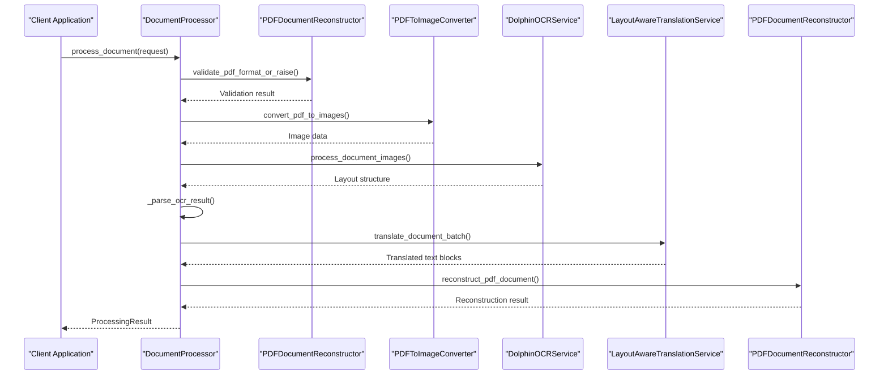
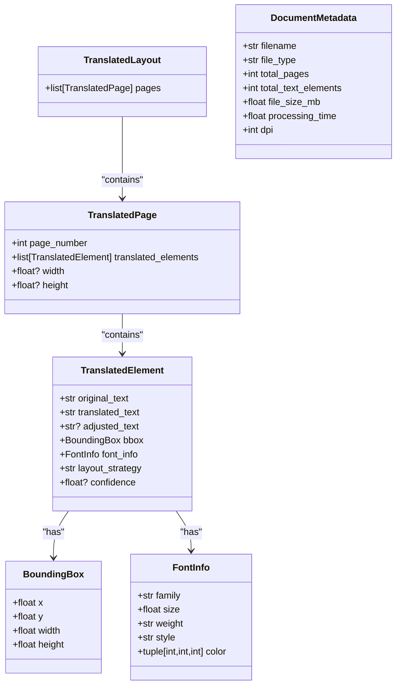
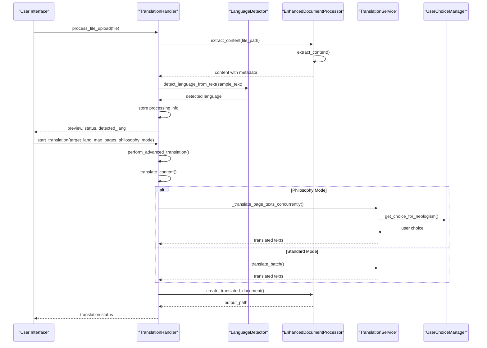
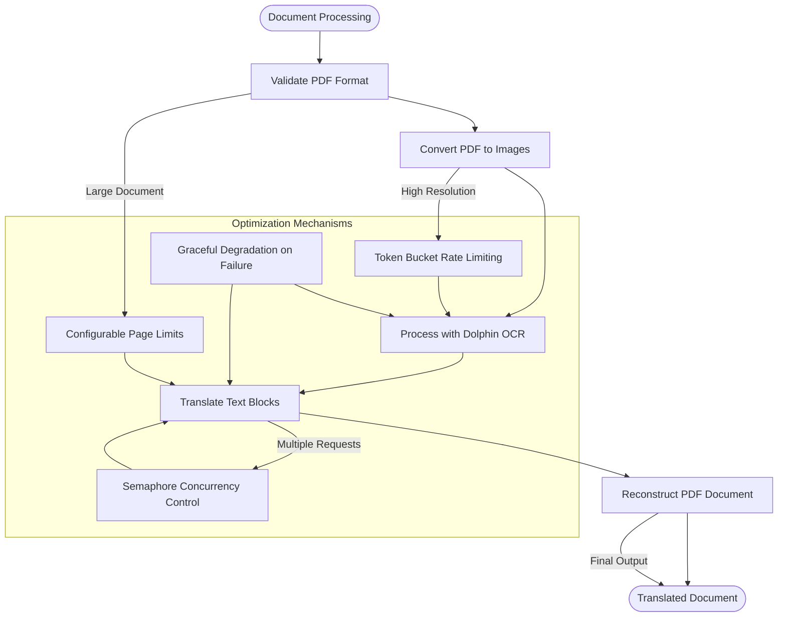

# Content Processing

<cite>
**Referenced Files in This Document**  
- [enhanced_document_processor.py](file://services/enhanced_document_processor.py)
- [translation_handler.py](file://core/translation_handler.py)
- [pdf_document_reconstructor.py](file://services/pdf_document_reconstructor.py)
- [language_detector.py](file://services/language_detector.py)
- [main_document_processor.py](file://services/main_document_processor.py)
- [async_document_processor.py](file://services/async_document_processor.py)
- [state_manager.py](file://core/state_manager.py)
- [philosophy_enhanced_document_processor.py](file://services/philosophy_enhanced_document_processor.py)
</cite>

## Table of Contents
1. [Introduction](#introduction)
2. [Orchestration Logic](#orchestration-logic)
3. [Document Object Structure](#document-object-structure)
4. [Text Processing Pipeline](#text-processing-pipeline)
5. [Integration with Translation Handler](#integration-with-translation-handler)
6. [Mixed-Language Content Handling](#mixed-language-content-handling)
7. [State Management and Error Recovery](#state-management-and-error-recovery)
8. [Scalability and Performance](#scalability-and-performance)
9. [Conclusion](#conclusion)

## Introduction
The content processing system in the PhenomenalLayout repository handles the transformation of PDF documents from their original format to translated versions while preserving layout and formatting. This document focuses on the content processing pipeline after layout extraction, detailing how OCR output, layout context, and metadata are integrated into structured Document objects for translation. The system orchestrates validation, OCR processing, layout analysis, and preparation for translation services through a series of coordinated components that work together to ensure accurate and efficient document translation.

**Section sources**
- [enhanced_document_processor.py](file://services/enhanced_document_processor.py#L1-L50)

## Orchestration Logic
The document processing workflow follows a sequential orchestration pattern that begins with document validation and proceeds through OCR processing, layout analysis, and translation preparation. The main orchestrator, `DocumentProcessor` in `main_document_processor.py`, coordinates the entire pipeline by managing the interaction between specialized services. The process begins with validating the PDF format using `PDFDocumentReconstructor.validate_pdf_format_or_raise`, which checks for proper file extension, existence, and absence of encryption. After validation, the PDF is converted to images using `PDFToImageConverter` with a configurable DPI setting (default 300), enabling high-quality OCR processing.

The OCR service (`DolphinOCRService`) processes the converted images to extract text and layout information, returning a structured layout object containing text blocks with bounding boxes and font information. This layout data is then parsed into `TextBlock` objects that encapsulate both content and formatting details. The translation phase uses `LayoutAwareTranslationService` to translate text while considering layout constraints, ensuring that translated content fits within the original spatial boundaries. Finally, `PDFDocumentReconstructor` creates the output document by reconstructing the translated content with preserved formatting.

The async variant, `AsyncDocumentProcessor`, implements a similar workflow but with asynchronous execution to improve throughput. It uses a process pool for CPU-bound operations like PDF-to-image conversion and optimization, while employing asyncio for IO-bound tasks such as OCR requests and translation. The async processor includes rate limiting via a token bucket algorithm to manage OCR service requests and uses semaphores to control concurrency levels for translation tasks.

**Diagram sources**
- [main_document_processor.py](file://services/main_document_processor.py#L100-L300)
- [pdf_document_reconstructor.py](file://services/pdf_document_reconstructor.py#L100-L200)

**Section sources**
- [main_document_processor.py](file://services/main_document_processor.py#L1-L323)
- [async_document_processor.py](file://services/async_document_processor.py#L1-L390)

## Document Object Structure
The enhanced document processing system creates structured Document objects that integrate OCR output, layout context, and metadata for translation purposes. The core data structure is built around the `TranslatedLayout` class, which contains a collection of `TranslatedPage` objects, each representing a page in the document. Each `TranslatedPage` contains a list of `TranslatedElement` instances that encapsulate the translation of individual text blocks.

The `TranslatedElement` dataclass includes several key fields: `original_text` stores the source language text, `translated_text` contains the target language translation, and `adjusted_text` holds any post-processed version of the translation. The `bbox` field (of type `BoundingBox`) preserves the spatial location and dimensions of the text block, while `font_info` (of type `FontInfo`) maintains font characteristics such as family, size, weight, style, and color. Additional metadata includes `layout_strategy` indicating the approach used for text fitting and `confidence` scores for translation quality assessment.

The `DocumentMetadata` class captures document-level information including filename, file type, total pages, text element count, file size, processing time, and DPI setting. This metadata is used for monitoring, logging, and user feedback throughout the processing pipeline. The complete document structure is designed to support both translation and reconstruction phases, ensuring that all necessary information is available to recreate the document with preserved formatting.

**Diagram sources**
- [pdf_document_reconstructor.py](file://services/pdf_document_reconstructor.py#L50-L150)
- [enhanced_document_processor.py](file://services/enhanced_document_processor.py#L50-L100)

**Section sources**
- [pdf_document_reconstructor.py](file://services/pdf_document_reconstructor.py#L1-L487)
- [enhanced_document_processor.py](file://services/enhanced_document_processor.py#L1-L398)

## Text Processing Pipeline
The text processing pipeline handles the extraction, filtering, normalization, and grouping of text blocks after layout analysis. The process begins with `EnhancedDocumentProcessor._extract_pdf_content`, which coordinates PDF-to-image conversion and OCR processing to extract text and layout information. The extracted content is organized by page in the `text_by_page` dictionary, where each key represents a page index and the value is a list of text strings from that page.

Text blocks are filtered based on quality and relevance criteria. Empty or whitespace-only text blocks are preserved in their original positions to maintain layout integrity, but are skipped during translation to optimize performance. The system validates the Dolphin OCR layout structure through `validate_dolphin_layout`, checking for proper schema compliance including the presence of required fields and consistency between page counts.

Normalization occurs during the reconstruction phase when `TranslatedElement` objects are created. Bounding box coordinates are normalized to ensure positive dimensions, with minimum width and height values enforced to prevent rendering issues. Font information is normalized to ensure consistent data types and default values for missing attributes. Text content is preserved exactly as extracted from OCR, with no additional normalization applied to avoid introducing errors in specialized terminology or formatting.

Text blocks are grouped by semantic units at the page level, with each page maintaining its collection of text elements in the order they appear in the OCR output. This ordering is preserved throughout the translation process to maintain the document's logical flow. The system does not attempt to reorganize text into higher-level semantic structures (such as paragraphs or sections) as this could disrupt the spatial layout that the system aims to preserve.

**Section sources**
- [enhanced_document_processor.py](file://services/enhanced_document_processor.py#L150-L300)

## Integration with Translation Handler
The content processing system integrates closely with the translation handler to enable language detection, segmentation, and translation services. The `translation_handler.py` module serves as the central coordinator, managing the flow from document upload to translation completion. When a document is uploaded, `process_file_upload` extracts file information, validates the document, and initiates preprocessing steps that include PDF-to-image conversion planning and Dolphin OCR preparation.

Language detection is performed by the `LanguageDetector` class, which uses a two-tiered approach. When the optional `langdetect` library is available, it is used for accurate language identification based on statistical models. Otherwise, the system falls back to heuristic-based detection using common function words and distinctive characters for major languages. The detector first attempts to use pre-extracted OCR text when available (indicated by the `OCR_TEXT_AVAILABLE` environment flag), otherwise it looks for text in configured OCR output directories.

The translation process is managed by `translate_content`, which orchestrates page-by-page translation with progress tracking. For philosophy mode, the system uses `_translate_page_texts_concurrently` to handle concurrent translation requests with bounded concurrency (default limit of 8) to prevent resource exhaustion. The translation service integrates with user choice management through `UserChoiceManager`, allowing users to specify preferences for handling neologisms and specialized terminology.

**Diagram sources**
- [translation_handler.py](file://core/translation_handler.py#L200-L700)
- [language_detector.py](file://services/language_detector.py#L1-L495)

**Section sources**
- [translation_handler.py](file://core/translation_handler.py#L1-L755)
- [language_detector.py](file://services/language_detector.py#L1-L495)

## Mixed-Language Content Handling
The system handles mixed-language content and special characters through a combination of language detection, character encoding preservation, and specialized processing for non-standard text elements. The `LanguageDetector` class is designed to identify the primary language of a document even when multiple languages are present, using statistical analysis of text samples to determine the dominant language. For documents with significant mixed-language content, the system defaults to the language with the highest confidence score from the detection algorithm.

Special characters and Unicode text are preserved throughout the processing pipeline by using UTF-8 encoding for all text operations. The OCR system captures text in its original encoding, and this encoding is maintained through translation and reconstruction phases. The `FontInfo` class includes color information as RGB tuples, allowing for the preservation of colored text that may be used for emphasis or special notation in philosophical texts.

For neologisms and specialized terminology, the system employs `NeologismDetector` and `UserChoiceManager` to identify and handle novel or domain-specific terms. When philosophy mode is enabled, detected neologisms are presented to users for choice management, allowing them to specify preferred translations or preservation of original terms. The `PhilosophyEnhancedDocumentProcessor` extends the base functionality to include comprehensive neologism analysis and user choice application across the entire document.

The system also handles special document elements such as mathematical notation, chemical formulas, and programming code through the layout preservation mechanism. Since these elements are treated as text blocks with specific spatial coordinates and formatting, they remain intact during translation. Technical terms and proper nouns can be protected from translation through user choices or by leveraging the terminology database configured in `config/klages_terminology.json`.

**Section sources**
- [philosophy_enhanced_document_processor.py](file://services/philosophy_enhanced_document_processor.py#L1-L730)
- [neologism_detector.py](file://services/neologism_detector.py#L1-L100)

## State Management and Error Recovery
State management in the system is implemented through the `state_manager.py` module, which provides thread-safe state management for document translation processes. The `AdvancedTranslationState` class maintains the current processing state including file paths, content, language settings, progress indicators, and error messages. This state is managed globally through the `state` singleton instance, though the system also supports request-scoped state management via `StateManager` for improved thread safety in concurrent environments.

Error recovery mechanisms are implemented at multiple levels throughout the processing pipeline. The OCR processing in `EnhancedDocumentProcessor._extract_pdf_content` includes graceful degradation, where OCR failures result in empty layouts rather than process termination. This allows the system to continue with minimal functionality even when OCR services are unavailable. Similarly, the translation process includes fallback mechanisms where failed batch translations return original text rather than aborting the entire process.

The system employs comprehensive logging through Python's logging module, with detailed error messages and stack traces captured for debugging purposes. Warning messages are used for recoverable issues, while critical errors are logged with full traceback information. The `ThreadSafeTranslationJobs` class manages translation jobs with automatic cleanup of completed or failed jobs after a retention period (default 24 hours), preventing memory leaks in long-running applications.

Progress tracking is implemented through percentage-based indicators that update throughout the processing pipeline. The `PhilosophyProcessingProgress` class in the enhanced processor provides detailed progress metrics for each stage of processing, including extraction, neologism detection, user choice application, translation, and reconstruction. This allows users to monitor the status of long-running operations and estimate completion times.

**Section sources**
- [state_manager.py](file://core/state_manager.py#L1-L229)
- [enhanced_document_processor.py](file://services/enhanced_document_processor.py#L300-L398)

## Scalability and Performance
The system addresses scalability considerations for batch processing and memory usage optimization through several architectural patterns and implementation choices. For large documents with hundreds of pages, the system implements page-level processing with configurable limits through the `max_pages` parameter, allowing partial processing of extremely large documents to manage memory consumption.

Memory usage is optimized through the use of generators and streaming patterns where possible, though the current implementation loads complete documents into memory for processing. The async processor (`AsyncDocumentProcessor`) improves resource utilization by separating CPU-bound operations (PDF conversion, image optimization) to a process pool while handling IO-bound tasks (OCR, translation) asynchronously on the main thread. This prevents blocking operations from degrading overall system responsiveness.

Batch processing capabilities are implemented through the `translation_jobs` manager, which supports multiple concurrent translation jobs with automatic cleanup of completed tasks. The system includes rate limiting for OCR requests through a token bucket algorithm in the async processor, preventing overwhelming external services. Translation concurrency is controlled through semaphores, with configurable limits to balance throughput and resource usage.

For very large documents, the system could be extended with additional optimizations such as:
- Windowed processing of document sections
- Disk-based caching of intermediate results
- Incremental progress saving
- Distributed processing across multiple nodes

The current implementation focuses on robust single-document processing with high-quality output, prioritizing accuracy and layout preservation over raw throughput. Performance metrics are collected throughout the processing pipeline, including timing for each major operation (conversion, OCR, translation, reconstruction), enabling monitoring and optimization of bottlenecks.

**Diagram sources**
- [async_document_processor.py](file://services/async_document_processor.py#L1-L390)
- [main_document_processor.py](file://services/main_document_processor.py#L1-L323)

**Section sources**
- [async_document_processor.py](file://services/async_document_processor.py#L1-L390)
- [main_document_processor.py](file://services/main_document_processor.py#L1-L323)

## Conclusion
The content processing system in the PhenomenalLayout repository provides a comprehensive pipeline for transforming PDF documents through OCR, layout analysis, and translation while preserving formatting and structure. The architecture is built around a modular design with clear separation of concerns, allowing specialized components to handle specific aspects of document processing. The system integrates OCR output, layout context, and metadata into structured Document objects that support accurate translation and faithful reconstruction.

Key strengths of the system include its robust error handling, comprehensive state management, and support for both synchronous and asynchronous processing patterns. The integration with translation services is seamless, with sophisticated language detection and support for specialized terminology through the philosophy-enhanced processing mode. For large documents, the system provides scalability through configurable processing limits and optimized resource usage.

Future enhancements could include more sophisticated text segmentation, improved memory management for extremely large documents, and enhanced support for complex layouts with tables and figures. The current implementation provides a solid foundation for document translation with a strong emphasis on layout preservation and user control over the translation process.
