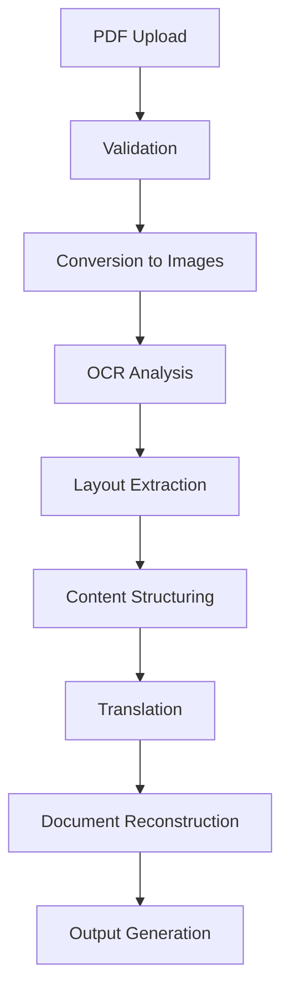
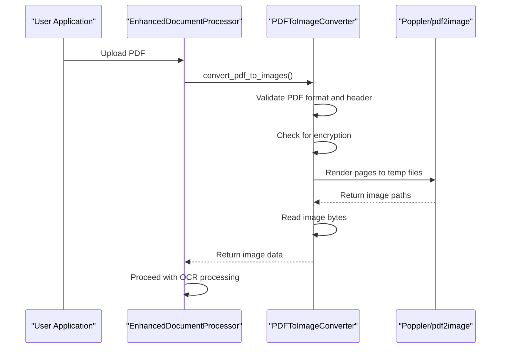
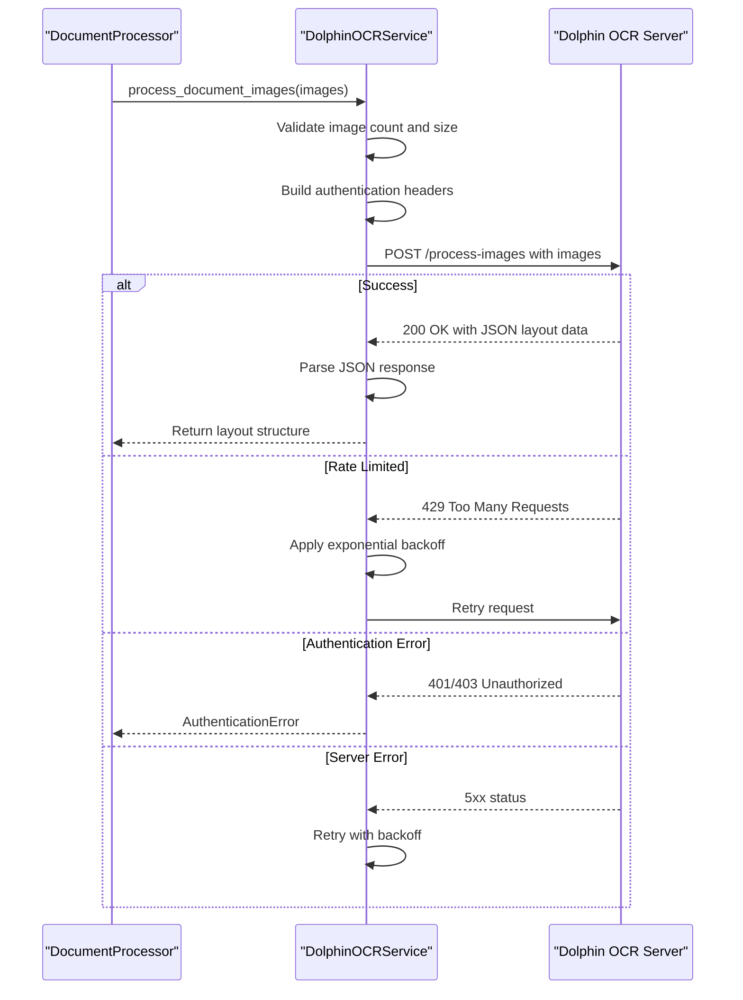
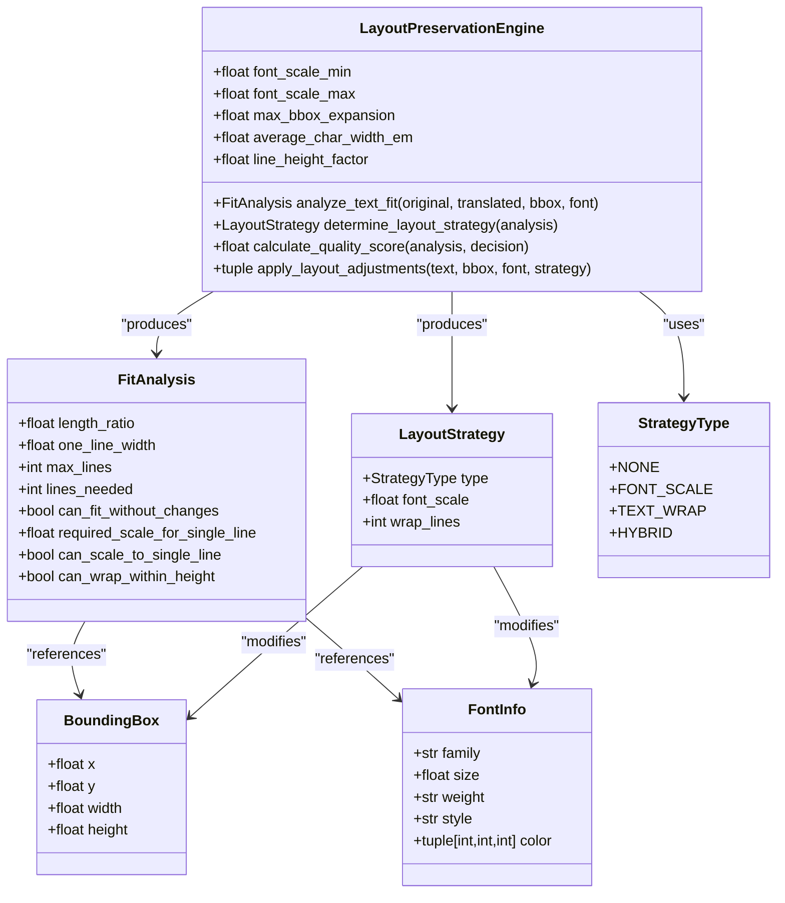
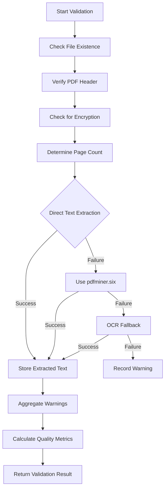
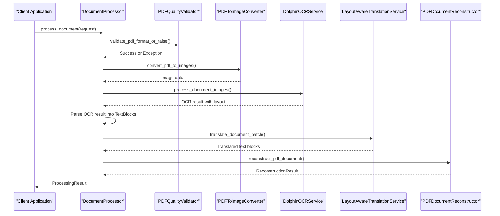
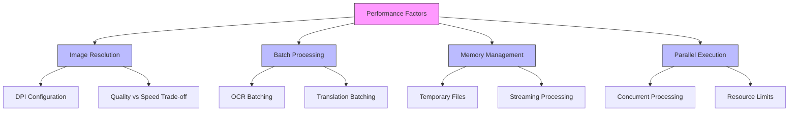
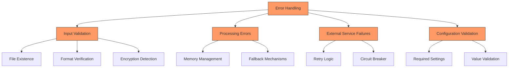

# Document Processing Pipeline

<cite>
**Referenced Files in This Document**  
- [pdf_to_image.py](file://dolphin_ocr/pdf_to_image.py)
- [dolphin_ocr_service.py](file://services/dolphin_ocr_service.py)
- [layout.py](file://dolphin_ocr/layout.py)
- [pdf_quality_validator.py](file://services/pdf_quality_validator.py)
- [enhanced_document_processor.py](file://services/enhanced_document_processor.py)
- [main_document_processor.py](file://services/main_document_processor.py)
- [pdf_document_reconstructor.py](file://services/pdf_document_reconstructor.py)
- [settings.py](file://config/settings.py)
</cite>

## Table of Contents
1. [Introduction](#introduction)
2. [Document Processing Workflow](#document-processing-workflow)
3. [PDF to Image Conversion](#pdf-to-image-conversion)
4. [OCR Processing Service](#ocr-processing-service)
5. [Layout Analysis and Preservation](#layout-analysis-and-preservation)
6. [PDF Quality Validation](#pdf-quality-validation)
7. [Pipeline Orchestration](#pipeline-orchestration)
8. [Performance Considerations](#performance-considerations)
9. [Error Handling and Resilience](#error-handling-and-resilience)
10. [Configuration and Settings](#configuration-and-settings)

## Introduction

The document processing pipeline is a comprehensive system designed to handle PDF documents from upload to final output, with a focus on preserving layout and formatting during translation. The pipeline consists of several interconnected components that work together to extract text, analyze layout, perform OCR, and reconstruct documents while maintaining the original visual structure. This document provides a detailed analysis of the end-to-end workflow, covering each stage from PDF upload through validation, conversion, OCR analysis, layout extraction, and content structuring.

The system is specifically designed for PDF-only processing, leveraging advanced OCR technology and layout preservation techniques to ensure high-quality document translation. The architecture is modular, with clearly defined components responsible for specific aspects of document processing, allowing for independent development, testing, and optimization of each stage in the pipeline.

## Document Processing Workflow

The document processing workflow follows a sequential pipeline that transforms uploaded PDF documents into translated outputs while preserving the original layout and formatting. The process begins with PDF upload and validation, followed by conversion to high-resolution images for OCR processing. The OCR engine extracts text and bounding box information, which is then analyzed for spatial relationships between text blocks. This layout context is maintained throughout the translation process and used during document reconstruction.

The workflow is orchestrated by the `EnhancedDocumentProcessor` class, which coordinates the various components of the system. When a document is uploaded, it first undergoes validation to ensure it meets quality standards and is not encrypted. Valid documents are then converted to images at a configurable resolution (default 300 DPI) to optimize OCR accuracy. These images are sent to the Dolphin OCR service, which returns structured data including text content, bounding boxes, and font information for each text element.

After OCR processing, the system analyzes the spatial relationships between text blocks to understand the document's layout, including columns, tables, and mixed content arrangements. This layout information is preserved during translation and used to reconstruct the final document with the translated text positioned appropriately. The entire process is designed to handle complex layouts while maintaining the visual integrity of the original document.



**Diagram sources**
- [enhanced_document_processor.py](file://services/enhanced_document_processor.py#L1-L398)
- [main_document_processor.py](file://services/main_document_processor.py#L1-L323)

**Section sources**
- [enhanced_document_processor.py](file://services/enhanced_document_processor.py#L1-L398)
- [main_document_processor.py](file://services/main_document_processor.py#L1-L323)

## PDF to Image Conversion

The PDF to image conversion process is handled by the `PDFToImageConverter` class in the `pdf_to_image.py` module. This component is responsible for transforming PDF pages into high-resolution images suitable for OCR processing. The converter uses the `pdf2image` library (which relies on Poppler) to render PDF pages as image data, with configurable resolution and output format.

The conversion process is designed to be memory-efficient by rendering pages to temporary files rather than keeping the entire document in memory. This approach allows the system to handle large PDF documents without excessive memory consumption. The converter first validates the input PDF by checking for the existence of the file, verifying the PDF header (%PDF-), and detecting encrypted documents. If any of these validation checks fail, appropriate exceptions are raised to prevent processing of invalid or protected documents.

Image resolution is configurable through the DPI parameter, with a default value of 300 DPI. This resolution strikes a balance between OCR accuracy and processing efficiency. Higher DPI values can improve OCR accuracy for documents with small text or complex layouts, but increase processing time and memory usage. The converter supports various image formats, with PNG as the default due to its lossless compression, which preserves image quality for OCR processing.



**Diagram sources**
- [pdf_to_image.py](file://dolphin_ocr/pdf_to_image.py#L1-L284)
- [enhanced_document_processor.py](file://services/enhanced_document_processor.py#L1-L398)

**Section sources**
- [pdf_to_image.py](file://dolphin_ocr/pdf_to_image.py#L1-L284)

## OCR Processing Service

The OCR processing service is implemented in the `DolphinOCRService` class within the `dolphin_ocr_service.py` file. This component acts as a client for the Dolphin OCR Modal service, handling communication with the OCR engine to extract text and bounding box information from document images. The service is designed to be resilient, with comprehensive error handling and retry mechanisms for network issues and rate limiting.

The OCR service sends batches of page images to the OCR engine via HTTP requests, using multipart form data to transmit the image bytes. Each request includes authentication via a bearer token (HF_TOKEN) and is subject to various limits to prevent excessive resource consumption. The service enforces maximum image size (5MB per image) and maximum batch size (32 images) to maintain performance and reliability. When the OCR engine returns results, the service parses the JSON response and returns structured data containing text content, bounding boxes, and font information for each detected text element.

Error handling in the OCR service is comprehensive, mapping various failure modes to standardized error types. Network timeouts, authentication failures, rate limiting, and server errors are all handled appropriately, with retry logic for transient issues. The service also includes performance monitoring, tracking request metrics such as success rate and response time. This information can be used for system optimization and troubleshooting.



**Diagram sources**
- [dolphin_ocr_service.py](file://services/dolphin_ocr_service.py#L1-L375)
- [main_document_processor.py](file://services/main_document_processor.py#L1-L323)

**Section sources**
- [dolphin_ocr_service.py](file://services/dolphin_ocr_service.py#L1-L375)

## Layout Analysis and Preservation

The layout analysis and preservation functionality is implemented in the `layout.py` module within the `dolphin_ocr` package. This component is responsible for understanding the spatial relationships between text blocks in a document and determining how to preserve the layout when text content changes during translation. The system uses bounding box coordinates and font information to analyze the document structure and make decisions about text formatting.

The `LayoutPreservationEngine` class provides the core functionality for layout analysis. It evaluates whether translated text will fit within the original bounding boxes and determines the appropriate strategy for handling length changes. The engine considers several approaches: maintaining the original layout without changes, scaling the font size, wrapping text to multiple lines, or using a hybrid approach that combines scaling with wrapping. Each strategy is evaluated based on heuristics that balance visual fidelity with content completeness.

The layout analysis process begins by estimating the width of translated text based on character count and average character width. It then compares this to the available space in the bounding box to determine if the text will fit on a single line. If not, the engine calculates the required number of lines and compares this to the available vertical space based on line height and bounding box height. The system also computes a quality score for each potential layout strategy, allowing for objective comparison of different approaches.



**Diagram sources**
- [layout.py](file://dolphin_ocr/layout.py#L1-L410)
- [pdf_document_reconstructor.py](file://services/pdf_document_reconstructor.py#L1-L487)

**Section sources**
- [layout.py](file://dolphin_ocr/layout.py#L1-L410)

## PDF Quality Validation

The PDF quality validation process is handled by the `PDFQualityValidator` class in the `pdf_quality_validator.py` file. This component performs comprehensive checks on uploaded PDF documents to ensure they meet quality standards for processing. The validation includes checks for document corruption, encryption, resolution, and readability, helping to prevent processing failures and ensure consistent output quality.

The validation process uses a hybrid approach to text extraction, combining multiple methods to maximize coverage and accuracy. It first attempts to extract text directly using `pypdf`, which is fast and preserves formatting for born-digital documents. For pages where direct extraction fails or returns no text, the system falls back to `pdfminer.six`, which can handle a wider range of PDF structures. As a final fallback, OCR is used to extract text from scanned documents or pages with complex layouts that cannot be processed by the direct methods.

The validator also implements time and resource limits to prevent excessive processing of problematic documents. It caps the number of pages processed and enforces timeouts at various stages to avoid hanging operations. The system aggregates warnings and errors encountered during validation, providing detailed feedback about any issues with the document. This information can be used to inform users about potential quality issues or to trigger alternative processing strategies.



**Diagram sources**
- [pdf_quality_validator.py](file://services/pdf_quality_validator.py#L1-L669)
- [main_document_processor.py](file://services/main_document_processor.py#L1-L323)

**Section sources**
- [pdf_quality_validator.py](file://services/pdf_quality_validator.py#L1-L669)

## Pipeline Orchestration

The document processing pipeline is orchestrated by the `DocumentProcessor` class in the `main_document_processor.py` file. This component coordinates all stages of document processing, from initial validation through conversion, OCR, translation, and final reconstruction. The orchestrator follows a sequential workflow with well-defined progress stages, allowing for monitoring and status reporting throughout the processing pipeline.

The orchestration process begins with document validation, ensuring the input file is a valid, non-encrypted PDF. Once validated, the document is converted to images using the `PDFToImageConverter`. These images are then processed by the `DolphinOCRService` to extract text and layout information. The extracted text is organized into `TextBlock` objects containing both content and spatial information, which are then passed to the translation service.

Translation is performed in batches to manage memory usage and API rate limits. The `LayoutAwareTranslationService` processes each batch, preserving the layout context during translation. After translation, the system reconstructs the final document using the `PDFDocumentReconstructor`, which renders the translated text into a new PDF while maintaining the original layout, fonts, and formatting. Throughout this process, the orchestrator emits progress events and collects performance metrics for monitoring and optimization.



**Diagram sources**
- [main_document_processor.py](file://services/main_document_processor.py#L1-L323)
- [enhanced_document_processor.py](file://services/enhanced_document_processor.py#L1-L398)

**Section sources**
- [main_document_processor.py](file://services/main_document_processor.py#L1-L323)

## Performance Considerations

The document processing pipeline incorporates several performance optimizations to balance processing quality with efficiency. Key considerations include image resolution trade-offs, batch processing strategies, memory management, and parallel execution where appropriate. These optimizations ensure the system can handle large documents and high processing volumes while maintaining acceptable response times.

Image resolution is a critical performance factor, with the default 300 DPI setting providing a balance between OCR accuracy and processing efficiency. Higher resolutions improve OCR accuracy for small text or complex layouts but increase processing time, memory usage, and network bandwidth requirements. The system allows configuration of DPI through environment variables, enabling adjustment based on specific use cases and hardware capabilities.

Batch processing is used extensively to optimize performance. The OCR service processes multiple pages in a single request to reduce network overhead, while translation is performed in configurable batches to manage memory usage and API rate limits. The system also implements memory-efficient processing by using temporary files for image conversion and streaming data where possible, rather than loading entire documents into memory. Configuration options such as `MAX_FILE_SIZE_MB` and `MEMORY_THRESHOLD` allow administrators to tune the system for their specific hardware and performance requirements.



**Diagram sources**
- [settings.py](file://config/settings.py#L1-L549)
- [pdf_to_image.py](file://dolphin_ocr/pdf_to_image.py#L1-L284)
- [dolphin_ocr_service.py](file://services/dolphin_ocr_service.py#L1-L375)

**Section sources**
- [settings.py](file://config/settings.py#L1-L549)

## Error Handling and Resilience

The document processing pipeline incorporates comprehensive error handling and resilience mechanisms to ensure reliable operation under various failure conditions. Each component includes specific error handling for its domain, with standardized error types that allow for consistent error reporting and recovery strategies across the system.

The pipeline handles several categories of errors, including input validation failures, processing errors, and external service failures. Input validation checks for file existence, format correctness, encryption, and quality issues, rejecting documents that do not meet requirements. Processing errors, such as memory exhaustion during image conversion or OCR failures, are caught and handled gracefully, often with fallback mechanisms or partial processing to maximize success rates.

External service failures, particularly in the OCR and translation services, are handled with retry mechanisms and circuit breaker patterns. The OCR service implements exponential backoff with jitter for rate limiting scenarios, while also handling authentication failures and network timeouts. The system logs detailed error information for troubleshooting while providing user-friendly error messages. Configuration validation ensures that required settings are present and valid before processing begins, preventing runtime failures due to misconfiguration.



**Diagram sources**
- [pdf_to_image.py](file://dolphin_ocr/pdf_to_image.py#L1-L284)
- [dolphin_ocr_service.py](file://services/dolphin_ocr_service.py#L1-L375)
- [pdf_quality_validator.py](file://services/pdf_quality_validator.py#L1-L669)
- [settings.py](file://config/settings.py#L1-L549)

**Section sources**
- [pdf_to_image.py](file://dolphin_ocr/pdf_to_image.py#L1-L284)
- [dolphin_ocr_service.py](file://services/dolphin_ocr_service.py#L1-L375)

## Configuration and Settings

The system configuration is managed through the `Settings` class in the `settings.py` file, which provides a centralized location for all configurable parameters. The configuration system supports environment variable overrides, allowing for flexible deployment across different environments (development, staging, production) without code changes. This approach enables secure management of sensitive information like API keys and allows for runtime configuration adjustments.

Key configuration parameters include server settings (host, port, debug mode), file handling options (upload and download directories, maximum file size), PDF processing settings (DPI, image preservation), and translation service configuration (API keys, concurrency limits). The system validates configuration values at startup, ensuring they fall within acceptable ranges and that required settings are present. For example, the PDF DPI is constrained to a range of 72-600 to prevent impractical values, and the SECRET_KEY is validated for sufficient length in production environments.

The configuration system also handles directory creation, automatically creating required directories (uploads, downloads, temp) at startup if they do not exist. This ensures the system can operate immediately after deployment without manual setup steps. Security-related settings, such as the SECRET_KEY, receive special validation to ensure they meet minimum strength requirements in production environments, helping to prevent common security vulnerabilities.

```mermaid
classDiagram
class Settings {
+str LINGO_API_KEY
+str HOST
+int PORT
+bool DEBUG
+str SECRET_KEY
+int MAX_FILE_SIZE_MB
+str UPLOAD_DIR
+str DOWNLOAD_DIR
+str TEMP_DIR
+int PDF_DPI
+bool PRESERVE_IMAGES
+int MEMORY_THRESHOLD
+str SOURCE_LANGUAGE
+str TARGET_LANGUAGE
+float TRANSLATION_DELAY
+int TRANSLATION_CONCURRENCY_LIMIT
+str LOG_LEVEL
+str LOG_FILE
+int CLEANUP_INTERVAL_HOURS
+int MAX_FILE_AGE_HOURS
+__init__()
+get_available_translators() list[str]
+validate_configuration() bool
}
Settings --> "1" "0..*" Environment Variables : "reads"
Settings --> "1" "1" Directory Creation : "performs"
Settings --> "1" "1" Configuration Validation : "performs"
```

**Diagram sources**
- [settings.py](file://config/settings.py#L1-L549)
- [main_document_processor.py](file://services/main_document_processor.py#L1-L323)

**Section sources**
- [settings.py](file://config/settings.py#L1-L549)
