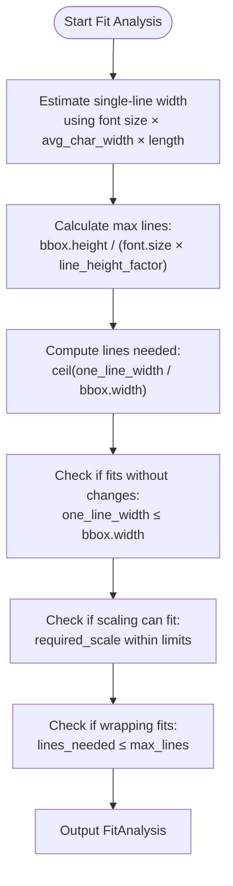
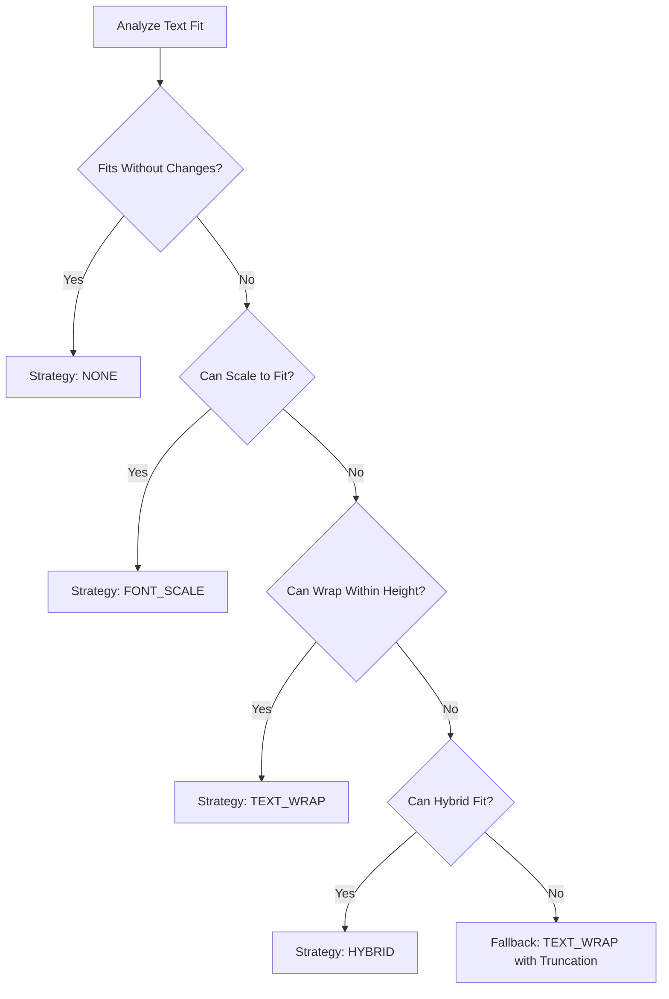
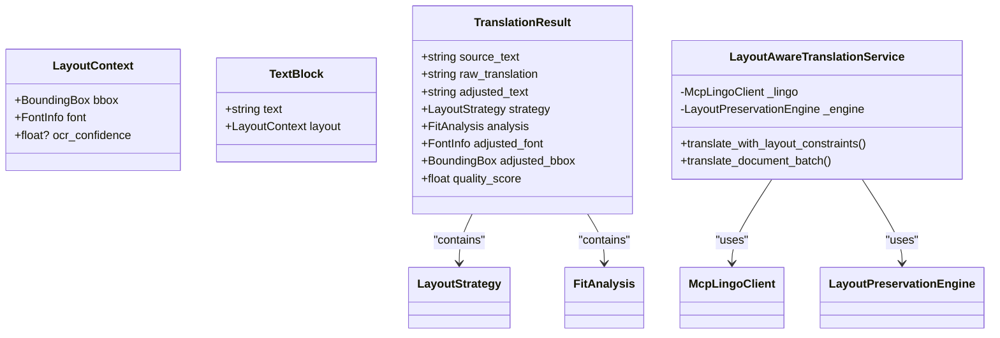
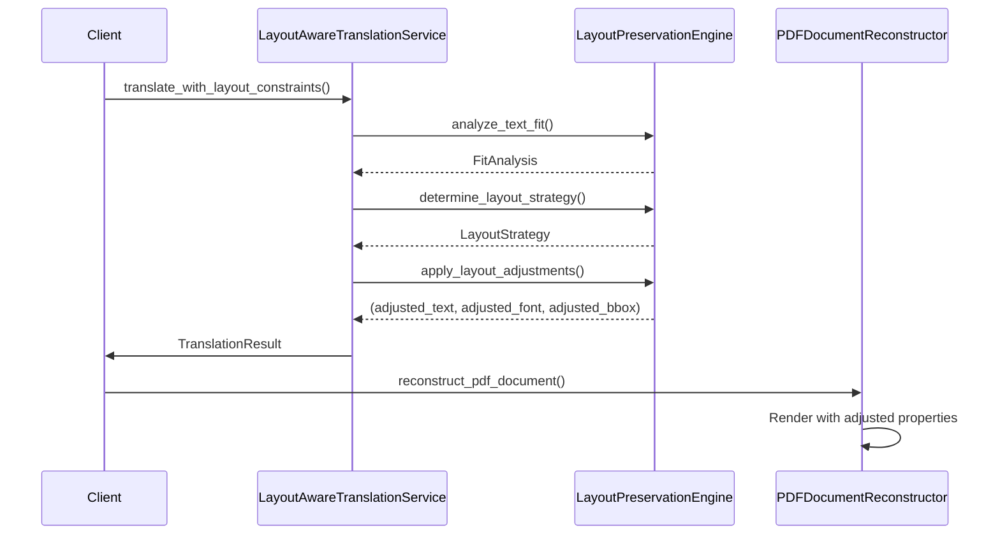

# Layout Extraction

<cite>
**Referenced Files in This Document**  
- [layout.py](file://dolphin_ocr/layout.py)
- [layout_aware_translation_service.py](file://services/layout_aware_translation_service.py)
- [pdf_document_reconstructor.py](file://services/pdf_document_reconstructor.py)
- [test_layout_preservation_engine.py](file://tests/test_layout_preservation_engine.py)
- [test_layout_adjustments.py](file://tests/test_layout_adjustments.py)
- [main_document_processor.py](file://services/main_document_processor.py)
</cite>

## Table of Contents
1. [Introduction](#introduction)
2. [Layout Analysis and Fit Assessment](#layout-analysis-and-fit-assessment)
3. [Layout Strategy Determination](#layout-strategy-determination)
4. [Layout Context and Translation Integration](#layout-context-and-translation-integration)
5. [Text Wrapping and Font Scaling](#text-wrapping-and-font-scaling)
6. [PDF Reconstruction with Layout Preservation](#pdf-reconstruction-with-layout-preservation)
7. [Performance and Quality Scoring](#performance-and-quality-scoring)
8. [Edge Cases and Error Handling](#edge-cases-and-error-handling)
9. [Testing and Validation](#testing-and-validation)
10. [Conclusion](#conclusion)

## Introduction
The layout extraction system is designed to preserve the visual structure of documents during translation by analyzing spatial relationships, font metrics, and bounding box constraints. This document details how the system processes OCR results to reconstruct document layouts accurately, ensuring that translated content maintains the original formatting, reading order, and hierarchical structure. The core functionality resides in the `LayoutPreservationEngine`, which evaluates text fit, determines optimal layout strategies, and applies adjustments such as font scaling and text wrapping.

**Section sources**
- [layout.py](file://dolphin_ocr/layout.py#L1-L40)

## Layout Analysis and Fit Assessment
The `LayoutPreservationEngine` analyzes whether translated text fits within its original bounding box using geometric and typographic heuristics. It estimates the width of text on a single line based on font size and an average character width factor. The engine computes the maximum number of lines that can fit vertically within the bounding box height using a configurable line height multiplier.

Key parameters include:
- `average_char_width_em`: Average character width as a fraction of font size (default: 0.5)
- `line_height_factor`: Multiplier for line height relative to font size (default: 1.2)

The `analyze_text_fit` method returns a `FitAnalysis` object containing metrics such as:
- `one_line_width`: Estimated width of the translated text at current font size
- `max_lines`: Maximum number of lines that fit within the bounding box height
- `lines_needed`: Number of lines required when wrapping at box width
- `can_fit_without_changes`: Whether the text fits without modifications
- `required_scale_for_single_line`: Minimum scale factor to fit on one line



**Diagram sources**
- [layout.py](file://dolphin_ocr/layout.py#L150-L200)

**Section sources**
- [layout.py](file://dolphin_ocr/layout.py#L150-L200)

## Layout Strategy Determination
Based on the fit analysis, the engine selects one of four layout strategies to preserve document appearance:

| Strategy | Condition | Description |
|--------|-----------|-------------|
| NONE | `can_fit_without_changes` | No changes needed; original layout preserved |
| FONT_SCALE | `can_scale_to_single_line` | Scale font size to fit on one line within allowed limits |
| TEXT_WRAP | `can_wrap_within_height` | Wrap text across multiple lines without scaling |
| HYBRID | Neither scaling nor wrapping alone sufficient | Combine modest font scaling with wrapping |

The decision logic follows a priority order: prefer no changes, then scaling, then wrapping, and finally hybrid when necessary. For hybrid strategy, the engine simulates the effect of scaling on line count to ensure the result fits within available vertical space.



**Diagram sources**
- [layout.py](file://dolphin_ocr/layout.py#L200-L250)

**Section sources**
- [layout.py](file://dolphin_ocr/layout.py#L200-L250)

## Layout Context and Translation Integration
The `LayoutAwareTranslationService` integrates layout preservation with translation workflows. It uses `LayoutContext` objects to maintain bounding box and font information for each text element during translation.

Key components:
- `LayoutContext`: Encapsulates `BoundingBox` and `FontInfo` for a text element
- `TextBlock`: Represents a translatable unit with associated layout context
- `TranslationResult`: Contains source, raw translation, adjusted text, strategy, and quality score

The service applies whitespace optimization to reduce unnecessary text growth before layout analysis. It supports both single-item and batch translation APIs, preserving per-element layout context throughout the process.



**Diagram sources**
- [layout_aware_translation_service.py](file://services/layout_aware_translation_service.py#L50-L100)

**Section sources**
- [layout_aware_translation_service.py](file://services/layout_aware_translation_service.py#L50-L100)

## Text Wrapping and Font Scaling
The system implements text wrapping that respects word boundaries while handling edge cases like extremely long words. The `_wrap_text_to_width` method uses a greedy algorithm to build lines, inserting line breaks at spaces when adding the next word would exceed the available width.

Font scaling is constrained by configurable limits (default: 0.6–1.2× original size). When applying adjustments:
- Font size is scaled multiplicatively
- Text wrapping is applied only for TEXT_WRAP and HYBRID strategies
- Bounding box height may be expanded up to `max_bbox_expansion` (default: 30%) if needed
- Final text is truncated to fit available lines if necessary

The `apply_layout_adjustments` method returns the modified text, font, and bounding box as a tuple, ensuring all layout changes are coordinated.



**Diagram sources**
- [layout.py](file://dolphin_ocr/layout.py#L300-L350)
- [layout_aware_translation_service.py](file://services/layout_aware_translation_service.py#L100-L150)

**Section sources**
- [layout.py](file://dolphin_ocr/layout.py#L300-L350)
- [layout_aware_translation_service.py](file://services/layout_aware_translation_service.py#L100-L150)

## PDF Reconstruction with Layout Preservation
The `PDFDocumentReconstructor` renders translated content into PDF format using ReportLab, honoring the adjusted layout properties. It processes each `TranslatedElement` by:
- Setting font based on `font_info` (family, weight, style)
- Applying color from RGB values
- Drawing text line-by-line at calculated positions
- Handling font fallback when requested fonts are unavailable

Page size is determined from element bounding boxes when original dimensions are unknown. The reconstructor tracks quality metrics such as overflow rate and font fallback rate to assess reconstruction fidelity.

Key data structures:
- `TranslatedElement`: Original and translated text with layout properties
- `TranslatedPage`: Collection of elements on a single page with dimensions
- `TranslatedLayout`: Complete document layout across all pages

**Section sources**
- [pdf_document_reconstructor.py](file://services/pdf_document_reconstructor.py#L50-L100)

## Performance and Quality Scoring
The system includes a quality scoring mechanism to evaluate layout preservation effectiveness. The score ranges from 0 to 1, calculated as:

```
score = 1.0
- (SCALE_PENALTY_WEIGHT × |1 - scale|)
- (WRAP_PENALTY_WEIGHT × normalized_lines_excess)
+ (NONE_BONUS if no changes made)
```

Default weights:
- `SCALE_PENALTY_WEIGHT`: 0.35
- `WRAP_PENALTY_WEIGHT`: 0.25
- `NONE_BONUS`: 0.05

For large documents, the system uses batching (default: 100 elements per batch) to manage memory usage and API limits. Spatial indexing is not currently implemented, but the modular design allows for future optimization.

**Section sources**
- [layout.py](file://dolphin_ocr/layout.py#L250-L300)

## Edge Cases and Error Handling
The system handles several edge cases:
- **Empty or very short text**: Uses minimum length of 1 to avoid division by zero
- **Font unavailability**: Falls back to Helvetica variants based on weight/style
- **Text overflow**: Truncates content when it exceeds bounding box height
- **Missing page dimensions**: Infers size from element bounding boxes
- **Encrypted PDFs**: Rejects with standardized error code DOLPHIN_014

Warnings are issued for non-fatal issues like font fallbacks and encryption check failures, allowing processing to continue while informing users of potential quality impacts.

**Section sources**
- [pdf_document_reconstructor.py](file://services/pdf_document_reconstructor.py#L100-L150)

## Testing and Validation
Comprehensive tests validate layout preservation behavior across scenarios:
- `test_layout_preservation_engine.py`: Verifies strategy selection for different text length ratios
- `test_layout_adjustments.py`: Confirms correct application of font scaling and text wrapping
- Integration tests: Validate end-to-end document processing pipeline

Test cases cover:
- NONE strategy when text fits unchanged
- FONT_SCALE for moderate length increases
- TEXT_WRAP when vertical space allows
- HYBRID for challenging cases requiring both scaling and wrapping
- Bounding box expansion within limits
- Word boundary preservation during wrapping

The deterministic heuristics (fixed average character width, line height factor) ensure consistent, testable behavior without external font metrics dependencies.

**Section sources**
- [test_layout_preservation_engine.py](file://tests/test_layout_preservation_engine.py#L1-L117)
- [test_layout_adjustments.py](file://tests/test_layout_adjustments.py#L1-L97)

## Conclusion
The layout extraction system effectively preserves document structure during translation by combining geometric analysis, typographic heuristics, and adaptive layout strategies. By analyzing bounding box constraints and font metrics, it determines optimal approaches to accommodate text length variations while maintaining visual fidelity. The integration of layout context throughout the translation pipeline ensures that spatial relationships, reading order, and hierarchical structure are preserved in the final output. Future enhancements could include spatial indexing for performance optimization and more sophisticated text wrapping algorithms.
