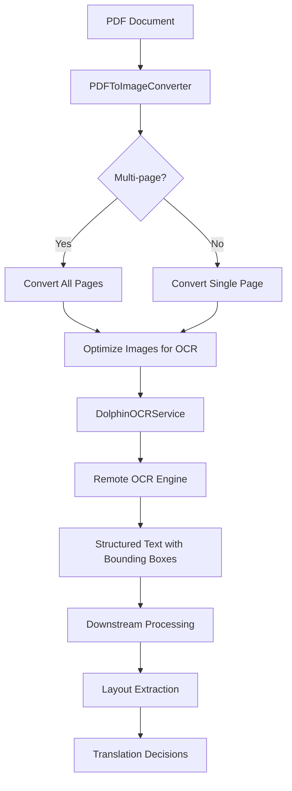

# OCR Analysis

<cite>
**Referenced Files in This Document**  
- [pdf_to_image.py](file://dolphin_ocr/pdf_to_image.py)
- [dolphin_ocr_service.py](file://services/dolphin_ocr_service.py)
- [config.py](file://dolphin_ocr/config.py)
- [errors.py](file://dolphin_ocr/errors.py)
</cite>

## Table of Contents
1. [Introduction](#introduction)
2. [PDF to Image Conversion](#pdf-to-image-conversion)
3. [Dolphin OCR Service](#dolphin-ocr-service)
4. [Configuration Management](#configuration-management)
5. [Error Handling](#error-handling)
6. [Data Flow and Integration](#data-flow-and-integration)
7. [Performance Considerations](#performance-considerations)
8. [Conclusion](#conclusion)

## Introduction
This document provides a detailed analysis of the OCR subsystem within the PhenomenalLayout project. The system is designed to convert PDF documents into high-quality images optimized for OCR processing, then orchestrate requests to the Dolphin OCR engine for text extraction with bounding boxes. The architecture emphasizes memory efficiency, error resilience, and configurable performance parameters to balance quality and processing speed.

The OCR pipeline consists of two primary components: the PDF-to-image converter that prepares raster inputs, and the Dolphin OCR service client that manages communication with the remote OCR engine. These components work in concert with configuration management and standardized error handling to provide a robust document processing workflow.

## PDF to Image Conversion

The `PDFToImageConverter` class in `pdf_to_image.py` handles the conversion of PDF documents into high-resolution raster images suitable for OCR processing. The converter is designed with memory efficiency as a primary concern, using temporary files to avoid loading entire documents into memory.

Key parameters include:
- **dpi**: Output resolution in dots per inch, defaulting to 300 for optimal OCR quality
- **image_format**: Output format (PNG or JPEG), defaulting to PNG for lossless compression
- **poppler_path**: Optional path to Poppler binaries if not available on system PATH

The conversion process follows a memory-efficient pattern by rendering pages to temporary files and streaming the bytes back, rather than keeping all pages in memory simultaneously. This approach allows processing of large multi-page documents without excessive memory consumption.

Image preprocessing includes grayscale conversion, pixel normalization (mapping near-white pixels to pure white), and mild sharpening to enhance text clarity for OCR. The converter also performs early validation of PDF files, checking for existence, proper extension, valid PDF headers, and encryption status before attempting conversion.

**Section sources**
- [pdf_to_image.py](file://dolphin_ocr/pdf_to_image.py#L1-L284)

## Dolphin OCR Service

The `DolphinOCRService` class in `dolphin_ocr_service.py` orchestrates requests to the Dolphin OCR engine running on Modal. The service implements robust error handling, retry logic, and performance monitoring to ensure reliable OCR processing.

Key features include:
- **Authentication**: Uses Hugging Face tokens via the `HF_TOKEN` environment variable or direct configuration
- **Endpoint Configuration**: Supports configurable OCR service endpoints through `DOLPHIN_MODAL_ENDPOINT`
- **Retry Logic**: Implements exponential backoff with jitter for rate limit handling (429 responses)
- **Timeout Management**: Configurable request timeouts with graceful failure handling
- **Performance Metrics**: Tracks request counts, success rates, and processing durations

The service validates images before transmission, enforcing limits on:
- Maximum image size (5 MiB by default)
- Maximum number of images per request (32 by default)
- Proper authentication credentials

When processing multi-page documents, the service batches all page images into a single multipart request to minimize network overhead. The response contains structured text output with bounding box coordinates for each recognized text element.

**Section sources**
- [dolphin_ocr_service.py](file://services/dolphin_ocr_service.py#L1-L375)

## Configuration Management

Configuration is managed through the `ConfigurationManager` class in `config.py`, which provides a centralized interface for system settings. The configuration system supports environment variable overrides for all parameters, enabling flexible deployment across different environments.

Key configuration sections include:

### Dolphin Configuration
- **hf_token**: Hugging Face authentication token
- **modal_endpoint**: URL of the Dolphin OCR service
- **timeout_seconds**: Request timeout (default: 300 seconds)
- **max_retries**: Maximum retry attempts (default: 3)
- **batch_size**: Number of documents to process in parallel

### Performance Configuration
- **max_concurrent_requests**: Maximum concurrent OCR requests
- **processing_timeout**: Overall document processing timeout
- **dpi**: PDF rendering resolution (150-600 range, default: 300)
- **memory_limit_mb**: Memory allocation limit for processing

### Quality Thresholds
- **min_ocr_confidence**: Minimum confidence score for OCR results
- **min_translation_confidence**: Minimum confidence for translations
- **min_layout_preservation_score**: Minimum layout fidelity score
- **min_overall_quality_score**: Overall quality threshold

All configuration values are validated upon initialization to ensure they fall within acceptable ranges, preventing misconfiguration issues.

**Section sources**
- [config.py](file://dolphin_ocr/config.py#L1-L267)

## Error Handling

The OCR system implements a comprehensive error handling framework through the `errors.py` module. Standardized error codes provide consistent error reporting across the application, with each error type mapped to a specific code (e.g., DOLPHIN_001 for rate limits, DOLPHIN_014 for encrypted PDFs).

Key error types include:
- **ApiRateLimitError (DOLPHIN_001)**: Triggered when Hugging Face API quotas are exceeded
- **ServiceUnavailableError (DOLPHIN_002)**: Indicates temporary service outages
- **AuthenticationError (DOLPHIN_003)**: Authentication failures with invalid tokens
- **ProcessingTimeoutError (DOLPHIN_004)**: Document processing exceeds time limits
- **InvalidDocumentFormatError (DOLPHIN_005)**: Unsupported or corrupted file formats
- **EncryptedPdfError (DOLPHIN_014)**: Detection of password-protected PDFs

The `ErrorHandlingStrategy` class provides methods to translate exceptions into standardized `ErrorResponse` objects with metadata about recoverability, retry timing, and contextual information. Sensitive data in error contexts (such as tokens) is automatically redacted to prevent information leakage.

**Section sources**
- [errors.py](file://dolphin_ocr/errors.py#L1-L341)

## Data Flow and Integration

The OCR data flow follows a structured pipeline from input to structured output:

**Diagram sources**
- [pdf_to_image.py](file://dolphin_ocr/pdf_to_image.py#L1-L284)
- [dolphin_ocr_service.py](file://services/dolphin_ocr_service.py#L1-L375)

The system integrates with downstream components in several ways:
- **Layout Extraction**: Bounding box coordinates enable precise spatial analysis of document structure
- **Translation Decisions**: OCR confidence scores inform translation quality assessments
- **Quality Filtering**: Results below minimum confidence thresholds can be flagged for human review
- **Error Propagation**: Standardized error codes allow consistent handling across the application

When image quality is poor or fonts are unsupported, the system may return partial results with low confidence scores, allowing downstream components to make informed decisions about result reliability.

**Section sources**
- [pdf_to_image.py](file://dolphin_ocr/pdf_to_image.py#L1-L284)
- [dolphin_ocr_service.py](file://services/dolphin_ocr_service.py#L1-L375)

## Performance Considerations

The OCR system balances several performance trade-offs:

### Resolution vs. Processing Speed
Higher DPI settings (400-600) improve OCR accuracy for small text or complex fonts but increase:
- Processing time (approximately linear with resolution)
- Memory consumption (proportional to pixel count)
- Network bandwidth (larger image payloads)

The default 300 DPI setting provides optimal balance for most documents, with 150 DPI suitable for draft-quality processing and 600 DPI reserved for archival-quality documents.

### Memory Management
The PDF-to-image converter uses temporary files to minimize memory footprint, making it suitable for large documents. However, very high-resolution images may still exceed memory limits, triggering `MemoryExhaustionError`.

### Request Optimization
Batching multiple pages in a single request reduces network overhead but increases the impact of request failures. The system defaults to processing all pages together, with retry logic to handle transient failures.

### Timeout Configuration
Longer timeouts (300+ seconds) accommodate complex documents but may delay error detection. Shorter timeouts (30-60 seconds) provide faster feedback but risk false failures on legitimate complex documents.

**Section sources**
- [pdf_to_image.py](file://dolphin_ocr/pdf_to_image.py#L1-L284)
- [dolphin_ocr_service.py](file://services/dolphin_ocr_service.py#L1-L375)
- [config.py](file://dolphin_ocr/config.py#L1-L267)

## Conclusion
The OCR analysis subsystem in PhenomenalLayout provides a robust, configurable pipeline for converting PDF documents into structured text with spatial information. By separating concerns between image preparation and OCR service orchestration, the system achieves both flexibility and reliability.

Key strengths include:
- Memory-efficient PDF processing suitable for large documents
- Comprehensive error handling with standardized codes
- Configurable performance parameters for different use cases
- Integration with downstream layout and translation systems
- Automatic quality assessment through confidence scoring

The system is well-positioned to handle diverse document types while providing clear feedback on processing quality and potential issues, making it suitable for both automated workflows and human-in-the-loop scenarios.
