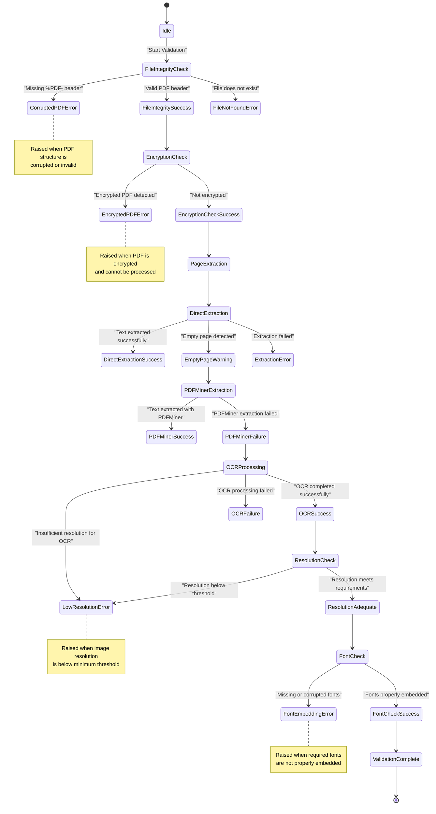

# PDF Validation

<cite>
**Referenced Files in This Document**  
- [pdf_quality_validator.py](file://services/pdf_quality_validator.py)
- [pdf_document_reconstructor.py](file://services/pdf_document_reconstructor.py)
- [pdf_to_image.py](file://dolphin_ocr/pdf_to_image.py)
- [main_document_processor.py](file://services/main_document_processor.py)
</cite>

## Table of Contents
1. [Introduction](#introduction)
2. [Core Components](#core-components)
3. [Validation Workflow](#validation-workflow)
4. [Configuration Options](#configuration-options)
5. [Error Handling](#error-handling)
6. [Integration with Document Processor](#integration-with-document-processor)
7. [Performance Considerations](#performance-considerations)

## Introduction
The PDF validation system ensures document integrity and quality throughout the processing pipeline. This documentation details the implementation of the `PDFQualityValidator` class, which performs comprehensive checks on PDF files to ensure they meet quality standards for subsequent OCR and translation processing. The validation process includes file integrity verification, resolution assessment, page corruption detection, and readability evaluation.

## Core Components

The PDF validation functionality is implemented through several key components that work together to ensure document quality. The primary validator class coordinates multiple extraction methods and fallback strategies to handle various PDF quality issues.


**Diagram sources**
- [pdf_quality_validator.py](file://services/pdf_quality_validator.py#L1-L668)

**Section sources**
- [pdf_quality_validator.py](file://services/pdf_quality_validator.py#L1-L668)

## Validation Workflow

The PDF validation workflow follows a systematic approach to ensure document quality through multiple stages of inspection and analysis. The process begins with header inspection and progresses through page stream analysis, image density verification, and font embedding checks.


**Diagram sources**
- [pdf_quality_validator.py](file://services/pdf_quality_validator.py#L1-L668)
- [pdf_to_image.py](file://dolphin_ocr/pdf_to_image.py#L1-L283)

**Section sources**
- [pdf_quality_validator.py](file://services/pdf_quality_validator.py#L1-L668)
- [pdf_to_image.py](file://dolphin_ocr/pdf_to_image.py#L1-L283)

## Configuration Options

The PDF validation system provides several configurable parameters that can be set through environment variables or method arguments. These options allow fine-tuning of the validation process to meet specific requirements.

```mermaid
erDiagram
CONFIGURATION_OPTIONS {
string name PK
string environment_variable
string default_value
string description
string type
string constraints
}
CONFIGURATION_OPTIONS ||--o{ VALIDATION_RULES : defines
CONFIGURATION_OPTIONS ||--o{ PERFORMANCE_METRICS : affects
VALIDATION_RULES {
string rule_name PK
string description
string severity
}
PERFORMANCE_METRICS {
string metric_name PK
string description
string unit
}
CONFIGURATION_OPTIONS {
"DEFAULT_MAX_PAGES" "PDF_QUALITY_MAX_PAGES" "200" "Maximum number of pages to process" "int" "≥1"
"DEFAULT_OVERALL_TIMEOUT_S" "PDF_QUALITY_OVERALL_TIMEOUT_SECONDS" "60" "Overall timeout for validation process" "float" "≥0"
"DEFAULT_OCR_TIMEOUT_S" "PDF_QUALITY_OCR_TIMEOUT_SECONDS" "5" "Timeout for individual OCR operations" "float" "≥0"
"DEFAULT_PDFMINER_CHUNK" "PDF_QUALITY_PDFMINER_CHUNK_SIZE" "16" "Chunk size for PDFMiner processing" "int" "≥1"
"DEFAULT_OCR_BATCH_PAGES" "PDF_QUALITY_OCR_BATCH_PAGES" "8" "Number of pages to process in OCR batches" "int" "≥1"
"DEFAULT_PDF_DPI" "PDF_DPI" "300" "Default DPI for image conversion" "int" "≥72"
"DEFAULT_TESS_LANG" "TESSERACT_LANG" "eng" "Default language for OCR processing" "str" "valid Tesseract language code"
"DEFAULT_POPPLER_PATH" "POPPLER_PATH" "None" "Path to Poppler utilities" "str" "valid filesystem path"
}
VALIDATION_RULES {
"File Integrity Check" "Verifies PDF header and basic structure" "critical"
"Encryption Detection" "Identifies encrypted PDFs that cannot be processed" "critical"
"Resolution Adequacy" "Ensures sufficient DPI for OCR quality" "high"
"Page Corruption" "Detects corrupted or unreadable pages" "high"
"Text Readability" "Assesses text extraction quality and completeness" "medium"
}
PERFORMANCE_METRICS {
"Processing Time" "Total time for validation process" "seconds"
"Memory Usage" "Peak memory consumption during validation" "bytes"
"OCR Page Count" "Number of pages requiring OCR processing" "count"
}
```

**Diagram sources**
- [pdf_quality_validator.py](file://services/pdf_quality_validator.py#L1-L668)

**Section sources**
- [pdf_quality_validator.py](file://services/pdf_quality_validator.py#L1-L668)

## Error Handling

The PDF validation system implements comprehensive error handling to manage various failure scenarios gracefully. Different error types are raised based on specific validation failures, allowing for targeted recovery strategies.



**Diagram sources**
- [pdf_quality_validator.py](file://services/pdf_quality_validator.py#L1-L668)
- [pdf_to_image.py](file://dolphin_ocr/pdf_to_image.py#L1-L283)

**Section sources**
- [pdf_quality_validator.py](file://services/pdf_quality_validator.py#L1-L668)
- [pdf_to_image.py](file://dolphin_ocr/pdf_to_image.py#L1-L283)

## Integration with Document Processor

The PDF validation system is tightly integrated with the main document processing pipeline, ensuring that only valid documents proceed to subsequent processing stages. The validation occurs early in the workflow to prevent unnecessary processing of invalid documents.


**Diagram sources**
- [main_document_processor.py](file://services/main_document_processor.py#L1-L323)
- [pdf_document_reconstructor.py](file://services/pdf_document_reconstructor.py#L1-L487)
- [pdf_quality_validator.py](file://services/pdf_quality_validator.py#L1-L668)

**Section sources**
- [main_document_processor.py](file://services/main_document_processor.py#L1-L323)
- [pdf_document_reconstructor.py](file://services/pdf_document_reconstructor.py#L1-L487)
- [pdf_quality_validator.py](file://services/pdf_quality_validator.py#L1-L668)

## Performance Considerations

The PDF validation system incorporates several performance optimizations to handle large documents efficiently while minimizing resource consumption. Early failure detection strategies prevent unnecessary processing when validation requirements are not met.


**Diagram sources**
- [pdf_quality_validator.py](file://services/pdf_quality_validator.py#L1-L668)
- [pdf_to_image.py](file://dolphin_ocr/pdf_to_image.py#L1-L283)

**Section sources**
- [pdf_quality_validator.py](file://services/pdf_quality_validator.py#L1-L668)
- [pdf_to_image.py](file://dolphin_ocr/pdf_to_image.py#L1-L283)
