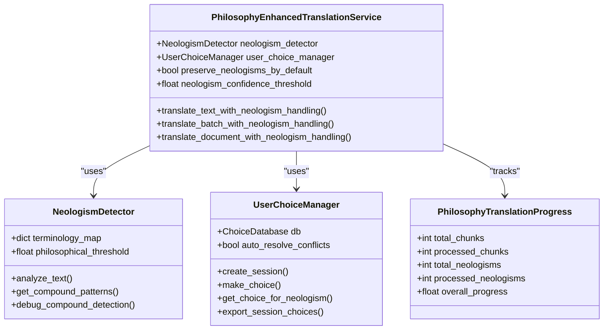
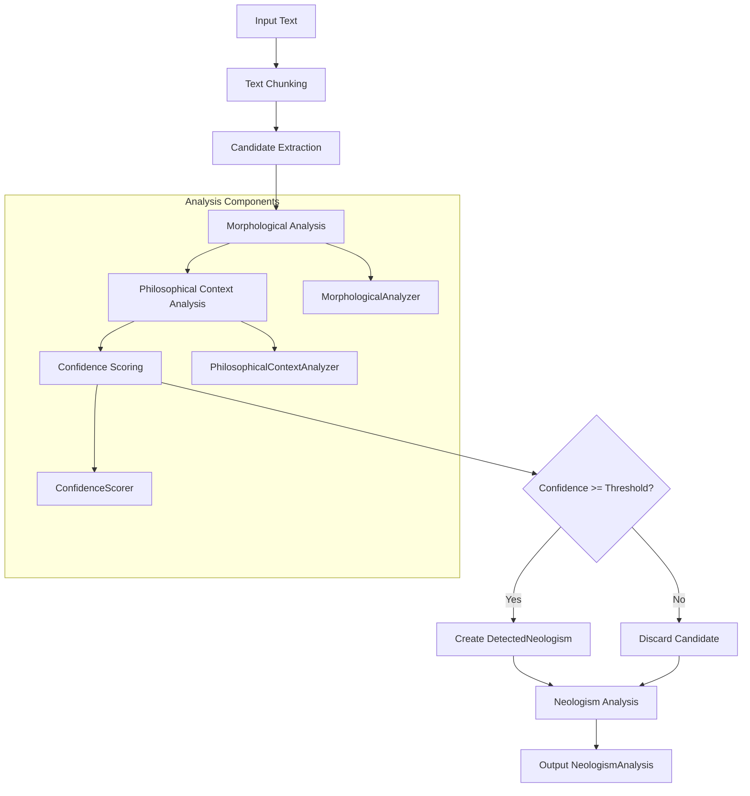
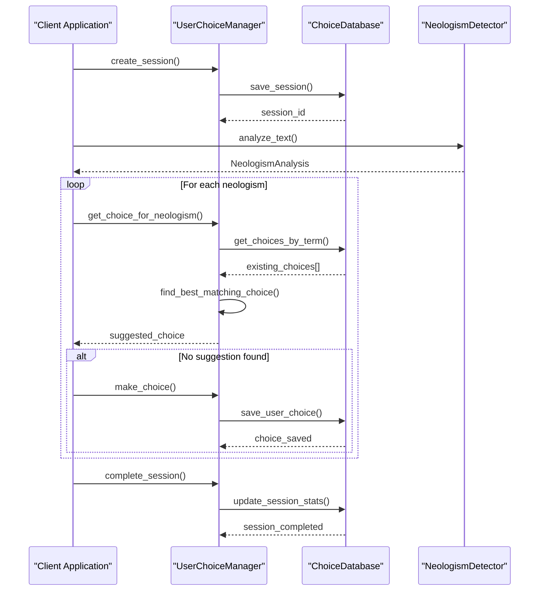
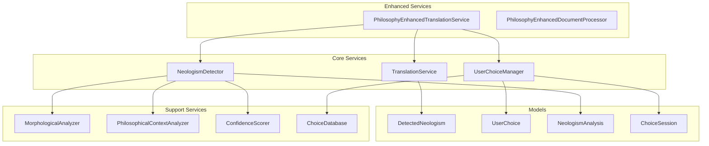

# Advanced Features Examples

<cite>
**Referenced Files in This Document**
- [philosophy_interface_usage_example.py](file://examples/philosophy_interface_usage_example.py)
- [neologism_integration_example.py](file://examples/neologism_integration_example.py)
- [user_choice_integration_example.py](file://examples/user_choice_integration_example.py)
- [settings.py](file://config/settings.py)
- [philosophy_enhanced_translation_service.py](file://services/philosophy_enhanced_translation_service.py)
- [neologism_detector.py](file://services/neologism_detector.py)
- [user_choice_manager.py](file://services/user_choice_manager.py)
- [neologism_models.py](file://models/neologism_models.py)
- [user_choice_models.py](file://models/user_choice_models.py)
</cite>

## Table of Contents
1. [Introduction](#introduction)
2. [Philosophy Interface Usage Example](#philosophy-interface-usage-example)
3. [Neologism Integration Example](#neologism-integration-example)
4. [User Choice Integration Example](#user-choice-integration-example)
5. [Service Composition Architecture](#service-composition-architecture)
6. [State Management and Configuration](#state-management-and-configuration)
7. [Data Validation and Error Handling](#data-validation-and-error-handling)
8. [Extending for Custom Rules](#extending-for-custom-rules)
9. [Performance Considerations](#performance-considerations)
10. [Troubleshooting Guide](#troubleshooting-guide)
11. [Conclusion](#conclusion)

## Introduction

The PhenomenalLayout project provides sophisticated advanced features for philosophical and linguistic translation workflows. These examples demonstrate integration patterns for managing neologisms, user preferences, and philosophical terminology through a comprehensive service architecture. The examples showcase how to leverage the philosophy-enhanced translation interface, integrate neologism detection systems, and manage persistent user choices through a robust database-backed choice management system.

These advanced features enable translators to handle complex philosophical texts with precision, maintaining terminological consistency while respecting user preferences for neologism handling. The examples provide practical demonstrations of service composition, state management, and configuration patterns that can be extended for custom philosophical or linguistic rules.

## Philosophy Interface Usage Example

The philosophy interface usage example demonstrates integration with the philosophy-enhanced translation interface, showcasing user choice persistence and terminology handling capabilities.

### Core Components

The philosophy interface example integrates several key components:



**Diagram sources**
- [philosophy_enhanced_translation_service.py](file://services/philosophy_enhanced_translation_service.py#L1-L100)
- [neologism_detector.py](file://services/neologism_detector.py#L1-L50)
- [user_choice_manager.py](file://services/user_choice_manager.py#L1-L50)

### Implementation Patterns

The philosophy interface example demonstrates several important implementation patterns:

#### Service Initialization and Configuration

```python
# Initialize components with philosophy-specific settings
neologism_detector = NeologismDetector(
    terminology_path="config/klages_terminology.json",
    philosophical_threshold=0.5,
)

user_choice_manager = UserChoiceManager(
    db_path="philosophy_example.db",
    auto_resolve_conflicts=True
)

philosophy_service = PhilosophyEnhancedTranslationService(
    neologism_detector=neologism_detector,
    user_choice_manager=user_choice_manager,
    preserve_neologisms_by_default=True,
    neologism_confidence_threshold=0.6,
)
```

#### Progress Tracking and Callbacks

The example showcases sophisticated progress tracking mechanisms:

```python
def progress_callback(progress):
    print(
        f"   Progress: {progress.overall_progress:.1f}% "
        f"(Neologisms: {progress.processed_neologisms}/{progress.total_neologisms})"
    )

result = await philosophy_service.translate_text_with_neologism_handling(
    text=philosophical_text,
    source_lang="de",
    target_lang="en",
    session_id=session.session_id,
    progress_callback=progress_callback,
)
```

#### Session Management

The philosophy interface creates and manages translation sessions:

```python
session = user_choice_manager.create_session(
    session_name="Philosophy Example Session",
    document_name="Klages Philosophy Text",
    source_language="de",
    target_language="en",
)
```

**Section sources**
- [philosophy_interface_usage_example.py](file://examples/philosophy_interface_usage_example.py#L25-L100)
- [philosophy_enhanced_translation_service.py](file://services/philosophy_enhanced_translation_service.py#L150-L250)

## Neologism Integration Example

The neologism integration example demonstrates detection and management of newly coined terms using NeologismDetector and NeologismModels, providing a comprehensive framework for handling philosophical terminology.

### Neologism Detection Architecture



**Diagram sources**
- [neologism_detector.py](file://services/neologism_detector.py#L300-L400)
- [neologism_models.py](file://models/neologism_models.py#L1-L100)

### Core Data Models

The neologism integration relies on sophisticated data models:

#### DetectedNeologism Structure

```python
@dataclass
class DetectedNeologism:
    term: str
    confidence: float
    neologism_type: NeologismType
    start_pos: int
    end_pos: int
    sentence_context: str
    paragraph_context: str = ""
    morphological_analysis: MorphologicalAnalysis = field(default_factory=MorphologicalAnalysis)
    philosophical_context: PhilosophicalContext = field(default_factory=PhilosophicalContext)
    confidence_factors: ConfidenceFactors = field(default_factory=ConfidenceFactors)
```

#### Confidence Scoring System

The neologism detection employs a weighted confidence scoring system:

```python
def calculate_weighted_score(self) -> float:
    weights = {
        "morphological": 0.25,
        "context": 0.30,
        "frequency": 0.20,
        "pattern": 0.15,
        "linguistic": 0.10,
    }

    # Calculate individual factor scores
    morphological_score = (
        self.morphological_complexity * 0.4 +
        self.compound_structure_score * 0.4 +
        self.morphological_productivity * 0.2
    )

    # Combine weighted scores
    total_score = (
        morphological_score * weights["morphological"] +
        context_score * weights["context"] +
        frequency_score * weights["frequency"] +
        pattern_score * weights["pattern"] +
        linguistic_score * weights["linguistic"]
    )

    return min(1.0, max(0.0, total_score))
```

### Integration Patterns

The neologism integration example demonstrates several key patterns:

#### PhilosophyEnhancedTranslator Class

```python
class PhilosophyEnhancedTranslator:
    def __init__(self, terminology_path: Optional[str] = None, min_confidence: float = 0.6):
        self.neologism_detector = NeologismDetector(
            terminology_path=terminology_path,
            philosophical_threshold=min_confidence
        )
        self.translation_service = TranslationService(
            terminology_map=self.neologism_detector.terminology_map
        )

    def translate_with_neologism_detection(self, text: str, source_lang: str = "de", target_lang: str = "en"):
        # Step 1: Detect neologisms
        neologism_analysis = self.neologism_detector.analyze_text(text, "source_text")

        # Step 2: Prepare text for translation
        prepared_text, neologism_map = self._prepare_text_for_translation(text, neologism_analysis)

        # Step 3: Translate prepared text
        translated_text = self.translation_service.translate_text(prepared_text, source_lang, target_lang)

        # Step 4: Post-process with neologism handling
        final_translation = self._post_process_translation(translated_text, neologism_map)

        return {
            "original_text": text,
            "translated_text": final_translation,
            "neologism_analysis": neologism_analysis.to_dict(),
            "high_confidence_neologisms": [
                n.to_dict() for n in neologism_analysis.get_high_confidence_neologisms()
            ],
        }
```

**Section sources**
- [neologism_integration_example.py](file://examples/neologism_integration_example.py#L50-L200)
- [neologism_models.py](file://models/neologism_models.py#L300-L400)
- [neologism_detector.py](file://services/neologism_detector.py#L200-L300)

## User Choice Integration Example

The user choice integration example demonstrates managing persistent user preferences through UserChoiceManager and ChoiceDatabase, providing sophisticated choice management and conflict resolution capabilities.

### User Choice Management Architecture



**Diagram sources**
- [user_choice_manager.py](file://services/user_choice_manager.py#L100-L200)
- [user_choice_models.py](file://models/user_choice_models.py#L1-L100)

### Choice Types and Scopes

The user choice system supports multiple choice types and scopes:

#### Choice Types

```python
class ChoiceType(Enum):
    TRANSLATE = "translate"                    # Translate the term
    PRESERVE = "preserve"                      # Keep original term
    CUSTOM_TRANSLATION = "custom_translation"  # User-defined translation
    SKIP = "skip"                             # Skip translation
```

#### Choice Scopes

```python
class ChoiceScope(Enum):
    GLOBAL = "global"          # Apply to all occurrences
    CONTEXTUAL = "contextual"  # Apply to similar contexts
    DOCUMENT = "document"      # Apply within current document
    SESSION = "session"        # Apply within current session only
```

### Advanced Choice Management Features

#### Conflict Detection and Resolution

```python
def detect_choice_conflicts(choices: list[UserChoice], similarity_threshold: float = 0.8) -> list[ChoiceConflict]:
    conflicts = []

    for i, choice_a in enumerate(choices):
        for choice_b in choices[i + 1:]:
            # Check if choices are for the same term
            if choice_a.neologism_term.lower() != choice_b.neologism_term.lower():
                continue

            # Check if contexts are similar enough to be conflicting
            similarity = choice_a.context.calculate_similarity(choice_b.context)

            if similarity >= similarity_threshold:
                # Check if actual choices differ
                if (choice_a.choice_type != choice_b.choice_type or
                    choice_a.translation_result != choice_b.translation_result):
                    conflict = ChoiceConflict(
                        conflict_id=create_conflict_id(choice_a.choice_id, choice_b.choice_id),
                        neologism_term=choice_a.neologism_term,
                        choice_a=choice_a,
                        choice_b=choice_b,
                        context_similarity=similarity,
                    )
                    conflict.analyze_conflict()
                    conflicts.append(conflict)

    return conflicts
```

#### Context-Based Choice Matching

```python
def find_best_matching_choice(choices: list[UserChoice], target_context: TranslationContext) -> Optional[UserChoice]:
    applicable_choices = filter_choices_by_context(choices, target_context)

    if not applicable_choices:
        return None

    # Sort by combination of context similarity and usage success
    def choice_score(choice: UserChoice) -> float:
        similarity = choice.context.calculate_similarity(target_context)
        return (similarity * 0.6) + (choice.success_rate * 0.4)

    return max(applicable_choices, key=choice_score)
```

### Batch Processing and Automation

The user choice integration example demonstrates sophisticated batch processing capabilities:

```python
def demonstrate_choice_reuse(manager: UserChoiceManager, detector: NeologismDetector):
    # New text with previously seen terms
    new_text = """
    In der Analyse des Daseins zeigt sich die fundamentale Struktur der Zeitlichkeit.
    Das Dasein ist immer schon in die Welt hinein geworfene Existenz.
    Die Seinsvergessenheit der Moderne verstellt den Zugang zum ursprünglichen Sein.
    """

    # Analyze new text
    new_analysis = detector.analyze_text(new_text, "heidegger_sample_2")

    # Process with existing choices
    results = manager.process_neologism_batch(
        neologisms=new_analysis.detected_neologisms,
        session_id=new_session.session_id,
        auto_apply_similar=True,
    )

    applied_count = 0
    for neologism, suggested_choice in results:
        if suggested_choice:
            print(f"  → {neologism.term}: Auto-applied '{suggested_choice.translation_result}'")
            applied_count += 1
        else:
            print(f"  → {neologism.term}: No existing choice found")

    return new_session, {"applied_count": applied_count}
```

**Section sources**
- [user_choice_integration_example.py](file://examples/user_choice_integration_example.py#L150-L300)
- [user_choice_models.py](file://models/user_choice_models.py#L500-L600)
- [user_choice_manager.py](file://services/user_choice_manager.py#L400-L500)

## Service Composition Architecture

The advanced features examples demonstrate sophisticated service composition patterns that enable seamless integration between core translation services, neologism detection, and user choice management.

### Service Layer Architecture



**Diagram sources**
- [philosophy_enhanced_translation_service.py](file://services/philosophy_enhanced_translation_service.py#L1-L50)
- [neologism_detector.py](file://services/neologism_detector.py#L1-L50)
- [user_choice_manager.py](file://services/user_choice_manager.py#L1-L50)

### Dependency Injection Pattern

The service composition utilizes dependency injection for flexible configuration:

```python
class PhilosophyEnhancedTranslationService:
    def __init__(
        self,
        translation_service: TranslationService | None = None,
        neologism_detector: NeologismDetector | None = None,
        user_choice_manager: UserChoiceManager | None = None,
        terminology_path: str | None = None,
        preserve_neologisms_by_default: bool = True,
        neologism_confidence_threshold: float = 0.5,
        chunk_size: int = 2000,
    ):
        # Initialize base translation service
        self.translation_service = translation_service or TranslationService(
            terminology_map=(self._load_terminology(terminology_path) if terminology_path else None)
        )

        # Initialize neologism detection
        self.neologism_detector = neologism_detector or NeologismDetector(
            terminology_path=terminology_path,
            philosophical_threshold=neologism_confidence_threshold,
        )

        # Initialize user choice management
        self.user_choice_manager = user_choice_manager or UserChoiceManager()
```

### State Management Through StateManager

The StateManager handles session state and coordination between services:

```python
class StateManager:
    def __init__(self):
        self.active_sessions: dict[str, ChoiceSession] = {}
        self.session_states: dict[str, dict[str, Any]] = {}
        self.choice_cache: dict[str, UserChoice] = {}

    def create_session_state(self, session_id: str, initial_state: dict[str, Any]):
        self.session_states[session_id] = initial_state

    def update_session_state(self, session_id: str, updates: dict[str, Any]):
        if session_id in self.session_states:
            self.session_states[session_id].update(updates)

    def get_session_state(self, session_id: str) -> Optional[dict[str, Any]]:
        return self.session_states.get(session_id)
```

**Section sources**
- [philosophy_enhanced_translation_service.py](file://services/philosophy_enhanced_translation_service.py#L150-L250)
- [user_choice_manager.py](file://services/user_choice_manager.py#L25-L75)

## State Management and Configuration

The advanced features examples demonstrate comprehensive state management and configuration patterns that enable persistent user preferences and session coordination across the translation workflow.

### Configuration Loading from settings.py

The configuration system provides centralized management of application settings:

```python
class Settings:
    def __init__(self):
        # Translation API settings
        self.LINGO_API_KEY: str | None = os.getenv("LINGO_API_KEY")

        # Server configuration
        self.HOST: str = os.getenv("HOST", "127.0.0.1")
        self.PORT: int = _parse_int_env("PORT", default=7860, min_value=1, max_value=65535)
        self.DEBUG: bool = _parse_bool_env("DEBUG", "false")

        # File handling
        self.MAX_FILE_SIZE_MB: int = _parse_int_env("MAX_FILE_SIZE_MB", default=10, min_value=1)
        self.UPLOAD_DIR: str = os.getenv("UPLOAD_DIR", "uploads")
        self.DOWNLOAD_DIR: str = os.getenv("DOWNLOAD_DIR", "downloads")

        # Translation settings
        self.SOURCE_LANGUAGE: str = "DE"
        self.TARGET_LANGUAGE: str = "EN"
        self.TRANSLATION_DELAY: float = float(os.getenv("TRANSLATION_DELAY", "0.1"))
        self.TRANSLATION_CONCURRENCY_LIMIT: int = _parse_int_env(
            "TRANSLATION_CONCURRENCY_LIMIT", default=8, min_value=1
        )
```

### Session State Persistence

The user choice integration example demonstrates session state persistence:

```python
def demonstrate_statistics_and_analytics(manager: UserChoiceManager) -> None:
    # Get comprehensive statistics
    stats = manager.get_statistics()

    print("Manager Statistics:")
    for key, value in stats["manager_stats"].items():
        print(f"  {key}: {value}")

    print("\nDatabase Statistics:")
    for key, value in stats["database_stats"].items():
        if key == "choice_type_distribution":
            print(f"  {key}:")
            for choice_type, count in value.items():
                print(f"    {choice_type}: {count}")
        else:
            print(f"  {key}: {value}")

    # Get active sessions
    active_sessions = manager.get_active_sessions()
    print("\nActive Sessions Details:")
    for session in active_sessions:
        print(f"  Session: {session.session_name}")
        print(f"    ID: {session.session_id}")
        print(f"    User: {session.user_id}")
        print(f"    Document: {session.document_name}")
        print(f"    Total Choices: {session.total_choices}")
        print(f"    Consistency Score: {session.consistency_score:.2f}")
        print(f"    Created: {session.created_at}")
```

### Configuration Validation

The settings module includes comprehensive validation:

```python
def validate_configuration(self) -> bool:
    """Validate that required configuration is present and all settings are valid."""
    validation_results = [
        self._validate_api_key(),
        self._validate_secret_key(),
        self._validate_language_settings(),
        self._validate_directories(),
        self._validate_numeric_settings(),
        self._validate_terminology(),
    ]

    overall_valid = all(validation_results)

    if overall_valid:
        logger.info("Configuration validation passed")
    else:
        logger.error("Configuration validation failed")

    return overall_valid
```

**Section sources**
- [settings.py](file://config/settings.py#L100-L200)
- [user_choice_integration_example.py](file://examples/user_choice_integration_example.py#L500-L550)

## Data Validation and Error Handling

The advanced features examples implement comprehensive data validation and error handling patterns that ensure robust operation across all integration scenarios.

### Error Handling Patterns

#### Graceful Degradation

The philosophy-enhanced translation service implements graceful degradation when components fail:

```python
async def translate_text_with_neologism_handling_async(
    self,
    text: str,
    source_lang: str,
    target_lang: str,
    provider: str = "auto",
    session_id: str | None = None,
    progress_callback: Callable[[PhilosophyTranslationProgress], None] | None = None,
) -> NeologismPreservationResult:
    try:
        # Step 1: Detect neologisms
        neologism_analysis = await self._detect_neologisms_async(text, progress, progress_callback)
    except Exception as det_err:
        logger.error(f"Neologism detection failed: {det_err}")
        neologism_analysis = NeologismAnalysis(
            text_id="fallback",
            analysis_timestamp=str(time.time()),
            total_tokens=len(text.split()),
            analyzed_chunks=1,
            detected_neologisms=[],
            total_detections=0,
        )

    # Continue with translation even if neologism detection fails
    try:
        translated_text = await self._translate_with_preservation_async(...)
    except Exception as trans_err:
        logger.error(f"Translation failed: {trans_err}")
        # Fallback to original text
        translated_text = text
```

#### Comprehensive Exception Handling

The user choice integration example demonstrates comprehensive exception handling:

```python
def setup_example_environment() -> tuple[UserChoiceManager, NeologismDetector]:
    try:
        # Use a temporary directory for the example database
        temp_dir = tempfile.gettempdir()
        db_path = os.path.join(temp_dir, "example_choices.db")

        # Create a user choice manager
        manager = UserChoiceManager(
            db_path=db_path,
            auto_resolve_conflicts=True,
            session_expiry_hours=24,
        )

        # Create a neologism detector
        detector = NeologismDetector(
            terminology_path=str(terminology_path),
            philosophical_threshold=0.3
        )

        return manager, detector
    except FileNotFoundError as e:
        logger.error(f"Terminology file not found: {e}")
        raise
    except Exception as e:
        logger.error(f"Setup failed: {e}")
        raise
```

### Data Validation Patterns

#### Input Validation

The neologism detector includes comprehensive input validation:

```python
def _validate_numeric_settings(self) -> bool:
    """Validate numeric configuration settings."""
    valid = True

    if self.PORT < 1 or self.PORT > 65535:
        logger.error("Invalid PORT: %s. Must be between 1-65535", self.PORT)
        valid = False

    if self.MAX_FILE_SIZE_MB <= 0:
        logger.error("Invalid MAX_FILE_SIZE_MB: %s. Must be positive", self.MAX_FILE_SIZE_MB)
        valid = False

    if self.PDF_DPI < 72 or self.PDF_DPI > 600:
        logger.error("Invalid PDF_DPI: %s. Recommended range: 72-600", self.PDF_DPI)
        valid = False

    return valid
```

#### Data Integrity Validation

The user choice manager implements data integrity validation:

```python
def validate_data_integrity(self) -> dict[str, Any]:
    """Validate data integrity and return report."""
    report = {
        "total_issues": 0,
        "orphaned_contexts": 0,
        "missing_choices": 0,
        "invalid_sessions": 0,
        "duplicate_choices": 0,
        "conflicting_choices": 0,
        "expired_sessions": 0,
        "recommendations": [],
    }

    try:
        # Check for orphaned contexts
        orphaned_contexts = self._check_orphaned_contexts()
        report["orphaned_contexts"] = len(orphaned_contexts)

        # Check for missing choice references
        missing_references = self._check_missing_choice_references()
        report["missing_choices"] = len(missing_references)

        # Calculate total issues
        report["total_issues"] = (
            report["orphaned_contexts"] +
            report["missing_choices"] +
            report["invalid_sessions"] +
            report["duplicate_choices"] +
            report["conflicting_choices"]
        )

        return report
    except Exception as e:
        logger.error(f"Error during data integrity check: {e}")
        report["recommendations"].append(f"❌ Error during validation: {e}")
        report["total_issues"] = -1
        return report
```

**Section sources**
- [philosophy_enhanced_translation_service.py](file://services/philosophy_enhanced_translation_service.py#L400-L500)
- [user_choice_integration_example.py](file://examples/user_choice_integration_example.py#L50-L100)
- [settings.py](file://config/settings.py#L400-L500)

## Extending for Custom Rules

The advanced features examples provide extensible frameworks for adding custom philosophical or linguistic rules, enabling developers to tailor the system to specific domains and requirements.

### Custom Neologism Detection Rules

#### Adding Philosophical Indicators

```python
def _load_philosophical_indicators(self) -> set[str]:
    """Load philosophical indicator words and patterns."""
    indicators = {
        # Core philosophical terms
        "philosophie", "metaphysik", "ontologie", "epistemologie", "ethik", "ästhetik",
        "logik", "dialektik", "hermeneutik", "phänomenologie",
        # Conceptual terms
        "begriff", "konzept", "idee", "prinzip", "kategorie", "struktur", "system",
        # Existence and being
        "sein", "dasein", "existenz", "wesen", "substanz", "realität", "wirklichkeit",
        # Consciousness and mind
        "bewusstsein", "geist", "seele", "psyche", "verstand", "vernunft", "intellekt",
    }

    # Add terminology terms as indicators
    if self._terminology_map is not None:
        indicators.update(term.lower() for term in self._terminology_map.keys())

    return indicators
```

#### Custom Morphological Patterns

```python
def _load_german_patterns(self) -> dict[str, list[str]]:
    """Load German morphological patterns for compound analysis."""
    return {
        "compound_linking": ["s", "n", "es", "en", "er", "e", "ns", "ts"],
        "philosophical_prefixes": [
            "vor", "nach", "über", "unter", "zwischen", "gegen", "mit",
            "ur", "proto", "meta", "anti", "pseudo", "neo", "para",
        ],
        "abstract_suffixes": [
            "heit", "keit", "ung", "schaft", "tum", "nis", "sal", "ismus",
            "ität", "ation", "logie", "sophie",
        ],
        "philosophical_endings": [
            "bewusstsein", "wirklichkeit", "erkenntnis", "wahrnehmung",
            "philosophie", "theorie", "anschauung", "thematik",
        ],
        "compound_patterns": [
            # Standard compound linking
            r"\w+(?:s|n|es|en|er|e|ns|ts)\w+",
            # Philosophical compounds
            r"\w+(?:bewusstsein|wirklichkeit|erkenntnis|wahrnehmung)",
            # Philosophical prefix compounds
            r"(?:welt|lebens|seins|geist|seele)\w+",
        ],
    }
```

### Custom Choice Management Rules

#### Domain-Specific Preferences

```python
class TranslationPreference:
    def __init__(self):
        self.domain_preferences: dict[str, dict[str, Any]] = {}

    def update_domain_preference(self, domain: str, preferences: dict[str, Any]):
        """Update preferences for a specific domain."""
        self.domain_preferences[domain] = preferences
        self.updated_at = datetime.now().isoformat()

    def get_domain_preference(self, domain: str) -> dict[str, Any]:
        """Get preferences for a specific domain."""
        return self.domain_preferences.get(domain, {})
```

#### Custom Conflict Resolution Strategies

```python
class CustomConflictResolution(Enum):
    DOMAIN_SPECIFIC = "domain_specific"
    EXPERT_REVIEW = "expert_review"
    AUTOMATIC_DEDUCTION = "automatic_deduction"

def resolve_conflict_custom(self, conflict: ChoiceConflict, domain: str) -> Optional[str]:
    """Custom conflict resolution based on domain expertise."""
    if domain == "philosophy":
        # Philosophy requires careful consideration of context
        if conflict.context_similarity > 0.9:
            # Very similar contexts - defer to expert review
            return None
        elif conflict.context_similarity > 0.7:
            # Moderate similarity - automatic deduction
            return self._resolve_by_deduction(conflict)
        else:
            # Different contexts - latest wins
            return self._resolve_latest_wins(conflict)

    return self._resolve_standard(conflict)
```

### Extending the Philosophy Interface

#### Custom Terminology Loading

```python
def load_custom_terminology(self, terminology_path: str, author_context: str = "general"):
    """Load custom terminology with author-specific context."""
    try:
        with open(terminology_path, encoding="utf-8") as f:
            terminology = json.load(f)

        # Add author-specific metadata
        for term, translation in terminology.items():
            self._add_author_context(term, author_context)

        return terminology
    except Exception as e:
        logger.error(f"Failed to load custom terminology: {e}")
        return {}
```

#### Enhanced Context Analysis

```python
def analyze_context_enhanced(self, term: str, text: str, start_pos: int, end_pos: int) -> PhilosophicalContext:
    """Enhanced context analysis with domain-specific insights."""
    context = PhilosophicalContext()

    # Analyze semantic field
    context.semantic_field = self._identify_semantic_field(text, start_pos, end_pos)

    # Identify philosophical keywords
    context.philosophical_keywords = self._extract_philosophical_keywords(text, start_pos, end_pos)

    # Analyze conceptual clusters
    context.conceptual_clusters = self._analyze_conceptual_clusters(text, start_pos, end_pos)

    # Add domain-specific indicators
    context.domain_indicators = self._get_domain_indicators(term, context.semantic_field)

    return context
```

**Section sources**
- [neologism_detector.py](file://services/neologism_detector.py#L250-L350)
- [user_choice_models.py](file://models/user_choice_models.py#L600-L685)

## Performance Considerations

The advanced features examples demonstrate several performance optimization strategies that ensure efficient operation even with large-scale philosophical text processing.

### Memory Management and Caching

#### LRU Cache Implementation

```python
class NeologismDetector:
    def __init__(self, cache_size: int = 1000):
        self.cache_size = cache_size
        self._morphological_cache = {}
        self._context_cache = {}

    def _analyze_morphology_cached(self, term: str) -> MorphologicalAnalysis:
        """Cached morphological analysis to reduce computational overhead."""
        cache_key = hashlib.md5(term.encode()).hexdigest()

        if cache_key in self._morphological_cache:
            return self._morphological_cache[cache_key]

        # Perform analysis and cache result
        analysis = self.morphological_analyzer.analyze(term)

        # Maintain cache size limit
        if len(self._morphological_cache) >= self.cache_size:
            # Remove oldest entry
            oldest_key = next(iter(self._morphological_cache))
            del self._morphological_cache[oldest_key]

        self._morphological_cache[cache_key] = analysis
        return analysis
```

#### Asynchronous Processing

```python
async def translate_batch_with_neologism_handling_async(
    self,
    texts: list[str],
    source_lang: str,
    target_lang: str,
    provider: str = "auto",
    session_id: str | None = None,
    progress_callback: Callable[[PhilosophyTranslationProgress], None] | None = None,
) -> list[NeologismPreservationResult]:
    """Asynchronous batch translation with parallel processing."""
    results = []

    # Process texts concurrently with controlled concurrency
    semaphore = asyncio.Semaphore(self.max_concurrent_tasks)

    async def process_text(text: str, index: int) -> NeologismPreservationResult:
        async with semaphore:
            return await self._process_single_text_async(text, source_lang, target_lang, provider, session_id)

    # Create tasks for all texts
    tasks = [process_text(text, i) for i, text in enumerate(texts)]

    # Wait for all tasks to complete
    results = await asyncio.gather(*tasks, return_exceptions=True)

    return results
```

### Database Optimization

#### Connection Pooling

```python
class ChoiceDatabase:
    def __init__(self, db_path: str):
        self.db_path = db_path
        self._pool = sqlite3.connect(db_path, check_same_thread=False)
        self._pool.execute("PRAGMA journal_mode=WAL")
        self._pool.execute("PRAGMA synchronous=NORMAL")
        self._pool.execute("PRAGMA cache_size=10000")

    def optimize_database(self):
        """Optimize database performance."""
        cursor = self._pool.cursor()
        cursor.execute("PRAGMA optimize")
        cursor.execute("PRAGMA wal_checkpoint(FULL)")
        cursor.execute("REINDEX")
        self._pool.commit()
```

#### Batch Operations

```python
def bulk_save_choices(self, choices: list[UserChoice]) -> int:
    """Bulk save multiple choices efficiently."""
    if not choices:
        return 0

    try:
        cursor = self._pool.cursor()

        # Prepare batch data
        batch_data = [
            (
                choice.choice_id,
                choice.neologism_term,
                choice.choice_type.value,
                choice.translation_result,
                json.dumps(choice.context.to_dict()),
                choice.choice_scope.value,
                choice.confidence_level,
                choice.user_notes,
                choice.session_id,
                choice.created_at,
                choice.updated_at,
            )
            for choice in choices
        ]

        # Execute bulk insert
        cursor.executemany("""
            INSERT OR REPLACE INTO user_choices
            (choice_id, neologism_term, choice_type, translation_result,
             context_data, choice_scope, confidence_level, user_notes,
             session_id, created_at, updated_at)
            VALUES (?, ?, ?, ?, ?, ?, ?, ?, ?, ?, ?)
        """, batch_data)

        self._pool.commit()
        return len(batch_data)
    except Exception as e:
        logger.error(f"Bulk save failed: {e}")
        self._pool.rollback()
        return 0
```

### Resource Management

#### Context Managers for Resource Cleanup

```python
class ResourceManager:
    def __init__(self):
        self.resources = []

    def register_resource(self, resource):
        self.resources.append(resource)

    def cleanup(self):
        """Clean up all registered resources."""
        for resource in self.resources:
            try:
                if hasattr(resource, 'close'):
                    resource.close()
                elif hasattr(resource, '__exit__'):
                    resource.__exit__(None, None, None)
            except Exception as e:
                logger.warning(f"Cleanup failed for resource: {e}")
        self.resources.clear()

    def __enter__(self):
        return self

    def __exit__(self, exc_type, exc_val, exc_tb):
        self.cleanup()
```

**Section sources**
- [neologism_detector.py](file://services/neologism_detector.py#L100-L200)
- [user_choice_manager.py](file://services/user_choice_manager.py#L100-L200)

## Troubleshooting Guide

This section provides comprehensive troubleshooting guidance for common issues encountered when working with the advanced features examples.

### Common Integration Issues

#### Neologism Detection Problems

**Issue**: Neologisms not being detected in philosophical texts

**Diagnosis Steps**:
1. Check terminology file loading:
```python
detector = NeologismDetector(terminology_path="config/klages_terminology.json")
print(f"Terminology entries loaded: {len(detector.terminology_map)}")
```

2. Verify philosophical threshold setting:
```python
detector = NeologismDetector(philosophical_threshold=0.3)
analysis = detector.analyze_text(sample_text)
print(f"High confidence neologisms: {len(analysis.get_high_confidence_neologisms())}")
```

3. Test compound detection:
```python
detector = NeologismDetector()
test_word = "Seinsvergessenheit"
is_compound = detector.debug_compound_detection(test_word)
print(f"'{test_word}' is compound: {is_compound}")
```

**Solutions**:
- Lower the philosophical threshold for more sensitive detection
- Add custom terms to the terminology file
- Extend compound detection patterns for specific philosophical vocabulary

#### User Choice Management Issues

**Issue**: Choices not being applied correctly during translation

**Diagnosis Steps**:
1. Check session creation and management:
```python
manager = UserChoiceManager()
session = manager.create_session("Test Session")
print(f"Session created: {session.session_id}")
```

2. Verify choice persistence:
```python
# Make a choice
choice = manager.make_choice(
    neologism=neologism,
    choice_type=ChoiceType.PRESERVE,
    session_id=session.session_id
)

# Retrieve the choice
retrieved_choice = manager.get_choice_for_neologism(neologism, session.session_id)
print(f"Choice retrieved: {retrieved_choice.choice_type if retrieved_choice else 'None'}")
```

3. Check context matching:
```python
# Analyze context similarity
similarity = neologism.context.calculate_similarity(target_context)
print(f"Context similarity: {similarity}")
```

**Solutions**:
- Ensure session IDs are maintained throughout the translation process
- Verify context hash generation and matching logic
- Check choice scope settings for appropriate application

### Performance Troubleshooting

#### Slow Translation Performance

**Issue**: Translation taking excessive time with philosophy-enhanced features

**Diagnostic Approach**:
1. Monitor memory usage:
```python
import psutil
process = psutil.Process()
print(f"Memory usage: {process.memory_info().rss / 1024 / 1024:.2f} MB")
```

2. Profile translation performance:
```python
import time
start_time = time.time()
result = await philosophy_service.translate_text_with_neologism_handling(text)
end_time = time.time()
print(f"Translation took: {end_time - start_time:.2f} seconds")
```

3. Check database performance:
```python
stats = manager.get_statistics()
print(f"Database hits: {stats['database_stats'].get('cache_hits', 0)}")
print(f"Total queries: {stats['database_stats'].get('total_queries', 0)}")
```

**Solutions**:
- Implement connection pooling for database operations
- Add caching for frequently accessed choices
- Optimize batch processing with appropriate concurrency limits

#### Memory Leaks in Long-Running Sessions

**Issue**: Memory usage increases over time during extended translation sessions

**Prevention Measures**:
```python
class MemoryManager:
    def __init__(self):
        self.active_sessions = {}
        self.max_session_age = 3600  # 1 hour

    def cleanup_expired_sessions(self):
        """Remove expired sessions to prevent memory leaks."""
        expired_ids = []
        current_time = time.time()

        for session_id, session_data in self.active_sessions.items():
            if (current_time - session_data['created_at']) > self.max_session_age:
                expired_ids.append(session_id)

        for session_id in expired_ids:
            self.active_sessions.pop(session_id, None)
```

### Configuration Issues

#### Environment Variable Problems

**Issue**: Settings not loading from environment variables

**Diagnostic Steps**:
```python
import os
print("LINGO_API_KEY:", os.getenv("LINGO_API_KEY"))
print("DEBUG mode:", os.getenv("DEBUG", "false"))
print("Upload directory:", os.getenv("UPLOAD_DIR", "uploads"))
```

**Solutions**:
- Verify environment variable names match expected patterns
- Check file permissions for configuration files
- Implement fallback defaults for missing variables

#### Database Connection Issues

**Issue**: SQLite database connection failures

**Diagnostic Approach**:
```python
try:
    manager = UserChoiceManager(db_path="test.db")
    stats = manager.get_statistics()
    print("Database connection successful")
except Exception as e:
    print(f"Database error: {e}")
    # Check file permissions
    import os
    print(f"File exists: {os.path.exists('test.db')}")
    print(f"Readable: {os.access('test.db', os.R_OK)}")
    print(f"Writable: {os.access('test.db', os.W_OK)}")
```

**Solutions**:
- Ensure proper file permissions for database files
- Implement retry logic for transient connection issues
- Use WAL mode for improved concurrency

**Section sources**
- [neologism_detector.py](file://services/neologism_detector.py#L800-L900)
- [user_choice_manager.py](file://services/user_choice_manager.py#L700-L800)
- [settings.py](file://config/settings.py#L500-L549)

## Conclusion

The advanced features examples demonstrate sophisticated integration patterns for philosophical and linguistic translation workflows. These examples provide comprehensive solutions for managing neologisms, user preferences, and philosophical terminology through a robust service architecture.

Key takeaways from the implementation:

1. **Service Composition**: The philosophy-enhanced translation service seamlessly integrates neologism detection, user choice management, and translation services through dependency injection and clear separation of concerns.

2. **State Management**: The user choice manager provides persistent state management with sophisticated conflict resolution and session tracking capabilities.

3. **Extensibility**: The framework supports custom rules and domain-specific extensions, allowing developers to tailor the system for specific philosophical traditions or linguistic domains.

4. **Performance**: Built-in caching, asynchronous processing, and database optimization ensure efficient operation even with large-scale text processing.

5. **Robustness**: Comprehensive error handling, data validation, and graceful degradation ensure reliable operation under various conditions.

The examples serve as practical demonstrations of how to build sophisticated translation systems that can handle the complexities of philosophical texts while maintaining user preferences and terminological consistency. Developers can extend these patterns to create specialized translation systems for other domains and languages.

Future enhancements could include machine learning-based choice recommendations, collaborative editing features, and integration with external knowledge bases for enhanced context analysis.
