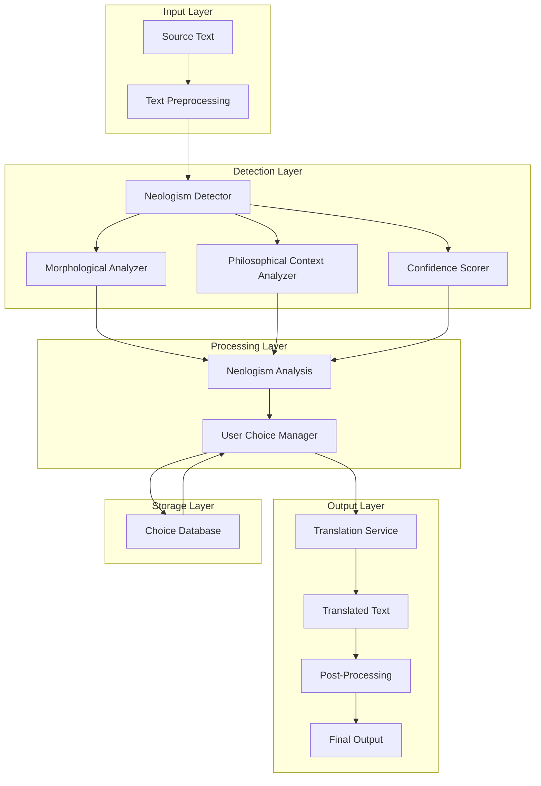
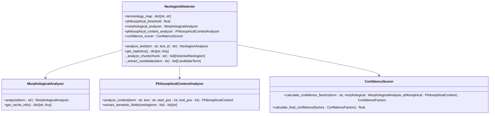
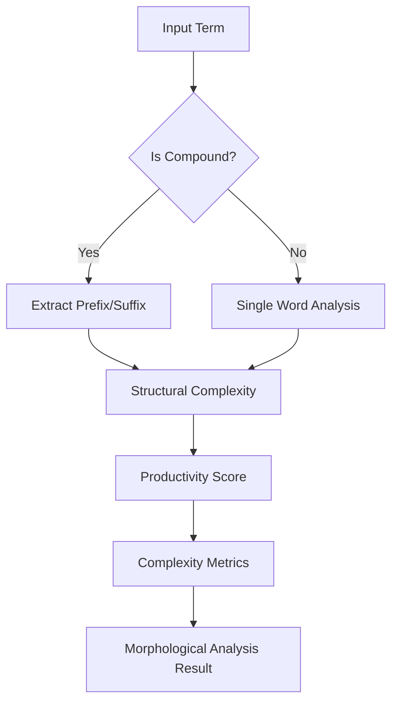
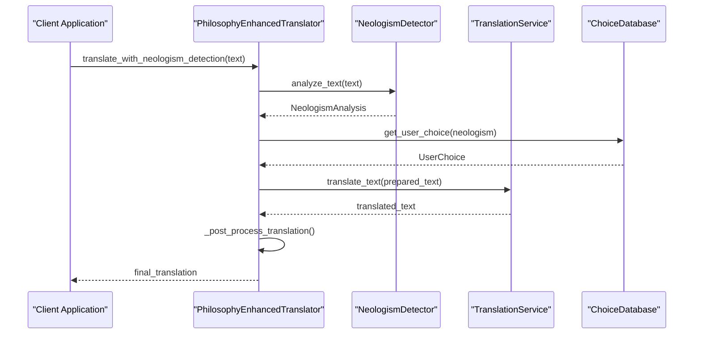
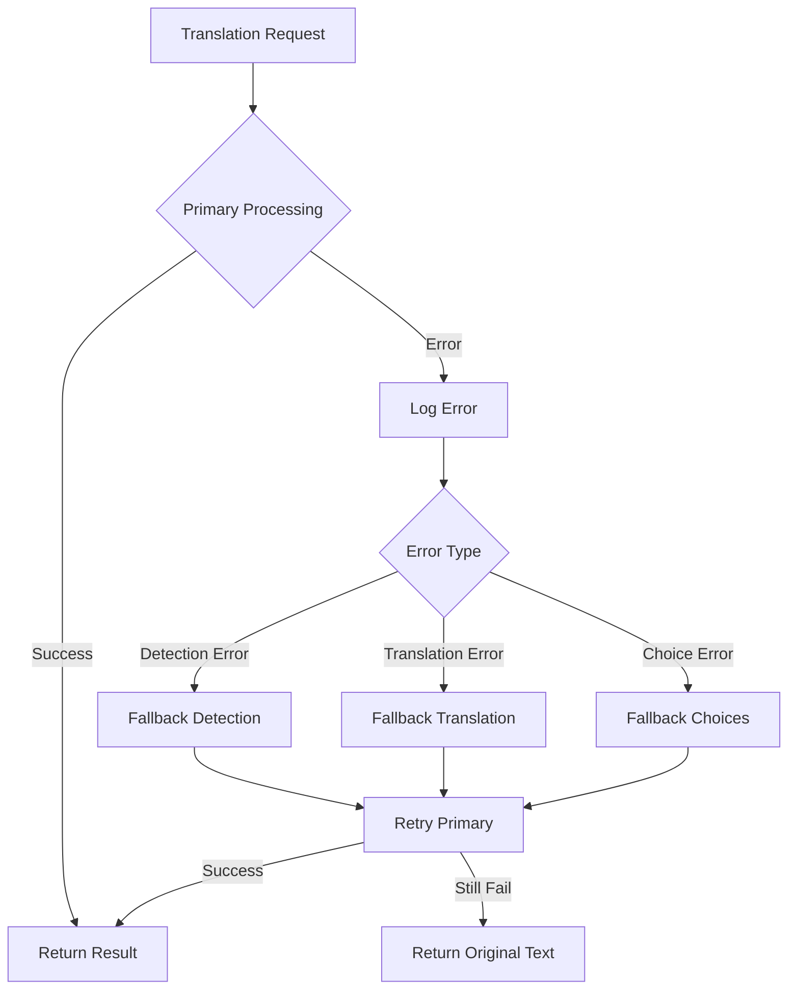

# Neologism Integration Example

<cite>
**Referenced Files in This Document**
- [neologism_integration_example.py](file://examples/neologism_integration_example.py)
- [neologism_detector.py](file://services/neologism_detector.py)
- [neologism_models.py](file://models/neologism_models.py)
- [klages_terminology.json](file://config/klages_terminology.json)
- [choice_database.py](file://database/choice_database.py)
- [confidence_scorer.py](file://services/confidence_scorer.py)
- [philosophical_context_analyzer.py](file://services/philosophical_context_analyzer.py)
- [translation_handler.py](file://core/translation_handler.py)
- [philosophy_enhanced_translation_service.py](file://services/philosophy_enhanced_translation_service.py)
</cite>

## Table of Contents
1. [Introduction](#introduction)
2. [System Architecture](#system-architecture)
3. [Core Components](#core-components)
4. [Neologism Detection Pipeline](#neologism-detection-pipeline)
5. [Integration with Translation Services](#integration-with-translation-services)
6. [User Choice Management](#user-choice-management)
7. [Configuration and Customization](#configuration-and-customization)
8. [Performance Considerations](#performance-considerations)
9. [Error Handling and Fallback Strategies](#error-handling-and-fallback-strategies)
10. [Troubleshooting Guide](#troubleshooting-guide)
11. [Best Practices](#best-practices)
12. [Conclusion](#conclusion)

## Introduction

The neologism integration example demonstrates a sophisticated system for detecting and handling newly coined linguistic terms within philosophical texts. This system combines advanced natural language processing capabilities with intelligent user choice management to preserve the integrity of philosophical terminology during translation.

The core functionality centers around the `PhilosophyEnhancedTranslator` class, which orchestrates neologism detection, user choice application, and translation preservation. The system is designed to handle complex philosophical texts while maintaining the semantic richness of specialized terminology.

## System Architecture

The neologism integration system follows a modular architecture with clear separation of concerns:



**Diagram sources**
- [neologism_detector.py](file://services/neologism_detector.py#L1-L100)
- [philosophy_enhanced_translation_service.py](file://services/philosophy_enhanced_translation_service.py#L1-L100)

## Core Components

### PhilosophyEnhancedTranslator

The `PhilosophyEnhancedTranslator` serves as the primary orchestrator for the neologism integration system. It combines multiple specialized services to provide comprehensive neologism detection and handling.

```python
class PhilosophyEnhancedTranslator:
    def __init__(
        self,
        terminology_path: Optional[str] = None,
        min_confidence: float = 0.6,
        preserve_neologisms: bool = True,
    ) -> None:
        self.min_confidence: float = min_confidence
        self.preserve_neologisms: bool = preserve_neologisms

        self.neologism_detector: NeologismDetector = NeologismDetector(
            terminology_path=terminology_path,
            philosophical_threshold=min_confidence
        )

        self.translation_service: TranslationService = TranslationService(
            terminology_map=self.neologism_detector.terminology_map
        )
```

Key features include:
- **Configurable Confidence Thresholds**: Users can adjust the minimum confidence level for neologism detection
- **Flexible Preservation Options**: Choose between preserving detected neologisms or translating them
- **Integrated Terminology Management**: Seamlessly incorporates custom terminology from JSON files

### NeologismDetector

The `NeologismDetector` is the core component responsible for identifying newly coined terms. It employs multiple analytical approaches:



**Diagram sources**
- [neologism_detector.py](file://services/neologism_detector.py#L40-L120)
- [neologism_models.py](file://models/neologism_models.py#L1-L100)

**Section sources**
- [neologism_integration_example.py](file://examples/neologism_integration_example.py#L30-L80)
- [neologism_detector.py](file://services/neologism_detector.py#L40-L150)

## Neologism Detection Pipeline

The neologism detection pipeline operates through several sophisticated stages:

### Text Analysis and Chunking

```python
def analyze_text(self, text: str, text_id: str = "unknown", chunk_size: int = 2000) -> NeologismAnalysis:
    """Analyze text for neologisms with comprehensive detection."""

    # Process text in chunks for memory efficiency
    chunks = self._chunk_text(text, chunk_size)

    for chunk_idx, chunk in enumerate(chunks):
        chunk_neologisms = self._analyze_chunk(chunk)

        for neologism in chunk_neologisms:
            neologism.source_text_id = text_id
            analysis.add_detection(neologism)
```

### Candidate Term Extraction

The system employs multiple strategies for identifying potential neologisms:

1. **SpaCy Linguistic Analysis**: Leverages German morphological parsing
2. **Regex Pattern Matching**: Identifies compound words and philosophical terms
3. **Length-Based Filtering**: Focuses on words exceeding minimum length thresholds

```python
def _extract_candidates(self, text: str) -> list[CandidateTerm]:
    """Extract candidate terms from text for neologism analysis."""
    candidates = []

    if self.nlp:
        doc = self.nlp(text)

        for token in doc:
            # Skip short words, punctuation, and common words
            if (len(token.text) < 6 or token.is_punct or token.is_stop or token.like_num):
                continue

            # Focus on nouns and complex words
            if token.pos_ in ["NOUN", "PROPN"] or self._is_compound_word(token.text):
                sentence_context = token.sent.text if token.sent else text
                candidates.append(CandidateTerm(
                    term=token.text,
                    start_pos=token.idx,
                    end_pos=token.idx + len(token.text),
                    sentence_context=sentence_context,
                ))
```

### Morphological Analysis

The morphological analyzer examines word structure to identify compound formations:



**Diagram sources**
- [neologism_detector.py](file://services/neologism_detector.py#L600-L700)

### Philosophical Context Analysis

The system analyzes the semantic field and philosophical domain of identified terms:

```python
def analyze_context(self, term: str, text: str, start_pos: int, end_pos: int) -> PhilosophicalContext:
    """Analyze philosophical context around a term."""
    context = PhilosophicalContext()

    # Calculate philosophical density
    context.philosophical_density = self._calculate_philosophical_density(context_window)

    # Extract philosophical indicators
    context.philosophical_keywords = self._extract_philosophical_keywords(context_window)
    context.semantic_field = self._identify_semantic_field(context_window)

    return context
```

**Section sources**
- [neologism_detector.py](file://services/neologism_detector.py#L300-L500)
- [philosophical_context_analyzer.py](file://services/philosophical_context_analyzer.py#L100-L200)

## Integration with Translation Services

### Layout-Aware Translation Service

The system integrates with the `LayoutAwareTranslationService` to maintain document formatting during translation:



**Diagram sources**
- [neologism_integration_example.py](file://examples/neologism_integration_example.py#L80-L150)
- [philosophy_enhanced_translation_service.py](file://services/philosophy_enhanced_translation_service.py#L200-L300)

### Translation Pipeline Implementation

The translation pipeline follows a structured approach:

```python
def translate_with_neologism_detection(self, text: str, source_lang: str = "de", target_lang: str = "en", provider: str = "auto") -> dict[str, Any]:
    """Translate text with integrated neologism detection and preservation."""

    # Step 1: Detect neologisms in the source text
    neologism_analysis: NeologismAnalysis = self.neologism_detector.analyze_text(text, "source_text")

    # Step 2: Prepare text for translation
    prepared_text, neologism_map = self._prepare_text_for_translation(text, neologism_analysis)

    # Step 3: Translate the prepared text
    translated_text: str = self.translation_service.translate_text(prepared_text, source_lang, target_lang, provider)

    # Step 4: Post-process translation with neologism handling
    final_translation: str = self._post_process_translation(translated_text, neologism_map)

    return {
        "original_text": text,
        "translated_text": final_translation,
        "neologism_analysis": neologism_analysis.to_dict(),
        "high_confidence_neologisms": [n.to_dict() for n in neologism_analysis.get_high_confidence_neologisms()],
    }
```

### Preservation Strategies

The system implements multiple strategies for handling detected neologisms:

1. **Preservation Markers**: Replace neologisms with unique markers during translation
2. **Custom Translations**: Apply user-defined translations for specific terms
3. **Default Translation**: Allow neologisms to be translated normally
4. **Context Preservation**: Maintain original terms with annotations for high-confidence detections

**Section sources**
- [neologism_integration_example.py](file://examples/neologism_integration_example.py#L80-L200)
- [philosophy_enhanced_translation_service.py](file://services/philosophy_enhanced_translation_service.py#L400-L600)

## User Choice Management

### Choice Database Architecture

The `ChoiceDatabase` manages user preferences and historical choices:

```mermaid
erDiagram
USER_CHOICES {
choice_id PK
neologism_term
choice_type
translation_result
choice_scope
confidence_level
user_notes
created_at
updated_at
session_id FK
}
CHOICE_SESSIONS {
session_id PK
session_name
status
document_id
user_id
source_language
target_language
created_at
updated_at
}
CHOICE_CONTEXTS {
context_id PK
choice_id FK
context_hash
semantic_field
philosophical_domain
author
source_language
target_language
surrounding_terms
related_concepts
}
USER_CHOICES ||--|| CHOICE_SESSIONS : belongs_to
USER_CHOICES }|--|| CHOICE_CONTEXTS : has_context
```

**Diagram sources**
- [choice_database.py](file://database/choice_database.py#L100-L200)

### Choice Types and Application

The system supports multiple choice types for handling neologisms:

```python
class ChoiceType(Enum):
    PRESERVE = "preserve"
    TRANSLATE = "translate"
    CUSTOM_TRANSLATION = "custom_translation"
    CONTEXT_DEPENDENT = "context_dependent"
```

Each choice type influences the translation process differently:

- **PRESERVE**: Keeps the original term intact with optional annotations
- **TRANSLATE**: Allows the term to be translated normally
- **CUSTOM_TRANSLATION**: Applies a user-specified translation
- **CONTEXT_DEPENDENT**: Uses context-aware logic for decision-making

### Dynamic Adaptation

The system continuously learns from user interactions:

```python
def update_choice_usage(self, choice_id: str, success: bool = True) -> bool:
    """Update choice usage statistics."""
    # Get current stats
    cursor = conn.execute("""
        SELECT usage_count, success_rate FROM user_choices WHERE choice_id = ?
    """, (choice_id,))

    row = cursor.fetchone()
    if not row:
        return False

    current_count = row["usage_count"]
    current_rate = row["success_rate"]

    # Update stats with learning rate alpha
    new_count = current_count + 1
    alpha = self._learning_rate_alpha
    if success:
        new_rate = current_rate * (1 - alpha) + alpha
    else:
        new_rate = current_rate * (1 - alpha)
```

**Section sources**
- [choice_database.py](file://database/choice_database.py#L600-L700)
- [philosophy_enhanced_translation_service.py](file://services/philosophy_enhanced_translation_service.py#L500-L600)

## Configuration and Customization

### Terminology Registration

The system supports custom terminology through JSON configuration files:

```json
{
  "Geist": "Spirit",
  "Seele": "Soul",
  "Widersacher": "Adversary",
  "Lebensfeindlichkeit": "Life-hostility",
  "Bewußtsein": "Consciousness",
  "Wille": "Will",
  "Trieb": "Drive",
  "Rhythmus": "Rhythm",
  "Ausdruck": "Expression",
  "Erscheinung": "Appearance",
  "Wirklichkeit": "Reality"
}
```

### Domain-Specific Vocabulary Extension

Users can extend the neologism model with domain-specific vocabulary:

```python
def extend_terminology(self, new_terms: dict[str, str]) -> None:
    """Extend the terminology map with new domain-specific terms."""
    self.terminology_map.update(new_terms)

    # Update philosophical indicators
    self.philosophical_context_analyzer.update_terminology_map(new_terms)

    # Refresh confidence scorer with new patterns
    self.confidence_scorer.update_patterns({
        "domain_specific_prefixes": list(new_terms.keys()),
        "domain_specific_suffixes": [f"_{key}" for key in new_terms.keys()]
    })
```

### Custom Threshold Configuration

The system allows fine-tuning of detection thresholds:

```python
# Initialize with custom confidence threshold
translator = PhilosophyEnhancedTranslator(
    terminology_path="path/to/custom_terminology.json",
    min_confidence=0.7,  # Higher threshold for stricter detection
    preserve_neologisms=True
)
```

**Section sources**
- [klages_terminology.json](file://config/klages_terminology.json#L1-L47)
- [neologism_detector.py](file://services/neologism_detector.py#L800-L900)

## Performance Considerations

### Memory Management

The system implements several strategies to optimize memory usage:

1. **Chunked Processing**: Large texts are processed in manageable chunks
2. **LRU Caching**: Morphological analysis results are cached for reuse
3. **Lazy Loading**: Components are loaded only when needed

```python
@property
def morphological_analyzer(self) -> MorphologicalAnalyzer:
    """Lazy loading property for morphological analyzer."""
    if self._morphological_analyzer is None:
        self._morphological_analyzer = MorphologicalAnalyzer(
            spacy_model=self.nlp,
            cache_size=self.cache_size
        )
    return self._morphological_analyzer
```

### Concurrency and Threading

The system supports asynchronous operations for improved performance:

```python
async def translate_text_with_neologism_handling_async(
    self, text: str, source_lang: str, target_lang: str, provider: str = "auto"
) -> NeologismPreservationResult:
    """Async version: Translate text with integrated neologism detection."""

    # Parallel processing of detection and choice application
    detection_task = asyncio.create_task(self._detect_neologisms_async(text))
    choice_task = asyncio.create_task(self._apply_user_choices_async(text))

    neologism_analysis = await detection_task
    preservation_data = await choice_task

    # Continue with translation...
```

### Performance Monitoring

The system tracks key performance metrics:

```python
def get_statistics(self) -> dict[str, Any]:
    """Get detector statistics."""
    cache_info = self.morphological_analyzer.get_cache_info()

    return {
        "total_analyses": self.total_analyses,
        "cache_hits": cache_info["hits"],
        "cache_misses": cache_info["misses"],
        "cache_hit_rate": cache_info["hit_rate"],
        "spacy_available": SPACY_AVAILABLE,
        "terminology_entries": len(self.terminology_map),
        "philosophical_indicators": len(self.philosophical_indicators),
    }
```

**Section sources**
- [neologism_detector.py](file://services/neologism_detector.py#L100-L200)
- [philosophy_enhanced_translation_service.py](file://services/philosophy_enhanced_translation_service.py#L100-L200)

## Error Handling and Fallback Strategies

### Graceful Degradation

The system implements robust error handling with fallback mechanisms:

```python
def translate_with_neologism_detection(self, text: str, source_lang: str = "de", target_lang: str = "en", provider: str = "auto") -> dict[str, Any]:
    """Translate text with integrated neologism detection and preservation."""

    try:
        # Primary processing with neologism detection
        neologism_analysis = self.neologism_detector.analyze_text(text, "source_text")
        prepared_text, neologism_map = self._prepare_text_for_translation(text, neologism_analysis)

        # Translation with fallback
        try:
            translated_text = self.translation_service.translate_text(prepared_text, source_lang, target_lang, provider)
        except Exception as e:
            logger.warning(f"Translation failed: {e}, using original text")
            translated_text = prepared_text

        final_translation = self._post_process_translation(translated_text, neologism_map)

    except Exception as e:
        logger.error(f"Primary translation failed: {e}")
        # Fallback to simple translation
        final_translation = self.translation_service.translate_text(text, source_lang, target_lang, provider)

    return {"translated_text": final_translation}
```

### Ambiguity Resolution

The system provides multiple strategies for resolving ambiguous neologisms:

1. **Contextual Analysis**: Uses surrounding text to disambiguate terms
2. **User Preferences**: Applies previously made choices
3. **Default Behavior**: Preserves terms by default when no clear choice exists

```python
def resolve_ambiguous_neologism(self, neologism: DetectedNeologism, context: str) -> ChoiceType:
    """Resolve ambiguity for neologisms with conflicting interpretations."""

    # Check user history
    user_choice = self.user_choice_manager.get_choice_for_neologism(neologism)
    if user_choice:
        return user_choice.choice_type

    # Analyze context for clues
    context_density = self._calculate_context_density(context)
    if context_density > 0.7:
        return ChoiceType.PRESERVE  # Preserve in dense philosophical context

    # Default to translation for general terms
    return ChoiceType.TRANSLATE
```

### Error Recovery

The system includes comprehensive error recovery mechanisms:



**Diagram sources**
- [neologism_integration_example.py](file://examples/neologism_integration_example.py#L200-L300)

**Section sources**
- [neologism_integration_example.py](file://examples/neologism_integration_example.py#L200-L350)

## Troubleshooting Guide

### Common Issues and Solutions

#### False Positive Detection

**Problem**: The system detects non-neologisms as neologisms
**Solution**: Adjust the confidence threshold or refine morphological patterns

```python
# Lower confidence threshold for broader detection
translator = PhilosophyEnhancedTranslator(
    min_confidence=0.4,  # More sensitive detection
    preserve_neologisms=True
)

# Or customize morphological patterns
detector = NeologismDetector()
detector.german_morphological_patterns["philosophical_endings"] = [
    "bewusstsein", "wirklichkeit", "erkenntnis", "wahrnehmung"
]
```

#### Performance Issues

**Problem**: Slow processing with large documents
**Solution**: Optimize chunk size and enable caching

```python
# Optimize chunk size for memory management
translator = PhilosophyEnhancedTranslator(
    min_confidence=0.6,
    preserve_neologisms=True
)

# Enable caching for repeated analyses
detector = NeologismDetector(cache_size=5000)
```

#### Missing Terminology

**Problem**: Known philosophical terms are not recognized
**Solution**: Extend the terminology map

```python
# Add custom terminology
custom_terms = {
    "Existenzialismus": "Existentialism",
    "Phänomenologische": "Phenomenological",
    "Ontologische": "Ontological"
}

# Update terminology map
detector.terminology_map.update(custom_terms)
detector.philosophical_context_analyzer.update_terminology_map(custom_terms)
```

### Debugging Tools

The system provides comprehensive debugging capabilities:

```python
# Debug compound detection
is_compound = detector.debug_compound_detection("Weltanschauung")

# Extract philosophical keywords
keywords = detector.debug_extract_philosophical_keywords(sample_text)

# Analyze candidate extraction
candidates = detector.debug_extract_candidates(sample_text)
```

### Validation and Testing

```python
def validate_neologism_detection(text: str, expected_neologisms: list[str]) -> dict[str, Any]:
    """Validate neologism detection results."""
    detector = NeologismDetector()
    analysis = detector.analyze_text(text)

    detected_terms = [n.term for n in analysis.detected_neologisms]
    missing = set(expected_neologisms) - set(detected_terms)
    extra = set(detected_terms) - set(expected_neologisms)

    return {
        "total_detected": len(detected_terms),
        "missing_expected": list(missing),
        "unexpected_found": list(extra),
        "confidence_distribution": analysis.confidence_distribution
    }
```

**Section sources**
- [neologism_detector.py](file://services/neologism_detector.py#L900-L1000)
- [neologism_integration_example.py](file://examples/neologism_integration_example.py#L350-L439)

## Best Practices

### Optimal Configuration

1. **Start Conservative**: Begin with lower confidence thresholds and gradually increase
2. **Monitor Performance**: Track cache hit rates and processing times
3. **Iterative Improvement**: Continuously refine terminology maps based on usage patterns

### Integration Guidelines

1. **Batch Processing**: Use batch translation for multiple documents
2. **Session Management**: Maintain user sessions for consistent choice application
3. **Progress Tracking**: Implement progress callbacks for long-running operations

### Maintenance Recommendations

1. **Regular Updates**: Periodically update terminology maps with new discoveries
2. **Performance Monitoring**: Monitor system performance and adjust configurations as needed
3. **User Feedback**: Incorporate user feedback to improve detection accuracy

## Conclusion

The neologism integration example demonstrates a sophisticated approach to handling newly coined linguistic terms in philosophical texts. Through its modular architecture, comprehensive detection pipeline, and intelligent user choice management, the system provides a robust foundation for preserving the semantic richness of specialized terminology during translation.

Key strengths of the system include:

- **Multi-layered Detection**: Combines morphological, contextual, and confidence-based analysis
- **Flexible Integration**: Seamlessly integrates with existing translation services
- **User-Centric Design**: Empowers users to customize handling of neologisms
- **Robust Error Handling**: Implements comprehensive fallback strategies
- **Performance Optimization**: Includes caching, chunking, and asynchronous processing

The system's design allows for continuous improvement through user feedback and evolving terminology databases, making it suitable for both research applications and production environments requiring high-quality philosophical text translation.

Future enhancements could include machine learning-based refinement of detection algorithms, expanded domain-specific terminologies, and enhanced integration with collaborative translation platforms.
