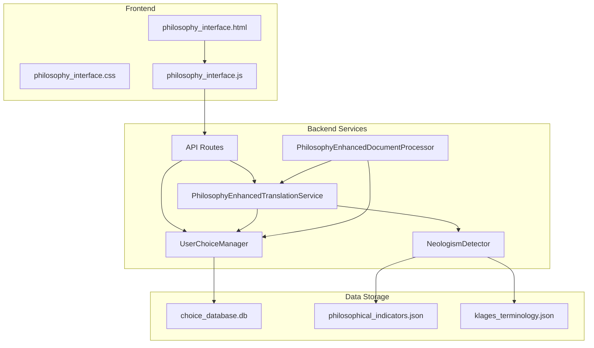
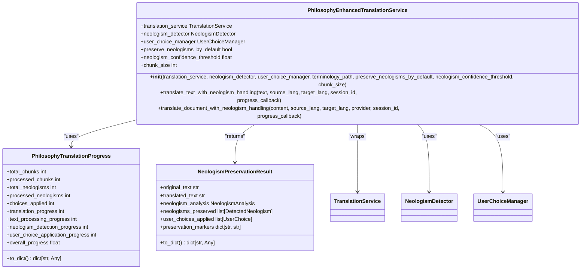
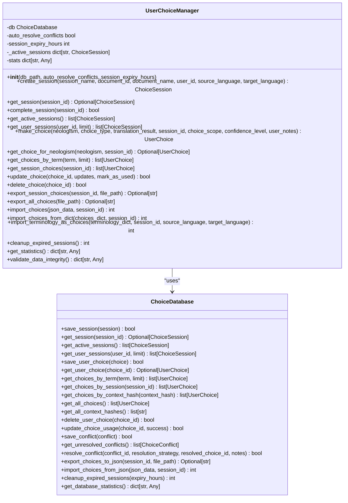
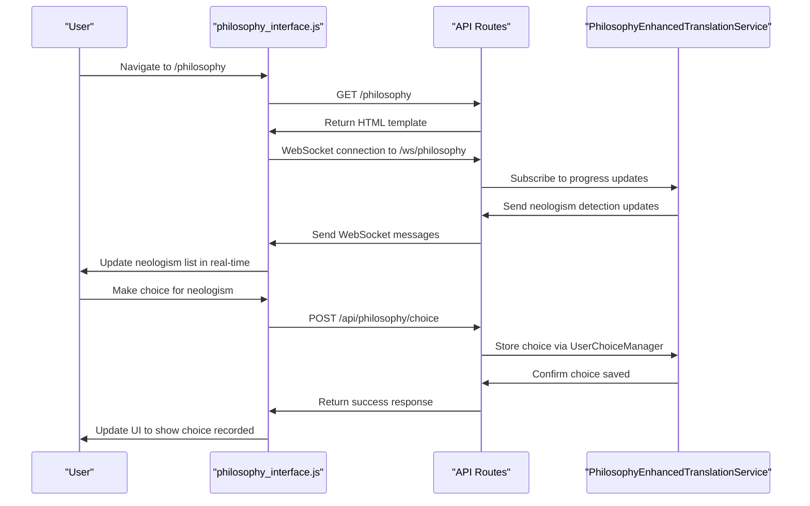
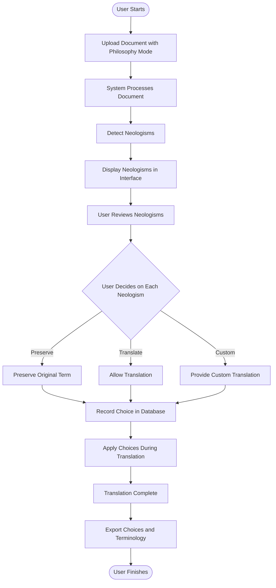
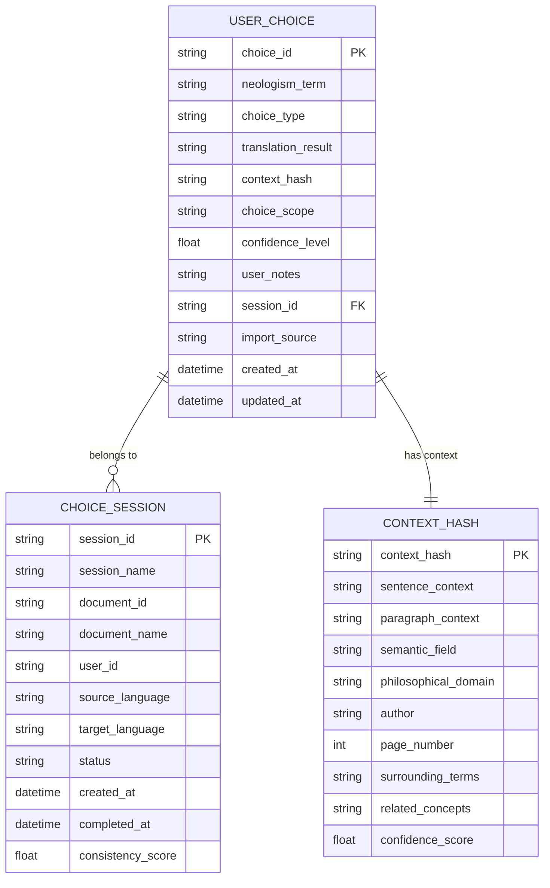

# Philosophy Interface Usage Example

<cite>
**Referenced Files in This Document**  
- [philosophy_interface_usage_example.py](file://examples/philosophy_interface_usage_example.py)
- [philosophy_enhanced_document_processor.py](file://services/philosophy_enhanced_document_processor.py)
- [philosophy_enhanced_translation_service.py](file://services/philosophy_enhanced_translation_service.py)
- [user_choice_manager.py](file://services/user_choice_manager.py)
- [philosophical_indicators.json](file://config/philosophical_indicators.json)
- [philosophy_interface.html](file://templates/philosophy_interface.html)
- [philosophy_interface.js](file://static/philosophy_interface.js)
- [app.py](file://app.py)
- [gradio_interface.py](file://ui/gradio_interface.py)
- [routes.py](file://api/routes.py)
</cite>

## Table of Contents
1. [Introduction](#introduction)
2. [Core Components](#core-components)
3. [Architecture Overview](#architecture-overview)
4. [Detailed Component Analysis](#detailed-component-analysis)
5. [User Interaction Flow](#user-interaction-flow)
6. [State Management](#state-management)
7. [Configuration and Customization](#configuration-and-customization)
8. [Common Issues and Troubleshooting](#common-issues-and-troubleshooting)
9. [Conclusion](#conclusion)

## Introduction

The Philosophy Interface Usage Example demonstrates the integration of philosophical context analysis with document translation, focusing on neologism detection and user choice management. This system enables users to interact with detected philosophical terms during translation, making informed decisions about how these specialized terms should be handled. The interface combines backend processing services with a frontend web interface to provide a comprehensive environment for translating philosophical texts while preserving their conceptual integrity.

The system is designed to handle complex philosophical terminology through a multi-layered approach that includes neologism detection, user choice recording, and persistent storage of translation decisions. This documentation explains how the various components work together to provide a seamless experience for users working with philosophical texts.

**Section sources**
- [philosophy_interface_usage_example.py](file://examples/philosophy_interface_usage_example.py#L1-L389)

## Core Components

The philosophy interface system consists of several core components that work together to provide enhanced translation capabilities for philosophical texts. The main components include the PhilosophyEnhancedTranslationService, UserChoiceManager, and NeologismDetector, which are orchestrated through the PhilosophyEnhancedDocumentProcessor.

The PhilosophyEnhancedTranslationService extends the base translation functionality with specialized features for handling philosophical texts, including neologism detection and user choice application. The UserChoiceManager handles the storage and retrieval of user decisions regarding how specific terms should be translated, providing both session-based and persistent storage. The NeologismDetector identifies specialized philosophical terminology using a combination of lexical analysis and context evaluation.

These components are integrated through the philosophy interface, which provides both programmatic access through Python scripts and interactive access through a web-based interface.

**Section sources**
- [philosophy_enhanced_translation_service.py](file://services/philosophy_enhanced_translation_service.py#L1-L1053)
- [user_choice_manager.py](file://services/user_choice_manager.py#L1-L1048)
- [philosophy_enhanced_document_processor.py](file://services/philosophy_enhanced_document_processor.py#L1-L730)

## Architecture Overview

The philosophy interface architecture follows a layered design pattern with clear separation between the frontend interface, backend services, and data storage components. The system integrates with the main document translation pipeline while providing specialized functionality for philosophical text processing.

**Diagram sources**
- [philosophy_interface.html](file://templates/philosophy_interface.html#L1-L393)
- [philosophy_interface.js](file://static/philosophy_interface.js#L1-L660)
- [routes.py](file://api/routes.py#L1-L520)
- [philosophy_enhanced_translation_service.py](file://services/philosophy_enhanced_translation_service.py#L1-L1053)
- [user_choice_manager.py](file://services/user_choice_manager.py#L1-L1048)
- [philosophy_enhanced_document_processor.py](file://services/philosophy_enhanced_document_processor.py#L1-L730)
- [philosophical_indicators.json](file://config/philosophical_indicators.json#L1-L35)

## Detailed Component Analysis

### PhilosophyEnhancedTranslationService Analysis

The PhilosophyEnhancedTranslationService is the core component responsible for integrating neologism detection with the translation process. It extends the base translation functionality by adding specialized processing for philosophical terms and user choice application.

**Diagram sources**
- [philosophy_enhanced_translation_service.py](file://services/philosophy_enhanced_translation_service.py#L1-L1053)

### UserChoiceManager Analysis

The UserChoiceManager component handles the storage, retrieval, and management of user decisions regarding how specific terms should be translated. It provides a comprehensive system for tracking user choices across sessions and documents.

**Diagram sources**
- [user_choice_manager.py](file://services/user_choice_manager.py#L1-L1048)
- [database/choice_database.py](file://database/choice_database.py#L1-L1048)

### Philosophy Interface Frontend Analysis

The frontend components of the philosophy interface provide an interactive web-based environment for users to review and manage neologism detection results and translation choices.

**Diagram sources**
- [philosophy_interface.html](file://templates/philosophy_interface.html#L1-L393)
- [philosophy_interface.js](file://static/philosophy_interface.js#L1-L660)
- [routes.py](file://api/routes.py#L1-L520)
- [philosophy_enhanced_translation_service.py](file://services/philosophy_enhanced_translation_service.py#L1-L1053)

## User Interaction Flow

The user interaction flow for the philosophy interface follows a structured process that begins with document upload and progresses through neologism detection, user choice recording, and final translation. The flow is designed to provide users with maximum control over how philosophical terms are handled during translation.

When a user accesses the philosophy interface, they first upload a document through the main interface with the "Philosophy Mode" enabled. The system then processes the document, detecting potential neologisms based on the configured philosophical indicators. As neologisms are detected, they are displayed in the interface where the user can make decisions about how each term should be handled.

The user can choose to preserve the original term, allow it to be translated, or provide a custom translation. These choices are immediately recorded and applied during the translation process. The interface provides real-time feedback on the progress of neologism detection and choice application, allowing users to monitor the status of their translation.

**Diagram sources**
- [philosophy_interface_usage_example.py](file://examples/philosophy_interface_usage_example.py#L1-L389)
- [philosophy_interface.html](file://templates/philosophy_interface.html#L1-L393)
- [philosophy_interface.js](file://static/philosophy_interface.js#L1-L660)
- [routes.py](file://api/routes.py#L1-L520)

**Section sources**
- [philosophy_interface_usage_example.py](file://examples/philosophy_interface_usage_example.py#L1-L389)
- [philosophy_interface.html](file://templates/philosophy_interface.html#L1-L393)
- [philosophy_interface.js](file://static/philosophy_interface.js#L1-L660)

## State Management

The philosophy interface implements a comprehensive state management system that tracks the progress of document processing, user choices, and session information. The state is managed through a combination of server-side storage and client-side tracking.

The core state management is handled by the UserChoiceManager, which maintains both active sessions in memory and persistent storage in the choice database. Each session contains information about the document being processed, the user's choices, and the current state of the translation process. The system uses a session-based approach to ensure that choices are properly associated with specific translation tasks.

Client-side state is managed through the philosophy_interface.js script, which maintains a local representation of the current state including detected neologisms, user choices, and progress information. This client-side state is synchronized with the server through WebSocket connections and API calls, ensuring that the user interface reflects the current state of the translation process.

The state management system also includes mechanisms for handling session expiration and cleanup. Sessions that have not been active for a configurable period are automatically expired and removed from the active sessions cache. This helps maintain system performance and ensures that resources are not consumed by inactive sessions.

**Section sources**
- [core/state_manager.py](file://core/state_manager.py#L1-L1048)
- [user_choice_manager.py](file://services/user_choice_manager.py#L1-L1048)
- [philosophy_interface.js](file://static/philosophy_interface.js#L1-L660)

## Configuration and Customization

The philosophy interface provides extensive configuration options that allow users to customize the behavior of the system for different philosophical traditions and translation requirements. Configuration is managed through both JSON configuration files and runtime settings in the web interface.

The philosophical_indicators.json file contains a comprehensive list of philosophical terms organized by category, which is used by the NeologismDetector to identify potential neologisms in the text. Users can customize this file to add or modify terms for specific philosophical traditions. Additionally, the system supports custom terminology files that can be loaded at runtime to provide specialized vocabulary for particular authors or schools of thought.

The web interface provides a settings panel where users can adjust various parameters such as neologism detection sensitivity, author context, and morphological analysis depth. These settings allow users to fine-tune the system's behavior based on the specific requirements of their translation task. For example, when working with texts by Ludwig Klages, users can select the "Klages" author context to optimize the detection of his specialized terminology.

The system also supports batch operations and export/import functionality, allowing users to share terminology databases and user choices between different instances or users. This facilitates collaboration and ensures consistency across multiple translation projects.

**Diagram sources**
- [config/philosophical_indicators.json](file://config/philosophical_indicators.json#L1-L35)
- [config/settings.py](file://config/settings.py#L1-L1048)
- [philosophy_interface.html](file://templates/philosophy_interface.html#L1-L393)
- [philosophy_interface.js](file://static/philosophy_interface.js#L1-L660)

**Section sources**
- [config/philosophical_indicators.json](file://config/philosophical_indicators.json#L1-L35)
- [config/settings.py](file://config/settings.py#L1-L1048)
- [philosophy_interface.html](file://templates/philosophy_interface.html#L1-L393)
- [philosophy_interface.js](file://static/philosophy_interface.js#L1-L660)

## Common Issues and Troubleshooting

The philosophy interface may encounter several common issues that users should be aware of when working with the system. Understanding these issues and their solutions can help ensure a smooth translation experience.

One common issue is session persistence, where user choices may not be properly saved or retrieved between sessions. This can occur if the database connection is interrupted or if the session expires before the translation is complete. To address this, users should ensure that their sessions remain active and complete their translation tasks within the configured session timeout period.

JavaScript-frontend/backend synchronization issues can occur when the client-side state becomes out of sync with the server state. This may manifest as neologisms not appearing in the interface or user choices not being recorded. The system uses WebSocket connections to maintain real-time synchronization, but network issues can sometimes disrupt this connection. Users can resolve this by refreshing the interface or checking their network connection.

Validation of user choices is another potential issue, particularly when importing terminology or choices from external sources. The system validates all imported data to ensure it conforms to the expected format, but malformed data can cause import failures. Users should ensure that their JSON or CSV files follow the expected structure and contain valid data types.

Performance considerations include the processing time for large documents with many neologisms. The system processes documents in chunks to manage memory usage, but very large documents may still require significant processing time. Users can optimize performance by adjusting the chunk size or processing documents in smaller sections.

**Section sources**
- [user_choice_manager.py](file://services/user_choice_manager.py#L1-L1048)
- [philosophy_interface.js](file://static/philosophy_interface.js#L1-L660)
- [routes.py](file://api/routes.py#L1-L520)
- [philosophy_enhanced_document_processor.py](file://services/philosophy_enhanced_document_processor.py#L1-L730)

## Conclusion

The Philosophy Interface Usage Example demonstrates a comprehensive system for enhancing document translation with specialized handling of philosophical terminology. By integrating neologism detection, user choice management, and persistent storage, the system provides a powerful tool for translating complex philosophical texts while preserving their conceptual integrity.

The architecture combines backend processing services with a responsive frontend interface to create a seamless user experience. The system's modular design allows for easy customization and extension, making it adaptable to different philosophical traditions and translation requirements.

Key features include real-time neologism detection, interactive user choice recording, batch operations for efficiency, and comprehensive export/import functionality for collaboration. The system's state management ensures that user decisions are properly tracked and applied throughout the translation process.

By following the patterns and practices demonstrated in this example, users can effectively leverage the philosophy interface to produce high-quality translations of philosophical texts that accurately convey the original meaning while respecting the specialized terminology of the source material.
