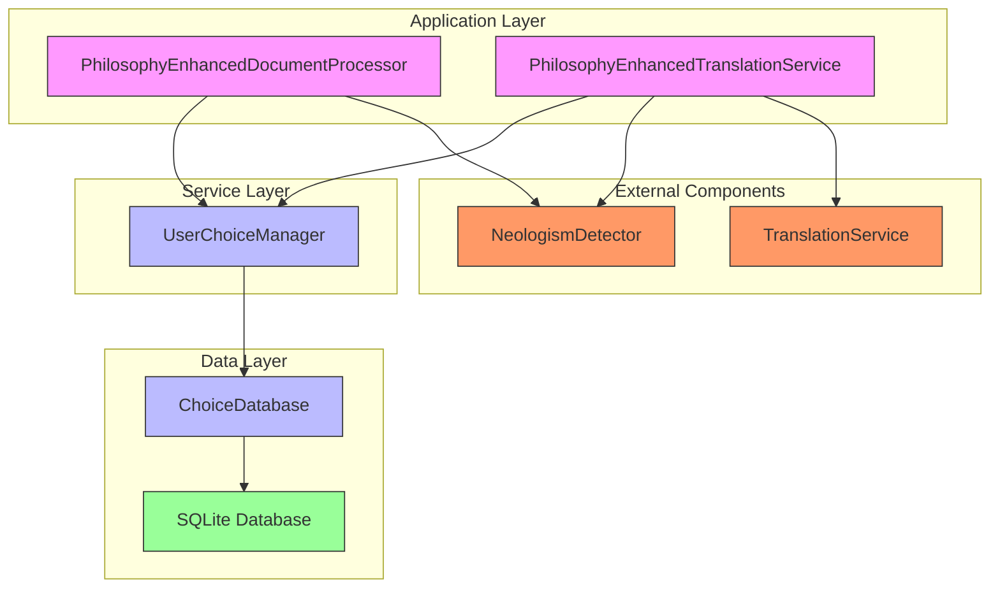
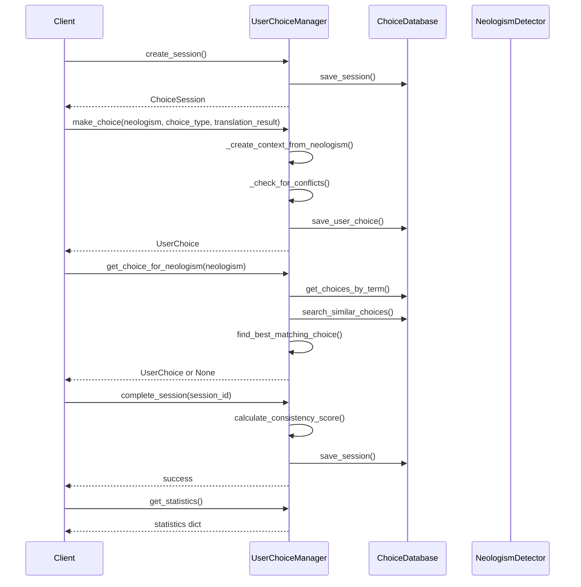
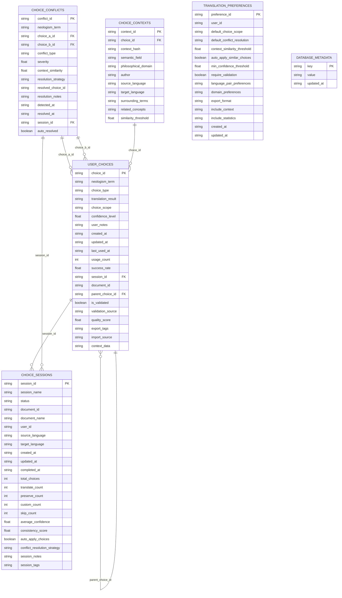
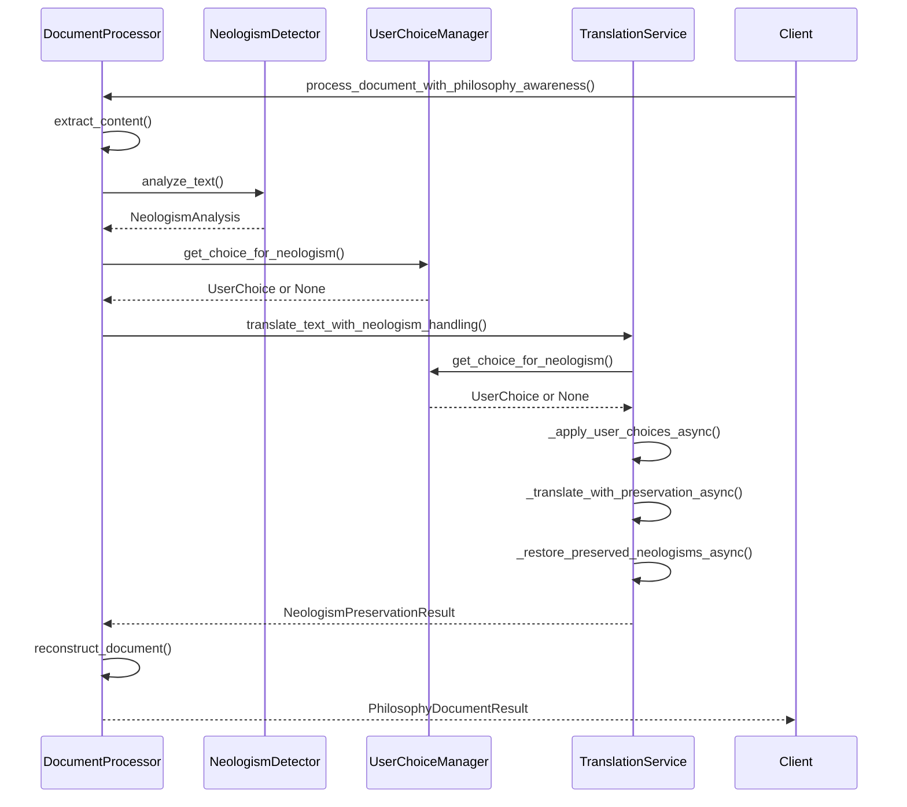
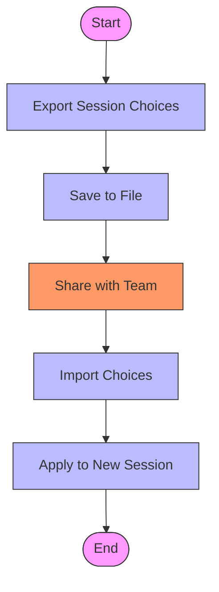
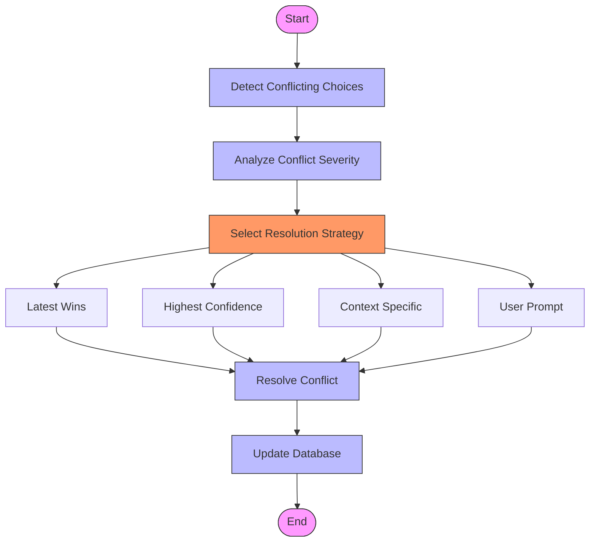

# User Choice Management Example

<cite>
**Referenced Files in This Document**  
- [user_choice_integration_example.py](file://examples/user_choice_integration_example.py)
- [user_choice_models.py](file://models/user_choice_models.py)
- [choice_database.py](file://database/choice_database.py)
- [user_choice_manager.py](file://services/user_choice_manager.py)
- [philosophy_enhanced_translation_service.py](file://services/philosophy_enhanced_translation_service.py)
- [philosophy_enhanced_document_processor.py](file://services/philosophy_enhanced_document_processor.py)
- [validators.py](file://utils/validators.py)
</cite>

## Table of Contents
1. [Introduction](#introduction)
2. [Core Components](#core-components)
3. [Architecture Overview](#architecture-overview)
4. [Detailed Component Analysis](#detailed-component-analysis)
5. [Database Schema](#database-schema)
6. [Integration with Translation Workflow](#integration-with-translation-workflow)
7. [Usage Patterns](#usage-patterns)
8. [Conflict Resolution](#conflict-resolution)
9. [Validation Rules](#validation-rules)
10. [Common Issues and Best Practices](#common-issues-and-best-practices)

## Introduction
The User Choice Management System provides a comprehensive solution for managing persistent user preferences across translation sessions, particularly for philosophical texts with neologisms. This system enables users to define, store, and apply consistent translation choices for specialized terminology, ensuring coherence across documents and sessions. The implementation demonstrates how user preferences can override default translations while maintaining layout preservation and handling complex philosophical concepts.

**Section sources**
- [user_choice_integration_example.py](file://examples/user_choice_integration_example.py#L1-L624)

## Core Components
The user choice management system consists of several interconnected components that work together to provide a seamless experience for managing translation preferences. The core components include the UserChoiceManager, ChoiceDatabase, and various data models that define the structure of user choices and sessions.

```mermaid
classDiagram
class UserChoice {
+choice_id : str
+neologism_term : str
+choice_type : ChoiceType
+translation_result : str
+context : TranslationContext
+choice_scope : ChoiceScope
+confidence_level : float
+user_notes : str
+created_at : str
+updated_at : str
+last_used_at : str
+usage_count : int
+success_rate : float
+session_id : str
+document_id : str
+parent_choice_id : str
+is_validated : bool
+validation_source : str
+quality_score : float
+export_tags : set[str]
+import_source : str
+update_usage_stats(success : bool)
+is_applicable_to_context(target_context : TranslationContext) bool
+to_dict() dict[str, Any]
+to_json() str
}
class ChoiceSession {
+session_id : str
+session_name : str
+status : SessionStatus
+document_id : str
+document_name : str
+user_id : str
+source_language : str
+target_language : str
+created_at : str
+updated_at : str
+completed_at : str
+total_choices : int
+translate_count : int
+preserve_count : int
+custom_count : int
+skip_count : int
+average_confidence : float
+consistency_score : float
+auto_apply_choices : bool
+conflict_resolution_strategy : ConflictResolution
+session_notes : str
+session_tags : set[str]
+add_choice_stats(choice : UserChoice)
+complete_session()
+calculate_consistency_score(choices : list[UserChoice]) float
+to_dict() dict[str, Any]
+to_json() str
}
class ChoiceConflict {
+conflict_id : str
+neologism_term : str
+choice_a : UserChoice
+choice_b : UserChoice
+conflict_type : str
+severity : float
+context_similarity : float
+resolution_strategy : ConflictResolution
+resolved_choice_id : str
+resolution_notes : str
+detected_at : str
+resolved_at : str
+session_id : str
+auto_resolved : bool
+analyze_conflict()
+resolve_conflict(resolution_strategy : ConflictResolution) Optional[str]
+to_dict() dict[str, Any]
+to_json() str
}
class TranslationContext {
+sentence_context : str
+paragraph_context : str
+document_context : str
+semantic_field : str
+philosophical_domain : str
+author : str
+source_language : str
+target_language : str
+page_number : int
+chapter : str
+section : str
+surrounding_terms : list[str]
+related_concepts : list[str]
+context_similarity_threshold : float
+confidence_score : float
+generate_context_hash() str
+calculate_similarity(other : TranslationContext) float
+to_dict() dict[str, Any]
}
class TranslationPreference {
+preference_id : str
+user_id : str
+default_choice_scope : ChoiceScope
+default_conflict_resolution : ConflictResolution
+context_similarity_threshold : float
+auto_apply_similar_choices : bool
+min_confidence_threshold : float
+require_validation : bool
+language_pair_preferences : dict[str, dict[str, Any]]
+domain_preferences : dict[str, dict[str, Any]]
+export_format : str
+include_context : bool
+include_statistics : bool
+created_at : str
+updated_at : str
+update_language_preference(source_lang : str, target_lang : str, preferences : dict[str, Any])
+update_domain_preference(domain : str, preferences : dict[str, Any])
+get_language_preference(source_lang : str, target_lang : str) dict[str, Any]
+get_domain_preference(domain : str) dict[str, Any]
+to_dict() dict[str, Any]
+to_json() str
}
class ChoiceType {
+TRANSLATE : "translate"
+PRESERVE : "preserve"
+CUSTOM_TRANSLATION : "custom_translation"
+SKIP : "skip"
}
class ChoiceScope {
+GLOBAL : "global"
+CONTEXTUAL : "contextual"
+DOCUMENT : "document"
+SESSION : "session"
}
class ConflictResolution {
+LATEST_WINS : "latest_wins"
+CONTEXT_SPECIFIC : "context_specific"
+USER_PROMPT : "user_prompt"
+HIGHEST_CONFIDENCE : "highest_confidence"
}
class SessionStatus {
+ACTIVE : "active"
+COMPLETED : "completed"
+SUSPENDED : "suspended"
+EXPIRED : "expired"
}
UserChoiceManager --> UserChoice : "creates"
UserChoiceManager --> ChoiceSession : "manages"
UserChoiceManager --> ChoiceConflict : "detects"
UserChoiceManager --> TranslationContext : "uses"
UserChoiceManager --> TranslationPreference : "applies"
ChoiceDatabase --> UserChoice : "stores"
ChoiceDatabase --> ChoiceSession : "stores"
ChoiceDatabase --> ChoiceConflict : "stores"
ChoiceDatabase --> TranslationContext : "indexes"
PhilosophyEnhancedTranslationService --> UserChoiceManager : "integrates"
PhilosophyEnhancedDocumentProcessor --> UserChoiceManager : "integrates"
```

**Diagram sources **
- [user_choice_models.py](file://models/user_choice_models.py#L1-L685)
- [user_choice_manager.py](file://services/user_choice_manager.py#L1-L1048)

**Section sources**
- [user_choice_models.py](file://models/user_choice_models.py#L1-L685)
- [user_choice_manager.py](file://services/user_choice_manager.py#L1-L1048)

## Architecture Overview
The user choice management system follows a layered architecture with clear separation of concerns. At the core is the ChoiceDatabase, which provides persistent storage for user choices, sessions, and conflicts. The UserChoiceManager serves as the primary interface for applications, handling business logic and coordinating between components. The system integrates with the translation workflow through the PhilosophyEnhancedTranslationService and PhilosophyEnhancedDocumentProcessor, which apply user choices during translation.

**Diagram sources **
- [user_choice_manager.py](file://services/user_choice_manager.py#L1-L1048)
- [philosophy_enhanced_translation_service.py](file://services/philosophy_enhanced_translation_service.py#L1-L1053)
- [philosophy_enhanced_document_processor.py](file://services/philosophy_enhanced_document_processor.py#L1-L730)

**Section sources**
- [user_choice_manager.py](file://services/user_choice_manager.py#L1-L1048)
- [philosophy_enhanced_translation_service.py](file://services/philosophy_enhanced_translation_service.py#L1-L1053)
- [philosophy_enhanced_document_processor.py](file://services/philosophy_enhanced_document_processor.py#L1-L730)

## Detailed Component Analysis

### User Choice Manager Analysis
The UserChoiceManager is the central component of the system, providing a high-level interface for managing user translation choices. It handles session creation, choice recording, conflict detection, and integration with the translation workflow.

**Diagram sources **
- [user_choice_manager.py](file://services/user_choice_manager.py#L1-L1048)

**Section sources**
- [user_choice_manager.py](file://services/user_choice_manager.py#L1-L1048)

### Choice Database Analysis
The ChoiceDatabase component provides persistent storage and retrieval capabilities for user choices, sessions, and conflicts. It uses SQLite as the underlying database engine and implements efficient indexing and query patterns for performance.

**Diagram sources **
- [choice_database.py](file://database/choice_database.py#L1-L1489)

**Section sources**
- [choice_database.py](file://database/choice_database.py#L1-L1489)

## Database Schema
The ChoiceDatabase implements a comprehensive schema for storing user choices, sessions, conflicts, and related metadata. The schema is designed to support efficient querying, context matching, and conflict detection.

### User Choices Table
The `user_choices` table stores individual user choices for neologism translation. Each choice includes the neologism term, choice type, translation result, context information, and metadata.

**Table: user_choices**
| Column | Type | Description |
|--------|------|-------------|
| choice_id | TEXT | Primary key, unique identifier for the choice |
| neologism_term | TEXT | The neologism term being translated |
| choice_type | TEXT | Type of choice (translate, preserve, etc.) |
| translation_result | TEXT | The translation result if applicable |
| choice_scope | TEXT | Scope of choice application (global, contextual, etc.) |
| confidence_level | REAL | User's confidence in this choice |
| user_notes | TEXT | Optional user notes about the choice |
| created_at | TEXT | Timestamp when the choice was created |
| updated_at | TEXT | Timestamp when the choice was last updated |
| last_used_at | TEXT | Timestamp when the choice was last used |
| usage_count | INTEGER | Number of times the choice has been used |
| success_rate | REAL | Success rate of the choice based on usage |
| session_id | TEXT | Foreign key to the choice session |
| document_id | TEXT | ID of the document where the choice was made |
| parent_choice_id | TEXT | Foreign key to parent choice for inheritance |
| is_validated | BOOLEAN | Whether the choice has been validated |
| validation_source | TEXT | Source of validation |
| quality_score | REAL | Quality score of the choice |
| export_tags | TEXT | Tags for export purposes |
| import_source | TEXT | Source of import |
| context_data | TEXT | JSON serialized context information |

### Choice Sessions Table
The `choice_sessions` table stores information about user choice sessions, including session metadata, statistics, and configuration.

**Table: choice_sessions**
| Column | Type | Description |
|--------|------|-------------|
| session_id | TEXT | Primary key, unique identifier for the session |
| session_name | TEXT | Name of the session |
| status | TEXT | Status of the session (active, completed, etc.) |
| document_id | TEXT | ID of the document being processed |
| document_name | TEXT | Name of the document |
| user_id | TEXT | ID of the user who created the session |
| source_language | TEXT | Source language of the translation |
| target_language | TEXT | Target language of the translation |
| created_at | TEXT | Timestamp when the session was created |
| updated_at | TEXT | Timestamp when the session was last updated |
| completed_at | TEXT | Timestamp when the session was completed |
| total_choices | INTEGER | Total number of choices made in the session |
| translate_count | INTEGER | Number of translate choices |
| preserve_count | INTEGER | Number of preserve choices |
| custom_count | INTEGER | Number of custom translation choices |
| skip_count | INTEGER | Number of skip choices |
| average_confidence | REAL | Average confidence level of choices |
| consistency_score | REAL | Consistency score of choices |
| auto_apply_choices | BOOLEAN | Whether to auto-apply choices |
| conflict_resolution_strategy | TEXT | Strategy for resolving conflicts |
| session_notes | TEXT | Notes about the session |
| session_tags | TEXT | Tags for the session |

### Choice Conflicts Table
The `choice_conflicts` table stores information about conflicts between user choices, including conflict analysis and resolution.

**Table: choice_conflicts**
| Column | Type | Description |
|--------|------|-------------|
| conflict_id | TEXT | Primary key, unique identifier for the conflict |
| neologism_term | TEXT | The neologism term involved in the conflict |
| choice_a_id | TEXT | Foreign key to first conflicting choice |
| choice_b_id | TEXT | Foreign key to second conflicting choice |
| conflict_type | TEXT | Type of conflict (translation_mismatch, etc.) |
| severity | REAL | Severity of the conflict |
| context_similarity | REAL | Similarity between contexts of conflicting choices |
| resolution_strategy | TEXT | Strategy used to resolve the conflict |
| resolved_choice_id | TEXT | ID of the choice that won the conflict |
| resolution_notes | TEXT | Notes about the resolution |
| detected_at | TEXT | Timestamp when the conflict was detected |
| resolved_at | TEXT | Timestamp when the conflict was resolved |
| session_id | TEXT | Foreign key to the session |
| auto_resolved | BOOLEAN | Whether the conflict was auto-resolved |

### Choice Contexts Table
The `choice_contexts` table stores context information for efficient matching and retrieval.

**Table: choice_contexts**
| Column | Type | Description |
|--------|------|-------------|
| context_id | TEXT | Primary key, unique identifier for the context |
| choice_id | TEXT | Foreign key to the user choice |
| context_hash | TEXT | Hash of the context for fast matching |
| semantic_field | TEXT | Semantic field of the context |
| philosophical_domain | TEXT | Philosophical domain of the context |
| author | TEXT | Author of the text |
| source_language | TEXT | Source language of the context |
| target_language | TEXT | Target language of the context |
| surrounding_terms | TEXT | JSON serialized list of surrounding terms |
| related_concepts | TEXT | JSON serialized list of related concepts |
| similarity_threshold | REAL | Threshold for context similarity |

### Translation Preferences Table
The `translation_preferences` table stores user preferences for translation behavior.

**Table: translation_preferences**
| Column | Type | Description |
|--------|------|-------------|
| preference_id | TEXT | Primary key, unique identifier for the preference |
| user_id | TEXT | ID of the user who owns the preference |
| default_choice_scope | TEXT | Default scope for new choices |
| default_conflict_resolution | TEXT | Default strategy for conflict resolution |
| context_similarity_threshold | REAL | Threshold for context similarity |
| auto_apply_similar_choices | BOOLEAN | Whether to auto-apply similar choices |
| min_confidence_threshold | REAL | Minimum confidence threshold |
| require_validation | BOOLEAN | Whether validation is required |
| language_pair_preferences | TEXT | JSON serialized language pair preferences |
| domain_preferences | TEXT | JSON serialized domain preferences |
| export_format | TEXT | Default export format |
| include_context | BOOLEAN | Whether to include context in exports |
| include_statistics | BOOLEAN | Whether to include statistics in exports |
| created_at | TEXT | Timestamp when the preference was created |
| updated_at | TEXT | Timestamp when the preference was last updated |

### Database Metadata Table
The `database_metadata` table stores metadata about the database itself.

**Table: database_metadata**
| Column | Type | Description |
|--------|------|-------------|
| key | TEXT | Primary key, metadata key |
| value | TEXT | Metadata value |
| updated_at | TEXT | Timestamp when the metadata was last updated |

**Section sources**
- [choice_database.py](file://database/choice_database.py#L1-L1489)

## Integration with Translation Workflow
The user choice management system integrates seamlessly with the translation workflow through the PhilosophyEnhancedTranslationService and PhilosophyEnhancedDocumentProcessor. This integration ensures that user preferences are applied consistently across translation sessions while preserving document layout and structure.

**Diagram sources **
- [philosophy_enhanced_document_processor.py](file://services/philosophy_enhanced_document_processor.py#L1-L730)
- [philosophy_enhanced_translation_service.py](file://services/philosophy_enhanced_translation_service.py#L1-L1053)

**Section sources**
- [philosophy_enhanced_document_processor.py](file://services/philosophy_enhanced_document_processor.py#L1-L730)
- [philosophy_enhanced_translation_service.py](file://services/philosophy_enhanced_translation_service.py#L1-L1053)

## Usage Patterns
The user choice management system supports several key usage patterns for managing translation preferences, including batch importing/exporting choices, conflict resolution, and validation rules.

### Batch Importing/Exporting Choices
The system provides functionality for batch importing and exporting user choices, enabling users to share terminology preferences across projects or teams.

**Diagram sources **
- [user_choice_manager.py](file://services/user_choice_manager.py#L1-L1048)

**Section sources**
- [user_choice_manager.py](file://services/user_choice_manager.py#L1-L1048)

### Conflict Resolution
The system implements sophisticated conflict resolution mechanisms to handle cases where multiple user profiles have different preferences for the same neologism.

**Diagram sources **
- [user_choice_manager.py](file://services/user_choice_manager.py#L1-L1048)

**Section sources**
- [user_choice_manager.py](file://services/user_choice_manager.py#L1-L1048)

## Validation Rules
The system enforces several validation rules to ensure data integrity and consistency. These rules are implemented in the validators.py module and applied throughout the system.

### File Validation
The FileValidator class ensures that uploaded files meet size and format requirements.

**Validation Rules:**
- Maximum file size: Configurable via MAX_FILE_SIZE_MB setting
- Allowed file extensions: .pdf only
- Allowed MIME types: application/pdf only
- Empty files are rejected

### Language Validation
The system validates language selections against a list of supported languages.

**Validation Rules:**
- Language names are case-insensitive
- Only supported languages are accepted
- Fallback to hardcoded defaults if configuration file is unavailable

### Output Format Validation
The system validates output format selections.

**Validation Rules:**
- Format types are case-insensitive
- Only supported formats are accepted
- Currently only PDF format is supported

**Section sources**
- [validators.py](file://utils/validators.py#L1-L235)

## Common Issues and Best Practices

### Data Consistency
Maintaining data consistency is critical in a multi-user environment. The system addresses this through:

- Foreign key constraints in the database
- Transactional operations for related updates
- Regular integrity checks via validate_data_integrity()
- Conflict detection and resolution mechanisms

### Performance Bottlenecks
Large choice sets can impact performance. The system mitigates this through:

- Efficient indexing on frequently queried columns
- Batch operations for bulk imports/exports
- Caching of active sessions
- Configurable batch_size parameter for bulk operations

### Migration of Legacy Data
The system supports migration of legacy choice data through:

- Flexible import/export formats (JSON)
- Import source tracking
- Versioning via database_metadata table
- Schema evolution with backward compatibility

### Security Best Practices
To secure user preference data:

- Store sensitive data in encrypted databases
- Implement access controls based on user_id
- Use secure connections for data transmission
- Regularly audit data access patterns

### Synchronization Across Distributed Environments
For distributed environments:

- Implement database replication
- Use conflict resolution strategies
- Synchronize via export/import mechanisms
- Consider eventual consistency models

**Section sources**
- [user_choice_manager.py](file://services/user_choice_manager.py#L1-L1048)
- [choice_database.py](file://database/choice_database.py#L1-L1489)
- [validators.py](file://utils/validators.py#L1-L235)
