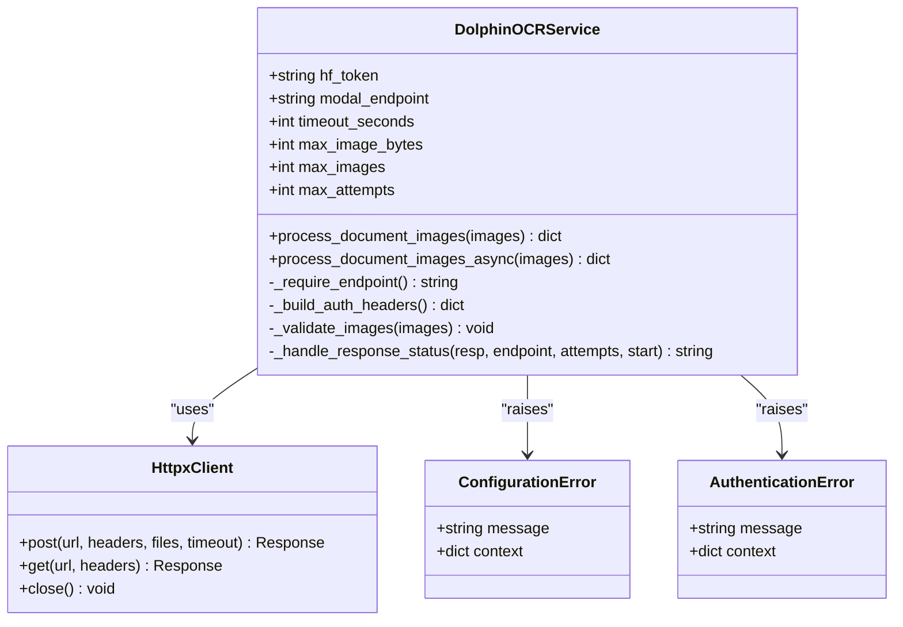
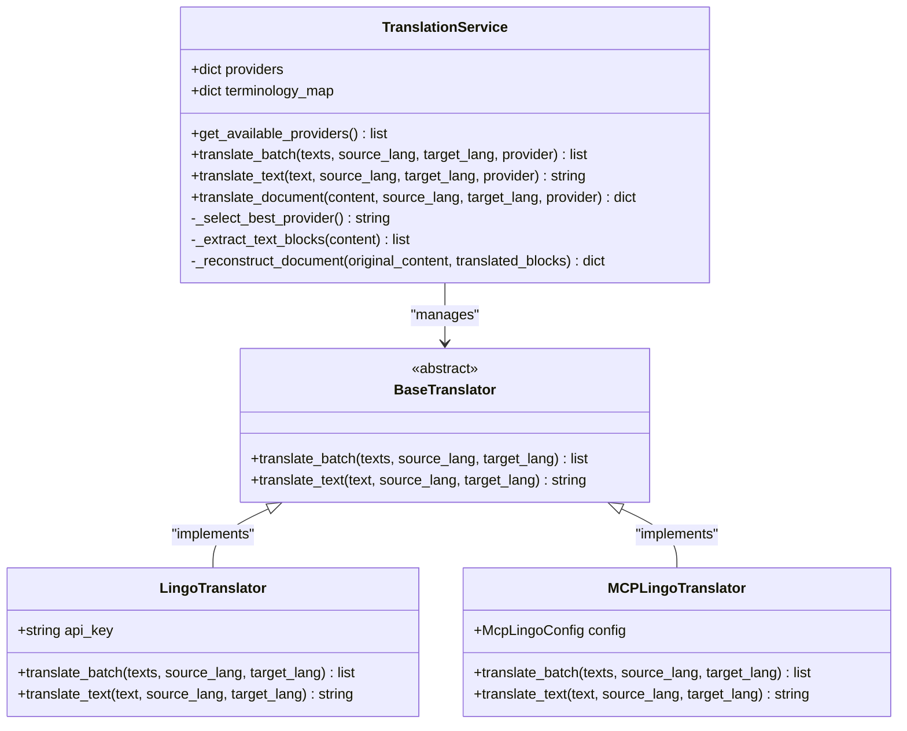
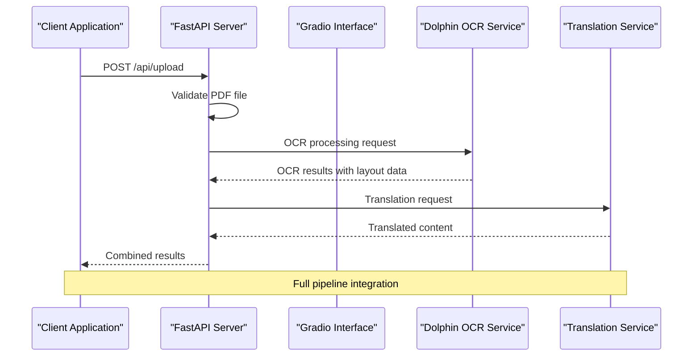

# Basic Usage Examples

<cite>
**Referenced Files in This Document**
- [basic_usage.py](file://examples/basic_usage.py)
- [dolphin_ocr_service.py](file://services/dolphin_ocr_service.py)
- [translation_service.py](file://services/translation_service.py)
- [routes.py](file://api/routes.py)
- [gradio_interface.py](file://ui/gradio_interface.py)
- [main.py](file://config/main.py)
- [app.py](file://app.py)
- [README.md](file://README.md)
</cite>

## Table of Contents
1. [Introduction](#introduction)
2. [Getting Started](#getting-started)
3. [Step-by-Step Workflow](#step-by-step-workflow)
4. [Core Services Architecture](#core-services-architecture)
5. [API Integration Patterns](#api-integration-patterns)
6. [Error Handling and Troubleshooting](#error-handling-and-troubleshooting)
7. [Expected Output and Verification](#expected-output-and-verification)
8. [Best Practices](#best-practices)
9. [Advanced Configuration](#advanced-configuration)

## Introduction

The PhenomenalLayout project demonstrates advanced document translation capabilities with layout preservation. This basic usage example showcases how to integrate with the Dolphin OCR Modal service and translation pipeline through a simple Python script. The example demonstrates the complete workflow from document upload to translation result retrieval, providing a foundation for understanding the underlying service architecture.

The basic usage example serves as an entry point for developers new to the project, showing practical implementation patterns for integrating with external OCR and translation services. It demonstrates essential concepts including service health checks, authentication, file upload procedures, and result processing.

## Getting Started

### Prerequisites

Before running the basic usage example, ensure you have:

1. **Python Environment**: Python 3.8 or higher
2. **Required Dependencies**: Install via `pip install -r requirements.txt`
3. **Environment Variables**: Configure necessary API keys and endpoints

### Environment Configuration

Set up your environment variables for the Dolphin OCR service:

```bash
# Dolphin OCR service URL (required)
export DOLPHIN_SERVICE_URL="https://your-dolphin-modal-domain.com"

# Optional: Authentication key (only if service requires it)
export ADMIN_API_KEY="your-admin-api-key"

# Translation API key (required for translation functionality)
export LINGO_API_KEY="your-lingo-api-key"
```

### Test Document Preparation

Create a test PDF document named `test_document.pdf` in the working directory. This document will be processed through the OCR and translation pipeline.

**Section sources**
- [basic_usage.py](file://examples/basic_usage.py#L1-L50)
- [README.md](file://README.md#L1-L100)

## Step-by-Step Workflow

### 1. Service Health Check

The first step in the workflow is to verify that the Dolphin OCR service is accessible and operational:

```python
# Service configuration
service_url = os.getenv("DOLPHIN_SERVICE_URL")
api_key = os.getenv("ADMIN_API_KEY")

# Health check
print("🔍 Checking service health...")
response = await client.get(f"{service_url}/health")
if response.status_code == 200:
    print("✅ Service is healthy")
else:
    print(f"❌ Service unhealthy: {response.status_code}")
    return
```

This health check ensures that:
- The Dolphin OCR service endpoint is reachable
- Network connectivity is established
- Basic service functionality is confirmed

### 2. Service Information Retrieval

After confirming service health, retrieve detailed service information:

```python
headers = {}
if api_key:
    headers["X-API-Key"] = api_key

print("📋 Getting service information...")
response = await client.get(f"{service_url}/", headers=headers)
if response.status_code == 200:
    info = response.json()
    print(f"   Service: {info['name']}")
    print(f"   Max file size: {info['limits']['max_file_size_mb']}MB")
    print(f"   Rate limit: {info.get('rate_limit', 'Not specified')}")
elif response.status_code == 401:
    print("   ⚠️  Authentication required (set ADMIN_API_KEY)")
```

This step provides:
- Service metadata and capabilities
- File size limitations
- Rate limiting information
- Authentication requirements

### 3. Document Upload and Processing

The core processing involves uploading a PDF document and receiving OCR results:

```python
test_pdf = Path("test_document.pdf")
if test_pdf.exists():
    print(f"📄 Processing PDF: {test_pdf}")

    with open(test_pdf, "rb") as f:
        files = {"pdf_file": (test_pdf.name, f, "application/pdf")}

        response = await client.post(
            f"{service_url}/", files=files, headers=headers
        )

    if response.status_code == 200:
        result = response.json()
        pages = result.get("pages", [])
        print(f"   ✅ Successfully processed {len(pages)} pages")

        # Save results
        output_file = Path(f"result_{test_pdf.stem}.json")
        with open(output_file, "w") as f:
            json.dump(result, f, indent=2)
        print(f"   💾 Results saved to: {output_file}")
```

This process handles:
- File validation and preparation
- Multipart form data creation
- HTTP POST request with file attachment
- Response processing and result storage

**Section sources**
- [basic_usage.py](file://examples/basic_usage.py#L50-L114)

## Core Services Architecture

### Dolphin OCR Service Integration

The Dolphin OCR service acts as the primary document analysis engine, providing layout-aware text extraction:



**Diagram sources**
- [dolphin_ocr_service.py](file://services/dolphin_ocr_service.py#L50-L150)

### Translation Service Integration

The translation service provides high-quality text translation with layout awareness:



**Diagram sources**
- [translation_service.py](file://services/translation_service.py#L218-L350)

### FastAPI Integration

The FastAPI application provides the web interface and API endpoints:



**Diagram sources**
- [routes.py](file://api/routes.py#L1-L100)
- [gradio_interface.py](file://ui/gradio_interface.py#L1-L50)

**Section sources**
- [dolphin_ocr_service.py](file://services/dolphin_ocr_service.py#L1-L100)
- [translation_service.py](file://services/translation_service.py#L1-L100)
- [routes.py](file://api/routes.py#L1-L50)

## API Integration Patterns

### HTTP Client Configuration

The basic usage example demonstrates proper HTTP client configuration with timeouts and error handling:

```python
client = httpx.AsyncClient(timeout=30.0)

try:
    # Service operations
    response = await client.get(f"{service_url}/health")
    # Process response...
finally:
    await client.aclose()
```

Key configuration aspects:
- **Timeout Management**: 30-second timeout for all requests
- **Connection Lifecycle**: Proper client lifecycle management
- **Error Handling**: Graceful handling of network and service errors

### Authentication Pattern

The example shows both authenticated and unauthenticated service access:

```python
headers = {}
if api_key:
    headers["X-API-Key"] = api_key

# Use headers in all authenticated requests
response = await client.get(f"{service_url}/", headers=headers)
```

### File Upload Pattern

Proper multipart form data handling for PDF uploads:

```python
with open(test_pdf, "rb") as f:
    files = {"pdf_file": (test_pdf.name, f, "application/pdf")}

    response = await client.post(
        f"{service_url}/", files=files, headers=headers
    )
```

**Section sources**
- [basic_usage.py](file://examples/basic_usage.py#L30-L80)

## Error Handling and Troubleshooting

### Common Error Scenarios

#### Service Unavailability
```python
if response.status_code == 401:
    print("   ❌ Authentication failed")
elif response.status_code == 429:
    print("   ❌ Rate limit exceeded - please wait")
else:
    print(f"   ❌ Processing failed: {response.status_code}")
    try:
        error = response.json()
        print(f"      Error: {error.get('error', 'Unknown')}")
    except (json.JSONDecodeError, ValueError) as e:
        print(f"      Unable to parse error response as JSON: {e}")
```

#### Configuration Issues
```python
sentinel_url = "https://REPLACE_ME_DOLPHIN_SERVICE_URL"
if not service_url or service_url == sentinel_url:
    print("❌ Error: DOLPHIN_SERVICE_URL environment variable is required")
    print("   Please set DOLPHIN_SERVICE_URL to your actual Dolphin OCR service URL")
    return
```

### Troubleshooting Checklist

1. **Environment Variables**
   - Verify `DOLPHIN_SERVICE_URL` is set correctly
   - Check `LINGO_API_KEY` validity
   - Confirm `ADMIN_API_KEY` if authentication is required

2. **Network Connectivity**
   - Test service URL accessibility
   - Verify firewall and proxy settings
   - Check DNS resolution

3. **File Issues**
   - Validate PDF file integrity
   - Check file permissions
   - Ensure sufficient disk space

4. **Service Health**
   - Confirm Dolphin OCR service availability
   - Verify translation service configuration
   - Check rate limiting status

### Debugging Tools

Enable detailed logging for troubleshooting:

```python
import logging
logging.basicConfig(level=logging.DEBUG)
```

Monitor HTTP requests and responses for insight into service communication.

**Section sources**
- [basic_usage.py](file://examples/basic_usage.py#L80-L114)

## Expected Output and Verification

### Successful Execution Flow

When the basic usage example executes successfully, you'll observe:

1. **Service Health Confirmation**: "✅ Service is healthy"
2. **Service Information Display**: Details about service capabilities
3. **File Processing**: "📄 Processing PDF: test_document.pdf"
4. **Success Confirmation**: "✅ Successfully processed X pages"
5. **Result Storage**: "💾 Results saved to: result_document.json"

### Output File Structure

The generated JSON file contains comprehensive OCR and layout data:

```json
{
  "pages": [
    {
      "page_number": 1,
      "width": 595,
      "height": 842,
      "text_elements": [
        {
          "text": "Extracted text content",
          "bbox": [x1, y1, x2, y2],
          "font": "Arial",
          "size": 12,
          "confidence": 0.95
        }
      ]
    }
  ],
  "metadata": {
    "total_pages": 5,
    "file_size": 1048576,
    "processing_time": 12.5
  }
}
```

### Verification Steps

1. **File Existence**: Check that the output file was created
2. **Content Validation**: Open the JSON file and verify structure
3. **Text Extraction**: Compare extracted text with original document
4. **Layout Preservation**: Verify bounding box coordinates match document layout
5. **Confidence Scores**: Review OCR confidence values for quality assessment

### Quality Metrics

The system provides various quality metrics:
- **OCR Confidence**: Numerical confidence scores for text extraction
- **Layout Preservation**: Metrics for maintaining original document structure
- **Processing Time**: Performance indicators for optimization
- **Error Rates**: Tracking of failed operations and retries

**Section sources**
- [basic_usage.py](file://examples/basic_usage.py#L90-L114)

## Best Practices

### Development Guidelines

1. **Environment Management**
   - Use `.env` files for environment variable management
   - Implement proper secret handling for API keys
   - Validate configuration at application startup

2. **Error Handling**
   - Implement comprehensive error catching and logging
   - Provide meaningful error messages to users
   - Gracefully handle service unavailability

3. **Resource Management**
   - Properly close HTTP clients and file handles
   - Implement timeout controls for all network operations
   - Monitor memory usage for large document processing

4. **Security Considerations**
   - Never log sensitive API keys or credentials
   - Use HTTPS for all service communications
   - Implement proper authentication when required

### Performance Optimization

1. **Concurrent Processing**
   - Leverage asynchronous HTTP clients for better performance
   - Implement proper connection pooling
   - Use appropriate timeout values

2. **File Handling**
   - Stream large files rather than loading entirely into memory
   - Implement proper file validation and sanitization
   - Use temporary files for intermediate processing

3. **Service Integration**
   - Implement retry mechanisms with exponential backoff
   - Use circuit breakers for unreliable services
   - Monitor service health and availability

### Code Organization

Structure your code following these patterns:

```python
# Configuration management
SERVICE_URL = os.getenv("DOLPHIN_SERVICE_URL")
API_KEY = os.getenv("ADMIN_API_KEY")

# Client initialization
client = httpx.AsyncClient(timeout=30.0)

# Main processing logic
async def process_document():
    try:
        await health_check()
        await upload_and_process()
        await result_verification()
    finally:
        await client.aclose()

# Error handling and logging
try:
    # Business logic
    pass
except SpecificException as e:
    logger.error(f"Specific error occurred: {e}")
    # Handle gracefully
except Exception as e:
    logger.error(f"Unexpected error: {e}")
    raise
```

**Section sources**
- [basic_usage.py](file://examples/basic_usage.py#L1-L114)
- [main.py](file://config/main.py#L1-L100)

## Advanced Configuration

### Environment Variable Reference

The basic usage example supports several environment variables for customization:

| Variable | Description | Default | Required |
|----------|-------------|---------|----------|
| `DOLPHIN_SERVICE_URL` | Dolphin OCR service endpoint | None | Yes |
| `ADMIN_API_KEY` | Authentication key for protected services | None | No |
| `LINGO_API_KEY` | Translation service API key | None | Yes |
| `MAX_CONCURRENT_REQUESTS` | Parallel processing limit | 10 | No |
| `MAX_REQUESTS_PER_SECOND` | Rate limiting | 5.0 | No |
| `TRANSLATION_BATCH_SIZE` | Translation batch size | 50 | No |

### Customization Options

#### Service Endpoint Configuration
```python
# Custom service URL
os.environ["DOLPHIN_SERVICE_URL"] = "https://custom-dolphin-domain.com"

# Authentication
os.environ["ADMIN_API_KEY"] = "your-custom-key"
```

#### Performance Tuning
```python
# High-performance settings
os.environ["MAX_CONCURRENT_REQUESTS"] = "15"
os.environ["MAX_REQUESTS_PER_SECOND"] = "8.0"
os.environ["TRANSLATION_BATCH_SIZE"] = "100"
```

#### Debug Mode
```python
# Enable detailed logging
import logging
logging.basicConfig(level=logging.DEBUG)

# Set debug environment
os.environ["DEBUG"] = "true"
```

### Integration Patterns

#### Batch Processing
For processing multiple documents efficiently:

```python
async def process_multiple_documents(documents: list[str]):
    tasks = []
    for doc in documents:
        task = process_single_document(doc)
        tasks.append(task)

    results = await asyncio.gather(*tasks, return_exceptions=True)
    return results
```

#### Error Recovery
Implement robust error recovery mechanisms:

```python
async def resilient_ocr_processing(document_path: str, max_retries: int = 3):
    for attempt in range(max_retries):
        try:
            return await process_document(document_path)
        except ServiceUnavailableError as e:
            if attempt == max_retries - 1:
                raise
            await asyncio.sleep(2 ** attempt)  # Exponential backoff
```

### Monitoring and Observability

Implement comprehensive monitoring:

```python
import time
from functools import wraps

def monitor_performance(func):
    @wraps(func)
    async def wrapper(*args, **kwargs):
        start_time = time.time()
        try:
            result = await func(*args, **kwargs)
            logger.info(f"{func.__name__} completed in {time.time() - start_time:.2f}s")
            return result
        except Exception as e:
            logger.error(f"{func.__name__} failed after {time.time() - start_time:.2f}s: {e}")
            raise
    return wrapper
```

**Section sources**
- [main.py](file://config/main.py#L1-L200)
- [README.md](file://README.md#L200-L300)
