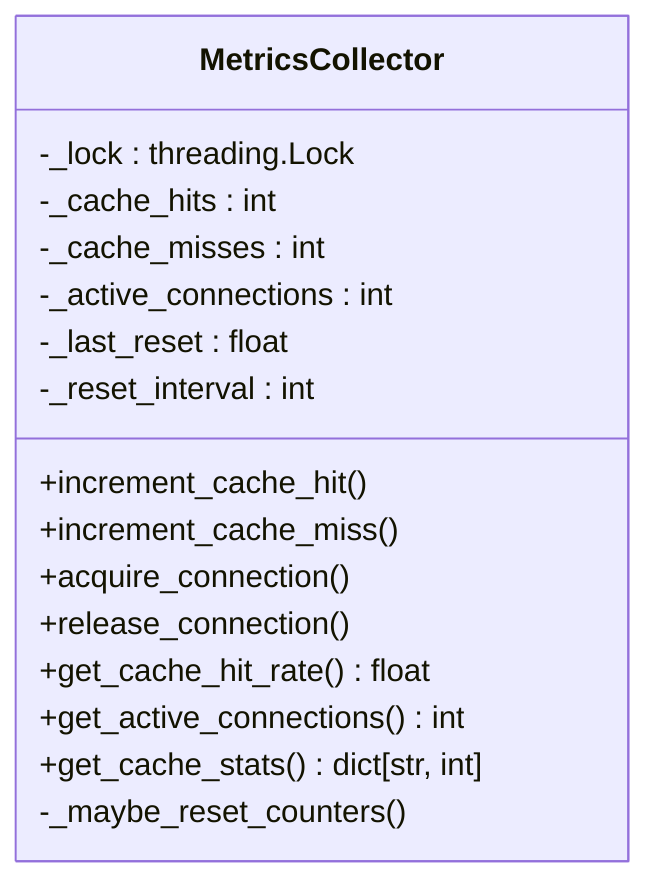
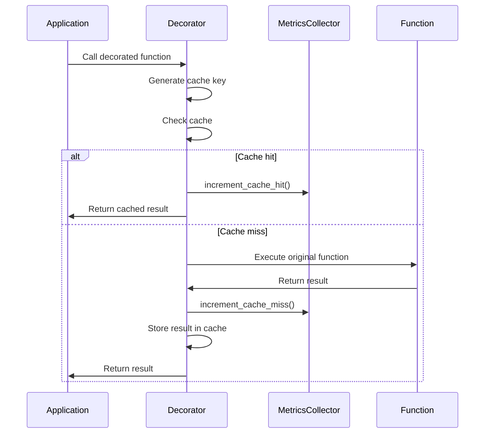
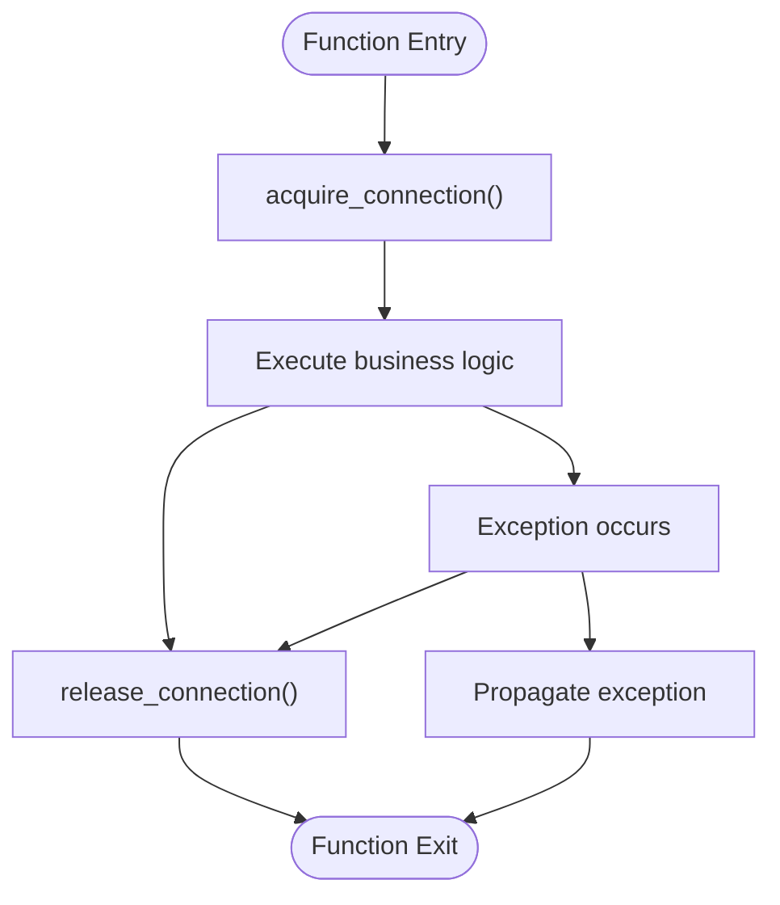
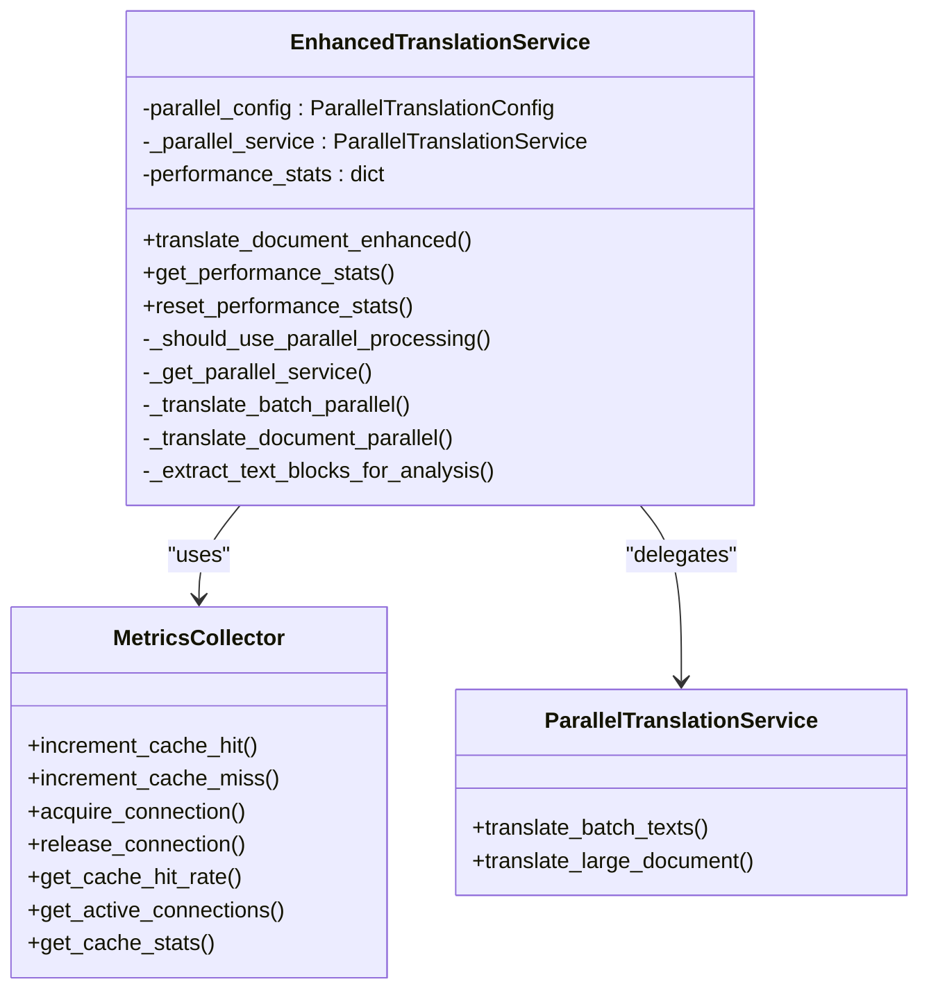
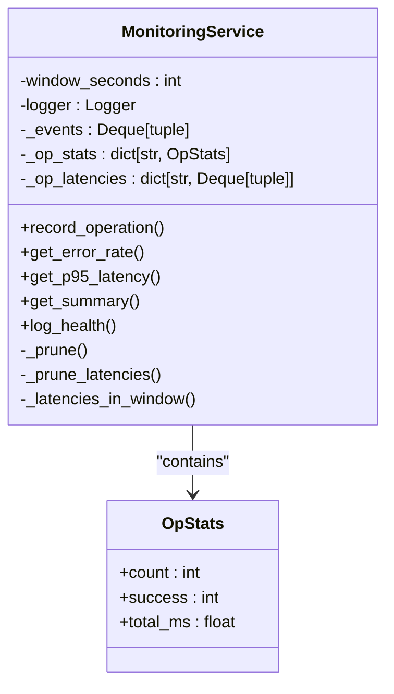

# Cache and Connection Metrics

<cite>
**Referenced Files in This Document**  
- [performance_optimization_examples.py](file://examples/performance_optimization_examples.py)
- [cache_metrics_demo.py](file://examples/cache_metrics_demo.py)
- [test_metrics.py](file://examples/test_metrics.py)
- [monitoring.py](file://dolphin_ocr/monitoring.py)
- [enhanced_translation_service.py](file://services/enhanced_translation_service.py)
</cite>

## Table of Contents
1. [Introduction](#introduction)
2. [Metrics Collector Implementation](#metrics-collector-implementation)
3. [Cache Instrumentation](#cache-instrumentation)
4. [Connection Tracking](#connection-tracking)
5. [Integration with Translation Services](#integration-with-translation-services)
6. [Monitoring and Performance Analysis](#monitoring-and-performance-analysis)
7. [Production Usage and Optimization](#production-usage-and-optimization)
8. [Accessing and Interpreting Metrics](#accessing-and-interpreting-metrics)
9. [Conclusion](#conclusion)

## Introduction
This document details the cache and connection metrics monitoring system implemented in the PhenomenalLayout repository. The system provides comprehensive tracking of cache performance and connection usage through a thread-safe metrics collector, cache instrumentation decorators, and context managers for connection tracking. These tools enable developers to monitor application performance, identify inefficiencies, and optimize resource usage in both development and production environments.

The metrics system is designed to be non-intrusive and easy to integrate, allowing teams to gain valuable insights into application behavior without significant code changes. By tracking cache hit rates and active connections, the system helps identify performance bottlenecks, inefficient caching patterns, and potential connection leaks that could impact application stability and scalability.

**Section sources**
- [performance_optimization_examples.py](file://examples/performance_optimization_examples.py#L35-L98)
- [cache_metrics_demo.py](file://examples/cache_metrics_demo.py#L1-L194)

## Metrics Collector Implementation

The `MetricsCollector` class provides thread-safe tracking of cache and connection metrics. Implemented as a singleton pattern with a global instance, it ensures consistent metrics collection across the application while preventing race conditions in multi-threaded environments.



**Diagram sources**
- [performance_optimization_examples.py](file://examples/performance_optimization_examples.py#L35-L98)

The collector maintains several key metrics:
- **Cache hits and misses**: Track successful and unsuccessful cache lookups
- **Active connections**: Monitor the number of currently active database or API connections
- **Cache hit rate**: Calculate the percentage of cache hits versus total requests

To prevent unbounded counter growth, the collector automatically resets counters every hour. This periodic reset ensures that metrics reflect recent performance rather than cumulative values over the application's entire lifetime, making them more useful for identifying current performance trends.

The thread-safe implementation uses a `threading.Lock` to protect all counter operations, ensuring data consistency in concurrent environments. This is particularly important in web applications where multiple requests may access the metrics simultaneously.

**Section sources**
- [performance_optimization_examples.py](file://examples/performance_optimization_examples.py#L35-L98)

## Cache Instrumentation

The `instrument_cache` decorator provides automatic tracking of cache operations by intercepting function calls and updating metrics based on cache hit/miss outcomes. This decorator is designed to work seamlessly with both regular functions and class methods, handling the complexities of Python's descriptor protocol.



**Diagram sources**
- [performance_optimization_examples.py](file://examples/performance_optimization_examples.py#L154-L233)
- [performance_optimization_examples.py](file://examples/performance_optimization_examples.py#L35-L98)

Key features of the cache instrumentation include:
- **Per-instance caching**: For class methods, cache storage is maintained separately for each instance using `WeakKeyDictionary` to prevent memory leaks
- **Global caching**: For standalone functions, a global cache is maintained within the wrapper's `__dict__`
- **Robust method detection**: The decorator intelligently determines whether a function is a bound method by examining various attributes and types
- **Proper exception handling**: Only `KeyError` exceptions from cache lookups are treated as cache misses; other exceptions are propagated normally

The decorator creates cache keys based on function arguments, excluding the first argument (typically `self` or `cls` for methods). This ensures that different instances or different method calls with the same parameters share the same cache entry when appropriate.

**Section sources**
- [performance_optimization_examples.py](file://examples/performance_optimization_examples.py#L154-L233)
- [cache_metrics_demo.py](file://examples/cache_metrics_demo.py#L194-L200)

## Connection Tracking

Connection tracking is implemented through context managers that automatically update the metrics collector when connections are acquired and released. This approach ensures that connection counters are always accurate, even in the presence of exceptions.



**Diagram sources**
- [performance_optimization_examples.py](file://examples/performance_optimization_examples.py#L132-L145)

Two context managers are provided:
- `track_connection()`: Synchronous context manager for tracking database or API connections
- `track_async_connection()`: Asynchronous context manager for use with async/await patterns

Both context managers follow the same pattern:
1. Increment the active connections counter upon entry
2. Execute the wrapped code block
3. Decrement the counter upon exit, regardless of whether an exception occurred
4. Include exception logging in the synchronous version for debugging purposes

This implementation ensures that connection counters remain accurate even when exceptions cause early exits from the context. The use of context managers makes the tracking transparent to developers, requiring only minimal code changes to enable monitoring.

**Section sources**
- [performance_optimization_examples.py](file://examples/performance_optimization_examples.py#L132-L145)
- [cache_metrics_demo.py](file://examples/cache_metrics_demo.py#L127-L148)

## Integration with Translation Services

The metrics system is integrated with the enhanced translation service to monitor performance characteristics of translation operations. This integration provides valuable insights into the efficiency of the translation pipeline and helps identify optimization opportunities.



**Diagram sources**
- [enhanced_translation_service.py](file://services/enhanced_translation_service.py#L1-L242)
- [performance_optimization_examples.py](file://examples/performance_optimization_examples.py#L35-L98)

The enhanced translation service leverages the metrics system in several ways:
- **Performance statistics**: Tracks total requests, parallel vs. sequential usage, and processing times
- **Dynamic processing decisions**: Uses text count to determine whether to use parallel processing
- **Resource monitoring**: Integrates with the connection tracking system when making external API calls

The service maintains its own performance statistics in addition to the global metrics, providing both high-level usage patterns and detailed operational metrics. This dual approach allows for comprehensive performance analysis at multiple levels.

**Section sources**
- [enhanced_translation_service.py](file://services/enhanced_translation_service.py#L1-L242)
- [performance_optimization_examples.py](file://examples/performance_optimization_examples.py#L35-L98)

## Monitoring and Performance Analysis

The repository includes a comprehensive monitoring system that complements the cache and connection metrics with additional performance and error tracking capabilities. The `MonitoringService` class provides lightweight performance monitoring with minimal overhead.



**Diagram sources**
- [monitoring.py](file://dolphin_ocr/monitoring.py#L0-L121)

Key features of the monitoring system include:
- **Rolling window tracking**: Maintains recent events for calculating error rates and latencies
- **Operation statistics**: Tracks count, success rate, and average latency for each operation type
- **Percentile latencies**: Calculates p95 latency for performance analysis
- **Health reporting**: Provides summary statistics for system monitoring

The monitoring service works in conjunction with the metrics collector to provide a complete picture of application performance. While the metrics collector focuses on cache and connection metrics, the monitoring service tracks operation-level performance and error rates, creating a comprehensive monitoring solution.

**Section sources**
- [monitoring.py](file://dolphin_ocr/monitoring.py#L0-L121)
- [test_monitoring.py](file://tests/test_monitoring.py#L0-L79)

## Production Usage and Optimization

In production environments, the metrics system enables several key optimization strategies:

### Capacity Planning
By monitoring cache hit rates and active connections over time, teams can make informed decisions about:
- **Cache sizing**: Determine optimal cache sizes based on hit rates
- **Connection pooling**: Configure appropriate connection pool sizes
- **Resource allocation**: Scale infrastructure based on usage patterns

### Bottleneck Identification
The metrics help identify performance bottlenecks by highlighting:
- **Low cache hit rates**: Indicate inefficient caching strategies or insufficient cache size
- **High active connections**: Suggest potential connection leaks or inadequate connection pooling
- **Performance degradation**: Detect gradual performance issues before they become critical

### Performance Optimization
Teams can use the metrics to guide optimization efforts:
- **Cache strategy refinement**: Adjust cache invalidation policies based on hit/miss patterns
- **Connection management**: Identify and fix connection leaks through monitoring active connections
- **Algorithm improvement**: Use performance data to prioritize optimization of frequently called functions

The system's thread-safe design ensures reliable metrics collection in high-concurrency production environments, while the periodic counter reset prevents metric inflation over time.

**Section sources**
- [performance_optimization_examples.py](file://examples/performance_optimization_examples.py#L35-L98)
- [performance_optimization_examples.py](file://examples/performance_optimization_examples.py#L132-L145)

## Accessing and Interpreting Metrics

The metrics system provides several public API functions for accessing collected metrics:

```python
def get_cache_stats():
    """Get current cache statistics."""
    return _metrics_collector.get_cache_stats()

def get_cache_hit_rate():
    """Get current cache hit rate."""
    return _metrics_collector.get_cache_hit_rate()

def get_active_connections():
    """Get current number of active connections."""
    return _metrics_collector.get_active_connections()
```

These functions return the following information:
- **Cache statistics**: Total hits, misses, and overall count
- **Cache hit rate**: Percentage of cache hits (0.0 to 1.0)
- **Active connections**: Current number of tracked connections

When interpreting these metrics:
- **Cache hit rate above 80%**: Generally indicates efficient caching
- **Cache hit rate below 50%**: Suggests potential issues with cache strategy or size
- **Growing active connections**: May indicate connection leaks if not properly released
- **Stable active connections**: Indicates proper connection management

For production monitoring, these metrics can be integrated with external monitoring systems or exposed through health check endpoints to provide real-time visibility into application performance.

**Section sources**
- [performance_optimization_examples.py](file://examples/performance_optimization_examples.py#L100-L130)

## Conclusion
The cache and connection metrics system in the PhenomenalLayout repository provides a robust foundation for performance monitoring and optimization. By implementing thread-safe metrics collection, automatic cache instrumentation, and transparent connection tracking, the system enables developers to gain valuable insights into application behavior with minimal code changes.

The integration of these metrics with translation services and other components demonstrates their practical utility in real-world scenarios. By monitoring cache efficiency and connection usage, teams can identify performance bottlenecks, prevent resource leaks, and make data-driven decisions about system optimization and capacity planning.

The combination of the `MetricsCollector`, `instrument_cache` decorator, and connection tracking context managers creates a comprehensive monitoring solution that is both powerful and easy to use. This system serves as a model for effective performance monitoring in complex applications, providing the data needed to maintain high performance and reliability in production environments.
