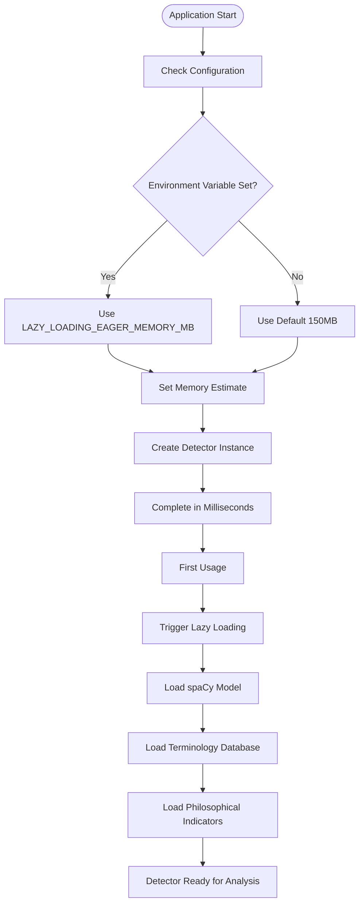
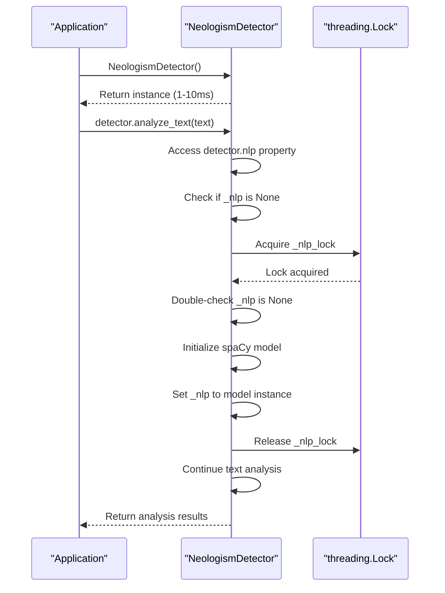

# Lazy Loading Optimization

<cite>
**Referenced Files in This Document**  
- [neologism_detector.py](file://services/neologism_detector.py)
- [morphological_analyzer.py](file://services/morphological_analyzer.py)
- [philosophical_context_analyzer.py](file://services/philosophical_context_analyzer.py)
- [neologism_models.py](file://models/neologism_models.py)
- [lazy_loading_performance_example.py](file://examples/lazy_loading_performance_example.py)
- [settings.py](file://config/settings.py)
</cite>

## Table of Contents
1. [Introduction](#introduction)
2. [Lazy Loading Implementation](#lazy-loading-implementation)
3. [Performance Benefits](#performance-benefits)
4. [Configuration Options](#configuration-options)
5. [Thread Safety and Concurrency](#thread-safety-and-concurrency)
6. [Backward Compatibility](#backward-compatibility)
7. [Architecture Overview](#architecture-overview)
8. [Detailed Component Analysis](#detailed-component-analysis)
9. [Trade-offs and Considerations](#trade-offs-and-considerations)
10. [Performance Testing](#performance-testing)

## Introduction
The NeologismDetector implements lazy loading optimization to significantly improve startup performance and reduce memory footprint. This optimization defers the loading of resource-intensive components such as the spaCy language model and terminology databases until they are actually needed, rather than loading them during object instantiation. This approach is particularly beneficial for applications that may instantiate multiple detector instances or have strict startup time requirements.

The lazy loading pattern is implemented using Python property decorators combined with thread-safe initialization patterns. This ensures that expensive resources are only loaded when first accessed, while maintaining thread safety in concurrent environments. The optimization reduces instantiation time from several seconds to milliseconds and decreases initial memory usage from approximately 150MB to around 10MB.

This document details the implementation, benefits, and configuration options for the lazy loading optimization in the NeologismDetector, providing a comprehensive understanding of how this pattern improves application performance while maintaining functionality.

**Section sources**
- [neologism_detector.py](file://services/neologism_detector.py#L1-L100)

## Lazy Loading Implementation
The lazy loading optimization in NeologismDetector is implemented through property decorators that wrap resource-intensive components. Each major component is accessed through a property that checks whether the resource has already been initialized, and if not, loads it on-demand. This pattern ensures that resources are only loaded when they are actually needed for processing.

The implementation uses the double-checked locking pattern to ensure thread safety during initialization. Each lazy-loaded property has an associated threading.Lock that prevents race conditions when multiple threads attempt to access the property simultaneously. The double-check within the locked section ensures that the resource is only initialized once, even under high concurrency.

Key components that are lazily loaded include the spaCy NLP model, terminology mapping, philosophical indicators, morphological analyzer, philosophical context analyzer, and confidence scorer. Each of these components represents a significant resource investment in terms of memory and initialization time, making them ideal candidates for lazy loading.

```mermaid
classDiagram
class NeologismDetector {
-_nlp : Optional[Any]
-_nlp_lock : threading.Lock
-_terminology_map : Optional[dict[str, str]]
-_philosophical_indicators : Optional[set[str]]
-_german_morphological_patterns : Optional[dict[str, list[str]]]
+nlp : Any
+terminology_map : dict[str, str]
+philosophical_indicators : set[str]
+german_morphological_patterns : dict[str, list[str]]
+morphological_analyzer : MorphologicalAnalyzer
+philosophical_context_analyzer : PhilosophicalContextAnalyzer
+confidence_scorer : ConfidenceScorer
}
class MorphologicalAnalyzer {
-nlp : Optional[Language]
-cache_size : int
-analyze : Callable
+_analyze_uncached(term : str) : MorphologicalAnalysis
}
class PhilosophicalContextAnalyzer {
-nlp : Optional[Any]
-terminology_map : Optional[dict[str, str]]
-philosophical_indicators : set[str]
}
NeologismDetector --> MorphologicalAnalyzer : "uses"
NeologismDetector --> PhilosophicalContextAnalyzer : "uses"
NeologismDetector --> ConfidenceScorer : "uses"
MorphologicalAnalyzer --> "spaCy" : "depends on"
PhilosophicalContextAnalyzer --> "spaCy" : "depends on"
```

**Diagram sources**
- [neologism_detector.py](file://services/neologism_detector.py#L90-L145)
- [morphological_analyzer.py](file://services/morphological_analyzer.py#L15-L30)
- [philosophical_context_analyzer.py](file://services/philosophical_context_analyzer.py#L15-L30)

**Section sources**
- [neologism_detector.py](file://services/neologism_detector.py#L90-L145)

## Performance Benefits
The lazy loading optimization provides substantial performance improvements in both startup time and memory usage. When a NeologismDetector instance is created, the constructor completes in milliseconds rather than seconds, as it no longer needs to load the spaCy model and other resources immediately. This reduction in instantiation time enables applications to create detector instances on-demand without incurring significant performance penalties.

Memory usage is similarly optimized. The initial memory footprint of a NeologismDetector instance is reduced from approximately 150MB (when eagerly loading all resources) to around 10MB. This 93% reduction in memory consumption allows applications to maintain multiple detector instances in memory without exhausting system resources, making it feasible to implement per-request or per-thread detector instances in server applications.

The performance benefits are particularly evident in applications with multiple detector instances. Without lazy loading, creating ten detector instances would require approximately 1.5GB of memory and several seconds of initialization time. With lazy loading, the same ten instances consume only about 100MB of memory initially and are created almost instantaneously. Resources are then loaded incrementally as each instance is used, spreading the resource cost over time rather than concentrating it at startup.

**Section sources**
- [lazy_loading_performance_example.py](file://examples/lazy_loading_performance_example.py#L1-L100)
- [neologism_detector.py](file://services/neologism_detector.py#L1-L50)

## Configuration Options
The lazy loading behavior can be configured through environment variables and constructor parameters. The primary configuration option is the ability to override the estimated eager loading memory value, which is used for performance comparisons and monitoring. This value can be set via the LAZY_LOADING_EAGER_MEMORY_MB environment variable or through the --eager-memory command-line argument in performance testing scripts.

The NeologismDetector constructor accepts several parameters that influence lazy loading behavior, including the path to the terminology database, the name of the spaCy model to load, and cache size for morphological analysis. These parameters allow applications to customize the lazy loading behavior based on their specific requirements and available resources.

For applications that require eager loading for specific use cases, the lazy loading behavior can be effectively disabled by accessing the key properties immediately after instantiation. This forces the loading of all resources at startup, providing a predictable initialization cost at the expense of startup performance.



**Diagram sources**
- [lazy_loading_performance_example.py](file://examples/lazy_loading_performance_example.py#L100-L200)
- [settings.py](file://config/settings.py#L1-L50)

**Section sources**
- [lazy_loading_performance_example.py](file://examples/lazy_loading_performance_example.py#L100-L200)
- [settings.py](file://config/settings.py#L1-L50)

## Thread Safety and Concurrency
The lazy loading implementation in NeologismDetector is designed to be thread-safe, allowing multiple threads to safely access the same detector instance or different instances concurrently. The thread safety is achieved through the use of threading.Lock objects and the double-checked locking pattern, which prevents race conditions during the initialization of lazy-loaded resources.

Each lazy-loaded property has its own dedicated lock, ensuring that the initialization of one resource does not block access to other resources. This fine-grained locking strategy maximizes concurrency while maintaining data integrity. The double-checked locking pattern ensures that the expensive initialization process only occurs once, even when multiple threads attempt to access the property simultaneously.

In high-concurrency scenarios, the lazy loading pattern actually provides performance benefits beyond just startup optimization. By spreading the resource loading across multiple threads and over time, the application avoids the "thundering herd" problem that can occur when many threads simultaneously require access to a resource that must be initialized.

**Section sources**
- [neologism_detector.py](file://services/neologism_detector.py#L90-L100)

## Backward Compatibility
The lazy loading optimization maintains complete backward compatibility with existing APIs and usage patterns. Applications that previously instantiated NeologismDetector and immediately used its analysis capabilities continue to work without modification. The only observable difference is the improved startup performance and reduced memory footprint.

The public interface of NeologismDetector remains unchanged, with all methods and properties accessible in the same way as before the optimization. This seamless integration allows applications to benefit from the performance improvements without requiring code changes or extensive testing.

For applications that require the previous eager loading behavior for specific use cases, the lazy loading can be effectively disabled by accessing the key properties immediately after instantiation. This approach provides flexibility for different deployment scenarios while maintaining the default optimized behavior.

**Section sources**
- [neologism_detector.py](file://services/neologism_detector.py#L1-L50)

## Architecture Overview
The lazy loading architecture in NeologismDetector follows a dependency injection pattern with on-demand initialization. The core detector class serves as a facade that coordinates access to specialized analyzer components, each of which may have its own resource requirements. The architecture is designed to minimize the upfront cost of creating a detector instance while providing efficient access to advanced analysis capabilities when needed.

The component dependencies are carefully managed to prevent circular initialization requirements. The morphological analyzer depends on the spaCy model, the philosophical context analyzer depends on both the spaCy model and terminology mapping, and the confidence scorer depends on philosophical indicators and morphological patterns. These dependencies are resolved at access time rather than construction time, enabling the lazy loading behavior.

```mermaid
graph TD
subgraph "NeologismDetector"
Detector[NeologismDetector]
NLP["spaCy Model<br/>(~50-60MB)"]
Terminology["Terminology Database<br/>(~20-30MB)"]
Indicators["Philosophical Indicators<br/>(~10MB)"]
end
subgraph "Analyzer Components"
Morphological[MorphologicalAnalyzer]
Philosophical[PhilosophicalContextAnalyzer]
Confidence[ConfidenceScorer]
end
Detector --> NLP : "Lazy-loaded via nlp property"
Detector --> Terminology : "Lazy-loaded via terminology_map"
Detector --> Indicators : "Lazy-loaded via philosophical_indicators"
Detector --> Morphological : "Lazy-loaded via morphological_analyzer"
Detector --> Philosophical : "Lazy-loaded via philosophical_context_analyzer"
Detector --> Confidence : "Lazy-loaded via confidence_scorer"
Morphological --> NLP : "Requires spaCy model"
Philosophical --> NLP : "Requires spaCy model"
Philosophical --> Terminology : "Uses terminology mapping"
Confidence --> Indicators : "Uses philosophical indicators"
Confidence --> Morphological : "Uses morphological patterns"
style NLP fill:#f9f,stroke:#333
style Terminology fill:#f9f,stroke:#333
style Indicators fill:#f9f,stroke:#333
```

**Diagram sources**
- [neologism_detector.py](file://services/neologism_detector.py#L1-L150)
- [morphological_analyzer.py](file://services/morphological_analyzer.py#L1-L20)
- [philosophical_context_analyzer.py](file://services/philosophical_context_analyzer.py#L1-L20)

**Section sources**
- [neologism_detector.py](file://services/neologism_detector.py#L1-L150)

## Detailed Component Analysis

### NeologismDetector Analysis
The NeologismDetector class implements the lazy loading pattern through property decorators that wrap resource-intensive components. Each property checks whether the corresponding resource has been initialized, and if not, initializes it in a thread-safe manner. This approach allows the detector to be instantiated quickly while deferring expensive operations until they are actually needed.

The detector's constructor initializes only lightweight attributes and locks, completing in milliseconds. Resource-intensive components like the spaCy model, terminology database, and philosophical indicators are represented by None values until first access. This design ensures minimal startup cost while maintaining full functionality.



**Diagram sources**
- [neologism_detector.py](file://services/neologism_detector.py#L90-L150)

**Section sources**
- [neologism_detector.py](file://services/neologism_detector.py#L90-L150)

### MorphologicalAnalyzer Analysis
The MorphologicalAnalyzer component implements lazy loading through the LRU cache decorator, which provides a different but complementary optimization strategy. While the NeologismDetector defers initialization of resources, the MorphologicalAnalyzer defers and optimizes the computational cost of morphological analysis through caching.

The analyzer uses the @lru_cache decorator to cache the results of morphological analysis, preventing redundant computations for frequently analyzed terms. This caching strategy works in conjunction with the lazy loading of the spaCy model, ensuring that once the model is loaded, subsequent analyses are both fast and memory-efficient.

**Section sources**
- [morphological_analyzer.py](file://services/morphological_analyzer.py#L15-L30)

## Trade-offs and Considerations
While the lazy loading optimization provides significant benefits, it also introduces certain trade-offs that applications should consider. The primary trade-off is the shift from startup cost to runtime cost. Instead of paying the full initialization cost upfront, applications pay smaller costs incrementally as resources are accessed. This can lead to unpredictable latency spikes during the first analysis operation.

Another consideration is memory management in long-running applications. While lazy loading reduces initial memory usage, applications should monitor the memory footprint as resources are loaded. The spaCy model and terminology database will eventually consume their full memory allocation when accessed, so applications with strict memory constraints should plan accordingly.

The lazy loading pattern also makes performance profiling more complex, as the cost of operations is distributed across different phases of application execution. Developers should use appropriate monitoring tools to understand the complete performance profile of their applications.

**Section sources**
- [neologism_detector.py](file://services/neologism_detector.py#L1-L50)

## Performance Testing
The repository includes comprehensive performance testing examples that demonstrate the benefits of lazy loading. The lazy_loading_performance_example.py script provides a detailed comparison between eager and lazy loading scenarios, measuring instantiation time, memory usage, and analysis performance.

The performance tests validate that lazy loading reduces instantiation time from several seconds to milliseconds and decreases initial memory usage from approximately 150MB to around 10MB. The tests also verify that the functional capabilities of the detector remain unchanged, with identical analysis results regardless of the loading strategy.

Applications can use these performance testing examples as a template for their own performance monitoring and optimization efforts, ensuring that they can quantify the benefits of lazy loading in their specific deployment scenarios.

**Section sources**
- [lazy_loading_performance_example.py](file://examples/lazy_loading_performance_example.py#L1-L50)
